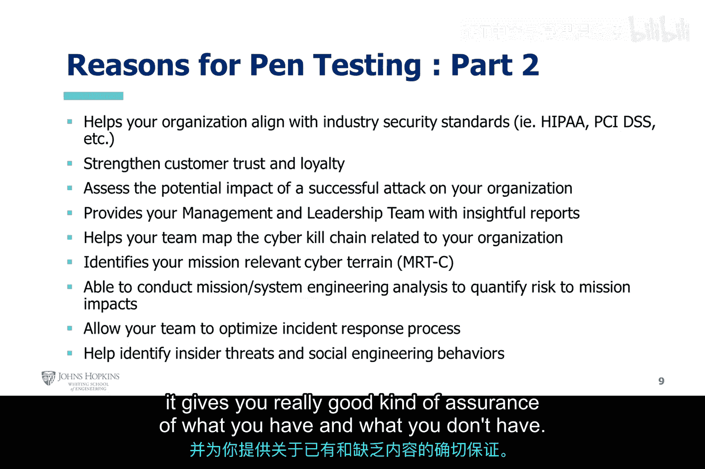

# 006：渗透测试必要性分析 🔍

在本节课中，我们将深入探讨为何需要进行渗透测试。我们将分析其核心目的、商业价值以及法律合规要求，帮助你理解渗透测试在网络安全体系中的关键作用。

## 课程概述

渗透测试的核心目标是在受控环境下识别安全漏洞，以便在未授权用户利用这些漏洞之前将其消除。这是一种由白帽黑客在道德准则、约定规则和明确范围内执行的活动，旨在帮助组织发现其环境中的安全缺陷、控制缺失或配置错误等问题。

## 渗透测试的主要目的

上一节我们介绍了渗透测试的基本概念，本节中我们来看看其具体目的。

渗透测试的根本目的是**识别受控环境下的安全漏洞**，其逻辑可以表示为：
**目标 = 识别漏洞 → 在漏洞被利用前修复**

这确保了风险最小化，并减少了对组织使命和声誉的潜在损害。渗透测试是一种有效的保障工具，能使企业及其运营受益。

## 进行渗透测试的商业与法律动因

了解了核心目的后，我们进一步探讨促使组织进行渗透测试的具体原因。以下是关键动因列表：

*   **降低经济损失**：根据近期研究，每次安全事件的平均恢复成本高达167,713美元。对于每年可能遭遇多次事件的组织而言，渗透测试是一项具有成本效益的前期投资。
*   **知己知彼**：借鉴《孙子兵法》的思想，了解对手（威胁行为体）的潜在能力和攻击方法，有助于更有效地部署防护措施。
*   **分析根本原因**：帮助厘清安全事件是由于疏忽、配置错误、策略不当，还是内部恶意人员或外部威胁（如国家支持的黑客、犯罪组织）所致。
*   **满足合规要求**：许多行业法规（如HIPAA, PCI DSS）强制要求进行安全审计和渗透测试。不合规可能导致巨额罚款、法律诉讼，甚至使组织无法继续运营。

## 渗透测试带来的具体益处

除了应对威胁和满足合规，渗透测试还能为组织带来多方面的积极影响。以下是其主要益处：

*   **发现并优先处理漏洞**：覆盖主要漏洞，并根据风险高低对其进行优先级排序。
*   **优化资源分配**：智能识别最需要投入资源的领域，展示现有安全措施的强项与弱点。
*   **提升团队能力**：训练安全团队更好地检测和响应攻击。
*   **指导治理与合规**：为完善治理和合规性提供信息支持。
*   **保护关键资产**：识别缺失的安全控制，重点保护最关键的业务资产。
*   **助力审计合规**：提供客观数据，帮助满足各类审计和法规要求。

## 渗透测试的战略价值

最后，我们来看看渗透测试如何从战略层面提升组织安全态势。

渗透测试还能帮助组织与行业安全标准（如RMF, CyberSafe）保持一致。它通过提供深刻的分析报告来增强消费者信任，并为管理层提供决策洞察。此外，它能评估成功攻击的业务影响，理解与自身使命相关的网络威胁图谱（如MITRE ATT&CK框架、网络杀伤链），并优化事件响应流程。一份详实的渗透测试报告不仅是历史记录，也是未来进行安全度量对比的基准。

## 课程总结

本节课中我们一起学习了进行渗透测试的多重必要性。从核心的“识别与修复漏洞”目的，到降低经济损失、满足法律合规等实际动因，再到优化资源、提升团队、辅助战略决策等广泛益处，渗透测试是现代组织网络安全防御体系中不可或缺的一环。它不仅是技术手段，更是风险管理、合规运营和战略规划的重要工具。