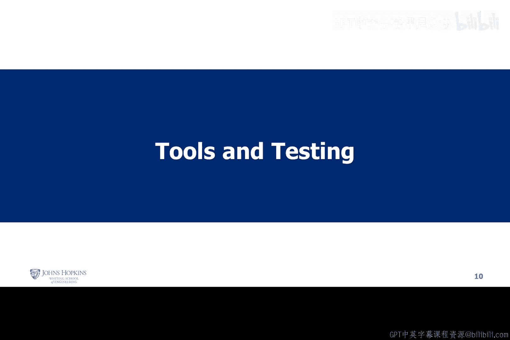
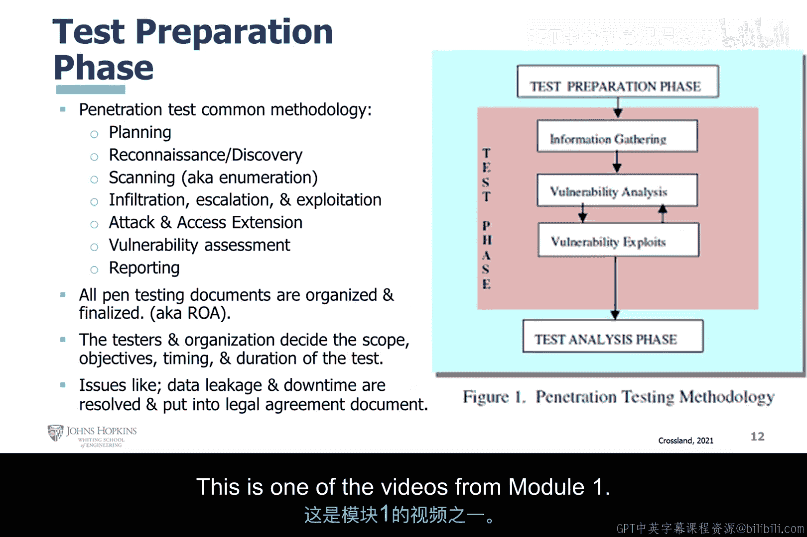

# 007：渗透测试工具链与流程

在本节课中，我们将学习渗透测试中常用的工具链以及执行测试的标准流程。我们将了解不同工具的分类、测试的各个阶段，以及如何规划一次成功的渗透测试。

## 工具链概述

上一节我们介绍了渗透测试的基本概念，本节中我们来看看执行测试时会用到哪些工具。这些工具并非详尽无遗的列表，但涵盖了多个类别。

以下是一些常见的工具类别及其用途：

*   **信息收集与扫描工具**：例如 **Nmap**（网络映射器）和 **Nessus**（漏洞扫描器）。Nessus 提供免费的个人版。这些工具用于发现网络中的主机、服务和漏洞。
*   **密码破解工具**：例如 **Brutus**（网络密码破解器）和 **Abel & Kain**。这些工具用于测试密码强度。
*   **指纹识别工具**：例如 **Xprobe2**（TCP/IP 堆栈指纹识别）和 **httprint**（Web 服务器指纹识别）。它们用于识别目标系统的具体类型和版本。
*   **专用探测工具**：例如用于检测 SSL/TLS 配置的工具，以及探测无线接入点、路由器、交换机等网络设备的工具。

许多工具集成在 **Kali Linux** 这类专为安全测试设计的操作系统中，它包含大量用于防御和攻击操作的软件工具套件。这些系统也可被白帽黑客和道德安全人员使用。

## 渗透测试阶段

理解了工具后，我们需要一个有序的流程来使用它们。渗透测试通常遵循一系列阶段。

下图概述了渗透测试的通用方法论，主要包含测试准备和测试分析两大阶段。

**测试准备阶段** 的核心是规划，包括信息收集、漏洞分析和攻击规划。

1.  **信息收集与侦察**：你必须了解目标。这包括收集数据，理解系统配置、存在的服务、可能的攻击入口（向量）以及需要使用的工具和技术（TTPs）。
2.  **漏洞分析**：通过扫描和枚举进行漏洞分析，确定系统的薄弱点。
3.  **攻击规划**：规划如何发动攻击。包括决定使用何种植入方式、如何交付攻击载荷、针对哪个系统以及具体的攻击方法。

**测试分析阶段** 发生在测试执行后，重点是评估与报告。

1.  **漏洞评估**：对发现的漏洞进行风险评级。
2.  **报告编写**：撰写渗透测试报告和面向管理层的执行摘要。

而中间的 **测试执行阶段** 则是一个动态循环的过程，对应图中的“发现”和“攻击”环节。美国国家标准与技术研究院（NIST）在 SP 800-115 标准中也描述了类似流程：规划、发现、攻击、报告。

在“发现-攻击”循环中，你可能发现一种攻击路径无效，这时需要返回“发现”阶段，重新进行侦察和枚举，寻找新的突破口，然后再次尝试攻击。这个过程可能包含权限提升、访问扩展、横向移动（Pivoting）等步骤。

## 测试规划的关键问题

在规划阶段，必须明确规则并获得授权。所有测试文档，如 **规则约定（Rules of Engagement, ROE）** 和 **访问规则（Rules of Access, ROA）**，都需要组织并最终确定。

测试团队需要根据目标决定测试技能、目标、时间和持续时间。必须提前识别并解决所有潜在问题。

以下是规划时必须提出的关键问题列表：

*   **成本与资源**：预算是多少？有哪些可用资源？测试需要多长时间？
*   **目标与范围**：数据所有者是谁？哪些数据和服务将被测试？有什么限制？
*   **规则与限制**：哪些操作是允许的？哪些是禁止的？是否涉及关键业务系统？某些攻击手法是否过于激进而不可用？
*   **业务背景**：目标系统的业务功能是什么？如果它们严重依赖 Web 界面，那么跨站脚本（XSS）或 SQL 注入就是重点；如果依赖无线网络，那么 Wi-Fi 安全就是关键。理解这些有助于确定测试重点。

## 渗透测试的核心价值

最后，我们来总结一下进行渗透测试的核心目的与价值。它远不止于“攻击系统”。

以下是渗透测试带来的主要益处：

*   **保护关键数据**：这是最重要的目标。
*   **识别安全控制缺陷**：发现需要实施或改进的安全措施。
*   **优化资源分配**：智能地确定资源投入和缓解策略，实现投资回报最大化。你需要将漏洞按风险（高、中、低）排序，优先处理高风险漏洞。
*   **提升安全能力**：理解自身弱点能极大改善事件响应处理能力，并加强防御措施。
*   **训练安全团队**：让团队更好地学习如何检测和响应攻击，这比完全依赖外部第三方更经济有效。
*   **识别关键网络地形**：了解与核心业务相关的网络资产、优势和弱点，理解系统间的依赖关系。
*   **量化任务风险**：能够分析并量化网络安全风险对核心业务任务的影响，确保业务连续性。

本节课中我们一起学习了渗透测试的工具分类、标准测试流程（包括规划、执行、报告的各个阶段），以及进行周密规划必须考虑的关键问题。最重要的是，我们明确了渗透测试的最终目标是提升组织的整体安全态势，而不仅仅是发现漏洞。

希望你对本模块的内容有所收获。部分内容也会体现在本模块的评分中。

