# 008：渗透测试方法论 📊

在本节课中，我们将学习渗透测试的核心组成部分，并重点探讨如何撰写一份专业的渗透测试报告。我们将以渗透测试执行标准（PTES）为主要框架，同时也会简要介绍其他类似的方法论。

---

## 概述

渗透测试远不止于最终的报告。PTES 方法论提供了一个包含多个阶段的完整流程，确保测试的系统性和可重复性。报告是整个流程的结晶，其质量直接依赖于前期各阶段的执行深度。

上一节我们介绍了渗透测试的基本概念，本节中我们来看看构成一次完整渗透测试的具体步骤与核心产出。

---

## 渗透测试的定义与目标

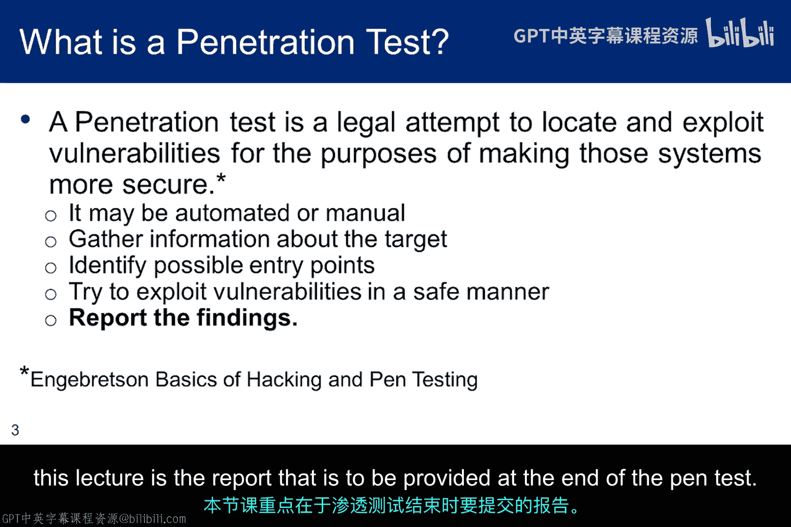

渗透测试被定义为“对计算机系统进行授权的、模拟的攻击，以评估其安全性”。虽然这个定义简洁，但一次完整的渗透测试包含更多属性。

真正的关键在于向客户汇报时，需要识别与当前基础设施和配置相关的**风险**，以及对业务的**潜在影响**。如果不存在风险，客户则无需投资改进。但如果存在影响其核心业务的风险，客户需要了解潜在的业务影响和缓解建议，以便做出投资权衡决策。

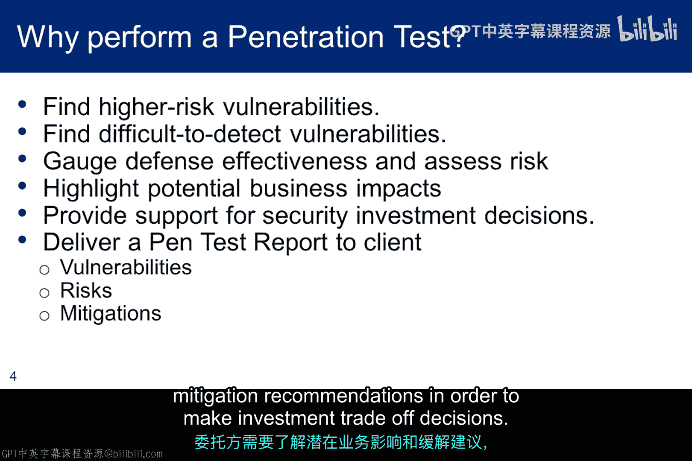

---

## 方法论的重要性：PTES

为了有效进行测试，你需要一个定义清晰、可管理且可重复的方法论，并明确界定测试的边界、目标以及非目标（例如，明确标识禁止测试的组件）。

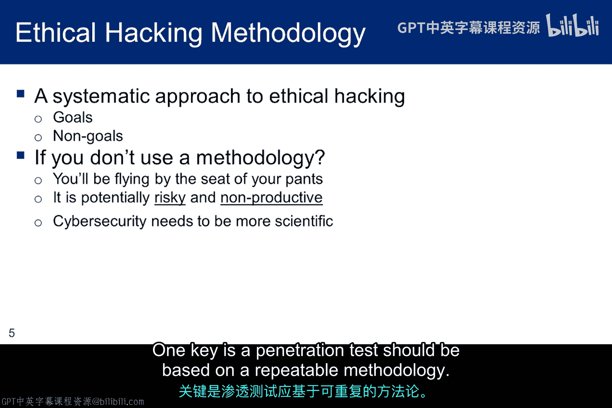

一次渗透测试只是安全状况的一个“快照”，单份报告的价值会随时间迅速降低。因此，测试需要定期进行。虽然客户可能希望只做一次扫描就一劳永逸（这样成本更低），但这是有风险的。因为测试一结束，新的漏洞（甚至是零日漏洞）就可能出现。威胁在演变，系统在更新，安全机制必须被定期测试和再测试，才能真正保护企业。

PTES 方法论包含以下七个阶段：

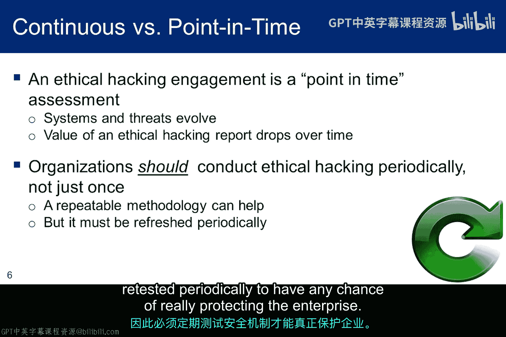

1.  **前期交互**：与客户（赞助方）确定合同和测试规则。
2.  **情报收集**：收集关于组织的企业及人员情报。
3.  **威胁建模**：确定对业务资产和流程的潜在威胁。
4.  **漏洞分析**：实际扫描计算资产以发现漏洞。
5.  **漏洞利用**：尝试利用发现的漏洞。
6.  **后渗透活动**：在成功渗透后进行的活动。
7.  **报告撰写**：汇总所有发现并形成报告。

报告与方法的其他部分紧密耦合。只有在充分执行了其他阶段后，才能撰写出一份有意义、有用的报告。

---

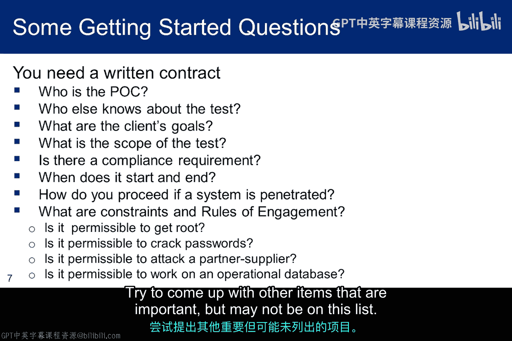

## 前期交互与问题界定

测试的第一步是与客户会面，界定测试范围。以下是需要向客户提出的关键问题示例，用于指导测试：

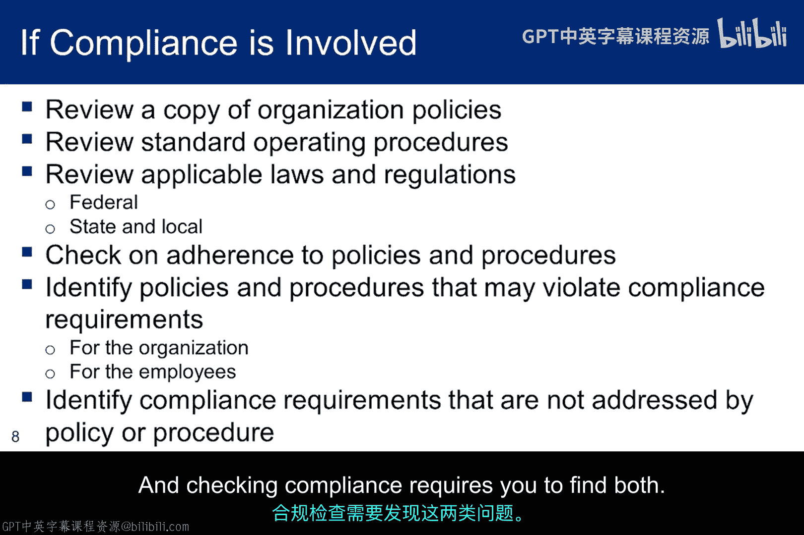

*   测试的具体目标是什么？
*   测试的范围包括哪些系统、网络或应用？
*   有哪些系统或区域是禁止测试的？
*   测试的时间窗口是什么？
*   客户已有的安全策略和流程是什么？
*   需要遵守哪些相关的法律法规？

在我们的实验场景中，虽然没有真实的客户，但在你的报告中，仍需要通过描述对这些问题的典型回答来界定问题范围。没有绝对正确或错误的选择，但至少需要涵盖上述要点。你也可以思考其他重要但未列出的项目。

---

## 合规性检查

在检查合规性之前，你不仅需要了解组织的策略和流程，还需要知道相关的法律法规。你需要将策略、流程与合规要求进行比对，寻找可能的违规项或未被覆盖的要求缺口。

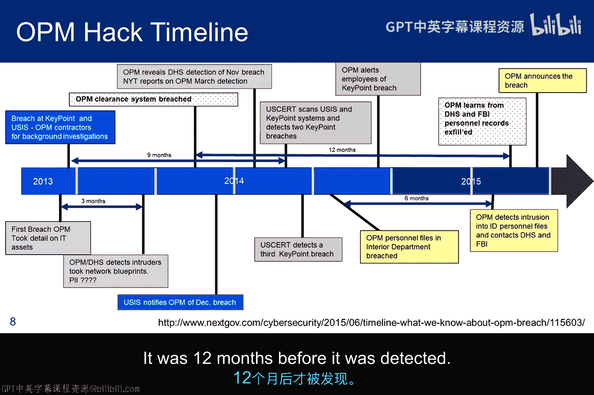

我们以2015年美国人事管理局（OPM）数据泄露事件作为案例，分析渗透测试如何帮助检查合规性。

该事件暴露了OPM在多个合规领域的失败：
*   **社会工程学培训不足**：攻击者通过仿冒网站获取了凭证。
*   **身份验证策略薄弱**：承包商仍在使用ID/密码，未按2011年规定启用双因素认证或PIV卡。
*   **数据未加密**：整个数据库在用户登录后即被解密，且个人身份信息（PII）未加密存储。
*   **公开的安全缺陷**：一份提交给国会的监察长报告公开指出了OPM系统的47个主要应用均未要求PIV认证等“持续性缺陷”，这为攻击者提供了侦察线索。
*   **系统未经授权运行**：系统在没有“运行授权”文件（证明已完成安全测试且缺陷已修复）的情况下运行。

一次针对合规性的渗透测试本应能提前发现这些策略、流程与法规要求之间的差距。

---

## 关注业务使命，而非单纯获取权限

对于黑客和红队成员来说，“获取root权限”可能很有趣。但渗透测试者真正需要关注的是客户的**业务使命**。

你需要思考：哪些系统用于什么目的？它们对组织的使命有多关键？例如，一个汽车修理店的网站主要用于宣传，其业务核心是实体维修，因此该网站的漏洞对核心业务影响最小。另一个例子是中央情报局（CIA），除了招聘，其官网与其核心情报任务关系甚微。因此，评估风险时必须结合业务背景。

---

## 收集与保存证据（战利品）

在测试过程中，你需要收集并保存所有发现的证据，MISP等工具将这些统称为“战利品”。这是你撰写报告时的宝贵资料。

到课程结束时，你可能会忘记早期实验的具体细节，从而导致报告遗漏本应包含的内容。避免这种情况的最佳方法是：**随时记录和归档**。许多红队的最佳实践是，在测试进行的同时就开始撰写报告，将“战利品”直接归档在报告中。

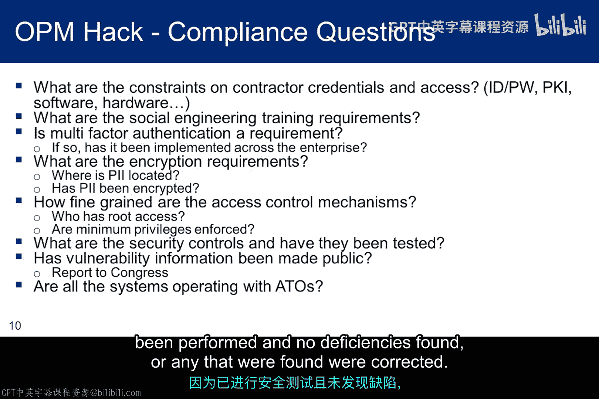

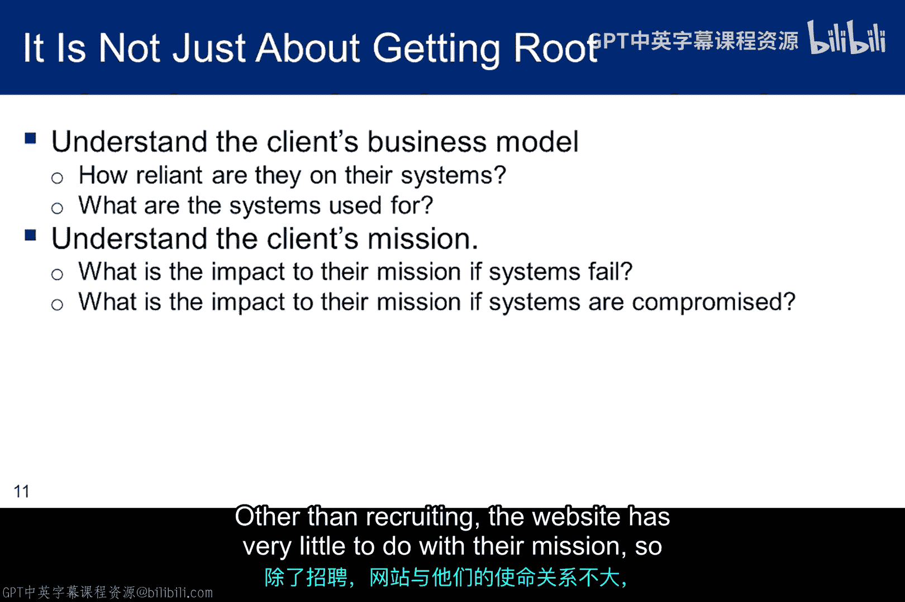

但请始终记住，核心不是“获取root权限”，而是评估其对**业务使命**的影响。

---

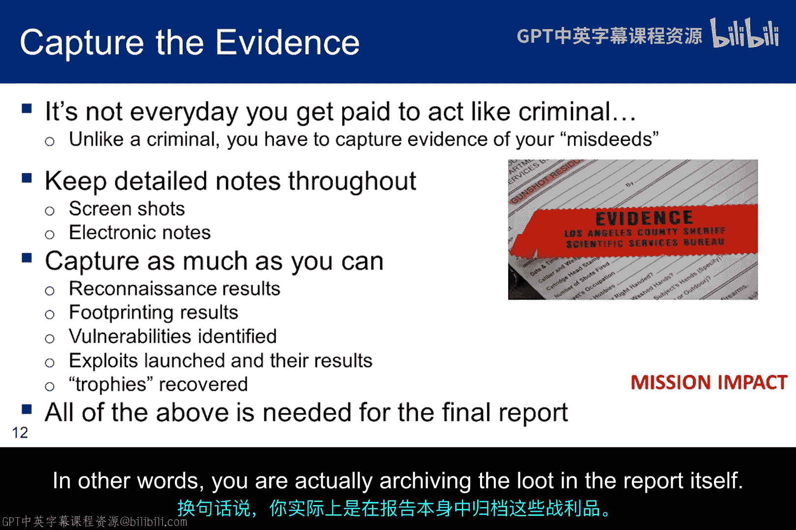

## 总结

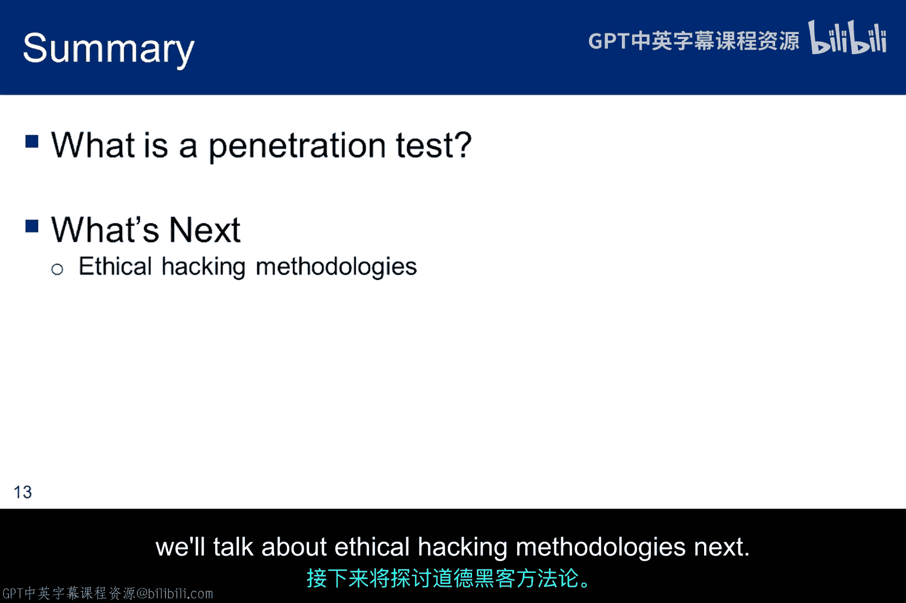

本节课我们一起学习了渗透测试的完整方法论。我们以PTES框架为核心，详细探讨了从前期交互、情报收集到最终报告的七个阶段。我们强调了界定测试范围、检查合规性以及始终以客户业务使命为风险评估核心的重要性。最后，我们了解了持续收集和归档证据对于撰写一份全面、专业的渗透测试报告的关键作用。记住，一份好的报告是有效沟通风险、帮助客户做出明智安全决策的最终产物。