# 009：道德黑客技术体系 🛡️

在本节课中，我们将学习几种道德黑客（渗透测试）的方法论体系。我们将从好莱坞的虚构描绘开始，逐步探讨现实世界中由不同组织提出的、用于指导安全评估的正式方法论框架。

## 好莱坞的描绘与现实 🎬

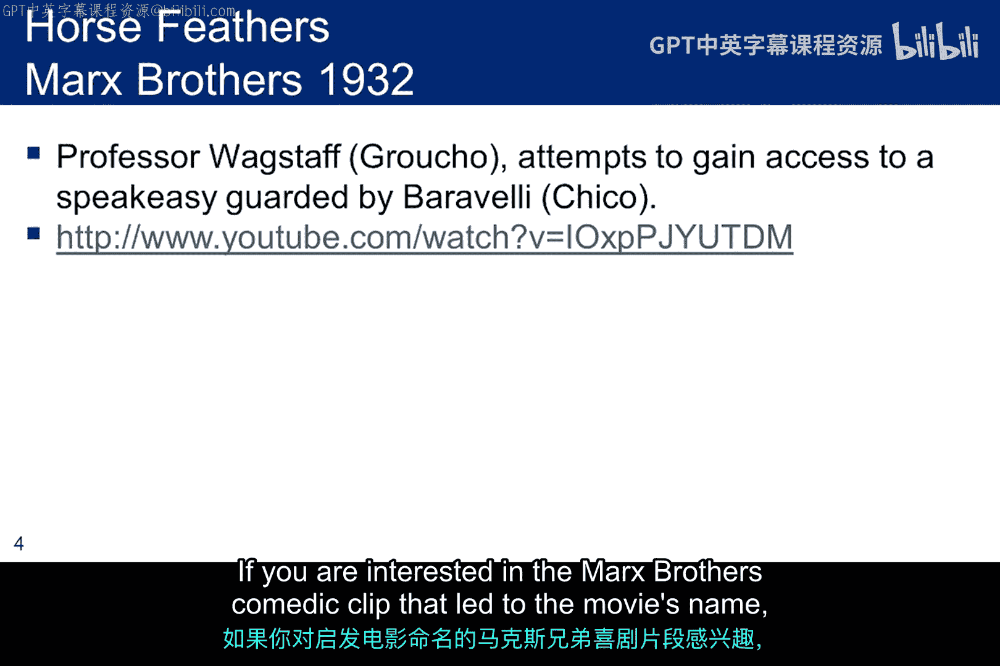

在深入探讨严肃的方法论之前，我们先快速了解一下好莱坞的描绘。左边的流程图展示了电影《剑鱼行动》中的一个场景，其核心情节是一名黑客从政府秘密资金中窃取钱财。有趣的是，电影片名源自30年代马克思兄弟的一段喜剧片段。

右边的漫画试图捕捉电影中常见的黑客场景（上半部分）与社会工程学在现实中如何运作（下半部分）的对比。在这两种情况下，我们都应理解好莱坞的艺术加工，其描绘的方法论有时与现实相去甚远。

## NIST SP 800-115 方法论 📘

我们关注的第一个方法论来自美国国家标准与技术研究院的特别出版物SP 800-115。该出版物为使用三种方法（测试、检查、访谈）进行安全评估的实体提供了指导。

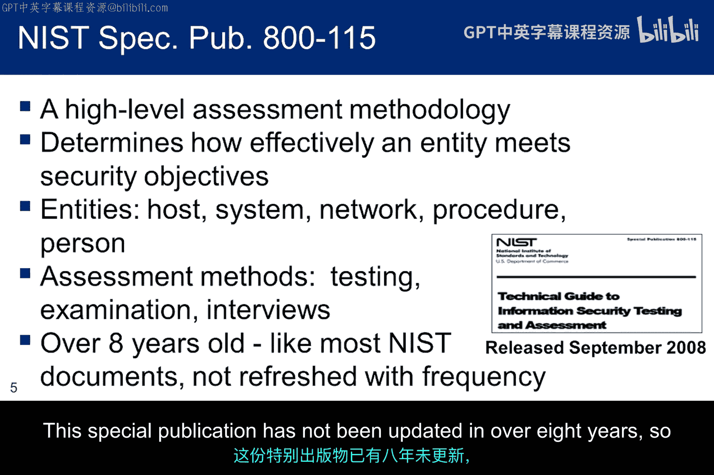

以下是三种核心方法：
*   **测试**：在指定条件下运行一个或多个评估对象，以比较实际行为与预期行为的过程。
*   **检查**：检查、审查、观察、研究或分析一个或多个评估对象，以促进理解、实现澄清或获取证据的过程。
*   **访谈**：与组织内的个人或团体进行讨论，以促进理解、实现澄清或确定证据位置的过程。

这份特别出版物已超过八年未更新，因此在作为有效方法方面存在明显局限。

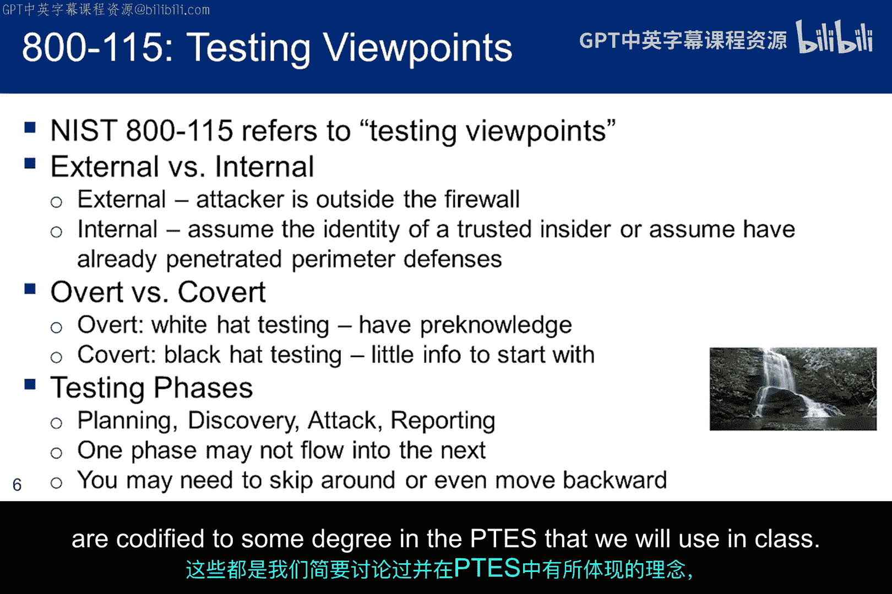

## NIST 方法论的特点 🔍

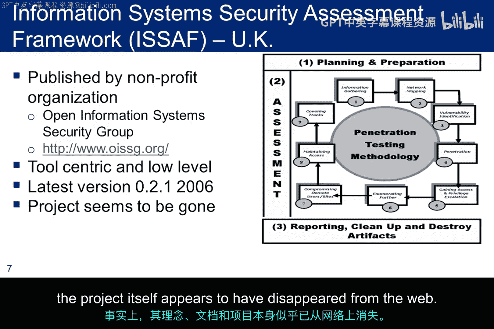

尽管指南已显陈旧，但该出版物一个有趣的方面是其考察的测试视角。它区分了外部测试与内部测试、公开测试与隐蔽测试的方法论。

它还讨论了四个测试阶段：规划、发现、攻击和报告。这些阶段不一定线性发生，测试人员可能需要重新访问早期阶段。这些理念我们已简要讨论过，并在我们将要使用的PTES标准中得到了某种程度的体现。

## ISSAF 与 OSSTMM 框架 🌍

**ISSAF**是一个相对详细、低级别的框架，起源于英国。它在十年前有一些有趣的想法，但并未更新。事实上，其理念、文档和项目本身似乎已从网络上消失。

**OSSTMM** 则是一个非营利组织，同样起源于欧洲，是一个发展良好且活跃的框架。但在某种意义上，它是由Peter Herzog主导的个人项目。该框架与ISSAF相比是更高级别的方法论，它不规定具体使用的工具，并假设从业者已具备渗透测试知识，因此初期学习曲线较陡。

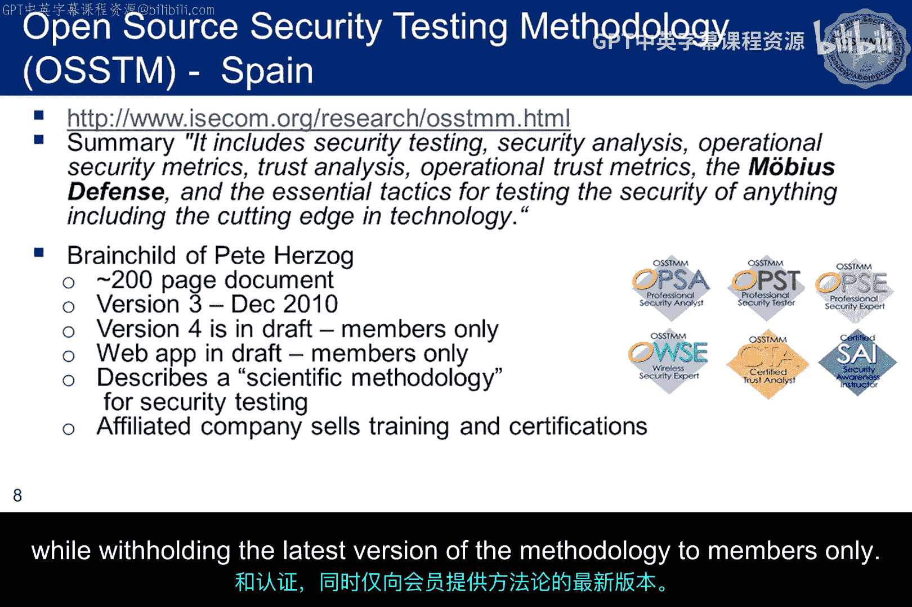

Herzog先生认为“纵深防御”的理念已经过时。他提出的防御模型称为“莫比乌斯防御”，其核心理念是每个模块都应被视为独立个体进行保护，独立于企业的任何防线。因此，该模型忽略网络边界和安全区域，提倡“各自为战”作为保证保护的更好方式。

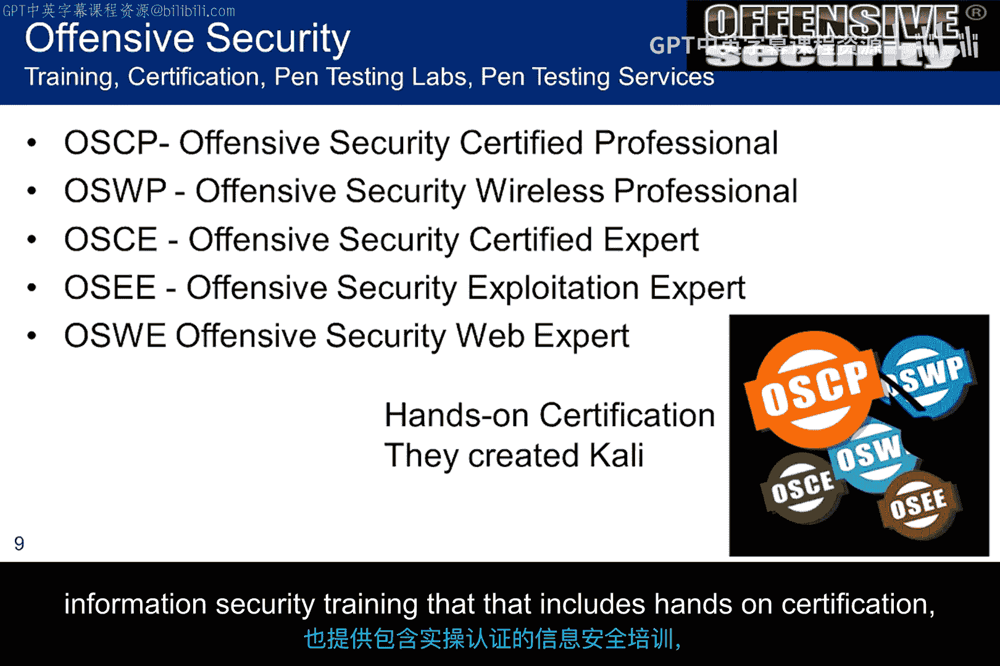

在公开版本的标准中，描述了渗透测试的几个阶段，支持者认为该方法非常科学。然而，该组织当前的商业模式似乎更侧重于培训，而非增强和扩展标准本身。OSSTMM在安全社区感兴趣的多个领域推广培训和认证，同时将方法论的最新版本仅限会员获取。

## 攻击性安全与PTES标准 ⚔️

在考虑培训和认证时，我们还应该关注攻击性安全公司，即Kali Linux的创造者。该公司既提供渗透测试服务，也提供包含实践操作认证的信息安全培训，这在安全社区中备受尊重。

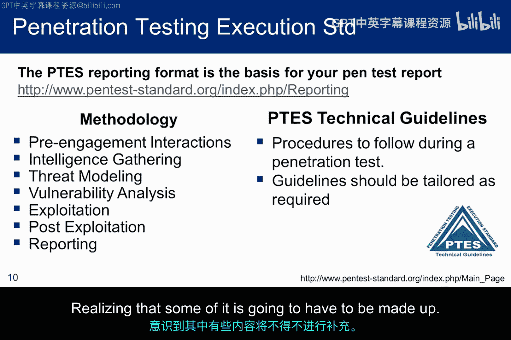

**渗透测试执行标准** 提供了另一种方法论，它影响了为本课程提炼出的方法论。它也为我们将用于最终渗透测试报告的撰写提供了指导。该方法论之前已描述过，此处不再重复。但需要提醒的是，报告在流程列表中排在最后，并与方法论的其他部分紧密耦合。必须参与方法论的其他环节，才能编写出可用的渗透测试报告。

本课程的目标是将你在每周实验中收集的所有材料整合成一份最终报告，并尽可能多地涵盖PTES方法论的组成部分，同时认识到其中一些部分可能需要自行构思。

## 威胁建模与攻击者分类 🎯

为了对威胁进行建模，我们从攻击者的两个主要类别开始：内部人员和外部人员。我们需要在发起方的监督下完成这个表格的分析。

幻灯片通过识别各种内部威胁代理来细分内部威胁类别。一旦识别出代理，渗透测试人员需与发起方合作，确定各种代理可能攻击的业务资产和业务流程。做出此判断的一个因素可能是已经授予内部人员的访问权限。

收集这些信息后，渗透测试人员可以将其与发起方对资产的优先级排序结合使用，来制定基于这些代理在攻击中可能尝试的技术的测试计划。当然，这些代理列表中的成员具有不同的技能水平和不同的访问授权，因此测试必须考虑到这一点。

一旦为内部威胁代理建立了风险结构，就必须将这项工作扩展到外部威胁代理。同样，这些代理具有不同的技能水平、连接性和访问授权，因此威胁也不同。与内部代理一样，必须叠加发起方的要求。

## 教科书方法论对比 📊

此幻灯片上的表格描述了教科书中的方法论。其中一个遗漏是，Engelbretson没有讨论作为渗透测试人员“掩盖踪迹”的环节。在许多情况下，这是测试活动的关键方面，因为并非组织中的每个人都知晓渗透测试。如果在达到某些里程碑之前被检测到，测试可能不得不提前终止。

此表格比较了四种方法论。请注意它们之间存在相似之处，在某些阶段，实际上只是阶段名称的语义不同。但也要注意存在一些差异，某些方法论包含的阶段在其他方法论中却没有。正是这些差异促使我们为本课程提炼出一个寻找交集并尝试建立一致命名规范的方法论。请注意，CEH方法论也包含在此。

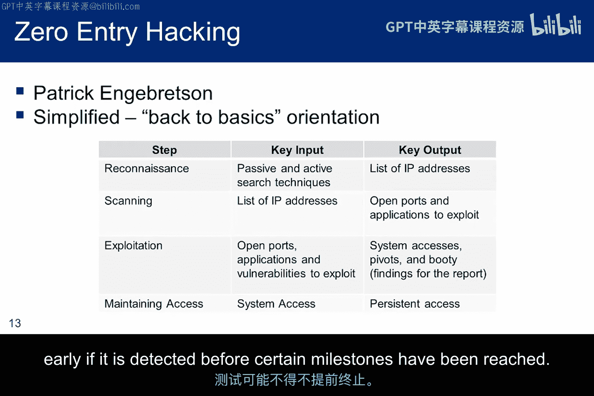

## 本课程采用的综合方法论 📝

这是我们将在课程中使用的最终综合方法论，它根据我们将涵盖的材料驱动着教学大纲。

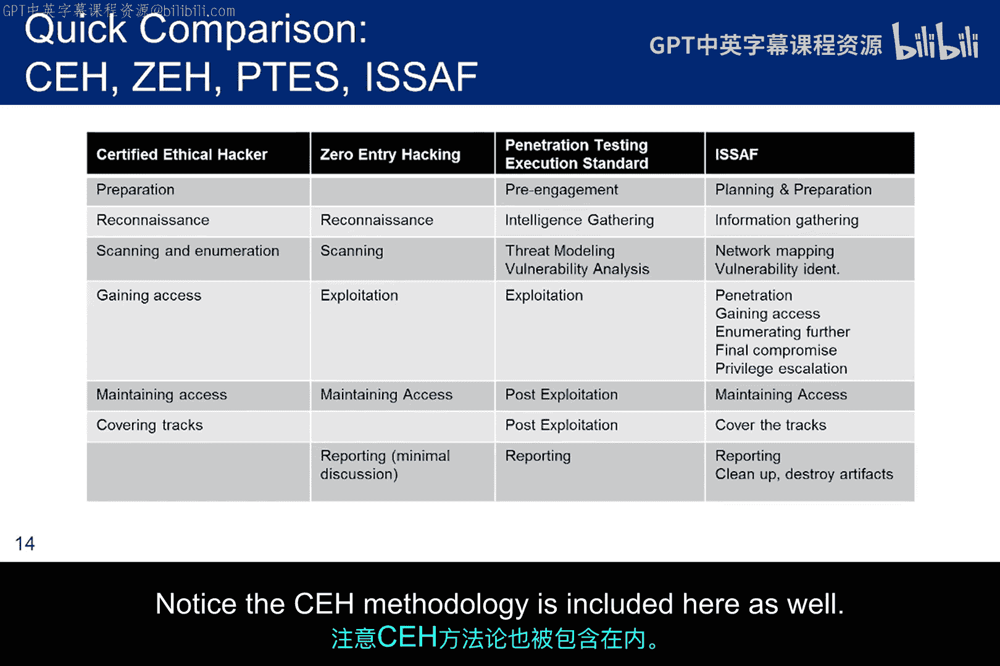

你会发现PTES指导文件为准备阶段（称为“前期互动”）提供了一些额外细节。这是一个重要的区别。互动环节包含在我们方法论的前期规划中，但PTES团队认为，将红队的规划与客户的互动和讨论分开很重要。随着课程的进展，目标是按所示顺序处理这些阶段中的每一个。

## 总结与下节预告 ✅

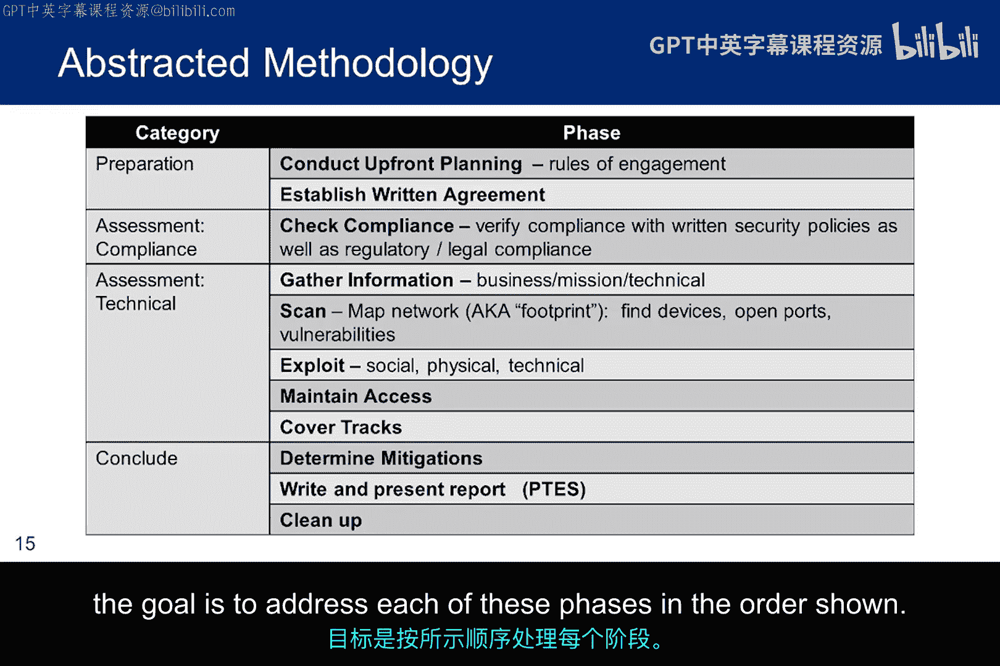

本节课中，我们一起学习了多种道德黑客方法论体系，从NIST、ISSAF、OSSTMM到PTES和攻击性安全公司的实践。我们了解了威胁建模的方法，并最终确定了本课程将采用的综合方法论框架。

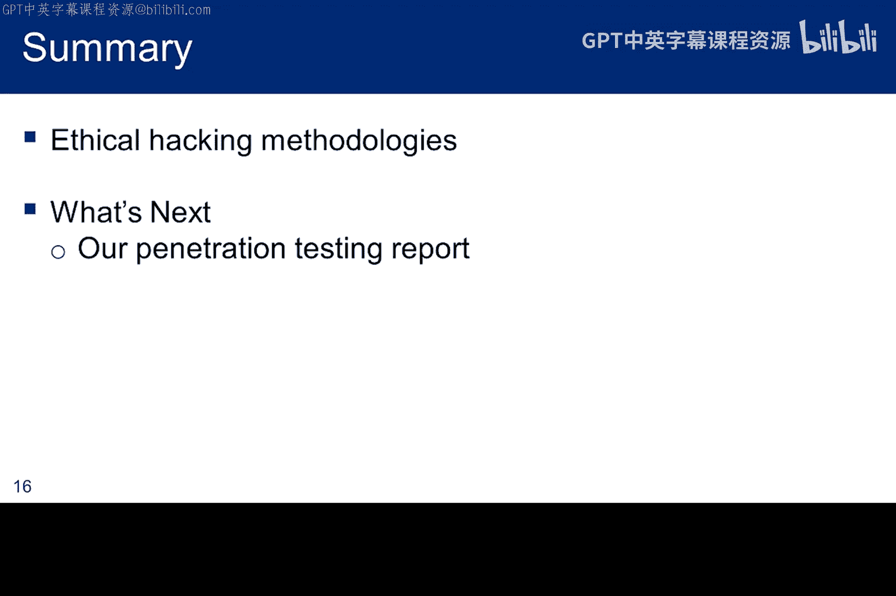

现在我们已经完成了对道德黑客方法论的概述，接下来我们将深入探讨渗透测试报告的具体内容，你将在完成本课程报告时运用这些理念。