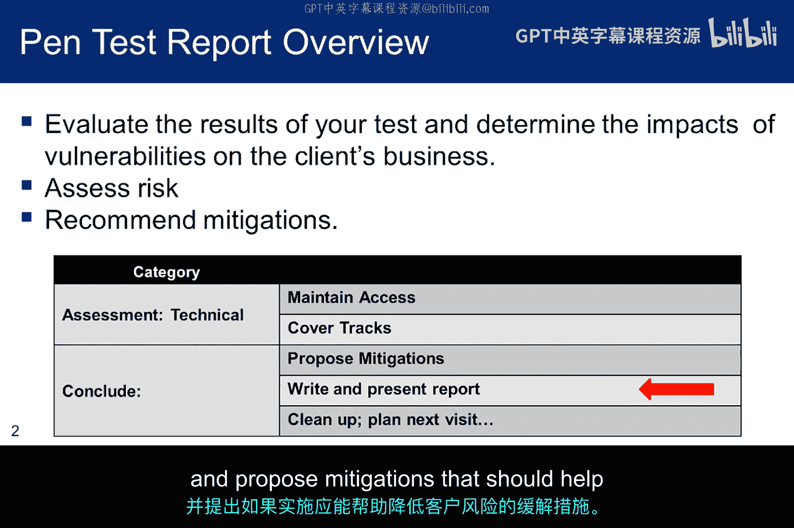
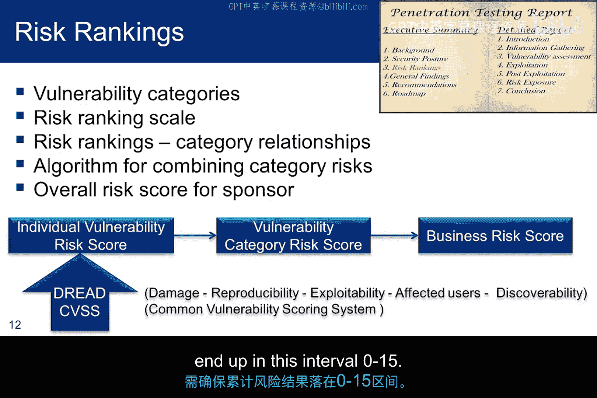
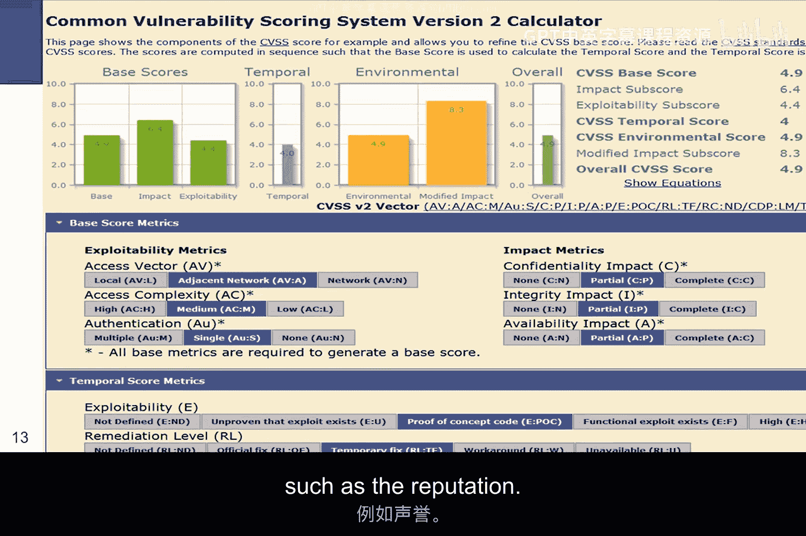
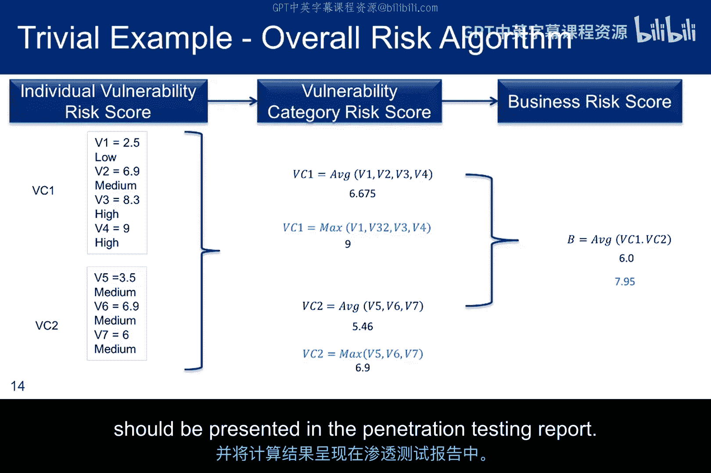
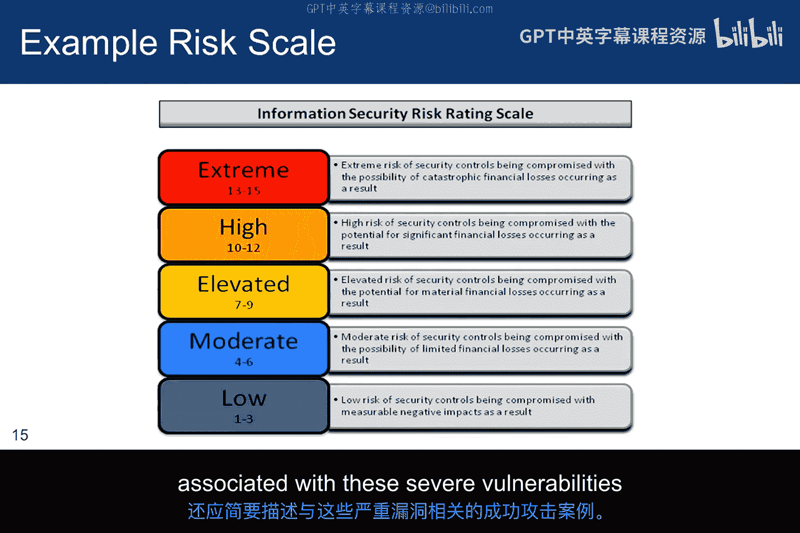
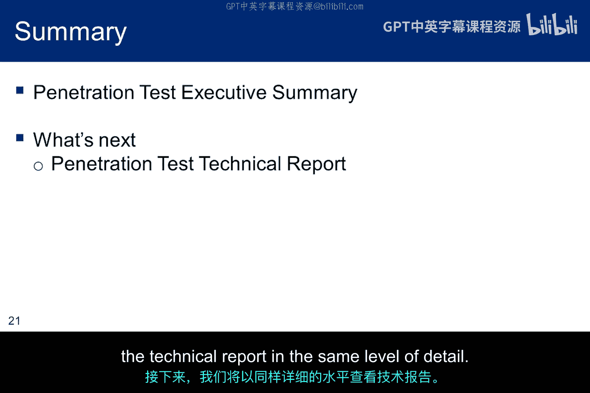

# 010：渗透测试报告执行摘要 📋

在本节课中，我们将学习如何撰写一份专业的渗透测试报告，特别是其核心部分——执行摘要。我们将了解执行摘要的结构、内容要点以及如何向非技术背景的管理层清晰地传达风险与建议。

上一节我们介绍了渗透测试的方法论，本节中我们来看看如何将测试结果整理成一份有价值的报告。

## 报告概述与目标

在本次讲座的剩余部分，我将讨论渗透测试报告的内容。我将重点介绍PTES方法，但正如之前所学，也存在其他类似的方法论。实际上，大多数渗透测试团队都有自己定制化的报告格式，这些格式在多次测试中不断演进，以更贴合团队需求，而非严格遵循某个标准。但最终，即使是PTES的报告指南也需要进行调整，以满足当前测试的具体要求。

查看该抽象方法论的底部，其目标是以一种能够帮助客户组织管理层为其安全机制做出明智投资决策的方式，提出缓解措施并将其记录在报告中。他们可能会实施你提出的缓解措施，也可能不会。重要的是，你需要评估其业务面临的风险，对该风险进行量化，并提出如果实施应有助于减少客户暴露风险的缓解措施。

## 方法论回顾与假设

我们之前见过这张方法论幻灯片。我再次展示它，是为了提醒大家，由于没有实际的客户进行互动，**预互动阶段**和**威胁建模**无法真正进行。对于预互动阶段，你应该提出在任何渗透测试中都合理的想法。实验说明中的场景是，客户希望进行一次外部发起的、防火墙开启状态下的黑盒测试。

但你需要像客户一样做出决策，例如对攻击运营数据库、安装后门和破解密码等行为施加任何限制。威胁也将作为实验指导的一部分进行讨论。例如，已识别的外部威胁之一是脚本小子，另一个是客户只关心外部威胁，不关心内部威胁。

## 预互动与威胁建模要点

承接上一张幻灯片，这两个要点代表了方法论中假定已完成的部分。渗透测试团队应与发起方签订书面合同，明确测试的范围和日期。合同应包含在范围内的域、不在范围内的域，以及与第三方和第三方系统互动的规则。它还应明确规定对渗透测试人员使用物理攻击、社会工程学、后门和密码破解工具的任何限制。

对于威胁建模，标准侧重于两个关键要素：**资产**和**攻击者**。资产进一步细分为业务资产和业务流程，攻击者则细分为威胁社区及其能力和技能水平。

以下是需要在最终报告中总结的一些项目，它们代表了预互动协议。这些项目大部分都包含在实验说明提供的大纲中，但其中一些可能以不同方式呈现，或者需要一些额外细节以适应报告。因此，在开始制定大纲时，你应该回顾此列表，以确保报告包含所有内容。

## 报告的重要性与结构

最终报告是发起方会记住的东西。在报告上偷工减料风险自负。你可能永远不会再被邀请回来。这提醒我们，渗透测试是在某个时间点完成的，你需要确保发起方理解，随着威胁、资产和工具的演变，发起方应请求进行额外的测试。你可能希望确保报告质量高，以便再次被邀请。

术语“执行摘要”并非通常撰写白皮书摘要时的含义。它不是两页的总结。它是一份复杂的风险评估和缓解措施建议，决策者可以用它来做出安全投资决策。

通常，你会被要求提供一份书面结果报告，并在发起方的场所通过演示来总结结果。请确保写作和演示材料的水平与你的渗透测试技术技能相当。

报告本身将包含三个部分：
1.  **执行摘要**：必须撰写到高级经理和高管能够理解并据此采取行动的水平。在大多数情况下，高管只会阅读这部分，因此它必须非常清晰、精确，且建议必须具有可操作性。
2.  **详细报告**：面向技术人员，他们会质疑你的结果并希望了解细节。
3.  **原始数据**：包含存储库中保存的所有材料、所有截图以及任何其他可能需要用来证明详细技术报告和执行摘要中结论和推论的材料。

## 执行摘要详解

如前所述，执行摘要面向非技术背景的高管层受众。它是为可能根据你的建议采取行动的决策者准备的，因此需要清晰地展示业务影响。它应该包含诸如“以下是您的业务可能受到损害的方式”之类的短语。

请记住，它是一份摘要，并引用了更多细节。因此，不要在这部分陷入技术信息的泥潭。另一方面，也不要轻视执行摘要。要讨论业务风险和缓解建议，并注意执行摘要和技术报告之间可能存在一些重叠，例如风险讨论。这是因为每份报告通常有两个受众，他们有不同的但相互交叉的目标。两个受众都希望理解风险，但详细程度不同。

幻灯片左侧显示了执行摘要的推荐章节，我们将更详细地讨论每一个。

### 背景部分

背景部分将读者与测试的目标、目的和范围联系起来。可能有许多读者没有参与预互动讨论，因此本节为他们提供了关于已达成协议的内容以及在阅读报告时可以期待什么的背景信息。

它还必须包括威胁建模的讨论，以便读者知道测试了哪些代理和哪些资产。这将包括解释这样一个事实：这并非针对每个资产和每个代理的全面测试。在企业范围内，识别被攻击的特定系统及其逻辑和物理位置。在讨论每个资产时，根据客户在预互动讨论中指定的内容，识别其业务关键性。

在继续背景部分时，提供方法论的摘要。但请记住，高管对你使用了什么工具不感兴趣。这样的讨论对他们没有意义。作为方法论的一部分需要总结的一些主题如下：

以下是需要总结的方法论主题：
*   描述测试中模拟的威胁代理（内部、外部或两者兼有）。
*   描述发起方同意的、用于制定渗透测试计划的资产风险等级。
*   描述对使用物理访问或社会工程学的任何限制。
*   描述测试的保护机制。在我们的场景中，关键的安全机制是身份验证和无状态防火墙。但如果你想到其他机制，也应包括在内。
*   描述使用的扫描技术，但要概括性地描述。例如，我们扫描了未打补丁或升级的可用服务。
*   概括性地描述确认扫描期间发现的漏洞的利用技术。例如，我们利用了易受攻击的服务，并执行了客户端攻击和浏览器端攻击。
*   描述测试过程中对测试目标进行任何修改的理由。修改测试的书面协议应包含在报告的附录中，并在本背景部分引用。

### 安全态势部分

安全态势部分将讨论测试的整体有效性，以及渗透测试人员是否能够实现商定的目标。

应总结系统性问题，例如：发起方的安全团队没有及时修补软件的有效流程。提供一个或两个已知的、有文档记录的、供应商已解决但客户尚未安装补丁的漏洞的具体例子。

描述渗透测试人员获取客户信息或资产的能力，并定性地识别对业务的潜在影响。由于你没有很好的方法来评估潜在的美元损失，请量化已确认的漏洞以及客户为保护将丢失的业务关键信息而实施的安全控制。

虽然本节不提供建议的缓解措施，但你希望发起方开始考虑加强组织的安全态势。

### 风险部分

风险部分首先要描述的是漏洞，应根据威胁模型对其进行识别、分类和解释。漏洞的一个例子可能是未打补丁的内核驱动程序。而相关漏洞类别的一个例子可能是缺少补丁或未能加固操作系统。这里的思路是，25个漏洞让高管难以理解，而3个类别则更容易解释。

其次，需要在报告的这一部分识别和解释整体风险等级。在预互动讨论中，渗透测试人员和发起方应已确定用于跟踪风险的分值机制。例如，微软开发的DREAD系统，为以下各项分配高、中、低数值：
*   **D** - 损害：攻击会有多严重。
*   **R** - 可复现性：复现攻击有多容易。
*   **E** - 可利用性：发起攻击需要多少工作量。
*   **A** - 受影响用户：多少人会受到影响。
*   **D** - 可发现性：发现威胁有多容易。

这些单项分数的总和提供了与漏洞类别内漏洞相关的风险度量。

通用漏洞评分系统（CVSS）是制定风险指标的另一种方法。它是一个定量模型，使用户能够看到用于生成分数的底层漏洞特征。CVSS从一个基础分数开始，用于计算时间分数，再用于计算环境分数，最后用于计算总体分数。当然，还有其他威胁风险系统。但在与客户会面之前，你应该心中有数。你可以在OASIS组织的威胁风险建模下阅读更多相关内容。

在解释了这两个要素之后，报告应讨论所选的方法，以衡量业务风险（而不是识别漏洞的存在）。讨论从检查漏洞类别开始，例如未能修补软件。风险模型将为此类别分配一个风险数值，以便与其他类别进行比较。

一种算法（可能像加法一样简单）提供了一种将单个漏洞转化为漏洞类别等级，再转化为企业指标的方法。最终得分可能落入类似极端、高、升高、中等和低的等级方案中。这是PTES指南定义的一部分。但如果你使用这个量表，请确保你的累积风险结果落在这个区间内：0到15。

### 漏洞等级与风险算法

漏洞等级系统应提供一种方法，用于对渗透测试报告产生的可操作项进行优先级排序。CVSS可用于衡量与可追溯到CVE编号的单个漏洞相关的风险。CVSS使用的整体评分系统将映射到高、中、低分组，但这些定性等级只是从数字CVSS分数映射而来。

如果漏洞的CVSS基础分数为0到3.9，则标记为低严重性；如果基础CVSS分数为4.0到6.9，则标记为中严重性；如果CVSS基础分数为7.0到10.0，则标记为高严重性。

定性量表的另一种方法可以是：**高**指任何可实现远程代码执行或窃取特定高价值客户数据的方法。**中**可能用于潜在可利用的漏洞或可能影响业务资产（如声誉）的数据项泄露。**低**可能指定为泄露可能使某个已识别威胁受益但不是有价值的公司信息的信息。

请注意，这个CVSS量表最高只到10。因此，如果你决定使用从0到15的PTES风险量表，需要进行某种调整。

以下是一个简单的企业风险算法示例。你不必使用这种方法，但需要类似的东西来定义企业的风险指标。在这个例子中，黑色公式展示了一种将个体风险组合成与漏洞类别相关的风险的简单方法，而漏洞类别又用于确定整体业务风险。

这只是一个简单的例子，表明必须开发某种方法来汇总个体漏洞风险。蓝色显示的另一种方法可能是取漏洞类别内的最高分，以捕捉该类别中最薄弱的环节。关键是开发一种对发起方有意义、对你有意义并能提供风险指标的方法论。该算法应在预互动讨论中达成一致，并且这些计算的结果应呈现在渗透测试报告中。

### 风险等级与发现总结

这些来自PTES的示例等级衡量了客户安全控制被攻破的风险以及相关的潜在重大财务损失。如果在报告中使用，需要讨论其企业的整体风险分数是如何计算的。例如，它可能基于一小部分高风险类别、可能不止一个的中等风险漏洞类别和几个低风险类别。

安全评估应根据成功的直接攻击进行讨论。这一点很重要：如果某个漏洞看起来存在，但你未能利用它，它对分数的影响应该是最小的或为零。最后，报告应总结导致指标达到当前水平的最严重漏洞。还应包括与这些严重漏洞相关的成功攻击的简要描述。

### 总体发现部分

总体发现部分将提供渗透测试期间发现问题的概要。它应包括分析性内容、简单的定量细节和显示一些统计数据的图形。你需要包含一个高级别的架构和目标图、攻击场景和成功率、利用的漏洞来源（使用统计数据和指标）以及按系统划分的重要结果的定量总结。在这里尽可能多地使用图形，从定量角度解释结果。你还应尝试以定量的方式描述对策的有效性。例如，一张图表显示尝试了多少次渗透尝试，以及有多少次被防火墙阻止或被入侵防御系统检测并阻止。其目的是展示发起方为安全控制所做的设计，并讨论其有效性。

如果你在测试过程中跟踪测试的漏洞，可以包含这样一张图。在这种情况下，在主机5上，15次尝试中有0次成功利用。在主机3上，15次尝试中有13次成功利用。

这是定量图形的另一个例子。它显示了按类别检测到的漏洞百分比。当然，在你发现被测系统中的漏洞集合时，还有许多其他潜在的类别。你需要进行必要的分析评估，将它们放入定义明确的类别中，这将为解释风险提供一个框架。

### 建议部分

最后，可能也是最重要的部分是建议。报告的这一部分应为读者提供解决已识别风险所需任务的高层次理解。它还应讨论实施这些任务所需的工作量。其目的是为读者提供足够的信息，以便将缓解成本与成功攻击的风险进行比较。本节还应确定可能引入的任何加权机制，以确定实施顺序的优先级。例如，提高密码熵的重要性可能是加快补丁过程的1.5倍，或者它们可能权重相同。无论选择什么，都应在此处解释。

提出建议的一个挑战是找到一个可行的中间立场。正如幻灯片所指出的，如果你考虑所有可能的NIST SP 800-53控制组合，选项数量将难以管理。然而，建议的更改可能比仅仅考虑SANS前20大安全控制更复杂。推荐SANS前20大根本不需要进行渗透测试。更重要的是，那些前20大与发起方的业务模型、业务流程或业务数据没有任何联系。

一旦你提出并确定了建议的优先级，你需要描述一个路线图，其中包括修复发现的不安全项的计划。该计划应覆盖那些被认为是测试重要部分的威胁的威胁建模。可能有一个需要超过12个月才能修复的高优先级漏洞，也可能有一个可以通过立即购买硬件设备来缓解的低优先级漏洞。即使发起方可能只选择部分实施建议，你也需要帮助他们制定一个计划。在制定计划时，你还应考虑业务目标和潜在的业务影响。其思路是将你的建议分解，使其与预定义的目标保持一致，并为前进的道路提供路径。请记住，发起方可能有资本或费用限制，将一到三个月的目标延长到六个月或更长时间。

## 总结

本节课中我们一起学习了如何撰写渗透测试报告的核心——执行摘要。我们了解到，执行摘要远不止是一个简单的总结，它是一份面向决策者的综合性风险评估与建议文档。它需要清晰地传达测试背景、安全态势、量化风险以及可行的缓解措施路线图，以帮助客户做出明智的安全投资决策。