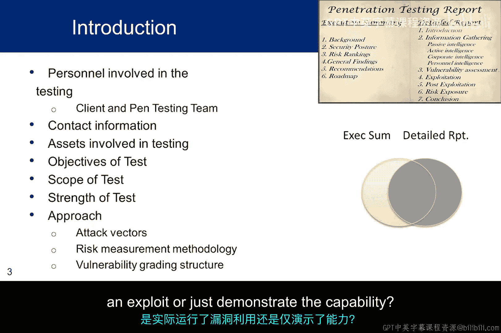
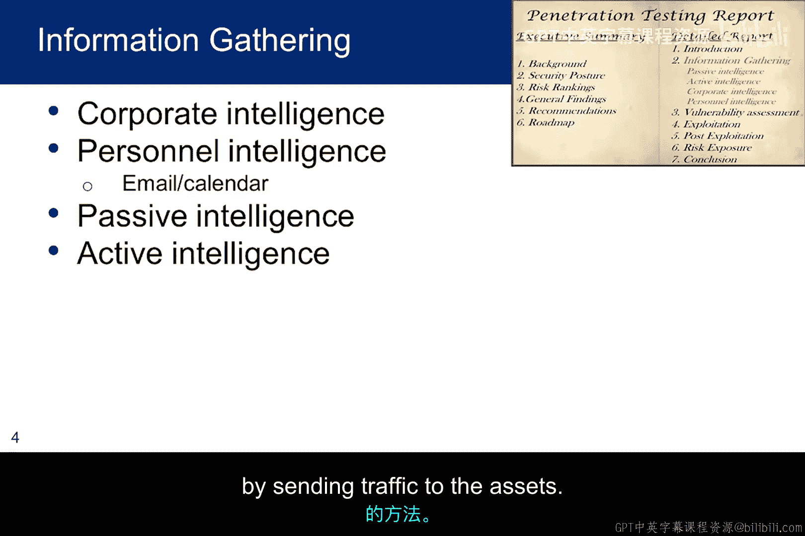
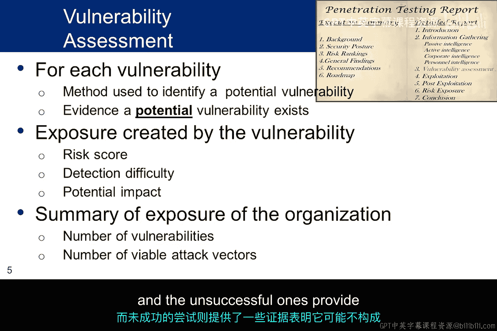
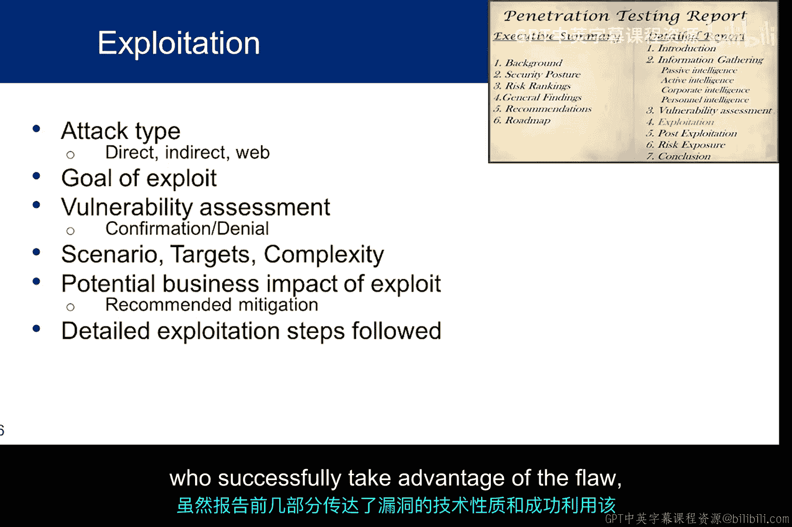
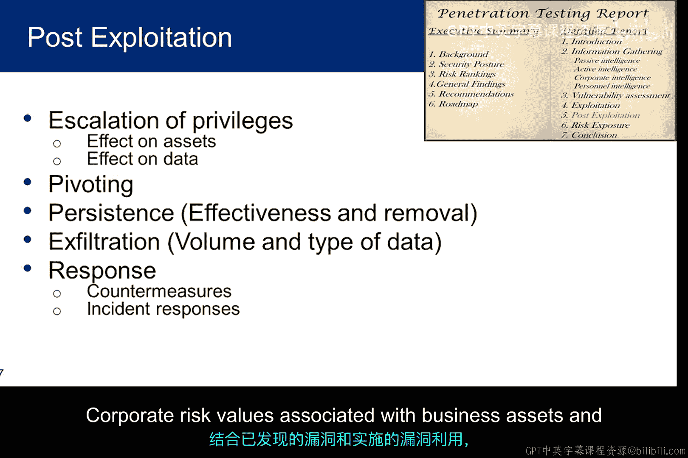
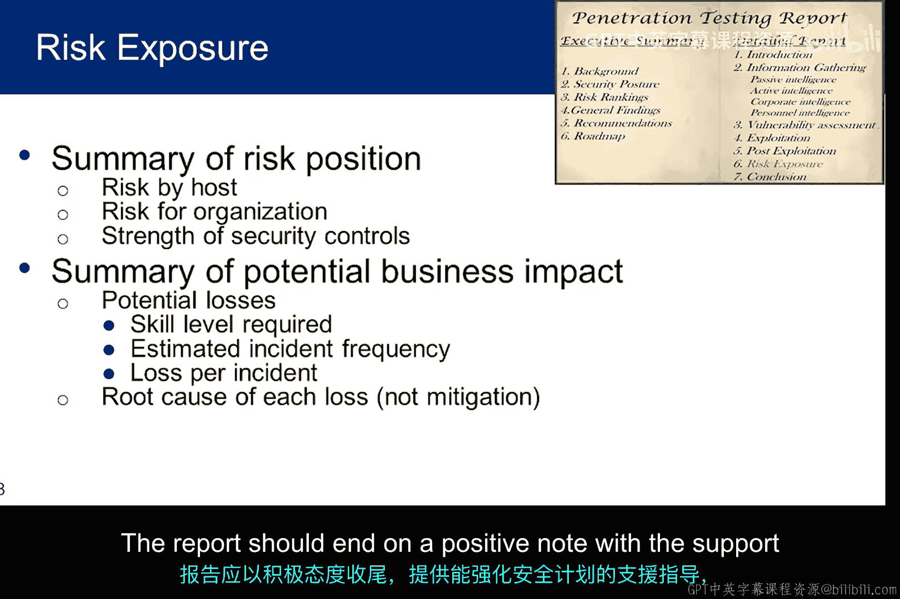
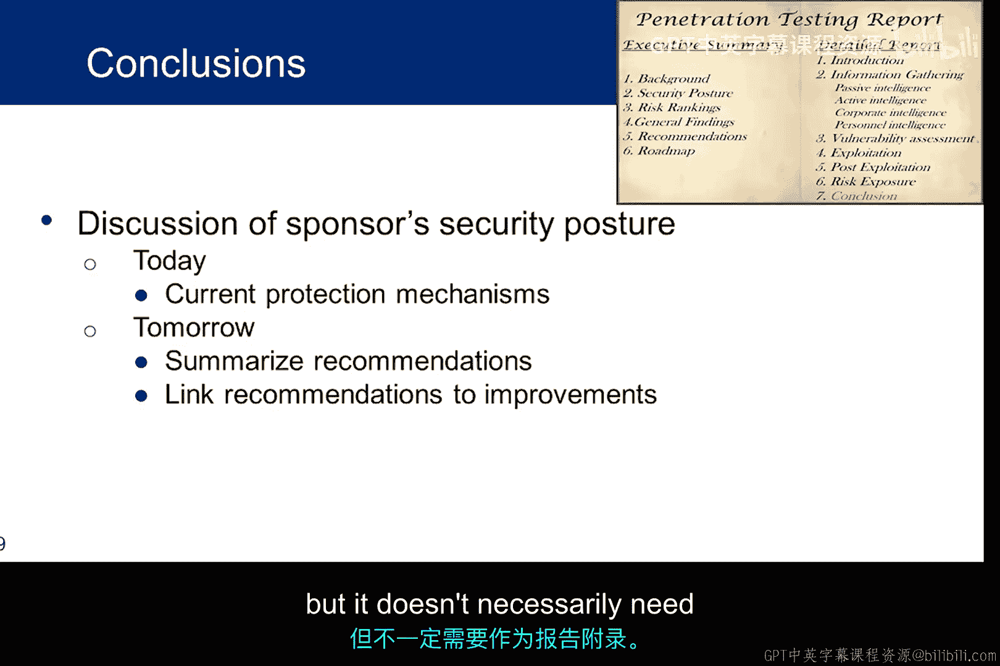
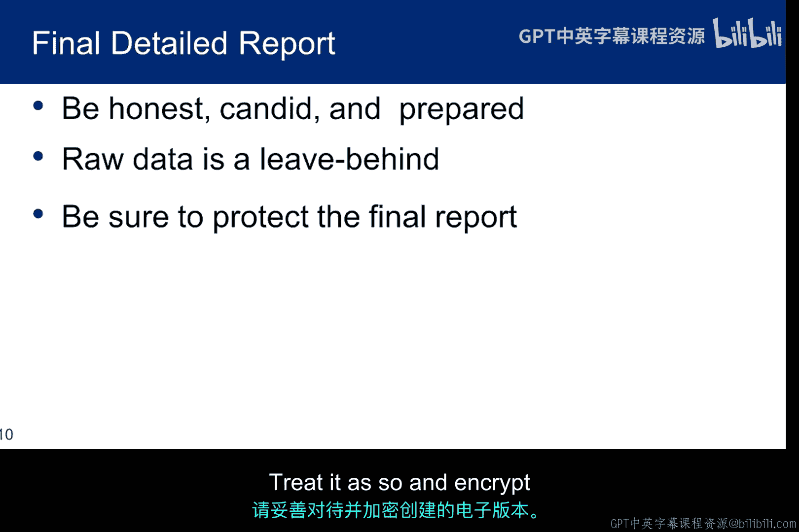
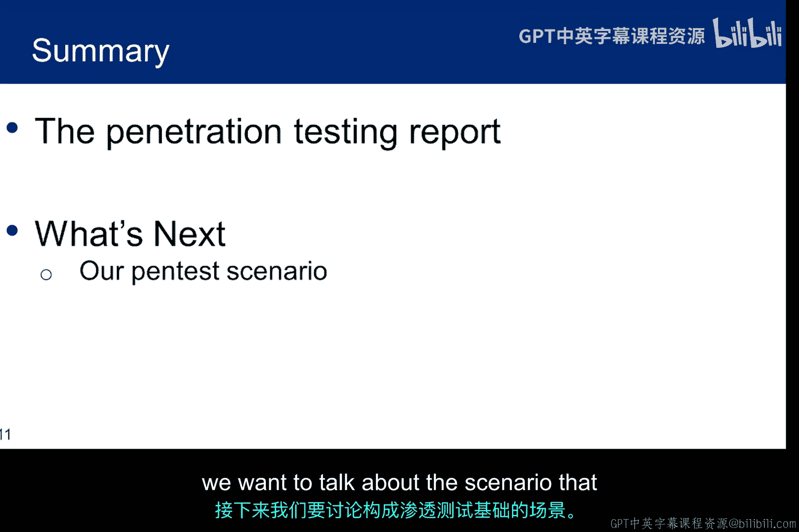

# 011：渗透测试技术报告 📋

在本节课中，我们将学习如何撰写一份详尽的渗透测试技术报告。我们将重点介绍报告的核心结构、各部分应包含的内容，以及如何将技术细节有效地传达给安全团队。

---

## 概述

一份专业的渗透测试报告不仅是测试结果的记录，更是指导客户修复漏洞、提升安全性的关键文档。上一节我们介绍了报告的执行摘要，本节中我们将深入探讨技术报告的详细构成。技术报告面向安全工程师和网络运维人员，旨在详细说明攻击方法、漏洞原理及防护机制失效的原因。

---

## 技术报告引言

技术报告的引言部分可能重复执行摘要中的一些背景信息。然而，由于读者可能包括安全工程师，此处需要提供更深入的技术内容。

例如，不应只提供高级架构图，而应包含防火墙、路由器、交换机、VPN服务器、Web服务器、DMZ区、数据库服务器，甚至单个设备上运行的端口和服务详情。

本质上，本节需要深入细节，提供尽可能多的工程内容，但无需包含原始数据。原始数据将放在附录中。

以下是引言部分应包含的自解释性内容：
*   **测试组织**：描述执行渗透测试的机构。
*   **测试范围与目标**：概述在预互动阶段商定的测试范围和目标。
*   **方法论**：说明遵循的测试方法论、基于威胁模型使用的攻击向量、风险度量方法的细节以及漏洞分类背后的逻辑。

任何与理解渗透测试方法相关的、来自执行摘要的内容都应在此处重新引入，但不应直接复制粘贴。两份讨论应针对不同的受众进行定制。

“测试强度”是一个较为模糊的概念。一方面，它将报告与威胁主体关联。例如，国家支持的威胁主体所需的测试强度高于脚本小子。具体来说，你是否使用了自定义脚本或标准脚本？另一方面，测试强度也体现了所使用的技术。你是实际运行了漏洞利用，还是仅演示了其可能性？

---

## 情报收集

本课程包含关于侦察的一讲。在那讲中，你会看到情报收集和信息评估是任何渗透测试的基础要素。测试者对目标环境了解得越充分，测试结果就越好。

本节应讨论通过PTES情报收集阶段获得的所有公开和私有信息。至少，识别出的结果应按以下四个基本类别呈现：

*   **企业情报**：包括组织结构、业务单元、市场份额、垂直/水平整合及其他企业职能信息。这些信息应映射到被测试的业务流程和物理业务资产。
*   **人员情报**：任何将用户映射到目标组织的信息。本节应展示从公共或私有数据库、邮件存储库、社交网络论坛、组织结构图和其他员工详细信息源收集情报的技术。如果社会工程学或网络钓鱼在渗透测试范围内，则应呈现收集到的任何人员情报，例如高管联系信息。一个很好的例子是某小公司因黑客入侵所有者邮箱和日历，看到其完成银行交易的流程，在其开会时复制流程将资金转入自己账户，并在其返回前删除邮件，导致损失数百万美元。
*   **被动情报**：通过间接方法收集的情报，例如用于获取IP基础设施相关信息的DNS和Google Hacking。本节将重点介绍在不直接向资产发送任何流量的情况下，分析目标环境技术概况的技术。
*   **主动情报**：展示诸如基础设施映射、端口扫描、架构评估和其他足迹勘察任务的方法和结果。本节将重点介绍通过向资产发送流量来分析目标环境技术的技术。

---

## 漏洞分析

报告的漏洞部分首先分别审视每个已识别的漏洞。在预互动威胁建模中测试或识别的威胁，以及基于模拟这些威胁寻找漏洞的漏洞评估。它包括识别潜在漏洞的行为，以及基于所选风险模型进行相关风险评分。

本节应链接到风险模型，并解释用于识别漏洞的方法以及漏洞的分类。

你应提供证据，根据你的结果证明潜在漏洞是可被利用的。包含一些关于检测难度和若被利用可能造成的影响的信息。每个漏洞应根据检测机制和与其他漏洞的相似性进行分类。

检测机制可能包括：手动识别、扫描器发现、已知协议/服务弱点或CVE条目。漏洞类别之前已讨论过，此处不再重复。本节的最终总结应根据发现的漏洞数量、漏洞类别数量（这转化为攻击向量的数量）以及漏洞被发现的难易程度，来呈现组织的暴露情况。

---

## 漏洞利用

漏洞利用部分应讨论实际尝试的漏洞利用，哪些成功，哪些未成功。成功的利用确认了漏洞的存在，而未成功的利用则提供了该漏洞可能不构成风险的证据。

漏洞利用是触发上一节中识别的漏洞，以获得对目标资产指定级别访问权限的行为。

本节应回顾攻击类型、攻击目标以及为确认漏洞所采取的所有步骤，包括利用时间线、选择进行利用的目标、攻击场景、成功和失败的利用尝试以及详细的利用活动。

利用活动应讨论对端口和服务的直接攻击结果，以及使用社会工程学、网络钓鱼、客户端攻击渗透网络和浏览器端攻击获取服务器基础设施访问权限的间接攻击结果。每个成功的攻击都应说明所达到的访问级别，并建议消除漏洞的缓解机制或安全控制措施。

用一些关于尝试利用中成功次数的统计数据来总结本节。首先，根据攻击类型进行分类：直接、间接和Web攻击。间接攻击可进一步细分为社会工程学、网络钓鱼、客户端攻击和浏览器攻击。这种量化细节将帮助安全工程团队向管理层建议应首先在何处投入资金。例如，如果网络钓鱼成功率很高，组织可能希望立即投资为所有员工提供强制的强化培训课程。当然，此分析的结果推动了执行摘要中的建议和路线图。

---

## 后渗透利用

后渗透利用是渗透测试人员评估成功利用对业务影响的关键要素。虽然报告的前几部分传达了漏洞的技术性质以及成功利用缺陷的能力，但后渗透利用将把利用漏洞的能力与业务的实际风险联系起来，包括权限提升、在网络中横向移动、维持长期访问以及窃取知识产权、竞争数据或PII等敏感信息。

如果你能够提升权限，从而访问更多数据或控制更多业务流程，则需要对此进行讨论。客户可能理解初始访问的许多问题，但他们可能不会将垂直和水平权限提升视为额外的威胁。本节应清楚解释通过权限提升对业务造成的额外负面影响。

如果你能够窃取客户认定对其业务至关重要的数据，则应提供攻击的详细讨论，包括收集的数据量、数据类型以及展示技术的截图。

如果你能够访问核心业务系统（如数据库）以执行保密性或完整性攻击，则应提供截图并详细讨论你控制该业务系统的能力。

如果你能够横向移动到其他系统，则应描述针对这些系统的相关利用，以及从次要目标收集的任何业务资产或业务数据访问。

如果后门在渗透测试范围内，则应讨论其有效性以及移除过程，以确保客户相信它们不再安装在任何计算机或其他设备上。

最后，应讨论客户主动控制和被动应对措施的有效性。如果触发了任何事件响应，则应讨论其对渗透测试的细节和影响。

应提供评估，描述防火墙（包括WAF）、IDS、IPS、网络访问控制、监控工具、数据防泄露机制和日志记录等方面的响应和有效性。

---

## 风险量化

既然已经解释了对业务的直接影响，就可以为技术团队完成风险量化。它应扩展执行摘要中的风险讨论。

需要讨论与业务资产和业务数据相关的企业风险值，因为它们与发现的漏洞和运行的利用相关。总结将单个漏洞类别排名转化为企业指标的风险算法的分析和统计细节。应根据所选算法解释企业暴露的最终风险级别。安全控制措施的强度也应加以总结。这将使客户能够识别、可视化所发现漏洞的货币价值，并根据组织的业务目标有效权衡缓解成本。

讨论所选的风险系统，例如CVSS，并提供量化细节。按漏洞类别讨论业务风险，涉及估计的事件频率、每次事件的估计损失以及损失的根本原因。讨论评估中使用的估计威胁能力，基于威胁建模、攻击者所需的技能水平和攻击者所需的访问级别。

---

## 结论与报告要点

在结论中，总结建议的根本驱动因素，以及实施这些建议将如何提高客户的安全态势。报告应以积极的基调结束，提供支持和指导，以加强安全计划，并为未来维持组织安全态势意识所需的活动提供方法。

以下是关于渗透测试报告的最后几点建议：
*   **诚实**：保持诚实，并准备好使用捕获的证据来支持你的所有论断，以证实发现。
*   **数据可用性**：提供所有原始数据，但不一定需要作为报告的附录。你可能只想留下一个磁盘存档或你用于捕获数据的任何存储库。
*   **敏感性处理**：记住，报告对组织非常敏感。请相应对待，并对创建的电子版本进行加密。

---

## 总结

本节课中，我们一起学习了如何构建一份详尽的渗透测试技术报告。我们从报告引言、情报收集、漏洞分析、漏洞利用、后渗透利用，一直讲解到风险量化和最终结论。掌握这些内容，你将能够撰写出专业、详实且具有行动指导意义的报告，帮助客户真正理解其安全风险并采取有效措施。接下来，我们将以此为基础，探讨构成我们渗透测试基础的场景。