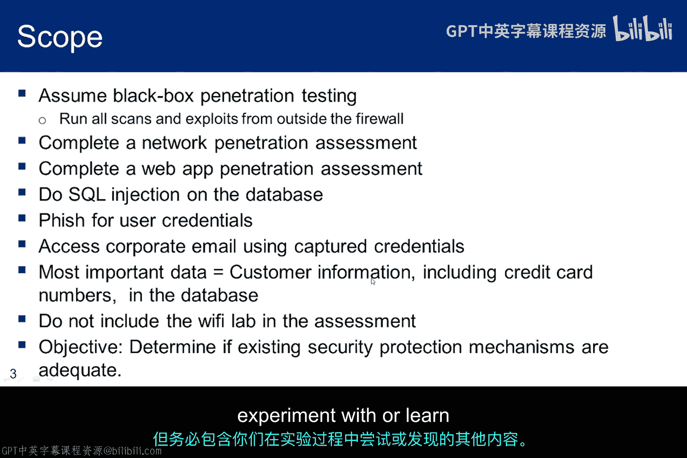
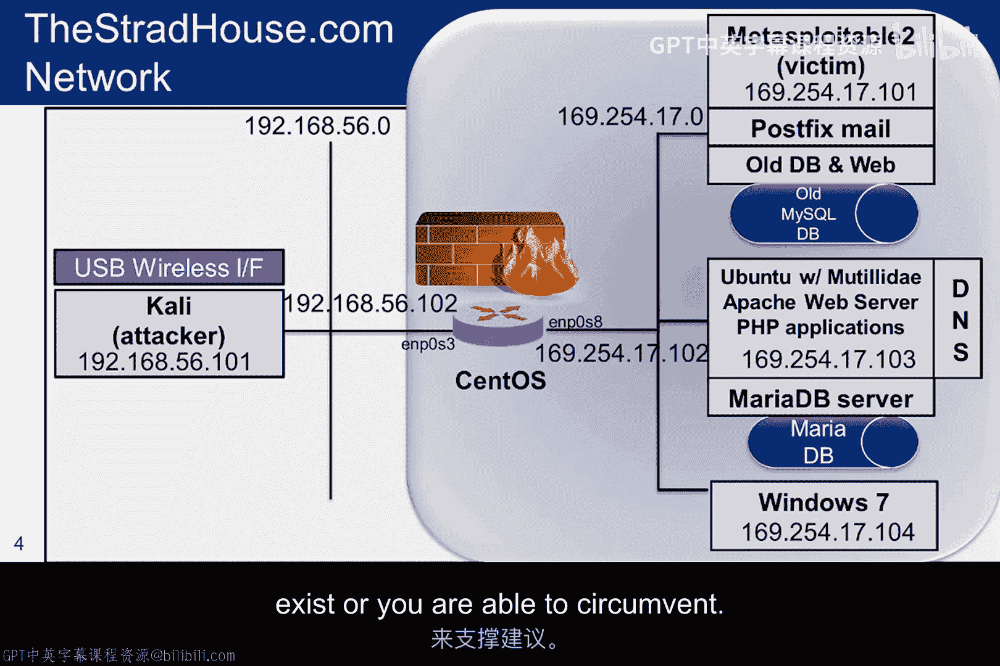
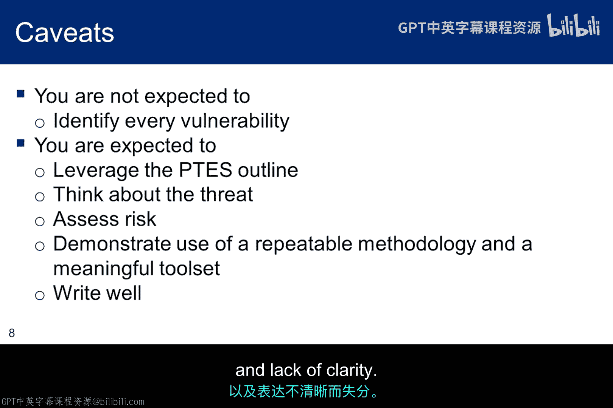

# 012：渗透测试实战场景 🎯

在本节课中，我们将学习如何将渗透测试的理论知识应用于一个模拟的实战场景。我们将探讨如何根据PTES标准，为一个虚构的组织撰写一份有意义的渗透测试报告，并理解在非理想环境下如何调整测试方法与报告内容。

---

由于我们的道德黑客实验环境无法提供一个完整的企业环境，因此PTES标准中的某些要素将不适用于本次作业。我会尽力填补一些空白，并指出可能不适用的部分。你的任务是调整报告，以对这个虚构组织的安全态势进行一次有意义的评估。

既然我们没有实际、健全的组织来进行渗透测试，本幻灯片的内容将为你的报告提供背景。不要误解这张幻灯片。它可能看起来侧重于Web应用和数据库，但你的许多漏洞也将来自Metasploitable服务器上运行的服务以及密码缺陷。

本次渗透测试将只包含三个部分：**网络渗透测试**、**Web应用渗透测试**以及**数据库渗透测试**的一些要素。在你探索Web应用漏洞时，你也应该了解一些MySQL数据库的访问控制机制，并将所学内容纳入报告。在威胁建模方面，假设数据库包含对业务成功运营至关重要的宝贵数据，以及客户个人身份信息。

Web应用实验只要求你探索OWASP Top 10中的三个漏洞，但请确保将你在完成实验过程中尝试或学到的任何其他内容也包含进去。

这是目标环境的一个视图，介于高管将要看到的内容和安全工程师将要看到的内容之间。该架构存在一些弱点。请思考更好的设计方案。但要记住，你的建议应基于发现的漏洞和风险来驱动，而不是系统设计原则。换句话说，你的建议应基于渗透测试结果，有充分的安全理由支持。例如，我们知道在不同内部网段之间部署防火墙的多层架构比图中所示的设计更好，但你需要基于不存在的、或你能够绕过的薄弱控制机制来支持你的建议。

这是一个提醒，PTES指南需要根据实际情况进行调整。例如，由于不存在实际的“小提琴部件供应商”，我们将讨论的许多信息收集工具将不适用。并且由于你只检查了OWASP Top 10中的三个Web应用漏洞，相关的讨论和建议将是不完整的评估，报告中应注明测试的这一不足之处。

以下是你在整个课程中将收集的信息摘要，这些信息将为渗透测试报告提供内容。但要记住，报告不是一堆无关的截图集合。图表是报告的一部分，应仔细标注，但批判性思维才是关键。请思考你正在评估的这个企业。

我们不会在规划周期内进行任何威胁建模，因此你应该回顾PTES网站上关于“战前互动”阶段的威胁建模内容。我已经确定了三个威胁，你应该将其包含在你的测试报告中。如果你采用了不同的威胁建模方法并希望包含其他参与者，那也可以。如果你尚未从威胁的角度思考你的测试，你应该重新审视PTES指南，因为威胁应该驱动渗透测试。这可能会导致额外的扫描、额外的漏洞利用以及额外的利用后活动。

以下是你的报告需要注意的一些事项。首先，不要求你识别每一个漏洞。你会在互联网上找到大量关于Metasploitable的讨论，包括一份160页的漏洞审计报告。但那种报告不是本次作业的目标。本次作业的目标是，将你在整个课程中学到的知识整合成一份遵循PTES指南的结构化文档。你希望渗透测试由威胁建模驱动，或者至少从前一张幻灯片中提到的威胁参与者的视角出发。

确保报告中记录的所有方法都基于批判性思维和可重复的方法论。这并不是说创造性思维不起作用。事实上，它对你的成功至关重要。这只是意味着需要有一个可重复的过程，以便你能够在12个月后为客户再次执行，从而生成在第一次渗透测试背景下有意义且可比较的第二次结果。

对于一个易受攻击的系统，可以考虑在不同时间、针对不同操作系统版本运行渗透测试。你希望结果是可重复且可比较的。最后，确保你的写作简洁、清晰，并有流畅的过渡。工程师通常擅长向其他工程师解释技术细节，但不擅长向高管解释诸如业务风险之类的事情。你需要两者都能做到。事实上，我建议你找一个非技术人员阅读你的“执行摘要”，看看他们是否能跟上思路。即使有些内容对他们来说很陌生，阅读执行摘要也不应要求具备技术专长。拼写错误、语法错误、过渡生硬和表述不清都会导致扣分。

---

本节课中，我们一起学习了如何为一个模拟的实战场景准备渗透测试报告。我们明确了在有限环境下调整PTES标准的重要性，理解了报告应基于实际发现的漏洞和风险提出建议，而非单纯的设计原则。我们还强调了威胁建模对测试的驱动作用、报告内容的批判性思维与可重复性，以及向不同受众清晰传达技术发现和业务风险的必要性。