# 013：密码学基础

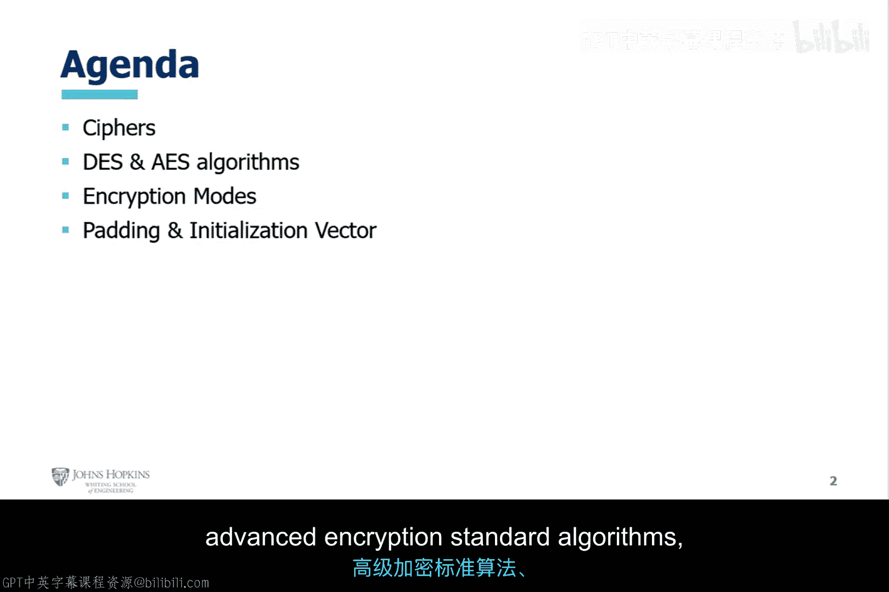

## 概述

在本节课中，我们将学习密码学的基础知识，包括两种主要的密码类型、数据加密标准、高级加密标准以及几种常见的加密模式。我们还将探讨填充和初始化向量的概念及其在加密过程中的重要性。

---

## 密码类型 🔐

上一节我们介绍了模块三的总体内容，本节中我们来看看密码学的基础——密码类型。密码主要分为两种：置换密码和替换密码。

**置换密码**：字母被重新排列，但字母本身不改变。
例如，使用列置换技术处理明文“hello world”，会得到垂直格式的密文“HOL E WDLOLR”。

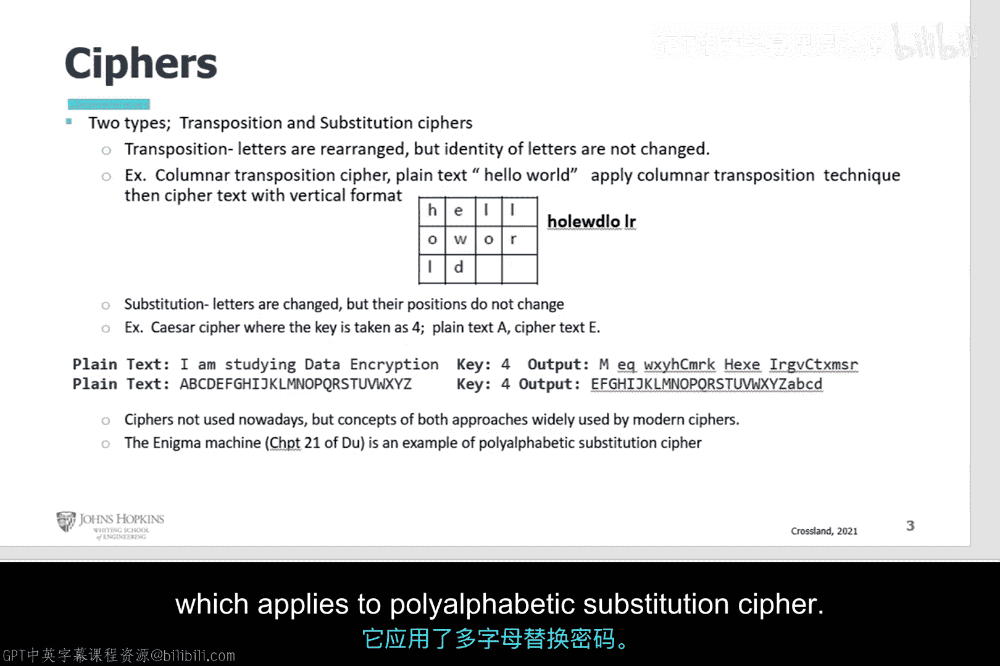

**替换密码**：字母被改变，但位置保持不变。
例如，在凯撒密码中，如果密码偏移四个字母，那么明文中的A就会变成E。

虽然这些古典密码如今已不常用，但它们的核心思想仍被现代密码算法所采用。

---

## 数据加密标准 📜

了解了古典密码后，我们来看一个重要的现代加密标准。数据加密标准是一种基于Lucifer密码的加密标准，但其设计者做出了两项有争议的修改，主要是将密钥长度减少了一半以上。

原始的128位密钥被缩减为64位，其中实际密钥长度为56位，外加8位奇偶校验位。

在1997年至1999年间，RSA安全公司发起了一系列破解DES的挑战，证明了56位密钥在面对暴力攻击时是脆弱的。这催生了三重DES的出现，其密钥长度为 `56 * 3 = 168` 位。

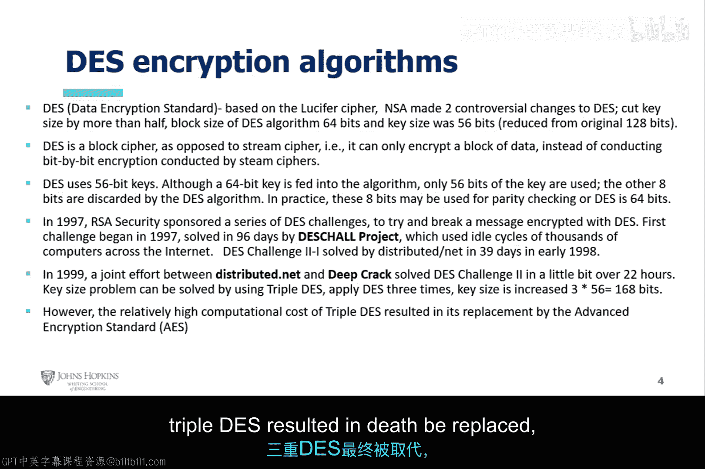

然而，三重DES的计算开销较大，最终被更高效的**高级加密标准**所取代。

---

## 高级加密标准 ⚙️

与DES不同，AES的制定过程是公开的，没有NSA的参与。其选拔标准非常严格。

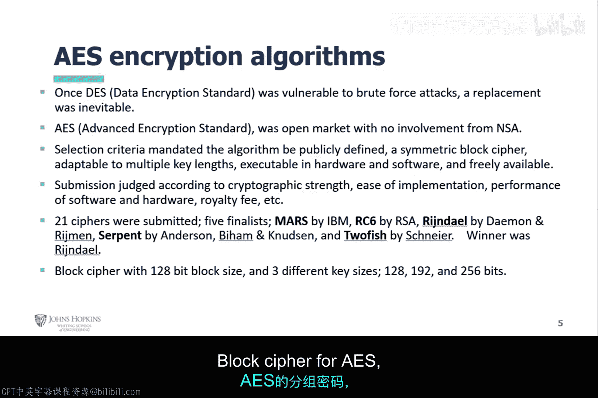

以下是AES算法的选拔标准：
*   算法必须是对称分组密码。
*   算法必须公开定义并可自由获取。
*   算法必须支持多种密钥长度。

根据密码强度、易于实现性、软硬件性能以及专利费用等因素进行评判后，Rijndael分组密码最终胜出，成为AES标准。AES支持的密钥长度包括128位、192位和256位。

---

## 加密模式 🔄

在选择了加密算法后，如何使用它也同样重要。接下来我们探讨几种不同的加密操作模式。

### 电子密码本模式

ECB模式是一种分组密码模式，使用64位分组。它简单、快速，适用于加密小数据块。

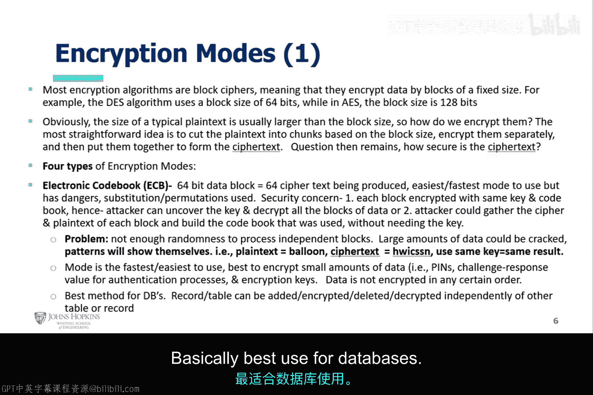

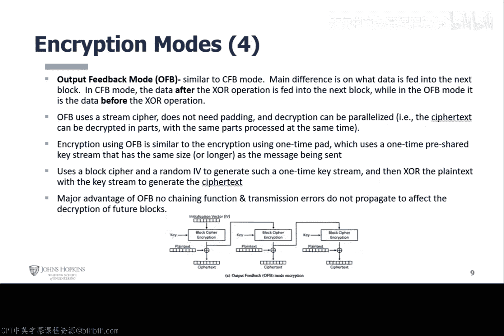

但它存在安全风险：
1.  每个数据块使用相同的密钥加密，攻击者可能破解密钥并解密所有数据块。
2.  攻击者可以收集每个块的密文/明文对，无需密钥即可构建密码本。

其核心问题是缺乏随机性，在处理大量数据时，重复的模式会暴露。公式表示为：`相同的明文 + 相同的密钥 = 相同的密文`。

尽管如此，ECB因其高效性，仍常用于PIN码、挑战-应答认证等处理小数据的场景。

### 密码分组链接模式

在ECB之后，我们来看CBC模式。它与ECB的主要区别在于，CBC不会像ECB那样暴露数据模式。

CBC模式使用**初始化向量**。这是一个关键改进，因为IV能确保即使两个明文块相同，其密文也会不同。

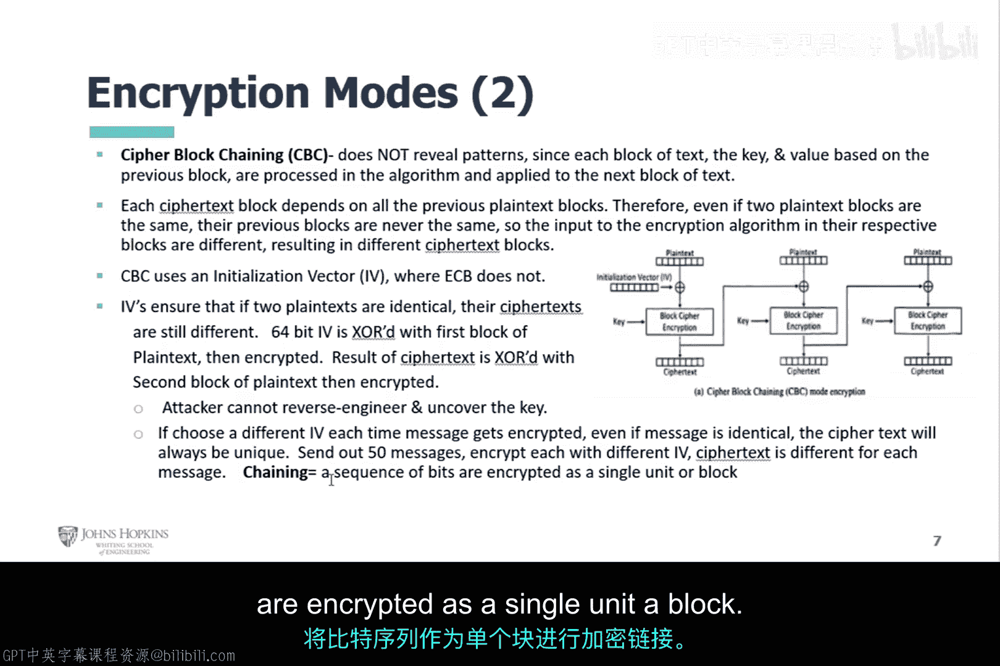

其工作流程是：第一个明文块先与IV进行异或操作，然后再加密。后续的每个明文块都会先与前一个密文块进行异或，再进行加密。这个过程称为**链式处理**。

### 密码反馈模式

CFB模式结合了分组密码和流密码的特性。它像CBC一样使用初始化向量和链式处理。

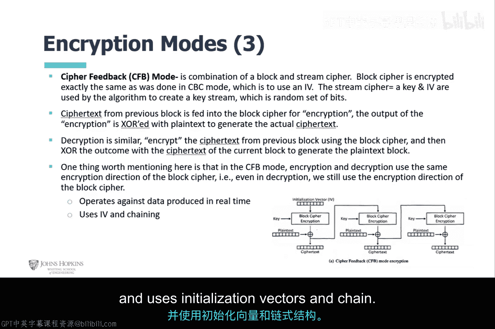

此外，它使用密钥和IV通过算法生成一个随机的**密钥流**。该模式适用于实时产生的数据。

### 输出反馈模式

OFB模式与CFB模式相似，主要区别在于反馈到下一个块的数据不同。

在CFB中，异或操作**之后**的数据被反馈。而在OFB中，异或操作**之前**的数据被反馈。

OFB模式的一个主要优势是**没有链式功能**，因此传输错误不会传播，不会影响后续数据块的解密。

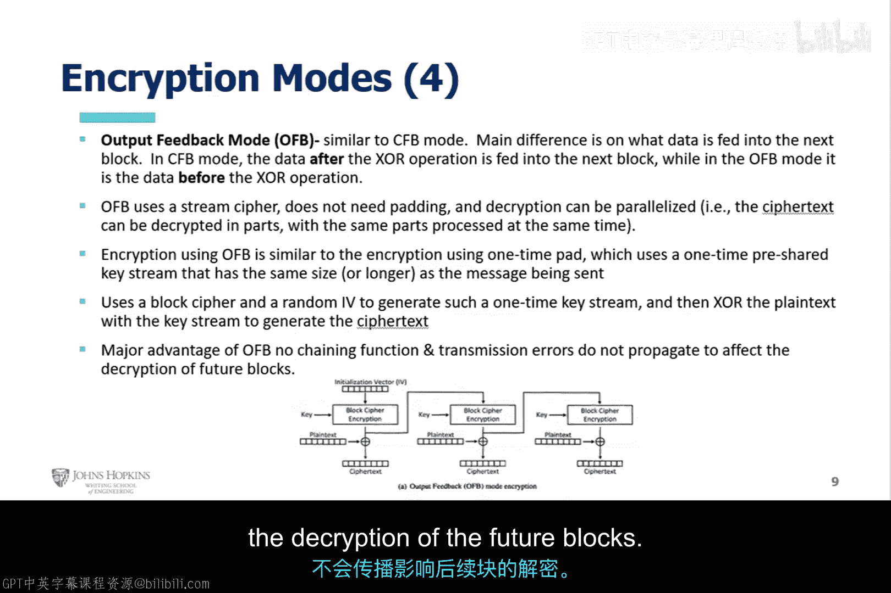

---

## 填充与初始化向量 🧩

最后，我们来讨论加密中的两个重要辅助技术：填充和初始化向量。

当使用某些加密模式时，数据被划分为与密码分组大小匹配的块。但最后一个数据块的大小通常无法保证匹配。此时就需要进行**填充**。

对于CBC等模式，填充是必要的。加密前，需要向最后一个明文块添加数据，使其大小等于密码的分组大小。而对于使用流密码的模式，填充通常不是问题。

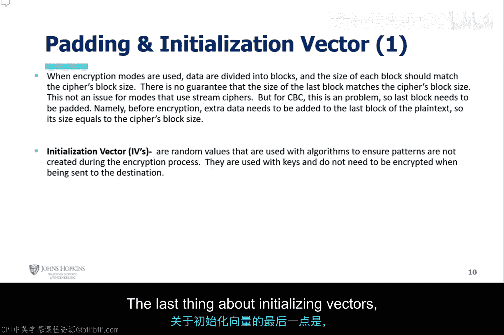

关于**初始化向量**，需要知道的是：如果不使用IV，那么用相同密钥加密的两个相同明文，将产生相同的密文。IV和密钥一起为加密过程提供了更多的随机性。

然而，使用IV时也需注意：
1.  IV需要存储空间，并且必须唯一。
2.  如果IV可预测或重复使用，系统可能容易受到已知明文攻击或选择明文攻击。

因此，开发者必须确保IV随时间变化且不可预测。

---

## 总结

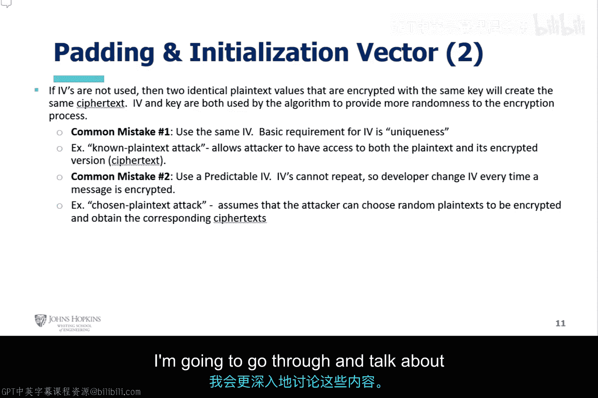

本节课我们一起学习了密码学的基础知识。我们从置换密码和替换密码开始，了解了DES标准的历史与局限，以及AES标准的优势。然后，我们深入探讨了ECB、CBC、CFB和OFB这几种加密模式的工作原理与特点。最后，我们明确了填充和初始化向量在确保加密安全性和正确性中的关键作用。理解这些概念是进一步学习密码学和网络安全的重要基础。