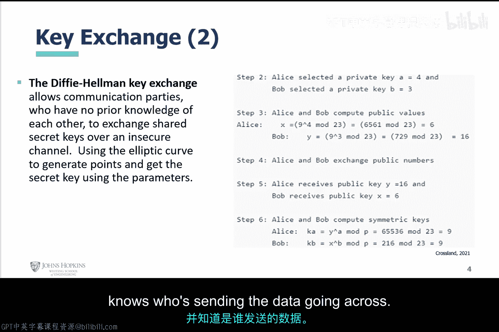
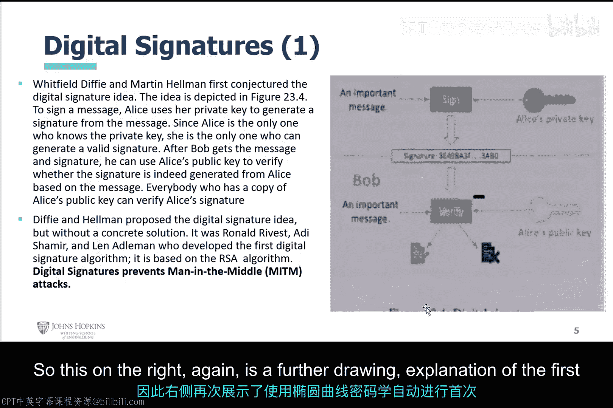
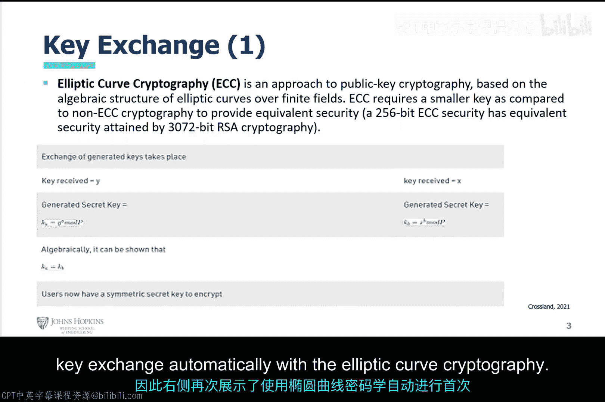
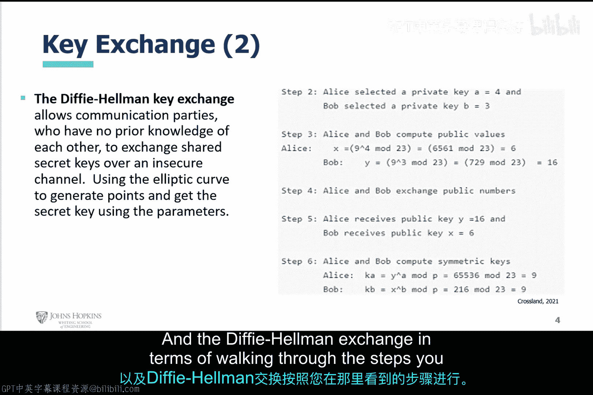
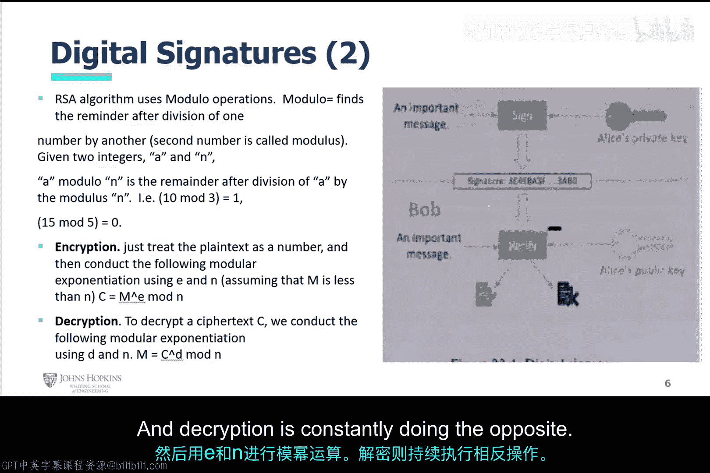
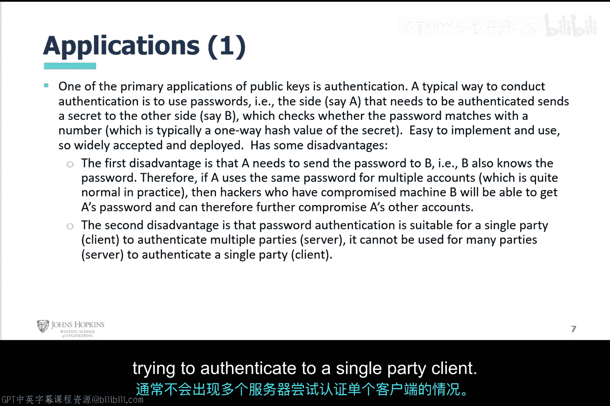
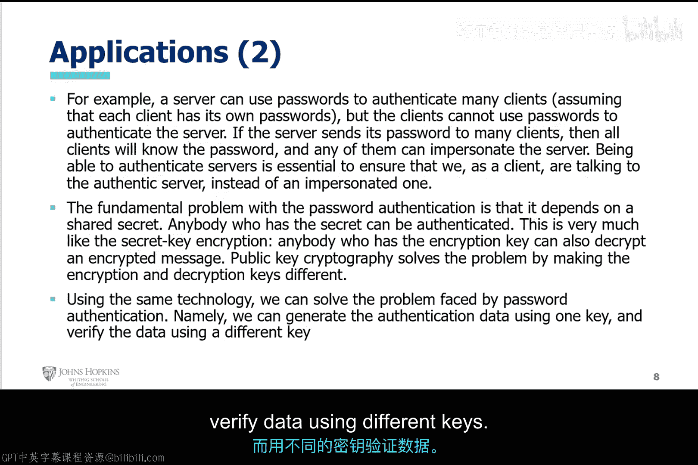

# 014：公钥密码学原理 🔐

在本节课中，我们将要学习公钥密码学的基本原理。公钥密码学是现代安全通信的基石，它解决了对称加密中密钥分发的难题。我们将重点探讨其三个核心组成部分：密钥交换、数字签名及其应用。

## 概述

公钥密码学，也称为非对称加密，使用一对密钥：公钥和私钥。公钥可以公开分享，用于加密或验证签名；私钥则必须严格保密，用于解密或生成签名。接下来，我们将逐一解析其核心概念。

## 密钥交换

上一节我们介绍了对称加密的挑战，本节中我们来看看如何安全地交换密钥。密钥交换是公钥密码学的重要应用之一，它允许通信双方在不安全的信道上建立一个共享的秘密密钥。

椭圆曲线密码学是当前密钥交换的主流方法。它是一种基于椭圆曲线代数结构的公钥密码学方法。

**公式：** 椭圆曲线方程通常表示为 **y² = x³ + ax + b**。

与传统的RSA算法相比，椭圆曲线密码学能够以更短的密钥长度提供同等的安全性。例如，256位的椭圆曲线密钥提供的安全强度，相当于3072位的RSA密钥。

以下是密钥交换过程的数学步骤分解：
1.  通信双方（例如Alice和Bob）各自生成一对公私钥。
2.  他们互相交换公钥。
3.  每一方使用自己的私钥和对方的公钥，通过特定的椭圆曲线点运算，独立计算出相同的共享秘密密钥。

这个过程的核心是迪菲-赫尔曼密钥交换协议。该协议允许两个从未通信过的实体，通过不安全的信道安全地交换密钥。

在右侧图表中，您可以看到Alice和Bob交换密钥的具体步骤。Alice选择一个私钥，Bob也选择一个私钥，他们通过一系列模运算和公钥交换，最终得到相同的共享密钥。

## 数字签名

理解了密钥交换后，我们进一步探讨公钥密码学的另一个核心功能：数字签名。数字签名用于验证信息的完整性和发送者的身份。

怀特菲尔德·迪菲和马丁·赫尔曼在提出密钥交换时，首次构想了数字签名的概念，这成为了该技术的起点。

右侧的图表进一步详细解释了结合椭圆曲线密码学的首次密钥交换过程。

如果您逐步查看交换条款，可以在那里看到详细步骤。

当您完成密钥交换后，基本上如右侧屏幕所示。右侧的图23.4描绘了签名过程。

为了对消息签名，Alice使用她的私钥从消息生成一个签名。由于只有Alice知道她的私钥，她能生成这个签名并发送出去。

当Bob收到带有签名的消息后，他可以使用Alice的公钥来验证签名，从而确认消息的真实性和来源。任何拥有Alice公钥副本的人都可以验证她的签名。

迪菲-赫尔曼提出了数字签名的构想，但没有给出具体解决方案。这项技术后来在RSA算法中得以实现。罗纳德·李维斯特、阿迪·萨莫尔和伦纳德·阿德曼基于RSA算法开发了第一个实用的数字签名算法。

数字签名有助于防止中间人攻击，我们将在后续视频中讨论这种攻击。

RSA算法基于这几位科学家的工作，它主要使用模运算。模运算基本上是求一个数除以另一个数后的余数。

**公式：** 给定两个整数A和N，A mod N 的结果是A除以N后的余数。

例如：
*   10 mod 3 = 1 （因为10除以3余1）
*   15 mod 5 = 0 （因为15除以5余0）

在加密和解密过程中，加密时将明文视为一个数字，然后使用公钥指数E和模数N进行模幂运算。解密过程则使用私钥指数D进行反向运算。

现在在公式区域，您可以看到它们如何分解加密和解密这两个过程。

## 应用

最后，我们来探讨公钥密码学的应用。其中一个主要应用是身份认证。

进行身份认证的典型方法是使用密码。

假设客户端A需要向客户端B发送加密消息，并需要被认证。B会检查密码是否与存储的哈希值匹配。这种方法易于实现和使用，因此在开发和部署中被接受。

但这种方法存在一些缺点。

以下是密码认证的主要缺点：
1.  **密码需要被传送**：A需要将密码发送给B，因此B也知道密码。如果A在多个账户中使用相同密码（这很常见），那么入侵了B机器的黑客也能获取A的密码，从而进一步入侵A使用相同密码的其他账户。
2.  **单向认证**：密码认证通常适用于单方认证，例如客户端向服务器认证。但反过来（服务器向客户端认证）效果不佳。通常，服务器不会尝试向单个客户端认证自己。

应用的另一部分是，服务器可以使用密码来认证多个客户端，这假设每个客户端都有自己的密码。

但客户端通常不能使用密码来认证服务器。因为服务器如果将同一个密码发送给多个客户端，所有客户端都会知道密码，其中任何一个都可以冒充服务器。这就是为什么通常是客户端对服务器进行单向认证，而不是反过来。

然而，能够认证服务器至关重要，这能确保我们作为客户端是在与真实的服务器通信。否则，认证信任可能被破坏。

密码认证的根本问题在于它依赖于共享的秘密。这类似于对称加密：任何拥有秘密（密钥）的人都可以被认证，就像任何拥有加密密钥的人也能解密消息一样。

因此，公钥密码学（非对称加密）解决了这个问题。您不需要像对称加密那样拥有一个共享的相同密钥。

公钥密码学通过数字签名或迪菲-赫尔曼/椭圆曲线密钥交换来解决此问题。因为您使用的加密和解密密钥是不同的。

利用同样的技术，我们可以解决密码认证面临的问题。我们可以使用一个密钥（私钥）生成认证数据，而使用另一个不同的密钥（公钥）来验证该数据。

## 总结

本节课中我们一起学习了公钥密码学的核心原理。我们从密钥交换开始，了解了椭圆曲线密码学如何高效安全地建立共享密钥。接着，我们探讨了数字签名如何验证消息的真实性和完整性，并介绍了RSA算法的模运算基础。最后，我们分析了公钥密码学在身份认证中的应用，以及它如何克服传统密码认证的缺陷。公钥密码学通过使用非对称的密钥对，为安全通信和身份验证提供了强大的基础。