# 015：公钥基础设施(PKI) 🔐

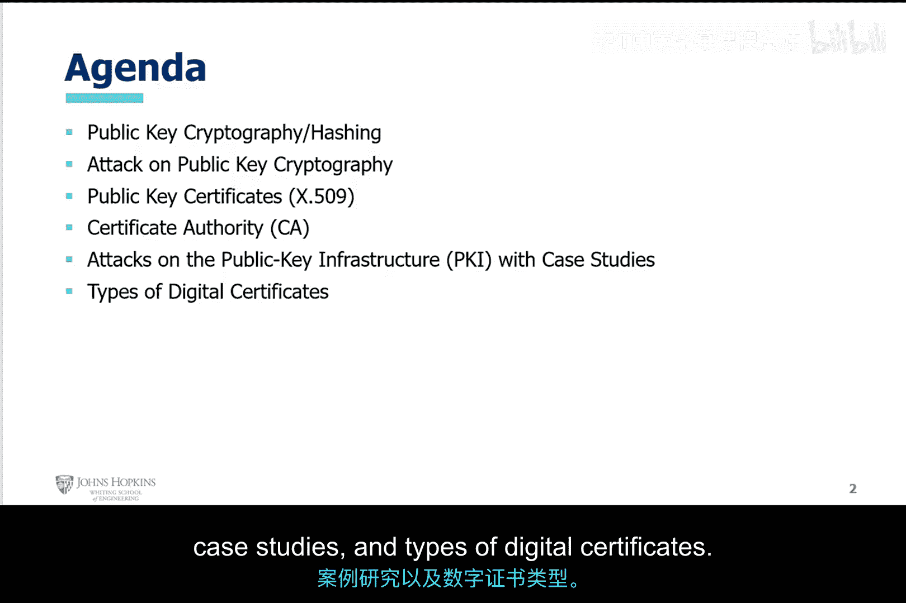

在本节课中，我们将要学习公钥基础设施（PKI）的核心概念。我们将探讨公钥加密、哈希函数、针对公钥加密的攻击、公钥证书（特别是X.509标准）、证书颁发机构的工作原理、对PKI的攻击、相关案例研究以及数字签名证书的类型。

---

## 公钥加密与哈希

上一节我们介绍了数字签名和密钥交换。本节中，我们来看看公钥加密和哈希函数如何构成PKI的基础。

公钥加密（PKI）解决了对称加密中的密钥交换难题。在对称加密中，双方需要使用相同的密钥，而安全地交换这个密钥本身就是一个挑战。公钥加密使用一对密钥：**公钥**和**私钥**。公钥可以公开分享，用于加密数据；私钥则必须保密，用于解密数据。其核心关系可以表示为：

*   **加密**：`密文 = 加密函数(公钥, 明文)`
*   **解密**：`明文 = 解密函数(私钥, 密文)`

然而，公钥加密并非绝对安全，它仍然容易受到特定攻击，例如我们之前提到的**中间人攻击**。

---

## 中间人攻击详解

为了理解PKI的必要性，我们需要深入分析中间人攻击是如何发生的。

假设Alice和Bob希望安全通信。以下是攻击者Mallory进行中间人攻击的步骤：

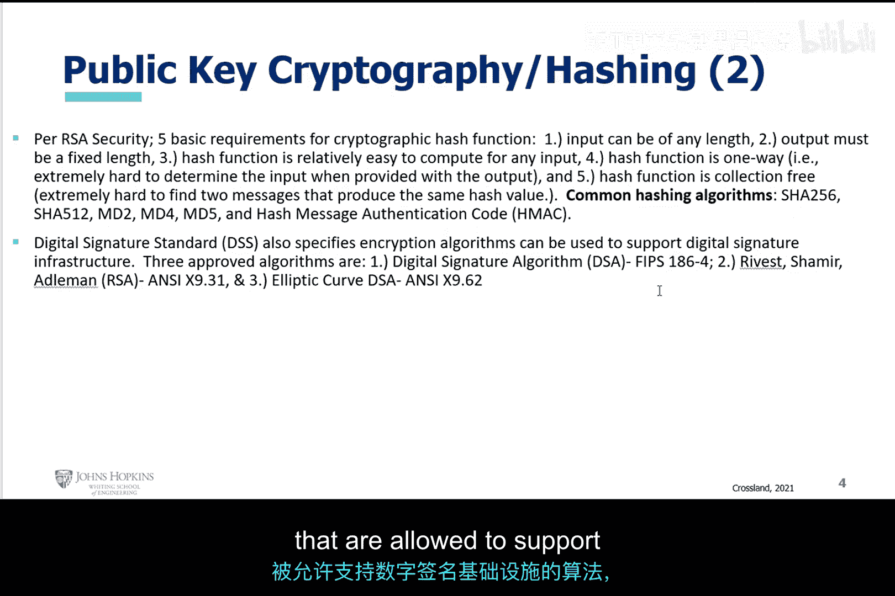

1.  **拦截公钥**：当Alice试图将她的公钥发送给Bob时，Mallory拦截了这个传输。
2.  **替换公钥**：Mallory将自己的公钥发送给Bob，并冒充是Alice的公钥。
3.  **欺骗Bob**：Bob收到公钥（以为是Alice的，实则是Mallory的），并用它加密一个生成的**会话密钥**，然后发送给“Alice”。
4.  **再次拦截与解密**：Mallory拦截Bob发送的加密消息。因为她有自己的私钥，可以解密该消息，从而获得Bob生成的会话密钥。
5.  **重新加密并转发**：Mallory用Alice真正的公钥重新加密这个会话密钥，然后转发给Alice。
6.  **通信被监听**：至此，Alice和Bob都拥有了相同的会话密钥，可以开始对称加密通信。但Mallory也拥有这个密钥，因此她可以解密Alice和Bob之间的所有后续通信，甚至可能篡改内容。

这个攻击之所以成功，是因为通信双方缺乏一个可信的机制来验证公钥的真实归属。

---

## 数字签名与证书颁发机构

为了解决中间人攻击问题，我们需要引入可信的第三方和数字签名。

数字签名和证书颁发机构通过以下方式修复了安全漏洞：
1.  **使用非对称加密**：继续使用公钥和私钥对，而非单一的共享密钥。
2.  **引入可信第三方**：证书颁发机构作为一个受信任的实体，负责验证用户的身份并将其与公钥绑定。

其工作流程如下：
*   Alice向CA申请证书。CA验证Alice的身份后，使用CA自己的私钥为Alice的公钥及相关信息（如身份信息）生成一个**数字签名**，并打包成**数字证书**。
*   Alice将她的证书（包含她的公钥和CA的签名）发送给Bob。
*   Bob收到证书后，使用他信任的CA的公钥来验证证书上的签名。如果验证通过，Bob就可以确信证书中的公钥确实属于Alice。

即使Mallory拦截了证书，她也无法用自己的公钥替换Alice的公钥，因为那样会导致CA的签名无效，Bob在验证时会发现异常。Mallory也无法从CA那里获得一个以Alice名义签发、但包含Mallory公钥的证书，因为CA在签发前会进行严格的身份验证。

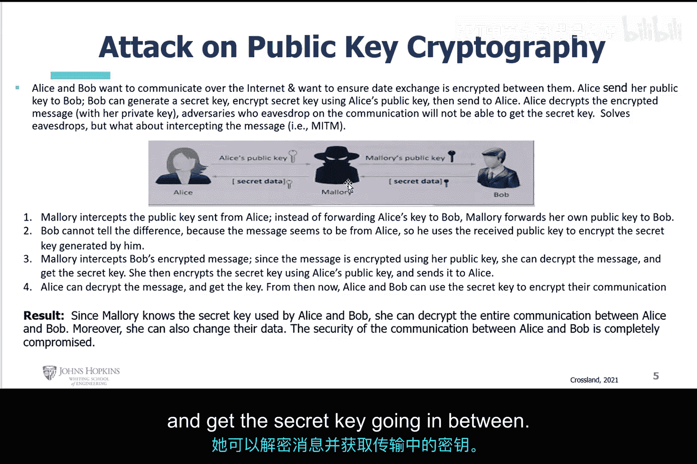

---

## X.509公钥证书

数字证书遵循标准格式，其中最广泛应用的是X.509标准。

一个X.509证书包含多个字段，以下是核心部分：
*   **版本**
*   **序列号**
*   **签名算法**
*   **颁发者**：签发证书的CA名称。
*   **有效期**：证书的起止日期和时间。
*   **主体**：证书持有者的名称（如个人或组织）。
*   **主体公钥信息**：持有者的公钥及使用的算法。
*   **颁发者唯一标识符** / **主体唯一标识符**
*   **扩展**
*   **签名**：CA对以上所有信息计算哈希值并用CA私钥加密后的结果。

---

## 证书的注册、验证与吊销

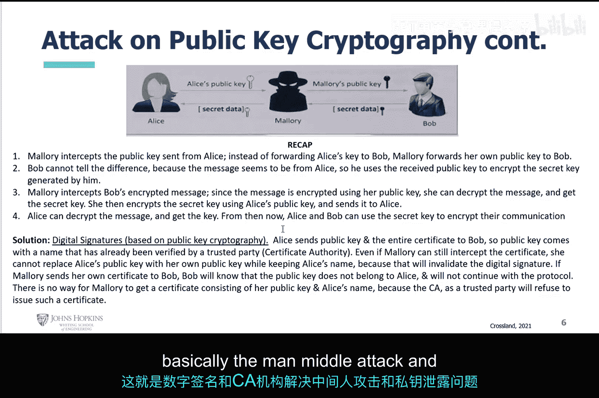

证书的生命周期管理涉及三个关键环节：

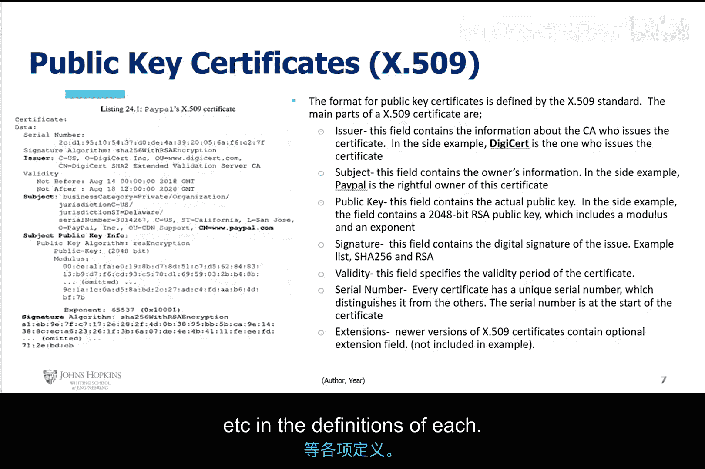

**1. 注册**
用户必须向证书颁发机构证明自己的身份，才能获得数字证书。这个过程通常需要提供官方身份证明文件，有时甚至需要本人到场。

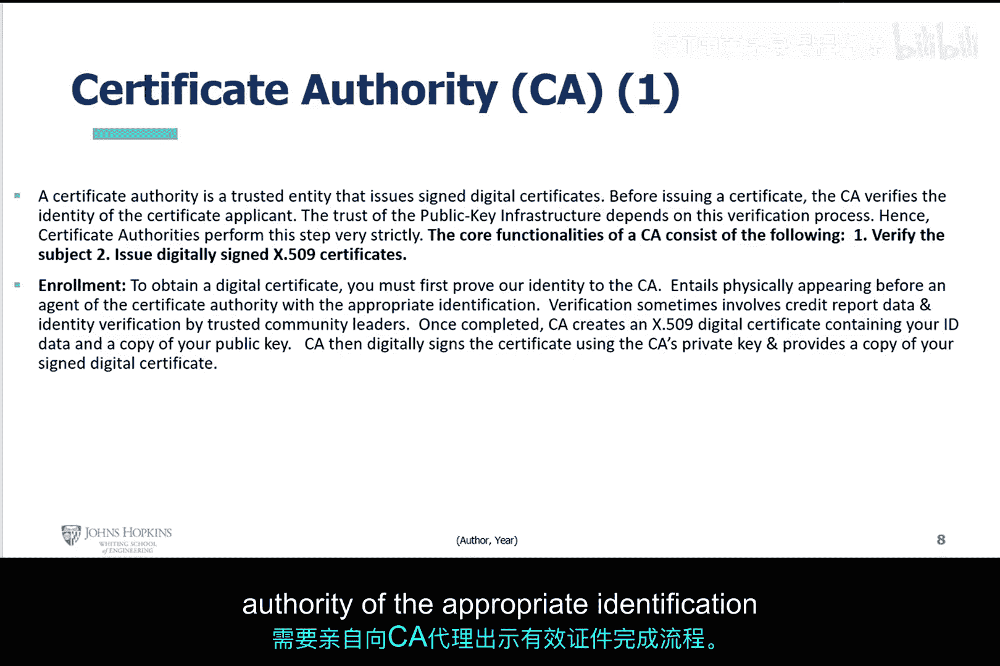

**2. 验证**
当一方收到另一方的证书时，会通过验证CA的数字签名来确认证书的真实性和有效性。

**3. 吊销**
证书在到期前可能因某些原因被撤销。以下是常见的吊销原因：
*   证书持有者的私钥疑似泄露。
*   发现证书是欺诈性获得的。
*   证书持有者状态变更（如公司解散、员工离职）。
*   CA的私钥泄露。

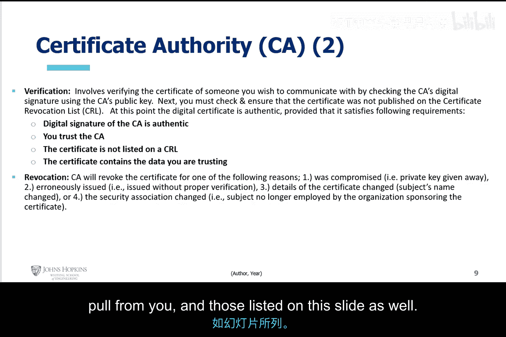

---

## PKI攻击案例研究

对PKI的攻击主要针对其验证和签发流程。以下是两个历史案例：

**案例一：针对CA验证过程的攻击（2011年）**
攻击者入侵了一家“注册机构”（RA，协助CA验证用户身份的实体）。通过该RA，攻击者向CA提交了虚假证明，声称自己拥有某些知名域名（如 `mozilla.org` 的子域名）。CA在验证不充分的情况下，为这些域名签发了证书。幸运的是，这些恶意证书在造成实际危害前被安全公司发现并报告，浏览器厂商随后通过更新将涉事证书加入黑名单。

**案例二：针对CA签发过程的攻击（DigiNotar事件）**
攻击者直接入侵了荷兰一家CA（DigiNotar）的系统，并非法签发了数百张伪造的证书，其中包括针对Google等知名网站的证书。这些证书被用于在特定地区（主要是伊朗）发起中间人攻击，可能截获了约30万用户的通信。事件最终被曝光，该CA随后破产。

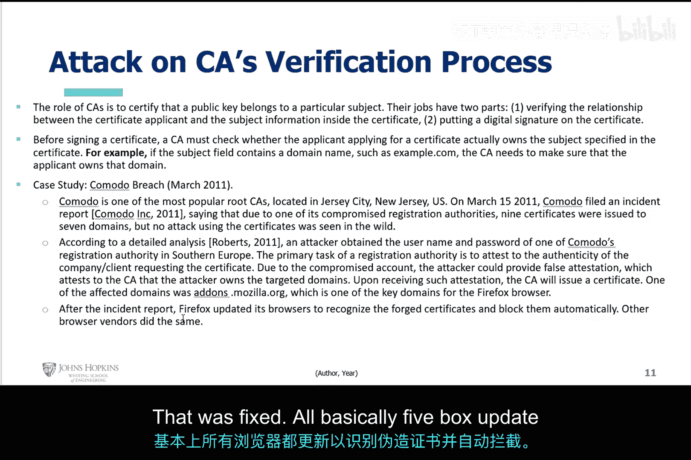

---

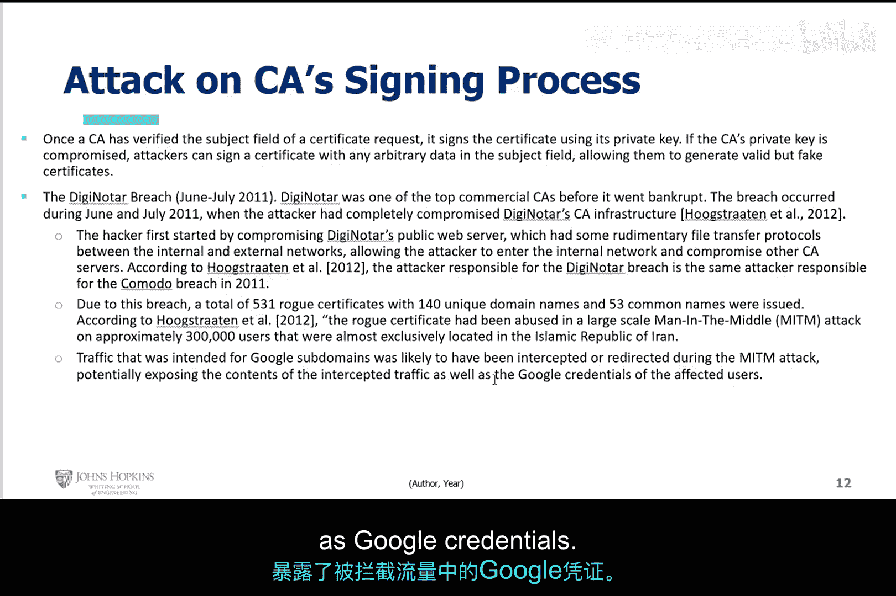

## 对哈希算法的攻击

数字签名的安全性依赖于哈希函数的两个关键属性：**单向性**和**抗碰撞性**。
*   **单向性**：难以从哈希值反推出原始输入。
*   **抗碰撞性**：难以找到两个不同的输入，使它们产生相同的哈希值。

2017年，研究人员宣布了对SHA-1哈希算法的“碰撞攻击”（命名为SHAttered）。他们成功制造了两个内容不同但SHA-1哈希值完全相同的PDF文件。这意味着：
*   攻击者可以创建一个证书申请文件（A）和一个恶意网站文件（B），使它们具有相同的SHA-1哈希值。
*   攻击者将文件A提交给CA，CA对其哈希值进行签名并颁发证书。
*   由于文件B的哈希值与文件A相同，CA对文件A的签名也等同于对文件B的签名。
*   攻击者从而可以利用这份合法的签名，为恶意网站B伪造一个看似有效的证书，进而可能发起中间人攻击。此事件加速了行业从SHA-1向更安全的SHA-256等算法迁移。

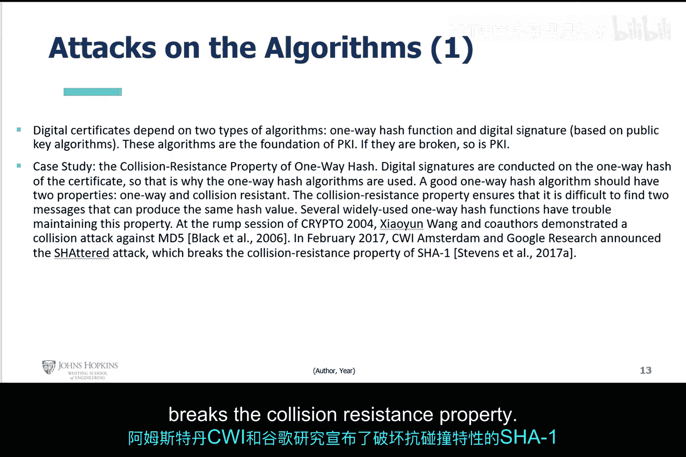

---

## 数字证书的类型

数字证书根据验证等级主要分为三类：

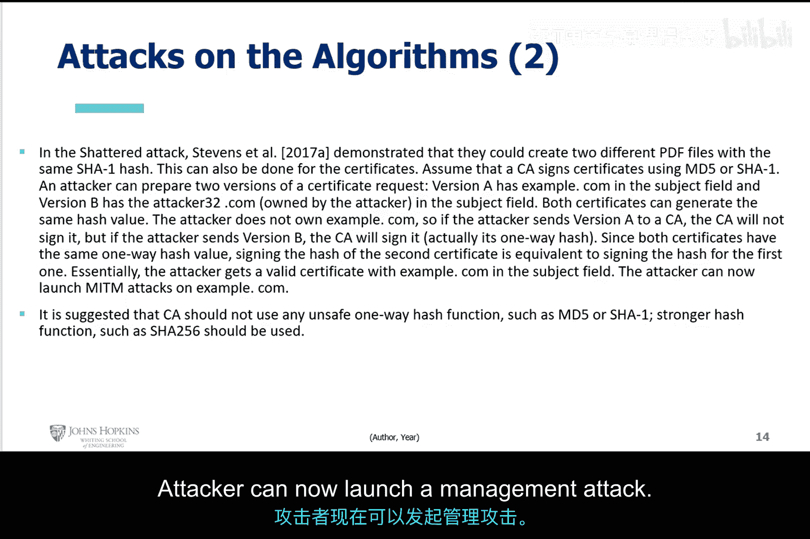

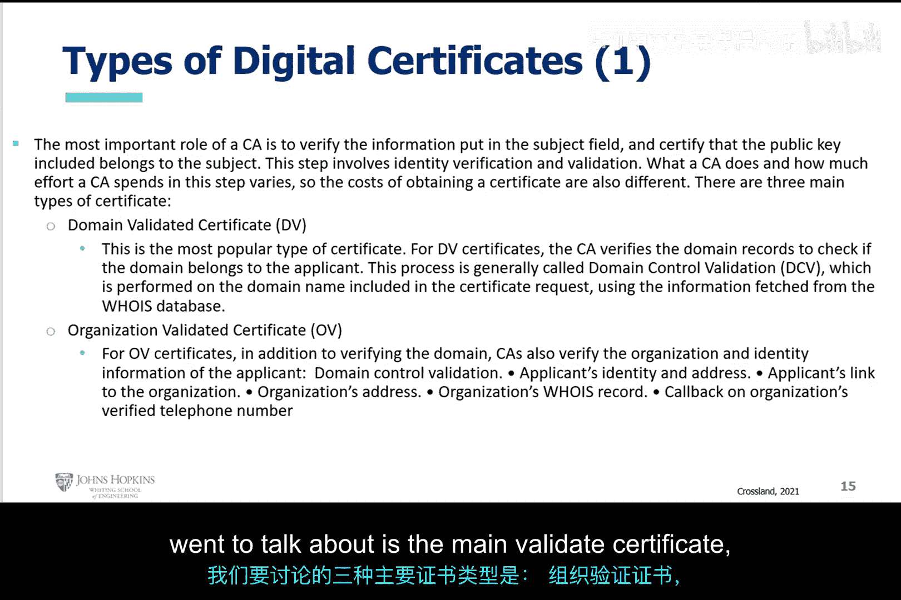

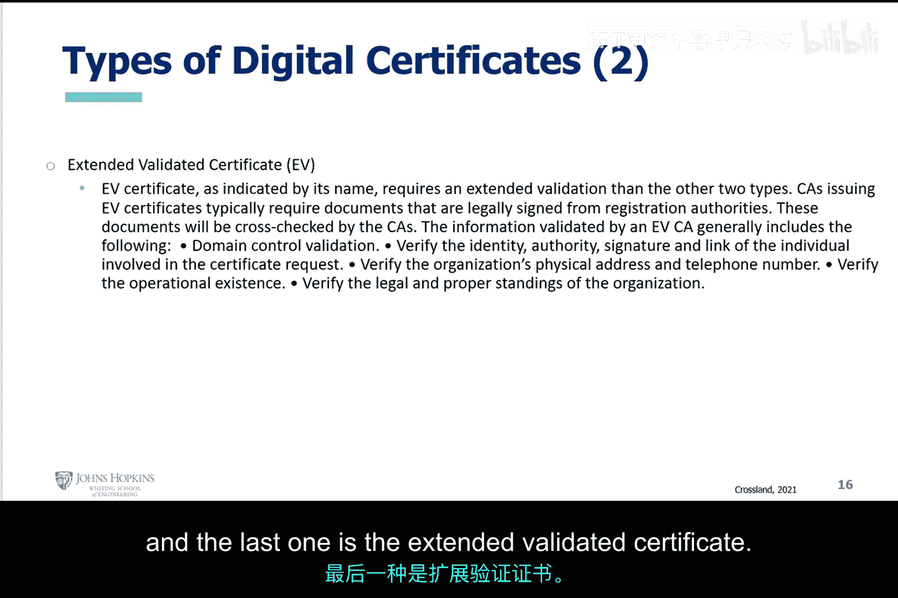

**1. 域名验证证书**
这是最常见的类型。CA仅验证申请者对特定域名的控制权（例如，通过向该域名注册的邮箱发送验证邮件）。它不验证组织或个人的真实身份。

**2. 组织验证证书**
除了验证域名控制权，CA还会验证申请组织的真实存在性（如通过官方数据库核查公司注册信息）。此类证书会在证书详情中显示组织名称。

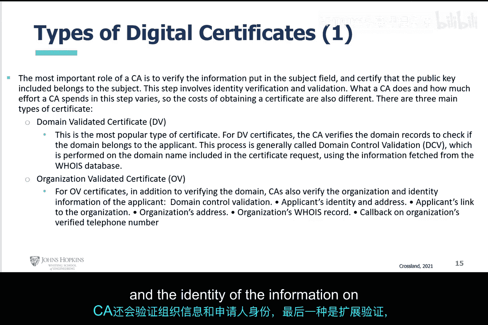

**3. 扩展验证证书**
这是验证级别最高的证书。CA会执行严格的审查流程，包括验证组织的法律、物理和运营存在性。签发EV证书通常需要提供更多法律文件，并经过多步人工核查。浏览器在访问使用EV证书的网站时，地址栏会显示绿色的公司名称，提供更高的视觉信任提示。

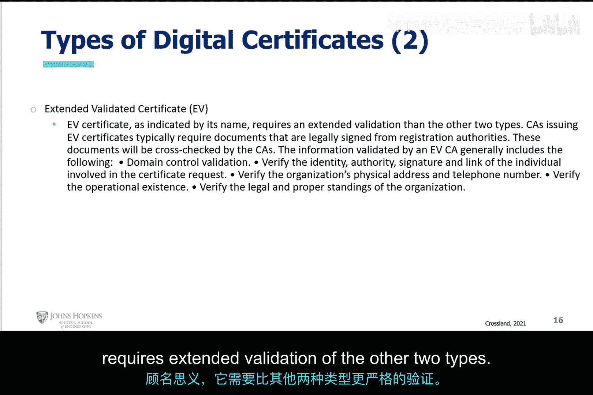

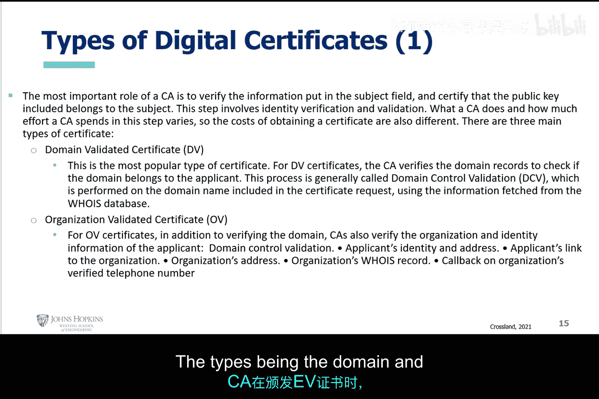

---

## 总结

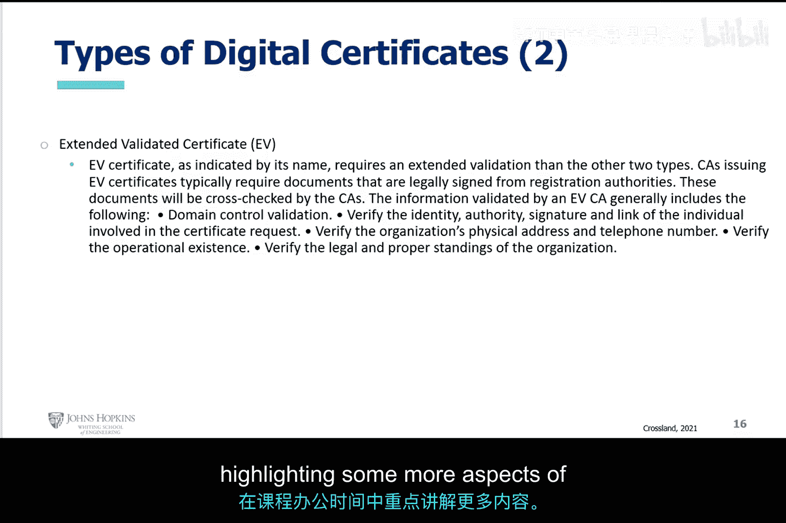

本节课中，我们一起学习了公钥基础设施的完整体系。我们从公钥加密的原理和面临的中间人攻击出发，理解了引入数字签名和证书颁发机构的重要性。我们详细剖析了X.509证书的结构、生命周期管理（注册、验证、吊销），并通过历史案例看到了PKI在实际中可能遭受的攻击。最后，我们了解了不同验证等级的数字证书类型及其应用场景。PKI是现代网络安全的基石，它通过建立信任链，确保了网络通信中身份的真实性和数据的机密性。