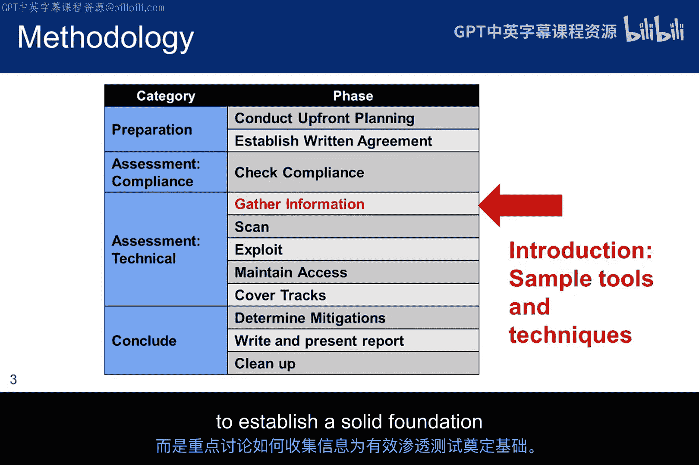
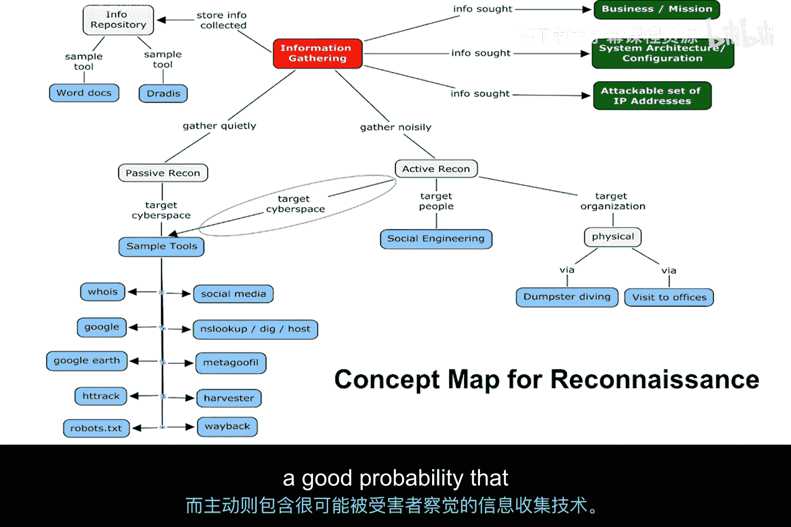
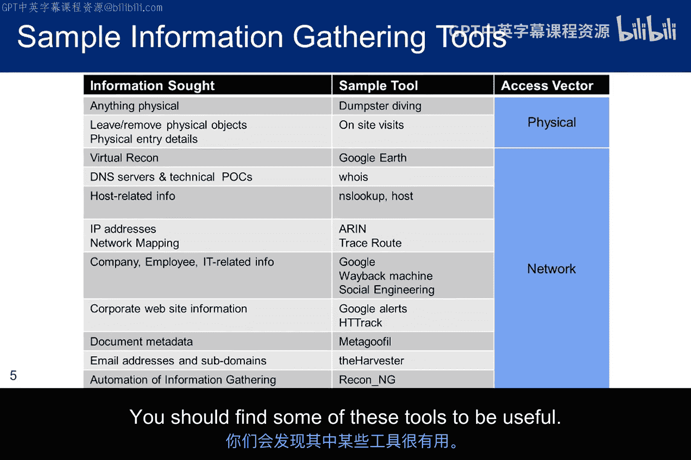
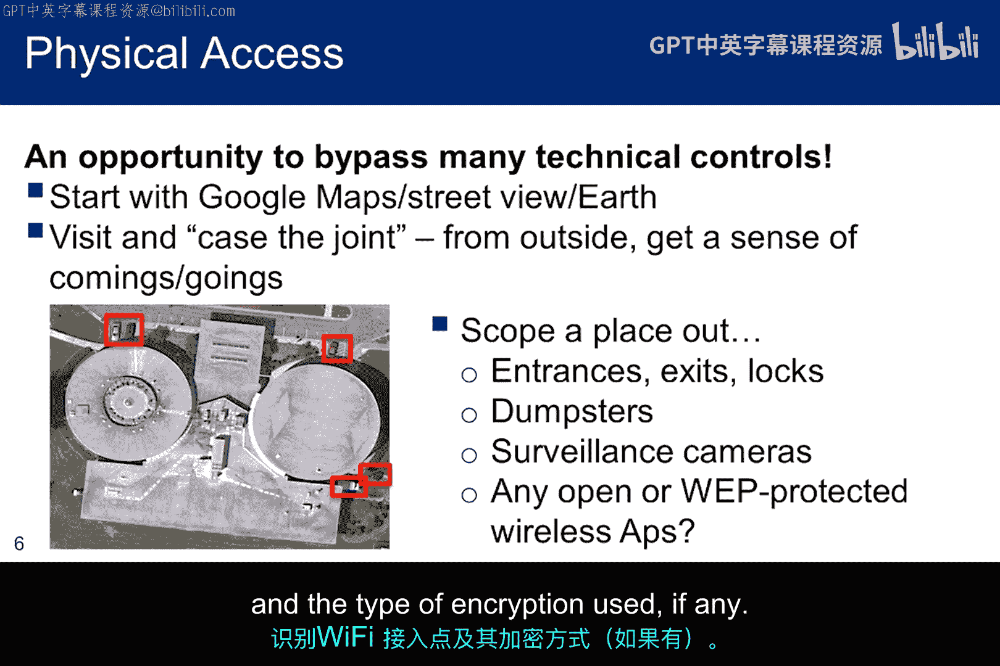
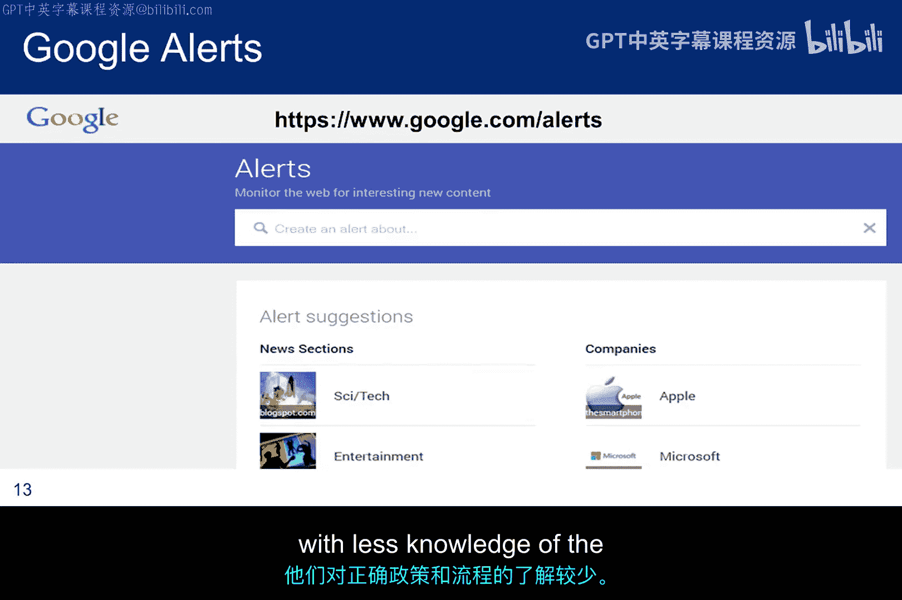
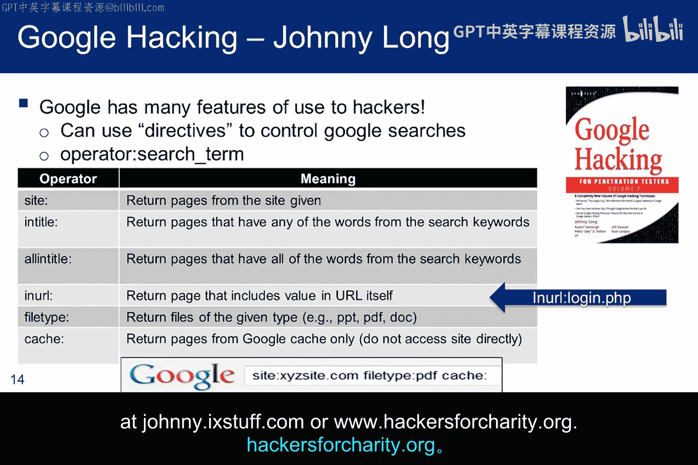
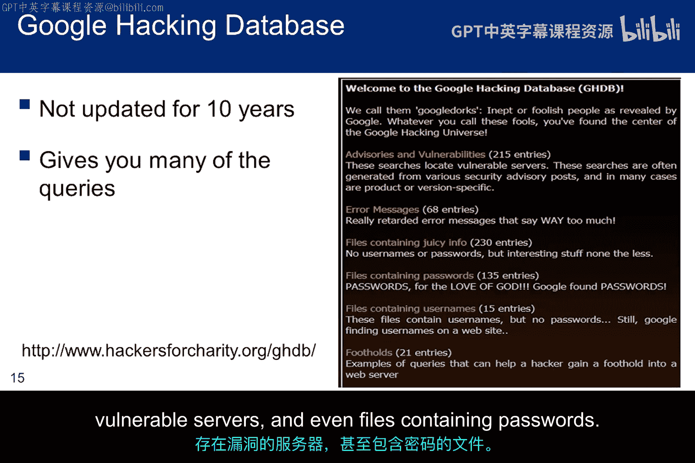
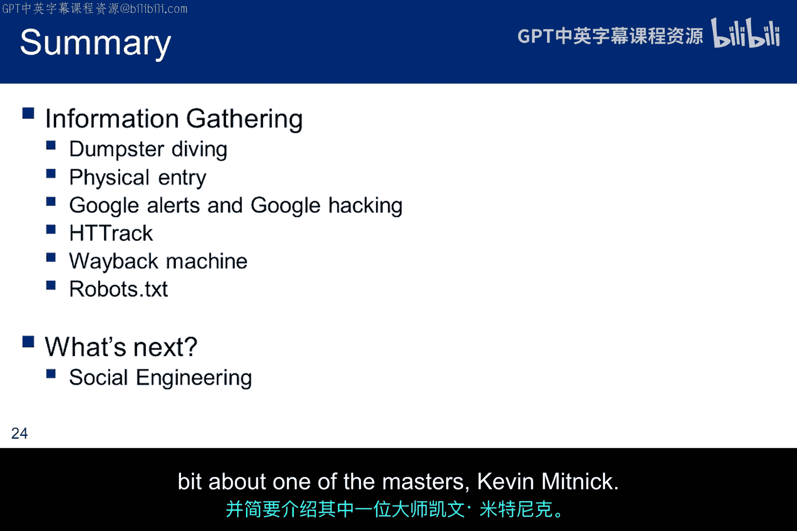

# 016：情报收集技术 🕵️

在本节课中，我们将要学习道德黑客方法论中的“侦察”环节。侦察，有时也被称为信息收集、情报收集或开源情报，其核心在于在不被目标察觉的情况下，被动地观察和收集信息。这是渗透测试的第一个技术环节，旨在为后续的有效测试打下坚实基础。



## 侦察的概念框架

上一节我们介绍了侦察的基本定义，本节中我们来看看其结构化的概念框架。




这张概念图清晰地展示了侦察的构成。位于中心红色区域的是“信息收集”，在本模块中，它与“侦察”一词可互换使用。



*   **信息目标**：图右上角展示了我们为渗透测试所寻求的信息类型，包括**任务信息、网络拓扑和IP地址**。
*   **信息存储**：图左上角是存储已收集信息的仓库。记录一切至关重要，方式可以从简单的文本文件到复杂的多用户协作工具（如Dradis）。
*   **侦察分类**：图底部将侦察分为主动和被动两类。
    *   **被动侦察**：目标无法察觉自己正被观察，数据收集过程是隐蔽的。
    *   **主动侦察**：所使用的技术有很大概率会被受害者检测到。

## 可收集的信息类型与工具



了解了侦察的框架后，我们来看看具体可以收集哪些信息以及可能用到的工具。以下是部分信息类型和对应工具的列表：


*   **域名信息**：例如 `whois` 查询。
*   **DNS记录**：例如使用 `nslookup` 或 `dig` 命令。
*   **网络拓扑**：例如使用 `traceroute` 命令。
*   **员工信息**：例如通过社交媒体或公司网站。
*   **技术栈信息**：例如使用 `nmap` 进行服务扫描。


本课程的目标是介绍信息收集的概念，并通过讨论少数工具来帮助理解和探索这些概念，而非提供全面的工具列表。模块的作业会要求你进行一些信息收集实践，上述工具可能会派上用场。

## 物理信息收集技术

除了网络信息，物理环境的信息同样重要。获取物理访问权限需要了解目标地点。


一种方法是使用谷歌地图等工具进行远程观察。卫星视图可能显示垃圾箱、可能的入口以及停车场。拉近视图甚至可能发现监控摄像头。此外，“鸟瞰图”能提供3D视角，带来更多物理环境洞察。

我们都听说过“垃圾搜寻”的故事。《纽约时报》曾报道过一个真实案例：俄勒冈州一名叫斯蒂芬·梅西的冰毒成瘾者，领导了联邦当局起诉过的最广泛、最臭名昭著的身份盗窃团伙之一。该团伙始于梅西发现了一个存放回收物的棚屋，里面有会计事务所丢弃的税表，上面包含姓名、出生日期和社会安全号码。他利用这些信息以受害者名义申请信用额度。虽然这是身份盗窃的例子，但同样的技术可用于收集渗透测试目标组织的信息。

## 进入设施与内部信息收集

假设我们需要进入目标建筑，以下是一些技巧和进入后可以做的事情：


*   **应对门卫**：如果门卫不控制进出，可以混入人群走进电梯。如果需要检查ID，可以基于先前观察伪造ID，例如假称需要向人力资源部递交简历。
*   **尾随进入**：如果ID卡有磁条、芯片或RFID控制，尾随他人进入可能奏效，前提是员工在执行个体认证时不够警惕。
*   **内部信息收集**：进入后，可以尝试使用空闲工位或墙上的电话。VoIP数据库通常可访问，能快速收集姓名和电话号码，用于后续的社会工程学攻击。有些数据库甚至显示员工职位，可以借此寻找系统管理员。
*   **准备说辞**：必须准备好解释自身存在的理由，以及在被过度“帮助”时脱身的借口。例如，可以说“我来拜访隔壁楼的朋友麦克·琼斯”，这比说“我找人力资源部”更容易脱身。
*   **观察与记录**：渗透测试员需要观察并记录设施弱点，如被撑开的门、吊顶天花板和可被利用的门传感器。

## 可获取的物理物品与遗留设备

在设施内部，有许多物品可能有助于信息收集。

*   **带出物品**：例如，一些组织的激光打印机仍会打印包含用户信息的封面页，这对于确定后续渗透测试用的用户名可能非常宝贵。**注意**：带走硬件可能构成重罪，必须确保获得书面授权。
*   **遗留设备**：也可以在设施内留下设备。这些设备通常包含恶意软件，一旦连接或访问，就会与防火墙外的恶意服务器建立出站连接。如今硬件上USB端口众多，很容易找到不显眼的位置插入。如果电脑设置了自动运行，恶意硬件能在几秒钟内部署并启动有效载荷，之后便可移除。



## 在线信息收集工具

对组织进行侦察时，在线工具非常强大。



*   **Google Alerts**：监控网站的新内容，并在发现相关内容时发送电子邮件。例如，可以设置提醒来跟踪产品更新、组织变革、招聘信息或企业新闻，这可能揭示组织何时招聘了经验不足的新系统管理员。
*   **Google Hacking**：通过添加特定指令来精炼谷歌搜索，找到原本可能淹没在信息海洋中的材料。最初，精心设计的搜索查询可以定位互联网上运行易受攻击软件或完全未保护个人身份信息的服务器。



以下是一些有助于信息收集的谷歌指令示例：
*   `site:` – 将搜索限制在特定网站
*   `filetype:` – 搜索特定文件类型
*   `inurl:` – 搜索URL中包含特定关键词的页面
*   `intitle:` – 搜索标题中包含特定关键词的页面

一个简单的例子是搜索某个域名的缓存PDF文件：
```
filetype:pdf site:example.com
```

约翰尼·朗是谷歌黑客领域的先驱，他在2007年出版的《Google Hacking for Pen Testers Volume 2》中更新了相关理念。他的网站是 `johnny.ihackstuff.com`。

## 谷歌黑客数据库与网站复制

约翰尼·朗最初创建的谷歌黑客数据库可以在 `www.hackersforcharity.org/ghdb` 找到。它是利用谷歌搜索引擎不断扩大的覆盖范围进行信息收集的权威来源。在GHDB中，你可以找到数百个谷歌搜索的搜索词和结果，这些搜索会返回包含用户名、易受攻击的服务器甚至密码的文件。


*   **HTTrack**：这是一个网站复制工具，允许你将网站从互联网下载到本地目录，重建所有目录结构，并将HTML、图像等文件从服务器复制到你的计算机。HTTrack会重写原始站点的相对链接结构，使你能够在浏览器中像在线浏览一样点击链接。
    *   **注意事项**：默认设置下，HTTrack会打开多个连接全速下载，这很容易被Web服务器检测并记录IP，甚至可能被屏蔽。HTTrack内置了选项可以限制传输速度，使交互看起来更像人工浏览，但这需要更长时间。无论如何，复制所有网页都会产生可检测的流量，比单纯浏览要“嘈杂”得多。受访问控制（如`.htaccess`）的部分网站内容将无法复制。

## 互联网档案与 robots.txt

互联网永远不会忘记。文件和网站会被缓存。

*   **Wayback Machine**：访问 `www.archive.org`。假设目标曾发布过员工组织信息或电话号码，后来出于隐私考虑删除了。虽然从网站上删除了，但它是否也从缓存中消失了？另一个例子是无意中发布的社会安全号码。错误被发现后，SSN肯定会被移除，但它们是否已被缓存？如果已被缓存，组织很可能对此一无所知，除非他们知道Wayback Machine。
    *   **使用方法**：你可以查看网站每年被保存的次数，点击蓝色的日期点即可访问该日期的网页快照，并探索其中被缓存的链接。这对于寻找鱼叉式网络钓鱼的邮件目标可能非常宝贵。


*   **robots.txt**：网站上的 `robots.txt` 文件用于指示网络爬虫应忽略哪些文件或目录。当网站所有者希望某些目录不被爬取时，会将这个文本文件放在网站根目录下。遵循规则的爬虫（如Google和Bing）会在抓取网站其他文件前先读取此文件。如果 `robots.txt` 不存在，爬虫会爬取整个站点。
    *   **对渗透测试员的意义**：`robots.txt` 可能指明了网站所有者不希望被公开索引的目录路径，这恰恰为渗透测试员提供了需要探索的潜在信息宝库。

## 总结与下节预告

本节课中我们一起学习了信息收集的基础知识。我们讨论了几种物理侦察技术，并介绍了一些用于研究目标域名的高级工具。我们开始收集可能对后续工作有帮助的细节信息，因此应该妥善归档。养成随时截图、记录主机名和IP地址的习惯非常重要，同时也不要忘记归档遇到的任何补充信息。绝对要避免因为当时没有记录而不得不重复信息收集过程。

在下一讲中，我们将讨论社会工程学。归根结底，社会工程学是关于建立信任并操纵真相以达到特定目标。我们将探讨这个主题，并简要介绍一位大师：凯文·米特尼克。



