# 017：社会工程学攻击 🎭

在本节课中，我们将要学习社会工程学攻击。这是一种利用人性弱点而非技术漏洞的攻击方式，通过操纵信任来获取信息或访问权限。我们将探讨其原理、经典案例、攻击手法以及防御意识。

## 概述

社会工程学攻击的核心在于操纵信任。攻击者通过伪装身份、编造借口（即“借口托辞”）或利用公开信息，诱使目标采取特定行动，从而达成攻击目的。这种攻击之所以有效，是因为人们通常倾向于信任那些看起来可信的人或事。

## 侦察：攻击的基石

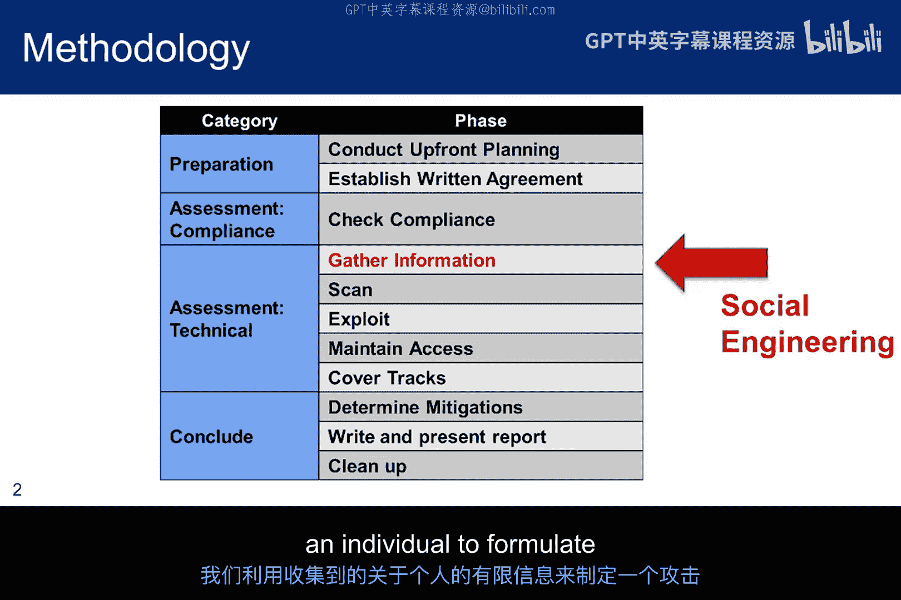

在针对特定目标发起社会工程学攻击之前，关键策略是完成侦察工作，即收集关于目标公司的信息。

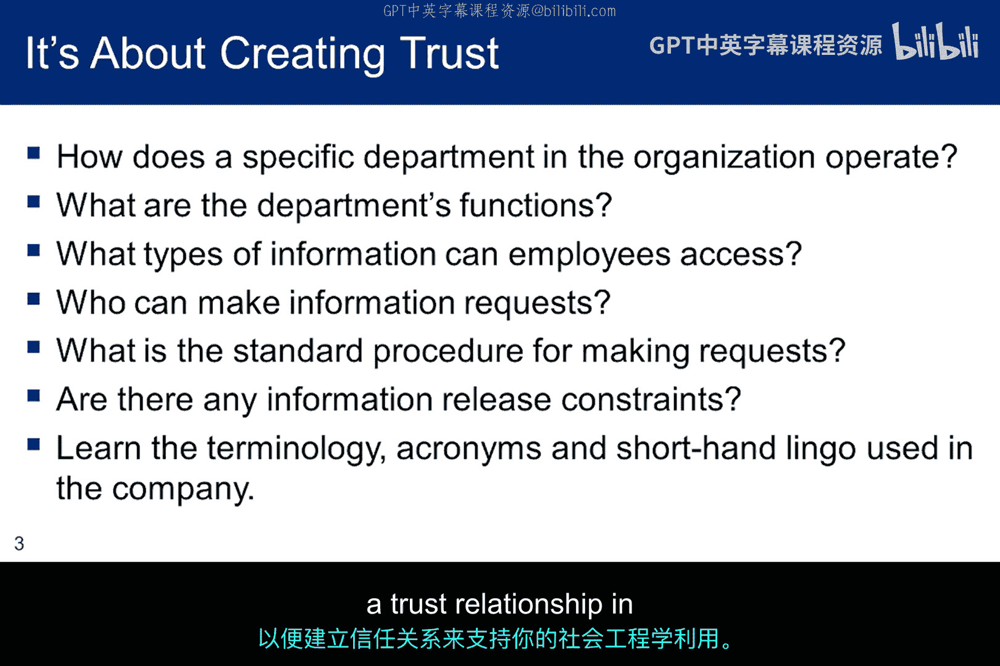

以下是您需要了解的信息类型：
*   组织内特定部门的运作方式。
*   该部门的职责。
*   员工可以访问哪些类型的信息。
*   谁可以请求哪些类型的信息。
*   提出请求的标准流程是什么。
*   组织是否有任何信息发布限制。
*   更重要的是，公司使用的术语、缩写和行话是什么。

这一切都是为了建立信任。社会工程技术之所以有效，正是因为人们非常信任那些建立了可信度的人。这正是侦察和研究为您带来的优势。

## 社会工程学在渗透测试中的位置

上面的图表展示了一个抽象的、综合了多种方法论（包括零日攻击方法）的道德黑客方法论。事实上，所有的渗透测试方法论都会包含部分或全部这些阶段。标签本身并不重要，重要的是道德黑客为了成功所必须经历的步骤。

如图所示，社会工程学只是收集目标信息的一种方法，它能让您深入挖掘更多细节，并进入扫描阶段。

从渗透测试者的角度来看，我们首先收集组织及其内部人员的信息。我们可能收集到足够的信息来扫描漏洞。然而，如果信息稀少或网络防护严密，我们可能需要进行一些社会工程学攻击。这将涉及试图诱骗受害者使其自身或其系统进入易受攻击的状态。

在第一种情况下，我们严格处于信息收集阶段。在第二种情况下，我们利用已收集到的关于个人的有限信息来制定攻击向量，从而创建一个入口点。

## 凯文·米特尼克：一个传奇案例

凯文·米特尼克最初利用其社会工程学技能进入电话公司、网络和计算机系统。他最终发展到窃取源代码、克隆手机和盗用身份。他在联邦监狱服刑五年，其中一年因一名不了解情况但过度热心的美国检察官而被单独监禁。获释后，他创办了一家合法的渗透测试公司，并利用其作为臭名昭著的黑客的声名获利。事实上，我受其营销影响购买了《线上幽灵》这本自传，它深入揭示了其社会工程学的世界。

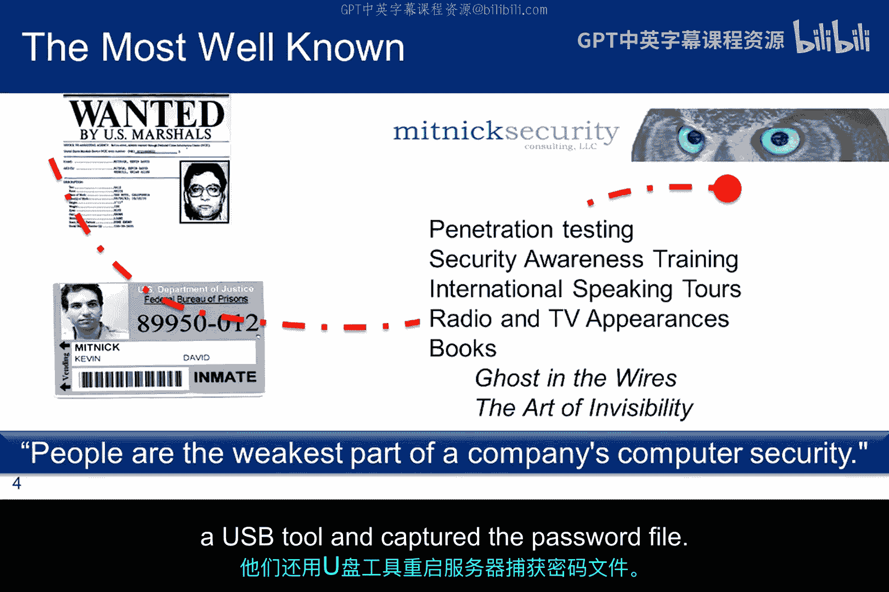

以下是一个社会工程学攻击的示例。当您浏览这些步骤时，请判断您认为这是米特尼克的非法活动，还是他作为合法渗透测试的一部分进行的操作。

**攻击场景如下：**
1.  以给员工送信为借口（即“借口托辞”）访问公司。
2.  在访问期间，窥视员工使用的门禁卡。
3.  回家制作一张逼真的仿制品。
4.  返回现场，尾随一组人（例如，在后门吸烟的员工或午餐后返回的员工）进入。
5.  由于之前在领英上的侦察提供了一个网络工程师的名字，您四处游荡找到了他的办公室。
6.  办公室门锁着，于是您通过吊顶进入。
7.  进入锁着门的办公室后，使用U盘从Linux系统启动，该系统带有黑客工具包。
8.  更改本地管理员密码，重启并安装RAT（远程访问木马）。
9.  进入计算机注册表，将最后登录用户设置为该工程师的用户名。
10. 第二天早上当工程师登录时，他的计算机会通过RAT建立连接，测试者便获得了对网络的完全管理员访问权限。
11. 接着，您可以导航到域控制器并转储密码哈希值，这些哈希值可以在离线状态下被攻击以获取其他凭证。

尽管其中一些技术在正常的渗透测试中可能不被允许，但事实证明，这是《线上幽灵》中描述的一次经授权、付费的渗透测试。这也引出了另一个重要的提醒：任何渗透测试相关的边界和约束都应以书面形式明确定义。

## 更多攻击手法示例

以下是凯文描述的另一个物理攻击案例，被其渗透测试公司使用。

1.  测试者在谷歌地图上查找目标设施，确定该公司刚刚租用了一个办公套间。
2.  接下来，他以平克顿调查公司需要办公空间为借口，联系了同一名房地产经纪人。
3.  该经纪人在另一个城市与平克顿合作过，因此他们开始建立信任关系。这当然是关键所在。
4.  他们试图寻找共同的朋友。“你认识某某吗？”“不认识。”“那你认识某某吗？”等等。
5.  然后，测试者告诉经纪人，作为一家安全公司的代表，他想在租用空间前了解大楼的物理安全控制措施。
6.  经纪人解释了所有设施的运作方式。
7.  一旦了解后，测试者找到了大楼的保洁服务提供商，并打电话试图获取清洁细节。他将讨论重点放在安全机制上。
8.  他告诉保洁主管安全系统崩溃了，需要恢复，否则他们的门禁卡周一将无法使用。他询问是否能在周五交换门禁卡。
9.  测试者与保洁主管会面，提供了一张新的假卡（据称用于恢复后的系统），并要求换回旧卡。
10. 在这次交换过程中，保洁主管还告诉测试者他们使用带主钥匙的锁箱，唯一的警报在外围。
11. 于是，在周末，测试者使用门禁卡绕过警报系统和办公室门的二级锁。
12. 他们找到并进入了服务器机房，在便利贴上发现了管理员密码，成功进入。
13. 他们还使用U盘工具重启了服务器，并捕获了密码文件。

## 社会工程学的普遍性

从最广泛的意义上讲，社会工程学是真正普遍存在的，它总是涉及对信任的操纵。以下列表展示了一些例子。

列表中您可能觉得最不明显的项目是税收。其理念是，政府知道税收是负担，但他们想安抚公众并让我们自愿支付账单。政府创造了减免项来减轻负担，例如抵押贷款利息扣除或慈善捐赠扣除。

对信任的操纵体现在，纳税人关注的是扣除额，而不是整体税负，而整体税负是扣除额价值的10到15倍。根本方法是让税单看起来更容易接受一些。在这方面，有人认为国税局应该简化税法并消除漏洞，而不是操纵纳税人的信任。

以下是从渗透测试角度看的几个信任操纵例子：
*   **第一个例子**：渗透测试者假装是软件供应商的代表。他打电话给被测试公司中一个毫无戒心的人，询问他们使用的软件版本。同时，他会索要一个电子邮件地址，告诉受害者他将收到一份对话摘要，以核实电话中提供的版本号，确保没有误解。挂断电话后，黑客会发送一封带有恶意代码附件的电子邮件。
*   **第二个例子**：涉及在开始渗透测试前尝试识别公司使用的防病毒产品。一些缺乏经验的测试者可能会尝试从公司内部人员那里打听，但这很容易暴露正在进行渗透测试的事实。另一种方法是打电话给所有防病毒公司，告诉他们您工作的公司（即您正在测试的公司）想要购买更多许可证。防病毒销售员会非常乐于帮助确定当前的许可证数量，因为他们想卖给您更多。您持续尝试，直到找到正确的防病毒公司。由于平均只有7家左右的防病毒公司，只需打3到4个电话就能弄清楚您正在对付的是哪款防病毒产品。

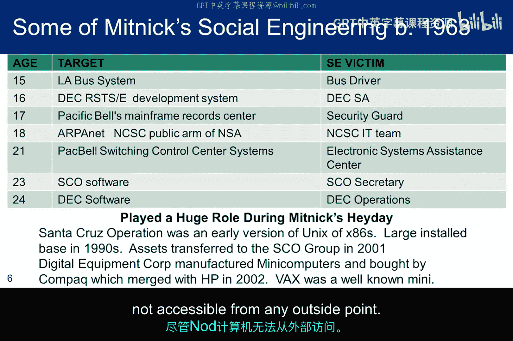

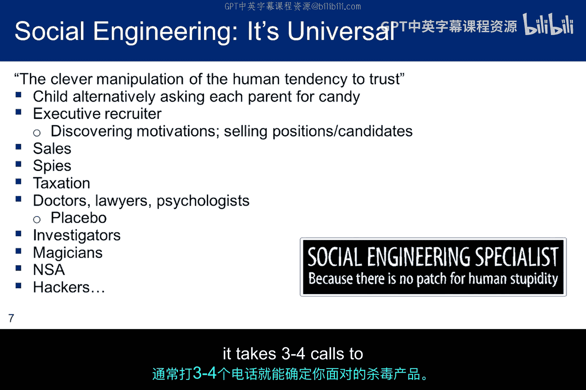

## 信息收集与利用

我们记录系统的数字化有利有弊。这张幻灯片展示了我们通过在线搜索可能收集到的关于一个完全陌生的人的一些信息。信息的可用性因地区而异，但其中大部分几乎对任何人都能找到。事实上，曾经有一段时间，我居住的华盛顿特区附近县的房产记录中包含社会安全号码。那里曾经有一些非常有趣的、居住在同一县的高级联邦官员的SSN图像。

我们已经并将继续讨论几种工具，帮助您收集此类信息。但我们用它来做什么？我们已经讨论了一些例子，但它可以用于许多目的。

以下是一些例子：借口托辞和鱼叉式网络钓鱼邮件是本子模块的重点。但一个与社交工程无关的有趣的数据收集例子涉及从数据中得出推论。研究人员确定，在美国，**87%的人口仅基于五位邮政编码、性别和出生日期**，就具有可能使其独一无二的特征。这可能看起来不重要，但这里有一个例子说明其重要性。马萨诸塞州州长的医疗记录在团体保险委员会数据库中。该数据库被提供给研究人员并出售给行业，数据已经过匿名化处理。然而，隐私研究人员将这个数据库与剑桥选民名单（他们花20美元就能买到）联系起来。关联两个数据库后，医疗记录数据库中有六个人与州长有相同的出生日期。其中三人是男性，但只有一人拥有其五位邮政编码。换句话说，研究人员通过花20美元购买选民数据库，就能识别出州长的具体医疗记录。

当然，本模块不是关于数据库隐私的，但关键点是，互联网上看似无害的信息，可能会产生社交工程师可以组装并利用以实现其目的的信息。

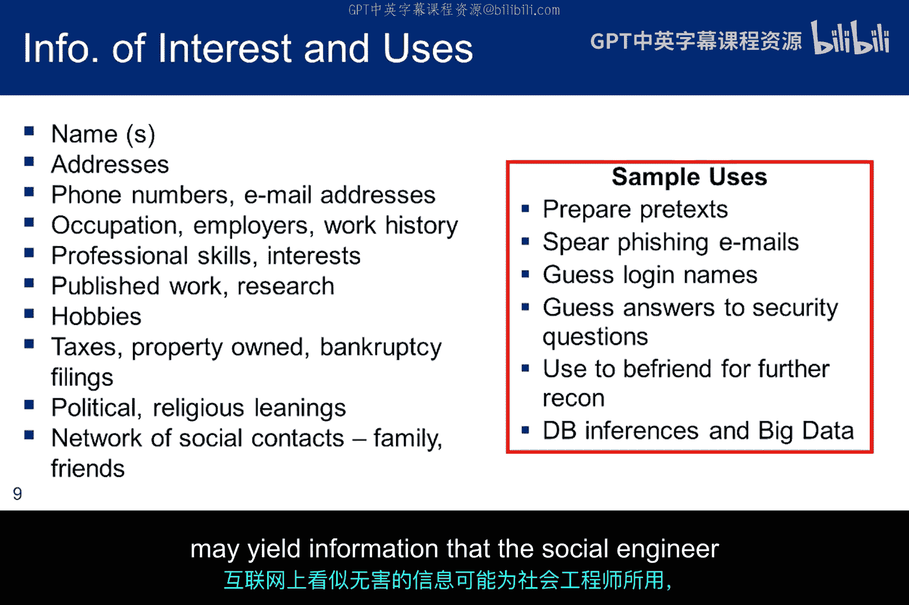

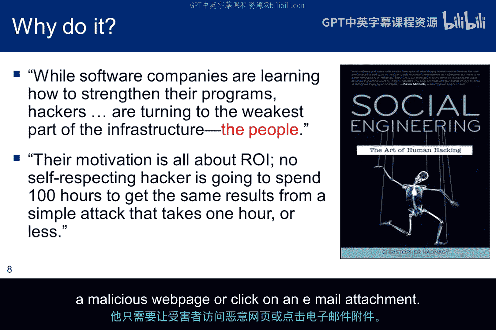

## 借口托辞与网络钓鱼

借口托辞相当于伪造攻击者活动的意图，或者在某种情况下，为了达到特定目标而谎报身份。进行这种借口托辞是否违法取决于具体情况。以凯文·米特尼克为例，他的行为曾游走在法律的两边。

成功的口头借口托辞的一个关键是能够应对对话中意想不到的转折。您无法为出现的每个问题或情况做好准备，必须能够流畅地应对您未准备好的流程变化。例如，假设受害者即将给您一些重要信息，但索要一个回电号码。如果您实际上没有代表那个借口所需的号码，或者您甚至不知道该公司的区号或局号，您该如何实时维持骗局？错误的反应可能会结束通话。一个解决方案可能是说您的老板刚走进您的办公室，您会在一分钟后回电。然后您快速研究一下该公司的电话号码再回电。

表格显示了一些我们在电影或电视上听到或看到的例子。如今，我认为大多数组织都培训员工保持专业，但不要对此类事件做出反应。然而，我们知道仍然有受害者。另一个很好的例子是调查员在您能看清之前快速出示虚假证件，希望您会因为害怕而不敢要求再看一次。每次我接受关于某人申请安全许可的访谈时，我总是坚持要求仔细检查证件。您也应该这样做。

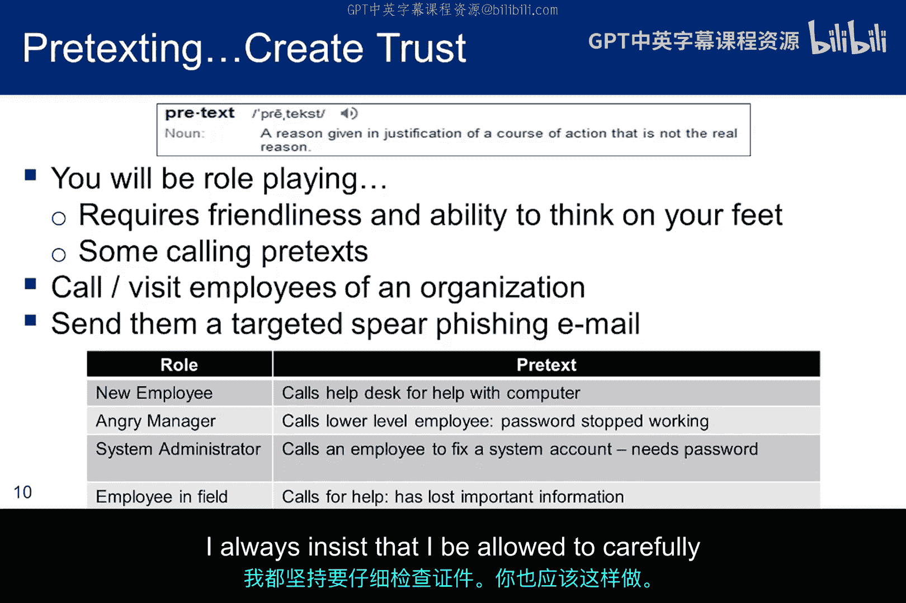

**419诈骗**是一种欺诈行为，也是最常见的骗局类型之一。事实上，“confidence trick”（骗局）这个短语明确指代对信任的操纵。数字419指的是尼日利亚刑法中处理欺诈的条款。这种骗局曾通过传真、传统邮件使用，现在，众所周知，它通过互联网使用。几年前的骗局利用了这样一个事实：曾经上当受骗的人很可能再次上当。其想法是：如果您向代表尼日利亚政府的律师支付一小笔费用，他将帮助您追回最初的损失。令人难以置信的是，有些受害者被骗了两次。这里的启示是，有些人可能比其他人更容易受到社会工程学攻击。

此处显示的钓鱼骗局的一些线索用红色高亮显示：
*   **左上角**：将鼠标悬停在链接上显示它并非真正的微软网站。URL前面的IP地址指向一个恶意网站。链接和页面上的其他一切看起来都像微软，包括图形，但硬编码的IP地址是破绽。
*   **左下角**：描述了一笔您可以取消的银行转账，但没有提供关于您银行账户的具体信息。而一个合法的消息至少会提供您银行的名字。
*   **右下角**：说明了一种在受害者心中制造紧迫感的常见技术。这是一种众所周知的销售策略：“立即行动，以免为时已晚”。它在网络钓鱼中同样有效，试图让您在思考之前点击。
*   **右上角**：是一种混合方法。它缺乏关于国家的具体信息，并暗示他们对任何业务类型都感兴趣。“别担心细节，但无论您从事什么业务，请立即回复。”当然，写得荒谬的信件会自我筛选，但精心制作的则更难检测。这就是鱼叉式网络钓鱼的用武之地，您将在本模块的作业中被要求尝试一下。

这是一个鱼叉式网络钓鱼攻击的例子。预期的受害者是我的一个同事，他在收到这封邮件两周前刚刚乘坐过全美航空。幸运的是，他是一名安全专业人员，检测到了带有前导IP地址的混淆链接，该链接指向一个不属于全美航空的恶意网络服务器。

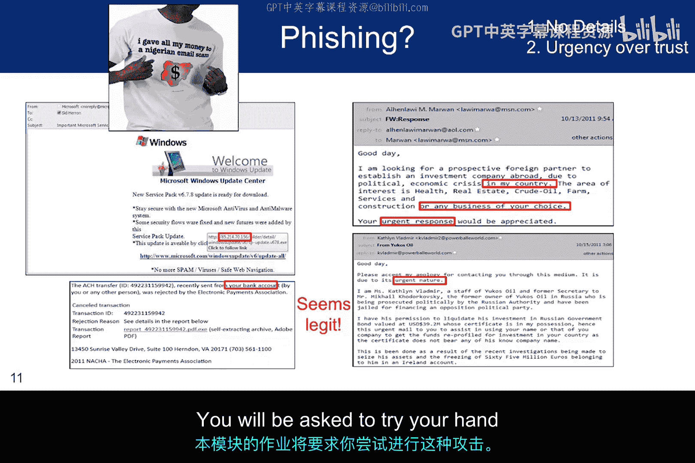

当然，社交媒体的热潮创造了一个公开信息的金矿，可以利用这些信息收集足够的信息来发起一次非常可信的鱼叉式网络钓鱼攻击。

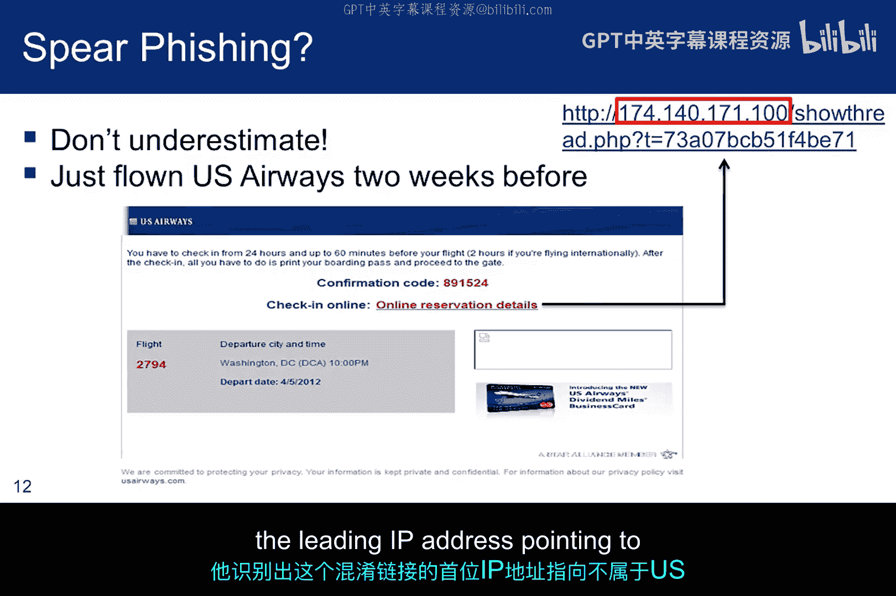

## 高级鱼叉式网络钓鱼案例

在这个鱼叉式网络钓鱼示例中，被渗透测试的组织没有太多的网络存在或任何可行的入口点。因此，测试者转向了社会工程学。公司侦察得到了一个公司官员的名字。对他的名字进行额外搜索，发现了他有集邮的爱好。舞台已经搭好。

测试者建立了一个虚假的恶意集邮网站。一旦建立，他给该官员留下了语音邮件，并发送了一封电子邮件，说他最近因其祖父去世而收到了一大批1950年代的邮票收藏。他最后询问目标是否有兴趣购买任何邮票。该官员点击了链接，公司的外围防御因此被攻破。

这次攻击发生在2011年春天，这是一个很好的例子，说明了鱼叉式网络钓鱼如何能够有效。攻击者创建了一个电子表格，据称包含RSA公司为该年制定的招聘计划信息。随后，它被发送给人力资源部的几名员工。此前，已经进行了大量的侦察，以识别组织内各个层级的人力资源人员。受害者可能是一个通常不会收到此类信息的人，出于好奇查看了它；或者可能是一个知道没有这种东西存在，想看看里面是什么的人；又或者攻击者可能有足够的信息知道RSA每年都这样做，他们在官方版本发布之前发布了恶意版本。这些都是可能的情况，但RSA在报告时没有透露此类细节。关键是，发送恶意邮件的针对性攻击是有效的。

我去年圣诞节注意到的一个骗局是，收到来自近期网购发货商的关于包裹跟踪的恶意电子邮件。通过在假期期间进行，其目的是利用购物者在那段时间会进行许多购买，并且不会记住他们所做的每一笔购买。目标是让受害者点击链接以刷新记忆，看看包裹何时到达。这是相当有创意的想法，我怀疑许多在线购物者成为了骗局的受害者。

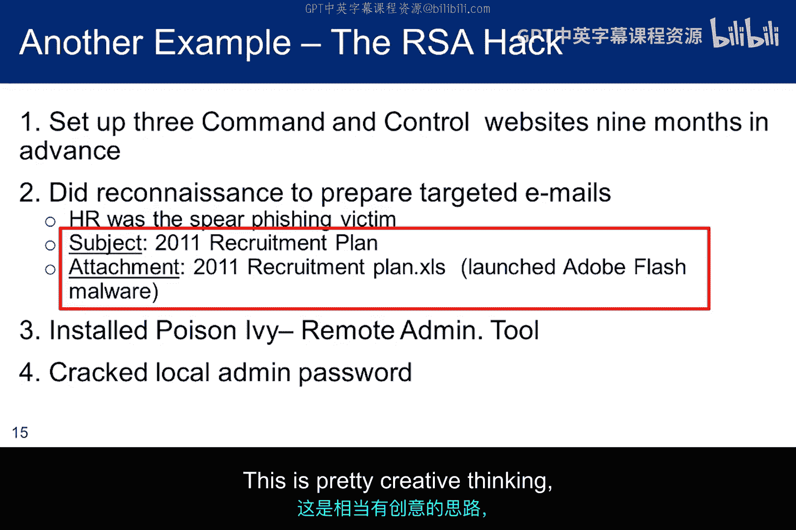

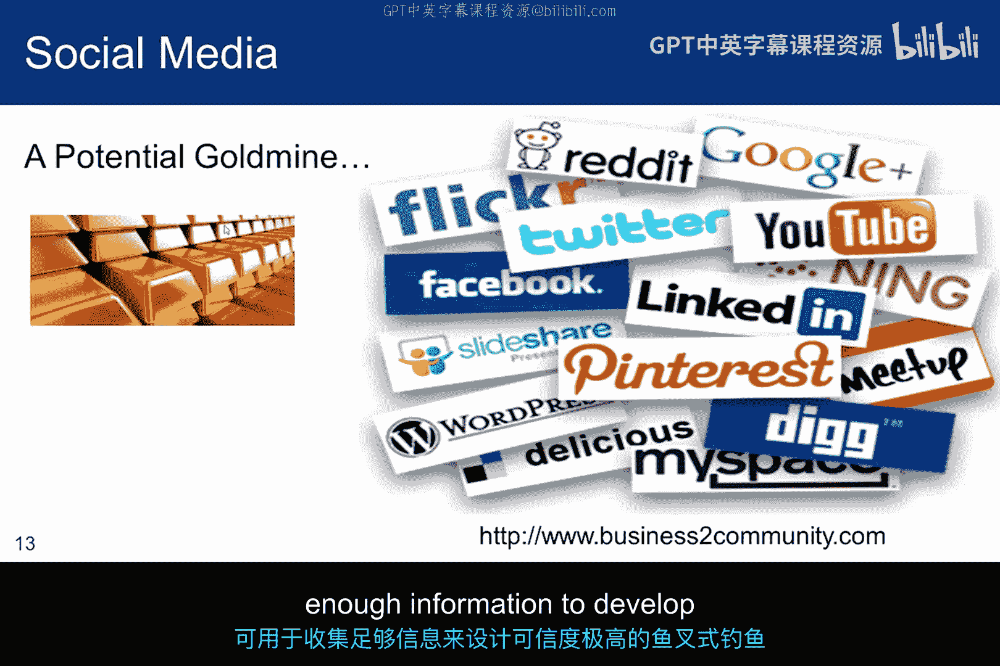

## 社会工程学在安全事件中的角色

《联邦信息安全管理法案》（FISMA）于2002年通过。它认识到信息安全对美国经济和国家安全利益的重要性。该法案要求每个联邦机构制定、记录和实施信息安全计划。FISMA要求机构官员每年审查机构的信息安全计划，并将结果报告给管理和预算办公室（OMB）。OMB则准备关于机构遵守该法案情况的年度报告提交给国会。

您在此处看到的图表来自该报告，显示了社会工程学和网络钓鱼的重要性。OMB使用社会工程学术语来包括欺诈网站和其他诱使用户提供敏感信息或下载恶意代码的企图。在这些术语中，它实际上是“尝试访问”的一个子类别。因此，它不包括恶意电子邮件。而网络钓鱼则完全关乎恶意电子邮件。据报道，社会工程学是爱德华·斯诺登在获取NSA其他系统管理员账户以扩大其数据收集犯罪规模时使用的一项重要技术。社会工程学可能是本图表中许多其他事件背后的原因，但正如我们所指出的，它是网络钓鱼的主要组成部分。您如何让受害者采取一些可能不寻常的、或者他们受过培训不应采取的行动？

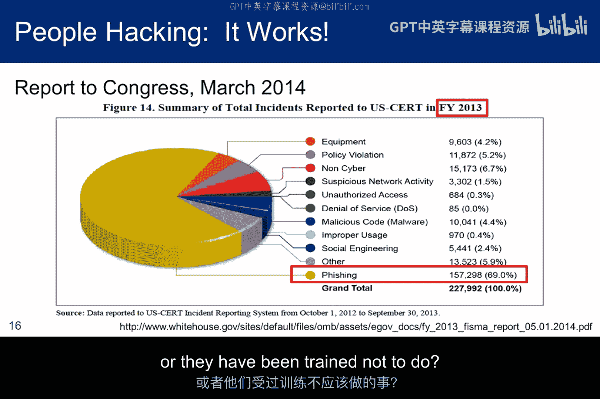

虽然网络钓鱼尝试仍然是利用联邦系统和数据的主要方法，但美国计算机应急准备小组（US-CERT）在图3中描述的事件类别并未捕捉到这种威胁的严重程度。事实上，2013年的数据与2013年报告中显示的内容完全不一致。看来US-CERT重新定义了事件定义并对数据进行了重新分类。虽然FISMA的初衷是好的，但这至少指出了在尝试收集事件信息时的一个问题。在本报告中，US-CERT根据根本原因（如恶意代码或社会工程学）而非来源对这些事件进行分类。因此，与大量的恶意代码和社会工程学事件相比，图3显示的网络钓鱼事件数量较低。

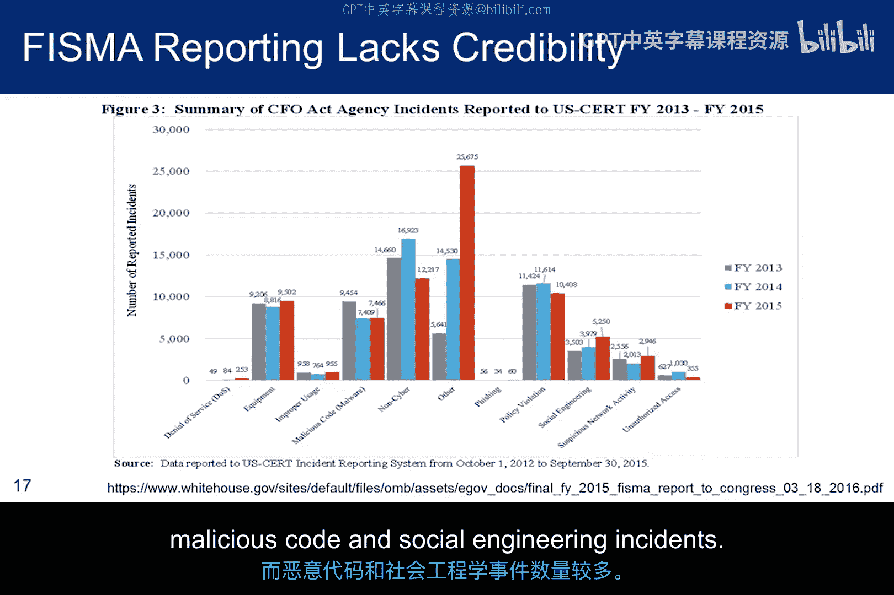

## 作业与实践

这是本模块的作业。您将从极其有限的身份信息开始，收集关于您伙伴的信息。您的目标是制作一封可信的鱼叉式网络钓鱼电子邮件。您将把这封鱼叉式网络钓鱼邮件发送给您自己，而不是您的伙伴。

采用这种方法是因为SAT中的所有有效载荷都是恶意的，通常会在受害者的计算机和攻击者之间建立连接。虽然如果您将其发送给您的伙伴，看看会发生什么会很有趣，但如果有效载荷建立了连接然后安装了持久性后门，您将违反法律。因此，出于安全、隐私和法律原因，请不要将此发送给您的伙伴。

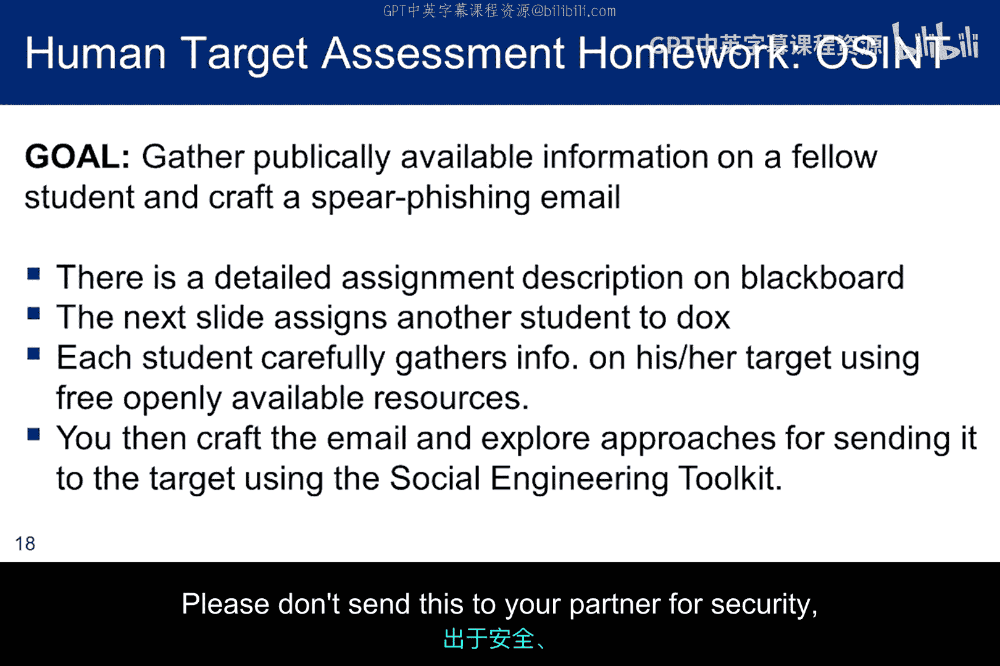

## 总结与最后提醒

关于互联网上的信息，无论是您发布的还是他人发布的，最后再说一句。图片的地理标记是每个人都应该意识到的事情，并确保没有侵犯隐私或造成安全风险。捕获和利用地理标记可以被视为一种社会工程学形式。在此处所示的案例中，一些士兵在互联网上发布了一些他们自己的无害照片。但这一行为并未维护行动安全。攻击者（在这种情况下是动能恐怖分子）利用地理标记精确定位了该部队，并在伊拉克的飞行线上摧毁了几架阿帕奇直升机。

社会工程学涉及使用借口托辞来操纵信任。人确实是安全中最薄弱的环节。如果您以正确的方式询问，通常总会有人让您进去。花费数天时间试图利用技术漏洞同时隐藏您的存在，几乎没有什么回报。

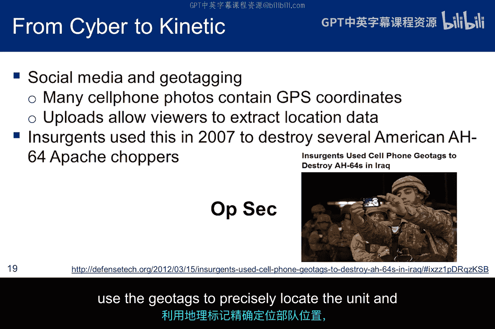

即使员工试图做正确的事，他们也可能只是打开门。他们这样做可能是出于礼貌、因为感到害怕，或者因为他们信任您。

在下一讲中，我将介绍社会工程学工具包。您将在作业的第二部分使用此软件向受害者发送电子邮件，尽管在这种情况下，受害者将是您自己，这有点无聊。当然，您可以自行探索其他目标，例如家庭网络上的家庭成员。但请记住，这样做是违法的，很可能是重罪。

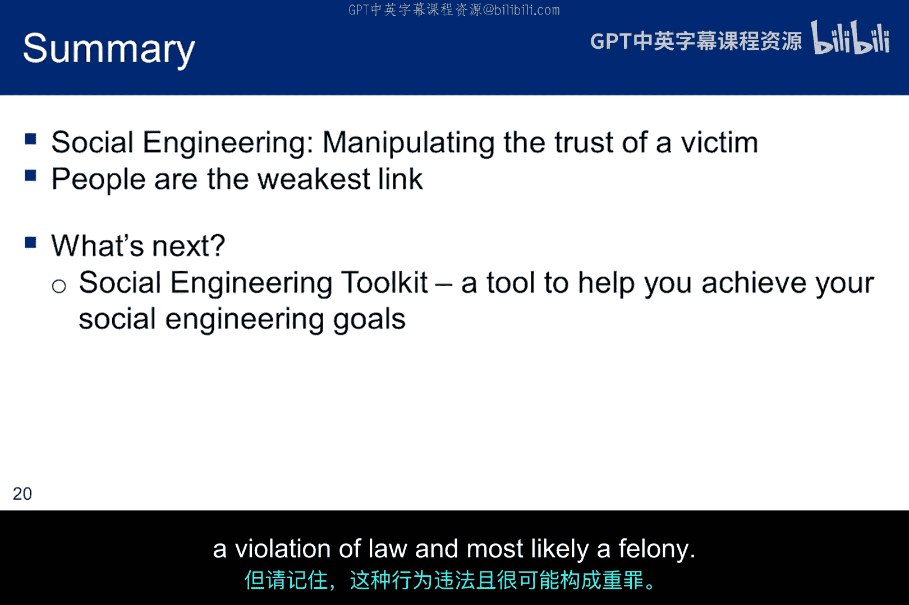

**本节课中，我们一起学习了社会工程学攻击的基本原理、经典案例、常见手法（如借口托辞、网络钓鱼、鱼叉式网络钓鱼）以及其在渗透测试中的位置。我们认识到，操纵信任是此类攻击的核心，而人往往是安全链中最薄弱的环节。防御社会工程学攻击需要提高安全意识，对异常请求保持警惕，并谨慎处理个人信息。**