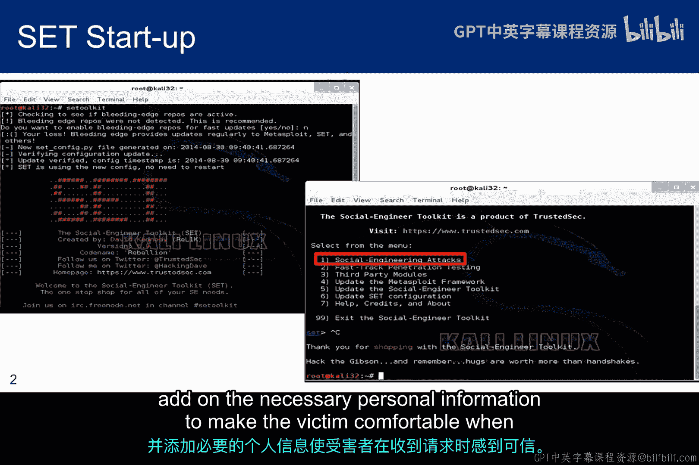
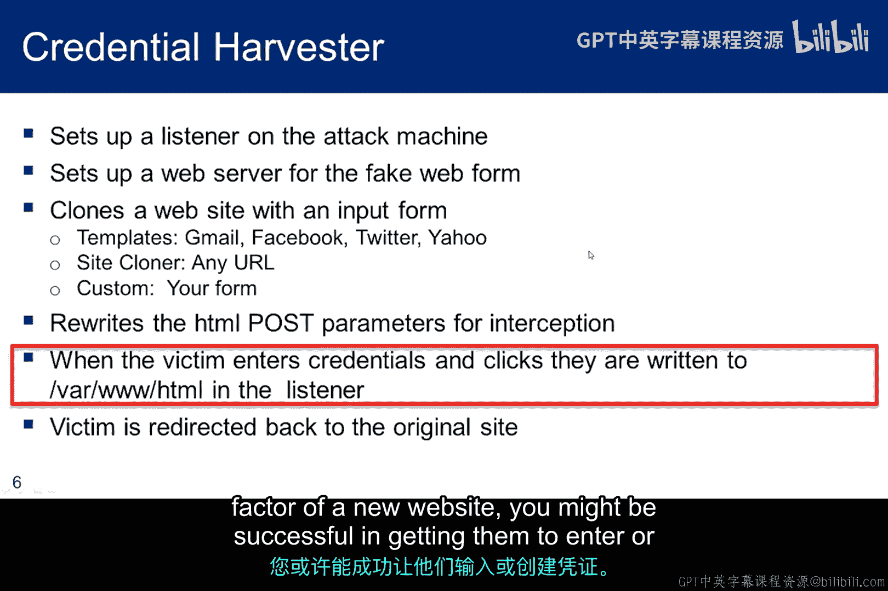
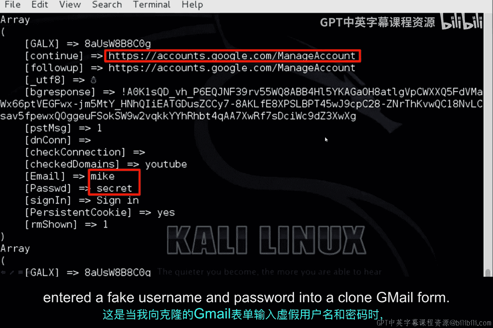
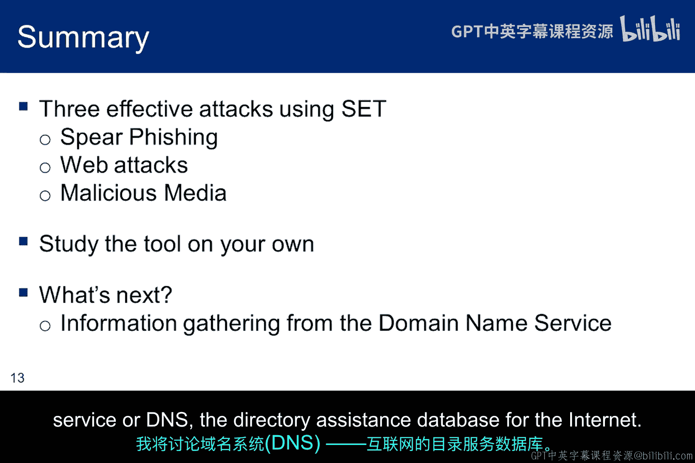

# 018：社会工程学工具包 🛠️

在本节课中，我们将学习社会工程学工具包（SET）的基本概念、主要功能和使用方法。SET是一个强大的框架，专门用于模拟和测试社会工程学攻击，帮助安全人员理解攻击者的手法并加强防御。

---

## 概述

社会工程学工具包由TrustSec公司的CEO Dave Kennedy开发。Dave同时也是渗透测试执行标准（PTES）的创始人之一，该标准是渗透测试的基础规范。由于Dave也是一位Metasploit开发者，SET与Metasploit框架存在一些相似性和关联。因此，SET的许多功能都侧重于漏洞利用，而社会工程学只是攻击执行中的一个环节。尽管如此，SET提供了多种工具来生成攻击场景，诱使受害者点击恶意链接或访问恶意网站。

要在我们的道德黑客环境中使用SET，仅使用主机模式（Host-Only）效果不佳。主机模式通常用于学习针对其他虚拟机的漏洞利用。但在许多攻击中，SET需要克隆活跃的网站，这只有在具备互联网访问权限时才能实现。在主机模式下，可以克隆内部网站，例如在Metasploit中设置的易受攻击的Mutillidae Web服务器。然而，观察SET如何克隆Gmail和Facebook将有助于你更好地理解该工具的工作原理。

需要提醒的是，使用这些技术连接到道德黑客环境之外的计算机是违法的。如果你没有将Kali保持在主机模式下，必须在漏洞利用针对外部受害者运行之前停止工具。你应该只针对道德黑客环境中的其他虚拟机运行漏洞利用。我曾在家庭网络中使用VirtualBox的桥接模式在自己的计算机上进行实验，你可能也有兴趣尝试。但请记住，攻击家庭网络之外的任何计算机都是重罪。

要启动SET，请在命令行中输入 `setoolkit`。SET是一个利用Metasploit框架的、包含多种攻击方式的框架。很容易将SET的功能与Metasploit的功能混淆，许多在互联网上制作YouTube视频的“准黑客”也会犯这个错误。尽管你稍后才会学习Metasploit，但在探索SET功能时，尝试在脑海中区分两者非常重要。

这里的关键讨论点是，SET中的每种攻击向量都提供了不同的方法，诱使某人点击链接或访问网站。作为社会工程师，你的工作是选择正确的方法，并添加必要的个人信息，使受害者在收到请求时感到放心。

SET拥有的攻击向量远不止这里显示的三种，但工具包的作者认为这些是最有效的几种。因此，我们将花些时间讨论它们。

以下是SET中三种最有效的攻击向量：

1.  **鱼叉式网络钓鱼**：这是一种高度定向的攻击，试图让受害者打开电子邮件附件。
2.  **Web攻击**：通常试图让Java小程序在你访问的网页上运行。
3.  **恶意USB/DVD攻击**：我们都听说过作为会议赠品分发的恶意USB盘的故事。如何标记留在桌上或任何停车场的USB盘，可能会让某些受害者无法抗拒。如果你足够了解受害者的兴趣，精心设计的标签可以成为一个非常有用的社会工程学工具。

鱼叉式网络钓鱼是本模块作业的主题。你需要收集关于你的伙伴（即受害者）的足够信息，以便制作一条他或她会信任的消息。如果受害者信任邮件的来源，并且内容看起来真实且符合预期，那么受害者很有可能会打开附件。

SET允许你为附件选择一些常见的文件格式，如PDF。SET允许你为附件命名，以匹配经过社会工程学设计的电子邮件。例如，如果你的受害者是一个DIY爱好者，一封关于家庭电气工作的精心制作的电子邮件，以及一个名为“三路开关安装说明.pdf”的附件，可能会导致攻击成功。

SET还允许你使用Sendmail伪造发件人的电子邮件地址。然而，这只有在受害者的SMTP服务器不对主机名执行反向查找时才有效。如果执行了反向查找，受害者的邮件服务器很可能会采取除投递邮件之外的其他操作。要探索此功能，需要安装Sendmail，尽管Kali通常已预装Sendmail。

要启用此功能并在SET中利用它，你需要更改位于 `/usr/share/set/set_config` 的SET配置文件。编辑文件 `set_config`，将 `SENDMAIL=OFF` 标志更改为 `SENDMAIL=ON`。

SET允许你使用Sendmail、Gmail或你自己的开放邮件中继来执行定向攻击，并且支持单个受害者电子邮件地址或群发邮件。由你选择。当你启动SET时，菜单会引导你创建电子邮件和恶意附件，但只有在受害者打开附件时才有效。这正是真正社会工程学的用武之地。你需要发现关于受害者的足够信息，以便制作一封针对性极强的电子邮件，使受害者愿意打开附件。

这是一张SET配置文件的截图，显示Sendmail功能设置为OFF。如果你想尝试伪造发件人地址，请将其设置为ON。

我们将讨论的第二个有效的SET功能是Java小程序攻击。基本思路是让受害者浏览一个网站，并同意运行嵌入的小程序。不幸的是，自2014年初以来，由于Java的更新，这已成为一种效果较差的工具。当然，如果用户未能保持其Java版本为最新，攻击仍然有效。

这种攻击的基本思路是克隆一个网站，将小程序嵌入克隆的网站中，并向受害者发送一个链接，辅以足够的社会工程学手段以建立信任感，从而使受害者运行该小程序。SET提供的一个技巧是Java重复器概念。运行窗口会不断弹出，直到用户同意运行为止。因此，如果建立了信任感，并且受害者因为运行窗口不断弹出而无法在浏览器中进行任何操作，那么他最终很可能会点击“运行”，因为他想继续浏览，并且并不真正知道点击这个弹窗会做什么。这种攻击不再那么有效的原因是，当前版本的Java不允许运行自签名代码。

对于SET，开发者Dave Kennedy最初花了几百美元购买了一个代码签名证书，证明来自俄亥俄州一家名为“Verified Publisher”的公司。该证书用于对小程序进行自签名，以增加受害者对小程序的信任度。良好的社会工程学和对代码签名过程缺乏了解所创造的信任度提升，共同构成了一个可行的攻击向量。

当用户选择“运行”并且克隆网页上的有效载荷在受害者机器上执行时，浏览器会立即重定向回真实的网站，以使攻击不那么显眼。SET菜单将引导你完成网页的克隆和小程序的嵌入，但只有在受害者运行小程序时才有效。同样，这凸显了良好社会工程学的重要性。你需要发现关于受害者的足够信息，以便确定要克隆或创建哪个网页，以及需要什么才能让受害者运行小程序。

凭证收集器允许你克隆一个网站，甚至创建一个新网站，并且SET会自动重写POST参数，以便你在凭证输入表单后拦截和收集它们。收集凭证后，受害者会被重定向回真实网站，以使攻击看起来不那么显眼。这种技术也可以设置为尝试大规模收集。对于大规模收集，SET提供了一种机制，可以将收集到的信息以HTML或XML格式导出，以支持报告生成。

社会工程学的要求是，攻击者必须说服受害者在收到链接后，在网页上输入他们的凭证。像Gmail或Facebook这样的网站的挑战在于，用户通常是自己导航到这些网站的，因此他们可能对电子邮件中收到的链接持怀疑态度。话虽如此，如果你写一封热情洋溢的电子邮件，描述用户感兴趣的某些内容，你或许可以为Gmail或Facebook编造一个可信的故事。然而，克隆一个不那么流行的网站，并且传递链接可能不那么不寻常，可能会更有效。如果链接附带的电子邮件热情地讨论一个新网站的“酷炫”因素，你可能会成功地让他们输入或创建凭证。

这是包含凭证的文件截图，当时我在克隆的Gmail表单中输入了假的用户名和密码。

恶意DVD工具用于部署USB或DVD社会工程学攻击。这是一个简单而有效的工具，它会在SET根目录下创建一个文件夹，自动接收和存储autorun信息，并为你生成一个Metasploit有效载荷。两个文件存储在SET主目录 `/usr/share/set/auturun` 中。你只需将autorun目录的内容复制到媒体上，就可以发起攻击了。受害者的autorun功能通常是关闭的。但如果它是开启的，一旦插入U盘，漏洞利用就会运行。当它关闭时，可能需要社会工程学手段来说服受害者允许其运行。社会工程学涉及在USB盘或DVD上使用有创意的标签，诱使某人插入媒体并启动。另一种选择是在U盘上放置一个合法文件作为传递给受害者的手段，但U盘也会包含恶意内容。

二维码扫描和Java更新攻击所需的社会工程学量相当低。QR攻击可能根本不需要任何社会工程学。人们通常不加思索地扫描二维码，甚至没有意识到它们可能是恶意的。对于Java更新消息，社会工程学工作已经由安全工程师和IT部门完成，他们鼓励每个人“打补丁、打补丁、打补丁”。通过使用社会工程学工具包，补丁可以被恶意制作，而社会工程学工作已经为攻击者做好了。攻击者只需要确保Java更新看起来真实。

我们已经看了几种社会工程学工具。在每种情况下，攻击都包含一个信任成分。信任是社会工程学的基础组成部分，要使其有效，你需要建立一定程度的信任并加以利用。接下来的两张幻灯片将指出每种所示漏洞利用所依赖的一个信任方面。对于你开始做作业来说，一个好的练习是尝试思考与这些漏洞利用相关的其他信任成分，因为如果你不能建立那种信任关系，你的社会工程学攻击就不会成功。

要使鱼叉式网络钓鱼有效，电子邮件必须精心构建并基于详细研究。受害者必须相信电子邮件是真实的，并且来自他们可以信任的来源。鱼叉式网络钓鱼如此有效的原因是，用户通常每天打开许多附件而没有恶意结果。从某种意义上说，他们训练自己信任附件。因此，当一封精心制作、可信的鱼叉式网络钓鱼邮件到来时，他们可能想都不想就会打开它。

要让用户运行Java小程序通常更难，并且需要比鱼叉式网络钓鱼更多的信任，因为人们对弹窗变得更加怀疑，如果他们不理解的话。在家用计算机的早期，用户可以点击窗口，这无关紧要，因为当时没有多少恶意软件。情况已经改变，相关的宣传现在导致许多不了解的用户在点击“运行”之前向他人寻求建议。这种情况增加了信任的重要性。小程序必须发出一个用户理解、相信并且可能以前见过的运行请求。

被引导到一个要求你输入凭证的网站，可能需要的信任程度介于打开附件和运行小程序之间。一些用户听从建议，总是自己浏览到网站，不信任链接。当然，一些用户不那么谨慎。因此，如果链接和消息看起来真实，他们很可能会输入凭证，然后这些凭证就归你所有了。

在USB盘攻击中建立信任有点不同。一种方法是将其标记为某人可能信任的方式，也许是一个他们认识的人的名字或一个知名组织，如大学。你也可以用你了解到受害者感兴趣的主题来标记它。你也可以使用受害者知道的名字，并加上“财务”或“税收”等词。

大多数移动设备用户还没有意识到二维码可能是恶意的。话虽如此，你可以构建与传递恶意链接相同类型的恶意电子邮件。诀窍是通过电子邮件将其发送到计算机电子邮件账户，并让受害者用他们的智能手机扫描它，认识到攻击将在智能手机上执行，而不是在计算机上。

最后一种攻击是恶意软件更新消息，它经过精心设计，完全匹配用户经常遇到的更新，例如Adobe Reader或Java更新。你可以做一些社会工程学来识别受害者使用的其他软件，并为其构建更新消息。

这张幻灯片简要概述了本模块作业的最后一部分，要求使用社会工程学。更多细节可在社会工程学作业说明中找到。

作业的这一部分要求你使用SET向自己发送一封伪造发件人地址的电子邮件。如果你能将之前在第一部分制作的电子邮件发送给你的伙伴，看看你做得有多好，那就太好了。但你不能这样做，因为所有有效载荷都是恶意的。如果成功，你将可以访问受害者的计算机，并触犯了《计算机欺诈和滥用法案》，构成计算机犯罪。不要这样做。因此，这个想法是让你成为自己攻击的受害者，以证明你理解了该技术。

为了结束本模块，请启动Kali中的社会工程学工具包，并探索我们讨论过的所有攻击。这将让你很好地感受SET的功能。动手实践是迄今为止理解工具如何工作的最重要组成部分。由于创建鱼叉式网络钓鱼邮件是你作业的一部分，理解这些工具对于成功完成作业非常重要。在下一个关于信息收集的子模块中，我将讨论域名服务（DNS），即互联网的目录辅助数据库。😊

---

## 总结

本节课我们一起学习了社会工程学工具包（SET）的核心概念和主要攻击向量。我们了解到SET是一个强大的框架，用于模拟社会工程学攻击，如鱼叉式网络钓鱼、Java小程序攻击、凭证收集和恶意USB攻击。关键在于理解每种攻击都依赖于建立和利用受害者信任。我们强调了在受控的道德黑客环境中使用这些工具的重要性，并提醒切勿对未经授权的目标进行攻击。通过动手探索SET，你将更好地理解社会工程学攻击的原理和防御方法。