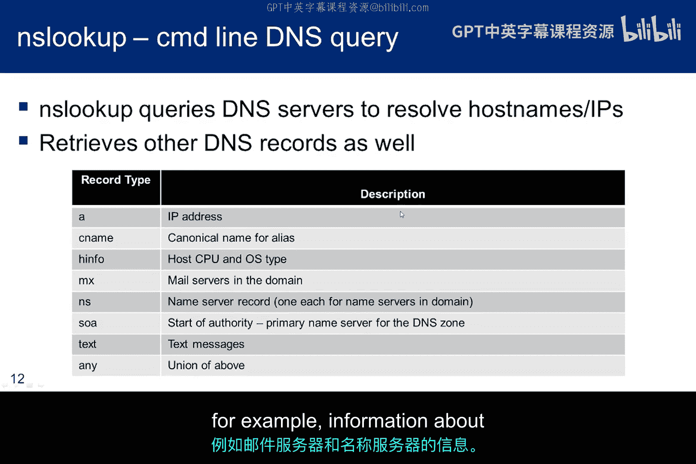
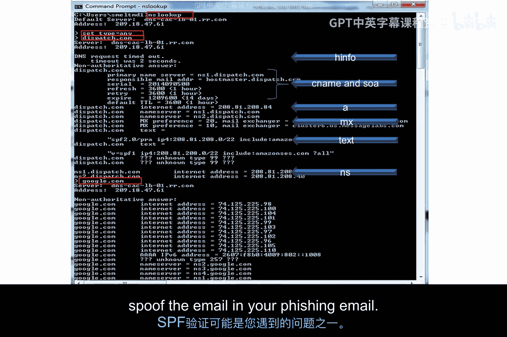
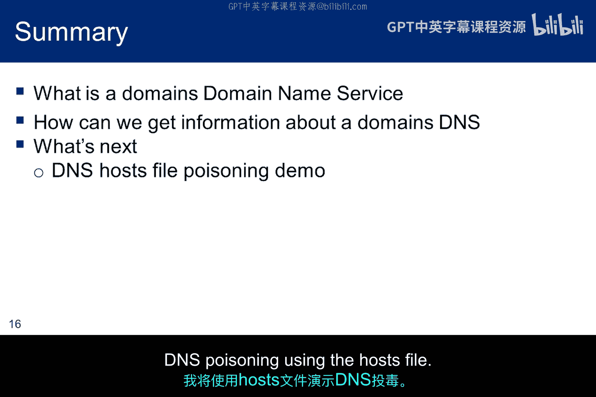

# 019：域名服务侦查技术 🌐

在本节课中，我们将继续探讨道德黑客方法论中的信息收集阶段。我们将把焦点从整个互联网转向一个更本地化的信息来源——域名服务。我们将了解域名服务器中存储了哪些信息，以及如何从中提取这些信息。

## 概述

上一节我们介绍了信息收集的宏观方法，本节中我们来看看一个具体且关键的信息源：域名服务。从DNS收集数据是道德黑客信息收集阶段的另一重要环节，它是一个极佳的信息来源，因为DNS中充满了IP地址。

## DNS信息的重要性

我们已经讨论过尽可能多地收集目标数据，但其中一些数据确实比其他数据更重要，因为它能帮助我们推进渗透测试。

以下是DNS中几种关键数据类型及其作用：

*   **IP地址**：当我们拥有IP地址时，我们就对要攻击的网络有所了解。我们可以扫描这些IP地址，寻找可利用的脆弱服务。IP地址代表计算设备，因此获取它们有助于我们绘制想要攻击的内部网络地图。
*   **电子邮件地址**：电子邮件地址可用于社会工程学攻击。此外，`@`符号前的信息可能有助于确定网络用户名。
*   **主机名**：主机名与IP地址相关联。在Linux中使用 `host` 命令可能会生成更多可扫描的IP地址。
*   **URL**：URL有助于识别主域名和次级域名。我们可以收集所有这些域的数据，并寻找新的IP地址。

最终，我们能找到与目标关联的IP地址越多，潜在的攻击入口点就越多。DNS是一个极其宝贵的信息源，因为它塞满了IP地址以及这些IP到域名的映射关系。再次强调，IP地址代表计算设备，并提供了网络攻击向量。

## DNS工作原理简述

那么，我们究竟能从域名服务器中提取出什么呢？首先，让我们快速回顾一下域名服务的工作原理。

DNS的基本目的是**名称解析**。给定一个名称，它提供匹配的IP地址以便路由数据包。

> 旁注：地址解析协议将在课程其他地方讨论，它为给定的IP地址提供MAC地址。因此，主机名、IP地址和MAC地址三者紧密耦合。

最初，计算机只有一个 `hosts` 文件。在Linux中，它位于 `/etc/hosts`；在Windows中，它位于 `C:\Windows\System32\drivers\etc\hosts`。你可以查看自己计算机上的hosts文件以了解其内容。这个文件用于将人类友好的主机名转换为IP地址。

hosts文件至今仍可工作，但通常为空或仅提供环回信息，其功能已被DNS取代。hosts文件方法在小型网络上运行良好，但随着文件增大，文件搜索会变得越来越慢，直到慢到无法使用。此外，维护和复制这个文件也很麻烦。

然而，一旦DNS被添加到互联网基础设施中，情况就改变了。在本讲末尾，我们将看一个简单的例子，通过毒化hosts文件来理解其工作原理。

DNS基于一个服务器层次结构，其中本地服务器维护本地环境的名称映射，而非本地服务器则维护关于远程域的信息。

在本页幻灯片右侧的图片中，`ep` 是一个子域，其完全限定名为 `ep.jhu.edu`。沿着树向上，位于全球树顶端的根服务器用一个点 `.` 表示。根服务器下一层是顶级域，例如 `.com`、`.us`、`.uk`。

分布式DNS数据库建立后，DNS服务器可以将其部分子域的权限委托出去，或者单个服务器可以处理多个域。通过向DNS服务器提供域名以获取IP地址的查询是一个迭代过程。首先，解析器检查hosts文件。之后，如果本地名称服务器无法满足请求，它会返回一个指向层次结构中更高级、更接近目标域的另一个名称服务器的引用。

目前，互联网名称与数字地址分配机构管理整个系统，但将顶级域的职责委托给特定的公司和政府。

在DNS实例中，本地服务器通常是主服务器，但通常有一个备份的辅助服务器。主服务器通过发送区域文件复制到备份服务器，这称为**区域传输**。

由于技术原因，DNS名称查询响应中能容纳的根服务器地址数量有限。这个限制决定了根服务器安装的数量，目前全球有13个集群。虽然只有13个“根”，但这些名称服务器托管在多个具有高带宽访问和负载均衡路由器的安全站点，以容纳流量负载。最初，所有这些设施都位于美国，但现在情况已不再如此。可以在 `root-servers.org` 找到包含其位置和属性的完整服务器列表。截至2014年9月，全球有478台根服务器，合并为13个集群。

## 域名解析过程

本页幻灯片简要描述了域名解析过程所遵循的步骤，从hosts文件开始，到缓存从构成DNS的分布式数据库中找到的结果结束。

屏幕截图显示了Windows机器上本地DNS缓存的一部分。如果你想感受DNS缓存的工作原理，可以尝试以下操作：

1.  首先，在命令提示符下输入 `ipconfig /displaydns` 查看你的缓存。检查缓存应显示你最近访问过的域，你甚至可能看到由13个根服务器之一完成的解析记录。
2.  其次，输入 `ipconfig /flushdns` 清除缓存。
3.  第三，再次显示缓存，它应该是空的。
4.  清除缓存后，域名请求将不会在本机上处理，而是由本地DNS完成和/或管理解析。
5.  第四，访问你最喜欢的网站，然后再次显示缓存。事实上，在你做任何事情之前，先访问 `root-servers.org`，你会惊讶于有多少信息最终进入你的缓存。

## DNS侦查工具

DNS搜索可以提供大量关于你正在调查的网络的信息。这包括帮助绘制子网的IP地址。这些搜索还可以揭示关于名称服务器和邮件服务器的信息。虽然通常需要身份验证，但你甚至可能能够强制从主名称服务器进行区域传输，从而收集本地DNS的大部分内容。

现在，我们将研究一些可能有助于从DNS收集信息的额外工具。

### Whois 查询

`Whois` 是由域名注册商运行的一项服务，提供关于域名所有者的信息。尽管隐私问题导致 `whois` 返回的信息发生了变化，但它通常提供管理员的联系姓名和地址，并且通常会提供该域名的DNS服务详情。因此，`whois` 请求是调查域名服务的第一步。

图像显示了 `whois` 服务的RFC。请记住，由于隐私问题以及ICANN希望对信息进行更多控制，`whois` 服务正在不断发展。

这是一个 `whois` 查询示例输出，我查询了俄亥俄州哥伦布市报纸《哥伦布电讯报》的域名。这次互联网搜索显示有两个域名服务器，并确定了为报社设置域名的注册商。接下来，我们想访问注册商的网站，看看是否能提取更多细节。

这是注册商关于《哥伦布电讯报》域名的信息。根据我们在信息收集过程中的阶段，我们可能会使用公司信息对该组织进行一些额外研究。如果我们已经完成了该研究，我们可以使用电话号码进行社会工程学攻击。还要注意，电子邮件地址不是指向通用邮箱，而是指向特定个人。其中一个电子邮件地址肯定是技术人员的，另一个可能是技术方面的，也可能是业务方面的。无论如何，两者都是鱼叉式网络钓鱼攻击的潜在目标。

本页幻灯片显示了与你的硕士课程相关的霍普金斯域 `ep.jhu.edu` 的 `whois` 搜索。如果你在 `internic` 上搜索此域或任何其他 `.edu` 域，它会将你指向跟踪所有 `.edu` 域的 `educa` 网站。

请注意，返回的信息与 `internic` 略有不同，并提供更多细节。然而，在这个例子中，我们没有收到注册商的名称。我们开始看到，由于各个注册商的响应没有统一标准，`whois` 返回了不同的结果。

ICANN DNS工作组认为，当前使用的系统提供了太多不准确的信息，并且未能保护个人和实体在公共领域之外保留信息的合法隐私权。如果你或任何家人朋友注册过域名，包括姓名、家庭住址、电子邮件地址和电话号码在内的个人信息，很可能对互联网上任何使用 `whois` 的人都是可用的。

为了解决这个问题，ICANN希望对 `whois` 的工作方式进行更改。首先，没有一个单一的来源可以进行 `whois` 搜索。为 `.edu` 域设立单独的网站就是这个问题的一个很好的例子。ICANN希望创建一个单一的、全面的信息来源，这样你就不必进行多次搜索来查找域名信息。如果感兴趣域在 `internic` 中找不到，你可能需要在一系列注册商中搜索才能找到它。目前有80亿条 `whois` 记录，以及1150个顶级域名注册商。

第二个变化是，如果创建了全面的来源，ICANN希望它是封闭的，并为 `whois` 查询添加访问控制。至少，所有用户都必须注册并由中央机构批准才能进行 `whois` 查询。如果实施这一更改，将产生许多影响。但可以肯定的是，这意味着查询可以被跟踪，并与用于注册访问 `whois` 功能的信息联系起来。

### Nslookup 工具

`Nslookup` 是一个命令行工具，用于执行查询以从名称服务器检索DNS记录。它可以检索给定域的IP地址，但也可以获取其他信息。

幻灯片显示了与域相关的一些记录类型，例如关于邮件服务器和名称服务器的信息。

此屏幕显示了针对 `dispatch.com` 和 `google.com` 的交互式 `nslookup` 运行。我以交互方式运行它：启动 `nslookup`，设置记录类型，然后输入域名以获取该记录。

请注意，你只需输入新域名即可轻松在不同域之间切换。

如前一张幻灯片所述，发送 `type=any` 是一种简写方法，可以通过一个参数获取所有这些记录。这就是此处运行的内容。我们注意到的第一件事是，`HINFO` 请求没有返回任何关于操作系统类型的数据，它只是超时。事实上，对于 `google.com`，我们甚至没有看到超时消息。

对于此域，`CNAME` 和 `SOA` 返回关于DNS区域的相同信息，包括主名称服务器、域管理员的电子邮件、域序列号以及与刷新区域相关的几个计时器。这是其他被阻止的记录类型请求的默认返回记录。

`A` 记录提供域的IP地址。

`MX` 记录提供邮件服务器信息，并为负责接收邮件的服务器提供优先级评级。

`NS` 记录提供DNS服务器，包括它们的IP地址。

`TXT` 记录返回SPF信息。发件人策略框架是一个简单的电子邮件验证系统，旨在通过提供一种机制来检测电子邮件欺骗，该机制允许接收邮件交换器检查来自某个域的传入邮件是否是从该域管理员授权的主机发送的。电子邮件垃圾邮件和网络钓鱼通常使用伪造的发件人地址，因此发布和检查SPF记录是一种有用的反垃圾邮件技术。在这种情况下，域的有效发送主机使用无类别域间路由表示法表示，因此有 `/22`。它定义了一个包含1024个地址的子网，这些地址是来自此域的有效电子邮件来源。有效的IP范围是 `208.81.208.0` 到 `208.81.211.255`。

正如在SET作业中所讨论的，当你试图在网络钓鱼电子邮件中伪造电子邮件时，SPF验证可能是你遇到的问题之一。

### 其他工具：Dig, Host, Fierce

一些用户认为 `dig` 提供了更大的灵活性，更易于使用，并且输出更清晰。`dig` 安装在Kali上，启动时也会尝试从指定的名称服务器获取区域传输。

`host` 是一个简单、众所周知的解析器，提供了一种获取域主机IP的简单方法。对于此处显示的域，它还提供了关于邮件服务器的信息，随后对这些域的运行揭示了邮件服务器的IP。

你不太可能从名称服务器获取区域传输。但与 `dig` 一样，`fierce` 也会尝试。`fierce` 一个更有成效的方面是，它尝试目标域的众多变体。当我针对 `dispatch.com` 运行 `fierce` 时，它发现了600多个其他域名和IP地址，这些代表了渗透测试人员下一层的潜在目标。

## DNS记录类型详解

我的一个同事运行他自己的服务器，这些是描述区域的资源记录。这是他用来更新其DNS条目的用户界面。

你看到了我之前讨论 `nslookup` 时提到的所有DNS记录。如果你能运行区域传输，你将获得名称服务器中所有域的此类信息。然而，如前所述，区域传输通常具有访问控制机制，需要在执行传输之前进行身份验证。

*   **SOA** 是起始授权机构。一个区域文件中只允许有一条SOA记录，它必须是区域中的第一条资源记录。
*   **NS** 是名称服务器记录。
*   **CNAME** 包含别名。
*   **A** 是地址记录。

## 总结

在本小节中，我讨论了域名服务以及两种可用于收集DNS信息的工具：`whois` 和 `nslookup`。`dig`、`host` 和 `fierce` 是在下一个子模块中我将演示使用hosts文件进行DNS毒化攻击之前，提到的其他提供类似功能的工具。

