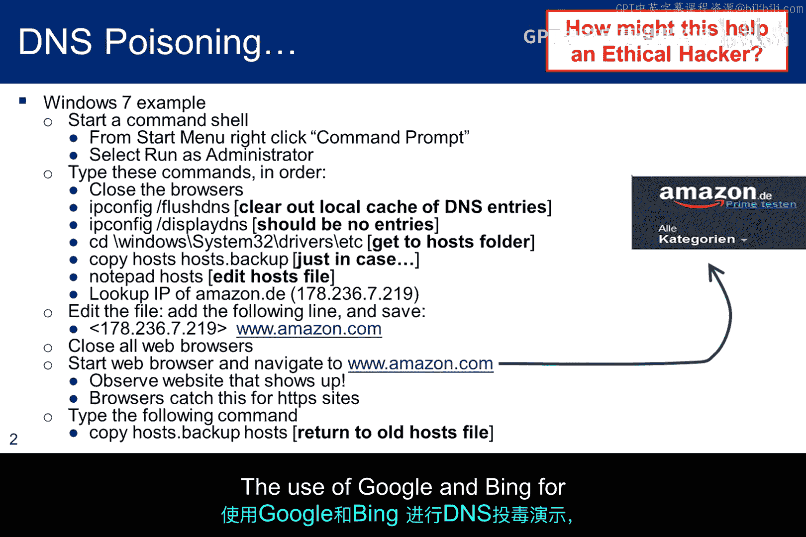
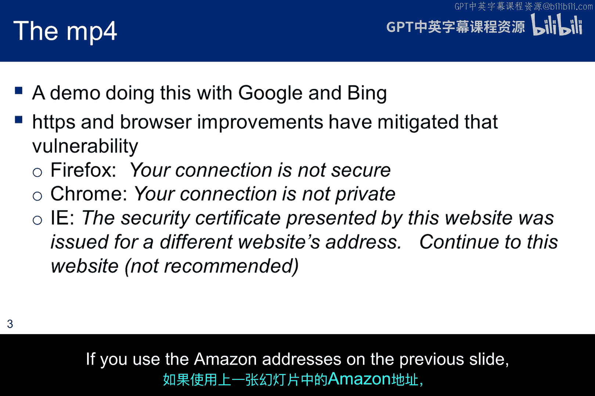
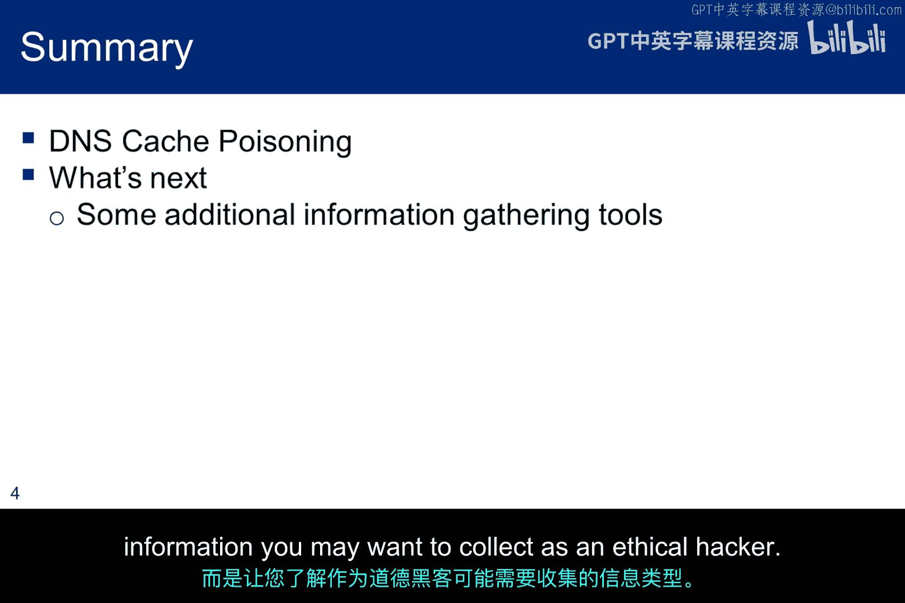

# 020：DNS缓存投毒攻击 🧪

在本节课中，我们将学习DNS缓存投毒攻击的原理、演示以及其在现实世界和道德黑客测试中的应用。我们将通过一个具体的例子来理解攻击者如何篡改本地DNS解析，从而将用户引导至恶意网站。

## 概述

DNS缓存投毒攻击是一种通过篡改DNS缓存记录，将域名解析到攻击者控制的IP地址的攻击方式。本节内容旨在配合本模块的DNS缓存投毒视频，虽然演示示例因浏览器和HTTPS的更新已不再完全适用，但其核心原理依然重要。我们将探讨攻击的实现方式、现代环境下的限制以及道德黑客如何利用此类技术进行渗透测试。

## 攻击原理与演示

上一节我们介绍了DNS的基本概念，本节中我们来看看一个具体的缓存投毒攻击演示。在演示中，攻击者通过修改本地的`hosts`文件来实现投毒。

即使将浏览器主页设置为`google.com`，在投毒后点击主页按钮，用户将被导向`bing.com`。这个演示清晰地表明，DNS解析器会优先查询本地的`hosts`文件。因此，修改该文件会导致用户获得非预期的访问结果。

一个更恶性的攻击可能不是切换搜索引擎，而是克隆一个如Gmail的登录页面来窃取凭证。攻击者可以通过投毒DNS缓存，将域名指向这个克隆的恶意网页，从而在用户输入凭证时进行收集。

以下是攻击的核心步骤：
1.  **定位目标**：确定要仿冒的网站（如`gmail.com`）。
2.  **创建克隆**：搭建一个与目标网站外观一致的恶意页面。
3.  **修改解析**：在目标用户的DNS缓存（如`hosts`文件）中添加一条记录，将目标域名指向恶意服务器的IP地址。
4.  **收集信息**：当用户访问该域名时，会被引导至克隆页面，其输入的凭证将被攻击者获取。

道德黑客在渗透测试中，可能会使用这种攻击来获取用户凭证，以此作为进入目标系统的突破口。



> **注意**：幻灯片中使用的网站（如将`amazon.com`投毒至`am.de`）与视频演示（Google投毒至Bing）不同，这是为了适应不同的教学场景。

## 现代环境下的限制

由于浏览器的安全改进和HTTPS的强制使用，早期针对Google和Bing的DNS投毒演示已不再有效。HTTPS协议依赖于SSL/TLS证书来验证服务器身份。

如果你尝试在HTTPS环境下复现该攻击，浏览器会发出安全警告。例如：
*   **Firefox**会提示：“您的连接不安全”。
*   **Chrome**会提示：“您的连接不是私密连接”，并指出“此网站出示的安全证书是为其他网址颁发的”。

虽然浏览器通常允许用户忽略警告继续访问，但并不推荐这样做。相比之下，使用HTTP协议或像幻灯片中提到的Amazon地址进行实验，可能不会遇到证书不匹配的警告，因此演示效果更佳。

## 动手实践建议



你应该在自己的计算机上尝试DNS投毒示例，以便更好地理解其运作机制。

如果你不想或不能在主机上操作，可以在道德黑客实验环境的虚拟机中进行。只需记住，在实验结束后，务必注释掉或删除对`hosts`文件所做的修改。

实践的核心命令是编辑`hosts`文件。在Windows系统中，该文件通常位于`C:\Windows\System32\drivers\etc\hosts`；在Linux或macOS系统中，位于`/etc/hosts`。你需要管理员或root权限来编辑它。

添加的投毒记录格式如下：
```
# 将 www.example.com 指向恶意IP 192.168.1.100
192.168.1.100 www.example.com
```

## 总结与前瞻

本节课中我们一起学习了DNS缓存投毒攻击。我们了解了攻击者如何通过篡改本地DNS解析来重定向用户流量，无论是用于恶意的凭证窃取，还是道德黑客在授权测试中获取初始访问权限。我们也认识到，随着HTTPS的普及，这类简单攻击的有效性已大大降低。



在接下来的子模块中，我们将了解Kali Linux中一些额外的信息收集工具。目标并非涵盖所有工具，而是让你对道德黑客可能需要收集的信息类型有一个初步的接触，为后续更深入的探索打下基础。