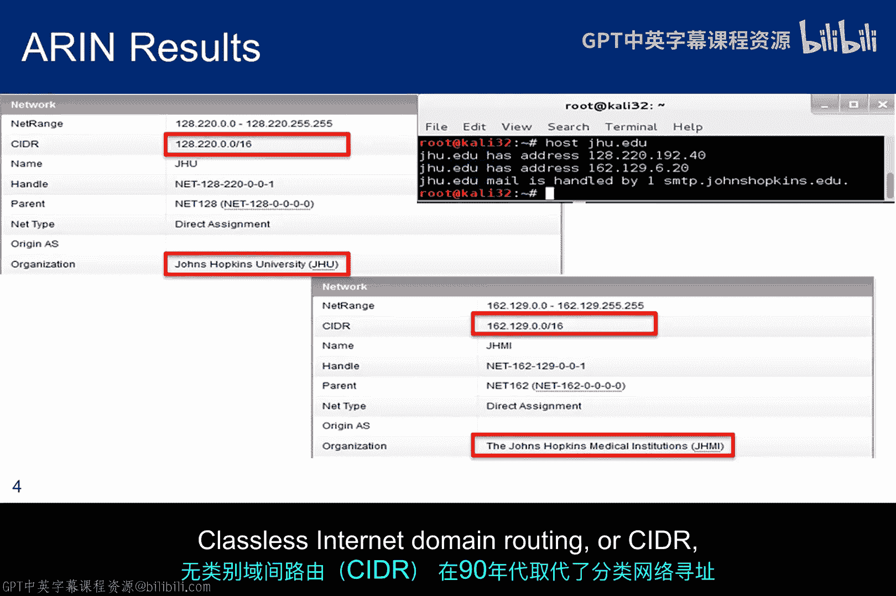
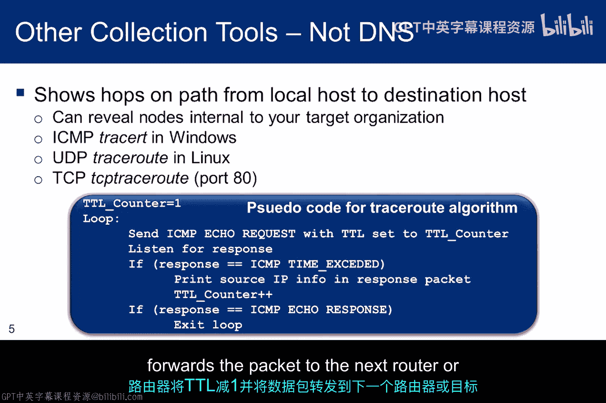
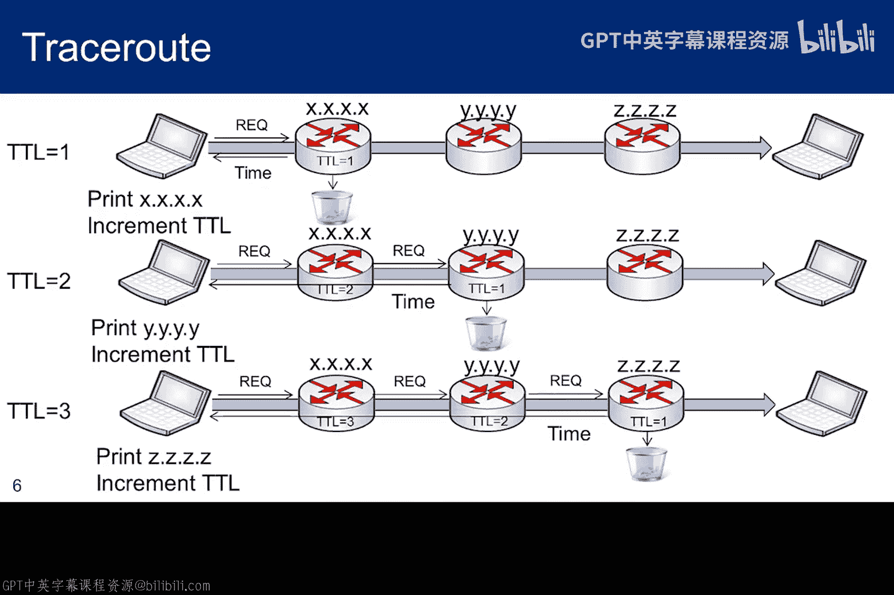
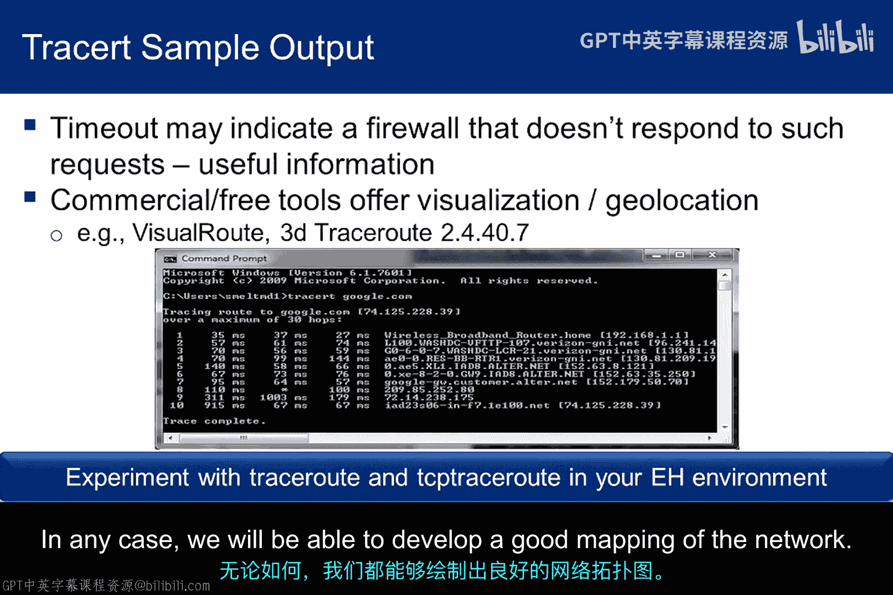
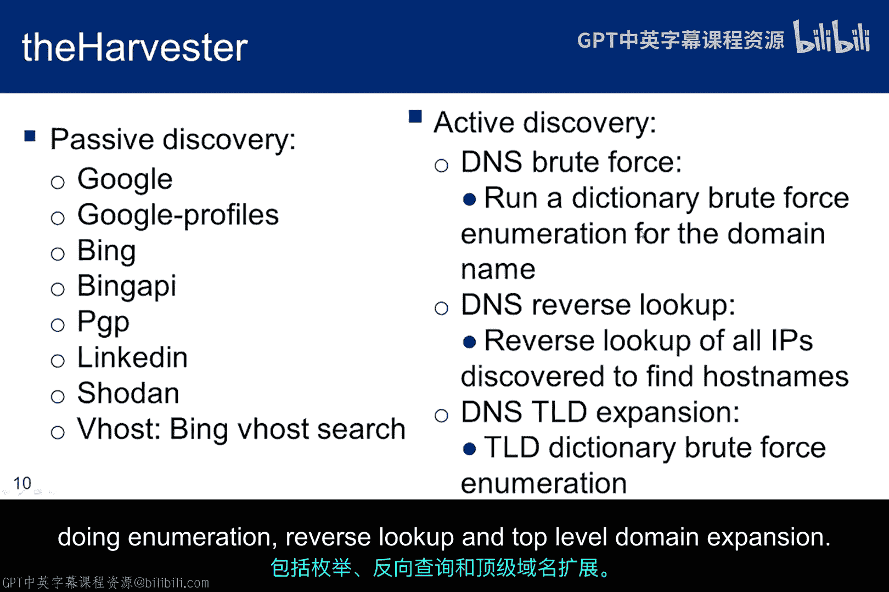
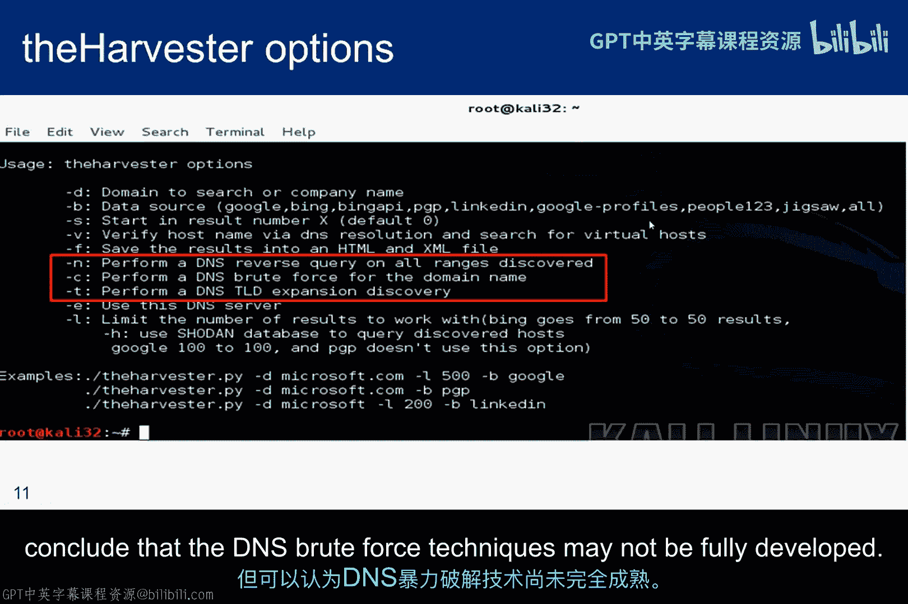
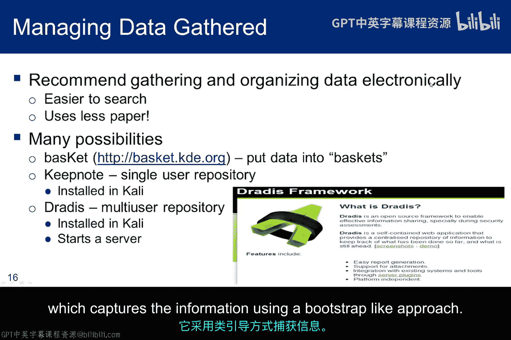
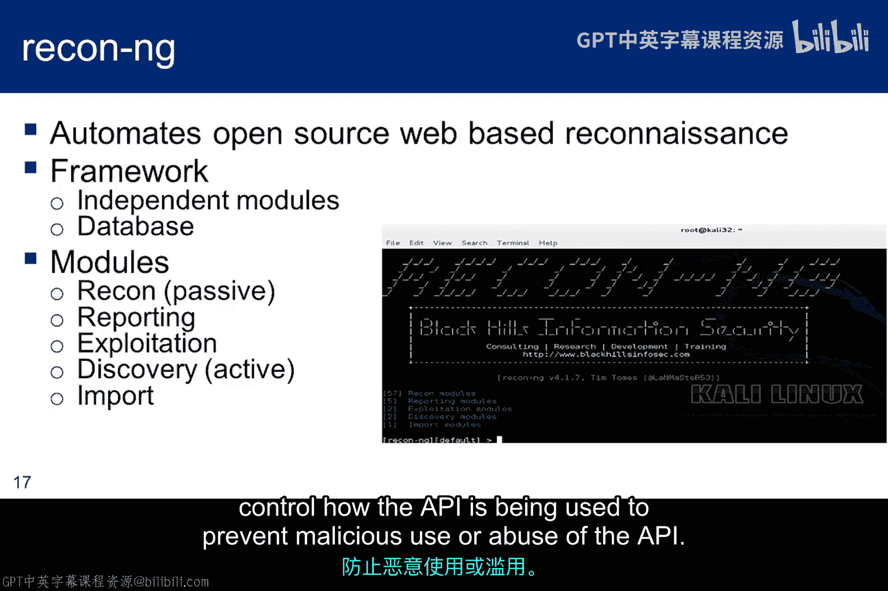
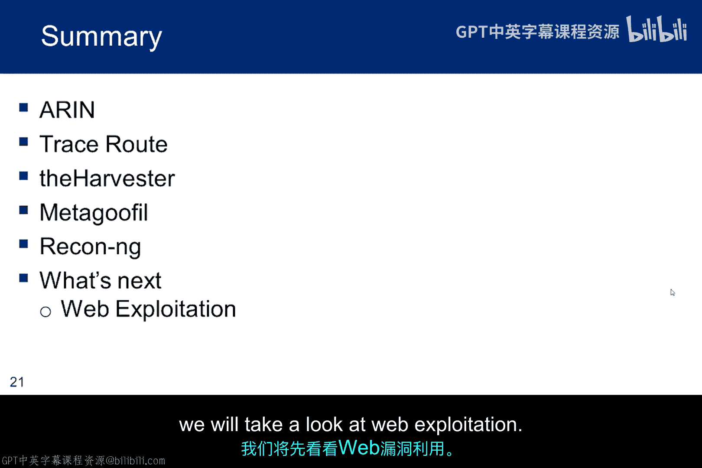

# 021：高级情报收集工具 🛠️

在本节课中，我们将深入学习信息收集阶段的高级工具与技术。我们将重点讨论IP地址的获取、网络路径追踪、自动化信息收集以及如何有效管理收集到的数据。

## IP地址与区域互联网注册管理机构

在上一节关于从域名服务器收集信息的课程中我们提到，IP地址是渗透测试员的关键信息。IP地址为扫描提供了目标，如果检测到易受攻击的服务，它们还可能成为潜在的入口点。

因此，本节将花更多时间讨论IP地址以及可用于收集它们的工具。这是我们方法论中信息收集阶段的最后一个子模块。

互联网号码分配局（IANA）负责将互联网资源分配给区域互联网注册管理机构。这些区域注册管理机构则根据其区域政策，将资源分配给其客户，包括互联网服务提供商和最终用户组织。

美国互联网号码注册机构（ARIN）是负责美国和加拿大地区的区域互联网注册管理机构。ARIN数据库包含IP地址块的信息，对于给定的IP地址，它可以返回其所属的地址块。

以下是使用ARIN收集信息的示例：

1.  对给定域名（如 `jhu.edu`）运行 `host` 命令。目前，该命令返回两个IP地址。
2.  将这些地址输入到 `www.arin.net` 网站，我们可以看到两个 `/16` 的IP地址块，一个属于大学主校区，另一个属于医学院。
3.  如果我们要对约翰霍普金斯大学进行渗透测试，此查询允许我们将目标从一个IP地址扩展到65536个IP地址（尽管它们可能并非都与计算机相关联）。

关于CIDR表示法：
*   `128.220.0.0/16` 表示前16位用于定义网络，后16位用于标识节点，即 `128.220.0.0` 到 `128.220.255.255`，共65536个节点。
*   如果我们输入 `24.20.181.34`，它返回 `24.20.0.0/15`。前15位定义网络，剩余的17位定义了 2^17 个节点，即131072个节点。

无类别域间路由（CIDR）在90年代取代了传统的分类网络寻址架构。

## 路径追踪工具

`traceroute` 是一种诊断工具，用于逐跳显示IP网络中数据包的路径并测量传输延迟。所经路径的历史记录被记录为从路径中每个连续主机接收到的数据包的往返时间。其目标是确定网络拓扑结构，并找出防火墙和负载均衡器等设备在网络中的位置。

Windows中的 `traceroute` 发送ICMP回显请求数据包，当数据包到达目标节点时会返回响应。TCP和UDP `traceroute` 是其变体。然而，防火墙阻止ICMP回显请求或不常见的UDP端口的情况并不少见。

因此，基于半开连接技术的TCP `traceroute` 有时能更有效地穿透防火墙，因为它使用80端口和半开连接，这可以防止应用程序检测到探测。

`traceroute` 的基本思想是利用IP数据包中的生存时间字段。TTL字段被包含在IP数据包中，因为如果没有它，误路由或误寻址的数据包可能会在网络空间中永远传输，消耗带宽。通过在数据包中设置TTL，每个路由器都可以检查并对其采取行动。

例如：
*   如果一个非目标路由器的路由器收到一个TTL为1或0的数据包，它必须丢弃该数据包，并向源IP地址发送一个ICMP超时响应，通知它目标IP地址距离太远无法联系。
*   如果TTL大于1，则路由器将TTL减1，并将数据包转发给下一个路由器或目标IP地址（如果那是下一个节点）。

`traceroute` 的工作流程如下：
1.  首先将TTL设置为1并发送一个回显响应请求。由于TTL为1，第一个路由器丢弃数据包并返回超时响应。这包括路由器的IP地址和时间戳信息，提供了延迟信息（计算接收时间减去发送时间，单位为毫秒）。
2.  收到响应后，`traceroute` 打印出IP、时间，并递增TTL。
3.  这次，由于TTL为2，第一个路由器递减TTL并将其转发给下一个路由器。现在TTL为1，因此数据包被第二个路由器丢弃，响应随第二个路由器的IP和传输延迟一起发回。信息被打印出来。
4.  TTL再次递增，我们继续处理路径中的第三个路由器。

这张幻灯片显示了从我的Windows计算机到 `google.com` 的 `traceroute` 结果。默认情况下，`traceroute` 向每一跳发送三个数据包。因此，输出列出了每个数据包的往返时间（RTT）以供比较。当然，可能影响RTT的一个重要因素是跳之间的物理距离。

如果 `traceroute` 遇到防火墙或IDS系统，RTT列中开始出现星号，并且我们会收到“请求超时”的消息。当渗透测试员想要映射防火墙后的目标网络时，如前所述，`traceroute` 通常会被防火墙阻止，因为防火墙通常配置为不响应这些请求。

至少，`traceroute` 可以告诉我们防火墙在路径中的位置，这可能是有用的信息。如果我们在防火墙内部，我们可以从A点向B点发起 `traceroute`，然后从B点向A点发起 `traceroute` 并进行比较。根据内部网络的复杂程度，我们可能会得到不同数量的跳数，因为它经过不同的路由器。无论如何，我们都将能够绘制出良好的网络映射图。

与许多渗透测试工具一样，使用 `traceroute` 时确实需要进行一些分析思考。以下是一个对域名进行 `traceroute` 的示例，但它解析并追踪到了Black Lotus（一个域名提供商），而不是实际的域名服务器本身。发生这种情况是因为Black Lotus是一个域名提供商，而实际服务器可能已关闭。如果您不注意并错误地解释信息，很容易被误导。

## 自动化信息收集工具：The Harvester

`theHarvester` 是一个工具，用于从搜索引擎、PGP密钥服务器和Shodan数据库等不同公共来源收集电子邮件、子域名、主机、员工姓名、开放端口和横幅信息。它提供了目标在互联网上的足迹。

在部分显示的示例运行中，它发现了109个电子邮件地址和18台主机。Shodan暴露了互联网上的在线设备（包括路由器和过滤器），`theHarvester` 利用它来提供开放端口和横幅信息。

`theHarvester` 还会发现基于名称的虚拟主机。服务器依赖客户端在HTTP头部中报告主机名。使用这种技术，许多不同的主机可以共享同一个IP地址，这有点类似于NAT。不幸的是，`theHarvester` 不是一个维护良好的工具。

以下是 `theHarvester` 的被动发现要素：
*   **Google搜索**：提供电子邮件、子域名和主机名。
*   **Google个人资料搜索**：提供员工姓名。
*   **Bing**：微软的搜索引擎，提供与Google类似的结果，但也会提供虚拟主机信息。
*   **Bing API**：利用微软的API，但您需要在 `discovery/bingsearch.py` 文件中添加您的密钥。
*   **PGP搜索**：搜索 `pgp.rediris.es` 的PGP密钥服务器。
*   **LinkedIn**：使用专门针对LinkedIn用户的Google搜索引擎。
*   **Shodan搜索引擎**：搜索暴露设备的端口和横幅。

主动发现技术侧重于域名服务枚举、反向查找和顶级域名扩展。枚举功能会遍历 `dns-names.txt` 并尝试所有条目，但没有相关文档。并且我的 `theHarvester` 版本无法定位DNS字典文件，也根本找不到TLD字典。反向查找选项效果很好，但我们可以得出结论，DNS暴力破解技术可能尚未完全开发。

## 元数据收集工具：Metagoofil

`Metagoofil` 是一个信息收集工具，旨在从属于目标域的公开文档中提取元数据。典型的文件扩展名包括 `.pdf`、`.doc`、`.xls`、`.ppt`、`.docx`、`.pptx` 和 `.xlsx`。

`Metagoofil` 将在Google中执行搜索以识别文档并将其下载到本地磁盘，然后使用不同的库（如 `Hachoir`、`PdfMiner` 等）提取元数据。提取元数据后，它将生成一份包含用户名、日期、软件版本以及服务器或机器名称的报告。有可能使用提取出的用户名对任何开放服务发起暴力破解攻击。

这张幻灯片显示了 `metagoofil` 的选项。这是一个指向2013年黑帽大会演示文稿的链接，它向您展示了元数据的价值。

## 信息管理与整合工具

随着信息收集模块的结束，我们需要思考如何管理已收集的信息。您可以保留笔记本或以电子方式记录所有内容，但您必须在遵循道德黑客流程的过程中跟踪已执行的操作。如果不这样做，您将无法制定全面的渗透测试报告。如果网络很复杂，您可能会忘记报告一些重要信息。

以下是几种可能性：
*   **KeepNote** 和 **Dradis** 在Kali中可用。一个关键区别是，KeepNote不支持多用户，而Dradis支持。
*   另一种方法是使用像 **Recon-ng** 这样的工具，它采用类似引导程序的方法捕获信息。与SET类似，Recon-ng也具有Metasploit框架的外观和感觉。它是一个侦察工具，可以自动化我们讨论过的许多数据收集技术。

它通过简单的界面为常见任务提供内置功能，例如与其数据库交互、发出Web请求以及管理API密钥。启动Recon-ng后，只需键入 `help` 即可查看命令行界面中可用的命令。

其中一个命令是 `show`，它将提供对框架功能的一些了解。作者将侦察模块描述为被动的，而发现模块是主动的。使用 `load` 命令加载模块后，框架的上下文可能会发生变化，并且会提供一组新的命令和选项。

该工具的核心是其数据库，每一条信息都存储在其中。一旦进入数据库，一条信息就可以作为潜在输入种子，从中可以收获新的信息。这就是该工具的真正职责：用少量信息引导数据收集过程。

*   `add` 命令允许用户向数据库添加初始记录，这将为模块提供输入或种子数据。
*   模块获取种子数据，通过信息收集过程将其转换为其他数据类型，并将新收集的数据作为其他模块的潜在输入存储在数据库中。
*   `query` 命令有助于管理和理解数据库中存储的数据。但是，用户需要具备一些结构化查询语言的知识才能与Recon-ng的数据库交互。`show schema` 命令提供了数据库模式的图形表示，以帮助构建SQL查询。

Recon-ng中的许多模块都依赖于API密钥进行数据收集。API密钥是Recon-ng在调用API时传递的代码，用于向网站标识自身。如果未传递API密钥，查询可能会被拒绝。当然，API密钥并非Recon-ng独有，使用API的应用程序可能需要它们。这些密钥用于跟踪和控制API的使用方式，以防止恶意使用或滥用API。

以下是侦察模块的列表。您可以看到其重点在于公司联系人、凭据、域名和位置。`search` 命令有助于根据已收集的信息确定在信息收集阶段下一步该做什么。侦察模块使用路径结构：`recon/输入表-输出表/模块`。因此，一个模块使用输入表中的信息，并为输出表收集信息，从而扩展信息数据库。

要查看所有接受域名作为输入的模块，可以搜索 `domains-`；要查看所有导致收获主机的模块，可以搜索 `-hosts`。Recon-ng是一个很好的数据收集工具，但似乎有些不成熟，因此可能处于不断变化的状态。

Recon-ng是一个被动工具，但尽管如此，拥有Recon-ng所利用数据库的人希望为他们汇编的信息收取费用。因此，对于非专业人士来说，它可能不是一个可行的工具，因为API密钥的费用会迅速增加。话虽如此，这里有几个YouTube视频演示了它的工作原理。第一个视频展示了Landmaster53进行侦察的方法论。第二个视频展示了如何通过地理标记完成物理侦察。

Recon-ng的位置表可以存储街道地址。根据物理地址，地理编码模块会返回纬度和经度。一旦我们有了经纬度，`pushpin` 模块将搜索该经纬度附近的地理标记媒体。该模块将搜索Twitter、Flickr、Picasa、YouTube和Shodan上的媒体。返回的图钉会按颜色编码以显示图片的来源。

正如YouTube视频中所展示的，这是使用NSA街道地址进行搜索的结果。一个有趣的事实是，有来自NSA停车场的推文、来自大楼内部的Flickr图像以及来自大楼内部的YouTube视频。`pushpin` 模块还会每15分钟创建一次历史记录以存档信息。当然，您可以访问来源，并实际查看这些图片。😊

## 总结

本子模块完成了信息收集过程。我们讨论了收集IP地址、网络映射、收获电子邮件地址、子域名和主机，以及最终从给定域上找到的文件中组装元数据。在其他子模块中，我们涵盖了物理信息收集、Google黑客、网站复制、Wayback Machine、社会工程和DNS数据收集。其中一些是主动工具，一些是被动工具。您可能已经注意到，这些工具之间存在一些重叠，但这是可以预料的，因为它们都是独立开发的。

然而，收集到的一些信息的重复并不是一个重大问题。关键是在目标不知情的情况下对目标进行足够的侦察，以便能够进入下一阶段，即对IP地址进行主动扫描并识别易受攻击的服务。不过，在进入扫描阶段之前，我们将先了解一下Web漏洞利用。