# 022：移动设备安全与NSO越狱攻击分析 📱

在本节课中，我们将探讨移动设备安全，并深入分析一个著名的真实攻击案例：NSO集团利用零日漏洞对iPhone发起的“越狱”攻击。我们将了解移动设备与传统有线网络计算设备的安全差异，并学习攻击者如何利用复杂的技术链控制设备。

---

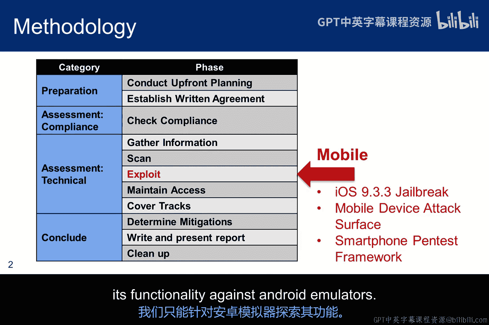

## 概述

我们已经完成了渗透测试方法论的核心讨论。剩余的课程属于该框架的一部分，并符合该方法论，但通常不会包含在渗透测试报告中。第一个主题是移动设备。我们将探讨这些设备的安全性，并简要说明它们与典型有线网络计算设备的技术差异。从技术上讲，我们仍处于“利用”阶段，但焦点已转移到移动设备上。

我们将讨论NSO集团对iPhone的越狱攻击。实验部分将重点介绍智能手机渗透测试框架（SPF）作为一款道德黑客工具，可用于针对真实移动设备进行测试。由于我们没有实际设备，我们将仅在Android模拟器上探索其功能。

---

## 移动设备越狱与Root的概念 🔓

在2016年8月，各组织的移动设备管理员都陷入恐慌，试图为其公司的iPhone打补丁，因为发现了一种在野攻击可以“越狱”设备。

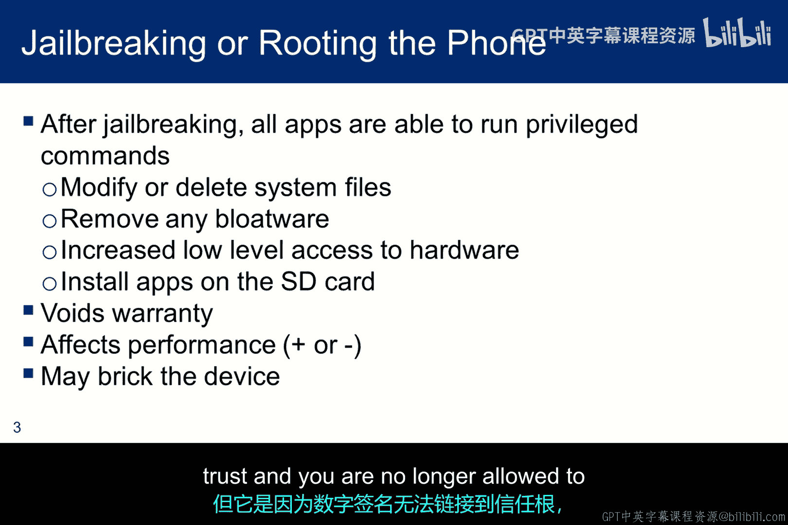

在本模块中，我的术语可能会混用“越狱”和“Root”这两个表达。请不要因此感到困惑。社区通常对iOS设备使用“越狱”，但其概念是相同的。这两个表达都指在设备上获取特权（最高权限）的行为。

对iPhone进行越狱有一些副作用。主要影响是，所有应用程序都能够运行特权命令。如果应用程序被恶意行为者控制，那么我们在系统上获取Root权限所关联的所有负面活动，都会在你的移动设备上造成同样的风险。

越狱的一个好处是可以移除预装的冗余软件（“膨胀软件”）。但苹果公司会立即使设备保修失效。更重要的是，由于苹果设备安全启动链的实现方式，越狱会在下一次系统升级时导致设备“变砖”。我不会深入探讨此效果的细节，但其原因是数字签名无法链接到可信根，并且你将无法再降级到旧版本的操作系统。

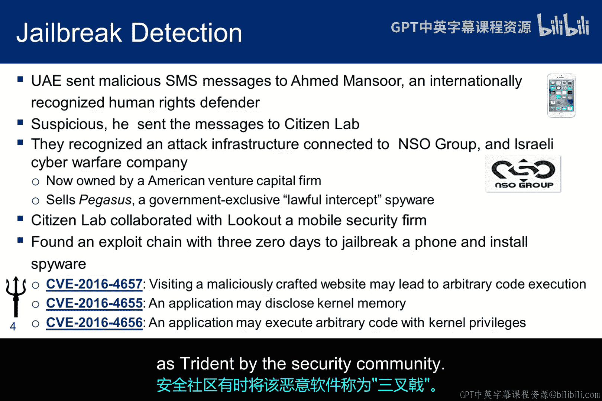

---

## NSO越狱攻击的发现与影响 🕵️♂️

这次越狱攻击最初是由阿拉伯联合酋长国的一位人权捍卫者发现的。他此前曾是政府黑客攻击和间谍软件的受害者，因此对一条关于阿联酋监狱酷刑的短信产生怀疑。于是他将该信息发送给了多伦多大学的数字权利监督机构“公民实验室”。

公民实验室与移动设备安全公司Lookout合作，很快确定随短信附带的链接会对设备发起非常复杂的攻击。该攻击被认定与以色列网络战公司NSO集团相关的其他间谍软件非常相似。

这次越狱利用了设备上的三个零日漏洞，导致了内存损坏，并最终安装了间谍软件。安全社区有时将这款恶意软件称为“三叉戟”。

---

## NSO集团的商业模式与Pegasus间谍软件 💼

事实证明，这是NSO集团的商业模式。该组织向政府出售针对手机的武器化软件。该公司的核心产品名为“Pegasus”，提供针对iOS、Android和黑莓设备的漏洞利用。

NSO集团声称，他们只向政府出售，条件是网络技术必须用于反恐或反犯罪情报工作。然而，从公众视角来看，这似乎有些难以控制——谁知道谁购买了Pegasus，或者NSO集团愿意卖给谁。

该公司对其产品守口如瓶，没有官方网站，在媒体互动方面相当隐秘，并免除自身一切责任。在一篇关于NSO集团在墨西哥出售间谍软件的较新文章中，提到了50万美元的固定安装费，外加每台设备的额外费用。但关于成本的信息最多只是推测性的。

NSO集团并未受到大量媒体关注，但据称，迈克尔·弗林在支持NSO集团运营的相关公司担任顾问时获得了巨额报酬。NSO集团面临一些竞争，但其技术已在阿联酋、墨西哥和肯尼亚浮出水面。

---

## 攻击链分析：从社会工程到持久控制 ⛓️

“三叉戟”内置了自我保护机制，同时监控自身进程以防被发现，并可以自毁。Pegasus提供对短信、iMessage、电话、FaceTime通话、电子邮件和多种社交媒体服务的远程监控。恶意软件会挂钩到应用程序中，在任何处理发生之前读取原始信息。例如，iMessage是端到端加密的，但Pegasus恶意软件会在加密发生之前读取内容。当然，一旦设备被越狱并安装了挂钩，就可能转向其他应用程序并收集信息。

该恶意软件在野外潜伏了两年才被检测到。促成攻击的零日漏洞在发现后立即被苹果修补。然而，与此同时，NSO集团可能已经发现了新的零日漏洞，也可能没有。但由于其隐秘性，当前产品的能力并不为公众所知。

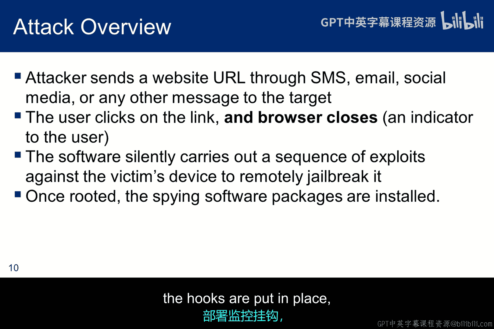

攻击始于一条经过社会工程学设计的消息，并支持多种消息类型。目标是专门“钓取”收件人，并希望他点击消息中的URL。这个想法很重要。因此，在实验中，我们将探索一条包含恶意URL的短信。关于此类攻击，许多用户似乎对点击短信中的URL更加 careless，没有意识到唯一改变的是传递方式，对于链接需要保持与以往相同的警惕。

如果用户点击了URL，浏览器会打开然后关闭。这可能向用户暗示出了问题，或者他们可能只是认为这是异常行为。移动设备上的应用程序经常崩溃，因此这似乎看起来并不反常。无论如何，无论用户是否怀疑，点击后恶意软件会立即执行攻击以越狱设备，并且不会向用户提供进一步的指示。一旦设备被越狱，间谍软件即可安装，挂钩就位，间谍活动随即开始。

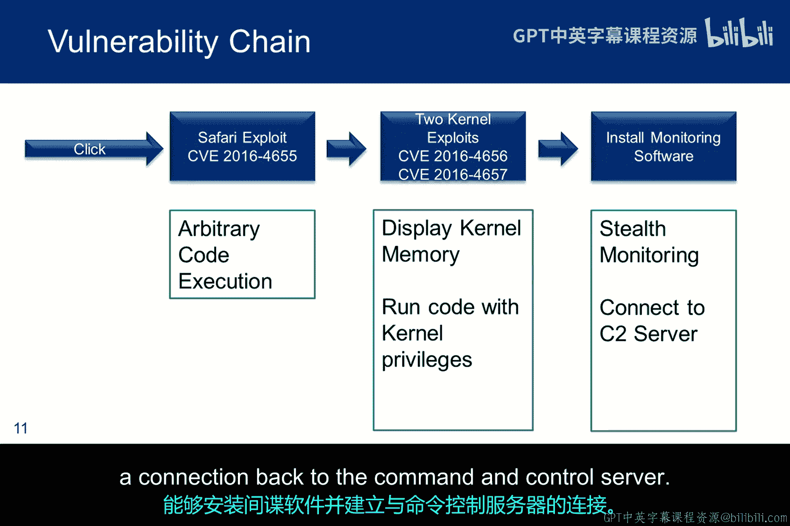

---

## 利用的三个零日漏洞详解 🎯

以下是攻击中利用的三个零日漏洞的简要描述：
1.  第一个基于Safari浏览器的漏洞，允许任意代码执行。
2.  第二个是内核漏洞，泄露了内存位置的信息。
3.  第三个破坏了内存，允许以Root权限运行代码，并禁用了系统保护机制。

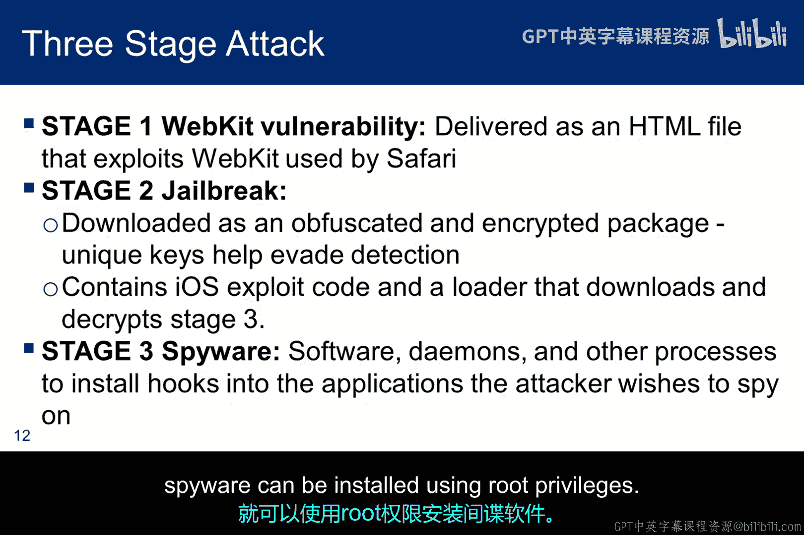

此时，恶意软件完全控制了设备，能够驻留固件，并打开一个回连到命令与控制服务器的连接。

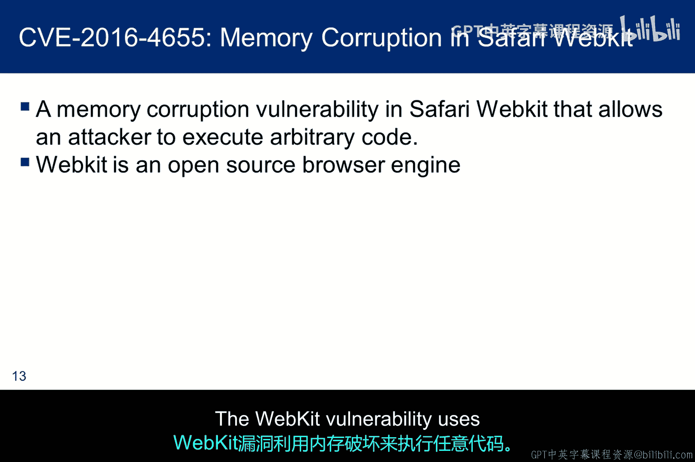

---

## 攻击阶段分解

以下是攻击的分阶段技术细节：

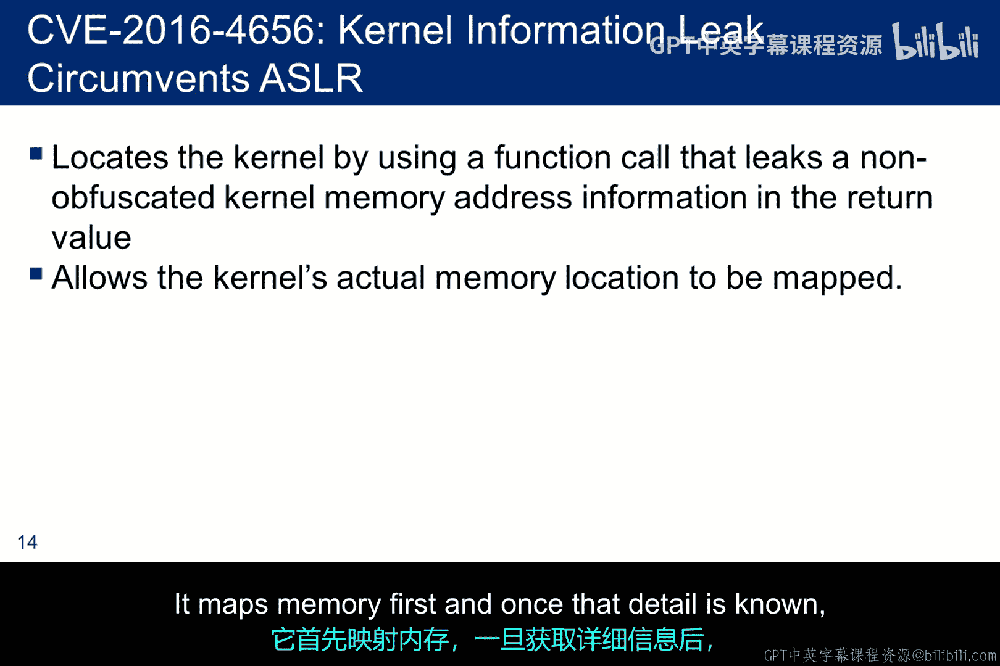

**阶段1：初始入侵**
利用Webkit漏洞执行任意代码并获得初始立足点。Webkit是Safari和一些Linux应用程序使用的浏览器引擎。Android模拟器中的浏览器也使用它。进行移动性实验的人将在Android上探索类似的Webkit漏洞。

**阶段2：获取Root权限**
设备下载一个经过混淆的包，该包在下载后自行解密，并运行两个内核漏洞利用程序。对有效载荷进行加密的目的是规避可能存在的任何端点安全机制。一旦设备获得Root权限，就可以使用Root权限安装间谍软件。

**阶段3：内存操作与权限提升**
*   Webkit漏洞利用内存损坏来执行任意代码。
*   第二个漏洞泄露了设备部分内存，绕过了地址空间布局随机化等保护机制。它为Pegasus提供了内核的精确位置信息。
*   一旦恶意软件映射了某些内存位置的详细信息，它就能够修改指令指针，使代码得以执行，从而在缓冲区溢出中越狱设备。在关于信息泄露的讲座中，我将讨论一个示例，精确展示其在虚拟机上的工作原理。该示例使用相同的方法来绕过ASLR：首先映射内存，一旦获知该细节，第二阶段便操纵指令指针。

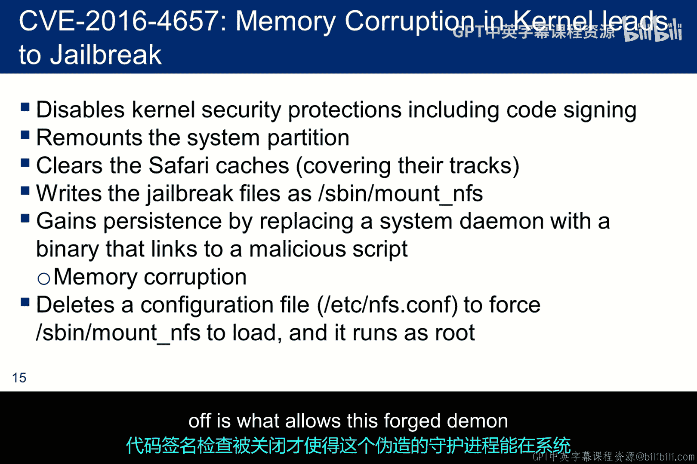

**阶段4：持久化与控制**
恶意软件利用内存损坏来攻击内核，然后采取几个行动来越狱手机：
1.  禁用内核的安全机制，包括代码签名，以便未签名的代码可以执行。
2.  同时禁用越狱检测应用程序。
3.  重新挂载文件系统，并将越狱代码写入文件系统。
4.  最后一步是删除一个配置文件，这会强制越狱代码以Root权限加载和运行。

恶意软件通过用一个二进制文件替换系统守护进程来实现持久化，该二进制文件调用一个脚本，该脚本基本上加载重新利用内核的shellcode。重要的是要记住，代码签名检查被关闭这一事实，允许这个伪造的守护进程在系统每次重启时都能执行。

---

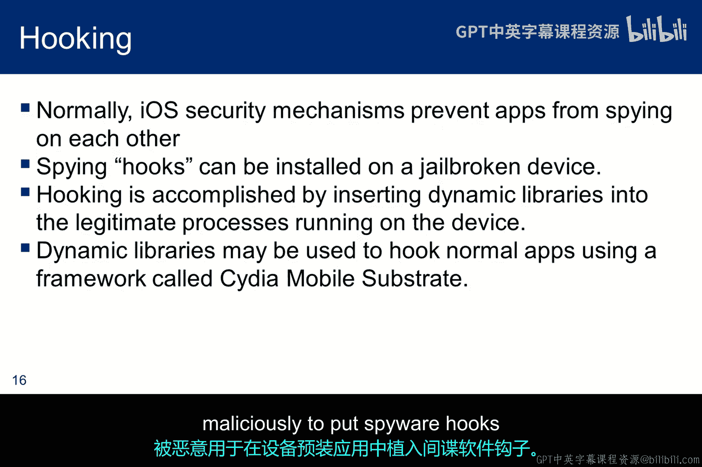

## 间谍软件挂钩与数据窃取机制 📞

iOS内置了防止应用程序以相互监视的方式交互的保护机制。但在已越狱的手机上，可以通过向正常进程注入动态库来安装设备挂钩。这是通过使用“Cydia Substrate”实现的，该工具最初设计用于允许第三方开发者为其应用程序提供运行时补丁。但它附带了三叉戟有效载荷，并被恶意用于将间谍软件挂钩放入设备自带的正常应用程序中。

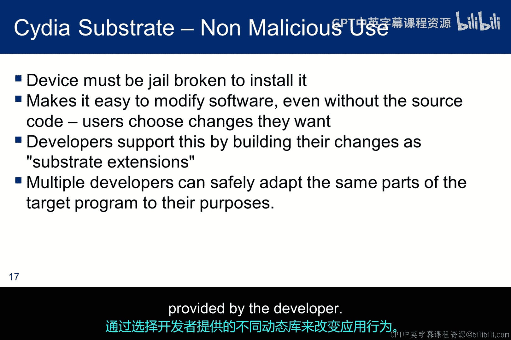

Cydia Substrate只能在设备越狱后按原设计安装。一旦安装，它就是一个允许开发者对应用程序进行动态更改的工具。这些更改称为“Substrate扩展”，它们作为动态库插入应用程序中。通过使用提供的API在内存中进行所有更改，多个开发者可以安全地针对同一目标程序的部分进行适配。拥有越狱手机的用户也可以安装该框架，并通过选择开发者提供的不同动态库来改变应用程序的行为。

---

## 间谍软件有效载荷的组成与功能 📦

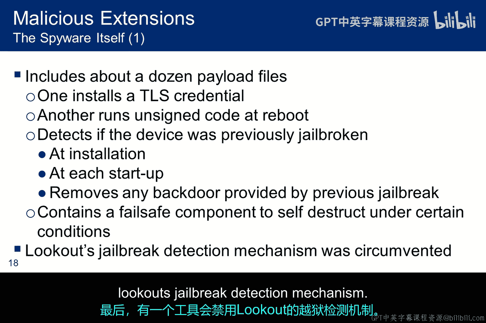

间谍软件有效载荷由多个文件组成，除了Cydia Substrate，还包括一些自我保护机制。在我看来，这些都是非常复杂的恶意软件技术。

以下是其主要组件：
1.  **TLS证书**：允许对间谍软件收集的信息进行保密的数据外泄。
2.  **伪造的系统守护进程**：如前所述，一个未签名的伪造系统守护进程在重启时运行以实现持久性。
3.  **越狱检测器**：移除可能已安装的任何其他后门。
4.  **自毁组件**：当三叉戟认为已被检测到时运行。
5.  **反检测工具**：禁用Lookout的越狱检测机制。

间谍软件本身会禁用自动更新，以便DLL库保持原位。它还禁用设备进入深度睡眠模式的能力，以保持运行、通信和监控状态的能力。用于外泄收集数据的命令与控制通道使用短信，但这些短信伪装成来自Facebook和Google等流行服务的双重认证消息，并完全模仿了非法的双重认证交换。

以下是对合法应用程序的一些重要恶意扩展：
1.  **系统守护进程**：加载钥匙串并转储所有密码。
2.  **WiFi密钥捕获**：捕获与WiFi网络相关的Web和WPA密钥。
3.  **音频与消息拦截**：最重要的是，根据每个Pegasus模块关联的触发器，拦截所有离开设备的音频和消息。这是通过一套模块化且可扩展的复杂音频和消息拦截库完成的。还有针对每个关键拦截协议的专用库。

---

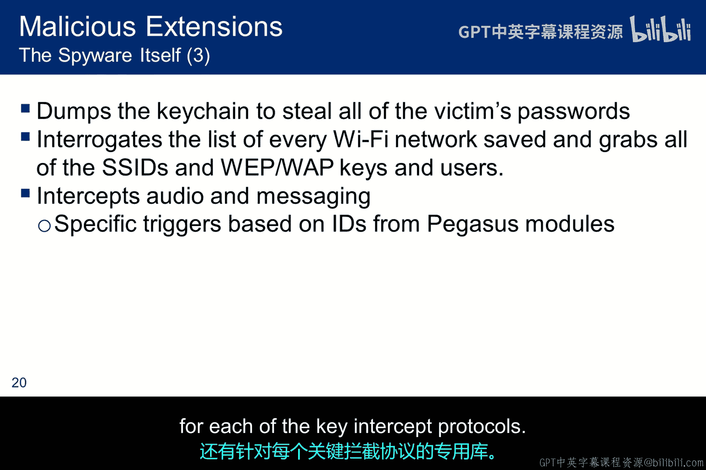

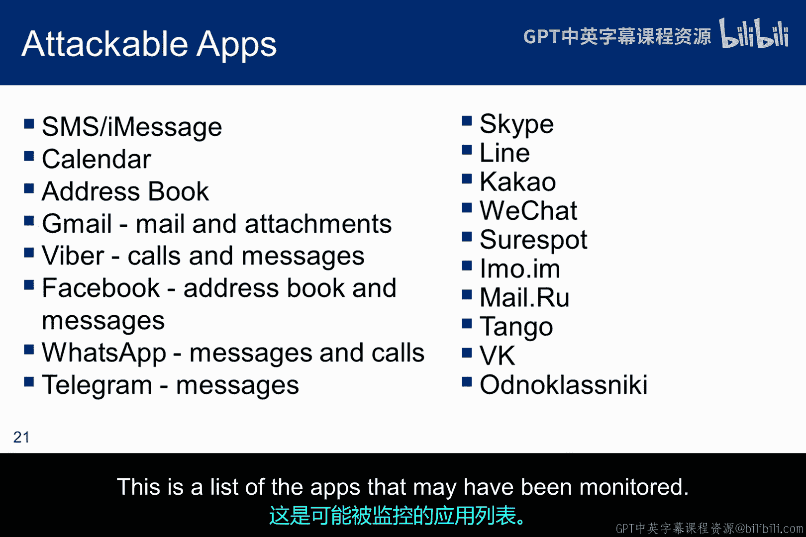

## 总结

本节课我们深入探讨了NSO越狱攻击。尽管相关漏洞已被修补，但其技术仍有参考价值。你可以看到它与针对台式机等计算设备的攻击有一些相似之处。毕竟，移动设备的基本区别在于其外形尺寸和增加的无线通信模块。

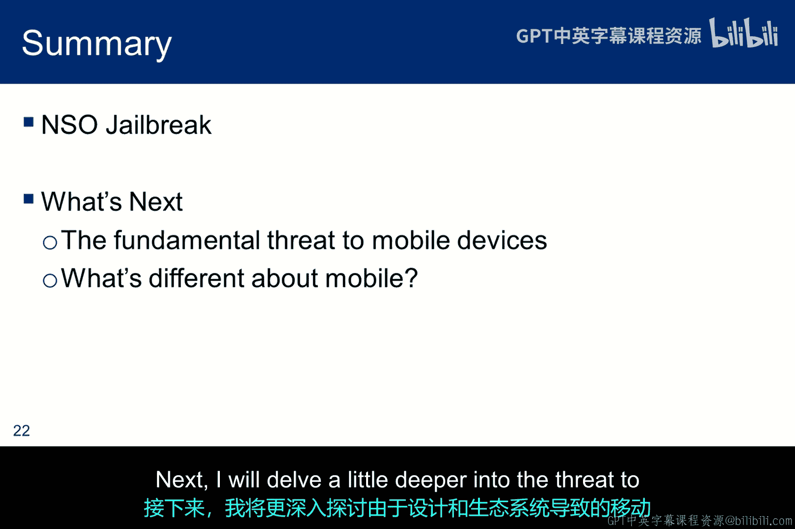

接下来，我将更深入地探讨由于设计和生态系统而给移动设备带来的威胁。