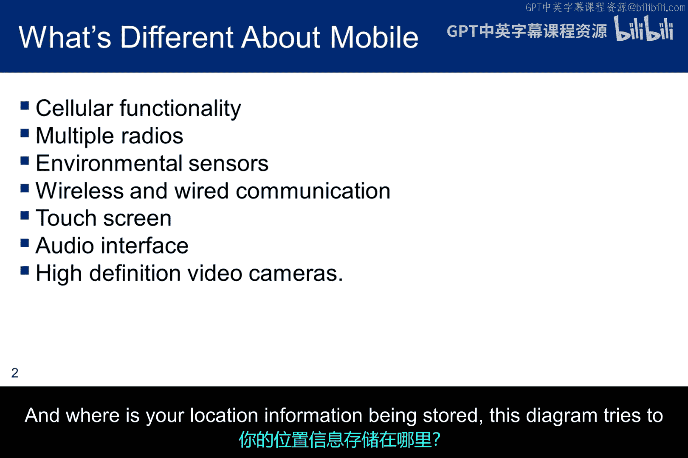
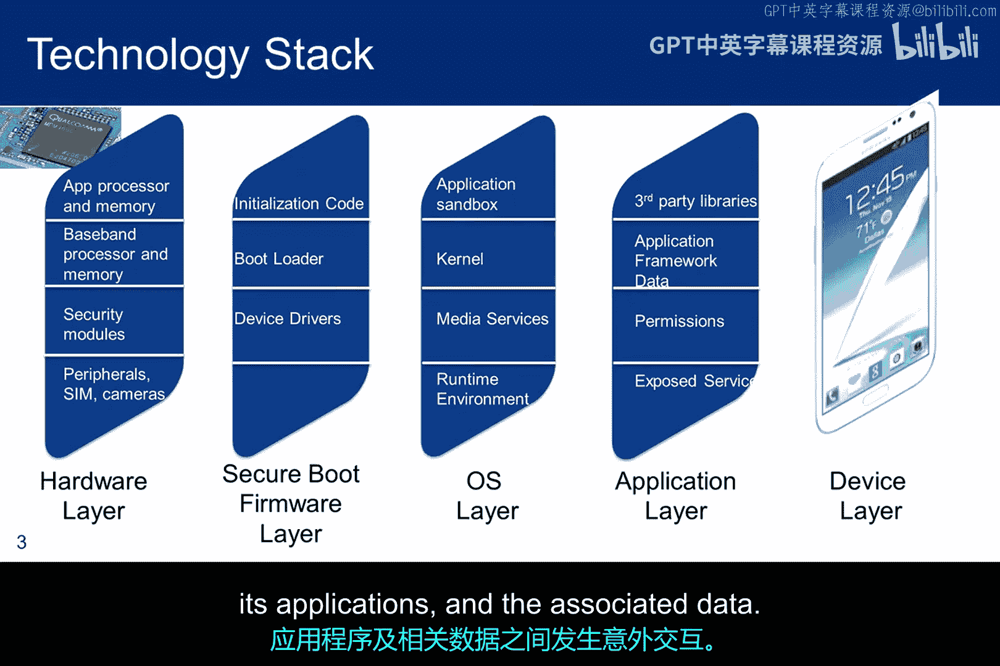
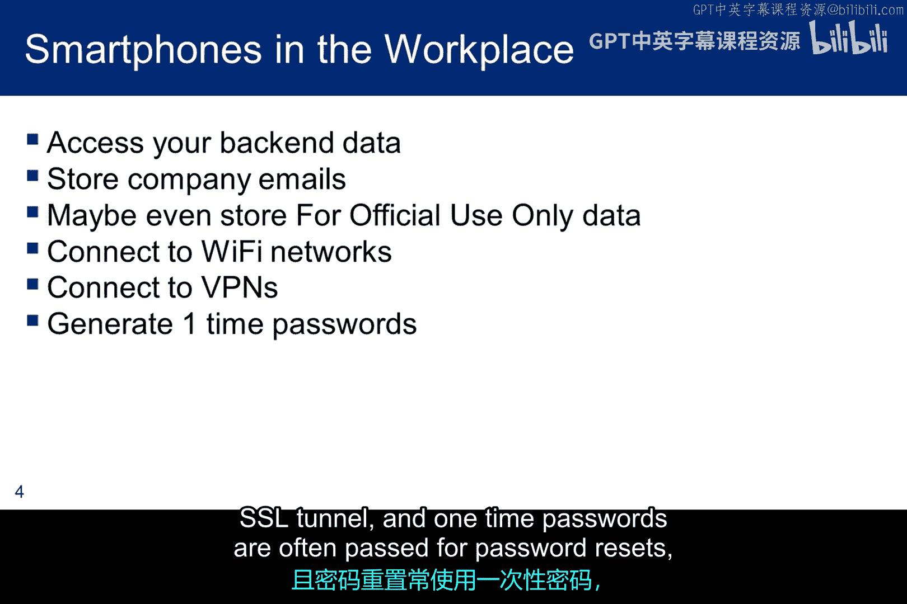
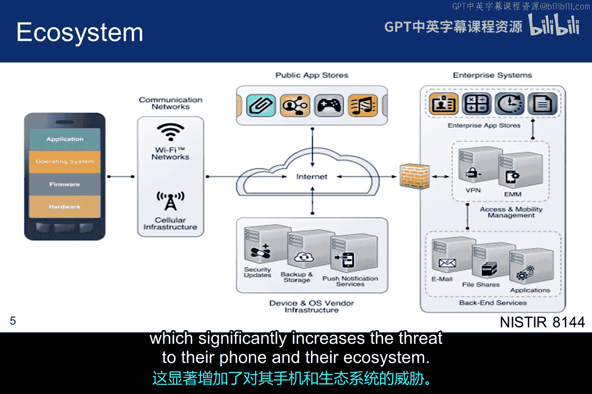
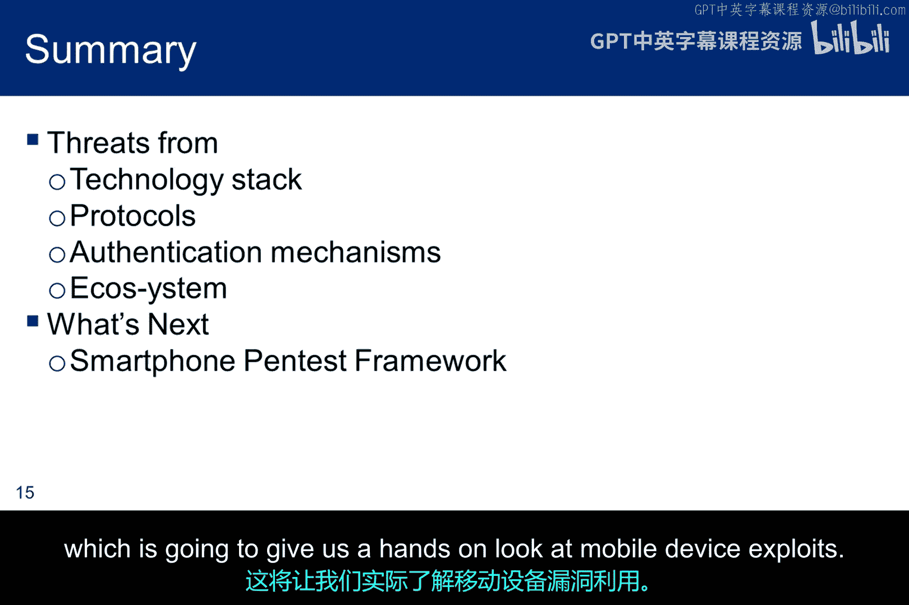

# 023：移动设备威胁 📱

在本节课中，我们将学习移动设备安全威胁的演变、其独特的技术架构以及由此产生的广阔攻击面。移动设备已从简单的通话工具演变为承载大量敏感信息的个人计算中心，这使其成为攻击者极具吸引力的目标。

## 移动设备的演变与威胁格局

最初，移动设备只是用于拨打电话的蜂窝电话。早期的攻击目标主要是电信运营商，目的是实现免费通话。如今，随着用户开始信任这些设备并存储大量敏感个人信息，威胁格局已发生巨大变化。

## 移动设备与桌面计算机的平台差异

以下是移动设备与典型桌面或笔记本电脑之间的一些平台差异列表。这些差异与需要详细分析的技术相关，以寻找攻击面的任何扩展。在许多方面，这种扩展使得智能手机成为更丰富的目标，并且可能保护不足，因为安全社区可能尚未完全掌握其防护要领。

*   **环境传感器**：例如，许多应用程序使用地理围栏信息，但其中有多少使用是真正必要的？你的位置信息存储在哪里？
*   **专用硬件子系统**：用于访问蜂窝网络的硬件和固件（通常称为电话系统）通常运行实时操作系统。这个子系统俗称基带处理器。
*   **安全启动与信任根**：启动移动操作系统所需的固件通常会验证包括部分移动操作系统在内的额外设备代码，然后用户才能使用设备。这涉及信任根和可信启动处理器。如果初始化代码被篡改，设备可能无法正常工作。
*   **安全执行环境**：一些移动设备可能包含专门用于安全功能（例如加密操作或支持数字版权管理）的隔离执行和存储环境。
*   **应用沙箱**：移动应用程序几乎总是以某种方式被沙箱化，以防止系统、其应用程序及相关数据之间发生意外和不需要的交互。

## 移动设备在企业与个人环境中的风险

在工作场所，对移动设备的攻击可以为攻击者提供一个跳板，使其能够访问存储组织所有专有数据的后端基础设施。当然，设备本身可能以电子邮件或附件的形式存储了敏感的公司信息。此外，设备还提供Wi-Fi网络连接并使用VPN。工作场所设备也可能使用一次性密码来临时保护敏感交换，甚至加载软件证书。

在个人设备上，我们可能不会使用所有这些功能，但在很大程度上存在相似之处。云存储具有后端企业的许多属性。使用Wi-Fi数据连接进行的购买总是利用加密的SSL隧道，并且经常传递一次性密码用于密码重置。无论手机归谁所有，这些都代表了攻击向量。

## 移动生态系统与攻击面

上图展示了蜂窝设备的生态系统。我包含此图是为了说明攻击面可能比你想象的要大得多。请记住，攻击可以是双向的：生态系统可以提供进入手机的向量，手机也可以提供进入生态系统的向量。关于公共应用商店的一个评论是：它必须包含来自操作系统供应商和第三方的软件。因此，一个问题在于：第三方应用程序的保护程度如何？在某些情况下，尤其是Android设备，用户会直接从不可靠的来源（通过应用商店）获取应用程序，这显著增加了对其手机及其生态系统的威胁。

## 常见的移动设备威胁类别

以下是一些对移动设备更常见的威胁列表，但这远非详尽无遗。在课堂上，我总是喜欢问学生，他们的手机是否可能成为僵尸网络的一部分。移动设备僵尸网络自2011年就已存在，但大多数用户不会想到它们。手机通常比电脑更换得更频繁。但你如何检查你的手机是否已被入侵并处于僵尸网络中？我们根本没有广泛可用的工具集来检查我们的移动设备。媒体宣传过物联网设备僵尸网络，但移动设备尚未真正被视为威胁，尽管它们可以很容易地集成到同一个僵尸网络中。

另一个重要的概念是**突破沙箱**的能力，即在不越狱的情况下与其他应用程序交互或利用其他应用程序。

多个通信路径为移动设备提供了多个入口点。虽然计算机可能只有有线连接或Wi-Fi连接，但移动设备不仅有Wi-Fi，还有蜂窝网络、蓝牙、NFC（近场通信）和SD卡接口，以及可能易受攻击的双用途电源端口。

GPS接口则稍微复杂一些。手机通常有GPS芯片，但为了节省手机电池寿命，它们使用低功耗芯片。由于是低功耗芯片，它们也利用来自蜂窝基站的可用位置信息来更快地提供精确位置。由于这些芯片功耗低，当附近没有蜂窝基站时，它们的工作效果不佳，设备完全依赖于芯片。GPS提供了双向攻击：它不仅是入口点，而且如前所述，一旦位置信息被确定，谁获取了它以及它可能如何被滥用。

## 威胁类别详解

以下是威胁类别列表。我将只讨论本幻灯片上的最后四个类别，其余的将单独介绍。

*   **供应链问题**：供应链问题的一个方面是所有设备都在海外制造。尽管像苹果这样的公司可能非常谨慎，但生产线上可能发生管理层无人知晓的事件。这不仅涉及硬件或固件，还包括安装到新设备上的软件负载。我们有一个中国公司的例子，他们在数十万部手机上安装了秘密后门。根据Ars Technica的报道，安全公司Kryptowire在低价Android手机的固件中发现了一个后门，包括通过亚马逊和百思买在线销售的BLU产品手机。这种恶意软件在未经用户许可或知情的情况下，将个人身份信息、通话记录、短信消息和联系人信息发送到中国的服务器。
*   **企业移动管理**：一旦攻击者能够访问设备，就会面临一些威胁。企业移动管理系统为企业管理移动设备提供了基础设施。它们可以帮助向所有设备部署策略并监控设备状态。示例策略包括：只允许白名单中的应用程序运行、确保满足锁屏策略、以及禁用某些设备外围设备（如摄像头）。这个攻击面显然是间接的，但显然是系统安全工程师需要担心的事情。
*   **移动支付威胁**：与移动支付相关的威胁包括诸如USSD（我们将在实验中探索）等技术，但其他可攻击的支付方法还包括NFC、金融科技和信用卡令牌化。
*   **技术栈攻击**：移动设备技术栈由用于托管和操作移动设备的硬件、固件和软件组成。这是对该技术栈的潜在攻击列表。
*   **协议与服务攻击**：这是使用可能被攻击的协议的服务列表。除了蜂窝协议外，其他协议可能都很熟悉。蜂窝协议包括连接到基站的蜂窝空中接口、扩展蜂窝覆盖范围的小型消费者蜂窝基站、消息服务、USSD、信令系统7和LTE。
*   **认证点攻击**：基础设施中进行身份验证的三个地方也容易受到攻击。我们遇到的第一个是**本地认证**，即每次登录手机时，无论使用密码、指纹还是语音识别。第二个是**用户或设备到远程服务**的认证，包括可能由用户完成但也可以由设备本身完成的远程认证。这涉及对外部进程、服务或设备的远程认证。最后一个认证点是当**用户或设备想要访问网络**（Wi-Fi或蜂窝网络）时，通常在授予服务访问权限之前涉及使用加密令牌。

## 生态系统、社会工程与软件漏洞

我之前提到过生态系统威胁。存在许多挑战，但有两个大问题尤为突出。一个大问题是，一些公共商店提供应用程序访问，但所有者没有充分审查应用程序的流程。第二个问题是，第三方商店通常由任何供应商之外的组织拥有和运营，恶意应用程序的下载和安装为基于社会工程技术的攻击提供了敞开的向量。

带有恶意链接的社会工程短信是一种明显的攻击方式，但令人担忧的是，用户对点击短信链接不像对点击电子邮件中的链接那样谨慎。这可能是一个培训问题。我们的机构曾教导甚至测试我们关于电子邮件中的恶意链接，但短信中的恶意链接没有得到同样的重视。然而，风险同样高，移动设备上数据的敏感性同样关键。

移动设备与桌面计算机之间的一个重大区别是我们下载新应用程序的频率，这增加了获取恶意软件的机会，特别是当应用商店或第三方不是经过适当审查的来源时。

当然，软件漏洞的威胁并不会因为我们拥有不同的设备形态而改变。软件存在缺陷，并且可能拥有比我们愿意想象的更多的未被发现的漏洞。而最难保护的软件之一就是浏览器。此外，在移动环境中，存在软件技术差异，并且软件版本并不总是像桌面浏览器那样经过仔细检查，尤其是在开发人员急于为所有设备形态创建响应式设计时。

## 总结

本节课中，我们一起学习了移动设备面临的多种威胁，包括其技术栈、众多协议、基础设施中的认证点以及整个生态系统。我们了解到，移动设备因其独特架构、丰富的功能和庞大的生态系统，攻击面远大于传统计算机。从供应链风险到应用商店安全，从传感器数据滥用到通信协议漏洞，每个环节都可能成为攻击者的突破口。接下来，我将介绍智能手机渗透测试框架，这将让我们亲手实践，深入了解移动设备漏洞利用的实际操作。