# 024：智能手机渗透测试框架SPF 📱

在本节课中，我们将学习智能手机渗透测试框架。我们将了解该框架的架构、工作原理、历史背景，并学习如何搭建实验环境，包括安装SPF和创建Android模拟器。

---

## 概述

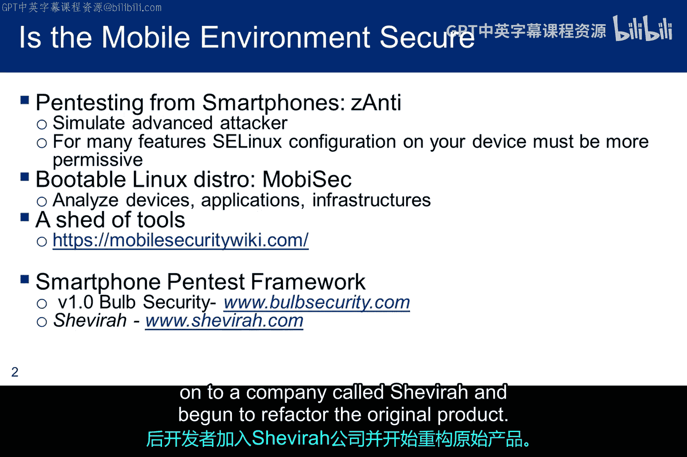

本模块的剩余部分将聚焦于智能手机渗透测试框架。在本小节中，我将向您介绍这个框架。在下一小节中，我将讨论如何使用它，为后续的实验做准备。实验将要求您针对Android模拟器运行一些漏洞利用程序。

---

## 移动安全评估工具

有许多工具可以评估移动设备的安全性。Zanti和Mobisac是两种渗透测试工具。移动安全维基的链接介绍了用于取证、开发、静态分析、动态分析、逆向工程、钩子等主题的工具。如果您对移动设备感兴趣，会发现很多有用的信息。

我们将重点介绍智能手机渗透测试框架，因为它是一个曾经通过GitHub可用的工具，并且为该主题提供了一个很好的切入点。1.0版本由Bold Security发布，但开发者后来加入了Chevira公司，并开始重构原始产品。

---

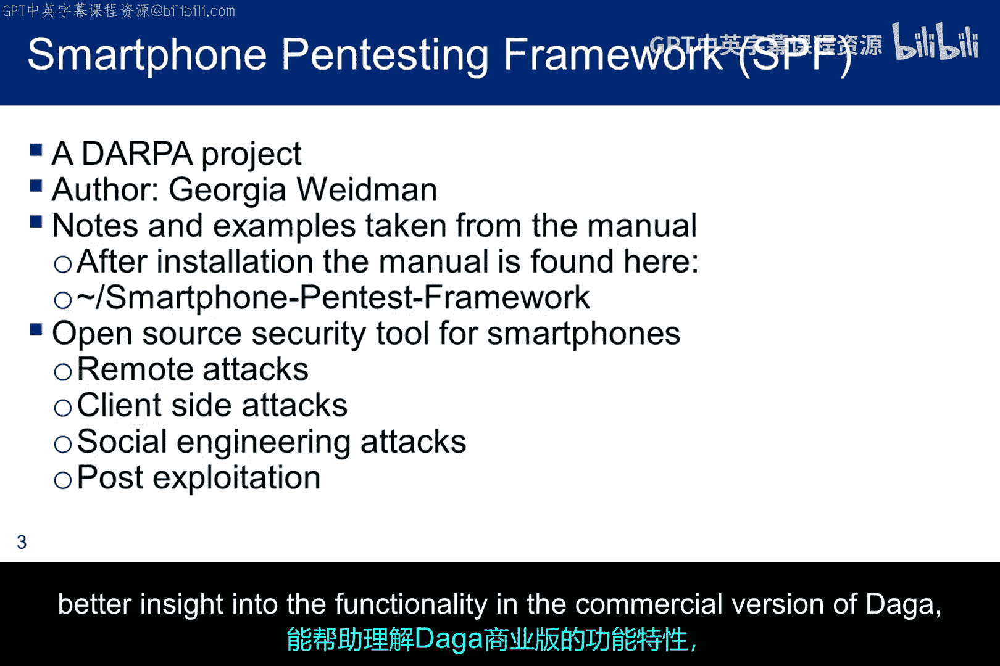

## SPF框架简介

智能渗透测试框架由Georgia Wideman作为DARPA项目开发。它最初在GitHub上可用，但现已不再受支持。当名为Daga的新产品推出后，SPF从GitHub上被移除。我将提供一个最后GitHub版本的压缩包供实验使用。但展望未来，您可能会发现Daga是一个更有用的工具，因为它正在持续更新和改进。

不幸的是，由于移动设备供应商的许可问题，免费版本有其自身的限制。但探索SPF的功能和结构将让您深入了解Daga的工作原理以及如何将其用于渗透测试。

智能手机渗透测试框架是开源的，提供了发起远程攻击、客户端攻击和社会工程学攻击的能力。它还提供了一些对漏洞利用后技术的支持。

许可问题的影响是，具有信息收集功能的代理无法在Daga的免费版本中提供。因此，我选择使用SPF作为学习工具。它虽然不再受支持，但功能更全面，能让您更好地了解Daga商业版本的功能。

---

## SPF架构与工作流程

该框架的设计工作流程如下图所示。在左侧标有Kali的方框中，有一个客户端和一个服务器。与往常一样，如果对渗透测试有价值，服务器可以安装在不同的机器上。客户端控制着运行管理框架的服务器。在我们的案例中，它们都在Kali上。

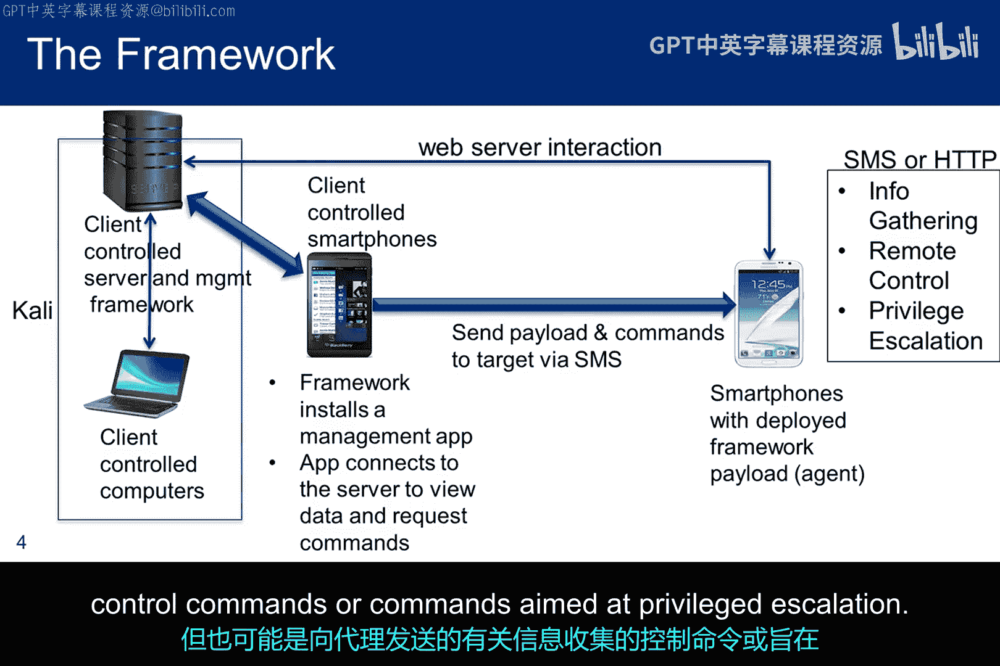

服务器上的框架与一个特殊的、由测试者拥有的智能手机客户端通信，该手机上安装了一个管理应用。关键在于测试者拥有这部智能手机。因此，手机上的应用和框架彼此知晓，共享通信协议，并且可以相互连接。这种连接允许服务器向管理应用发送命令，并查看其发回的任何数据。因此，在客户端控制的手机和管理框架之间存在命令和数据的交换。

架构的最后一部分是右侧的目标设备。图中显示了两种通信路径。第一种是在客户端控制手机上的管理应用与目标设备之间。管理应用使用此路径向目标发送SMS消息。这些消息可能包含恶意负载（在SPF文档中通常称为“代理”）或设备命令。

第二种通信路径是在目标设备上的代理与管理服务器上运行的Web服务器之间。它提供了返回路径，连接到一直在监听来自目标的HTTP GET请求的Web服务器。通过第一条路径发送给目标的SMS消息可能是在传递一个代理，但也可能是向代理发送有关信息收集、控制命令或旨在提升权限的命令。

---

## 攻击步骤详解

这是SPF的另一个视图，讨论了向目标发起攻击所涉及的步骤。

首先，请注意两个移动设备都有与之关联的电话号码。在这张图片中，我们控制的设备号码是15555215554，我们要攻击的设备号码是15555215556。前八位数字总是相同的，但最后两位可能不同。有时由您分配，有时由框架检测。无论如何，区分哪个是哪个很重要。

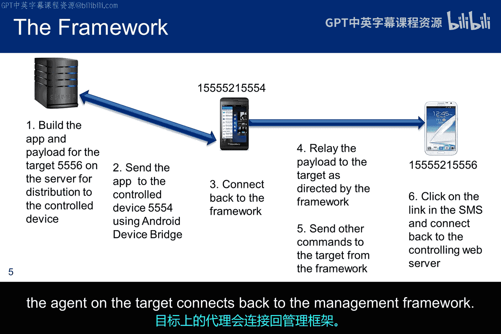

图中对创建攻击的步骤进行了编号：
1.  框架将创建一个管理应用，框架可以使用该应用从受控设备发起针对移动基础设施的攻击。
2.  框架使用电话号码和Android设备桥将应用发送到受控设备。ADB是一个命令行工具，可让您与模拟器或连接的Android设备通信。ADB命令有助于安装和调试应用，并提供对Unix shell的访问，以便在设备上运行命令。
3.  受控设备使用刚安装的应用连接回管理框架。
4.  应管理框架的请求，管理应用将负载或代理中继到目标。再次提醒，不要混淆电话号码。
5.  管理应用可能会向目标上的代理中继其他命令，但我们的实验不探索此功能。
6.  目标设备上的用户点击SMS消息中的URL，目标上的代理连接回管理框架。

---

## SPF的历史与演变

SPF的历史是：它由Georgia Wideman作为DARPA产品创建，并通过她的安全公司Bold Security公开。那时，它在GitHub上免费提供。她后来与其他人合作成立了一家名为Chevira的新公司。目标是重构SPF的大部分内容，不仅提供安全咨询，还提供一个名为Daga的改进产品。

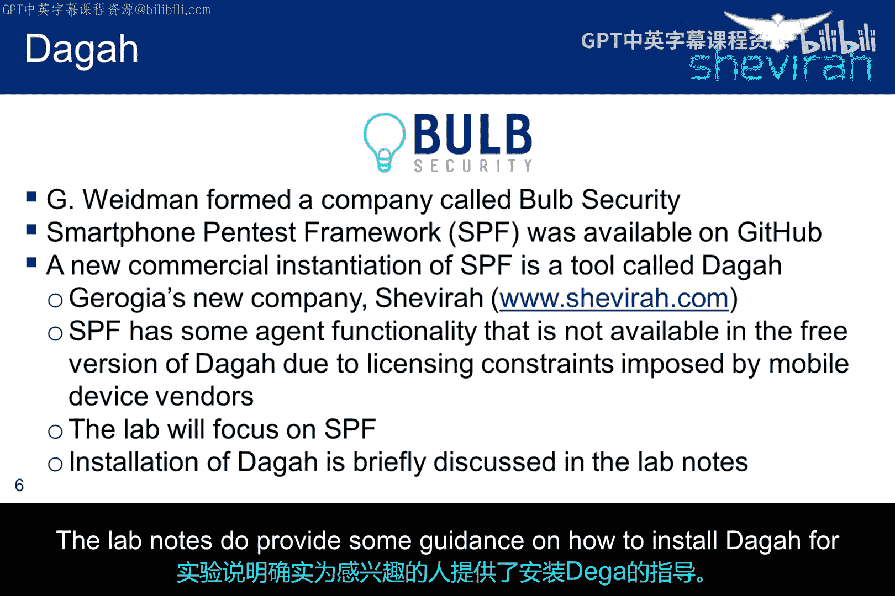

Daga有一个免费版本，我探索过它的功能，但作为一个学习工具，由于与代理相关的许可问题，它比SPF限制更多。因此，本课程的实验将侧重于使用SPF，您获得的见解将可以转移到Daga。实验说明为有兴趣的人提供了一些关于如何安装Daga的指导。

---

## 实验环境搭建：安装SPF

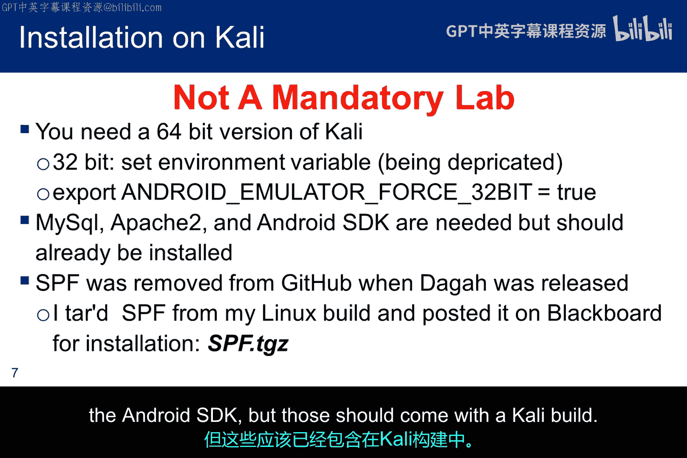

提醒一下，这是第一个非强制性的实验。它是六个非强制性实验之一，您必须选择其中任意四个来完成并提交。

关于安装的一些说明：
*   首先，由于SPF不再在GitHub上可用，我已从我的构建中创建了一个tar文件，它以`SPF.tgz`的名称发布在Blackboard上。实验将要求您下载它，解压缩，并将其安装在Kali上。
*   曾经，您可以通过设置环境变量将其加载到32位版本的Kali上，但该功能正在被弃用。当我尝试时，它似乎已经非常不可靠。因此，您需要将其安装在64位虚拟机上。
*   SPF还需要MySQL、Apache2和Android SDK，但这些应该随Kali构建一起提供。

以下是SPF的安装步骤回顾。我不会逐条阅读，但会指出，一旦解压tar文件，您就可以访问用户手册和安装脚本。在实验说明中，我提供了对脚本的逐行讨论。您可能希望在安装前查看一下，以便知道在安装不顺利时该寻找什么以及在哪里寻找。

安装脚本将启动Apache和MySQL，但根据您的Kali配置，它们可能不会在重启后自动启动。您可以手动启动它们，或重新配置Kali使其自动启动。如果您决定进行实验，请不要忘记启动这些服务。否则，您将为自己制造不必要的故障排除问题。

安装SPF后，您需要配置它以在您的系统上工作。您应该只需要在配置文件中更改三项。这里列出了它们，假设您的Kali Docker RO和Kali IP地址与我的相同。这些地址对于SPF跟踪其将使用的Web服务器和监听器的位置很重要。

至此，SPF已安装并准备就绪，但我们没有设备进行测试，除非您有一抽屉的手机。因此，我们需要构建一些Android手机模拟器。当模拟器运行时，它们会消耗大量主机资源，所以请对实验的这一部分保持耐心。

另一点是，Android开发工具在不断变化、更新和改进。本实验确定的方法基于特定时间点的工具集。因此，该方法可能会过时。因此，互联网上的搜索可能会为Android开发者提供不同的指导。您当然可以选择任何您想使用的工具和方法来使Android模拟器工作，但实验说明中的指导应该有效，即使它不是最新的思路。如果您对Android开发没有太多专业知识，我建议您遵循实验说明中的方法。

---

## 构建Android模拟器

Android SDK工具和Android SDK平台工具是开发人员包，您确实需要最新版本。然后，Android SDK构建工具将决定您可以构建哪个版本的Android设备。

一如既往，版本很重要，因为漏洞利用通常与特定版本及其中的错误相关联。下载构建工具后，您可以通过从“包”选项卡切换到“工具”选项卡来创建模拟器。

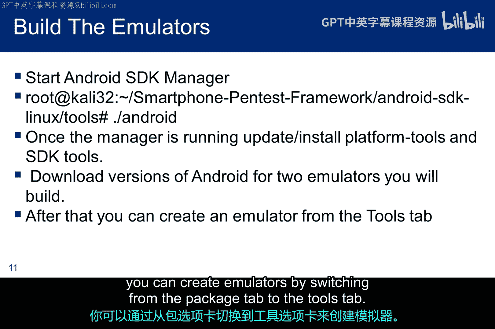

如之前所述，我们需要一个受控的Android设备和一个目标Android设备。因此，我们至少需要两个模拟器，但实际上您需要更多，因为我们将运行的攻击只针对特定版本的Android。

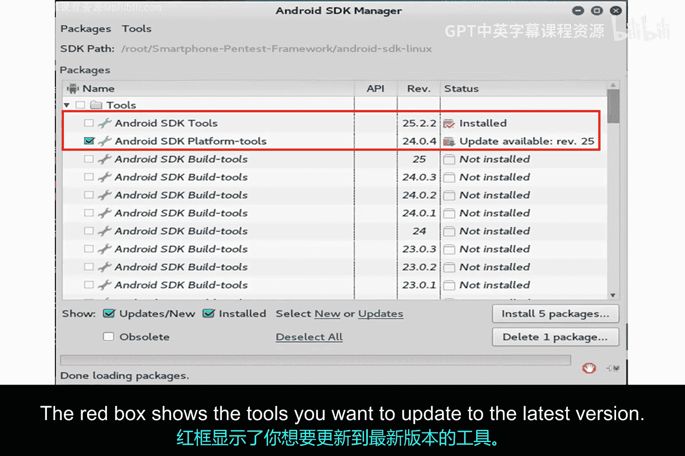

第二个要点提供了Android平台版本与相关API级别之间的链接。例如，要构建Galaxy 7，您需要构建API级别24的构建工具。

这是我的Android设备管理器的屏幕截图，显示了我构建的一些模拟器。至少，您必须构建一个Android 2.1模拟器来测试WebKit漏洞。我使用Android 1.6进行USSD攻击，但它也应该在Android 2.1设备上工作。您还需要一个受控设备模拟器。我为此使用了Nexus 4.0，主要是因为Android的后期版本似乎需要明显更多的主机资源。您可以看到我构建了一个Galaxy 7，但没有在实验中使用它。

当您点击“创建”来构建新模拟器时，您会看到这个屏幕截图。您创建的名称不能有空格，并从下拉菜单中选择要创建的平台。其余选择的指导原则是：您希望为ARM CPU构建模拟器；您希望选择带有动态硬件控制的皮肤，以便从计算机控制设备；并且您需要100MB SD卡，以便可以将文件下载到模拟器。点击“确定”后，模拟器将被构建。

---

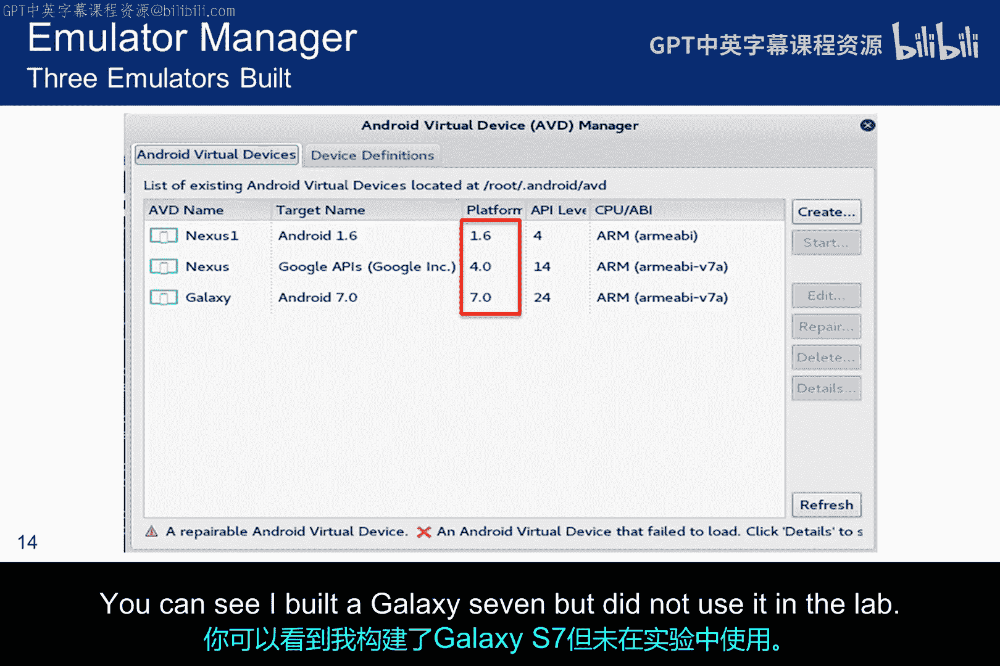

## 启动模拟器

一旦模拟器构建完成，您可以从同一个Android管理器屏幕启动它们。只需高亮显示模拟器并点击“启动”。此时，根据您主机的资源情况，您可能需要一杯咖啡。模拟器启动可能需要很长时间。我们需要启动其中两个：一个是受控设备，一个是目标设备。

这是我的Nexus 4.0在左侧和Galaxy 7.0在右侧的屏幕截图。正是这种探索让我确信Galaxy使用了太多资源。您可以看到两个模拟器右侧的控制栏。

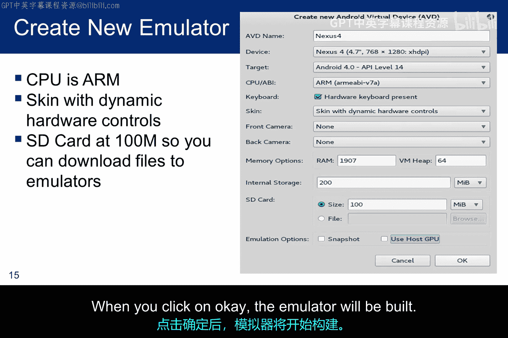

现在，您应该理解了智能手机渗透测试框架以及如何构建Android模拟器。下一讲我们将开始有趣的部分，学习如何使用SPF对目标发起攻击。

---

## 总结

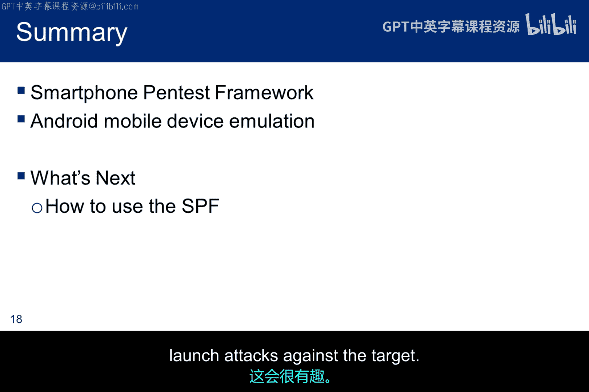

本节课中，我们一起学习了智能手机渗透测试框架的基本概念、架构和历史。我们了解了SPF如何通过受控设备、管理框架和目标设备之间的交互来发起攻击。此外，我们还详细介绍了如何搭建实验环境，包括在Kali上安装SPF以及使用Android SDK工具创建和启动必要的Android模拟器。这些知识为后续实际进行渗透测试攻击打下了基础。