# 025：使用SPF框架 📱

在本节课中，我们将学习如何使用智能手机渗透测试框架（SPF）来对Android模拟器进行渗透测试。我们将涵盖创建管理应用、将其部署到受控设备、连接回框架，并最终执行攻击的完整流程。

## 启动与初始化框架

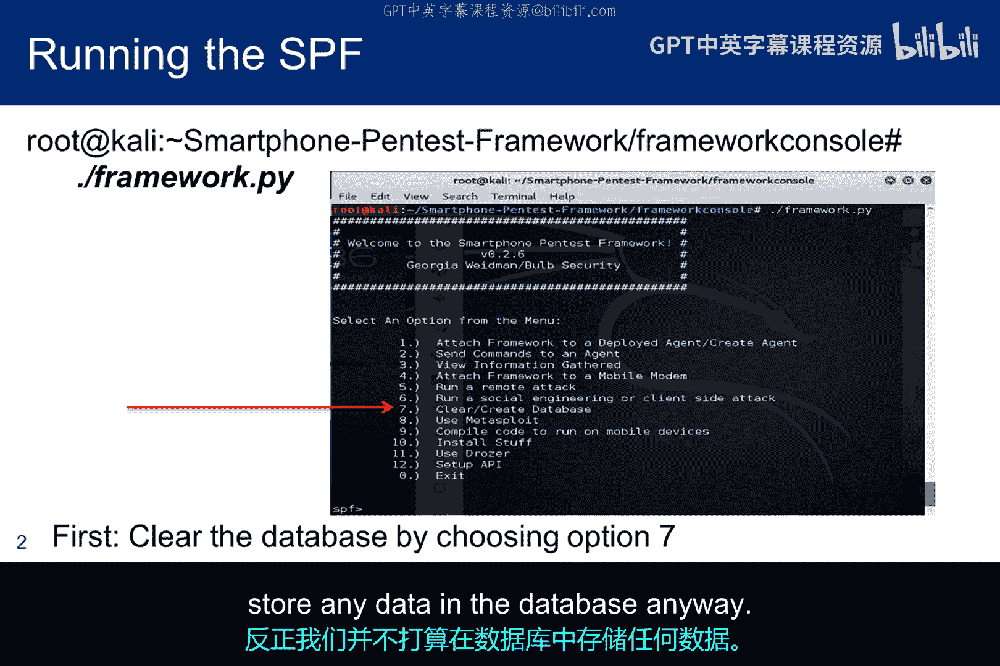

上一节我们介绍了SPF框架的基本概念，本节中我们来看看如何启动和初始化它。

启动框架的语法如下：
```bash
./spf
```
启动后，您将看到CLI菜单界面。

框架启动并运行后，第一件事是选择选项7来清除数据库。这会清除与之前使用相关的任何数据。由于我是从我的构建中启动SPF的，很可能存在一些与我环境和工具使用相关的残留数据。在测试过程中，尤其是在框架似乎行为异常时，您可能需要多次执行此操作。实际上，出于我们的目的，您可能应该在每次启动框架时都清除它，因为我们并不打算在数据库中存储任何数据。

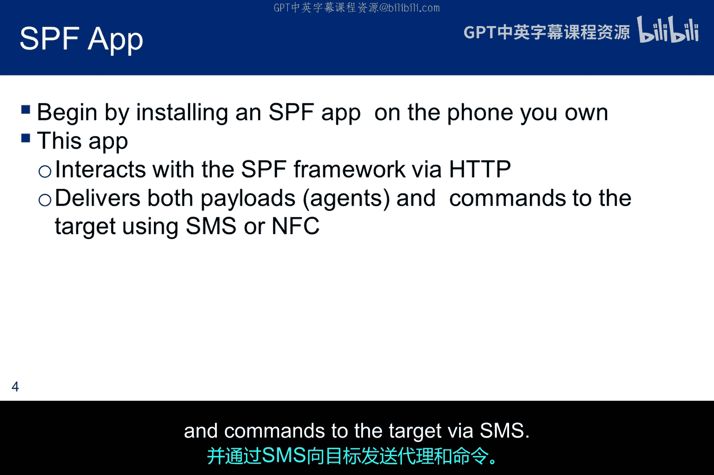


## 选择攻击渠道

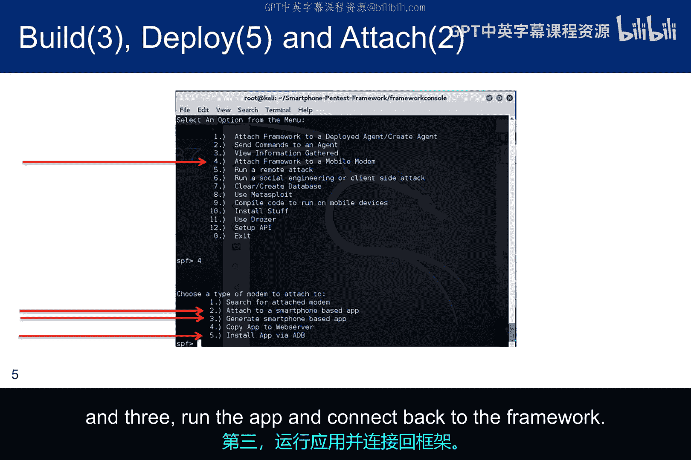

从管理设备到目标的攻击渠道可以是SMS或NFC。菜单会频繁要求您做出此选择。由于我们使用的是模拟器，我们的任何设备上都没有近场通信功能，因此您应始终选择SMS。如果您正在对真实的物理设备进行渗透测试，则可能希望选择NFC来传递有效载荷。

## 创建并部署管理应用

第一步是在框架中创建管理应用，并将其安装到充当受控设备的模拟器中。此应用将通过HTTP与框架交互，并通过SMS向目标传递代理和命令。


以下是获取管理应用到自有设备，然后使应用连接回框架的步骤。选择选项4“将框架连接到移动调制解调器”。显然，我们没有真实的调制解调器可连接。因此，不要被这个术语所迷惑。即使我们连接到的是模拟设备，步骤也是相同的：1. 在框架中构建应用。2. 通过ADB将应用部署到自有设备。3. 运行应用并连接回框架。


构建菜单项是选项3“生成基于智能手机的应用”。当您进行此选择时，系统将要求您提供有关目标的几个输入。不要在这里混淆。框架正在构建管理应用，但它询问的是目标，即管理应用将向其传递有效载荷的设备。它不是在询问将安装管理应用的受控设备。这意味着两个模拟器都需要正在运行。因此，您需要知道目标的电话号码。这也意味着，如果您重新启动系统或重新启动模拟器，并且目标的电话号码发生变化，您需要重新构建管理应用。控制码可以是任何七个字符，将用于向有效载荷进行身份验证。URL是框架上Web服务器的路径，当目标选择SMS中的链接时将与之交互。对于此目录条目，请输入正斜杠和您选择的目录名称。我使用`/bad`。此路径相对于安装SPF时配置文件中输入的Web服务器文档根目录。在我的情况下，完整路径将是`/var/www/html/bad`，尽管我只输入了`/bad`。如果您在回答此提示时忘记了斜杠，文件将位于错误的位置，一切将无法工作。因此，请注意您的操作。Web服务器的IP地址将由框架自动处理，因此不会询问您。回答所有提示后，应用应该被创建，您应该收到“构建成功”的响应。如果您没有收到构建成功的消息，请返回重试。不要继续，因为一切都不会工作。

我们刚刚构建的应用现在需要部署到受控设备，这是通过ADB使用菜单选项5“通过ADB安装应用”完成的。选择该选项后，框架将显示它检测到的设备。在这种情况下，由于两个模拟器都在网络上，SPF会同时看到它们。请确保选择充当受控设备的模拟器，而不是目标。当框架提示如何安装时，选择“安装框架Android应用（无NFC）”，因为模拟器没有NFC功能。应该返回成功消息。如果您没有收到该消息，请不要继续，因为使用SF的每一步都取决于前一步是否成功。

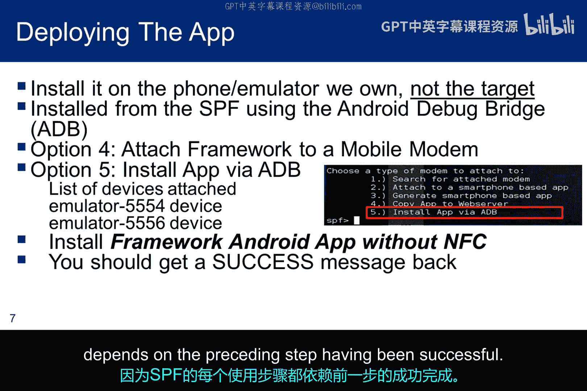


这是我的Nexus模拟器的屏幕截图，上面安装了名为“Frame Android app”的应用。

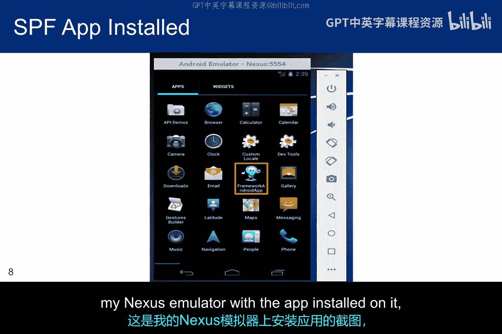


## 连接管理应用回框架

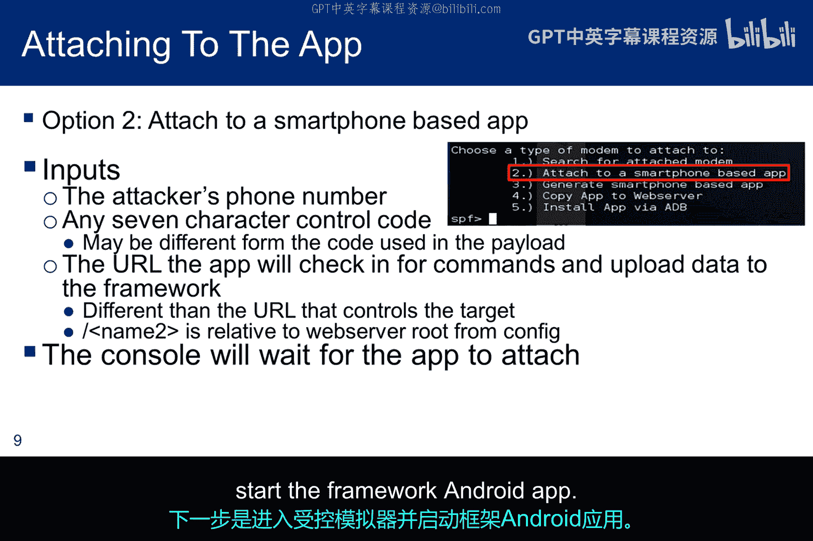

应用安装后，需要连接回框架，以便由框架管理和控制。框架通过菜单选项2“连接到基于智能手机的应用”启动此过程。选择选项2后，您将看到与构建应用时相同的提示。最大的区别是，现在的答案应代表受管设备，实际上是攻击者，而不是目标。回答每个提示后，框架进入监听模式，等待受控设备建立连接。因此，下一步是进入受控模拟器并启动框架Android应用。


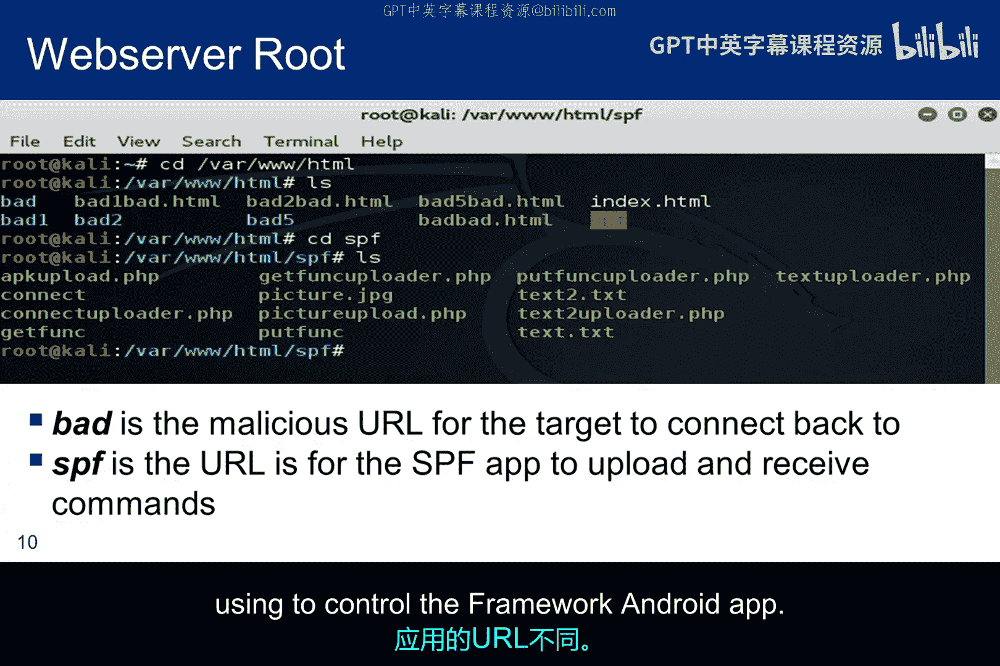

此屏幕截图仅演示了Kali的文档根目录用于SPF目录。用于目标连接回的恶意URL的目录，与框架用于控制框架Android应用的URL不同。


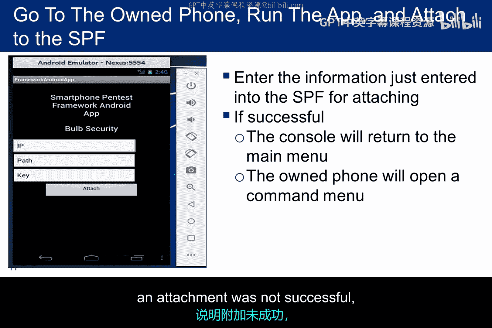

因此，Kali上的框架正在监听`/var/www/html/spf`。您需要进入模拟器，启动应用，并输入框架提示时刚刚输入的信息。输入信息后，点击“附加”，受控设备上的框架应用将连接回框架。如果附加成功，模拟器将为您提供一个命令菜单。如果您返回查看框架，您应该返回到主菜单。如果您没有获得这些指示，则附加不成功。您不应继续。

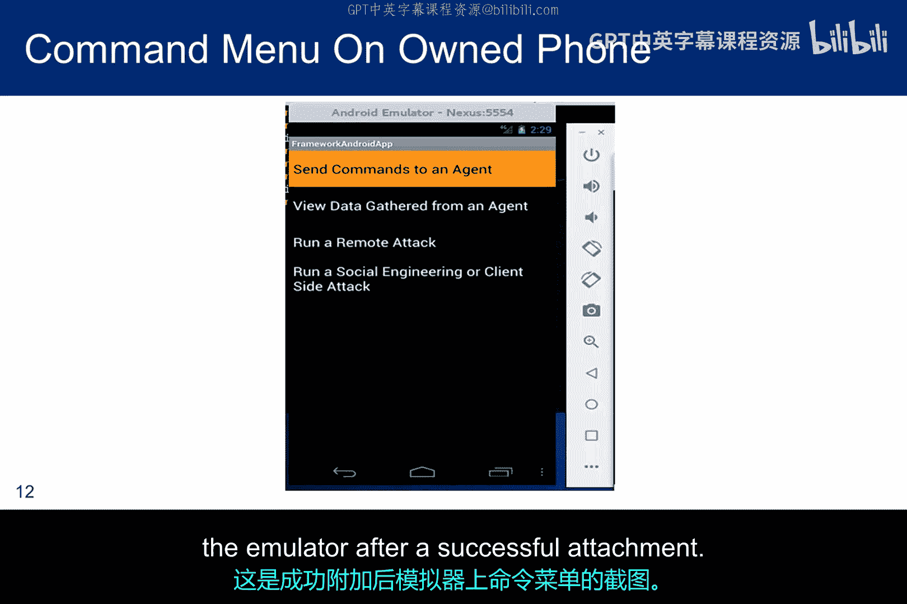


这是成功附加后模拟器上命令菜单的屏幕截图。


## 对目标模拟器发起攻击

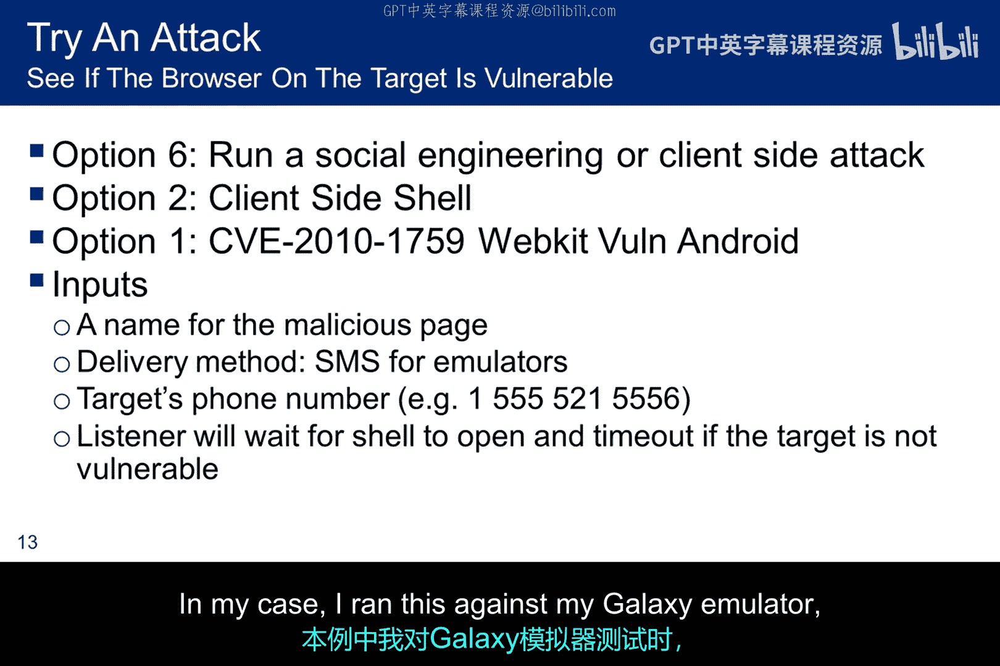

现在，让我们尝试对充当目标的模拟器发起攻击。如果附加成功，您应该位于主菜单，可以选择选项6“运行社会工程或客户端攻击”。然后选择选项2“客户端Shell”，再选择选项1“CVE-2010-1759 Webkit Vm Android”，系统将要求您回答几个提示。第一个提示是您想给恶意网页起的名称。您希望使用一个与SMS消息文本一致的链接，以诱使用户点击该链接。第二个提示是传递方法。再次强调，使用模拟器时，答案始终是SMS。第三个提示是目标电话号码，短信将发送到该号码。此时，Kali上的监听器正在等待Shell打开。但如果目标不易受攻击，监听器会超时并告知您目标不易受攻击。在我的案例中，我对我的Galaxy模拟器运行了此攻击，它不易受攻击。因此监听器超时了。

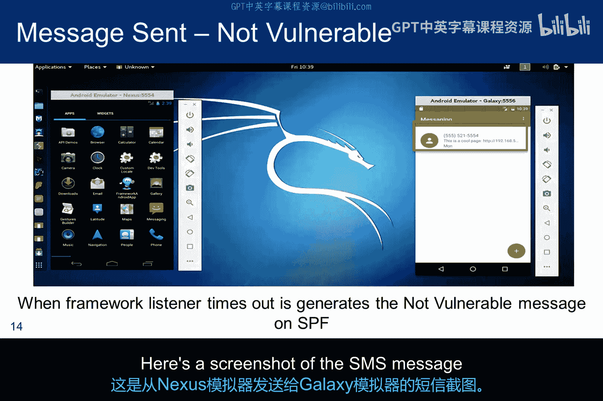


这是从我的Nexus模拟器发送到我的Galaxy模拟器的SMS消息的屏幕截图。监听器最终超时。请注意，框架将消息发送到了Nexus设备上的框架Android应用，但此时该设备仅充当中继。因此，Nexus上没有指示短信已发送。

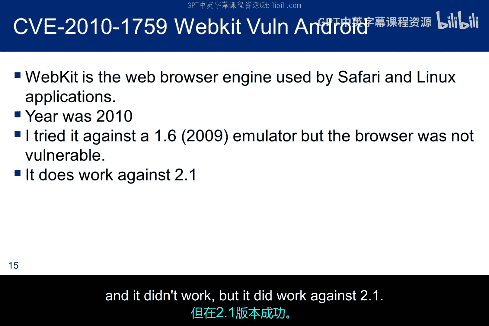


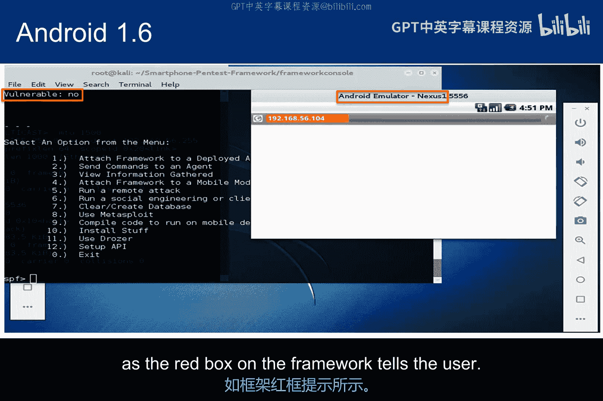

问题是，为什么漏洞利用没有成功？答案很简单。Galaxy上的操作系统不是该软件的易受攻击版本。CVE日期是2010年，但Galaxy使用的Android V7是在2016年发布的。如果我们反向搜索2009年可用的Android版本，看起来1.6、2.0、2.1是我们的最佳选择。我尝试对1.6进行漏洞利用，但没有成功，但对2.1成功了。


此屏幕截图显示了对Nexus 1的攻击，这是谷歌第一款基于Donut或Android V1.6的Nexus智能手机。但此版本不易受攻击，正如框架上的红框告诉用户的那样。

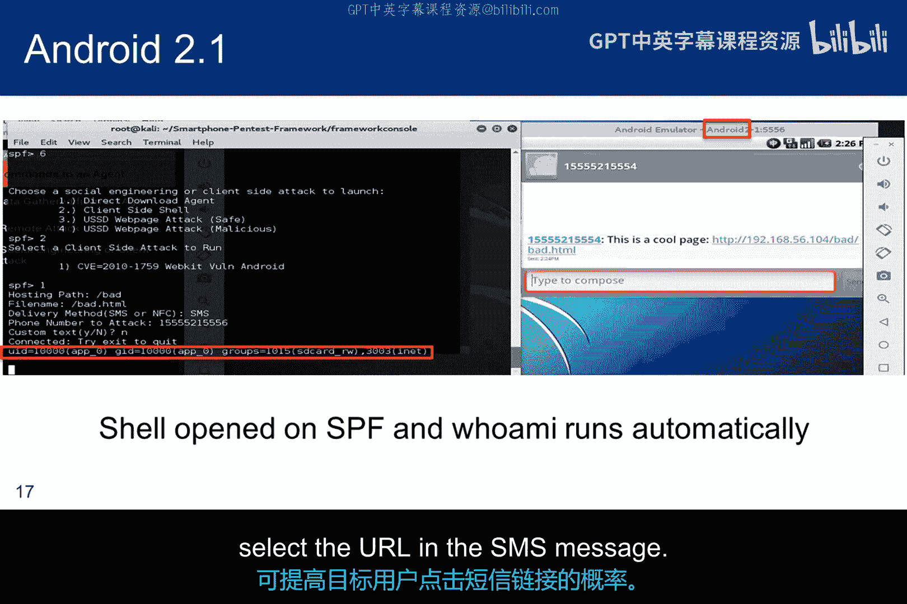


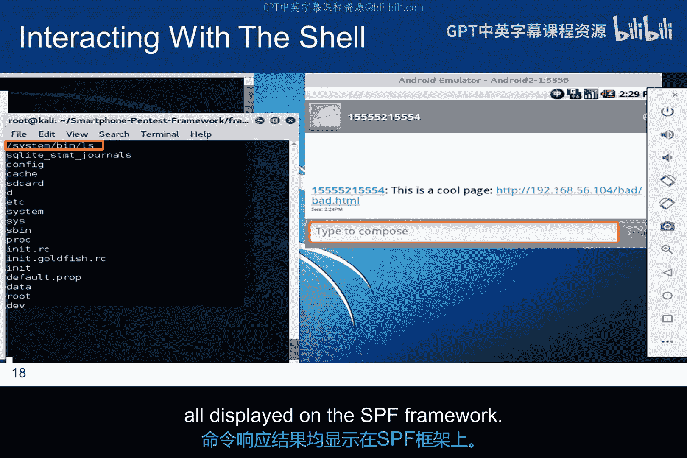

此屏幕截图显示了对Android版本2.1（称为Eclair）的攻击，并且此攻击成功了。它显示了发送到2.1模拟器的SMS消息。当我点击链接时，框架上打开了一个Shell，并自动运行了`whoami`命令。UID是10000，因此我们没有root权限，但我们确实获得了移动设备的Shell。另请注意，在SMS消息中，我没有提供自定义文本，并且我选择了一个通常会降低信任度的路径名。这些对于实验来说不是关键问题。但在现实世界中，通过更改这两者，我可能会说服目标上的用户选择SMS消息中的URL。


此屏幕截图显示了在Android模拟器上运行的Shell中执行`ls`命令，以及所有显示的响应都返回到SPF框架上。


## 理解并执行USSD攻击

在讨论USSD攻击之前，我们需要了解什么是USSD。它基本上是一组由服务提供商支持的功能代码，可以从设备发送到提供商的服务器，以请求服务或信息。例如，一个功能代码可能用于更改电话配置。另一个可能请求付款信息或请求回拨。USSD通常由服务提供商定制，因此没有单一的功能列表可用。USSD消息最多可达182个字符，它们通常通过即时建立的连接发送。一旦建立，连接保持打开状态，可用于数据交换。在手机上的工作方式是：打开拨号器，输入USSD代码，然后点击拨号。代码被发送，服务提供商解析USSD内容并提供请求的服务。USSD消息始终以星号`*`开头并以井号`#`结尾。因此，在消息内部相对容易识别和解析，其中包含由额外星号分隔的整数组，单个数字字符串代表发送给服务提供商的命令或数据。

以下是一些示例USSD代码。首先，请注意Verizon不遵循USSD标准，这告诉我们代码是由提供商定制的，我们在发起USSD攻击之前需要进行一些研究。然而，请注意，通用代码确实存在，并且每个提供商应以相同的方式使用它们。`*#06#`返回IMEI号码，这是一个可以通过发送相关USSD消息收集的有用信息。`*2767*3855#`是另一个通用消息，但这很容易被恶意使用，导致设备恢复出厂设置。

这显示了对电话号码为5556的Android 1.6发起USSD攻击的步骤。其工作方式是USSD代码会自动在设备的拨号器中打开。由于这些特定的USSD代码在本地处理，它们不需要发送到服务提供商。在拨号器中打开它们就足够了，设备将解析并响应代码。这意味着需要非常小心地发起USSD攻击，因为在现实世界中，根据所选的代码，它可能会损害设备。在我们的虚拟世界中，通过简单地重启或最坏情况下重建模拟器来恢复要容易一些。对于安全攻击，USSD代码只是`*#06#`，它请求IMEI号码。但请注意，由于我们的模拟器没有真实的基带处理器，模拟器实际上不响应USSD代码，但我们可以看到它已加载到拨号器中。

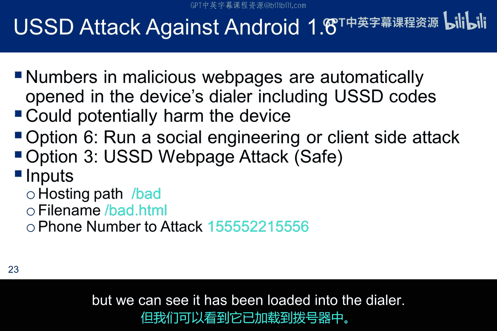

此屏幕显示我发起了三次不同的攻击，因为我尝试了SF功能。每次我都选择了不同的恶意路径。您可以看到，当SMS消息到达并且我选择恶意链接时，USSD代码已从网页发送到拨号器。

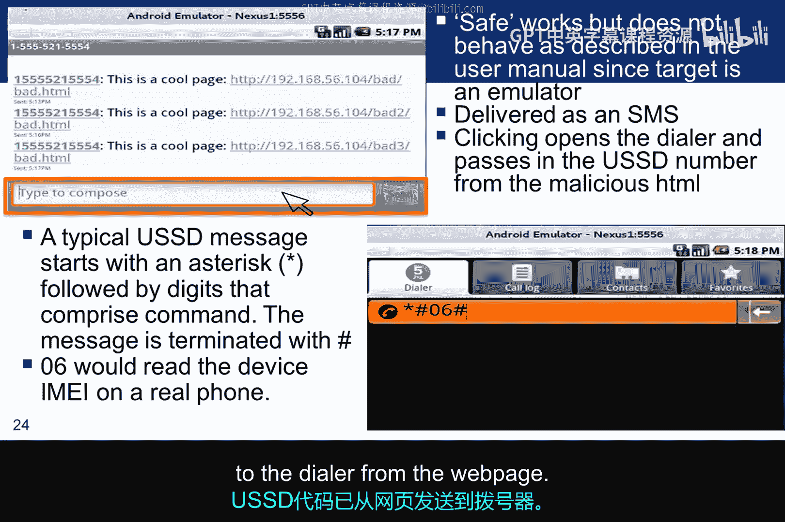


## 总结


本节课中我们一起学习了如何使用智能手机渗透测试框架。我们部署了管理应用，将控制应用附加回框架，并对目标发起了几次攻击。我们还讨论了I/O越狱和移动设备的威胁空间。接下来，我们将学习Wi-Fi漏洞利用。

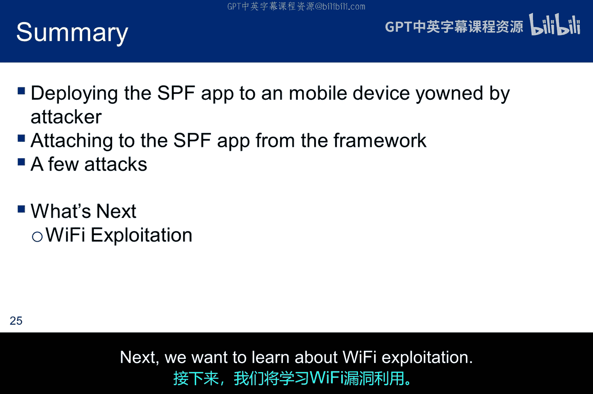

