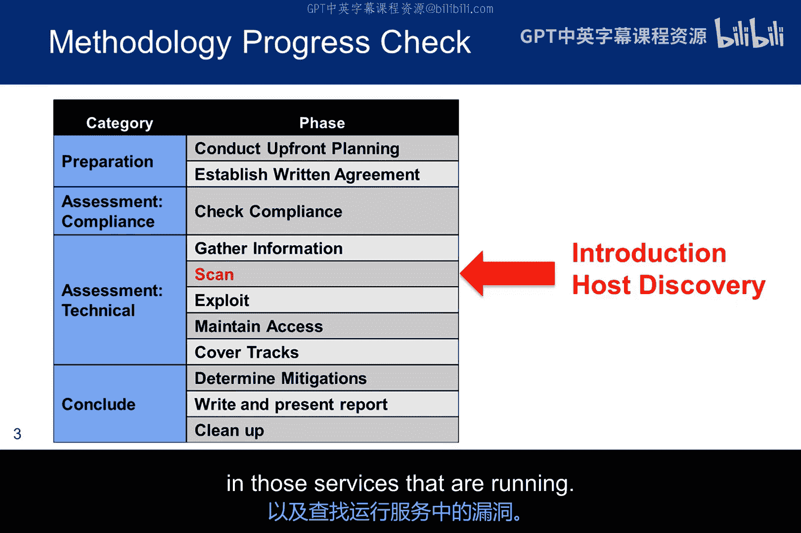
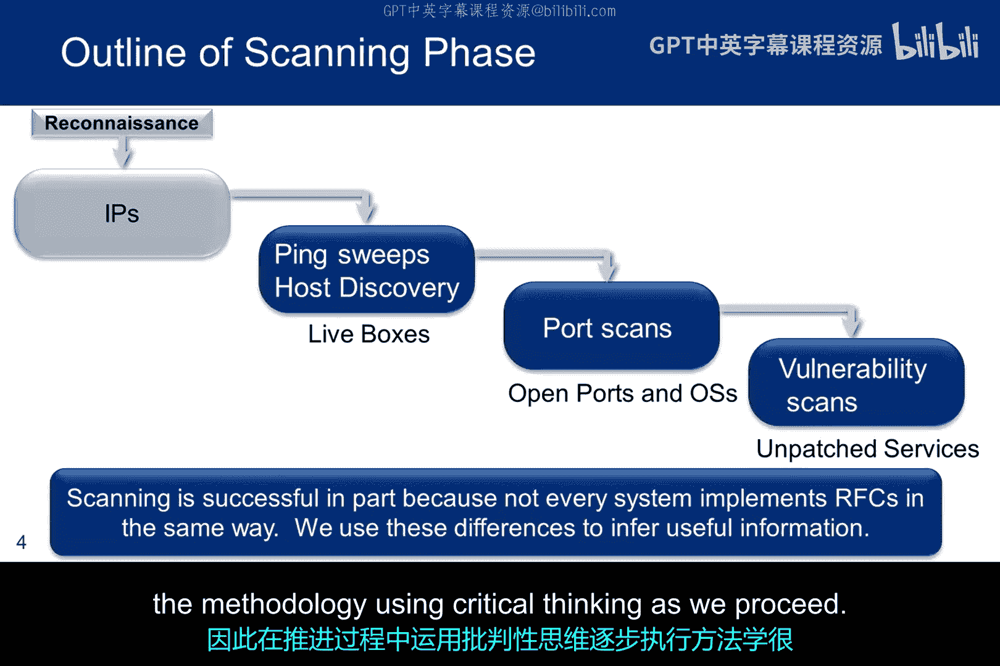
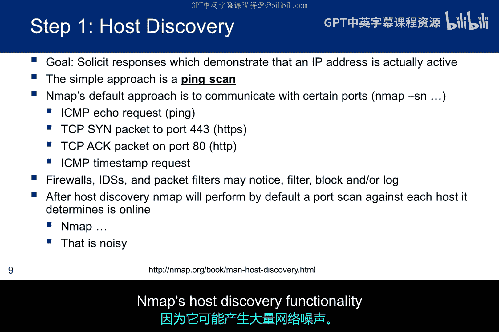
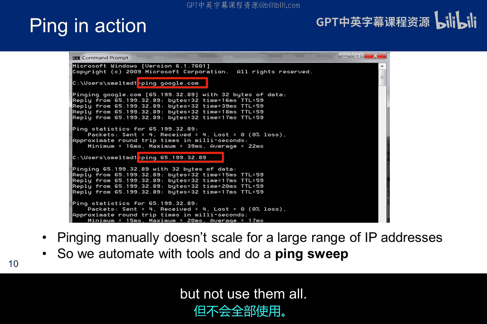
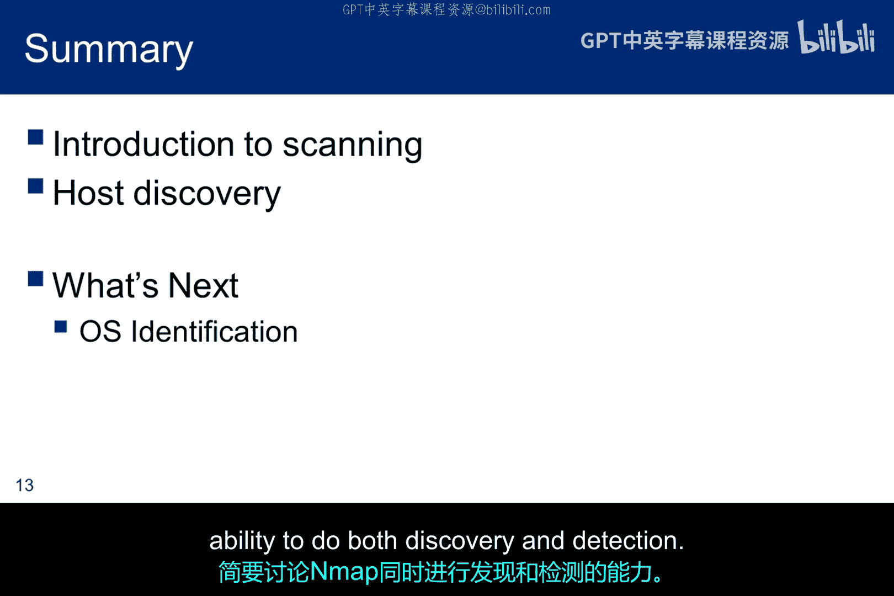

# 026：主机发现扫描

在本节课中，我们将学习在网络侦察阶段完成后，如何对获取的IP地址和网段进行扫描。扫描过程包含多个组成部分，我们将从介绍方法论开始，并首先花时间探讨主机发现。主机发现旨在确定目标局域网段中是否有计算机处于开机运行状态。本讲后续部分将涵盖扫描的其他方面，包括尝试确定操作系统、识别开放的端口与服务，以及在这些运行的服务中寻找漏洞。

## 扫描方法论概述

上一节我们介绍了扫描的整体目标。本节中，我们来看看扫描方法论的递进过程。

我们首先进行侦察并收集IP地址。现在，我们希望采用一种逐步深入、获取越来越多细节的方法进行扫描。

*   **第一阶段**：尝试识别网络中的活跃主机。技术包括Ping扫描和主机发现扫描。
*   **第二阶段**：尝试识别那些已被确定为正在运行的计算机的**操作系统**。
*   **第三阶段**：查看哪些端口是开放并处于监听状态的，并尝试识别运行在这些端口上的**服务**。
*   **第四阶段**：对我们看到的正在运行的服务版本进行**漏洞扫描**。

扫描工具的一个基本思想是利用不同厂商对标准的实现存在细微差异这一事实。这些差异可以被检测到，从而用于判断软件版本。但需要注意的是，由于多种原因，扫描器并非完美无缺。因此，在推进过程中，运用批判性思维逐步执行方法论至关重要。

## 网络建模与映射

理解了方法论后，我们需要考虑在映射网络时可能遇到的情况。本幻灯片展示的思想是，我们希望为网络建立模型。在建模时，我们的映射中需要考虑四种可能性。

1.  我们看到不在渗透测试范围内的计算机。
2.  我们认为属于IP地址块但似乎处于离线状态的计算机。
3.  我们被允许且能够扫描的、**存在漏洞**的计算机。
4.  我们被允许且能够扫描的、**没有漏洞**的计算机。

在这四种情况中，前两种可以从进一步研究中排除。请记住，除了工作站和服务器，我们对防火墙、路由器和其他网络组件也感兴趣。通常，我们位于防火墙外部，映射内部网络的成功率通常低于映射DMZ（非军事区）中的内容。

在进行映射时，`traceroute`和`tracert`很容易被防火墙击败。这是因为`traceroute`传输ICMP回显请求数据包，而大多数环境会在边界阻止此类数据包。如果使用`-T`开关，`traceroute`也会传输TCP SYN数据包，但默认情况下，它针对33000以上的UDP端口，同样，大多数防火墙默认会阻止此行为，因此该工具很容易失效。

但是，如果渗透测试人员针对防火墙上的一个开放端口呢？换句话说，如果他们向你的Web服务器传输TCP 80数据包，但以类似于`traceroute`的方式改变TTL值呢？这正是`TCP traceroute`工具的工作原理。像这样的工具有时可以帮助直接穿透防火墙进行映射。

以下是三个命令的语法示例。你应该在你的道德黑客环境中测试`traceroute`和`TCP traceroute`，以观察它们如何与防火墙交互。

*   `traceroute <目标IP或域名>`
*   `traceroute -T <目标IP或域名>` （使用TCP SYN）
*   `tcptraceroute <目标IP或域名> <端口号>`

## 常用扫描工具介绍

在开始具体扫描步骤前，我们先熟悉一些常用工具。Nmap是最著名、最常用的映射工具。它是免费的，并且有在线手册提供额外使用指导，帮助你了解各种工具选项。其他三种工具（如Nessus, OpenVAS, Qualys）并非免费。专业渗透测试人员会购买这些工具，但本课程中我们不会使用它们，尽管你可以有限度地免费试用。

下面的图表为我们的扫描方法论图示添加了文字描述。接下来，我们将具体讨论每一个步骤。

## 主机发现：Ping与Ping扫描

现在，让我们进入扫描的第一个具体阶段：主机发现。最简单的工具之一是Ping。只需尝试使用ICMP回显请求来ping IP地址。我们也可以尝试使用原本设计用于协调时间的ICMP时间戳ping。

ICMP是互联网控制报文协议，它与IP协议处于同一层，因此有自己独特的报文格式。它们被封装在IP数据包中，但不像典型的IP数据包那样被处理。ICMP有许多不同的消息类型，其中许多已被弃用。

我们也可以发送设置了特定标志的TCP数据包来实现略有不同的目标。当然，大多数防火墙和入侵检测系统（IDS）会检测并丢弃这些扫描。因此，我们可能需要更复杂的技术来实际发现主机。一个被阻止的查询并不一定意味着主机没有存活。

我们也可以使用Nmap进行主机发现。我将在讨论操作系统指纹识别时再讨论这一点。然而，使用Nmap的主机发现功能时需要小心，因为它可能产生大量“噪音”。

这是一个Ping命令的截图。你可以通过域名或IP地址进行ping。当你通过域名ping时，它会使用DNS解析器提供的IP地址。然而，请注意，Ping一次只能处理一个IP地址，这对于大型网络来说不是一个可扩展的工具。

## Ping扫描与FPing工具

针对单一主机的Ping功能有限，对于需要扫描整个网段的情况，我们需要更高效的工具。公司可能拥有整个IP地址块，但我们希望遍历它们以查看哪些节点正在运行。这被称为Ping扫描。很多时候，组织会被分配地址块，但不会全部使用。我们需要找到他们正在使用的那些。

Ping本身不便于进行Ping扫描，但有很多工具可以做到。在大多数Linux发行版上最容易找到的工具是`FPing`，它允许你指定起始和结束的IP地址。在这里你可以看到，我在外部局域网段上运行了三台虚拟机，它们都被识别为活跃主机，并且它还识别出了一个VirtualBox适配器。

`FPing`也接受CIDR表示法，这是一种IP地址及其关联路由前缀的紧凑表示法。该表示法由IP地址和前缀大小构成。前缀大小等于路由掩码中前导1位的数量。IP地址根据IPv4或IPv6的标准表示，后跟一个斜杠字符和以十进制数表示的前缀大小。

例如：
*   `192.168.1.0/24` 等价于 `192.168.1.0` 加上子网掩码 `255.255.255.0`。
*   `192.168.100.0/22` 表示从 `192.168.100.0` 到 `192.168.103.255` 的1024个地址。

## 总结与下节预告

本节课中，我们一起学习了网络扫描的基础方法论，并重点探讨了主机发现阶段。我们介绍了如何使用Ping进行单一主机探测，以及如何使用`FPing`等工具对整个IP地址段进行高效的Ping扫描。我们还了解了网络建模时需要考虑的四种主机状态，以及`traceroute`和`TCP traceroute`在穿透防火墙映射路径时的不同表现。

我已经讨论了主机发现，但主要集中在Ping上，并未深入Nmap的语法。接下来，我将讨论操作系统识别，同时简要介绍Nmap同时进行发现和检测的能力。