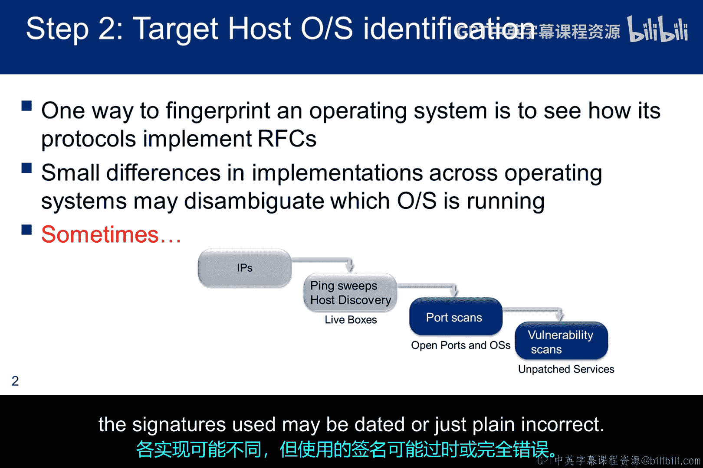
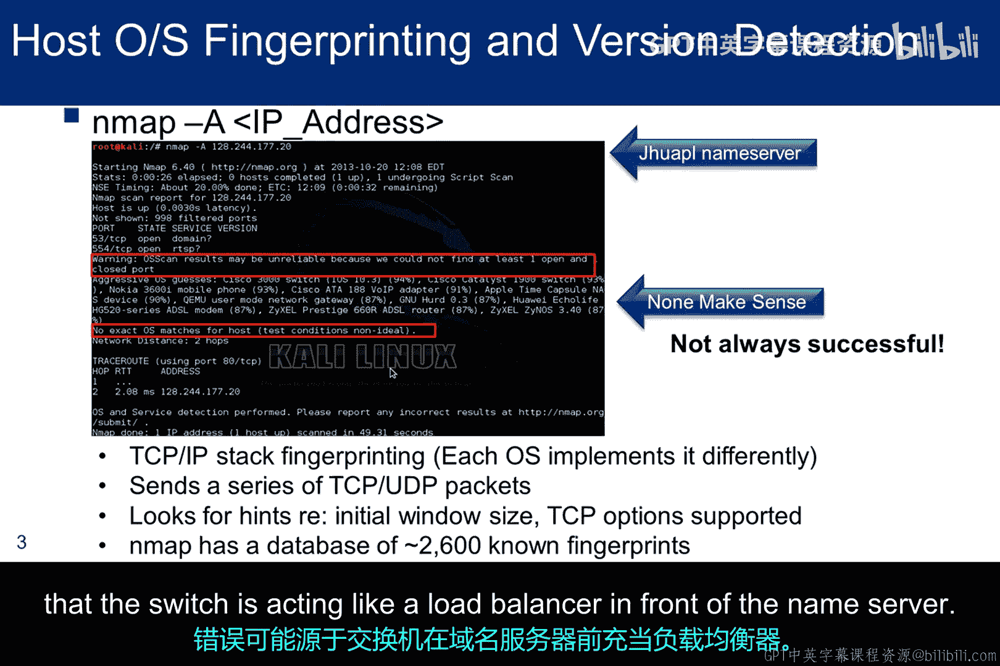
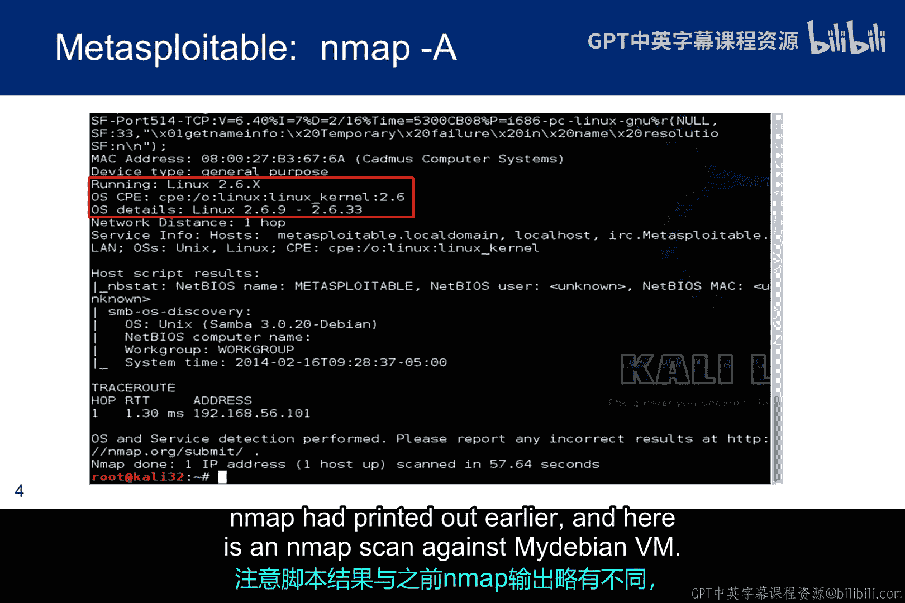
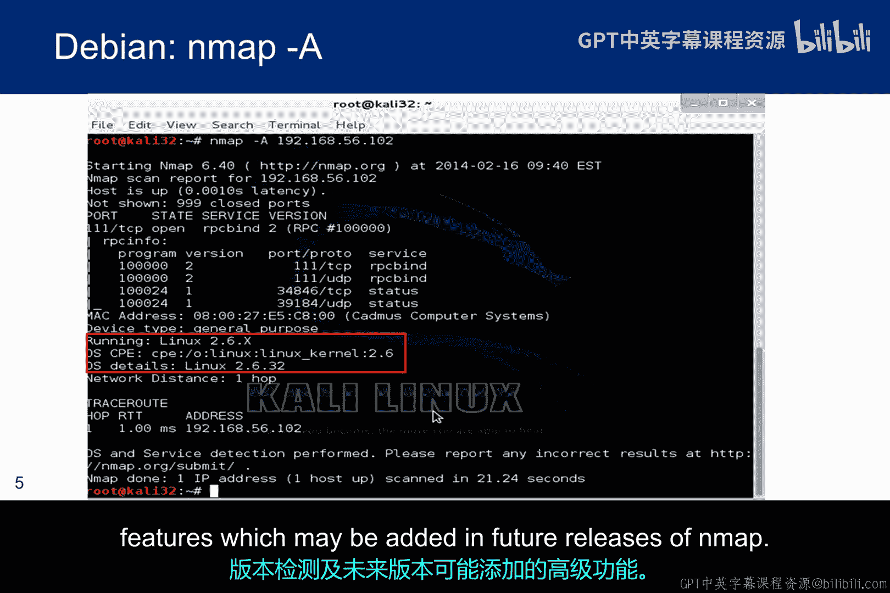
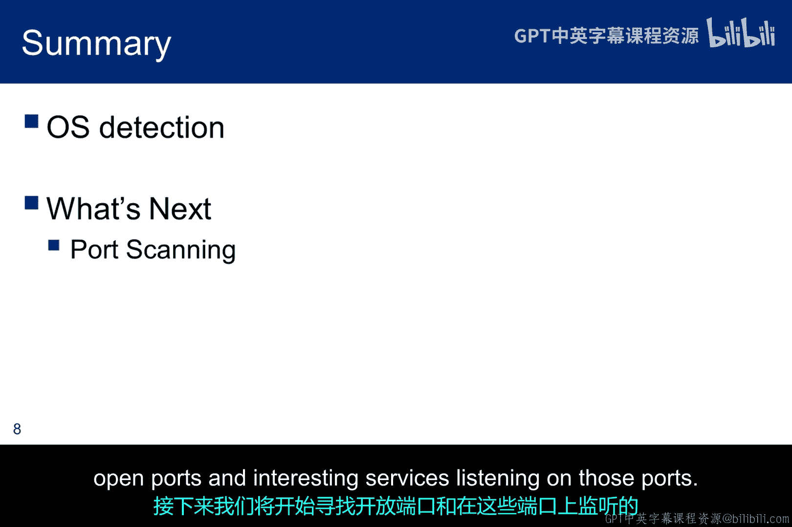

# 027：操作系统识别 🔍

在本节课中，我们将学习操作系统识别技术。这是道德黑客信息收集阶段的关键步骤，能帮助攻击者了解目标系统的类型和版本，从而寻找潜在的漏洞。然而，识别机制并非完美无缺，我们将探讨其原理、常用工具以及局限性。

## 概述

操作系统识别能为道德黑客提供有价值的信息。但正如本模块将要学习的，检测机制并不完美。不同系统对RFC标准的实现差异有时能提供识别方法，但这并非总是有效。每种实现可能不同，而使用的识别特征可能已经过时或完全错误。

## Nmap工具与操作系统识别

上一节我们提到了识别机制的原理，本节中我们来看看最著名的识别工具之一：Nmap。Nmap最知名的功能之一就是利用TCP/IP协议栈指纹进行远程操作系统识别。

以下是使用Nmap尝试识别一台JA2 APL名称服务器的截图示例。

Nmap会向远程主机发送一系列TCP和UDP数据包，并在执行数十项测试后检查响应中的几乎每一位信息。这些测试包括：
*   TCP初始序列号采样
*   支持的TCP选项
*   TCP时序细节
*   IP ID采样
*   初始窗口大小检查

之后，Nmap将结果与其包含超过2600个已知操作系统指纹的`NmapOSDb`数据库进行比较。如果找到匹配项，则打印出操作系统详细信息。每个指纹都包含操作系统的自由格式文本描述和一个分类，该分类提供供应商名称、底层操作系统、操作系统世代或版本以及设备类型。

截图显示了较高的置信度，但在此案例中，将名称服务器的操作系统识别为思科交换机是不正确的。错误可能由多种原因引起，但可能与交换机在名称服务器前端充当负载均衡器有关。

## Nmap扫描选项详解

对于Nmap，`-sT`和`-sO`选项都能进行主机识别，但`-sT`比`-sO`更稳健。`-sO`进行主机发现和操作系统指纹识别，它比简单的`ping`更复杂，尽管它也是从`ping`开始的。实际上，如果存在防火墙吸收了`ping`请求，Nmap会停止并建议您使用`-Pn`选项关闭`ping`探测。

`-sA`选项则同时执行主机操作系统指纹识别和版本检测。以下截图显示了对Metasploitable（一个存在漏洞的Linux版本）的扫描。

Metasploitable有时被称为Ubuntu构建版。但由于Ubuntu是从Debian分叉出来的，因此扫描器通过SMB协议运行的Nmap脚本将操作系统识别为Debian。请注意，脚本生成的结果与Nmap之前打印出的结果略有不同。

这是针对我的Debian虚拟机的Nmap扫描截图。本次扫描和之前的扫描都使用了`-sA`选项。

以下是Nmap中与检测相关的主要选项：
*   `-sV`：启用版本检测。
*   `-O`：启用操作系统指纹识别。
*   `-A`：启用操作系统指纹识别和版本检测，以及未来Nmap版本中可能添加的任何其他高级功能。

## Nmap识别机制深度解析

现在我们已经了解了基本选项，本节中我们来深入看看Nmap的识别机制。这是Nmap在线手册第8章关于操作系统检测的截图。

我将其包含在此，是为了让你了解在线手册中的详细内容，同时也为了展示操作系统检测功能的健壮性。它列出了Nmap在尝试识别操作系统时所经历的步骤。你可以看到，除非启动扫描器并观察外发流量，否则你永远不会看到有许多功能在后台运行。

Nmap的识别依赖于两个主要数据库：
1.  `nmap-services`数据库：包含超过2200种知名服务的指纹。
2.  `nmap-service-probes`数据库：包含用于查询各种服务的探针以及匹配表达式，以支持对响应的识别和解析。

Nmap使用指纹信息尝试确定：
*   **服务协议**：例如`FTP`、`SSH`、`Telnet`、`HTTP`。
*   **应用程序名称**：例如`ISC BIND`、`Apache HTTPD`、`Solaris Telnetd`。
*   **版本号**
*   **主机名**
*   **设备类型**：例如打印机或路由器。
*   **操作系统系列**：例如`Windows`或`Linux`。

## 总结

本节课中我们一起学习了操作系统识别技术。我们认识到，虽然通过协议栈差异进行识别是可能的，但机制并不完美，可能存在误报。我们重点介绍了Nmap这一强大工具，它通过发送特定探测包并与庞大的指纹数据库比对来进行识别。常用的扫描选项包括`-O`（OS指纹）、`-sV`（版本检测）和`-A`（综合检测）。我们只是浅尝辄止地了解了操作系统检测，建议查阅Nmap手册的操作系统检测章节以深入了解此主题。

既然我们已经知道目标IP正在运行，并且可能已经识别了操作系统，接下来我们将开始寻找开放的端口以及在这些端口上监听的有趣服务。