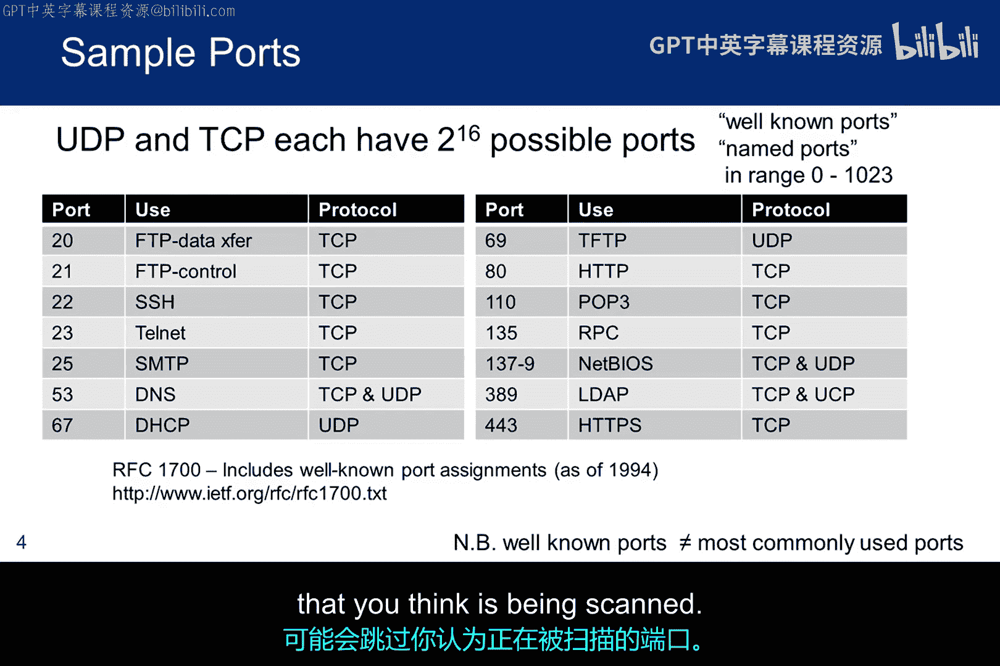
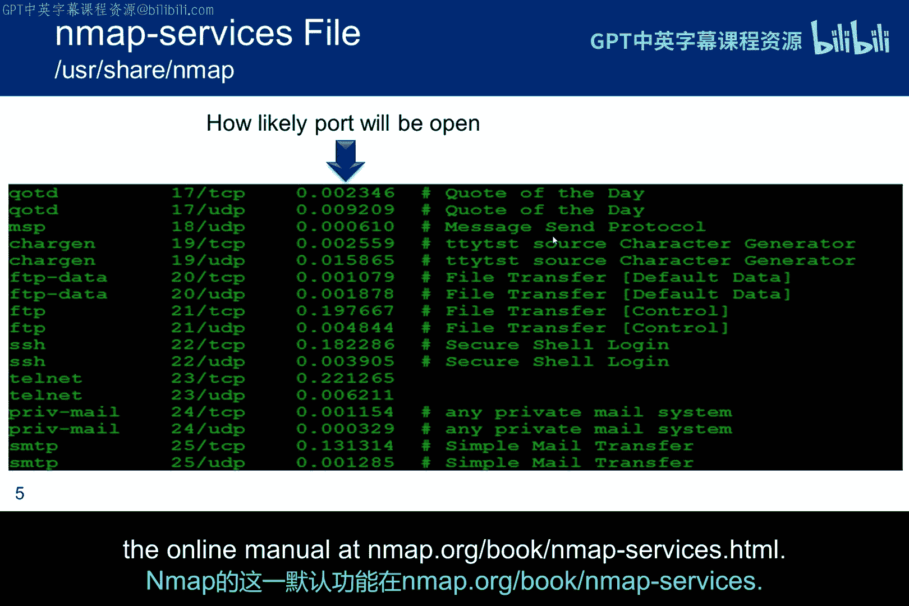
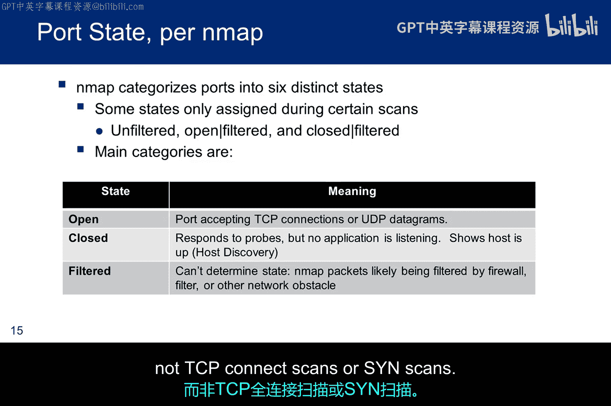
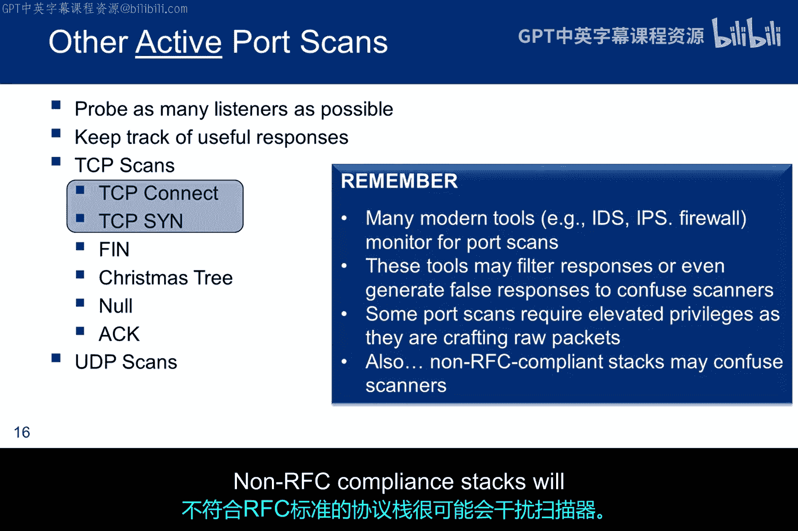
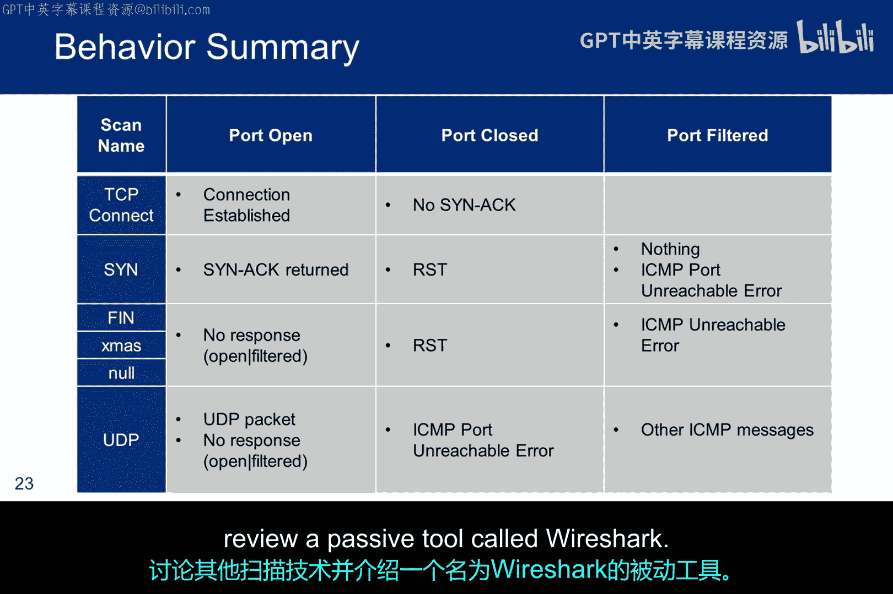

# 028：端口扫描第1部分 🔍

在本节课中，我们将要学习端口扫描的核心概念。端口扫描是确定哪些端口开放并运行着服务的技术。我们将探讨其基本原理、常用工具（特别是Nmap）以及各种扫描技术，包括TCP连接扫描、SYN扫描和其他特殊扫描类型。理解这些技术是后续进行漏洞评估和渗透测试的基础。

## 什么是端口扫描？🚪

端口扫描是确定哪些端口开放并运行着服务的艺术。

当计算机没有任何保护机制时，执行此操作很容易。但当其前方有防火墙等设备时，任务就变得复杂了。

我们已经确定了计算机正在运行的事实。我们可以向其发送数据包，并且可能已经确定了其操作系统。但当我们开始查看单个端口时，我们发现我们仍处于道德黑客方法论的扫描阶段。



这是对端口是什么的另一种看法。我们有一个地址（IP地址），并且可能有多种方式进入房子（系统），但我们不知道哪些入口点是可访问或未上锁的。而且可以肯定的是，我们不知道它们后面是什么。所以思路是，我们将去推推门和窗户，看看会发生什么。

## Nmap的默认端口扫描行为 ⚙️

当用户未指定要扫描的端口时，Nmap会查看最常用的1000个端口。这加快了Nmap扫描速度，但可能会错过管理员移动的端口。

下表显示了RFC 1700中定义的一些最著名的端口，其中一些我们在防火墙上开放过。然而，前1024个著名端口与Nmap扫描的最常用的1000个端口并不相同。理解这个概念很重要。如果你不指定特定的端口或端口范围，你可能会跳过你认为正在被扫描的端口。




Nmap在`nmap-services`文件中维护了一个最常用端口的列表。通常，除非用户另有指定，Nmap在按频率排序后，会扫描此文件中的前1000个条目。这种排序针对每种扫描协议进行，换句话说，UDP和TCP扫描是彼此独立处理的。

命令行开关 `-F`（代表快速）将扫描限制在列表中的前100个端口，而不是前1000个，以加快扫描速度。

如果端口频率信息不可用（可能是由于使用了自定义的Nmap服务文件），Nmap会扫描所有命名端口加上0到1023号端口。大多数Linux发行版在 `/etc/services` 定义命名端口，Windows则在 `\system32\drivers\etc\services`。这些通常与1024个著名端口有交集，但命名端口远不止1024个。Nmap的这一默认功能在在线手册 `nmap.org/book/nmap-services.html` 中有讨论。


## 发现开放端口的技术 🛠️

以下是四种发现开放端口的技术。

主动端口扫描和被动端口扫描是显而易见的，但你也可以尝试从系统管理员和渗透测试文档中获取信息。渗透网络配置信息通常是攻击者在实际发起攻击前数月尝试的第一步。

此处显示的YouTube链接来自Schmookcon会议。它包括一个演示，展示了如何扫描整个互联网上端口5900的VNC服务器。虚拟网络计算（VNC）允许您在世界任何地方访问和控制您的桌面应用程序。有趣的是，他们构建了虚拟基础设施来实际扫描整个互联网，但排除了某些政府组织和请求不被扫描的实体。

## 端口扫描工具概览 🧰

以下是几个端口扫描工具，当然还有很多其他工具。

但我们将专注于使用Nmap作为我们的主动扫描器，因为它易于获取、常用且持续改进。Nmap已经存在很长时间，但仍然经常被系统管理员用来扫描网络。他们也可能使用其他工具，但Nmap始终在工具箱中。

我们已经简要讨论了Nmap的功能，包括主机发现和操作系统检测。现在我们将专注于端口状态以及在这些端口上运行的服务。但首先，关于主机发现的一个说明。Nmap从ICMP ping开始，然后转向特定端口上的其他数据包类型，最后再回到ICMP时间戳数据包（即ping）。另一个重点是Nmap有一个脚本引擎（NSE），这个工具提供了许多超越经典Nmap的增强功能，包括运行一些漏洞脚本的能力，并且不断有新的脚本加入。事实上，你可以提交脚本以纳入该工具。关于这一点稍后会详细说明。但关键是，Nmap正在获得更多功能，并正在演变成一个远不止用于识别开放端口的简单工具。

## 理解TCP连接与扫描类型 🤝

要理解最常见的Nmap扫描类型，我们需要理解TCP连接协议。如果TCP连接对你来说有点神秘，这张图只是将这个想法放入了电话呼叫的常见情境中。

下图显示了TCP连接序列，通常称为三次握手。

```
发起方发送一个SYN包，收到一个SYN-ACK包，然后返回一个ACK。
此时，TCP流量可以在相关方之间交换。
```

更具体地说：
*   对于SYN包：客户端向服务器发送SYN以执行主动打开。客户端将段序列号设置为随机值A。
*   对于SYN-ACK包：作为响应，服务器回复一个SYN-ACK。确认号被设置为接收到的序列号加一（即A+1），服务器为该数据包选择的序列号是另一个随机数B。
*   最后，客户端向服务器发送一个ACK。序列号被设置为接收到的确认值（A+1），确认号被设置为接收到的序列号加一（B+1）。

请注意，要建立连接，发起者必须指定要连接哪个端口。

当人们谈论SYN包和ACK包时，他们指的是设置了相关标志位的数据包。标志位可以有很多种设置方式，但出于扫描目的，我们最感兴趣的是用红色高亮显示的三个：
*   **ACK**：表示确认字段有效。客户端发送初始SYN包之后的所有数据包都应设置此标志。
*   **RST（复位）**：告诉接收方重置连接。
*   **SYN**：表示接收方应同步序列号。只有从每一端发送的第一个数据包应设置此标志。

其他一些标志的含义会基于此标志改变，有些仅在设置时有效，有些则在清除时有效。

## 两种主要的Nmap扫描类型 🔬

接下来，我们想谈谈两种最常用的Nmap扫描：TCP连接扫描和SYN扫描。

对于TCP连接扫描，Nmap完成整个三次握手，然后发送一个RST来优雅地拆除连接。

另一方面，SYN扫描在连接建立之前就停止并发送一个RST。因此，它有时被称为半开放扫描。

两者之间的一个主要区别是：SYN扫描不关心对初始SYN的响应是什么，无论如何它都会发送一个RST。而TCP连接扫描需要一个SYN-ACK来建立连接。



其他重要属性如下表所示：
*   **TCP连接扫描**更优雅，不应使目标崩溃，且不需要root权限。
*   **SYN扫描**（当您未指定类型时，是Nmap的默认扫描）更快且更隐蔽，但通常确实需要root权限。

当您在系统上获得低级立足点并希望在横向移动之前扫描网络上的远程设备时，权限问题至关重要。没有权限提升，SYN扫描可能无法使用。

对于半开放扫描：
*   SYN-ACK响应表示端口正在监听。
*   RST响应表示端口未监听。
*   但是，如果收到SYN-ACK，您会立即发送一个RST来拆除连接。这种扫描技术的一个优点是，记录它的站点会更少。

此屏幕截图显示了一个TCP连接扫描，尝试扫描给定IP地址上的所有端口。您可以指定一个IP地址、一个IP地址块，或者如果IP地址不连续，您可以指定一个包含要扫描的IP地址的文件。如前所述，如果您不指定端口，Nmap会扫描该协议最常用的端口。



## 端口状态推断 📊

在此表中，我们看到Nmap根据对扫描数据包的响应做出的常见推断。我们希望识别开放端口和可能的被过滤端口。由于“被过滤”并不总是提供明确信息，开放端口很可能有服务在其上运行，我们可以探索这些服务中的漏洞。其他三种状态是“未过滤”、“开放|被过滤”和“关闭|被过滤”，我们稍后将讨论。它们代表特定扫描类型的结果，而不是TCP连接扫描或SYN扫描的结果。


## 其他TCP扫描类型 🎄

我们已经讨论了TCP连接和TCP SYN扫描，但还有其他几种扫描类型。

圣诞树扫描得名于设置了多个标志位，就像圣诞树被点亮一样。许多现代保护机制可能会过滤响应，甚至生成虚假响应来迷惑扫描器。正如我们讨论SYN扫描时提到的，有些扫描需要提升权限才能构造原始数据包。如果您在系统上只有低权限立足点，这将构成问题。当然，这些推断是基于RFC实现中的差异，因此不符合RFC的协议栈很可能会迷惑扫描器。

此表显示了每种非标准扫描类型设置了哪些位。


发送非标准初始数据包（即不是SYN包）的想法是，标志位的设置是意料之外的，数据包可能只是穿过了防火墙，因此得到了响应，而不是直接被丢弃。这种发送意外初始数据包的策略，对现代入侵检测系统（IDS）和入侵防御系统（IPS）技术起作用的可能性较小，但可能对简单的防火墙和过滤路由器有效。

每种扫描的方法相同：在初始数据包中设置一些意外的位，看看会发生什么。思路是尝试所有三种（FIN、NULL、Xmas），因为操作系统、防火墙或IDS可能对其中一种做出响应，而吸收其他几种。

可以预期三种响应：
*   **RST**：表示端口关闭。
*   **无响应**：表示端口是“开放|被过滤”状态。
*   **ICMP不可达错误**：表示端口被过滤。

在Windows的情况下，当收到设置了意外位的初始数据包时，它总是会发送一个RST。无论端口状态如何，它都会这样做。因此，这些特殊扫描在Windows上效果不佳。当然，这意味着Windows可能被视为不符合RFC 793。但另一方面，这种不符合性正是扫描器赖以做出推断的依据。

## ACK扫描与防火墙分析 🛡️

当TCP ACK段发送到关闭的端口，或发送SYN到监听端口时，RFC 793的预期行为是设备用RST响应。因此，当它用于未过滤的系统时，开放和关闭的端口都会返回一个RST数据包，Nmap将端口标记为“未过滤”。这意味着ACK数据包可以到达该端口，但Nmap无法确定端口是开放还是关闭。不响应ACK或发回某些ICMP错误消息的端口被标记为“被过滤”。

ACK扫描的思路是，保护机制可能只是被迷惑，认为ACK是对内部连接请求的响应，因此机制会允许数据包通过。

攻击者可以使用TCP ACK段来收集有关防火墙或访问控制列表（ACL）配置的信息。其思路是发现有关过滤配置的信息，而不是端口状态。这种类型的扫描单独使用很少有用，但与SYN扫描结合使用时，可以更好地了解存在的防火墙规则类型。

当与SYN技术结合时，攻击者可以更全面地了解哪些类型的数据包能够到达主机，从而绘制出其防火墙规则集。

ACK扫描与SYN扫描结合，还允许攻击者分析防火墙是有状态的还是无状态的。
*   如果SYN请求得到SYN-ACK或RST响应，且ACK请求得到RST响应，则该端口未被任何类型的防火墙过滤。
*   如果SYN请求得到SYN-ACK响应，但ACK未生成任何响应，则该端口被有状态地过滤。
*   当SYN既未生成SYN-ACK也未生成RST，但ACK生成了RST时，该端口被有状态地过滤。
*   当SYN和ACK都未生成任何响应时，该端口被特定的防火墙规则阻止，这可能通过任何类型的防火墙发生。

有状态和无状态防火墙的比较是我们道德黑客实验室的主要元素之一。我们构建的防火墙是无状态的。我们能通过扫描确定这一点吗？这能帮助我们穿透防火墙吗？我们如何改进防火墙的功能？

## UDP扫描 📨

UDP扫描与TCP扫描类似，但针对通常运行UDP服务（如DNS或DHCP）的端口运行。

Nmap对UDP响应做出的推断如下所示。关于UDP的一个注意事项是：当Nmap未收到对UDP探测的响应时，这可能意味着端口是开放的、被过滤的，或者端口或响应只是在网络上丢失了。

UDP扫描的另一个方面是，当目标主机启用了速率限制时，这会暂时阻止对UDP扫描的响应，从而大大增加扫描时间。发生这种情况时，Nmap会重新发送初始探测。如果Nmap检测到网络可靠性非常差，它可能会在放弃一个端口之前尝试更多次。这提高了准确性，但也延长了扫描时间。因此，当性能是渗透测试的关键方面时，可以通过限制允许的重传次数来加快扫描速度。

你甚至可以指定 `--max-retries 0` 来防止任何重传，尽管这仅建议用于非正式调查或偶尔遗漏端口和主机是可接受的情况。

`--scan-delay` 选项使Nmap在向给定主机发送的每个探测之间等待指定的时间。这在速率限制的情况下特别有用。例如，Solaris机器（以及其他许多机器）通常每秒只响应一个ICMP消息给UDP扫描探测包，Nmap发送的超过此数量的任何探测都是浪费。将Nmap配置为 `--scan-delay 1s` 将使Nmap保持在这个较慢的速率。实际上，Nmap会尝试检测速率限制并相应地调整扫描延迟，但明确指定它并无害处，如果你已经知道什么速率最有效的话。

## 其他端口状态与空闲扫描 🧟

以下是Nmap可能推断的其他状态的总结。它们只会出现在对特定扫描类型的响应中，而不是连接扫描或半开放扫描。
*   **未过滤**：仅对ACK扫描的响应，意味着端口可访问，但Nmap无法确定它是开放还是关闭。
*   **开放|被过滤**：来自UDP、IP、FIN、NULL和圣诞树扫描。意味着端口似乎是开放的，但无响应。
*   **关闭|被过滤**：仅来自IP ID空闲扫描。它使用一个“僵尸”主机，并且IP ID增量无法区分关闭和被过滤。

空闲扫描是一种完全盲目的端口扫描技术。攻击者实际上可以扫描目标，而无需从自己的IP地址向目标发送单个数据包。相反，一种巧妙的旁路攻击允许扫描通过一个“愚蠢的”僵尸主机反弹。入侵检测系统报告会将无辜的僵尸主机指认为攻击者。

除了极其隐蔽之外，这种扫描类型还允许发现机器之间基于IP的信任关系。

从根本上说，空闲扫描包括对每个端口重复的三个步骤：
1.  互联网上的每个IP数据包都有一个分段标识号（IP ID）。由于许多操作系统只是为每个发送的数据包递增此数字，探测IP ID可以告诉攻击者自上次探测以来发送了多少数据包。所以第一步是探测僵尸主机的IP ID并记录。此探测将导致IP ID增加1。
2.  伪造一个来自僵尸主机的SYN数据包，并将其发送到目标上的所需端口。根据端口状态，目标的反应可能会也可能不会导致僵尸主机的IP ID增加。
3.  再次探测僵尸主机的IP ID。然后通过将此新IP ID与第一步中记录的IP ID进行比较来确定目标端口状态。

在此过程之后，僵尸主机的IPID应该增加了1或2。
*   **增加1** 表示僵尸主机没有发出任何数据包（除了它对攻击者探测的回复）。没有发出数据包意味着目标上的端口未开放，并且目标向僵尸主机发送了一个被忽略的RST数据包，或者根本没有发送任何东西。
*   **增加2** 表示僵尸主机在两次探测之间发出了一个数据包。这个额外的数据包可能意味着端口是开放的。目标大概是为了响应伪造的SYN而向僵尸主机发送了一个SYN-ACK数据包，这诱发了僵尸主机的一个RST数据包。
*   **增加大于2** 通常表示僵尸主机不可靠。它可能没有可预测的IP ID编号，或者可能正在进行与空闲扫描无关的通信。

尽管关闭端口和被过滤端口发生的情况略有不同，但攻击者在两种情况下测量到的结果相同，即IP ID增加1。因此，空闲扫描无法区分关闭和被过滤的端口。当Nmap记录到IP ID增加1时，它将端口标记为“关闭|被过滤”。

## 扫描响应总结表 📋

此表总结了Nmap对各种扫描类型的每种响应将做出的推断。请注意，ACK扫描未包含在表中，因为它们实际上提供的是关于防火墙的信息，而不是端口。




本节课中我们一起学习了端口扫描的基础知识，包括其定义、Nmap工具的默认行为、发现开放端口的技术、TCP连接原理、主要的TCP扫描类型（如连接扫描和SYN扫描）、端口状态推断、其他特殊TCP扫描类型（如FIN、NULL、Xmas）、用于分析防火墙的ACK扫描、UDP扫描的特点，以及隐蔽的空闲扫描原理。理解这些扫描技术及其产生的不同端口状态，是进行有效网络侦察和后续安全评估的关键。端口扫描的第1部分到此结束，第2部分将研究一些示例，讨论其他扫描技术，并回顾一个名为Wireshark的被动工具。