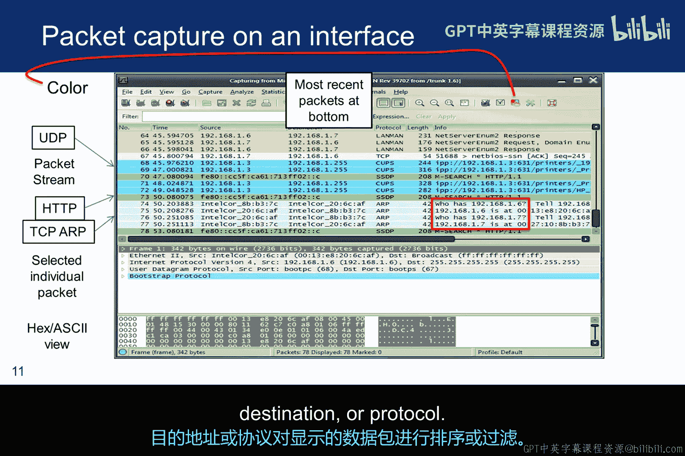
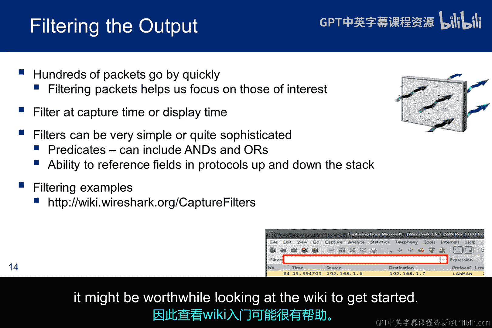
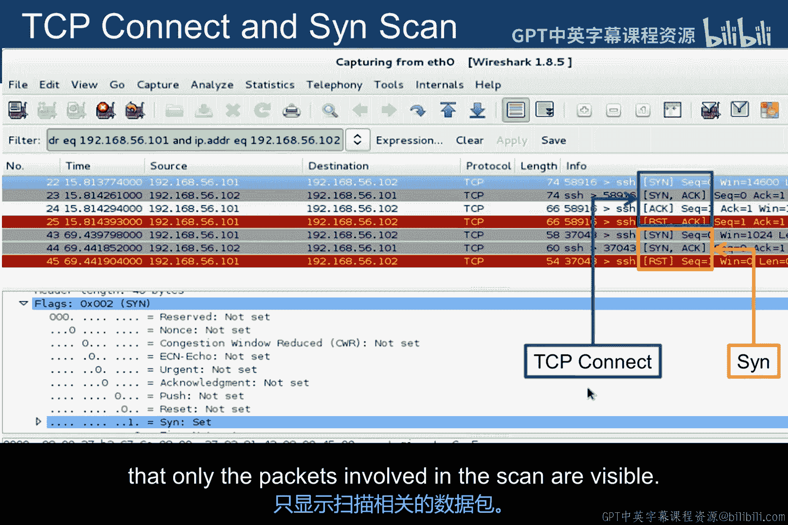
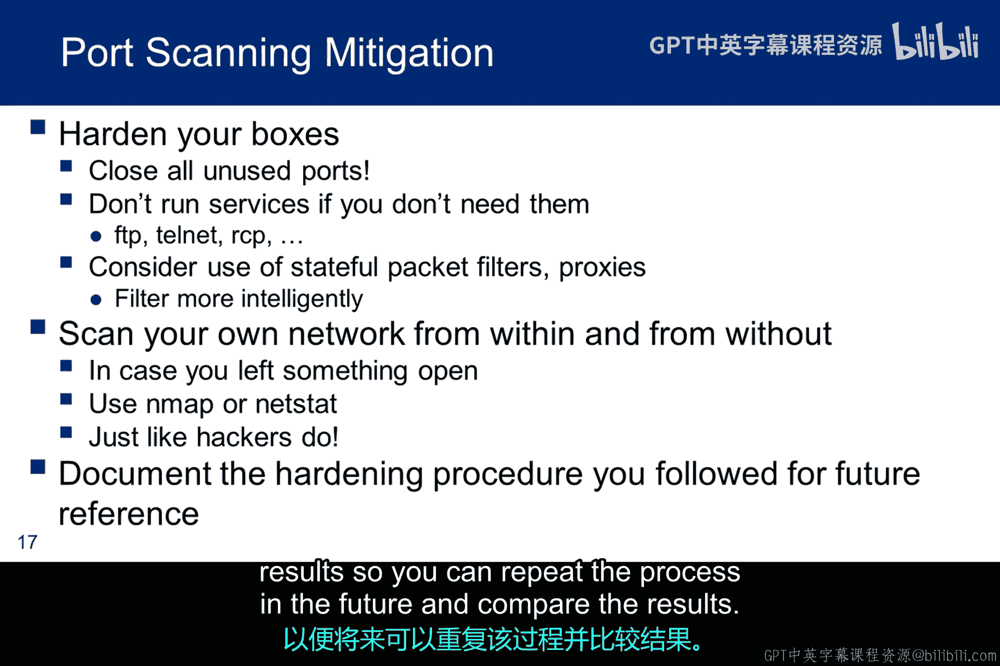
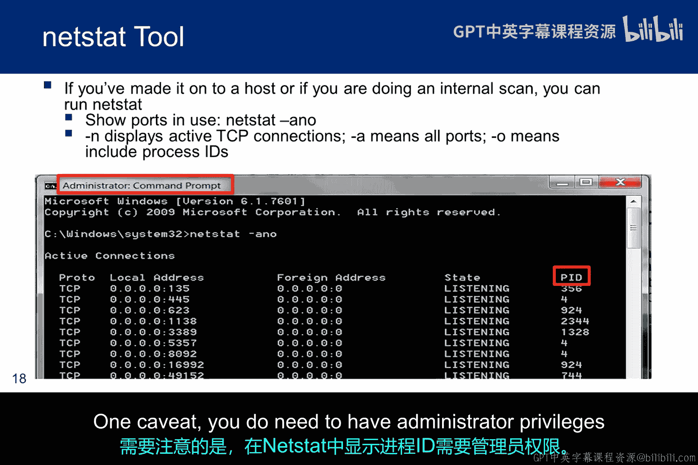
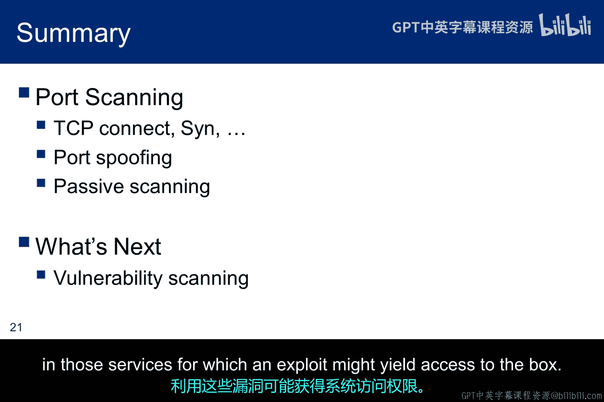

# 029：端口扫描第二部分 🛡️

在本节课程中，我们将继续深入探讨端口扫描技术。我们将通过具体示例，学习如何利用Nmap的选项来隐藏扫描者的IP地址，包括端口欺骗和使用Wireshark进行被动扫描的方法。这些技术对于理解网络侦察的隐蔽性至关重要。

## 端口扫描实践与结果分析

上一节我们介绍了端口扫描的基本概念。本节中我们来看看具体的扫描示例及其结果。

Nmap在同一个网段内对关闭了防火墙的Windows XP系统进行了扫描，结果显示有三个端口开放。值得注意的是，一些广为人知的端口在默认状态下是关闭的，这表明微软在不断学习并更好地保护其系统构建。

当Windows防火墙开启时，则没有端口显示为开放。延迟统计是Nmap维护的一个动态超时值，用于决定在放弃或重发探测包之前，等待探测响应的时间。

然而，如果我们在同一网段对Metasploitable系统运行Nmap，结果则完全不同。我们开始体会到Metasploitable系统是多么易受攻击。

## 隐藏扫描者身份的技术

为了帮助隐藏扫描者的身份，Nmap支持几个扫描选项。

以下是两种主要的隐藏技术：

*   **`-D`（诱饵）选项**：此选项将你的IP地址与你指定的一系列其他IP地址混合。目标无法确定扫描究竟来自哪个地址。当然，许多响应会被发送到其他机器，但只要你能获取到响应信息就无关紧要。
*   **`-S`（欺骗）选项**：此选项会导致使用一个伪造的IP地址。在这种情况下，响应不会返回到你的机器。这意味着你必须在目标网段部署嗅探器来捕获响应，或者必须使用类似空闲扫描的技术。

使用诱饵扫描时，目标IDS可能会报告来自5到10个不同IP地址的端口扫描，但无法确定哪个IP是真正的扫描源，哪些是无辜的诱饵。虽然这种技术可以通过路由器路径追踪、响应丢弃和其他主动机制来防御，但它通常是隐藏IP地址的有效方法。

如果你没有在IP列表中放入自己的真实IP，Nmap会随机放置你的位置。如果你将其放在列表末尾，某些扫描检测器可能根本不会记录你的IP。你也可以使用`-R`和`-D`来生成随机的非保留IP地址。

诱饵扫描在初始的Ping扫描、远程操作系统检测和SYN扫描中有效，但不适用于版本检测或TCP连接扫描。最后，值得注意的是，使用过多诱饵可能会减慢扫描速度，甚至可能降低其准确性。

一些ISP会过滤掉你的欺骗数据包，但许多ISP根本不限制伪造的IP数据包。通过欺骗扫描，你可以让目标认为其他人在扫描他们，但由于IP是伪造的，你无法收到返回的数据包。

## 端口欺骗与防火墙配置

端口欺骗与IP欺骗不同，因为你实际改变的是源端口号，而不一定是IP地址，这可能使扫描数据包能够通过防火墙。

一个令人惊讶的常见防火墙配置错误是仅基于源端口号来信任流量。例如，来自DNS或FTP端口的数据包有时会被放行。一些缺乏经验的管理员认为攻击者不会注意到此类防火墙漏洞。在其他情况下，管理员将此视为一种临时措施，直到他们能实施更安全的解决方案，但随后却忘记了进行安全升级。

当然，这些问题的安全解决方案是存在的，例如应用级代理或协议解析防火墙模块。不幸的是，一些不安全的解决方案更容易管理。例如，Windows 2000和Windows XP自带的IPSec过滤器包含一条隐式规则，允许所有来自端口88（Kerberos端口）的TCP或UDP流量。同样，ZoneAlarm个人防火墙曾一度允许任何源端口为53（DNS）或67（DHCP）的传入UDP数据包。

Nmap提供了`-g`和`--source-port`选项来利用这些弱点。指定一个端口号，Nmap将尽可能从该端口发送数据包。大多数使用原始套接字的扫描操作，包括SYN和UDP扫描，都完全支持此选项。值得注意的是，该选项对任何使用正常操作系统套接字的操作都没有影响，包括DNS请求、TCP连接扫描、版本检测和脚本扫描。设置源端口对操作系统检测也不起作用。

在我们的道德黑客实验环境中，当尝试扫描防火墙后的虚拟机时，此命令行选项可能很有用。欺骗源端口将产生更有用的结果。

## 被动扫描与Wireshark

被动扫描不仅提供匿名性，而且由于没有数据包发送到目标，它隐藏了渗透测试员正在收集信息这一事实。尽管这是一种通过嗅探网段数据包实现的被动技术，但仍然可以确定数据包中的源和目的IP地址以及交换的数据包类型。显然，被动技术收集信息可能需要更长的时间，因为在嗅探会话的不同时段，网络流量可能非常低。

最著名的嗅探器是Wireshark（曾被称为Ethereal），它是一个免费工具。收集信息的最佳方式是能够访问感兴趣其中一方的网段。Wireshark也可以在没有直接访问网段的情况下使用，但那些技术稍微复杂一些。

Wireshark使用Pcap库进行数据包捕获。在Linux上称为Libpcap，在Windows上称为WinPcap。当Wireshark启动时，它会提供一组检测到的接口。用户可以选择要监控的接口，并捕获该接口看到的所有数据包。此外，如果之前的扫描会话保存了Pcap文件，你也可以看到文件名并选择打开文件进行分析，而不是监控接口。

这是从接口菜单呈现的屏幕。你可以选择要监控的接口并开始监控。

这个Wireshark字符串捕获显示了在接口上收集的显示信息的三个主要框架。顶部框架是监控接口上收集到的数据包流，因为它们经过网段。它包括源和目的IP、相关协议和一些附加信息。你还可以看到数据包类型被颜色编码，以简化阅读数据包流。在这种情况下，UDP数据包是蓝色的，HTTP请求是绿色的，TCP RST交换是浅灰色的，但这些都是可配置的。第二个框架显示额外的数据包细节。当你选择一个特定的数据包并想要深入查看时，例如对于一个TCP数据包，你将能够看到帧的每个字段，包括标志字段中设置的位等信息。底部框架显示与中间框架每个高亮字段相关的ASCII码。

在中间框架中，相关联的ASCII码会在底部框架中高亮显示。也可以按时间、源地址、目的地址或协议对显示的数据包进行排序或过滤。在红色框中，你可以看到一些ARP交换，其中IP地址与MAC地址相关联。

注意ARP数据包的“信息”字段。首先是一个广播请求：“谁有这个IP？”。然后来自拥有该IP的设备的响应会说“那个IP在MAC地址某某处”。

如果你选择颜色配置按钮，就会显示这个。

数据包捕获截图显示了一些ARP消息，因此我想花点时间回顾一下ARP的工作原理，因为它在渗透测试讨论中反复出现。

在这张图中，PCA知道目的IP地址，但不知道PCB的MAC地址，因此无法通信。ARP协议将帮助PCA确定PCB的MAC地址。

PCA首先检查其本地连接表以查找目标IP的MAC地址，但PCA没有PCB的任何条目。因此，PCA广播一个ARP请求。它广播到MAC地址FF:FF:FF:FF:FF:FF，询问目的IP地址192.168.0.3。广播域上的每个连接设备都会收到该请求。在这个简单案例中，PCB和PCC都会收到该帧。

PCB将丢弃该请求，因为其第3层目的IP不匹配。PCC接收ARP请求，因为第3层地址匹配192.168.0.3，并且PCC使用请求者PCA的IP地址192.168.0.1和MAC地址00:00:1a:3f:02:56更新自己的本地连接表。然后，PCC使用刚刚存储在其本地连接表中的单播信息向PCA发送一个ARP回复包。PCA接收ARP回复包，并使用IP地址192.168.0.3和MAC地址00:e0:fe:09:c2:11更新其本地连接表。现在PCA有了PCC的MAC地址，它们可以通信了。请注意，添加到这张图上的黑色文字显示了你在Wireshark中实际会看到的内容。

顺便说一下，ARP毒化是我们提到的一种嗅探交换机数据包的技术。在这种攻击中，PCA和PCC中的ARP缓存都被毒化。这种攻击欺骗了试图通信的两台计算机，使它们认为第三台计算机的MAC地址是对方的MAC地址。这将导致交换机将PCA和PCC之间的流量路由到中间人那里，你可以在那里嗅探流量，然后像什么都没发生一样将流量发送出去。这种攻击可能会对某些交换机和局域网造成严重破坏，因此需要谨慎使用。

## Wireshark过滤与分析

如果你曾经启动过Wireshark，你就会知道，即使在一个简单的网络上，也会立即捕获数百个数据包。线路上有大量用户看不到的低层活动和交换，但这些对于成功的网络通信至关重要。事实上，在短时间内捕获的数据包如此之多，以至于复杂性有时令人难以应对。

Wireshark通过提供过滤机制来帮助我们应对这种复杂性，该机制可以过滤我们看到的内容。一个简单的例子是根据源IP和目的IP进行过滤。你可以在捕获数据包时进行过滤，也可以捕获所有数据包然后过滤显示的内容。过滤引擎非常强大，并提供子二进制逻辑运算符来创建极其复杂的组合。一些用户认为Wireshark的过滤菜单不太直观，因此可能值得查看Wiki来入门。

此屏幕截图显示了TCP连接扫描期间捕获的数据包（绿色部分）。它显示了如前所述的数据包：SYN，SYN-ACK和ACK，然后是一个RST以优雅地终止连接。它还显示了一个半开放扫描：SYN，然后直接是RST。在中间框架中，你还可以看到SYN数据包（蓝色高亮）的SYN标志已被设置。

在绿色的过滤栏中，你可以看到我已经根据源IP和目的IP进行了过滤，以便只有扫描涉及的数据包可见。

这组图片取自Wireshark网页，展示了成功使用Wireshark的各种方法。左上角带有红色边框的两种配置显示了可能的网络配置：一种是使用集线器（利用共享介质），另一种是使用交换机（不共享介质）。使用集线器时，很容易收集经过的数据。不幸的是，如今集线器已不常用，除了在无线配置中。在交换机配置中，即使处于混杂模式，网卡也不会看到地址与其自身不同的数据包。无论是否处于混杂模式，网卡的行为都完全相同。

其余图表展示了在使用交换介质时，如何使用Wireshark捕获数据包。

1.  在配置3中，我们希望从单个主机收集数据，并且能够在该主机上启动Wireshark。
2.  在配置4中，我们能够将集线器插入感兴趣的以太网线路，并将Wireshark机器连接到集线器。
3.  在配置5中，交换机有一个监控端口，我们能够将Wireshark机器连接到该端口。
4.  在配置6中，Wireshark机器有两个网卡，我们能够将计算机本身作为网桥连接到以太网线路，这是一种中间人攻击。
5.  在配置7中，我们插入一个分路器，并将一台带有两个网卡的Wireshark机器连接到分路器。
6.  在配置8中，我们有另一种中间人攻击，我们连接到交换机并进行ARP毒化。
7.  在配置9中，我们使用MAC泛洪，用虚假的MAC地址轰炸交换机，直到交换机无法处理。然后交换机进入故障开放模式，开始像集线器一样向网络上的所有机器广播数据包。

## 防御措施与内部侦察

为了保护你的计算机免受黑客进行端口扫描以收集信息并随后发动攻击，你需要做的头两件事是：关闭任何非绝对必要的端口，并停止任何可能默认配置运行但非必要且在某些情况下可能不安全的服务。像防火墙这样的有状态设备也可以通过允许对过滤过程进行更精细的控制来帮助保护你的基础设施。

你还应该从外部扫描你的网络，就像你是一个黑客一样，同时从内部扫描以防止内部攻击。我们已经讨论过Nmap，但一旦你在一个系统上获得立足点，或者如果你在内部，Netstat将提供有用的信息。每当你进行这种配置和扫描时，记录步骤和结果，以便将来可以重复该过程并比较结果。

这是一个Netstat截图，显示了正在使用的端口和活动的TCP连接。这类信息对于识别C2（命令与控制）通道很有用。如果你认为你的一台或多台计算机可能是僵尸网络的一部分，运行Netstat并检查外部地址和端口，看看是否有需要进一步调查的意外连接。你可以使用`whois`等工具来研究未知IP，并查看该站点是否合法。进行此操作时要小心，因为一些防病毒软件会与国外位置的服务器建立连接。这些可能是合法的，但如果没有详细调查，它们可能看起来不合法。

如果你认为连接看起来可疑，进程ID（PID）标识了控制该连接的进程。随后，你可以创建任务列表，找到匹配的PID并终止该进程。需要注意的是，你需要在Netstat中拥有管理员权限才能显示进程ID。

## SYN洪水攻击与缓解

SYN洪水是一种拒绝服务攻击，它试图用大量SYN数据包淹没监听端口的服务，导致缓冲区填满，并且由于内核内存耗尽，服务器无法再响应请求。服务器可能会崩溃，也可能不会。但可以肯定的是，缓冲区会填满，无法接受额外的连接。这是一种非常古老的攻击，由于我们已经学会了如何缓解它，所以不再有效。大多数服务器都实施了缓解措施，而且在许多情况下，服务器的容量非常大，需要由高性能服务器组成的大型僵尸网络才能产生显著影响。

RFC 4987讨论了SYN洪水的缓解措施。其中一些缓解思路很有趣。例如，SYN缓存的概念最小化了SYN在目标上分配的状态量。换句话说，目标不会立即分配完整的传输控制块（TCB）。完整的状态分配会延迟到连接完全建立之后。另一个例子是，为了避免内存耗尽，操作系统还可能为监听套接字关联一个积压参数，该参数设置了同时处于SYN接收状态的TCB数量的上限。此操作保护了主机可用的内存资源免受攻击，但积压参数本身代表了另一个易受攻击的较小资源。当积压队列中没有剩余空间时，直到一些TCB建立连接或以其他方式从SYN接收状态移除之前，都无法处理新的连接请求。

## 总结与展望

我们已经详细讨论了扫描技术。TCP连接扫描和SYN扫描是基础技术。我们还讨论了其他一些使数据包通过防火墙的思路，包括欺骗数据包来源的端口和被动扫描（虽然通常需要更长时间，但更隐蔽）。既然端口扫描已经提供了有关开放端口和在这些端口上运行的服务的信
息，我们接下来希望继续识别这些服务中的潜在漏洞，利用这些漏洞可能获得对系统的访问权限。

在本节课中，我们一起学习了端口扫描的高级技术，包括使用诱饵和欺骗来隐藏扫描源、利用端口欺骗绕过防火墙规则，以及使用Wireshark进行被动信息收集。我们还探讨了针对扫描的防御措施，并简要介绍了SYN洪水攻击及其缓解方案。这些知识为我们后续识别和利用服务漏洞奠定了基础。