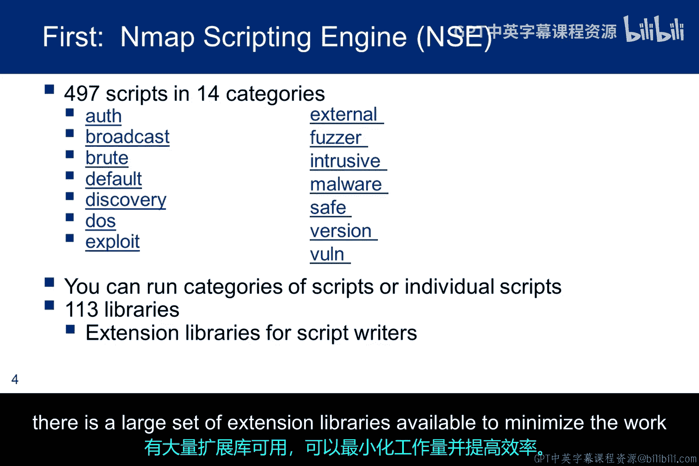
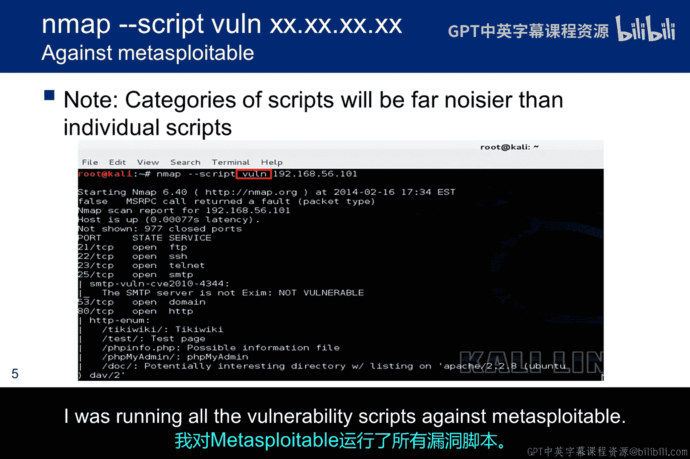
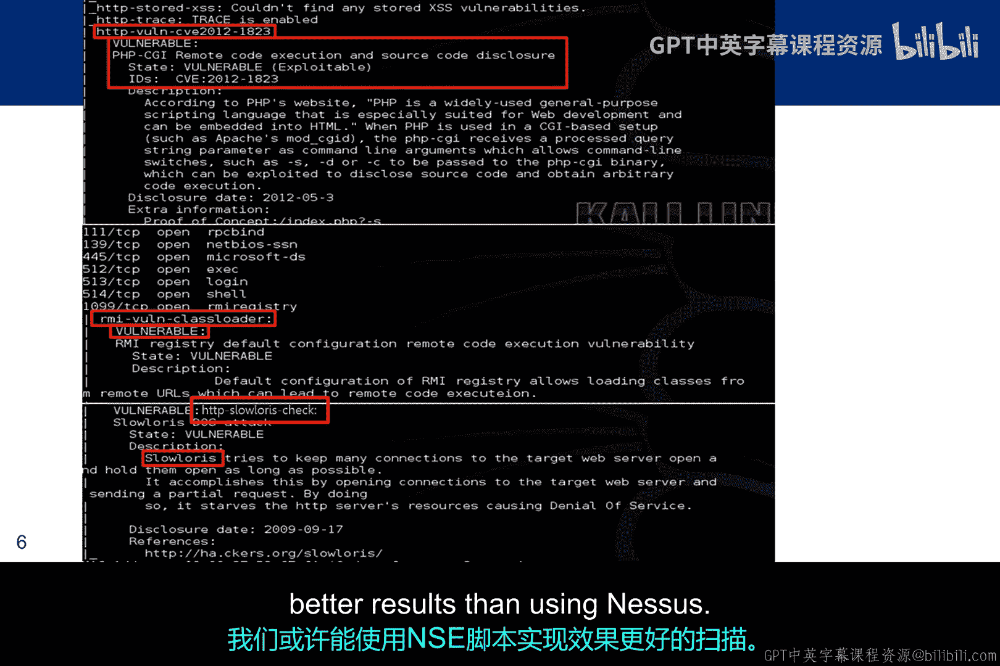
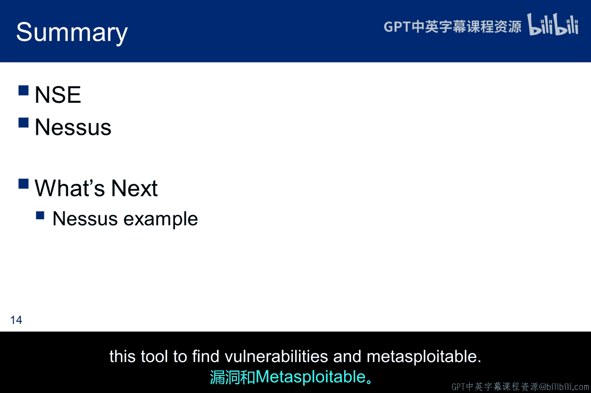

# 030：漏洞扫描 🔍

在本节课中，我们将要学习渗透测试方法论中的第三个阶段：漏洞扫描。我们将了解漏洞扫描的基本概念、它与前几个阶段的关联，并重点介绍两款核心工具：Nmap脚本引擎（NSE）和Nessus。通过学习，你将能够理解如何利用这些工具来识别目标系统中可能存在的安全弱点。

上一节我们介绍了主机发现、操作系统探测和端口扫描。本节中我们来看看如何利用这些信息进行更深入的漏洞扫描。

漏洞扫描利用版本信息来尝试识别存在漏洞的服务。然而，这些工具采用了非常主动的扫描方式。在某些情况下，它们甚至会向目标投送漏洞利用代码以确定漏洞是否存在。尽管如此，扫描器远非完美。它们有时会识别出实际上无法被利用的漏洞。免费工具尤其如此，我们将在后续的漏洞利用模块中讨论一个具体的例子。

漏洞扫描是继主机发现、操作系统探测和端口扫描之后的第三个阶段。其基本思想是识别那些尚未打补丁的、存在漏洞的服务。

有许多工具可以进行漏洞扫描，但我们将重点介绍Nessus，因为它是一款被许多渗透测试人员广泛使用的知名工具，并且有一个免费版本可供我们在课程中使用。

这类扫描器有时被称为网络扫描器，因为它探测的是网络服务，例如Web应用程序、Web服务器或数据库。尽管扫描器之间的界限通常很模糊。OpenVAS实际上是从Nessus的代码库分叉出来的。它们现在已分道扬镳，但其框架和相关的扫描技术非常相似。

说到扫描器之间的重叠，Nmap的脚本引擎（NSE）将Nmap从一个知名的端口扫描器带入了漏洞扫描器的领域。NSE运行由Nmap社区贡献的脚本。脚本类别的数量随着产品的成熟而不断变化，但最近有14个脚本类别，包含近500个脚本。

这些脚本提供了大量的功能，其中与本模块相关的两个类别是`discovery`（发现）和`vuln`（漏洞）。

以下是NSE脚本的主要类别示例：
*   `auth`：处理身份认证的脚本。
*   `default`：使用 `-sC` 或 `-A` 选项时运行的默认脚本。
*   `discovery`：用于发现网络上的主机和服务的脚本。
*   `exploit`：尝试利用已知漏洞的脚本。
*   `vuln`：专门用于发现和验证漏洞的脚本。

你可以看到，当我们进入渗透测试方法论的漏洞利用阶段时，其他类别（如`exploit`）也将引起我们的兴趣。如果你有兴趣编写和贡献新脚本，NSE提供了一组庞大的扩展库，可以最大限度地减少必须完成的工作并提高效率。

你可以运行单个脚本、一个类别中的所有脚本，甚至多个类别的脚本。在下面的截图中，我正在针对Metasploitable靶机运行所有的漏洞脚本。

这里是一些当扫描针对Metasploitable运行时，NSE发现的漏洞示例。第一个红色框显示了一个PHP CGI漏洞，这是一个有据可查的2012年的漏洞，允许远程代码执行。第二个显示了一个RMI配置漏洞。

讨论NSE的重点在于，虽然我们将重点介绍Nessus，但花时间探索NSE是值得的。在我们的实验环境中，当我们在内部网段获得立足点时，我们发现旧服务器上安装了Nmap。我们或许能够使用NSE脚本来进行更好的扫描，获得比通过防火墙使用Nessus更好的结果。

Nessus的客户端-服务器架构允许远程客户端与服务器交互，并对独立于服务器的第三台计算机建立扫描。这种设计允许将服务器放置在网络上的各个战略点，以便从不同的角度进行测试。一个中央客户端或多个分布式客户端可以控制所有服务器。这些功能为渗透测试人员提供了灵活性。

客户端适用于Windows和Linux。Nessus服务器执行实际的测试，而客户端提供配置和报告功能。Nessus依赖于一个插件数据库，在某些情况下，这些插件通过投送漏洞利用代码来检查漏洞。这些插件在本地缓存，大约有40000个。它们基本上是小块的代码，Nessus会发送到目标机器。需要注意的是，一些插件在确定漏洞是否存在的过程中，实际上会利用该漏洞。

Nessus用户指南提供了安装说明和用于Kali安装的软件包名称。由于Kali是基于Debian的构建，你需要使用Debian的安装包。图中给出的版本现在已经过时了，但使用当前的版本号应该可以成功安装。

虽然该软件的有限版本对家庭用户是免费的，但仍然需要注册以获得安装密钥。这里显示了注册链接，只需要提供姓名和电子邮件。安装密钥有效期为24小时，并通过电子邮件发送。你最好在开始安装之前准备好密钥，因为在安装过程中导航到注册屏幕并不总是很顺利。

安装完成后，为了使用Nessus，首先启动守护进程（daemon），然后在客户端启动你选择的浏览器并导航到本地主机的8834端口。在这种情况下，服务器守护进程运行在Kali上，而Kali也充当客户端。你需要输入激活码并创建一个管理账户，该账户用于未来的登录。

激活后，Nessus将开始初始化并下载插件。这需要很长时间，尤其是Nessus第一次这样做的时候。但每次你登录时，Nessus都会经历相同的过程，所以启动可能会很慢。但在后续启动时，由于它已经拥有了许多插件，速度会更快，因为它主要是检查更新和下载新插件。

这是后续连接时呈现的登录屏幕，你可以使用刚刚创建的管理员账户登录。

我们介绍了Nmap脚本引擎（NSE）并完成了Nessus的安装。接下来，我们将通过一个Nessus示例来了解如何使用这个工具在Metasploitable上发现漏洞。

本节课中我们一起学习了漏洞扫描的概念及其在渗透测试流程中的位置。我们探讨了Nmap脚本引擎（NSE）如何扩展端口扫描的功能，并详细介绍了专业漏洞扫描器Nessus的客户端-服务器架构、安装及初始化过程。理解这些工具的原理和基本操作，是进行有效安全评估的关键第一步。