# 031：Nessus工具实例 🛠️

在本节课中，我们将学习如何使用Nessus漏洞扫描器对虚拟机进行扫描。我们将涵盖扫描策略的建立、基本配置、扫描执行以及结果分析。通过本教程，你将掌握使用Nessus进行基础网络扫描的核心步骤。

## 建立扫描策略

上一节我们介绍了本子模块的目标，本节中我们来看看如何为Nessus扫描建立策略。扫描策略的目的是指导工具应运行何种类型的扫描以及如何配置。

例如，默认的网络扫描策略不包含Web服务器扫描，除非在策略配置菜单中手动开启。请注意，Engabrezen的书中使用的旧术语已不再被Nessus使用，因此无需寻找“安全”或“侵入性”等分类。当前最高的漏洞等级是“严重”和“高危”，这些是我们需要优先关注的漏洞。

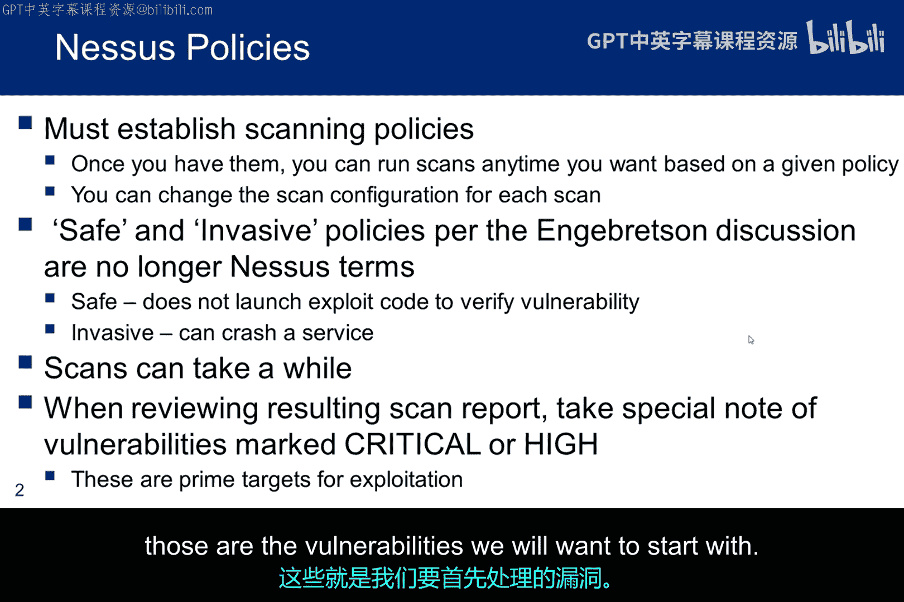

上图展示了可供选择的扫描类型。大多数选项需要升级（如紫色条所示），但“基础网络扫描”是可用的，它能提供关于扫描器工作原理和结果呈现的良好体验。

因此，在初始菜单中选择“扫描”后，此界面会要求选择应运行的扫描类型，该类型随后必须进行配置。你应该探索“基础网络扫描”与“高级扫描”之间的区别，以决定哪个是完成扫描实验的最佳选择。此外，你可能还想运行Web应用程序测试，以比较其结果与Web利用模块中Oos Zap的运行结果。

## 配置扫描设置

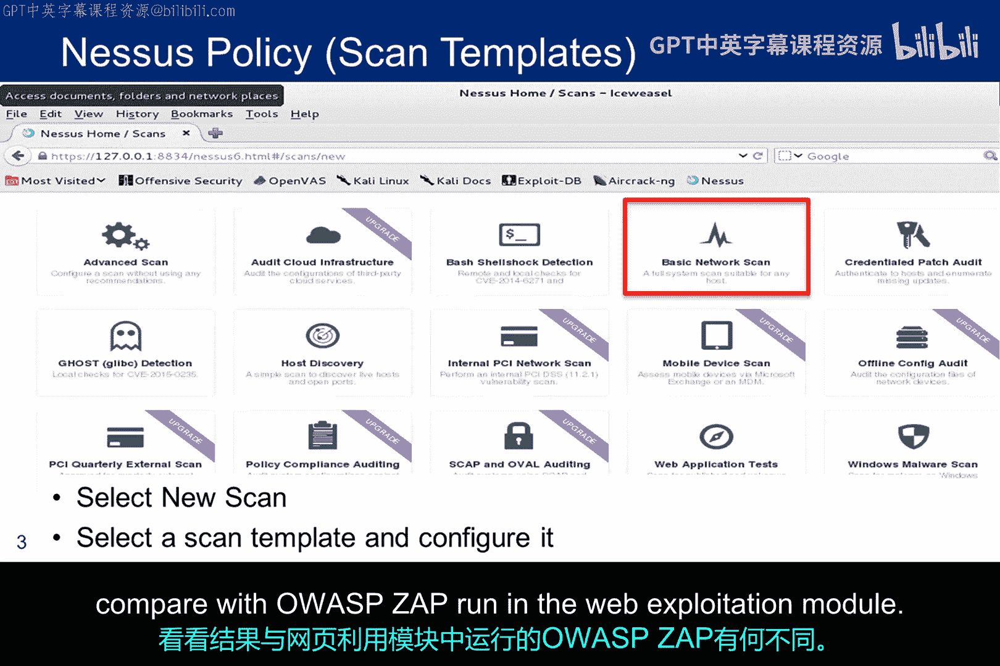

一旦选择了策略，对于基础网络扫描，可以通过左侧菜单访问基本配置设置。Web服务器扫描默认是关闭的，但可以通过这些菜单激活。

在本例中，我将扫描命名为“meta exploitable。 No firewall”，以便与防火墙开启和关闭的其他虚拟机的结果进行跟踪和比较。渗透测试报告的目标是在防火墙开启时进行扫描，但出于学习目的，实验会要求你在防火墙关闭时也进行扫描，因为结果会有显著差异。

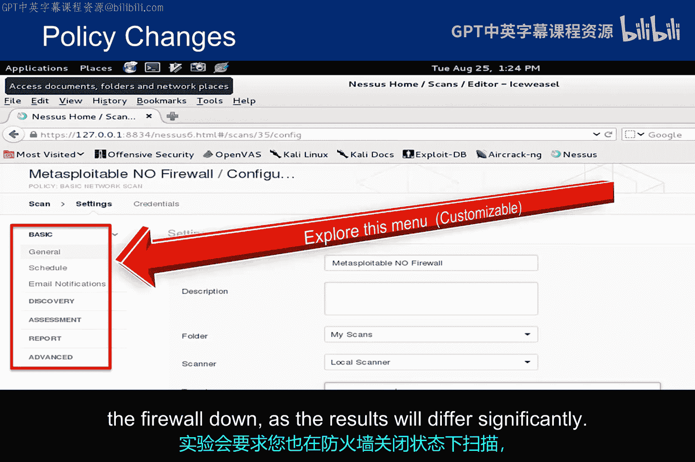

## 凭证扫描简介

我们不会在本课程中探讨凭证式Nessus扫描，但它们在为网络进行补丁和安全策略符合性扫描时非常重要。其理念是向Nessus提供SSH凭证，用于登录被评估的系统。

这种方法不仅能提供更准确的扫描结果，还不会导致被扫描系统崩溃。我最近遇到一个红队，他们不被允许使用Nessus扫描控制我国某项国家资产的系统，因为它对网络中的某些设备产生了运行影响。

这是在运行环境中使用Nessus的一大问题，而凭证扫描可能克服这一问题。然而，根据渗透测试的目标，你的客户可能不愿意向团队提供凭证，或者可能对识别合规性问题不感兴趣。这是与客户进行前期互动至关重要的领域之一。

## 执行扫描步骤

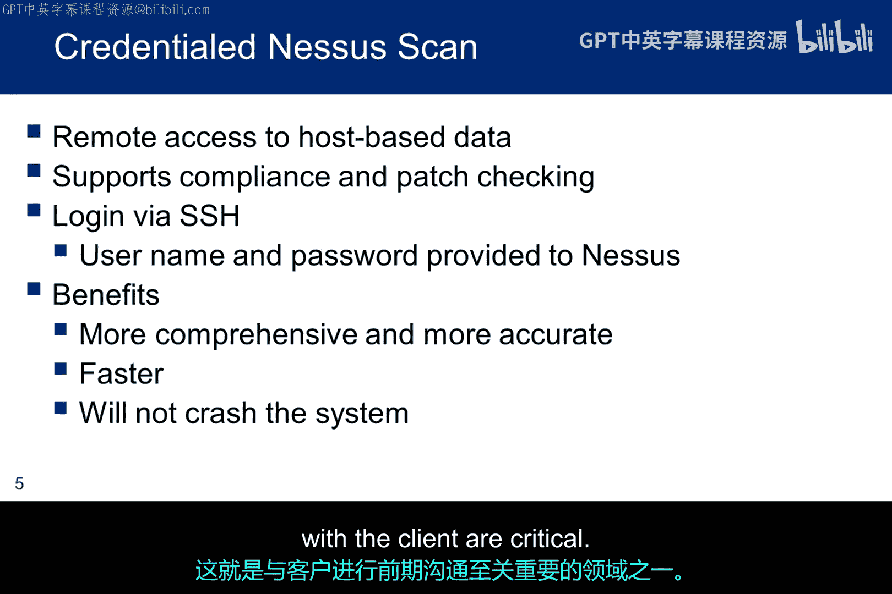

以下是我们在道德黑客环境中扫描Metasploitable的必要步骤。不要忘记启动Burp代理并关闭拦截功能。当然，你的IP地址可能不同。提醒一下，Nessus初始化和Nessus扫描都可能需要一些时间才能完成，因此请提前做好计划。

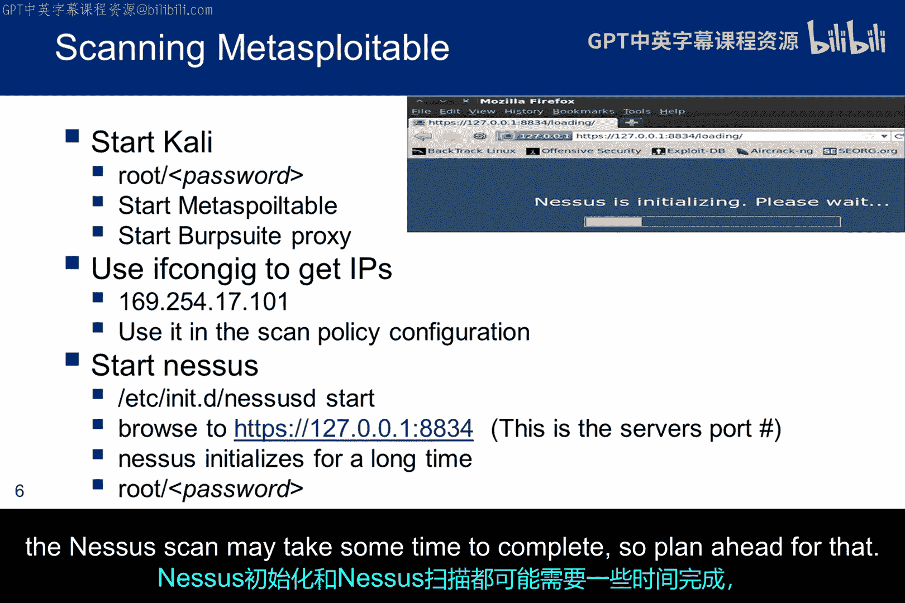

以下是登录Nessus后应遵循的步骤：
1.  首先选择扫描类型，并为扫描命名以帮助你跟踪结果。
2.  选择目标IP。
3.  根据你希望从扫描中看到的结果类型配置基本选项。
4.  启动扫描。

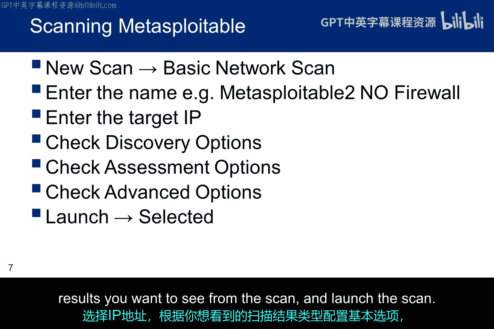

## 分析扫描结果

当我针对防火墙规则关闭的Metasploitable运行网络扫描时，这是扫描结果的高级视图。条形图是颜色编码的：红色代表严重，蓝色代表信息性。在此次无防火墙的扫描中，Nessus识别出了7个严重漏洞。你的结果可能略有不同，这取决于你运行的Nessus版本、已添加的插件数量以及基本策略配置设置。

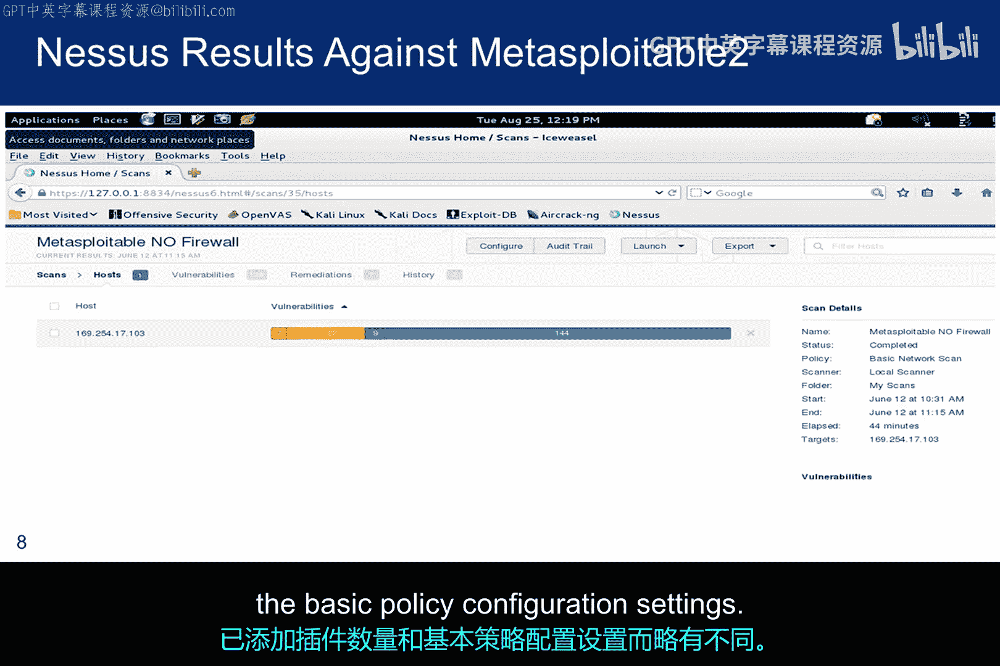

点击Nessus摘要栏可以开始深入查看扫描的细节。这里可以看到七个严重漏洞的简要描述。我高亮了我们将进一步探讨的Samba缓冲区溢出漏洞，以了解如何结合使用Nessus和Metasploit成功在被渗透测试的系统上获得立足点。

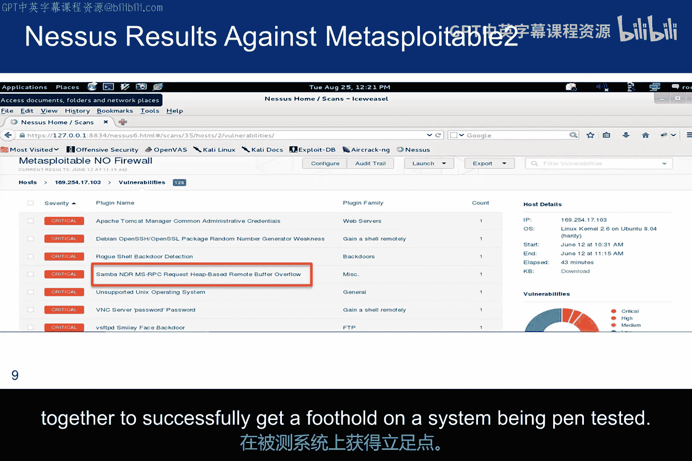

点击高亮的漏洞会显示更多细节。在本例中，提供了升级建议，告知用户Metasploitable中安装的Samba版本不是最新的且存在漏洞。同时提供了一个CVE编号，该编号链接到关于该漏洞的更多详细信息。

通用漏洞披露（CVE）数据库由MITRE维护，并得到美国CERT和国土安全部的支持。Nessus还提供了该漏洞的CVSS评分。在本例中，评分为10.0，这是最高分，意味着它是一个严重漏洞。

通用漏洞评分系统（CVSS）是一个用于确定漏洞严重程度的开放度量标准，偶尔被学生用于他们针对我们小型虚拟网络的渗透测试报告的度量指标。

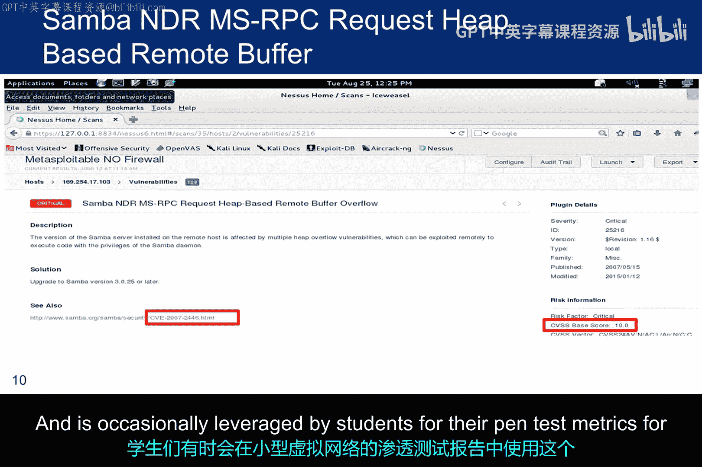

如果你在该页面向下滚动，还会看到如何利用此漏洞进行Metasploit攻击。Nessus推荐了`samba usermap_script`漏洞利用模块。我们将在利用模块中发现，那个特定的利用模块不会成功。尽管如此，我们会找到成功的方法。这是使用这类工具时的一个重要点：当你偏离轨道且直接的方法不起作用时，你该怎么做？一个好的渗透测试员，就像一个好的黑客一样，必须了解基础知识，并能够跳出框框思考。

## OpenVAS简介

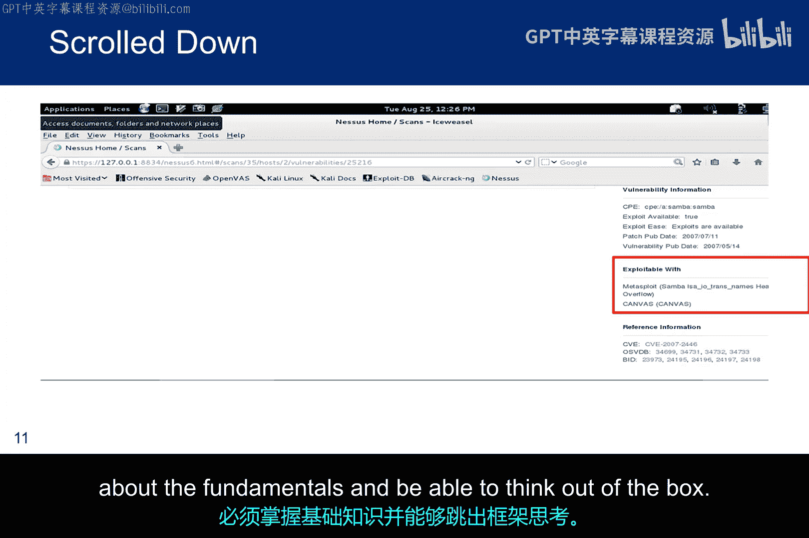

再次说明，OpenVAS是从Nessus基线分叉出来的，因此它以类似的方式工作并有一些共同点，但已沿着不同的路径发展。有些学生实际上更喜欢OpenVAS而不是Nessus，有些则不然。许多人认为Nessus是一个更可行的工具，因为专业版本被红队使用。曾经，扫描作业要求学生比较这两种扫描器，但OpenVAS有些小问题，因此该比较已被取消。

如果你有兴趣了解一点OpenVAS，这里提供了使其运行的步骤。与Nessus一样，下载插件（称为网络漏洞测试）需要很长时间。如果你决定试用它，请注意它使用与Nessus不同的端口号。

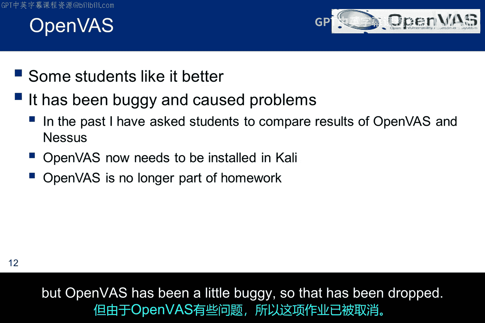

## 总结与展望

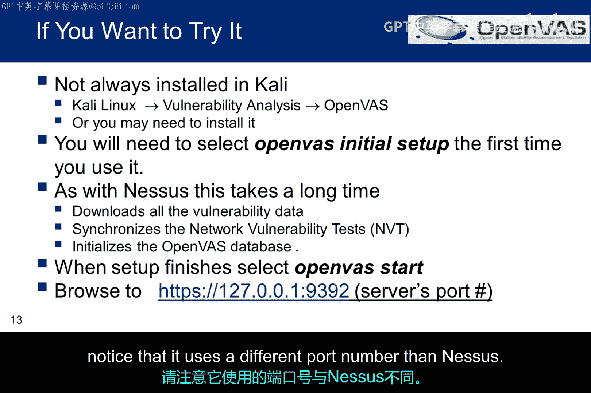

本节课中我们一起学习了漏洞扫描器的简要介绍。提醒一下，利用模块中的演示视频第一部分包括了运行本幻灯片所涵盖的扫描。

下一个模块将涵盖几个有趣的问题。首先，是否可能扫描位于NAT设备后的设备。其次，能否使用Tor进行匿名扫描。

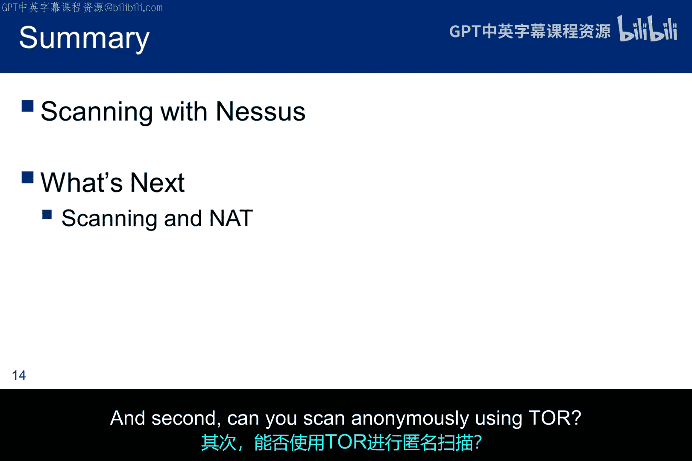

