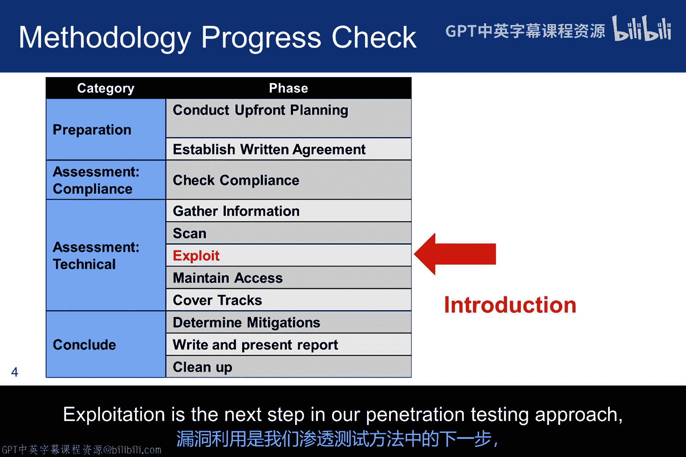
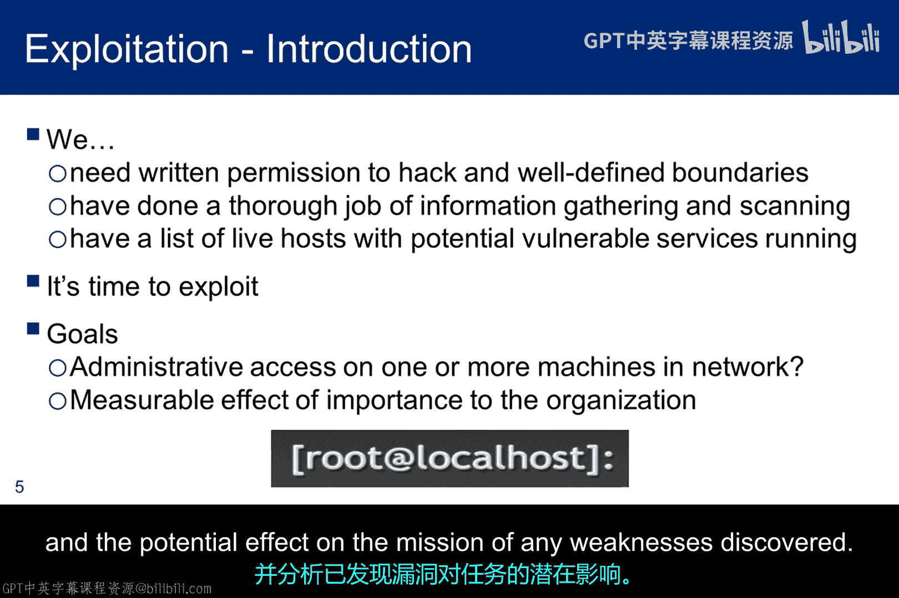
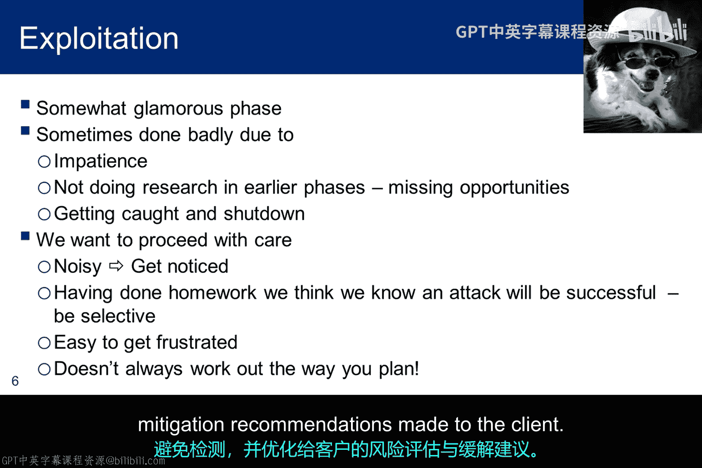
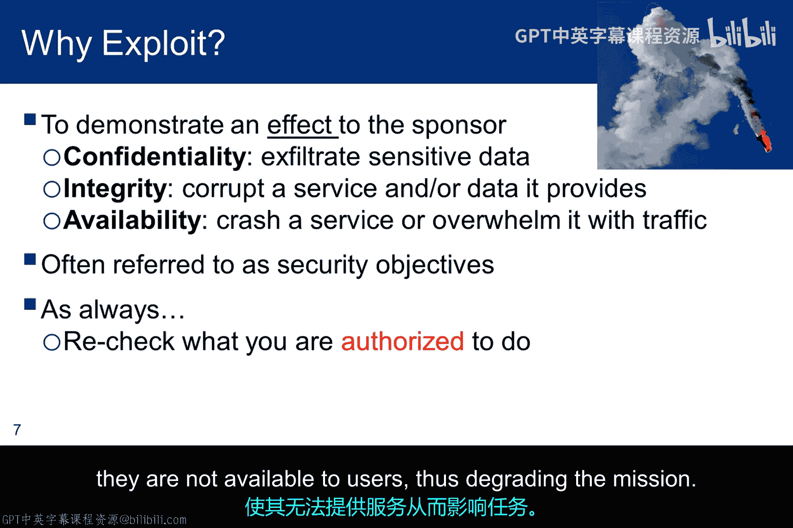
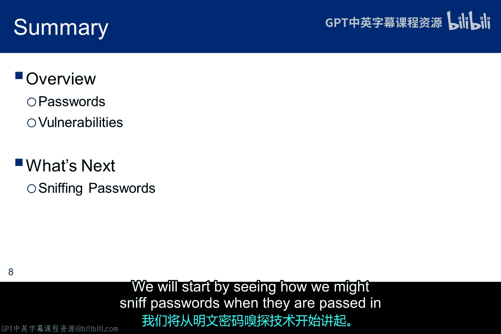

# 032：漏洞利用导论 🎯

在本节课中，我们将要学习道德黑客方法论中的关键阶段——漏洞利用。我们将了解其定义、重要性、执行前提以及核心目标，为后续学习具体的攻击技术打下基础。

上一节我们介绍了扫描阶段，本节中我们来看看渗透测试的下一步：漏洞利用。

## 漏洞利用在方法论中的位置

本幻灯片将本次讲座置于我们的方法论背景中。漏洞利用是我们渗透测试方法中的下一个步骤。

## 法律与前提警告

必须提醒的是，未经授权的漏洞利用是违法的。因此，在进入该方法论的这一阶段之前，拥有一份定义渗透测试范围的书面协议至关重要。

同样重要的是，必须已完成侦察和扫描阶段。换句话说，我们应该已经识别出一些我们想要尝试利用的漏洞。

## 核心目标与方法

我们的目标是采用精准的外科手术式方法，而不是简单地抛出一堆漏洞利用程序来测试哪个有效。

这种“听天由命”的方法可能有效，也可能无效，但可以肯定的是，你将被检测到。

另一个提醒是，获取设备上的 root 权限并非我们的目标。我们的目标是就某个安全区域的安全状态以及所发现的任何弱点对任务造成的潜在影响，制定一些衡量标准。

## 避免脚本小子思维

脚本小子无疑认为漏洞利用是充满魅力的。当我们在一台机器上获得管理员权限时，这对我们所有人来说都相当有成就感。

但我们需要有条不紊地进行。做到彻底并避免被检测非常重要，因为这可能会使测试结果产生偏差。事实上，最坏的情况是，如果网络操作员检测到攻击，他们可能会将系统完全从网络中断开。

我们希望在有效技术和潜在无效技术之间找到适当的平衡，以节省测试时间、避免被检测，并优化向客户提供的风险评估和缓解建议。

## 漏洞利用阶段的好处

为了讨论漏洞利用阶段的好处，我们可以将其置于三个经典安全目标的背景下。

以下是漏洞利用在三个安全目标中的具体体现：

*   **保密性**：我们想向客户展示任何可能导致重要敏感信息（如信用卡号或个人身份信息）被窃取的弱点。
*   **完整性**：我们想发现可能允许攻击者修改信息（如数据库中的 PII）、修改客户订单信息甚至篡改组织网页的弱点。
*   **可用性**：我们需要展示与导致关键任务系统崩溃或负担过重相关的风险，使其对用户不可用，从而影响任务执行。

## 过渡到具体技术

介绍性评论到此结束，我们将开始深入研究危害密码的技术。

我们将从了解如何在密码以明文形式传输时嗅探它们开始。

本节课中我们一起学习了漏洞利用阶段的核心概念。我们明确了其合法性前提、执行所需的准备工作（完成侦察与扫描），以及其最终目标——评估安全风险而非单纯获取权限。我们还探讨了漏洞利用如何帮助验证保密性、完整性和可用性这三个核心安全目标的脆弱性。接下来，我们将进入实践环节，学习具体的密码攻击技术。