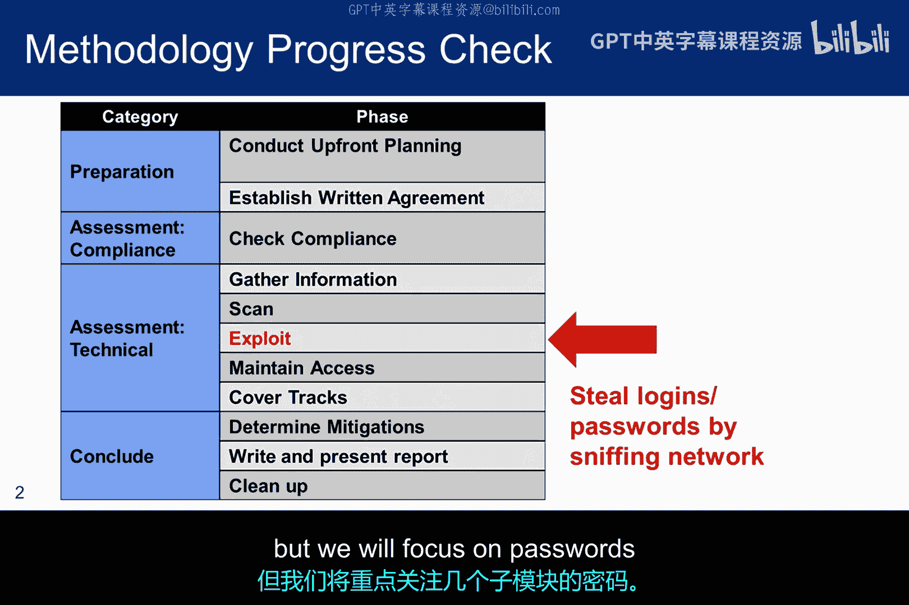
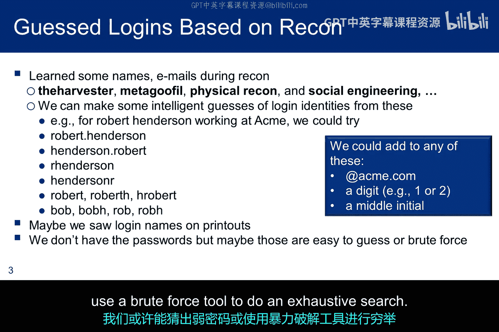
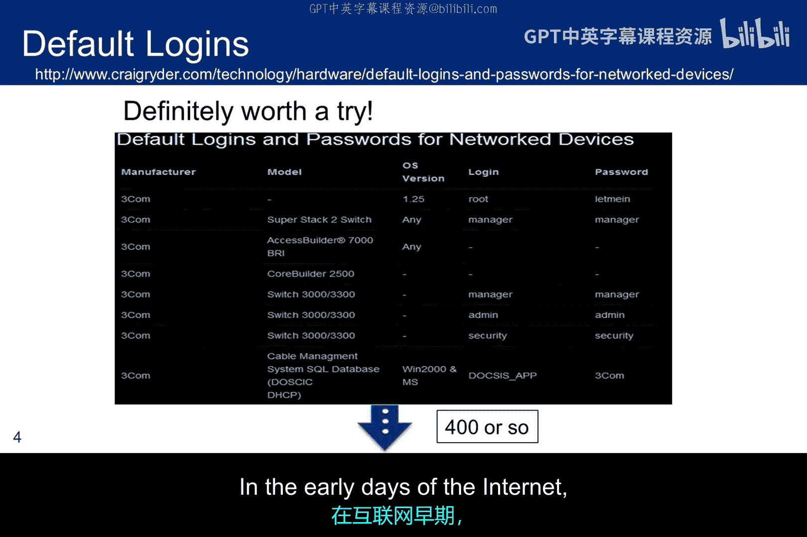
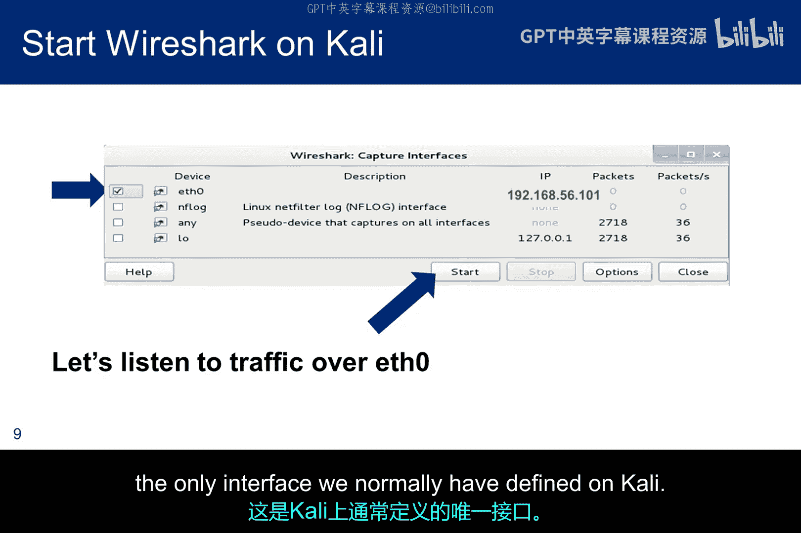
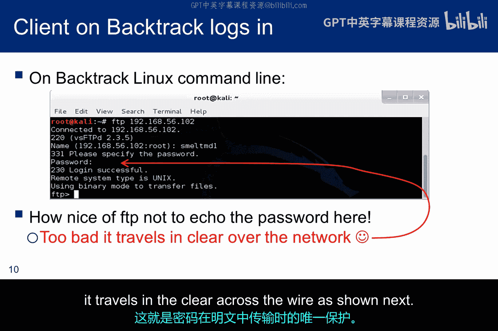
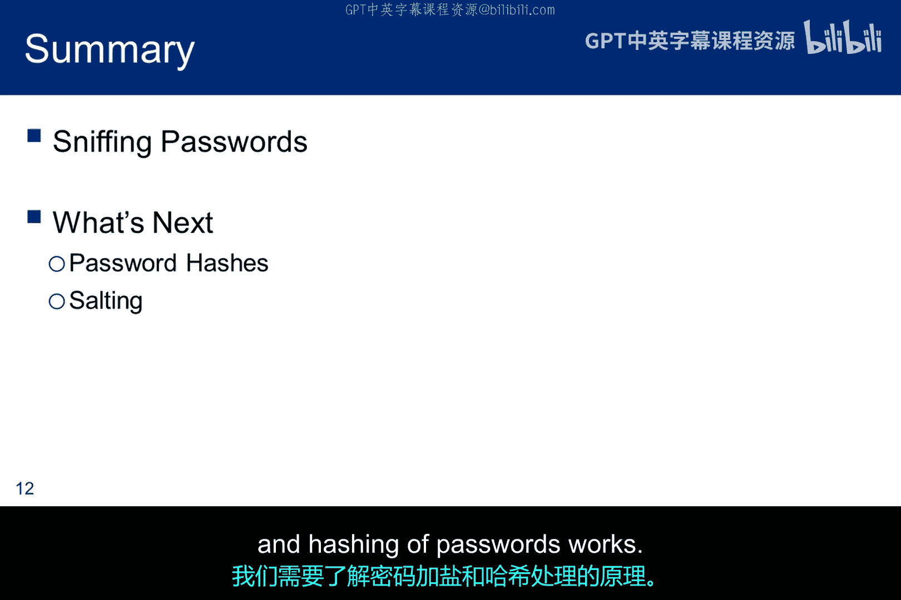

# 033：密码嗅探 🔍

在本节课中，我们将要学习密码嗅探技术。这是一种捕获未受保护密码的方法。我们将了解其原理、相关工具，并通过一个实际案例演示如何捕获明文传输的FTP凭据。

## 概述

密码嗅探是一种用于捕获网络中未受保护密码的技术。尽管大多数人都了解风险，并且密码需要在网络传输中得到保护，但仍有服务使用不安全的协议。此外，一些账户可能使用默认的、众所周知的密码。从渗透测试方法论来看，我们仍处于“漏洞利用”阶段，但接下来的几个小节将聚焦于密码相关的攻击。

## 识别用户ID与密码

在侦察阶段，我们讨论过几种有助于收集姓名和电子邮件地址的工具。我们可以利用电子邮件地址的本地部分（即“@”符号前的部分）和已识别的姓名来尝试猜测登录ID。

安全意识薄弱的组织可能会直接使用电子邮件地址的本地部分作为用户ID，但这会增加风险。因此，具备更多安全知识的组织已不再采用这种方法。

以下是一些可能有助于确定用户ID的模式示例。假设我们确定一个用户的姓名是Robert Henderson：
*   `rhenderson`
*   `robert.henderson`
*   `robert_henderson`
*   `r.henderson`
*   `roberth`
*   `hendersonr`

当然，即使我们猜出了用户ID，仍然需要密码。不过，有了用户ID，我们或许能猜出弱密码，或者使用暴力破解工具进行穷举搜索。

## 利用默认账户

当系统由经验不足的管理员配置或出现失误时，使用默认密码的默认账户有时仍会被保留下来。你应该保留一份默认登录凭据列表，并在投入精力尝试其他技术之前，始终先尝试这些默认凭据。

**注意**：在搜索此类列表时需保持谨慎，因为你可能会访问到恶意网站。

## 明文传输协议

在互联网早期，密码有时会以明文形式传输。以下是三种曾经（显然现在有时仍是）以明文传递凭据的服务：
1.  **Telnet**：用于远程登录的旧协议。
2.  **FTP**：文件传输协议。
3.  **R-Services (rlogin, rsh)**：这些服务如果在`.rhosts`文件中找到用户名，可能根本不要求凭据。但当未找到且用户需要提交凭据时，它们也是以明文传输。

当这些凭据以明文形式传输，并且我们能够访问局域网段时，我们就可以启动嗅探器，在线路上捕获经过的数据包。

## 嗅探器与工作模式

如果网络适配器处于混杂模式，嗅探器将捕获局域网上通过的所有数据包，而不仅仅是发往本机MAC地址的数据包。这本质上是**混杂模式**的定义。

无线局域网也有类似的适配器属性和工具，尽管我们通常更常用**监视模式**这个术语，而不是混杂模式。一个非常著名的无线工具是`Airmon-ng`，它只是一整套无线攻击工具中的一个。一个关键区别在于，在监视模式下，嗅探器收集来自所有SSID的数据包，并且其有效载荷很可能使用WEP或WPA2加密。

## 常用嗅探工具

还有其他可用的嗅探器：
*   **Tcpdump**：非常有用，因为它是Linux系统原生的工具。
*   **Cain and Abel** 和 **Ettercap**：都具备一定的嗅探功能，但嗅探并非其主要功能。
    *   `Cain and Abel`本质上是一个Windows密码破解器，但它可以嗅探交换式局域网上的流量或模拟中间人攻击。
    *   `Ettercap`是一套用于中间人攻击的工具套件，同时也能够嗅探活动连接。

## 实战：嗅探FTP凭据

FTP是明文传输凭据的服务之一。在讨论嗅探这些凭据之前，我们先回顾一下FTP握手过程。请注意，一些防火墙会跟踪握手从一个步骤到下一个步骤的状态。

FTP连接建立过程如下：
1.  客户端从其非特权命令端口（例如1026）连接到服务器的知名命令端口21，并告知服务器其数据端口（例如1027）。
2.  服务器向客户端的命令端口发送ACK确认。
3.  服务器从其知名的本地数据端口20发起连接到客户端之前指定的数据端口（1027）。
4.  客户端向服务器的数据端口发送ACK确认，如步骤4所示。

有状态防火墙会跟踪FTP会话涉及两套端口这一事实，并会阻止任何未经过握手过程的外部连接请求。

在接下来的演示中，我们将捕获FTP凭据。客户端将是Kali，服务器将是Ubuntu。我们将在Kali上运行Wireshark进行捕获，但同样也可以在Ubuntu上使用Tcpdump完成。

### 实验步骤

1.  在Kali上，在`eth0`接口（通常是在Kali上定义的唯一接口）上启动Wireshark。
2.  在Kali中打开一个终端，与Ubuntu启动一个FTP会话。请注意，用户ID会发送给服务器，但当输入密码时，终端上不会显示密码字符。不幸的是，这就是密码在网络上以明文传输时所获得的唯一保护。
3.  在Wireshark中观察捕获的数据包。前三个数据包建立TCP连接（SYN， SYN-ACK， ACK）并请求FTP服务。第四个数据包是握手第二步，服务器对FTP请求作出响应。在进入FTP数据传输阶段之前，需要进行身份验证。
    *   首先，客户端发送用户名。
    *   服务器回应并请求密码。
    *   客户端发送密码。正如你所见，它是未受保护且可读的。
4.  一旦通过身份验证，FTP数据会话就会启动，允许双向传输文件。但此时凭据已经被嗅探到了。

## 总结

本节课中，我们一起学习了密码嗅探技术。我们了解了如何利用用户信息猜测ID、警惕默认账户、识别明文传输协议（如FTP、Telnet），并掌握了使用嗅探工具（如Wireshark）在混杂/监视模式下捕获网络流量。通过一个实际的FTP凭据嗅探演示，我们清晰地看到了明文密码在传输过程中的脆弱性。这强调了在任何网络服务中使用加密协议（如SSH、SFTP、HTTPS）来保护认证凭据的极端重要性。

---
**核心概念与代码/公式摘要**：
*   **混杂模式**：网络适配器接收所有流经网段的数据包，不限于本机地址。在代码中，这通常需要通过工具或命令设置。
*   **明文传输**：指密码等敏感信息未经加密，直接以可读形式（如ASCII）在网络中传输。例如，在FTP中，密码可能以 `PASS mypassword` 这样的命令直接发送。
*   **FTP握手与数据连接**：涉及两个端口：命令端口（默认21）和数据端口（动态协商）。有状态防火墙会跟踪这个关联。