# 034：密码哈希 🔐

在本节课中，我们将要学习密码在系统中如何被管理和存储，特别是Linux系统下的密码哈希机制。我们将探讨密码保护的重要性、哈希与加盐的原理，以及攻击者如何尝试破解密码。理解这些基础知识对于评估和提升系统认证安全至关重要。

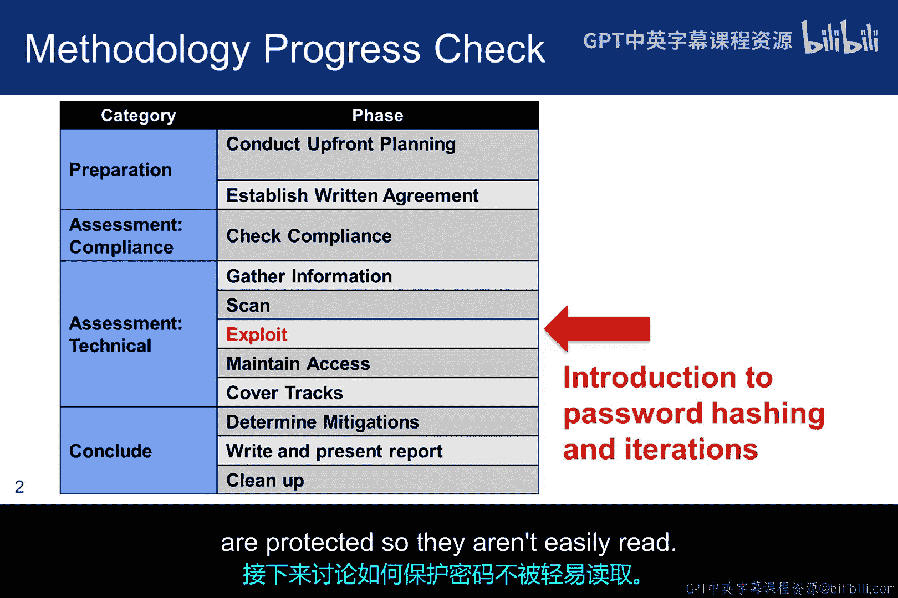

---

## 密码存储与保护机制 🔒

上一节我们介绍了密码作为常见认证机制的风险。本节中我们来看看密码是如何被保护，以避免被轻易读取的。

密码是常见的认证机制，这意味着如果密码没有得到适当保护，被泄露的风险很高。解决此问题的典型方法之一是要求用户使用更长、更复杂的密码。但问题在于，这可能导致用户重复使用密码或将其写下来。一些用户试图通过使用键盘模式来规避，但这本身也带来风险。

除了用户选择简单密码外，我们还需考虑密码的存储方式。一些网站存储你的实际密码，而非哈希值。它们这样做是为了密码恢复。它们通过SSL隧道接收凭证，但大多数会通过电子邮件发送密码以进行恢复。如果一个网站向你发送了密码，你应在恢复后立即重置。

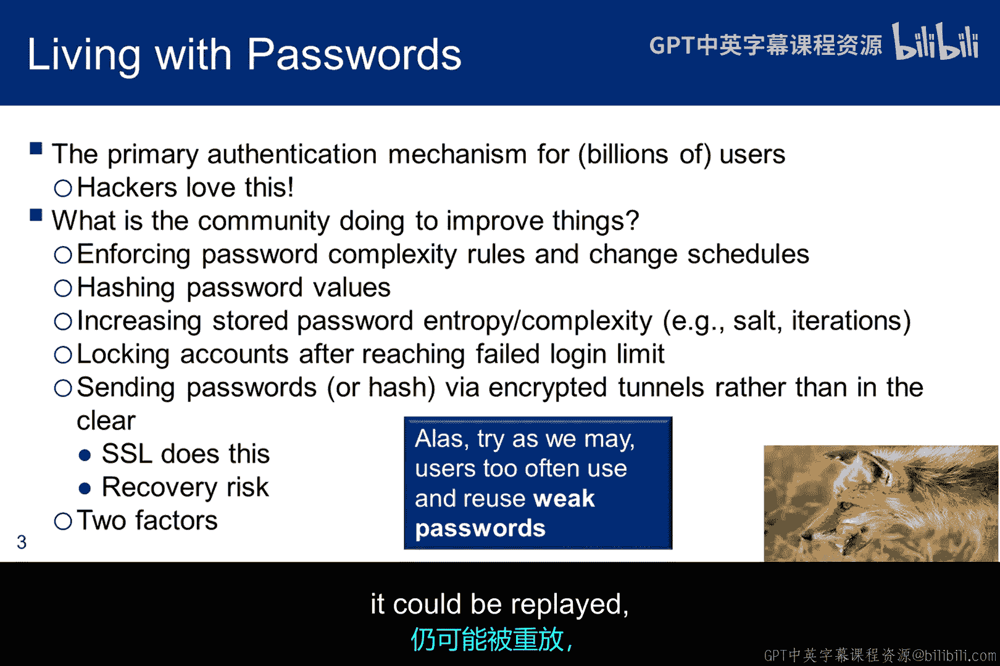

虽然并非所有网站都强制执行，但许多网站采用的更复杂、更安全的方法是存储哈希值，并在必要时向你发送重置链接。但即使密码是哈希凭证，根据所使用的协议，它也可能被重放。

---

## 联邦身份验证指南 📜

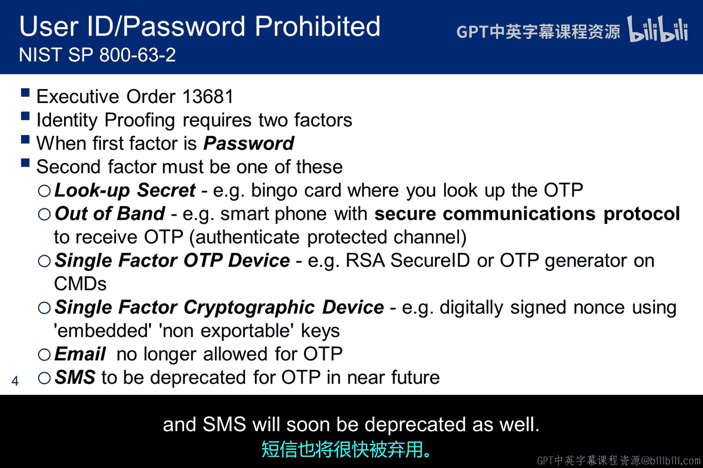

基于第13691号行政命令，NIST为联邦政府制定了新的身份验证指南。根据此指南，当密码用作认证机制时，需要第二个因素。该特别出版物讨论了六个选项。认证因素包括：1. 查找卡；2. 安全的带外连接；3. 安全ID（如一次性密码设备）；4. 嵌入式加密设备。最重要的是，电子邮件不再被授权使用，SMS短信也即将被弃用。

---

## Linux密码文件与影子文件 📁

密码曾一度以明文形式存储。它们被存储在密码文件中，今天你会在那里看到一个“x”。如果未使用影子文件，你可能会在那里看到一个密码哈希。然而，当使用影子机制时（几乎所有系统都如此配置），你只会看到“x”，并且必须查看影子文件才能看到哈希。

影子文件只能由root用户读取或写入，但它并未加密，尽管你可能期望如此。下面的屏幕截图显示了影子文件，每个用户有三个字段。第一个字段标识哈希函数。在本例中，`$6$` 表示它使用SHA-256。接下来的两个字段使用Base64编码。一个重要的事实是，这是一种简单、众所周知、可逆的编码机制，因此它不提供保密性。第二个字段包含编码后的盐。

该盐值与密码连接，然后使用第一个字段标识的算法进行哈希计算。接着所有内容都被编码。因此，盐值被编码，但以明文形式存储（除了编码本身）。所以你应该问自己，它如何为保护机制增加价值。

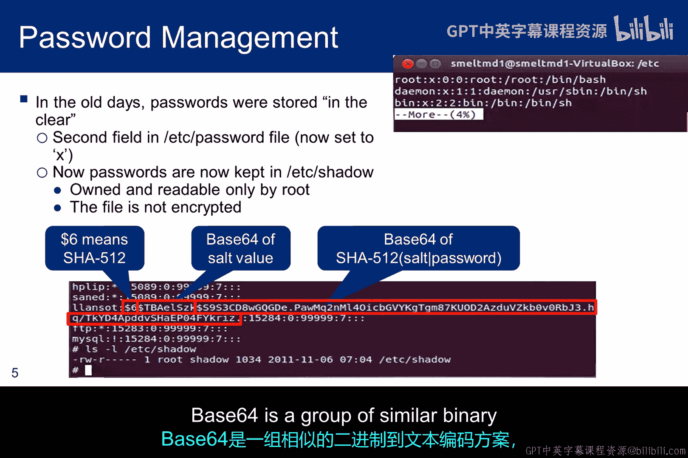

---

## Base64编码简介 🔢

Base64是一组类似的二进制到文本编码方案，它通过将二进制数据转换为Base64表示形式，以ASCII字符串格式表示二进制数据。当需要编码必须在设计用于处理文本数据的介质上存储和传输的二进制数据时，通常会使用Base64编码方案，例如电子邮件。其目的是确保数据在传输过程中作为字母数字字符保持完整，不被修改。

这种编码器已经存在很长时间了。对于Base64，算法基于6位字符串。因此，从24位二进制数据（通常被视为3个字节）开始，我们每次标记6位，直到所有数据都被标记。这些6位字符串代表ASCII表中的一个值。因此，Base64中的4个6位字符串会转换为类似 `Ka/f` 的字符。其思想是，`Ka/f` 比二进制字符串更容易通过电子邮件传输。

---

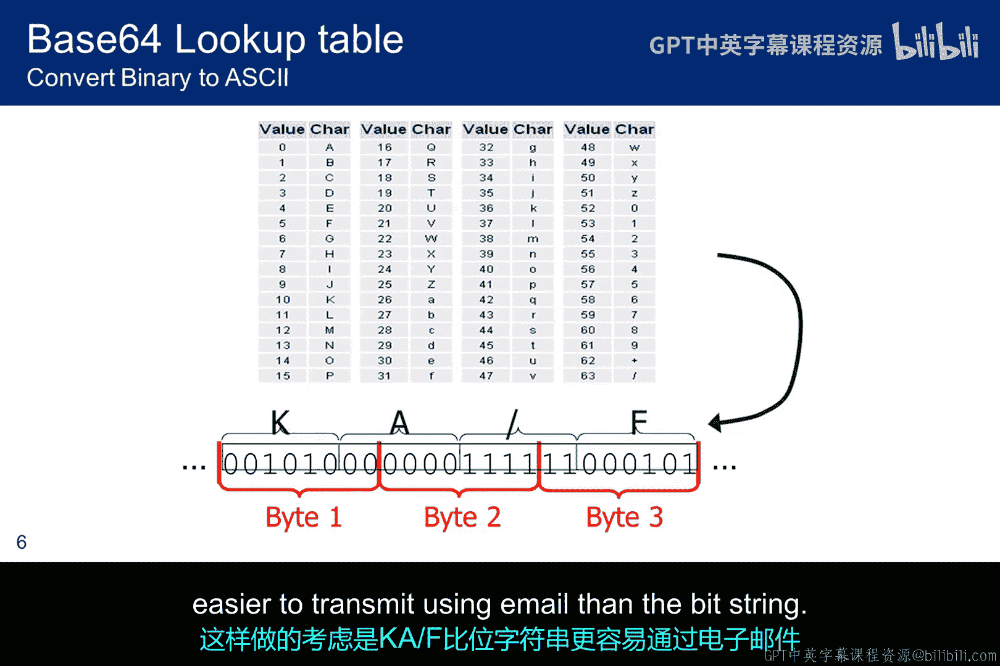

## 密码强度与密钥空间 🔑

如果加密密钥很弱，强加密的帮助就不大。对于一些系统，密钥要么是密码，要么基于密码。这些密码可能因多种原因而弱，但一个重要的影响因素是密钥空间的大小。我们确实应该使用128位密钥以确保安全。但使用8字符密码会使我们处于最多56位的密钥空间中。如果让用户选择密码，密钥空间将比这小得多。因此，无论密钥加密机制有多强，我们都需要确保密码远长于8个字符，否则就是“弱保护强”。

---

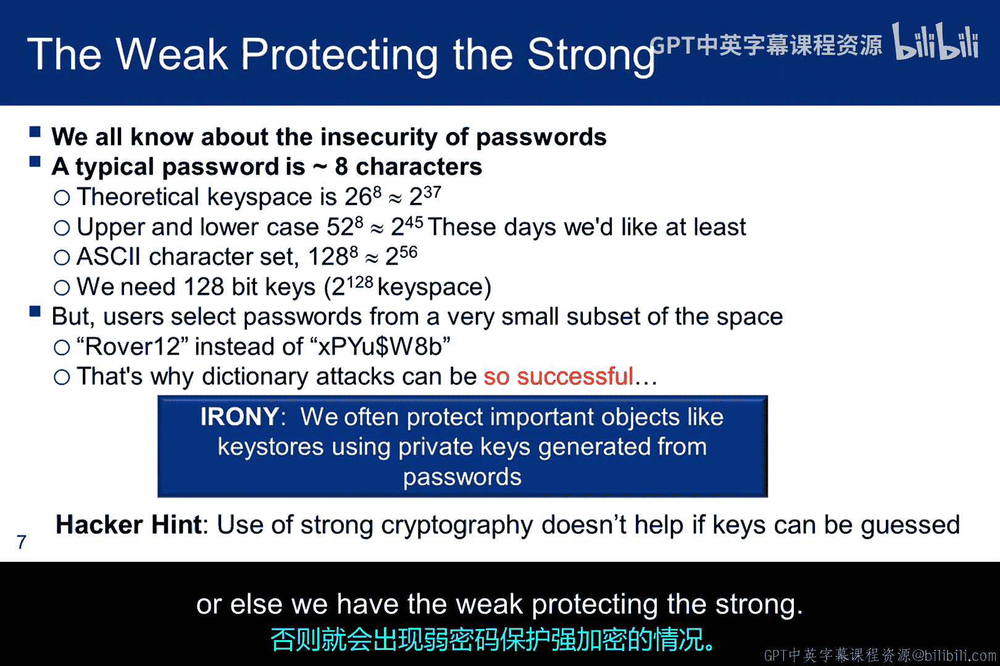

## 无盐密码的字典攻击 📖

以下是攻击者在密码未加盐时可能使用的字典示例。他从一个可能密码列表开始，这个列表可能是从类似RockYou泄露事件等来源收集的。他计算SHA-2哈希并进行Base64编码。现在，假设他已经窃取了系统的影子文件。如果用户的密码在字典中，进行查找并获取密码就很简单。他可能需要创建多个表，具体取决于系统使用的摘要大小，但一切都可以预先计算以简化攻击。

---

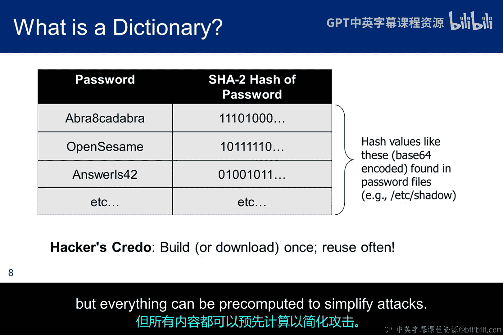

## 加盐机制的原理与流程 🧂

为了增加攻击者任务的计算复杂性，引入了盐的概念。这是一个随机数，每个用户都不同。在哈希和编码之前，用户的盐值与用户的密码连接。现在，攻击者要进行任何预计算，都必须为给定系统中用作盐的每个随机数计算字典，因为每个密码都有不同的盐。这显著扩大了攻击者必须处理的密钥空间。

以下是认证的工作原理：在创建账户时（流程顶部），生成一个盐，在哈希和编码之前将其与密码连接。然后所有内容都存储在影子文件中。当用户想要登录时，他输入ID和密码。操作系统在影子文件中查找盐值，解码它，并将其与密码连接。结果被哈希和编码，并与影子文件中存储的结果进行比较。如果两者匹配，则用户通过认证。

---

## 加盐密码的字典攻击 📊

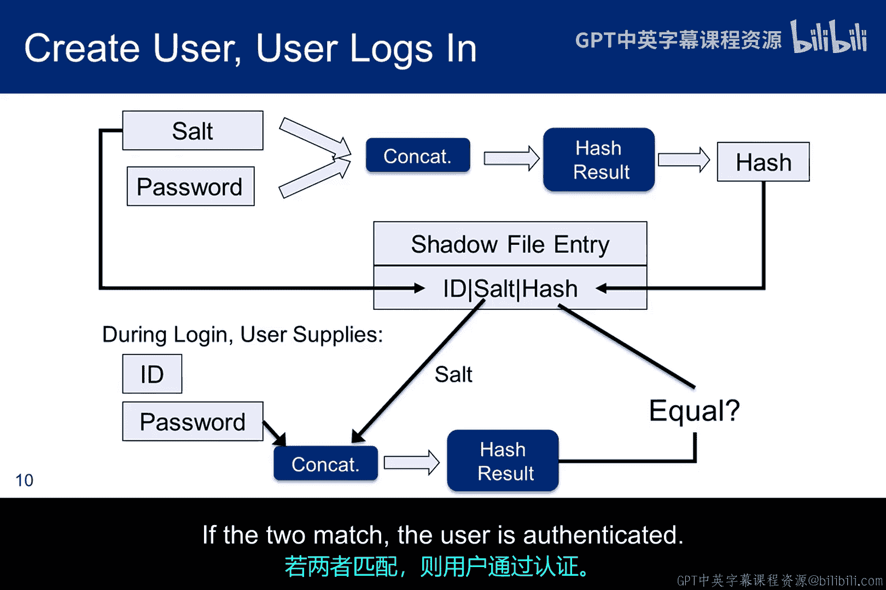

这类似于我们之前看到的表，但现在它包含了盐的概念。攻击者必须为影子文件中的每个盐创建一个这样的表。在本例中，只预计算了盐1。通过增加哈希函数的应用次数（迭代次数），可以进一步提高计算复杂性。在本例中，迭代1000次。由于使用的迭代次数也存储在影子文件中，它可以为每个用户设置不同，尽管对复杂性的影响不会很大，但管理预计算过程要复杂得多。

---

## 攻击加盐密码的步骤 ⚙️

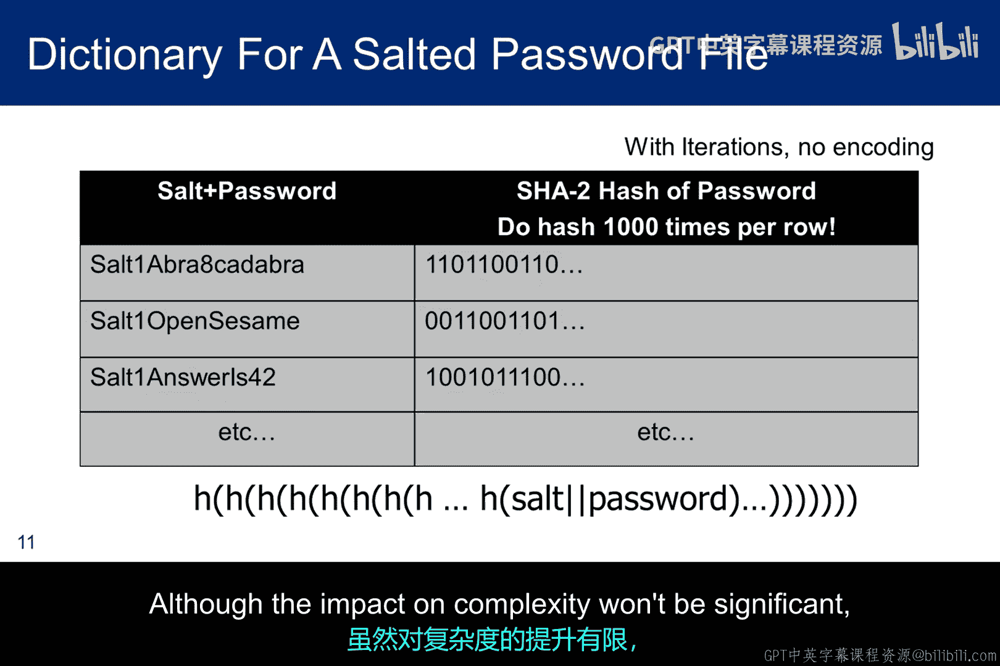

以下是攻击者在使用字典攻击加盐密码时必须经历的步骤。我进行了简化，假设每个用户使用相同的哈希迭代次数，但也可以通过可插拔认证模块（PAM）或编写脚本并使用PAM的 `succeed_if` 模块以任一方式实现。

对于每个盐，你需要一个单独的字典，迭代次数使得创建过程繁琐且耗时，特别是如果每个用户的次数不同。你还需要注意Windows系统不给密码加盐的事实。因此，如果攻击者能拿到影子文件，字典攻击可能会高效得多。由于对遗留软件的影响和需要保持向后兼容性，微软尚未做出改变。

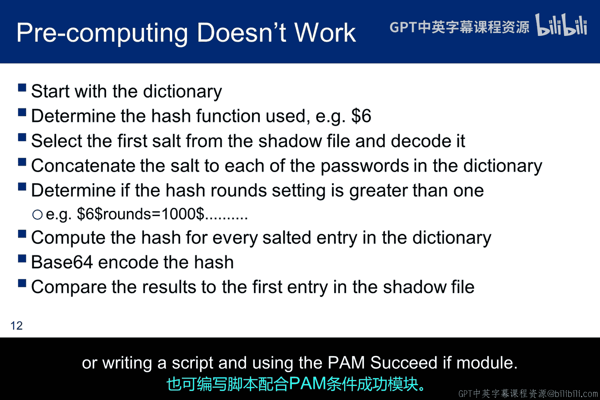

---

## 密码猜测与破解工具 🛠️

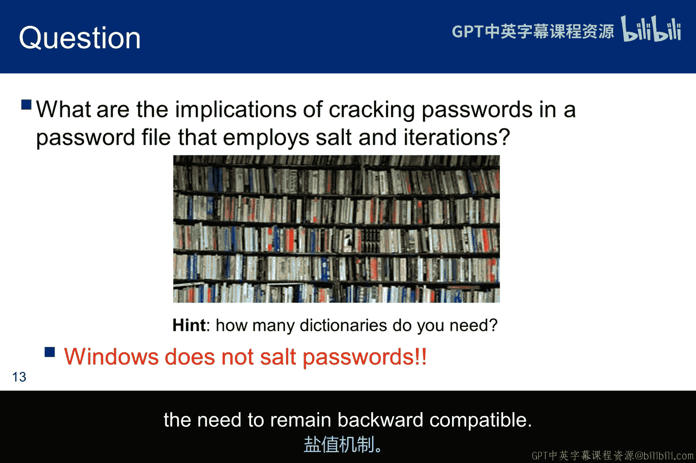

密码猜测可能是获取系统访问权限的极其有效的方法，因为许多人从不更改密码。他们重复使用旧密码，很少使用随机字符串。他们选择自己能记住的密码。但如果你猜不到密码，破解工具可以提供帮助。当密码文件未被窃取时，在线工具很有用，尽管登录尝试限制会使在线攻击复杂化。然而，如果密码文件已被窃取，则可以使用云计算和GPU集群等大规模离线资源。

我们已经讨论了哈希和加盐如何融入基于密码的认证过程，现在我们将花一些时间看看在线和离线破解。

---

## 总结 📝

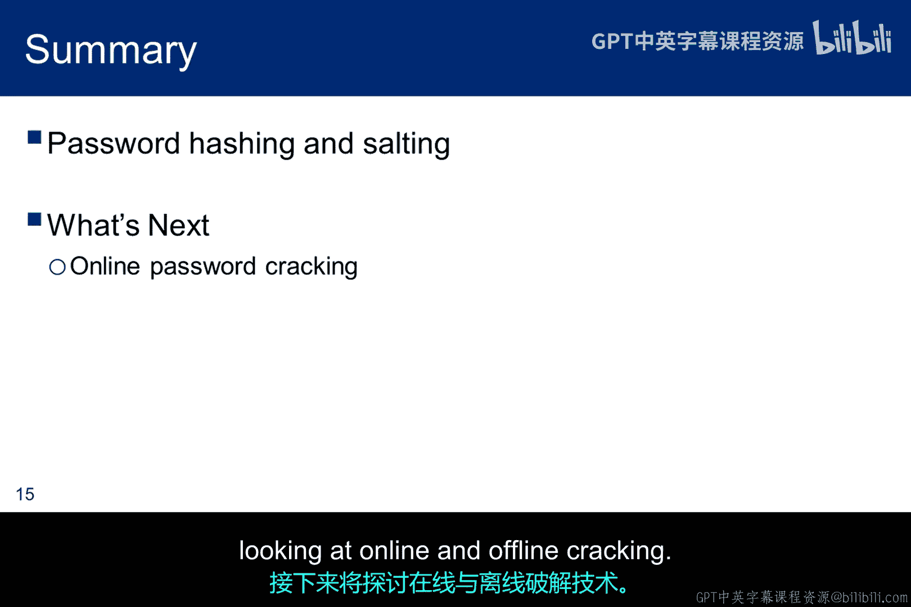

本节课中我们一起学习了密码哈希的核心概念。我们了解到，密码不应以明文存储，而应存储其哈希值。为了提高安全性，引入了“盐”——一个与密码连接后再进行哈希的随机值，这能有效抵御预计算的字典攻击。我们还探讨了Base64编码的作用、密钥空间大小对密码强度的影响，以及攻击者针对加盐和未加盐密码的不同攻击策略。最后，我们简要介绍了密码猜测和破解工具的使用场景。理解这些原理是实施和评估安全认证系统的基础。