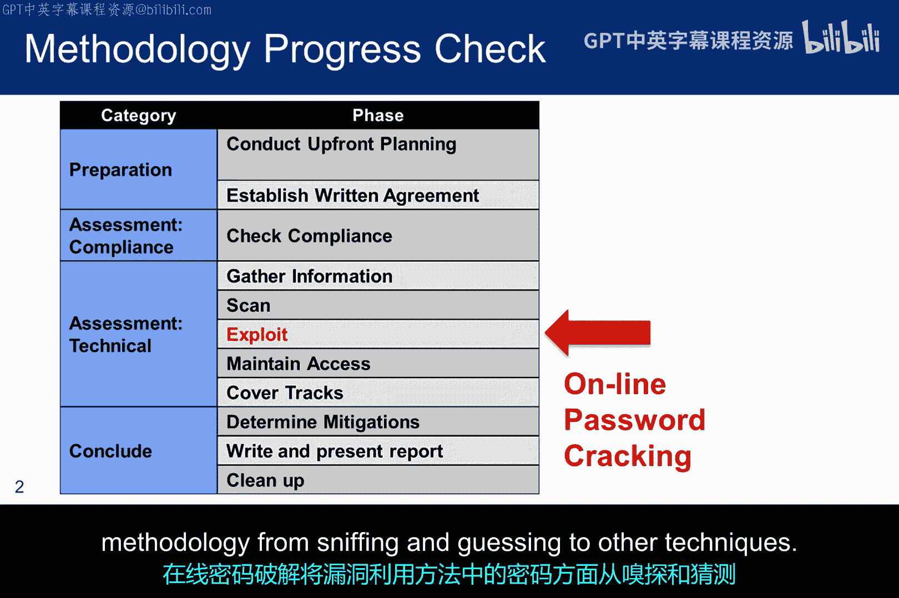
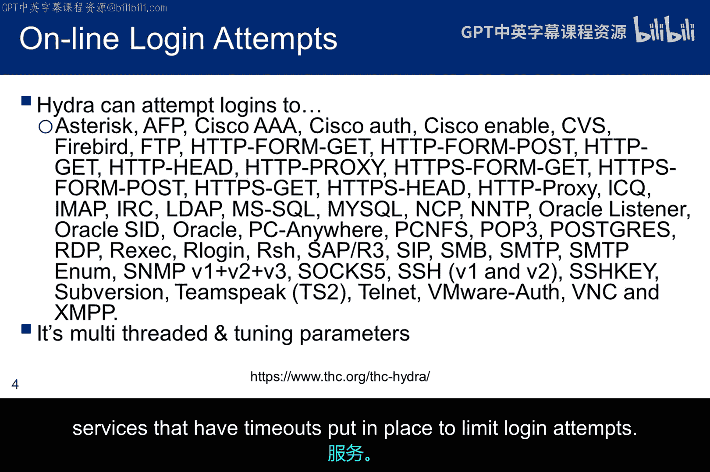
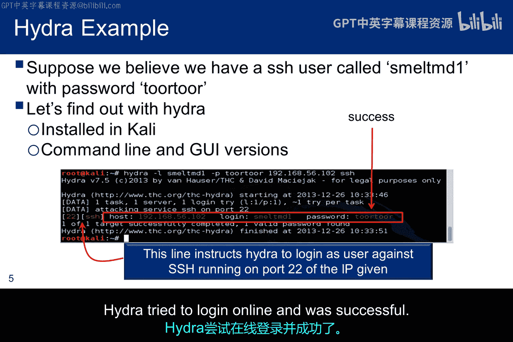
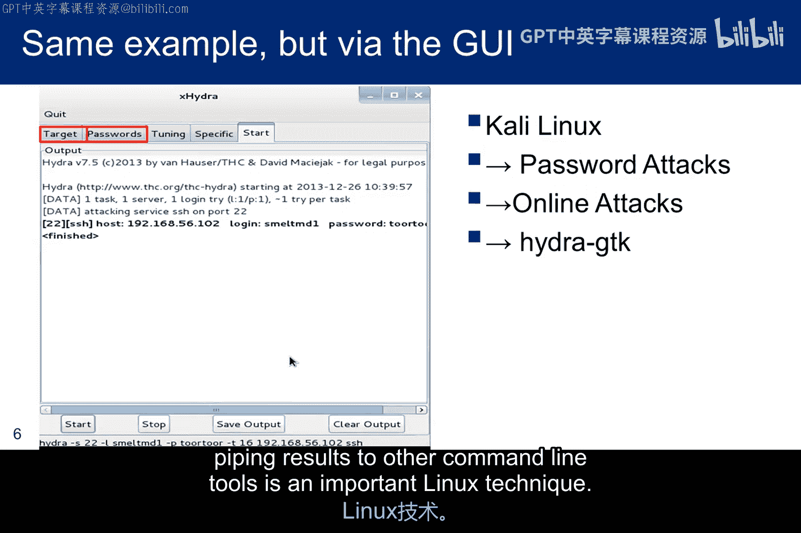
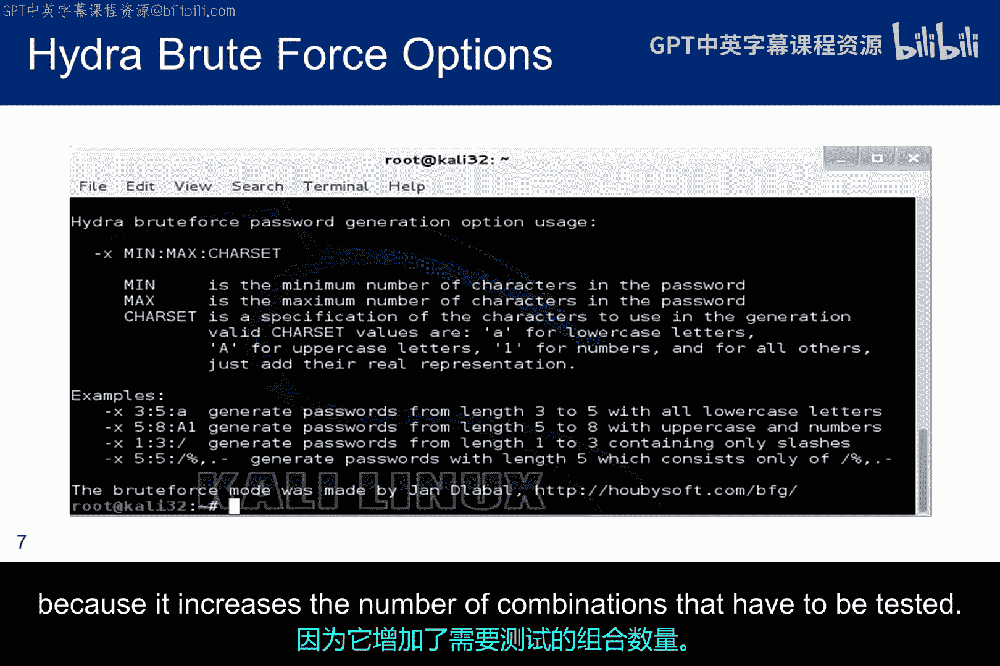
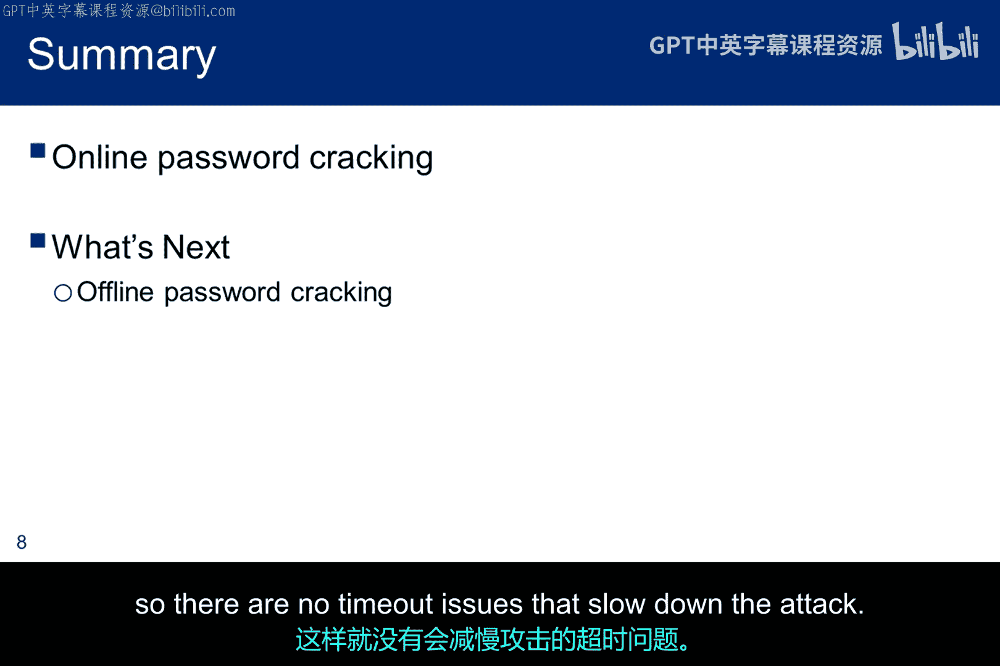

# 035：在线密码破解 🔓

在本节课中，我们将要学习一种在线密码破解工具——Hydra。在线密码破解将利用方法中的密码环节，从嗅探和猜测扩展到其他技术。



上一节我们介绍了密码在攻击方法中的重要性，本节中我们来看看如何在线尝试登录以破解密码。

## 在线密码破解工具概述

在线密码破解工具主要有两种：Medusa 和 Hydra。课程中讨论了 Medusa，因此这里只介绍 Hydra。严格来说，Hydra 并非一个“破解器”，它更像一个强大的密码猜测器。

你需要提供一个登录ID列表和一个明文密码列表，Hydra 会在线测试它们是否有效。这意味着我们首先需要利用一些社会工程学技术来获取ID，然后准备我们的密码列表，以查看我们试图在线攻破的目标是否在列表中。

## Hydra 的核心功能与特性

Hydra 还包含一个暴力破解选项，通过命令行参数可以指定尝试的密码长度和字母数字组合。

Hydra 被设计为支持多种不同的登录协议，并且是多线程的，可以同时针对多个服务器提高性能。它还包括计时控制功能，用于尝试欺骗那些设置了超时限制以阻止多次登录尝试的身份验证服务。



以下是 Hydra 支持的部分协议：
*   SSH
*   FTP
*   HTTP
*   SMB
*   数据库协议

## Hydra 使用示例：攻击 SSH 服务

假设通过社会工程学，你发现 `smeltMD1` 可能是一个有效的用户 ID。并且你知道在 Kali 黑客社区中，`Tor` 是一个常用密码。当 `Tor` 无效时，你决定尝试 `Toor`。

使用的命令行如下：
```bash
hydra -l smeltMD1 -p Toor 192.168.1.10 ssh
```
该命令向 Hydra 提供了猜测的用户 ID、猜测的密码、服务运行的 IP 地址以及要攻击的服务名称。由于未提供端口信息，Hydra 会假设使用标准的 SSH 端口 22。Hydra 尝试在线登录并获得了成功。



## GUI 版本与命令行版本

如果你更习惯图形界面，Hydra 也提供了 GUI 版本。但我始终推荐使用命令行版本，因为 GUI 版本可能无法提供所有选项，并且将结果通过管道传递给其他命令行工具是一项重要的 Linux 技术。



## 暴力破解选项详解

`-x` 暴力破解选项允许你指定尝试密码的最小长度和最大长度。这一点很重要，因为最大长度决定了攻击将持续多长时间，尤其是在 Hydra 需要在尝试之间等待以欺骗服务器的情况下。

字符集规范也会影响暴力破解的时间，因为它增加了必须测试的组合数量。
```bash
hydra -l username -x 6:8:a1 192.168.1.10 ftp
```
此命令示例表示对用户 `username` 尝试 6 到 8 位长度，由小写字母和数字组成的密码。



## 总结与下节预告

本节课中我们一起学习了 Hydra，它是众多通过实际尝试在线登录来破解密码的工具之一。Hydra 通过多线程、协议支持和计时控制，能够有效地进行在线密码猜测和暴力破解。



接下来，我们将学习当密码文件被提取后如何进行破解，那样就没有超时问题会减慢攻击速度了。