# 036：离线密码破解 🔑

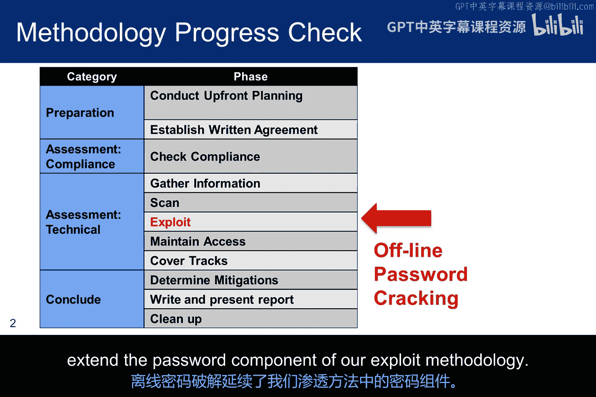

在本节课中，我们将要学习离线密码破解的过程，特别是如何使用“John the Ripper”工具对已提取的密码文件进行攻击。我们将从基本概念入手，逐步讲解操作步骤和脚本示例，最后讨论密码安全性的核心原则。

## 离线密码破解概述

离线密码破解是一个两步过程。第一步是提取密码文件，第二步是对该文件运行攻击。本次讨论的重点是流程中的第二步，即攻击密码文件。

## 使用 John the Ripper 工具

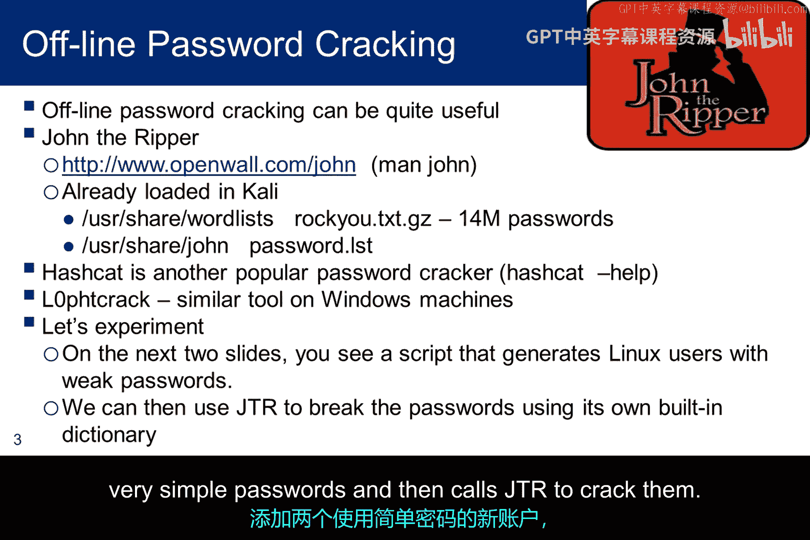

在渗透测试方法论中，离线密码破解延续了我们对密码组件的利用。John the Ripper 和 hashcat 是渗透测试实验室中需要的两个工具。虽然我们不会详细讨论 hashcat，但网上有大量文档，并且 Kali 系统内置了 hashcat 帮助文件可供参考。Loft crack 是 Windows 上一个类似的工具，我们不会使用它。但由于我们已经创建了 Windows 虚拟机，您可能想用它进行实验。

对于 Linux 系统，我们可以使用 root 权限复制密码文件。然而，在 Windows 系统上提取 SAM 文件则稍微棘手一些，因为系统运行时，Windows 会对 SAM 文件保持独占锁定。一种常见的方法是使用 Linux 实时 USB 启动硬件，将 Windows 磁盘挂载到 Linux 操作系统上，然后复制文件。根据构建方式，Linux USB 也可能存在持久性问题。

## 扩展攻击面与脚本示例

在将攻击面扩展到包含现有账户的密码和影子文件以及潜在的复杂密码之前，我们可以先看一个简单的脚本。该脚本添加两个具有非常简单密码的新账户，然后调用 JTR 来破解它们。

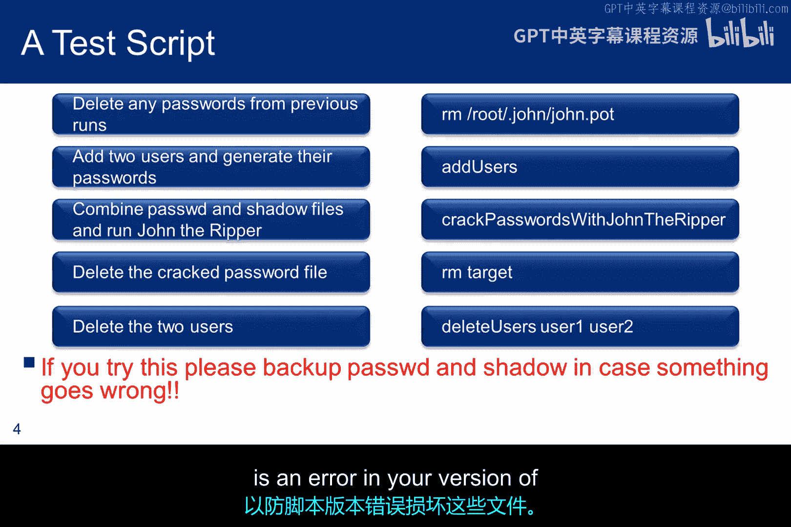

以下是脚本的主要逻辑块，您可以将其视为伪代码：

*   **第一步**：删除脚本先前运行可能遗留的任何密码文件。这只是一个预防性的错误控制措施。
*   **第二步**：添加两个使用弱密码的新用户。
*   **第三步**：John the Ripper 依赖于将 `/etc/passwd` 和 `/etc/shadow` 文件合并为一个文件，这通常称为“unshadow”。这是脚本的下一步。
*   **第四步**：运行 JTR，并将破解出的密码存储在一个名为 `target` 的文件中。
*   **第五步**：通过删除包含破解密码的文件并从系统中移除新添加的用户来进行清理。

如果您决定运行此脚本，建议备份密码和影子文件，以防脚本版本中的错误损坏这些文件。

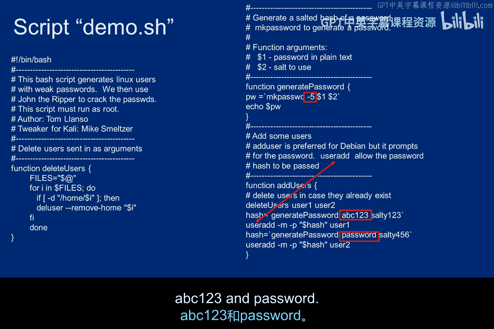

## 脚本细节与执行

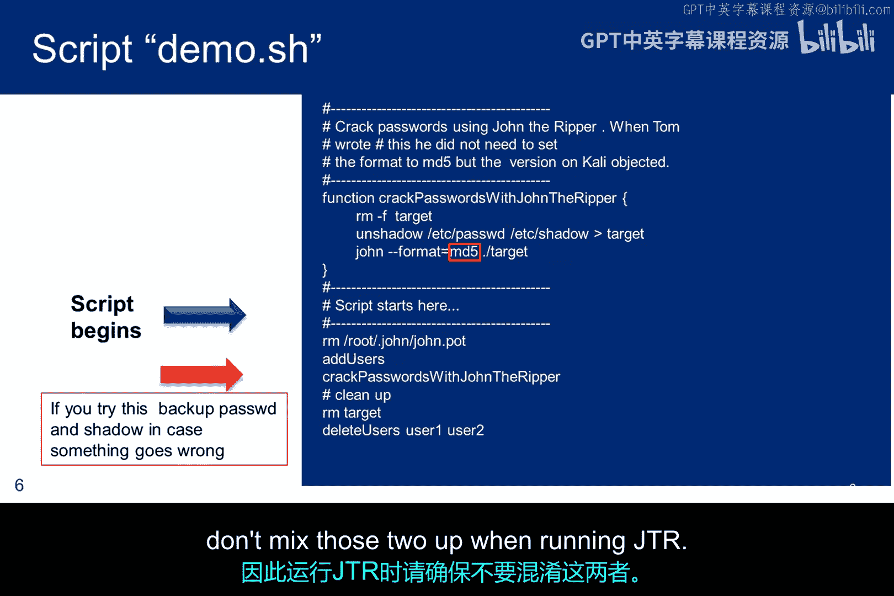

脚本的第一部分定义了函数，但实际执行始于脚本的另一部分。您应该自行通读脚本，但这里有几个要点需要注意：

1.  在 `generate_password` 函数中，`-t 5` 表示哈希算法将是 MD5，我们需要在运行 JTR 时告知它这一点。
2.  像 Kali 这样的 Debian 发行版通常使用 `adduser` 命令来添加用户，但该命令会提示输入密码。因此，脚本使用 `useradd`，它允许通过 `generate_password` 生成哈希，然后传递给 `useradd`。
3.  最后，请注意简单的密码：`abc123` 和 `password`。

脚本的入口点显示了函数和系统调用，与之前展示的伪代码相同。请注意，JTR 调用中使用了 `-format=md5` 来指定哈希格式。`crack` 函数中的 `unshadow` 命令合并了密码和影子文件。我们确实使用 MD5 添加了用户，但 Kali 通常使用 SHA-512 创建影子文件。因此，在运行 JTR 时，请确保不要混淆这两者。

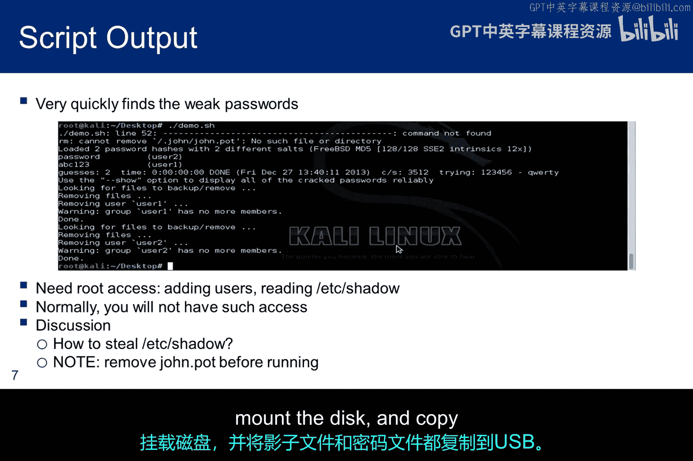

## 运行结果与 JTR 工作阶段

运行脚本后的屏幕截图显示，John 很快找到了弱密码。请记住，您需要 root 访问权限才能读取影子文件，因此脚本要正确运行以进行“unshadow”操作，就需要 root 权限。显然，这在 Kali 上不是问题，但如果您尝试在其他虚拟机上编写脚本，则可能是个问题。

如果您不是攻击自己的系统，捕获影子文件的方式与之前讨论的捕获 SAM 文件的方式大致相同：使用您拥有 root 权限的 Linux 实时 USB 启动硬件，挂载磁盘，并将影子和密码文件都复制到 USB。

JTR 在尝试破解密码时会经历三个阶段：

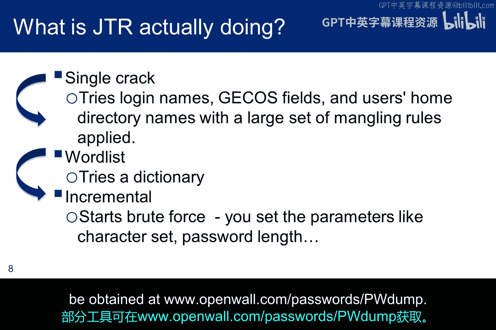

*   **单一破解阶段**：它尝试使用登录名、用户全名和用户主目录名作为候选密码。所有这些都可在密码文件中找到，并且会对这些字段的内容应用大量变形规则。
*   **字典攻击阶段**：JTR 使用单词列表。如果未在命令行中指定用户的单词列表，JTR 将使用其默认单词列表 `pass.lst`。该词典有限，因此通常提供自定义列表会更有效。
*   **增量破解阶段**：这是一种暴力破解方法。在此阶段，您必须指定密码中使用的字符集和密码长度，类似于 Hydra。

## 密码列表与图形界面

屏幕截图显示，Kali 在 `/usr/share/wordlists` 目录下提供了其他几个单词列表，而 JTR 的单词列表不包含在该目录中。RockYou 可能是最著名的列表，因为它源自 2009 年的一次在线游戏数据泄露，包含了 3200 万个密码。一个有趣的点是，如果您将 139 MB 的文件大小转换为字节并除以 3200 万，得到的平均密码长度为 4.5 个字符。Kali 附带的版本只有 1400 万个密码，而不是 3200 万个。因此，我推测其中超过一半的密码选择非常糟糕，以至于需要从任何体面的词典中剔除。

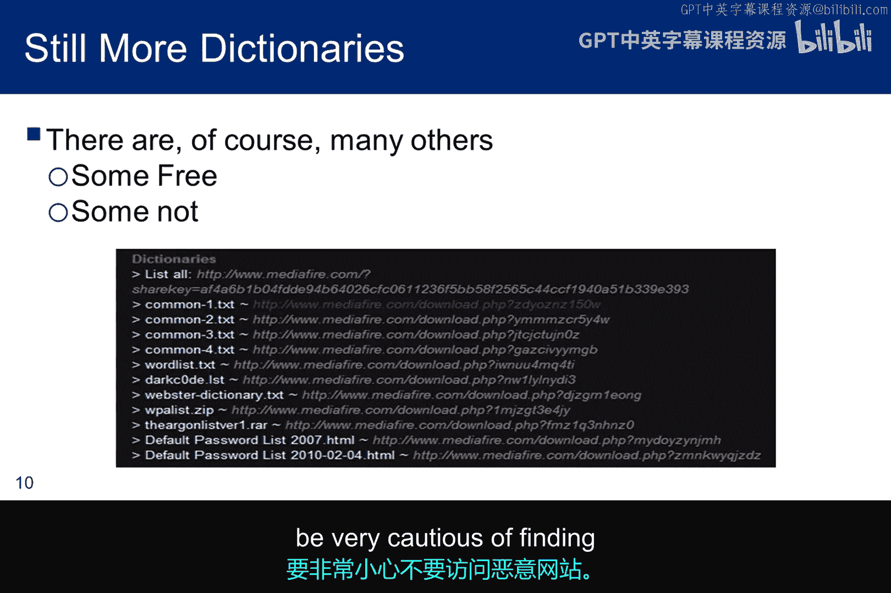

互联网上有可用的词典，但许多并非免费。也就是说，如果您在互联网上寻找密码列表，请非常小心，以免访问恶意网站。

像大多数工具一样，JTR 有一个名为 Johnny 的图形用户界面版本。此屏幕截图非常陈旧，因为自那次运行以来 GUI 已经更新。但重要的是，就像 JTR 一样，Johnny 确实会运行所有三个破解阶段。我曾将 `webgoat` 用作 WebGoat 的密码，Johnny 在大约两分钟内就破解了它。而密码 `t0r0nt0` 在运行 17 小时后仍在破解中，这告诉您，在增量阶段，虚拟机缺乏破解复杂密码所需的计算能力。

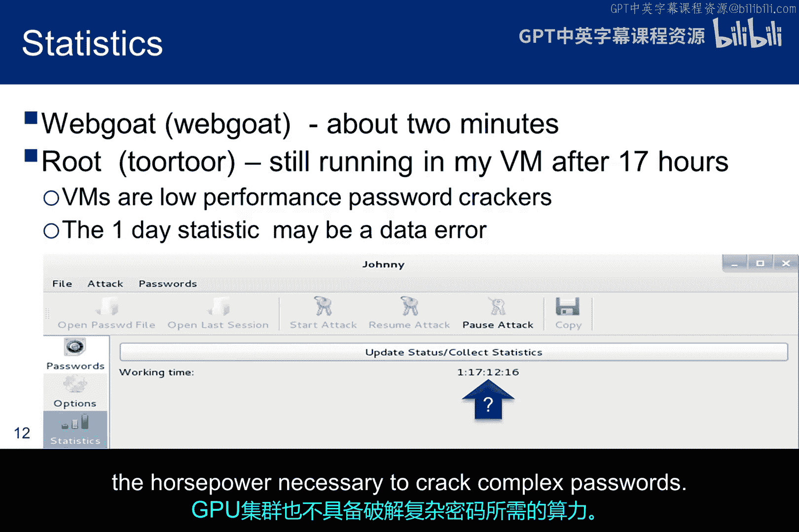

## 高级破解与密码安全原则

这是一张 GPU 密码破解集群的图片。声称它能在不到 6 小时内破解每个标准 Windows 密码是具有误导性的，因为暴力破解显然取决于密码的长度限制。更有意义的是指出，它每秒可以进行 3500 亿次猜测。

这是一幅 XKCD 漫画，它指出常见的字符替换和添加键盘符号可能不是密码的最佳选择。另一方面，从常见短语中选取单词，如“four score”或“20 years ago”，也同样脆弱。即使是知名口令的首字母也很脆弱。黑客也知道这些短语。

难以破解的密码来自于选取多个随机单词并将它们串联在一起。换句话说，它不是任何人以前听过的短语。因此，它可能不会出现在词典中，并且也增加了复杂性，从而显著提高了对抗暴力破解工具的能力。我们大多数系统管理员甚至通过要求我们添加数字、键盘字符和大写字母来进一步增加复杂性。顺便说一下，这是一幅漫画，所以我猜其中的熵值数字可能站不住脚。

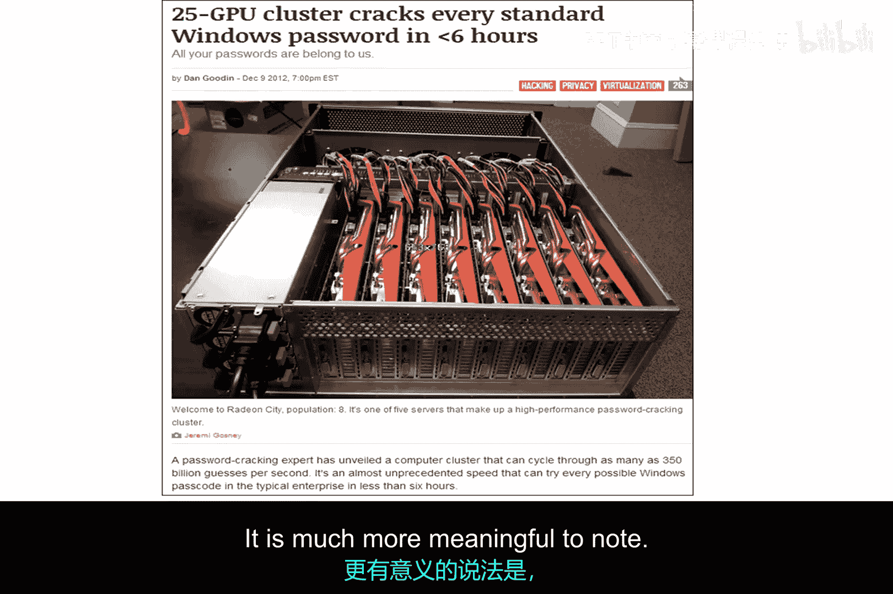

## 总结与下节预告

本节课中，我们一起学习了离线密码破解的核心流程，掌握了使用 John the Ripper 工具进行密码攻击的基本方法，并通过脚本示例理解了自动化操作。我们还探讨了密码强度的重要性以及暴力破解的局限性。

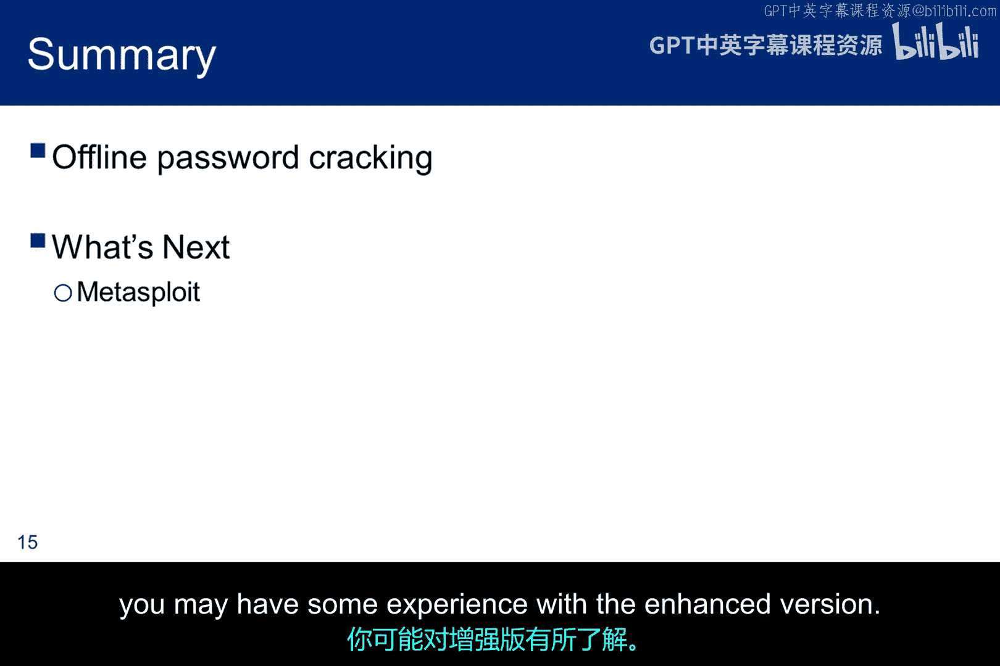

这完成了我们渗透测试阶段中密码组件部分的学习。现在，我们希望继续学习一个更著名的漏洞利用工具，称为 Metasploit。我们将使用免费版本，但专业版本具有显著增强的功能。如果您在从事渗透测试的组织中工作，可能对增强版有一些经验。请在讨论板上分享。