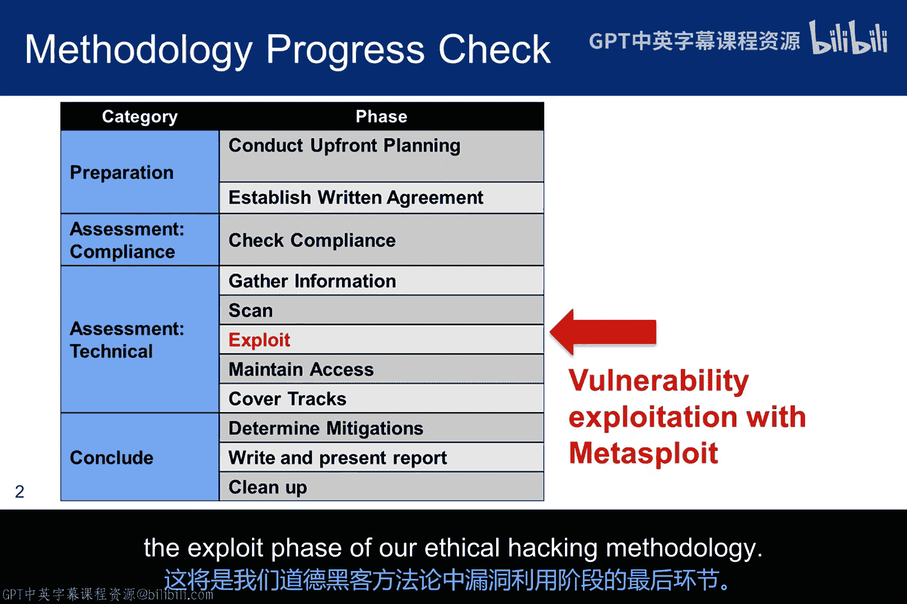
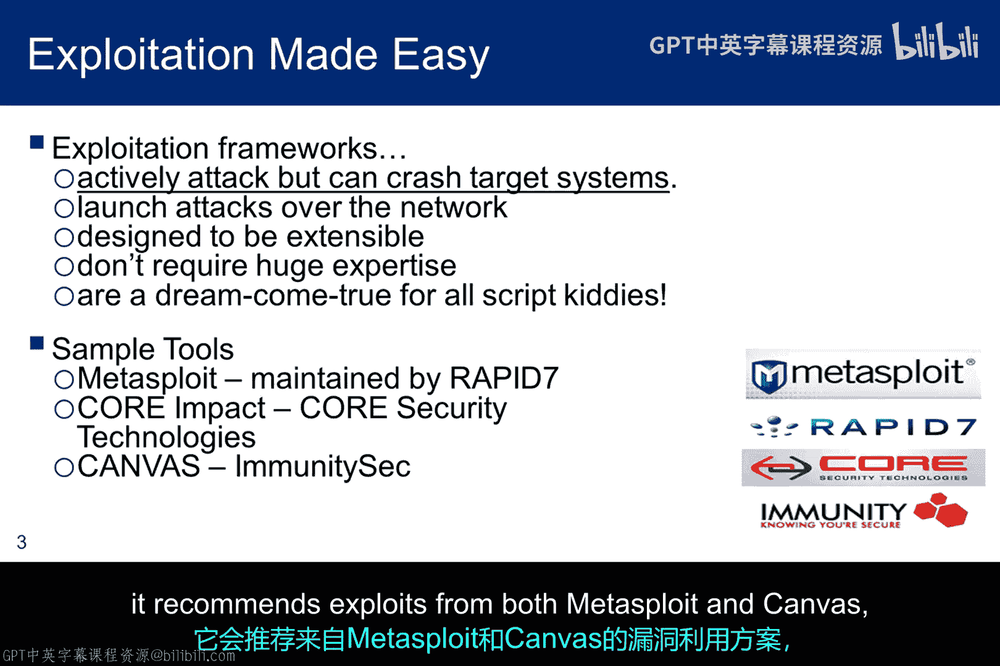
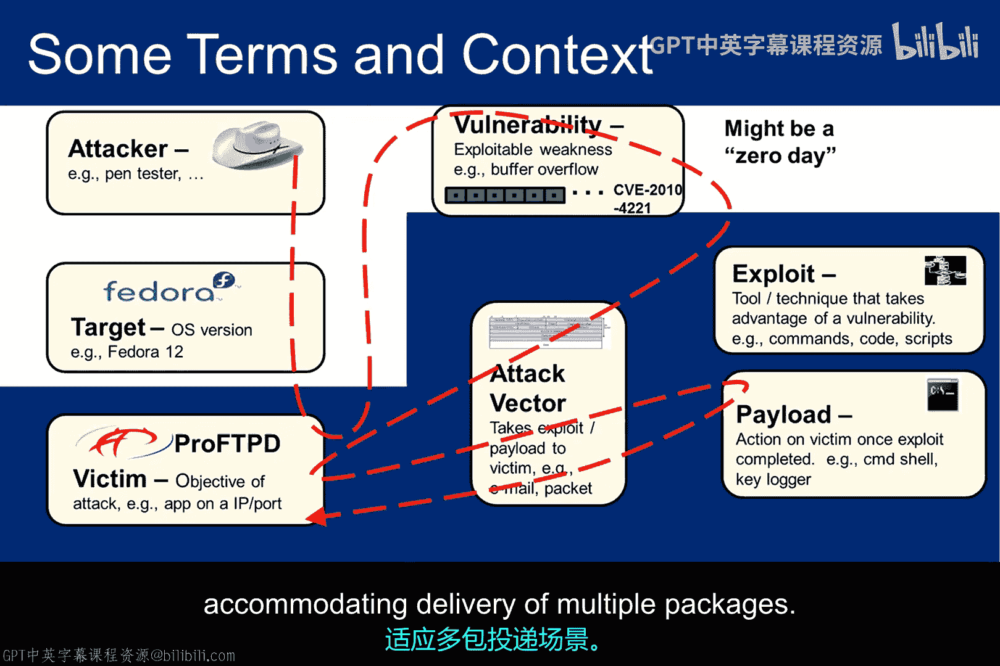
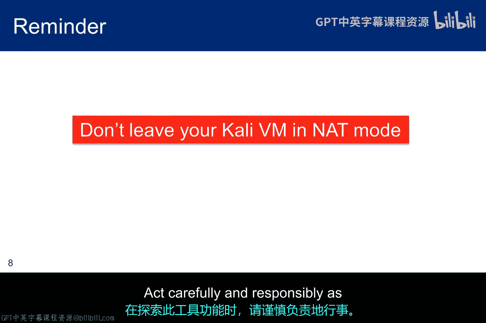
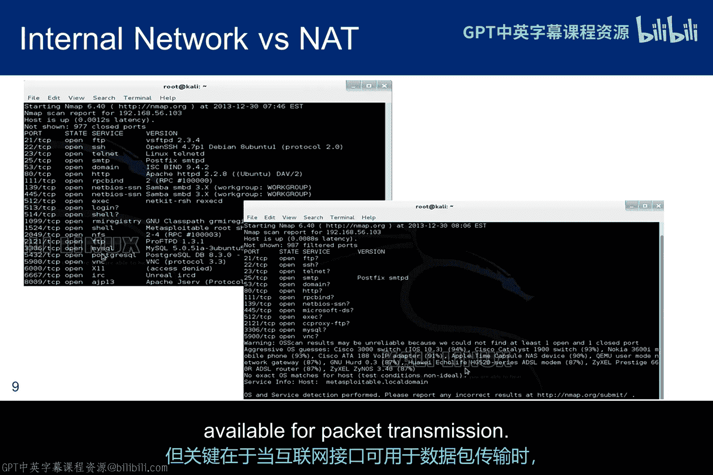
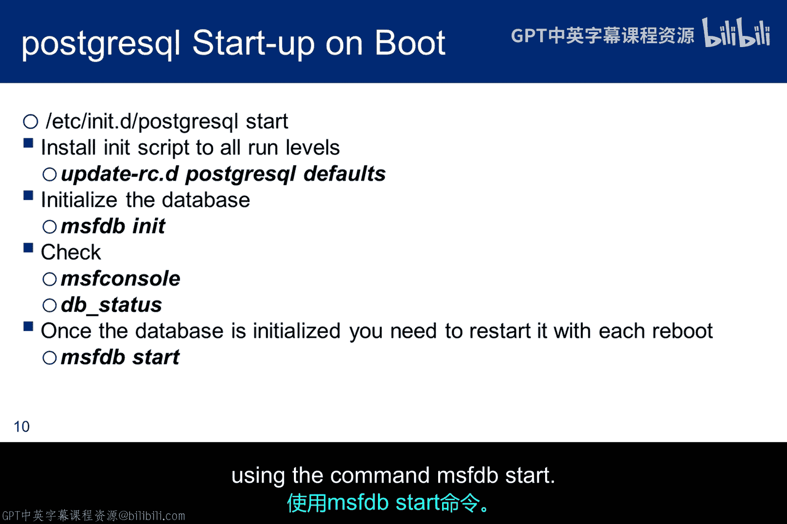
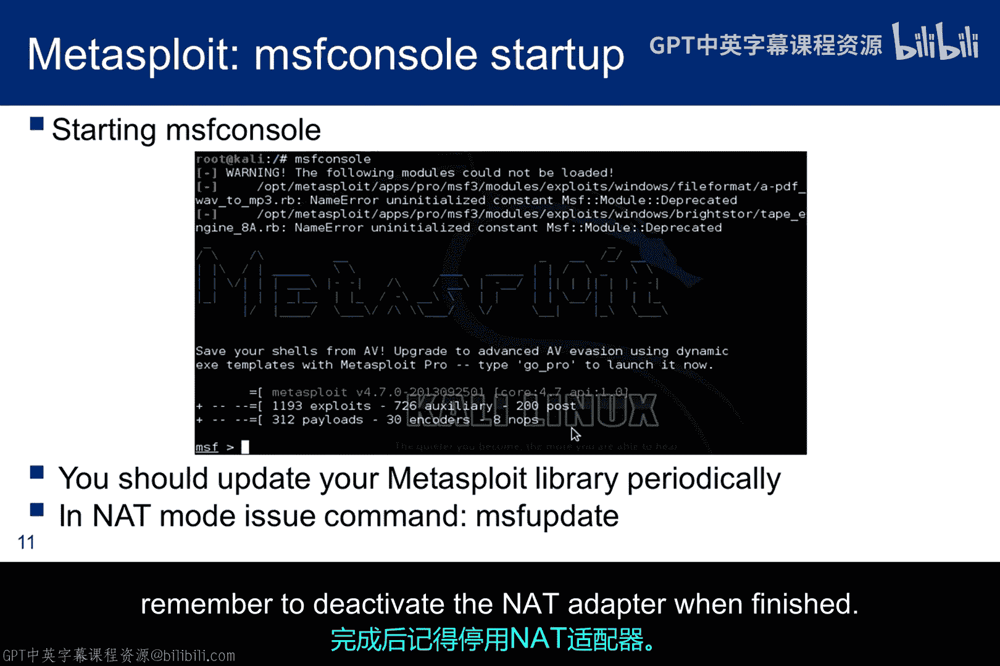
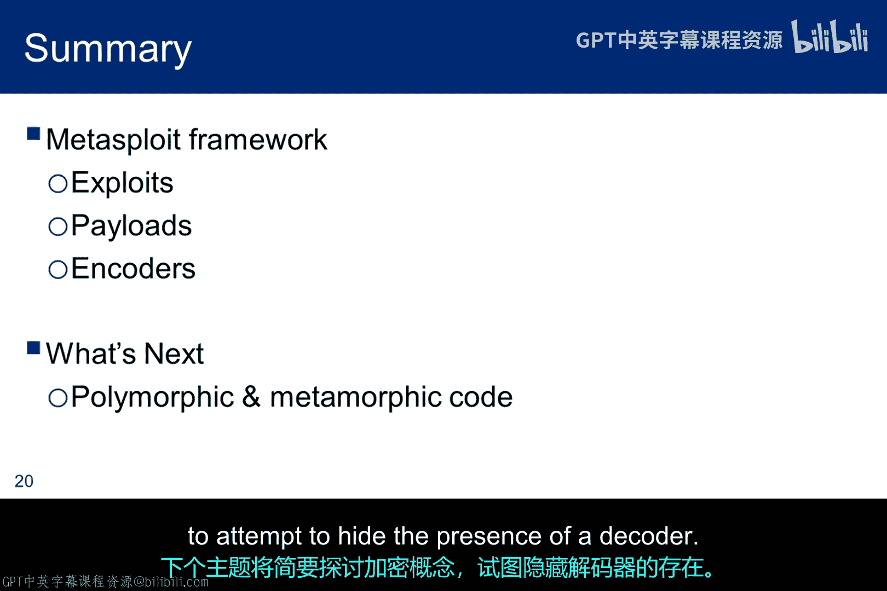

# 037：漏洞利用实践 🛠️

在本节课中，我们将学习如何使用一个漏洞利用工具。这是我们在道德黑客方法论中，漏洞利用阶段的最后一块内容。

上一节我们介绍了漏洞的概念，本节中我们来看看如何实际利用它们。

## 漏洞利用工具简介

接下来，我们将深入探讨一个漏洞利用工具的使用。如前所述，存在多种工具，但我们将使用 **Metasploit**。这是一个红队成员和脚本小子都使用的知名工具。

## 利用框架的优势

利用框架有许多优点，但可扩展性可能是最重要的。因为这允许多个参与者向社区贡献新工具。基于框架的设计也促进了工具的流行，因为它使工具更易于使用。即使对技术细节的理解非常有限，也能使用。当然，这也使其在脚本小子中很受欢迎。

关于利用工具需要记住的一点是，它们可能导致系统崩溃，因为利用程序可能产生意想不到的效果。

以下是三个工具（还有其他工具）。当Nessus识别出潜在漏洞时，它会推荐来自Metasploit和Canvas的利用程序。因此，它们在渗透测试社区中是集成的。

## 利用与载荷：两步过程

我们在关于黑客背景的讲座中讨论过这张幻灯片。但在这里，我添加了蓝色背景来突出利用漏洞和投递载荷的两步过程。

洛克希德·马丁公司提出的网络杀伤链为这个画面提供了一个略有不同的视角。该模型使用以下术语：
*   **武器化**：将漏洞利用程序与后门程序结合成可投递载荷的步骤。
*   **投递**：通过电子邮件、网络、USB等方式将武器化捆绑包发送给受害者。
*   **利用**：利用漏洞在受害者系统上执行代码。
*   **安装**：在资产上安装恶意软件。

这两种观点没有显著差异。但当你学习Metasploit时，你会发现漏洞利用程序和载荷可能是分开发送的。杀伤链更紧密地与电子邮件或USB攻击向量耦合，而与网络投递的关联性较弱，后者可以适应多个包的投递。

## Metasploit框架详解

Metasploit大约在2003年使用Perl脚本创建。它最终用Ruby重写。如果你想向框架贡献利用程序，你需要具备良好的Ruby知识。

2009年Rapid 7收购Metasploit时，协议的一部分是必须始终有一个免费版本，而Rapid 7也一直维护着该版本。它有三种用户界面，但我只讨论`msfconsole`。如果你偏好其他界面，欢迎在实验中使用。在线教程非常全面，如果你有时间，值得在 `www.offensive-security.com/metasploit-unleashed` 上探索。

Metasploit被称为框架，是因为它是一种模块化、可插拔的架构，易于添加和使用他人贡献的利用程序。这里显示的架构是简化的，顶部显示了三个用户界面，底部显示了重要的插件。

*   **利用插件**：利用某些漏洞（如缓冲区溢出）的代码。
*   **载荷示例**：缓冲区溢出后执行的shell代码。
*   **编码器示例**：从发送到缓冲区的数据包中移除空字符（即字符串终止符）的工具。

编码器还试图隐藏利用程序，使其不被入侵检测系统和防火墙发现。然而，它们的效果并不理想，因为供应商也会跟踪新的编码器，并调整其检测机制以适应新的编码器。Metasploit提供了几种编码器，如果用户没有明确指定，它会默认选择一个。

## 使用Metasploit的流程

使用Metasploit的过程始于侦察、信息收集和扫描。一旦识别出潜在漏洞，用户必须告诉Metasploit尝试哪个利用程序。

选择利用程序后，Metasploit会筛选出适用的载荷列表，用户必须选择一个载荷。然后可以设置三组IP地址：
*   `LHOST` 通常是本地主机，即攻击机器（在我们的案例中是Kali）。
*   `RHOST` 是远程主机或目标。
*   `SRVHOST` 通常是设置监听器的地方，等待目标上的载荷回连。对于实验，我们将在Kali上启动监听器。

## 数据库与注意事项

Metasploit还有一个PostgreSQL数据库来跟踪与目标网络相关的活动。它允许快速方便地访问扫描信息，并能够从各种第三方工具导入和导出扫描结果。这些信息可用于快速配置模块选项，但最重要的是，它使结果保持整洁有序。

这只是一个提醒，Metasploit需要在你的道德黑客环境中使用。在互联网上冒险很可能违反《联邦计算机欺诈和滥用法案》以及众多州法律。在探索此工具功能时，请谨慎、负责任地操作。

## 环境配置与启动

此屏幕截图显示，如果你保持NAT接口开放，可能会得到更有限的结果。当然，这些是Nmap扫描结果，不是Metasploit结果。但重点是，当接口可用于向互联网传输数据包时，工具的行为会有所不同。

这些是让PostgreSQL在启动时启动的说明。但即使配置好后，每次Kali重启后，你仍然需要使用命令 `msfdb start` 为Metasploit启动数据库。

此屏幕截图显示了Metasploit的启动。显示底部是关于你的版本中可用的利用程序、载荷和编码器数量的信息。你应该定期更新你的版本，但提醒一下，完成后记得停用更新器。

## 核心组件：利用、载荷与编码器

在Metasploit中，术语 **利用** 指的是一种利用缺陷的技术。它可以执行缓冲区溢出、利用配置错误或进行注入。如果程序员在检查输入时粗心大意，就可能被利用。

利用程序有评级。一旦你识别出一个关键漏洞，你可以在Metasploit中搜索相关的利用程序。通常不止一个，但它们并非生而平等，评级提供了可靠性的相对比较。分数越高，利用程序成功的可能性越大，导致目标崩溃的可能性越小。

一旦你在目标上获得立足点，Metasploit提供了可以在被攻陷目标上运行的 **后期利用模块**，用于收集证据、提升权限并深入目标网络。

如前所述，Metasploit将利用程序与载荷分开。一旦利用程序利用了缺陷，**载荷** 就代表了恶意活动。它可能执行一个程序，或提供一个攻击者可用的shell。最后一个要点显示了一个重要的概念：载荷可能在目标上启动一个监听器，攻击者必须连接到它。攻击者也可以在攻击机器上启动一个监听器。在这种情况下，载荷会回连并创建一个所谓的 **反向shell**。

通常更倾向于反向连接，因为它们被防火墙检测到的可能性更小。此外，目标上没有运行等待连接的监听器，这减少了被管理员发现的可能性。

在这个例子中，监听器在Kali上启动。利用程序被发送到远程主机，然后是载荷。当载荷执行时，它回连到攻击机器，创建一个C2通道。此时，攻击者可能只是交互式地使用shell，或者Metasploit可能发送额外的载荷，如后期利用载荷，或者一个非常特殊的载荷，用于创建一个非常特殊的shell，称为 **Meterpreter**。

**编码器** 改变载荷代码有几个原因。一个原因是消除某些嵌入字符。例如，空字符会给字符串复制带来问题，而字符串复制经常在缓冲区溢出利用中被利用。因此，需要从攻击数据包中移除空字符。

另一个原因是编码提供了一种隐藏于防御机制的方法。进行多次编码会使恶意代码签名的创建复杂化。例如，假设攻击者对一个众所周知的载荷编码10001次，但防御方只有最多10000种不同编码的签名。编码带来的挑战是，每次编码都会增加载荷大小。为了支持自动解码，攻击者必须提供解码器。在这种情况下，正是解码器提供了攻击签名。因此，编码多少次并不重要。

我们稍后将讨论变形和多态病毒的概念，其核心思想是规避防御方识别解码器的能力。如前所述，Metasploit必须发送解码器，以便载荷能在目标上解码和执行。

像利用程序一样，编码器也有评级。有些比其他的更好。Metasploit提供了一个默认解码器，它已从 `shikata_ga_nai` 更改为 `powershell_base64`。

`msfvenom -l` 将列出所有可用的编码器及其评级。有超过30种。`msfvenom` 也是一个有趣的工具，因为它可以用来生成恶意载荷。事实上，我们将在实验中使用它来创建针对Windows 7的利用程序。

## Meterpreter：高级载荷

如前所述，在第一个载荷（例如，创建反向shell）执行后，可能会发送第二个载荷，一个非常特殊的载荷会创建一个独特的、特殊用途的shell，称为 **Meterpreter**。

Meterpreter 针对 Windows 机器具有更多功能。因此，对于我们的大多数实验，它不会扮演重要角色，但我会演示一个针对 Windows 机器的选择，向你展示它的强大之处。一个非常重要的方面是，Meterpreter 启动时不会创建新进程，因此更难被检测到。

Meterpreter 的一个重要功能是 `migrate` 命令，它将 Meterpreter 服务器迁移到不同的进程中。服务器最初以被利用进程的权限启动。但如果该进程死亡，Meterpreter 服务器也会死亡。例如，利用 IE 浏览器很常见，因为它有很多漏洞。但如果浏览器被关闭，Meterpreter 服务器就会死亡。`migrate` 提供了一种将其移动到持久进程的方法。

如黄色高亮所示，一旦反向shell建立，Metasploit将发送载荷的第二部分，该部分运行并等待发送Meterpreter服务器。此时，可以创建Meterpreter shell并建立通信。

## 总结与下节预告

我已经介绍了利用程序、载荷和编码器的概念，但编码器需要使用解码器。因此，下一个主题将简要探讨加密的概念，试图隐藏解码器的存在。

本节课中我们一起学习了漏洞利用工具Metasploit的基本概念、核心组件（利用、载荷、编码器）及其使用流程。我们了解了其框架优势、数据库功能以及高级载荷Meterpreter的作用。记住，所有这些操作都必须在授权和合法的道德黑客环境中进行。