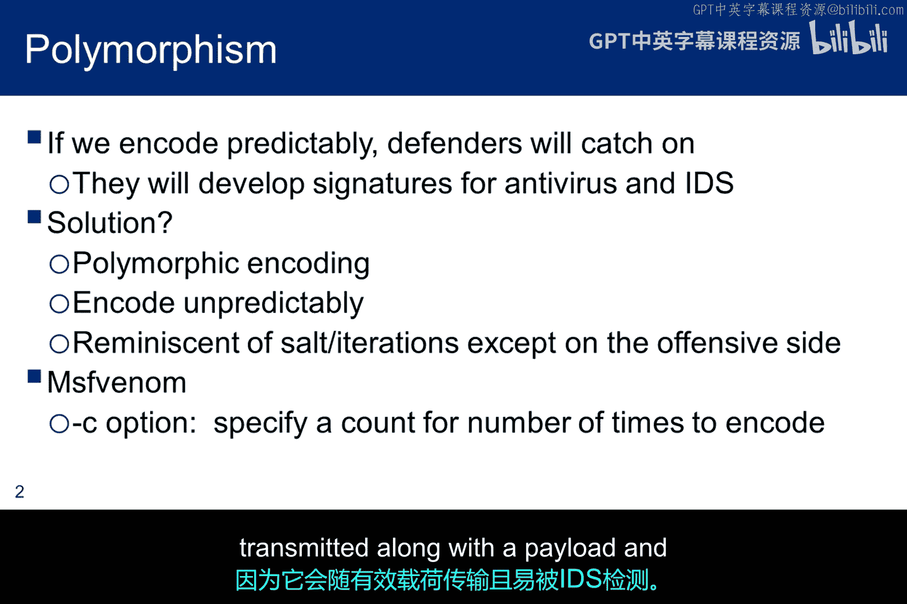
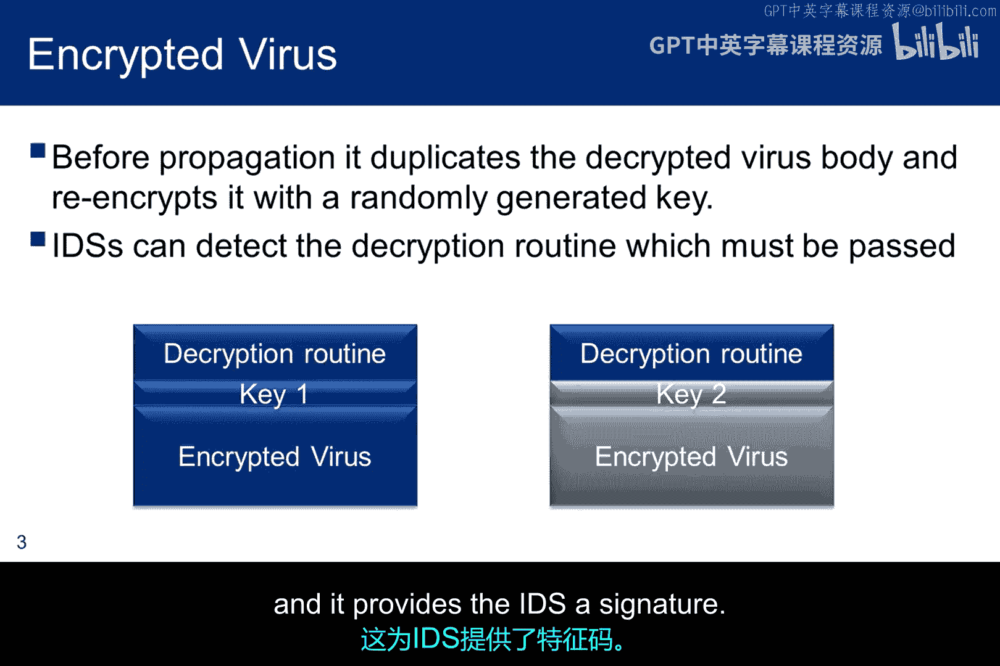
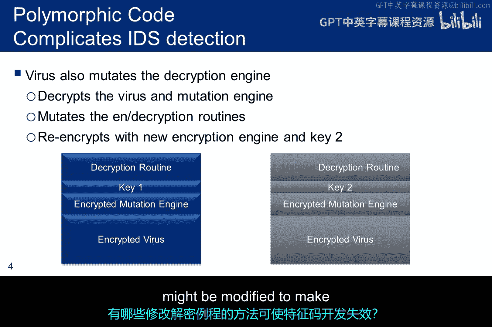
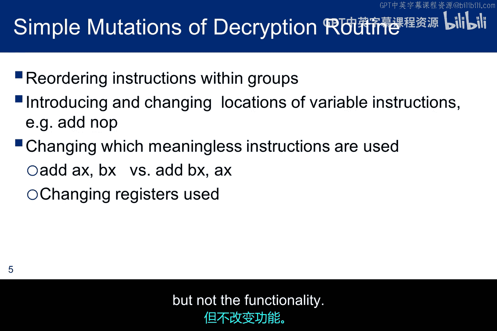
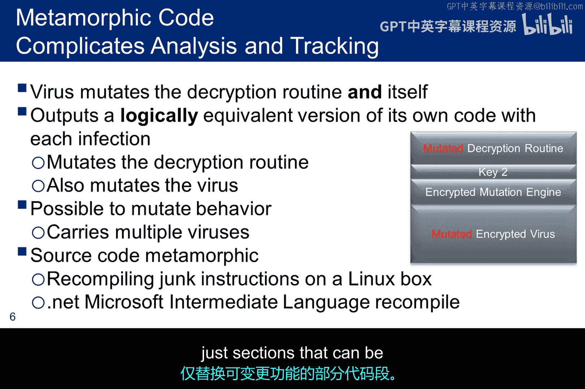
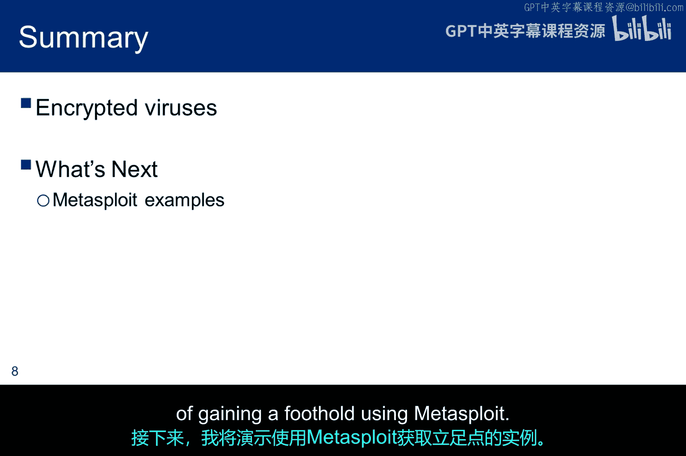

# 038：多态与变形代码 🦠

在本节课中，我们将要学习恶意软件中两种关键的规避技术：多态病毒和变形病毒。我们不会讨论具体的黑客工具，而是深入分析这两种病毒的结构，帮助你理解在尝试绕过入侵检测系统（IDS）或入侵防御系统（IPS）时需要考虑的因素。

## 核心概念：不可预测的编码 🔑

核心思想在于**不可预测的编码**。这可以通过使用像 `MF venom` 这样的工具来改变编码次数实现。但最终，**解码器必须被隐藏**，因为它会与有效载荷一同传输，并且容易被IDS检测到。

## 加密病毒与签名检测 🛡️

上一节我们介绍了编码的核心思想，本节中我们来看看一个简单的加密病毒如何运作。

上图展示了同一病毒的两个副本。左侧的病毒使用 **key1** 加密，右侧的病毒使用 **key2** 加密。因此，每次病毒传播时，它都会改变自身。这使得为病毒创建特征码变得无效。然而，在这两种情况下，**解密例程保持不变**，这为IDS提供了一个可检测的特征签名。

## 多态病毒：改变解码器 🧬

既然简单的加密病毒仍有弱点，那么如何进一步隐藏呢？多态病毒应运而生。

上图展示了同一病毒的两个副本，但它被称为多态病毒，在传播时会完全改变所有内容，**包括解码器**。其思路是在病毒中加入一个**变异引擎**，该引擎的功能是修改解密例程。

当左侧的病毒传播时，它使用 **key1** 来解密变异引擎和病毒体。变异引擎随后运行，以某种方式修改解密例程，使得二进制文件（病毒）变得不同，即使解密功能本身未变。一个简单的例子是在二进制代码中添加空操作指令（`NOP`）。然后选择 **key2**，用新的加密例程重新加密变异引擎和病毒体。

这样，新的密钥改变了病毒体，而变异引擎改变了解码器。那么，解密例程可能通过哪些方式被修改呢？

以下是几种变异技术，旨在使特征码开发变得不可能：

*   **指令重排**：以不影响计算结果的方式，重新排列指令或指令组的顺序。
*   **添加无用指令**：添加像 `NOP`（空操作）这样的指令。
*   **操作无用寄存器**：将常量移入程序中未使用的寄存器，或对寄存器进行无实际影响的加法操作。
*   **改变运算顺序**：如果寄存器AX和BX未被使用，可以改变加法顺序来改变代码形态。

这些只是一些思路，还存在许多其他技术，它们都旨在改变代码的内容，但不改变其功能。

## 变形病毒：逻辑等效的终极进化 🧩

变形代码将上述变异思想提升了一个层次。在这种情况下，**解密例程和病毒体本身都会被修改**。

结果是，除了规避检测，病毒在传播时不断变化，**保持逻辑功能等效，但改变其形式**，这给取证和病毒追踪带来了巨大挑战。

除了前面提到的思路，我们还有**源代码变形**的概念。这涉及将源代码包含在有效载荷中，并在目标机器上重新编译。例如，在通常装有C编译器的Linux系统上，可以使用 `gcc` 实现。在不太可能装有C编译器的Windows系统上，可以利用 `.NET` 框架来编译微软中间语言代码。

最后，变形组件可能会修改病毒的行为，使其效果不同。在这种情况下，恶意软件包实际上包含多个病毒，变异引擎在不同版本间切换。它可能不会复制整个病毒，而只是切换可以改变功能的部分代码段。

## 其他变形思路与总结 💡

以下是创建逻辑等效变形病毒的其他一些思路：

*   **寄存器交换**：如前所述，但如果IDS拥有良好的十六进制扫描器，仍可能检测到此类变化。
*   **模块顺序重排**：如果病毒有多个模块，由于它们通常通过符号调用，可以简单地切换其顺序。如果你有10个模块，就有 `10!`（10的阶乘）种排列方式可以改变病毒形态。
*   **动态栈构建**：在数据执行防护（DEP）普及之前，可以在栈上动态构建病毒，但现在这种技术效果较差。
*   **常量重定义**：像改变常量定义这样的简单技术，同样适用于多态代码。

我们已经讨论了加密病毒，你可以将其视为一种编码的有效载荷。这对于道德黑客和恶意黑客来说都是一种重要工具。

本节课中我们一起学习了多态病毒和变形病毒的工作原理。多态病毒通过变异引擎改变解密例程，而变形病毒则更进一步，同时改变病毒体和解密例程，保持逻辑功能不变但形态万变，从而有效规避基于特征码的检测。理解这些技术对于防御和进行安全评估都至关重要。