# 039：Metasploit实战案例 🎯

在本节课中，我们将通过两个具体案例，学习如何在实际渗透测试中使用Metasploit框架。你将了解到，成功利用漏洞并非总是直截了当，有时需要创造性的思维和对工具细节的深入理解。

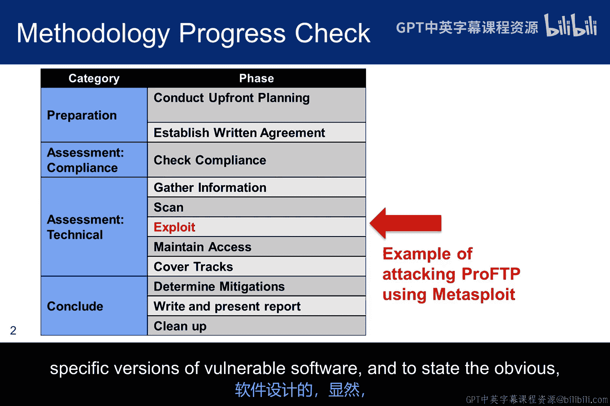

## 概述

本节课程将演示两个Metasploit实战案例。第一个案例说明漏洞利用与软件版本紧密相关；第二个案例则展示扫描器给出的建议可能具有误导性，我们需要自行寻找有效的利用方式。我们将学习如何根据扫描结果，灵活地选择、配置和尝试不同的漏洞利用模块。

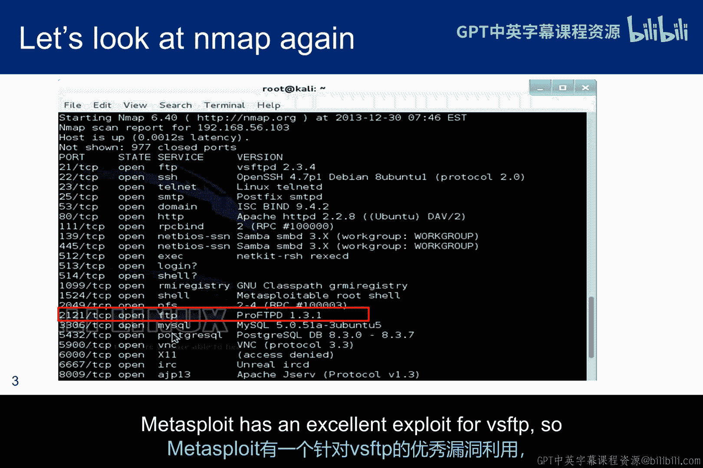

---

## 案例一：针对特定软件版本的利用

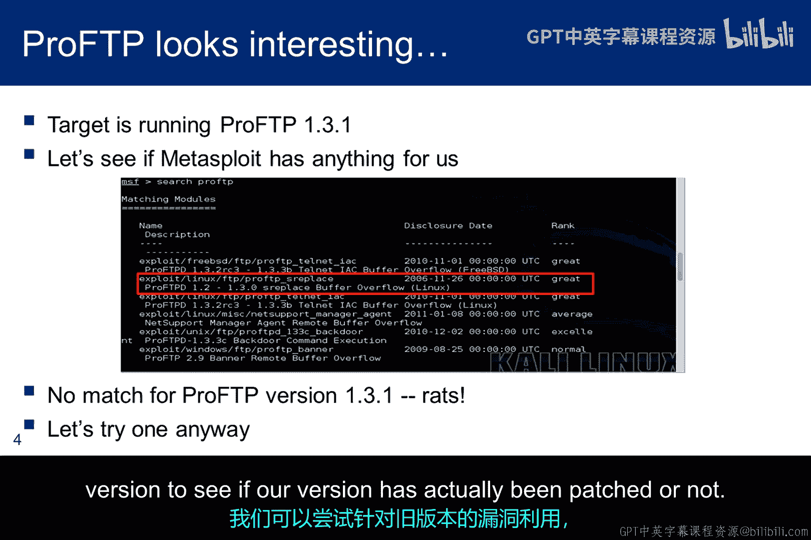

上一节我们介绍了漏洞扫描的基本概念，本节中我们来看看如何根据扫描结果选择具体的攻击载荷。这个案例表明，漏洞利用模块通常是为特定版本的易受攻击软件设计的，旧版本可能已打过补丁。

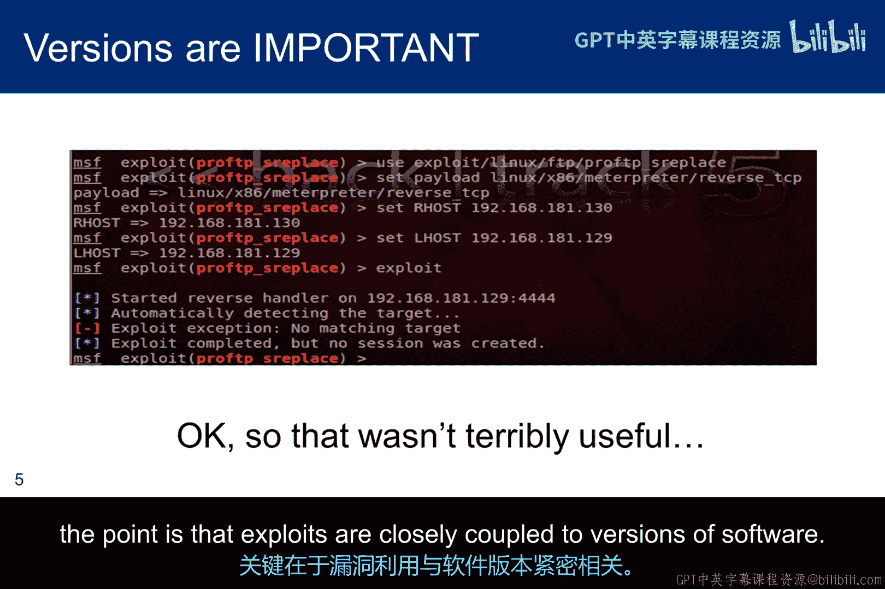

在一次Nmap扫描中，我们发现了两个FTP服务版本：VSFTP 2.3.4 和 ProFTP 1.3.1。

Metasploit有一个针对VSFTP的优秀漏洞利用模块。因此，我们来看看能否找到针对ProFTP的利用方式。

如果我们在Metasploit中搜索ProFTP，会发现没有一个模块明确说明支持1.3.1版本。

以下是我们可以尝试的几种思路：
*   我们可以尝试一个针对更新版本ProFTP的漏洞利用模块，推测它可能对旧版本也有效。
*   或者，如果我们认为新版本引入了新的漏洞，旧模块可能无效，那么可以尝试一个针对更旧版本的漏洞利用模块，以测试我们的目标版本是否已修补该漏洞。

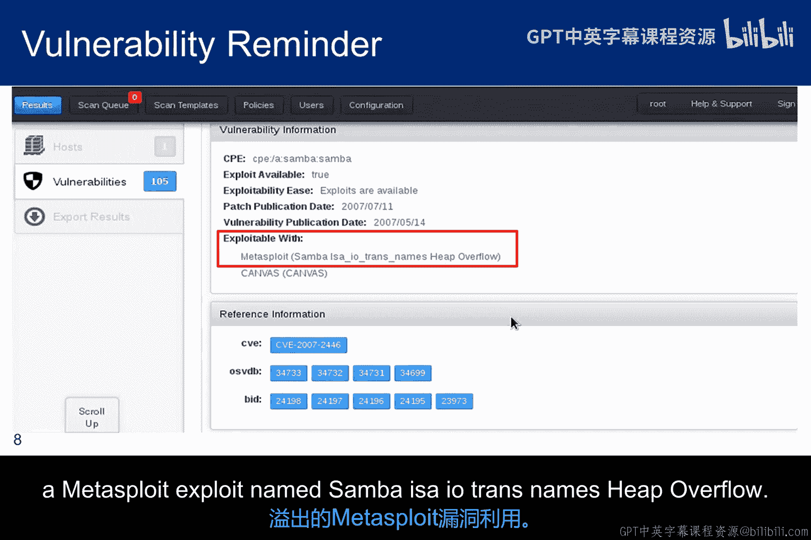

遗憾的是，尝试失败了。这个案例的核心要点再次强调：**漏洞利用与软件版本紧密耦合**。

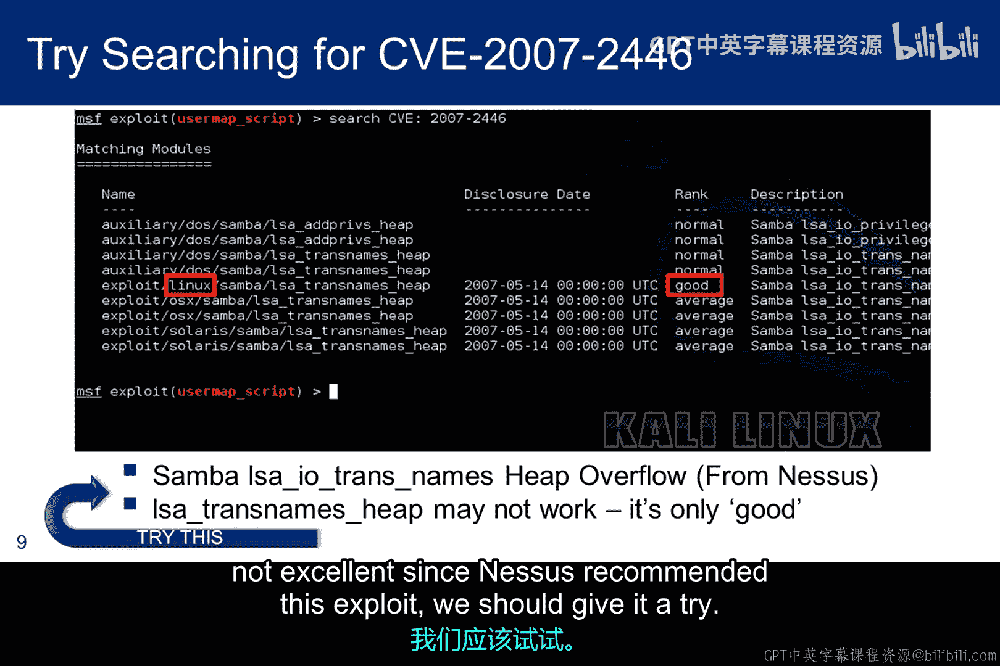

---

## 案例二：应对扫描器的误导性建议

接下来，我们将攻击一个在扫描阶段由Nessus识别的漏洞。这个案例将展示，即使自动化扫描工具给出了建议，我们也需要批判性地分析和尝试其他可能性。

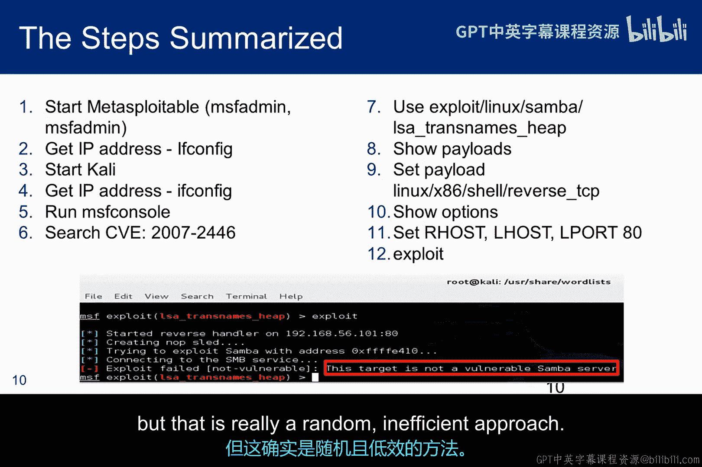

当我们之前运行Nessus扫描时，CVE-2007-2446被识别为Metasploitable系统上的一个Samba漏洞。Samba服务是一个兼容性程序，旨在让Windows和Linux系统能够交互并共享文件和打印服务，它依赖于服务器消息块（SMB）应用层网络协议。

上图是我们在扫描模块中看到的截图副本，你可以在参考信息框中看到CVE编号，红色方框高亮显示了Nessus对名为“Samba LSA Trans Named Heap Overflow”的Metasploit漏洞利用模块的推荐。

如果我们在Metasploit中搜索该CVE编号，它会显示9个漏洞利用模块，其中只有一个针对Linux系统。但请注意，它的评级仅为“良好”（good），这意味着它高于平均水平，但显然不是“优秀”（excellent）。既然Nessus推荐了这个漏洞利用模块，我们应该尝试一下。

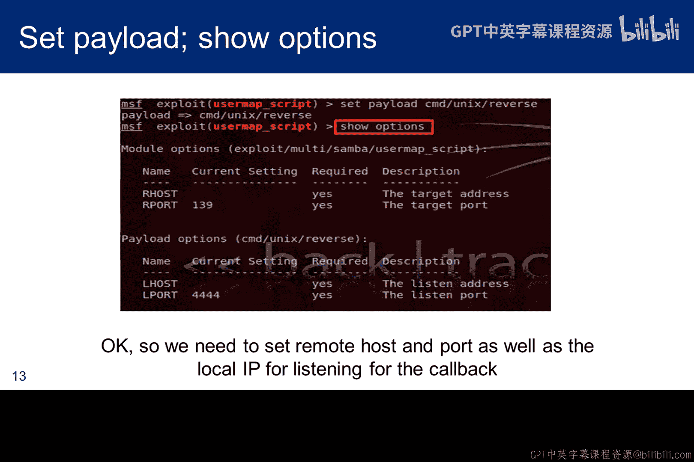

上图展示了针对Metasploitable测试该漏洞利用模块的必要步骤，包括之前讨论过的搜索步骤。在选择推荐的漏洞利用模块后，我们尝试了一个反向TCP载荷，设置了IP地址和端口，然后运行了漏洞利用程序。我们得到的回应是：这不是一个易受攻击的Samba服务器。

我们可以尝试更换载荷或更换漏洞利用模块，但这实际上是一种随机且低效的方法。

相反，让我们基于“Samba”而不是具体的“CVE编号”进行搜索。

我们看到有一个针对多系统、评级为“优秀”的漏洞利用模块。这是我们想要牢记的一个思路：什么是寻找更有效漏洞利用模块的好途径？

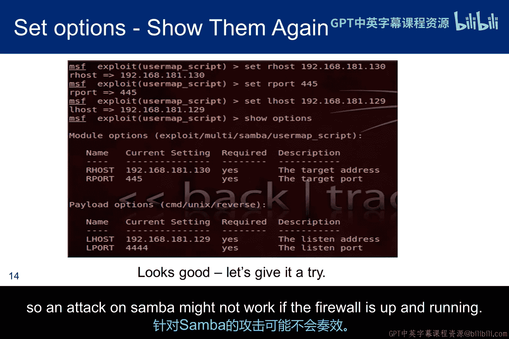

我们查看了可用的载荷，并像之前一样选择了一个反向TCP载荷。当我们查看选项时，发现需要设置远程主机和端口，但还需要设置一个监听器来等待反向连接。

请注意，我将远程端口从139改为了445。这可能不是必须的，因为我们攻击的是Linux机器，但另一方面，我们知道端口445在所有Windows版本中取代了Windows NetBIOS端口137-139，并且是Windows文件共享的首选端口。如果445端口不行，我们可以尝试其他端口。这也是一个重要思路，因为我们的道德黑客实验环境中的防火墙并未开放所有端口。我们需要找到一种方法来利用那些开放的端口。例如，我们的防火墙既没有开放139端口也没有开放445端口。因此，如果防火墙正在运行，针对Samba的攻击可能不会成功。

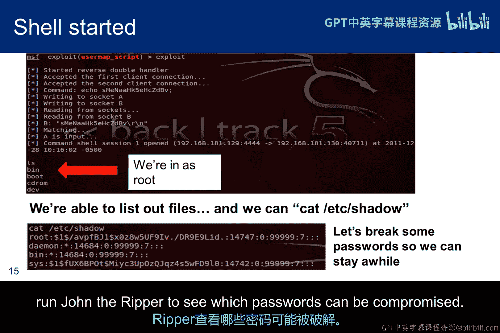

在这个案例中，当我们运行漏洞利用程序时，我们得到了一条消息：命令shell已打开。然而，我们并没有获得一个图形化的shell提示符。但如果我们尝试`ls`命令，可以看到我们已经能够访问Metasploitable机器，进一步的探索表明我们拥有root权限，并且可以读取shadow文件。现在，我们可以导出密码和shadow文件，并运行John the Ripper来查看哪些密码可以被破解。

需要提醒的是，作为道德黑客，我们的目标不是获取原始访问权限。我们的目标是评估攻陷该系统对其承载的业务使命的影响。我们希望向客户呈现一个有意义的风险图景，以便他能够在额外安全机制的投资与业务使命面临的风险之间进行权衡。

我们利用了Samba中的一个漏洞，尽管扫描器为我们推荐了不同的漏洞利用模块。我们可能希望使用`show info`命令了解更多关于这个成功利用模块的信息，它告诉我们这是2007年Samba漏洞利用序列中的下一个。我们应该阅读CVE的详细信息，甚至可能查看漏洞利用数据库，以理解为什么CVE-2007-2447有效而CVE-2007-2446无效。

这是`info`命令的截图。除了其他信息外，它还提供了目标列表。在这种情况下，目标是自动的，无需选择，尽管在顶部它确实指定了是Unix而非Windows。它还提供了漏洞利用的描述和作者的电子邮件地址。
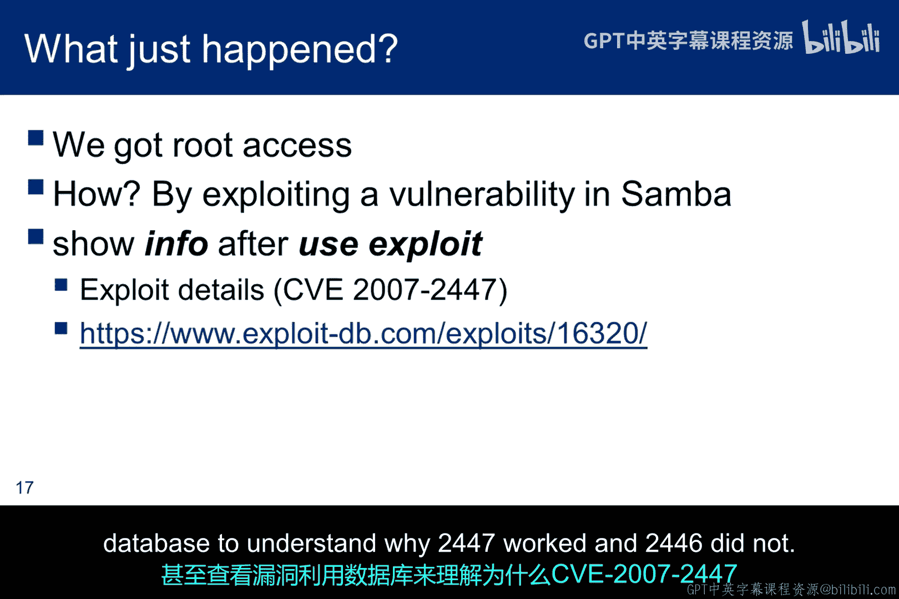

---

## 总结

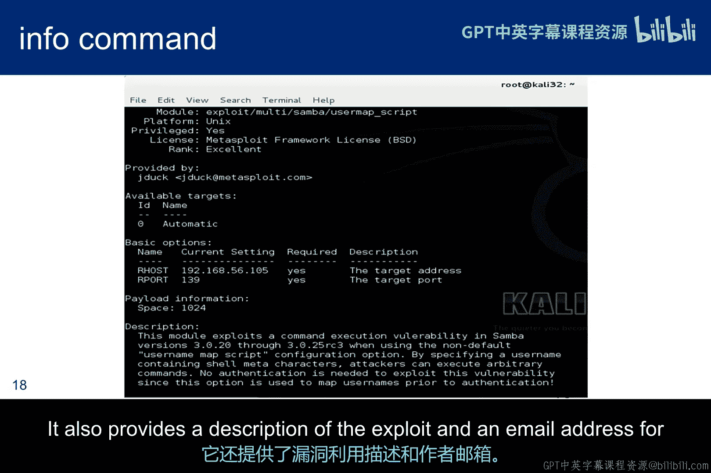

本节课中我们一起学习了两个Metasploit实战案例。我们认识到，自动化扫描工具的建议并非总是最佳或唯一选择，漏洞利用的成功与否与目标软件的具体版本、配置及网络环境（如防火墙规则）密切相关。有效的渗透测试需要测试者结合扫描结果、对漏洞原理的理解以及创造性的思维，灵活地尝试和调整攻击路径。记住，道德黑客的最终目标是评估风险，而不仅仅是获得系统访问权。

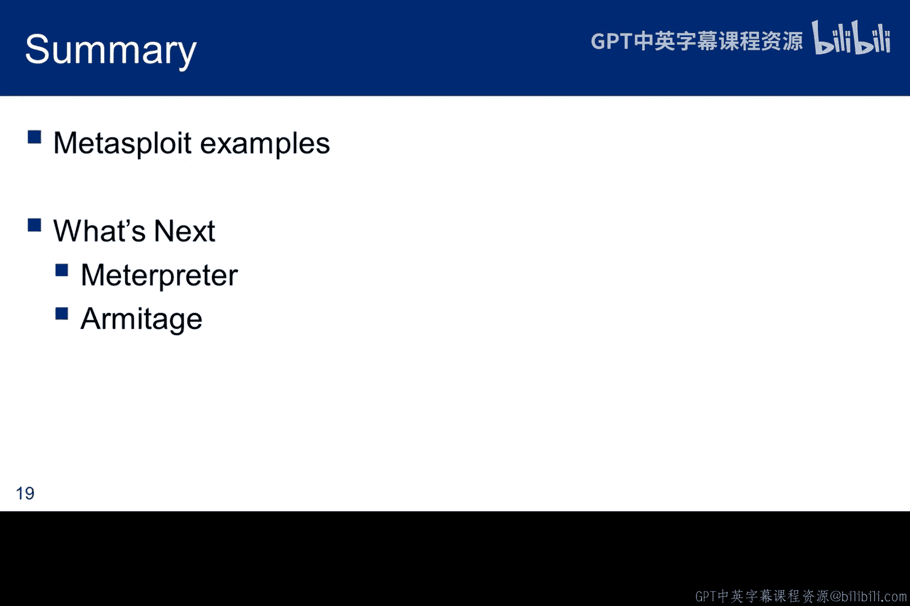

以上是Metasploit示例的结束。接下来，将会有一个录制的Meterpreter演示和一些关于一个相当“嘈杂”的工具——Armitage的截图。

