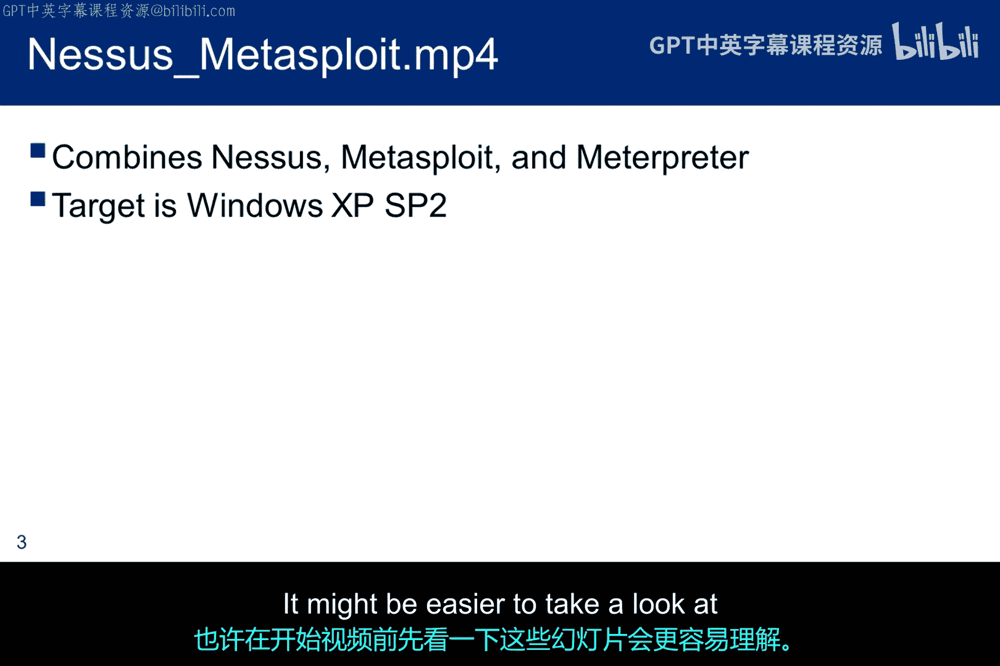
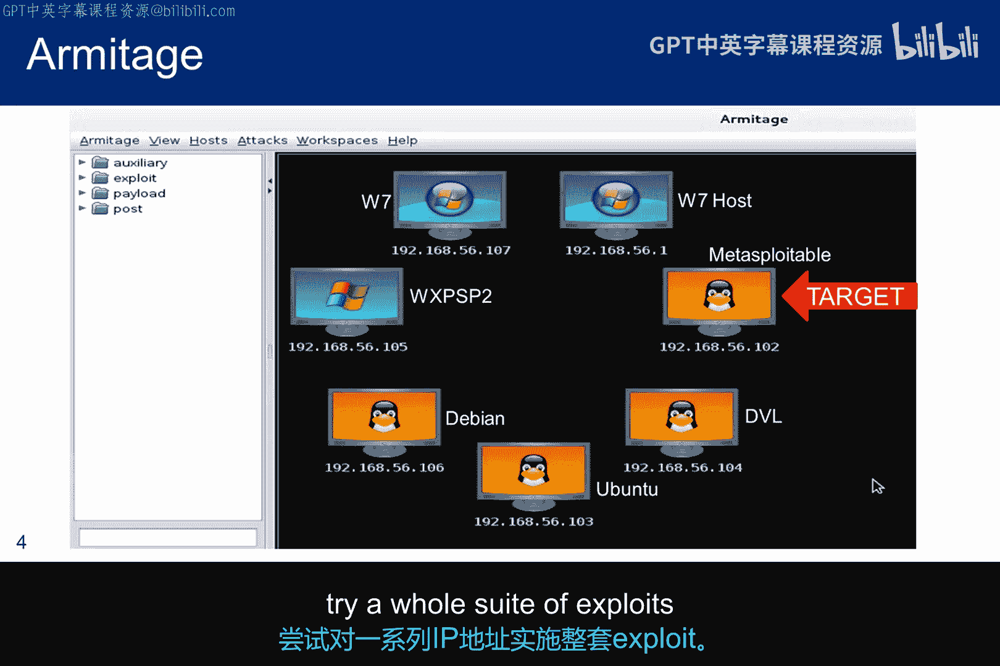
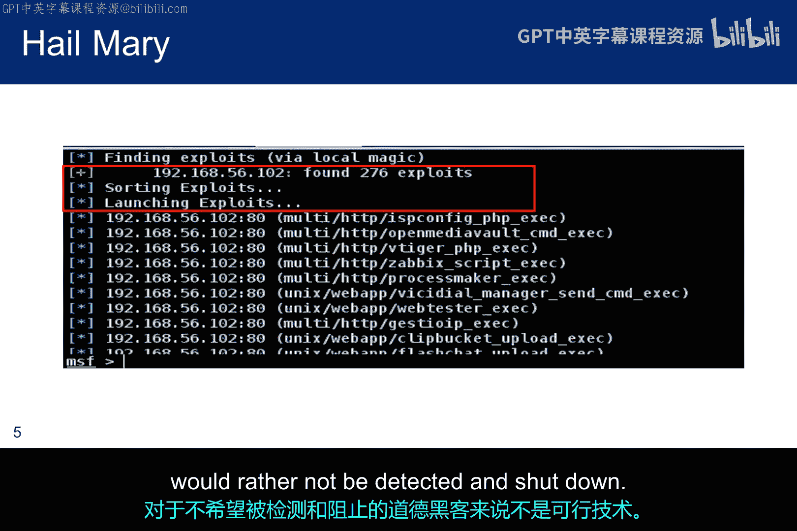
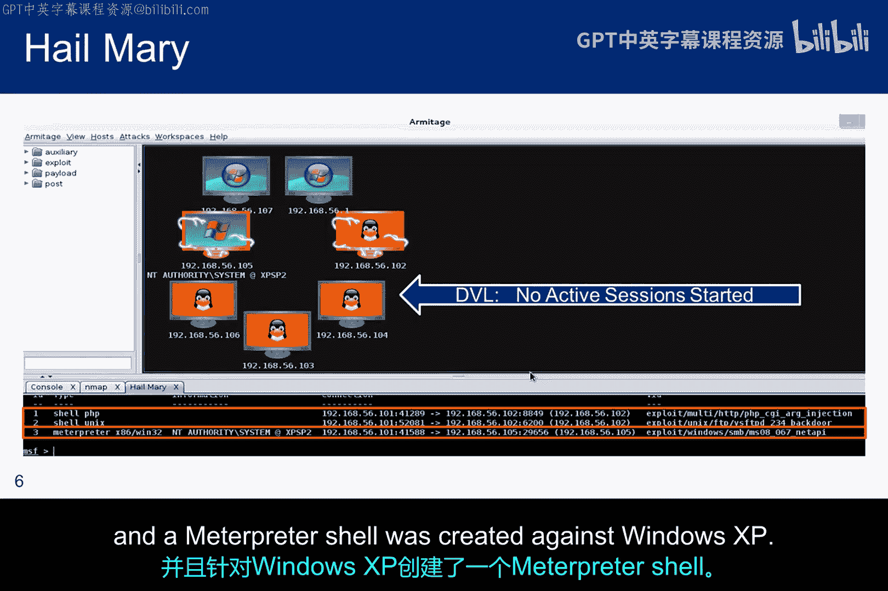
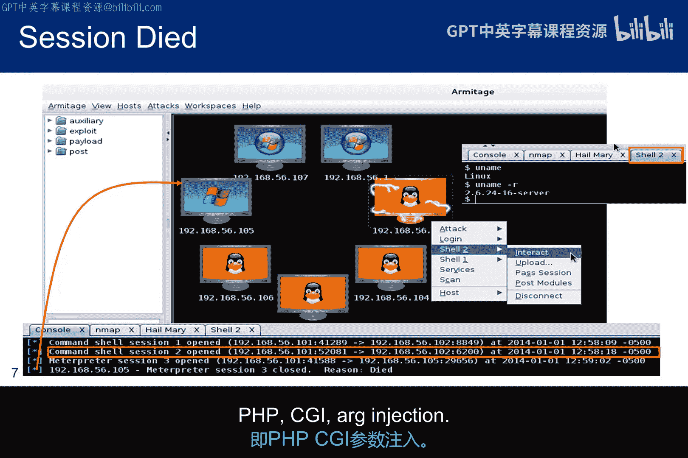
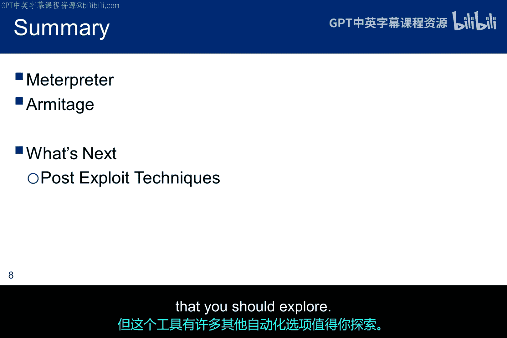

# 040：Meterpreter演示与Armitage工具 🛠️

在本节课中，我们将学习Meterpreter后渗透工具的基本工作流程，并了解自动化攻击工具Armitage的功能与局限性。

## 概述 📋

本节内容分为两部分。首先，我们将回顾Meterpreter建立会话的关键步骤。随后，我们将通过截图介绍Armitage工具，特别是其“Hail Mary”攻击模式，并分析其在真实环境中的适用性。

## Meterpreter工作流程回顾 🔄

上一节我们介绍了漏洞扫描，本节中我们来看看如何利用漏洞建立Meterpreter会话。Meterpreter会话的建立包含多个阶段。

以下是建立会话的三个核心步骤：
1.  **获取初始立足点**：发送一个载荷（payload），在目标机器上创建一个反向Shell连接回攻击者（Kali）机器。
2.  **进行DLL注入**：载荷的第二部分是一个DLL注入，用于接收并部署Meterpreter服务器。
3.  **开始通信**：Meterpreter服务器部署完成后，攻击者即可通过Meterpreter客户端与目标进行交互。

在扫描模块中如果未观看演示视频，现在需要观看。演示针对已过时的Windows XP系统运行Metasploit，但它成功打开了一个Meterpreter shell，并展示了通过Meterpreter可用的诸多功能。

## 关于Armitage工具 🖥️

在观看Meterpreter演示视频之前，我们先通过几张截图来了解一个名为Armitage的工具。Armitage是Metasploit框架的图形化界面，集成了自动化攻击功能。

幻灯片中的截图是在我的所有虚拟机位于同一网段且没有防火墙的环境下截取的。这与你们当前道德黑客实验环境的配置不同。如果想复现此结果，除非重新配置网络，否则结果将不一致。

在此案例中，目标将是Metasploitable和Damn Vulnerable Linux（DVL），Windows XP也是潜在目标。Armitage的一个特性是它可以运行“Hail Mary”攻击，针对一系列IP地址尝试整套漏洞利用程序。

## “Hail Mary”攻击分析 ⚠️

此截图显示，“Hail Mary”攻击向目标IP地址抛出了276个漏洞利用程序。这种攻击方式会产生大量噪音，对于不希望被检测和阻止的道德黑客而言，并非可行的技术。

## 攻击结果与交互 🎯

此截图显示两台虚拟机被攻陷，但Damn Vulnerable Linux没有。这可能因为DVL是另一种类型的学习工具。在底部红色方框中可以看到，针对Metasploitable启动了**两个**使用不同漏洞利用的shell，并针对Windows XP创建了一个**Meterpreter shell**。

此截图显示，连接到XP2的Meterpreter shell在建立后很快失效，但连接到Metasploitable的shell仍然活跃。右键单击会弹出一个用于与shell（本例中为shell 2）交互的菜单。

## 环境适配与工具评价 📝

不幸的是，如果在当前实验网络（包括开启了防火墙的Windows 7客户端）上运行Armitage，将无法获得任何会话。如果关闭防火墙，你应该能使用与实验中将用到的相同漏洞（PHP CGI参数注入）在Metasploitable上获得一个会话。

如果尚未观看Meterpreter演示，请不要忘记观看。尽管目标是Windows XP，但它展示了一些非常有趣的Meterpreter功能。

Armitage更像是一个自动化漏洞利用工具。除了脚本小子（script kiddies）可能会使用外，“Hail Mary”攻击对任何人来说都过于嘈杂。但该工具还有许多其他自动化选项值得探索。

## 总结 🎓

本节课中我们一起学习了Meterpreter建立会话的多阶段过程，包括获取立足点、DLL注入和建立通信。同时，我们了解了Armitage这一自动化攻击工具，认识到其“Hail Mary”等全量攻击模式在真实渗透测试中因噪音过大而不适用，但该工具仍具备其他有价值的自动化功能供探索。请务必观看Meterpreter演示视频以直观理解其强大功能。