# 041：Web应用渗透 🕵️

在本节课中，我们将学习Web应用渗透测试的基础知识。我们将介绍一个名为Mutillidae的渗透测试实验平台，并探讨三种关键的Web应用安全漏洞：SQL注入、跨站脚本攻击和跨站请求伪造。课程将遵循一个简化的道德黑客方法论，并重点讲解这些漏洞的原理和攻击向量。

## Mutillidae简介 🐛

Mutillidae是一个免费、开源的Web应用程序，专门用于支持针对Web应用的渗透测试实验。

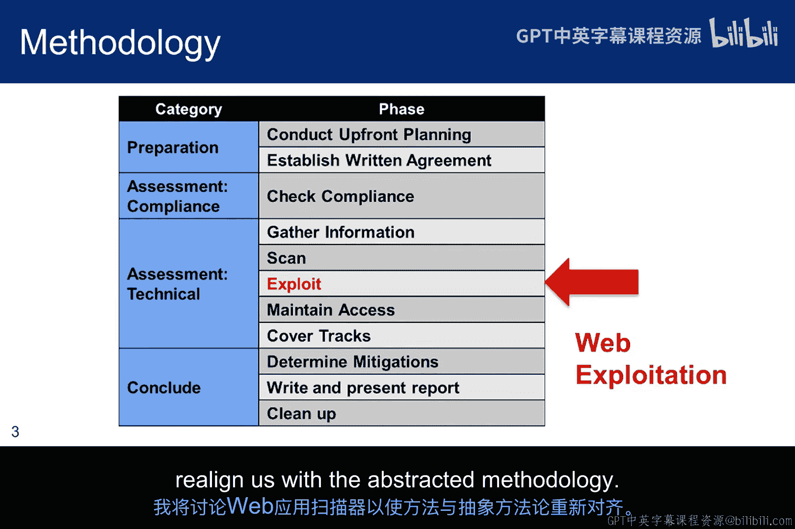

Mutillidae的当前版本代号为“No Wasp”，即版本2.x。它由Jeremy Druin（又名“weaponized”）开发。版本2.x是基于Adrian “Irongeek” Crenshaw的Mutillidae项目构建的，该项目现在被称为Mutillidae 1.x或Mutillidae经典版。经典版仍然可以在SourceForge上找到，与当前项目并存。

Metaploitable虚拟机附带了一个较旧版本的Mutillidae 2.x。虽然这不是最新版本，但本实验模块将讨论在Metaploitable中更新Mutillidae的选项。

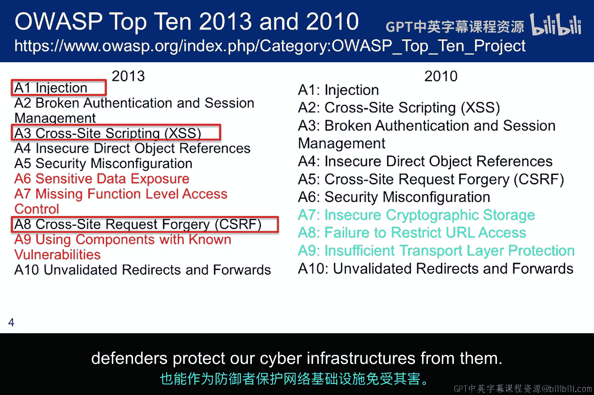

屏幕上显示的网站`irongeek.com`由Adrian维护，包含大量计算机安全信息，值得浏览。幻灯片上显示的特定链接包含一系列基于Mutillidae的渗透测试研讨会视频。本模块相关实验中的大部分材料都提取自这些视频。如果在实验中遇到困惑，这些视频可能有助于澄清疑点。

Mutillidae还有许多方面在本模块乃至本课程中都不会涉及，你可能需要自行探索。Adrian Crenshaw的信息安全材料被多所大学用于其网络安全课程，而Jeremy Druin则是一名专业的Web渗透测试员。

## 方法论调整与OWASP Top 10 📋

回到我们的道德黑客方法论，Web利用阶段跳过了扫描阶段。我采用这种方法是因为我希望将扫描和网络利用的讲座内容紧密联系在一起。在Web利用讲座的最后，我将讨论Web应用扫描器，以便与抽象化的方法论重新对齐。

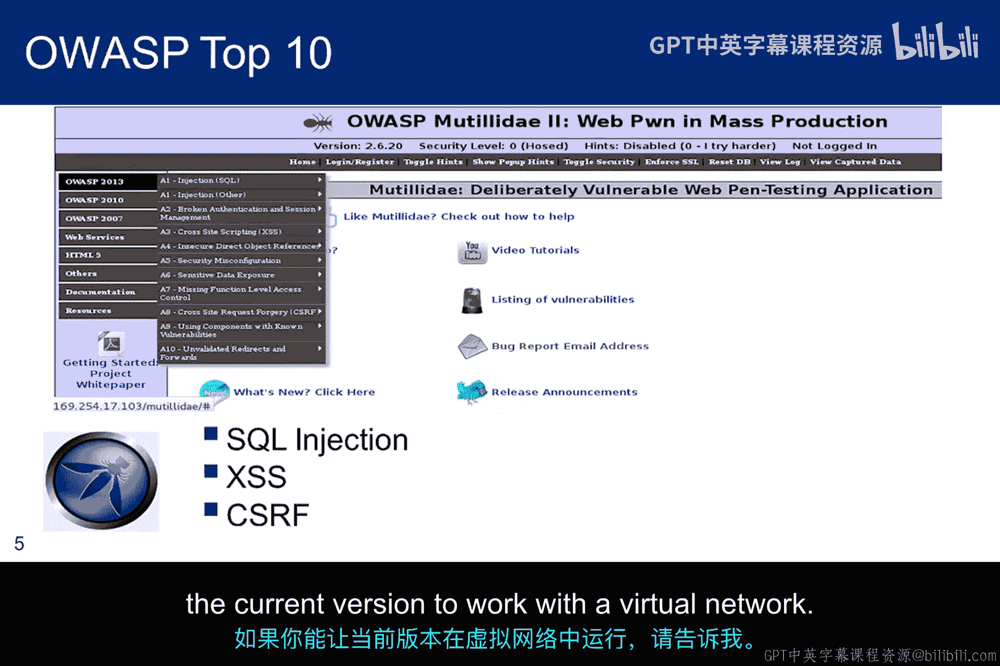

OWASP Top 10是由领域专家编制的一份重要Web漏洞列表。你可以看到2010年和2013年的列表有所不同，而2017年的新列表最近已发布供公众评议。此处的颜色标识了列表中的差异。这表明有三个漏洞被移除，三个被添加，但实际上只有两个，因为“缺失功能级访问控制”实际上包含了“失效的访问限制”。我们只探讨其中三个用红色框高亮显示的漏洞。你可以看到它们同时出现在旧列表和新列表中，这表明它们仍然是我们需要理解的重要攻击向量。作为道德黑客，我们可以利用它们；作为防御者，我们可以保护我们的网络基础设施免受其害。

开放Web应用安全项目是一个专注于改善软件安全的非营利组织。OWASP内部研究多个不同的项目，但OWASP Top 10最为知名。它已存在大约十年，并定期更新。它代表了Web安全社区关于最关键Web应用安全缺陷的广泛共识。你在这里看到的是2010年的OWASP Top 10列表。更新的OWASP列表于2013年发布，并得到当前版本Mutillidae的支持。但Metaploitable 2附带的是较旧的Mutillidae版本2.1.19。出于技术原因，我们将坚持使用这个版本。我们将涵盖的主题同时出现在OWASP 2010和2013列表中。但如果你想保持最先进的渗透测试环境，如果它在你的环境中可用，你会希望使用最新版本。我在最新版本中遇到了一些技术问题，该问题自2014年1月以来已被列为SourceForge上的一个bug。这个bug并不影响所有配置，因此最新版本可能在你的实验环境中可用。实验将为你提供一些如何检查的指导原则。如果你能让当前版本在虚拟网络中运行，请告诉我。

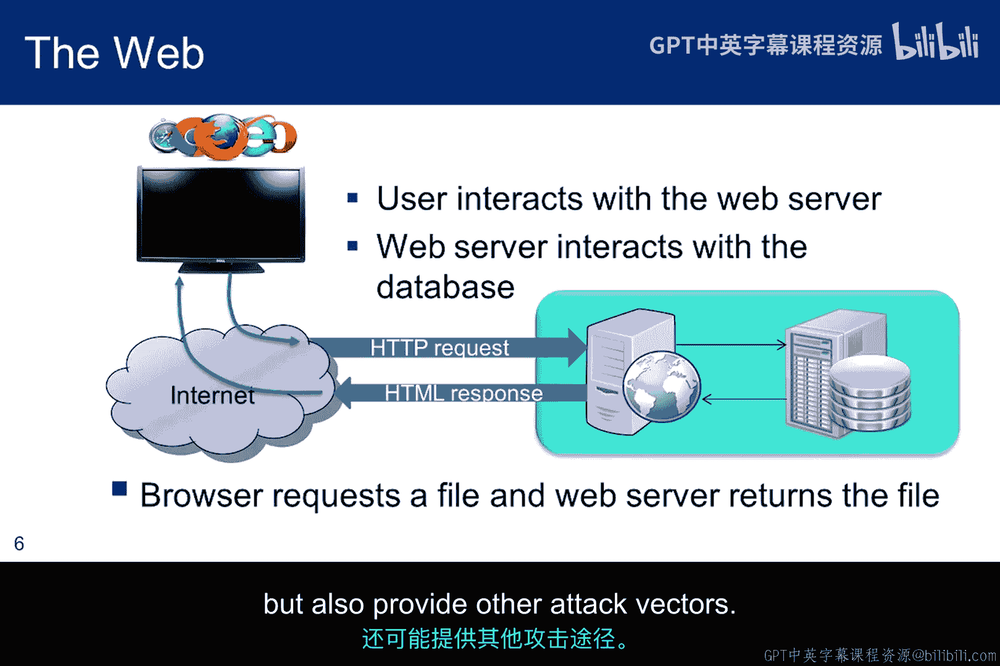

## Web交互基础与代理 🔄

以下是浏览器如何与Web服务器交互的简要回顾。浏览器向Web服务器发送一个HTTP请求，Web服务器返回一个文件。

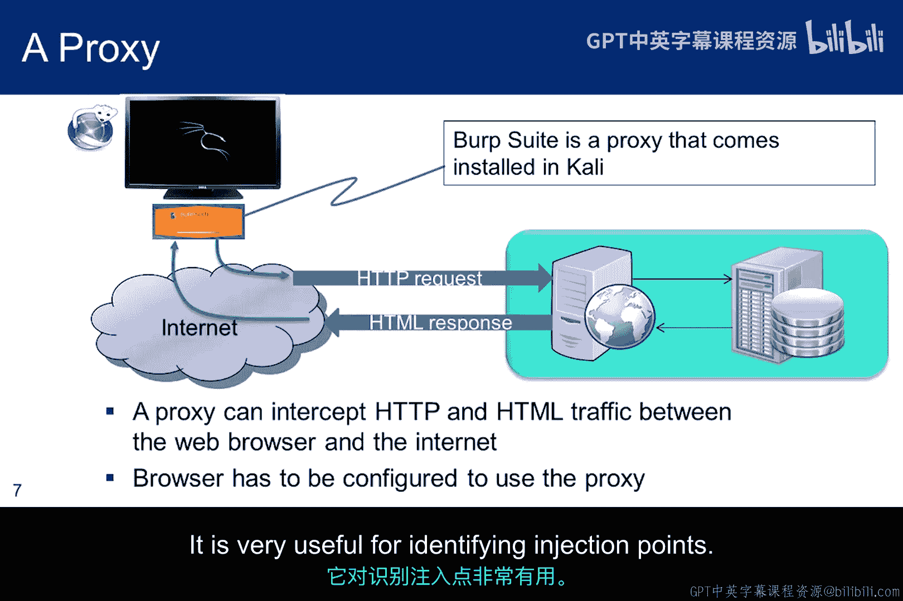

在过去，Web服务器会生成并返回一个静态HTML页面。Web 2.0和AJAX改变了这一点。如今，Web服务器返回的PHP内容是动态生成的。实际上，网页上可能还有根本不通过浏览器渲染的代码。网页的异步更新由这段代码与Web服务器之间的交互管理，并且可能完全不需要用户参与。这个动态组件正是我们将要探索的一些漏洞所在之处。

这张幻灯片展示的另一个重要概念是，Web服务器充当了数据库的隔离机制，因为所有请求都经过Web服务器。事实上，一些天真的管理员认为Web服务器保护了数据库。我们将在本模块中看到情况并非如此。虽然Web服务器代理所有通往数据库的请求，但粗心的Web服务器代码不仅可能危及数据库，还可能提供其他攻击向量。

代理是一种充当中间人的应用程序，处理来自客户端的请求，这些客户端正在向服务器请求资源。代理位于中间处理这些请求，这意味着处理可以暂时停止。在我们的案例中，我们感兴趣的是安装在浏览器所在机器上的、位于浏览器和Web服务器之间的代理。传出的HTTP和传入的HTML消息都可以被捕获、审查，并在转发前进行修改。Kali Linux中预装的一个代理是Burp Suite。另一个是WebScarab。Burp Suite很好，因为它提供了一整套对Web服务器进行渗透测试有用的工具。它在识别注入点方面非常有用。

## SQL注入攻击 💉

由于互联网上的数据库安装在Web服务器后面，并且对数据库的访问仅允许通过Web服务器本身进行，一些网站管理者天真地认为数据库是安全的。当然，我们知道总存在内部攻击威胁，但撇开这一点，本模块将讨论一些被称为SQL注入的技术，这些技术可能允许我们间接从数据库获取大量信息。在此上下文中，“间接”意味着我们通过Web服务器，并诱骗它传递有助于映射数据库的请求。

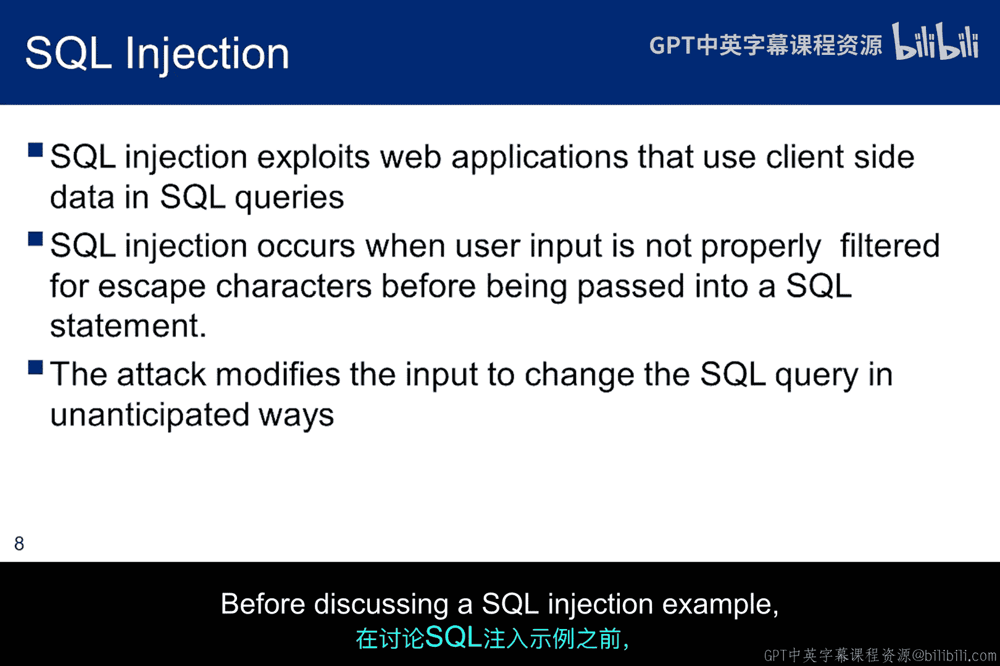

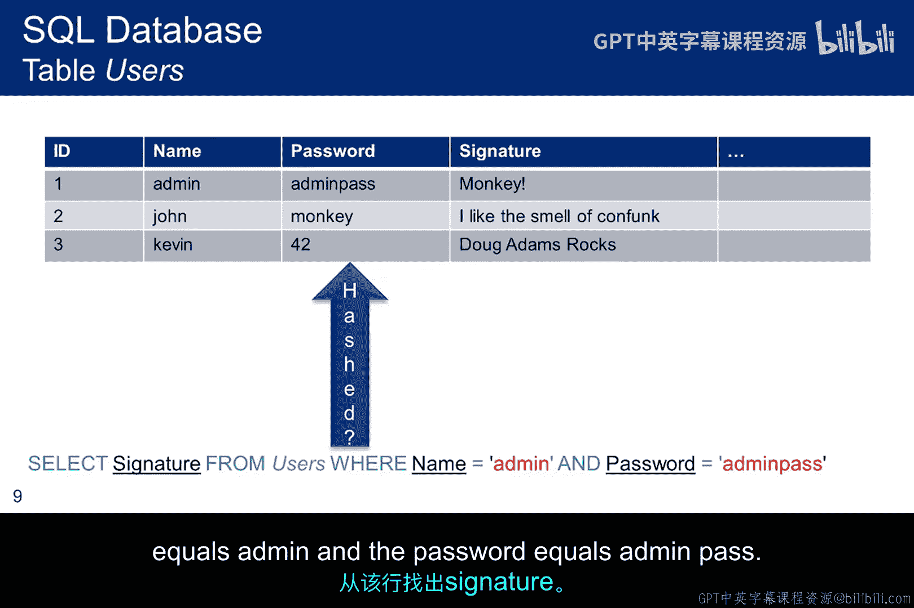

SQL注入的理念是，从浏览器传递给Web服务器的信息并非程序员所预期的。如果Web程序员未能过滤预期的输入，那么转发到数据库的SQL查询可能会通过浏览器输入的内容被修改，并可能执行非预期的操作。它可能提供足够的信息，从而创建进入数据库的攻击向量。

在讨论SQL注入示例之前，我想先回顾一下SQL的工作原理。在这个例子中，我们有一个名为`users`的简单表，它有四列：`ID`、`name`、`password`和`signature`。这个简单表中只有三行，但这足以解释底部的SQL语句。然而，在此之前，我想指出密码是以明文存储的，没有进行哈希处理，这是一个严重的安全错误。SQL查询将返回`monkey`。蓝色文本代表SQL命令，黑色代表表中的列名，灰色代表表名，红色代表选择条件。因此，这个语句的意思是：查看名为`users`的表，并找到当`name`等于`admin`且`password`等于`adminpass`时，该行的`signature`字段。

以下是SQL注入工作原理的简单动画演示。首先，我们看到一个正常的查询。浏览器中输入的信息是程序员预期的。它由Web服务器解析，生成的SQL查询被转发，要求数据库在输入密码与用户表中该用户关联时返回特定用户。这种选择语句可能用于用户登录时的身份验证过程，当用户名和密码在表单中输入时。当然，为了保护传输中的密码，传递的密码将是哈希值。

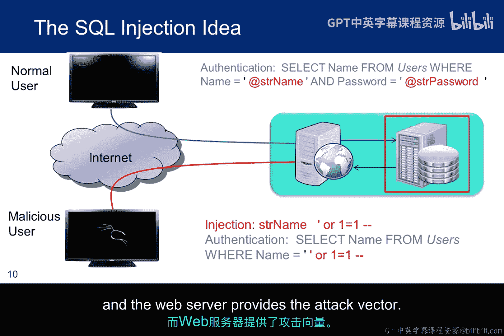

第二个查询是一个注入，其中输入的用户名不是程序员预期的。相反，它是一个不寻常的字符串，如果未被过滤，将被传递给数据库，就好像它是一个用户名一样。我们稍后将详细讨论这一点。但当这种情况发生时，数据库可能会让未经授权的用户登录，或者返回程序员未预期的信息。在这种情况下，攻击的目标是数据库，而Web服务器提供了攻击向量。

## 跨站脚本攻击 🎭

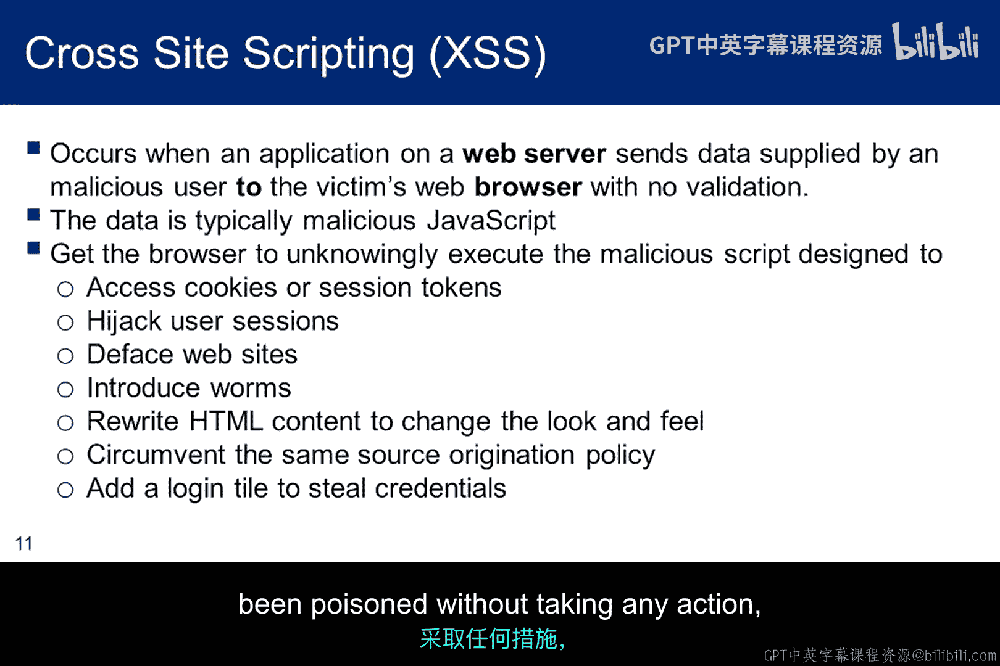

我们将探讨的第二个弱点是跨站脚本攻击。XSS的理念是让浏览器在不知情的情况下执行一些恶意脚本。如本列表所示，恶意脚本可以实现许多不同的目标。我们最终将探索列表中的第一项和第二项：在会话处于活动状态时窃取会话cookie，这允许我们劫持会话并使其保持活动状态，即使在授权用户注销后也是如此。我们不会探索列表中的其他项，但我们经常在报纸文章中看到对其中一些的描述。提醒一下，我们大多数人都允许JavaScript自动运行。事实上，对于Mozilla，你必须安装一个插件才能对JavaScript进行一些控制。即使将JavaScript设置为提示模式，也不总是容易决定是否应该让它运行。你如何判断它是否是恶意的？这意味着，如果你访问一个已被“毒化”的网站，无需采取任何行动，脚本就会运行。

以下是三种众所周知的XSS攻击：反射型、DOM注入型和存储型。

在反射型攻击中，注入的脚本从Web服务器反射回来。反射回来的可能是一个错误消息或搜索结果。但关键之处在于，它包含了一些最初由浏览器作为请求的一部分发送给服务器的脚本。一个明显的问题是：恶意脚本是如何进入受害者请求的？它们通常通过次要途径传递给受害者，例如电子邮件消息或与不同恶意网站上链接的交互。当用户被诱骗点击恶意链接时，一个特制的POST或GET请求被提交。它包含注入的代码，这些代码传播到易受攻击的网站，该网站将攻击反射回用户的浏览器。然后浏览器执行该代码，因为它来自我们有意导航到的受信任服务器。

在存储型攻击中，恶意脚本通常存储在数据库中，并在受害者请求数据库信息时返回给受害者。XSS实验将花费大量时间在这种攻击上。

DOM注入实际上是一种客户端攻击。服务器没有向浏览器返回可执行的JavaScript。相反，已被服务器清理过的数据，或者可能从未发送到服务器的数据，被页面上的现有代码转换为可执行的JavaScript。攻击载荷是通过修改受害者浏览器中的DOM环境而执行的，从而使合法的客户端代码以意外的方式运行。页面本身没有改变，但由于恶意修改，页面中包含的客户端代码执行方式不同。

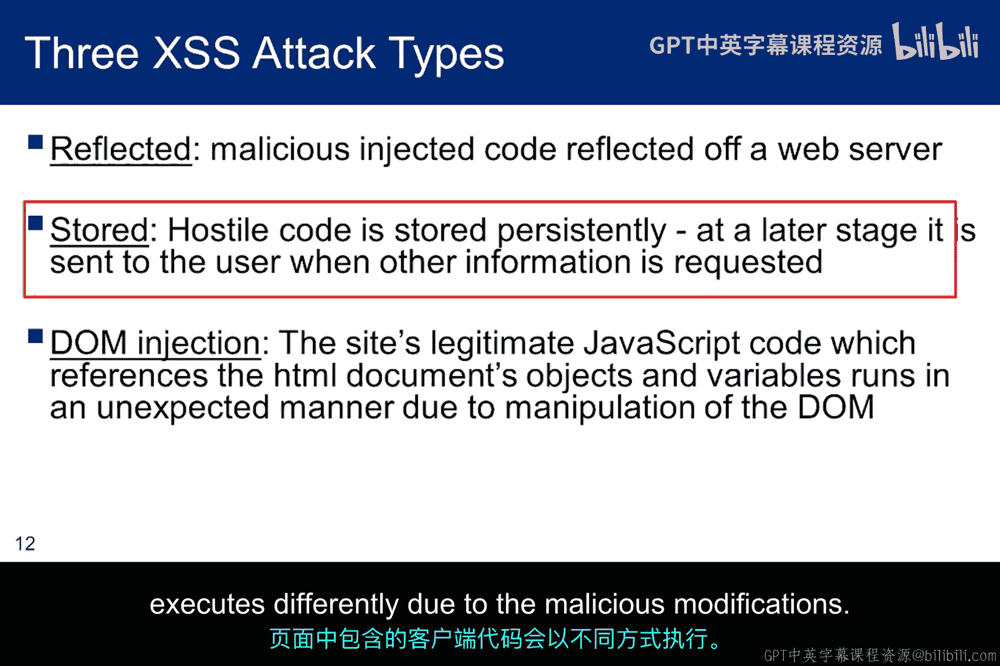

## 存储型XSS攻击示例：博客投毒 📝

“毒化”博客意味着毒化数据库。对易受攻击的Web应用的博客进行毒化的第一步是在发布博客条目时包含恶意脚本。这将被存储在数据库中。如果Web应用存在漏洞，它将运行脚本而不是显示它。一旦博客被毒化，无辜的用户访问并查看博客。当这种情况发生时，脚本会随博客条目一起返回，但不会为用户显示。用户甚至无法察觉它的存在。由于易受攻击的Web应用将脚本解析到HTML中的方式，浏览器只是简单地执行了脚本。一旦脚本执行，攻击就成功了，脚本执行的操作就会发生。受害者可能会也可能不会发布博客条目。但可以肯定的是，他已经成为了受害者。在这种情况下，目标是浏览器。目的是让浏览器执行恶意脚本。它之所以有效，是因为浏览器信任Web服务器。

## 跨站请求伪造攻击 🔄

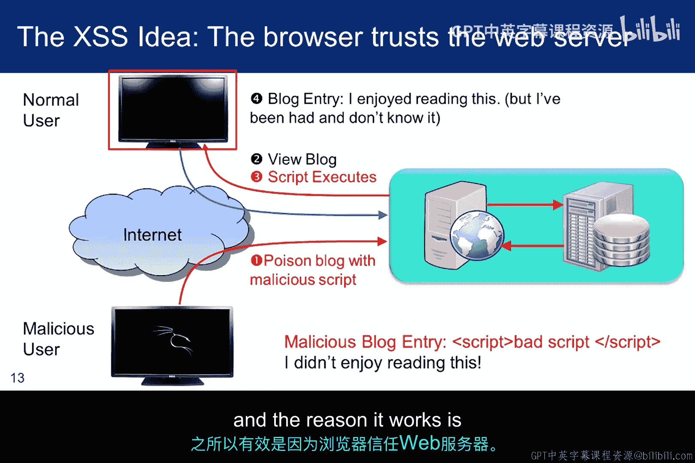

跨站请求伪造是我们将探讨的第三种Web应用漏洞。

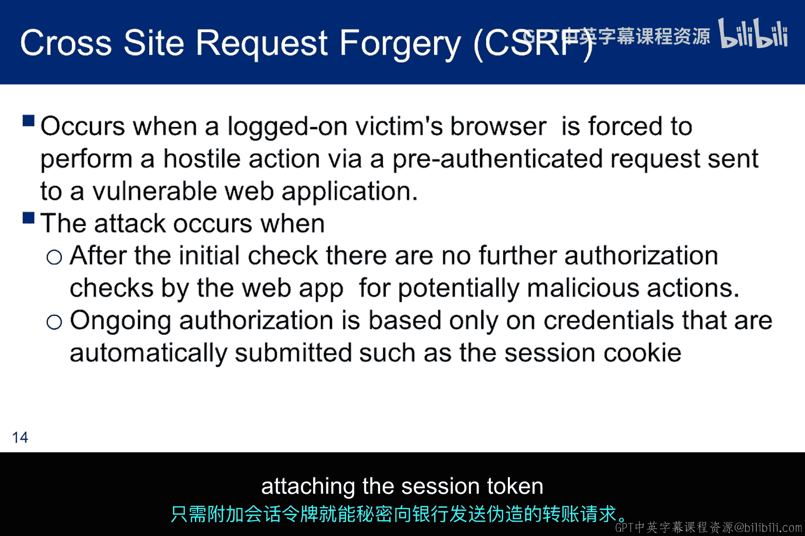

其理念是利用这样一个事实：一旦用户向应用程序进行身份验证，后续交易将使用会话令牌。因此，攻击是强制浏览器将一个有效的令牌附加到一个伪造的交易上，该交易执行用户不知道且不打算执行的操作。这在教科书中通常用资金转账的例子来解释。一个伪造的转账请求通过简单地附加会话令牌被秘密发送到银行，因为受害者已经登录。

在XSS中，攻击成功是因为浏览器信任Web服务器。而这种攻击之所以能够进行，是因为Web服务器信任浏览器。攻击过程如下：首先，浏览器登录到应用程序并收到一个会话令牌。每当一个有效交易发送到应用程序时，都会附加一个cookie。应用程序检查cookie，认为其有效并完成交易。现在，恶意用户能够伪造一个交易。例如，如果受害者和攻击者都有同一家银行的账户，攻击者可以捕获一些他自己的Web交易细节，并利用这些细节伪造一个将资金从受害者转移到攻击者账户的交易。然后，他将伪造的交易发送到受害者的浏览器，并让浏览器将其连同会话cookie一起发送给Web应用程序。在这种情况下，目标是信任授权浏览器不会执行非预期交易的Web应用程序。

CSRF令牌是缓解CSRF攻击的重要方法。其理念是让运行在服务器上的Web应用在用户正在查看的表单上提供一个CSRF令牌作为服务器签名。它通常隐藏在页面的某个地方。当用户填写表单并按下提交按钮时，令牌从页面读取并返回给服务器。这允许服务器验证令牌是否相同，以及输入是否来自该表单。换句话说，它不是由代表用户的恶意JavaScript填写的，因为恶意JavaScript无法访问Web应用表单上的当前令牌。恶意攻击者可以通过自己访问网站来收集CSRF令牌，但它不会与用户登录时收到的令牌匹配。

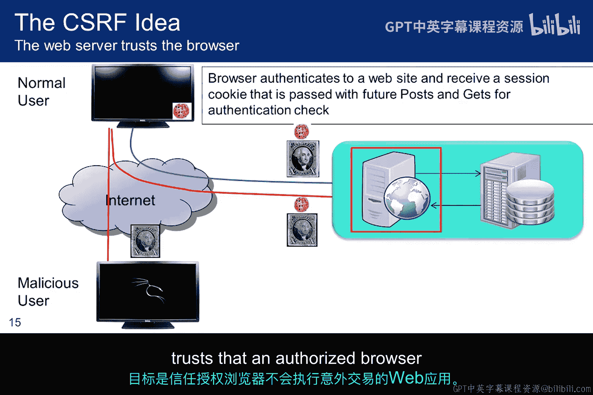

## 总结 📚

本节课中，我们一起学习了Web应用渗透测试的基础知识。我们首先介绍了用于实验的Mutillidae平台及其背景。然后，我们探讨了道德黑客方法论在Web利用阶段的调整，并重点学习了OWASP Top 10中的三种核心漏洞：SQL注入、跨站脚本攻击和跨站请求伪造。

我们了解了SQL注入如何通过Web服务器攻击后端数据库，XSS如何利用浏览器对服务器的信任执行恶意脚本，以及CSRF如何利用服务器对浏览器的信任执行未授权操作。每种攻击都针对不同的目标：数据库、Web服务器或用户浏览器，并利用了信任关系的弱点。

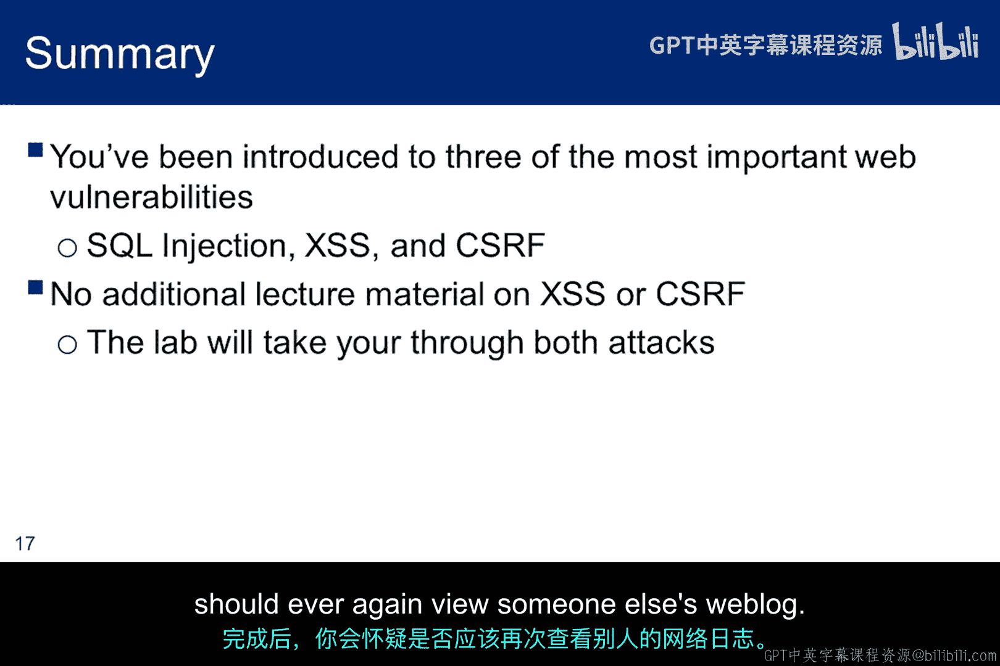

通过理解这些漏洞的原理和攻击向量，作为未来的道德黑客和安全专业人员，我们能够更好地识别、利用这些漏洞进行安全评估，并设计有效的防御措施来保护Web应用。在接下来的实验和课程中，你将有机会实践这些攻击技术，从而加深对Web安全的理解。