# 042：SQL注入攻击 🎯

在本节课中，我们将要学习SQL注入攻击的基本概念、攻击策略以及一些简单的示例。SQL注入是一种针对后端数据库的攻击技术，通过向数据库提交恶意构造的SQL查询，攻击者可以获取数据库的结构信息甚至敏感数据。请注意，本课程中讨论的技术仅用于授权的道德黑客环境，严禁在未经许可的真实网站或数据库上尝试。

## 概述

SQL注入攻击利用了Web应用程序对用户输入数据过滤不严的漏洞。攻击者通过提交看似合法但实际包含恶意SQL代码的输入，诱使数据库执行非预期的操作。这种攻击常见于电子商务网站，因为这类网站通常存储大量信用卡号和个人身份信息（PII），这些信息在黑市上具有很高的价值。

## SQL注入的攻击策略

攻击者通常采用三种主要策略来攻击基于SQL的数据库。

### 1. 攻击查询本身

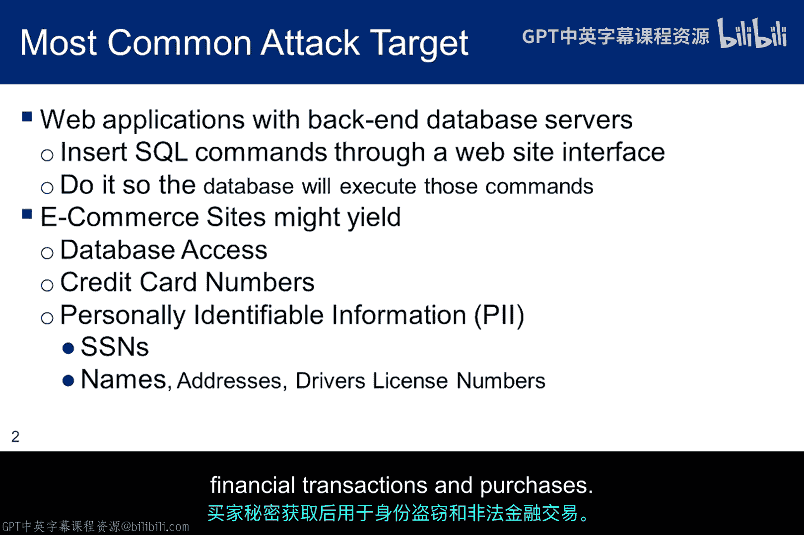

这种策略的核心是向数据库提交特殊字符，观察数据库的响应。通常，攻击者会尝试使用SQL查询中常见的分隔符，如单引号（'）或双引号（"）。通过分析数据库的错误信息或异常行为，攻击者可以推断出数据库的某些信息，并利用SQL查询的语法来构造更复杂的恶意输入。

### 2. 利用正常查询揭示信息

在这种策略中，攻击者提交看似正常的查询，但通过精心操纵输入参数，可以从数据库的响应中解析出重要信息。例如，通过尝试用不同的格式（如整数、十六进制值、数学表达式甚至SQL表达式）为行标识符赋值，观察数据库的不同响应，从而推断出数据库的结构或内容。

### 3. 利用SQL数据库的逻辑

这种策略旨在利用SQL数据库的逻辑，使其返回超出程序员预期的额外或不同的信息。这通常用于映射数据库结构。虽然程序员从未打算将这些信息返回给用户，但由于Web应用程序中存在薄弱或缺失的数据过滤器，攻击者可以请求并获取这些信息。

## 直接攻击与默认凭证

虽然本模块不重点讨论对数据库的直接攻击，但如果攻击者能够直接访问数据库，他们可能会尝试使用默认的配置信息。许多数据库系统在安装时使用默认的用户名和密码，如果管理员未更改这些设置，攻击者就可以轻易获得访问权限。

以下是几个常见数据库的默认凭证和监听端口示例：
*   **MySQL**: 用户 `root`， 密码为空， 端口 `3306`
*   **MS SQL**: 用户 `sa`， 密码为空， 端口 `1433`
*   **Oracle**: 用户 `scott`， 密码 `tiger`， 端口 `1521`

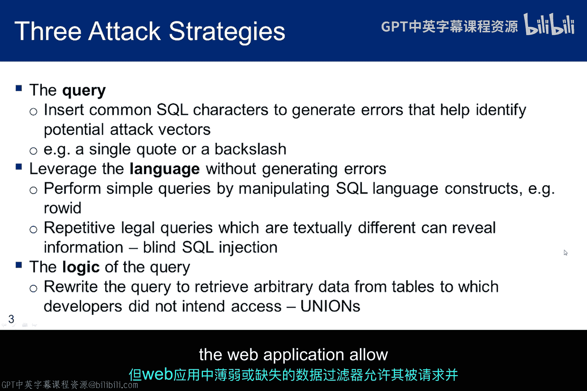

相应的缓解措施包括：不使用默认密码、删除不必要的账户以及更改默认监听端口。不过，更改端口对经验丰富的攻击者效果有限，他们可以通过扫描所有端口来发现数据库服务。

## 基本的SQL命令

理解SQL注入之前，需要了解一些基本的SQL命令。SQL语言非常复杂，但以下四个命令展示了如何创建表、插入数据、查询数据以及删除表。

```sql
CREATE TABLE users (name VARCHAR(20)， password VARCHAR(20));
INSERT INTO users VALUES ('john'， 'mypass');
SELECT * FROM users;
DROP TABLE users;
```

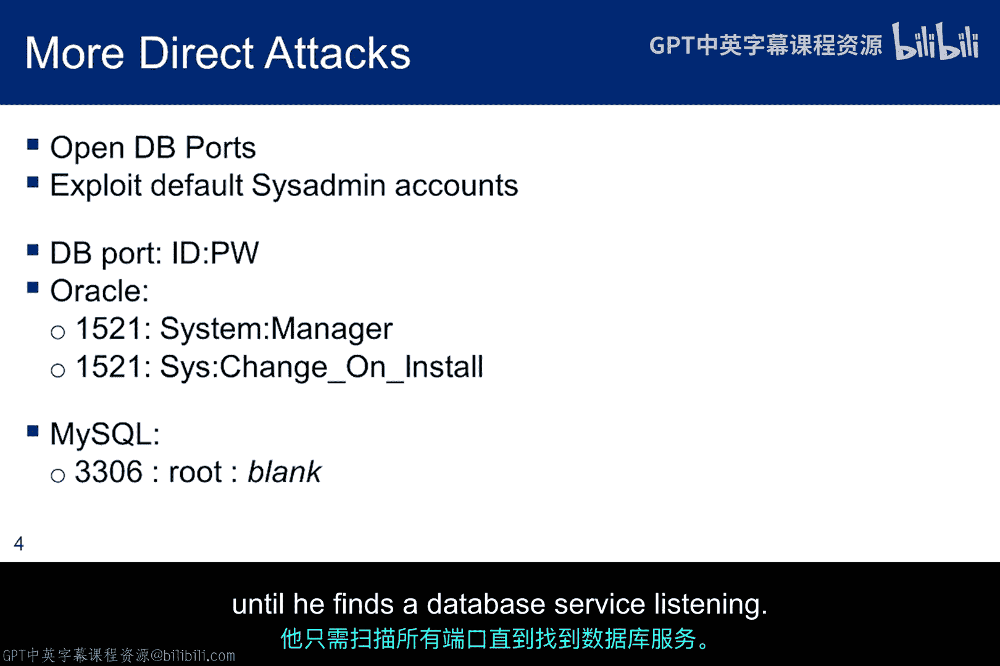

请注意，这里的 `CREATE TABLE` 语句非常简单，甚至没有定义键约束。这只是一个示例，说明可能通过Web服务器暴露给用户的简单命令。理解这些基本的SQL语法概念，有助于我们理解SQL注入是如何利用这些语法的。

## SQL注入示例解析

### 示例1：简单的登录绕过

考虑一个简单的数据库登录过程。Web表单提示用户输入用户名和密码，然后应用程序构造如下查询进行验证：

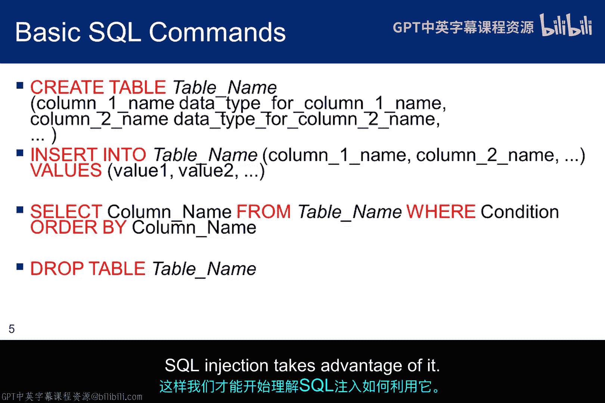

```sql
SELECT username FROM users WHERE username = ‘$user’ AND password = ‘$pass’;
```

如果用户输入 `admin` 作为用户名，`secret` 作为密码，则查询变为：

```sql
SELECT username FROM users WHERE username = ‘admin’ AND password = ‘secret’;
```

这是一个经典的SQL注入示例。攻击者可以在用户名或密码字段中输入特殊字符来改变查询逻辑。例如，在用户名字段输入：

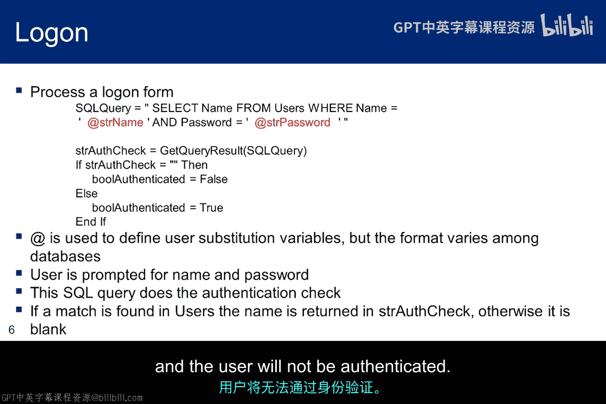

```
‘ OR ‘1’=’1
```

那么最终的查询语句会变成：

```sql
SELECT username FROM users WHERE username = ‘’ OR ‘1’=‘1’ AND password = ‘$pass’;
```

在这个例子中，第一个单引号闭合了原本的用户名检查。由于 `username = ‘’` 结果为假，但 `‘1’=‘1’` 永远为真，并且使用了 `OR` 逻辑连接符，因此整个 `WHERE` 子句的条件得到满足。数据库会返回用户表中的第一条记录，如果这是一个登录过程，攻击者就能以第一个用户的身份成功登录。

### 示例2：使用UNION操作符

另一个例子是利用 `UNION` 操作符来获取额外数据。假设一个查询根据城市筛选员工：

```sql
SELECT name， salary FROM employees WHERE city = ‘$city’;
```

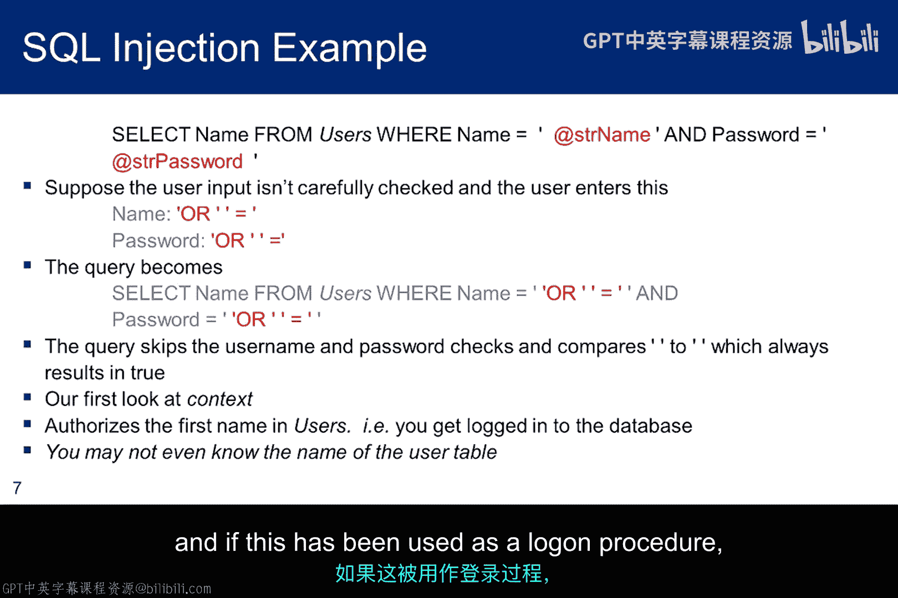

攻击者可以输入：

```
‘ UNION SELECT username， password FROM users --
```

那么查询将变为：

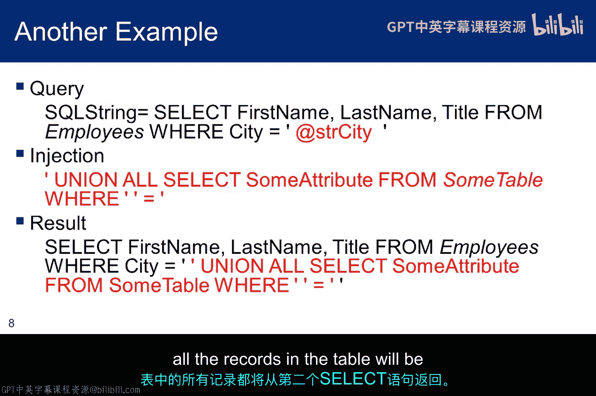

```sql
SELECT name， salary FROM employees WHERE city = ‘’ UNION SELECT username， password FROM users --’;
```

`--` 是SQL中的注释符，会使后面的单引号被忽略。这样，查询将返回 `employees` 表中城市为空的记录（通常没有），并联合（UNION）返回 `users` 表中的所有用户名和密码。

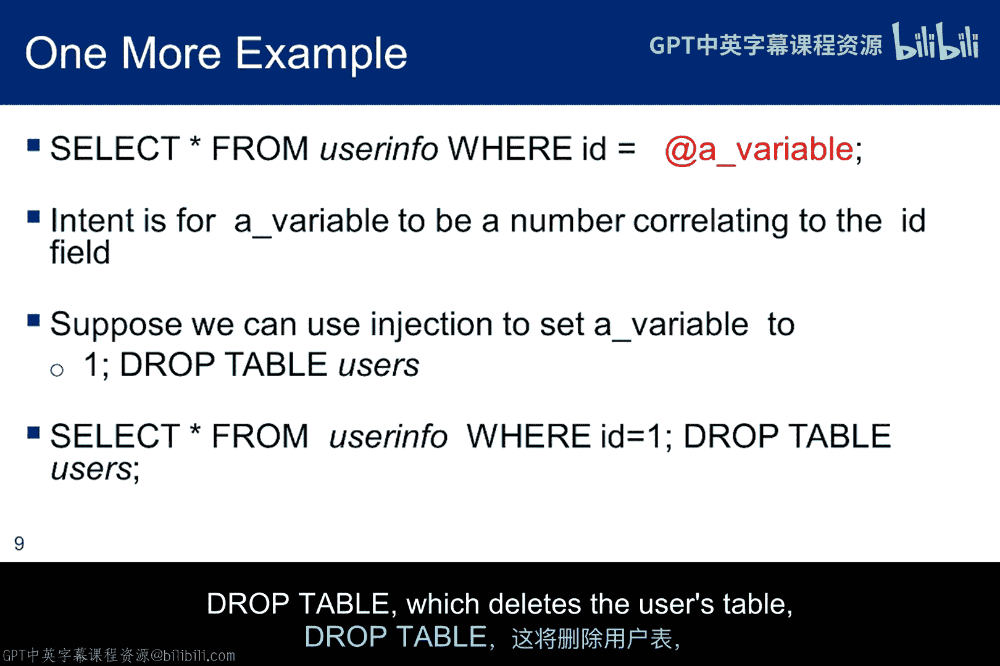

### 示例3：注入额外SQL语句

有时，注入点期望一个整数值（如用户ID）。程序员的本意是：

```sql
SELECT info FROM users WHERE id = $userid;
```

如果攻击者输入：

```
1; DROP TABLE users;
```

查询将变为：

```sql
SELECT info FROM users WHERE id = 1; DROP TABLE users;
```

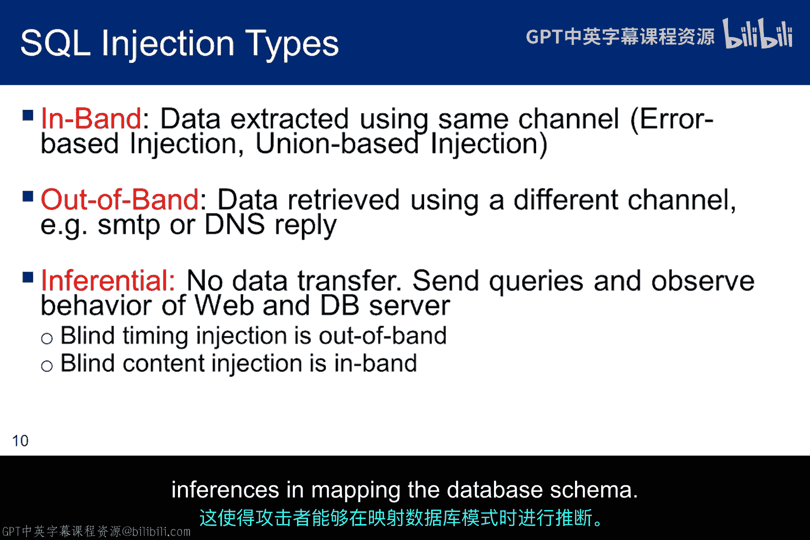

这会在执行完查询后，立即执行一个删除 `users` 表的语句，导致数据库无法使用，直到被恢复。

## SQL注入的分类

根据数据从数据库传输给攻击者的方式，SQL注入可以分为以下几类：

*   **带内注入 (In-Band)**: 最常见。攻击结果（如数据或错误信息）直接显示在Web页面上。
*   **带外注入 (Out-of-Band)**: 攻击通过Web发送请求，但信息通过其他渠道（如电子邮件、DNS响应）返回给攻击者。
*   **推断注入/盲注 (Inferential/Blind)**: 攻击者无法直接看到数据，但可以通过观察数据库对真假条件的不同响应（如页面返回时间的差异）来推断信息。**时间盲注** 是其中一种，攻击者通过诱导数据库在条件为真时延迟响应，在条件为假时快速响应，从而逐字符地推断出数据（如用户名和密码）。

## 利用Google搜索寻找目标

“Google黑客”是指利用Google的高级搜索功能来寻找可能易受攻击的网站或特定资源。例如，我们可以使用 `inurl:` 指令来查找数据库登录页面。

*   搜索：`inurl:login.php`
*   搜索：`inurl:index.php?id=`

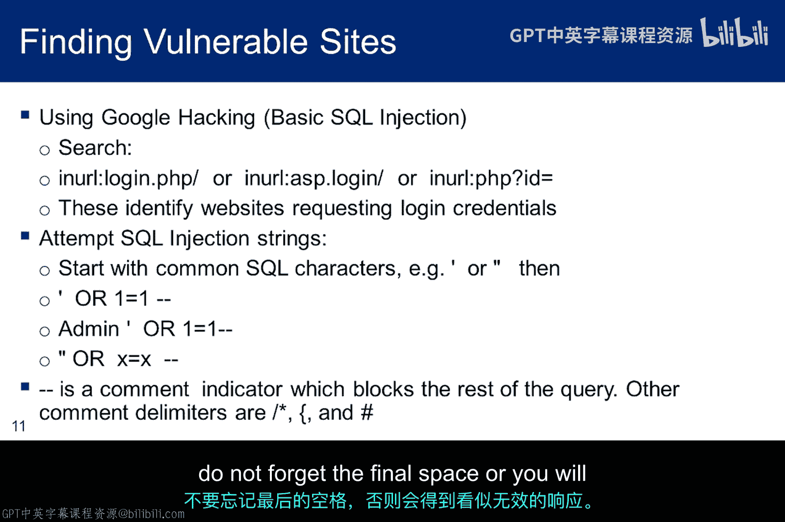

这些搜索可能会返回一些潜在的易受攻击的站点。攻击者可以尝试在这些站点的输入框中提交简单的注入字符串（如一个单引号 `‘`），观察是否有数据库错误信息返回，从而快速判断该站点是否存在SQL注入漏洞，并决定是否值得进一步深入探查。

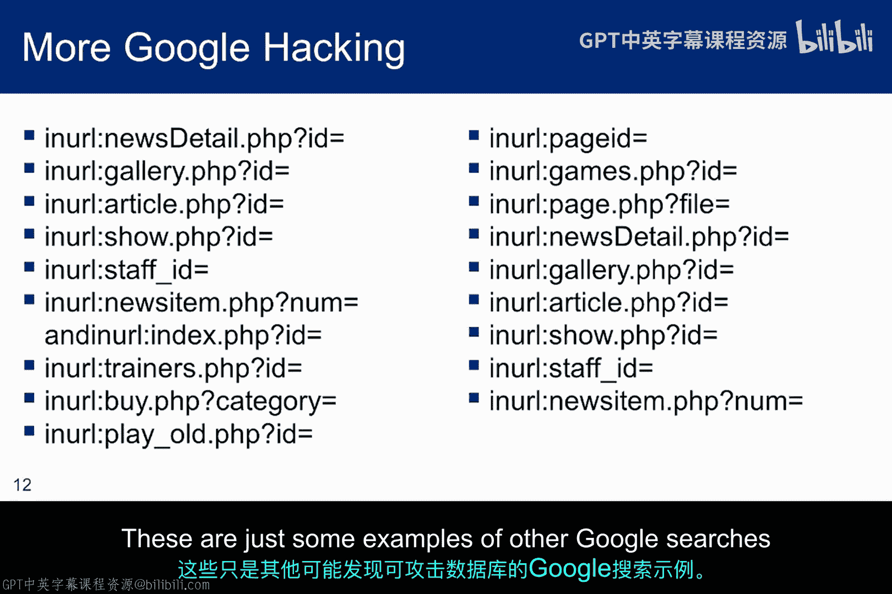

## 总结

本节课我们一起学习了SQL注入攻击的基础知识。我们介绍了三种主要的攻击策略：直接攻击查询、利用正常查询以及操纵数据库逻辑。通过多个示例，我们分析了如何利用SQL语法漏洞绕过身份验证、获取额外数据甚至破坏数据库。我们还了解了SQL注入的不同分类（带内、带外、盲注）以及如何利用Google搜索来寻找潜在的攻击目标。

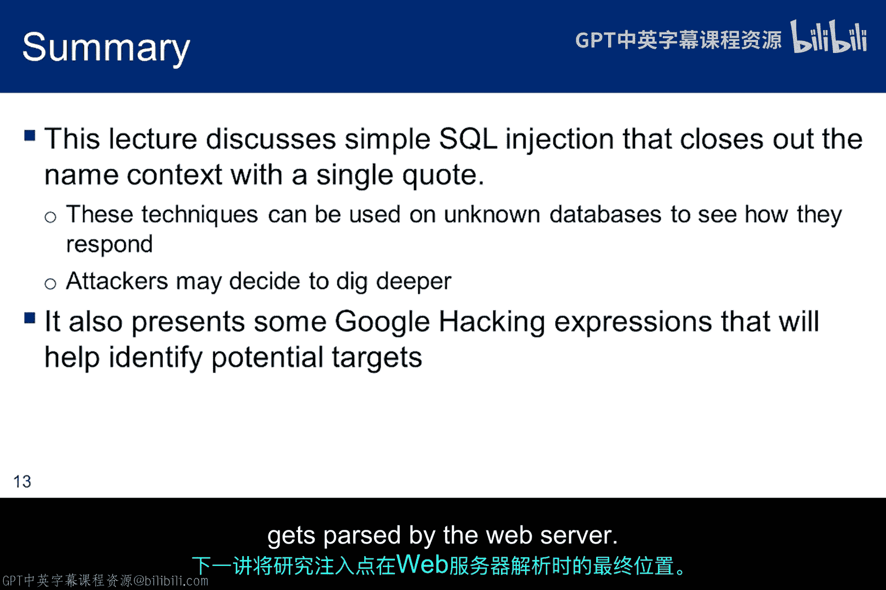

理解这些基础概念和示例，是进一步学习复杂SQL注入技术和防御措施的关键。在下一讲中，我们将更深入地探讨SQL注入的“上下文”问题，即攻击载荷在Web服务器解析后最终在SQL查询中所处的位置，这对于构造成功的注入攻击至关重要。