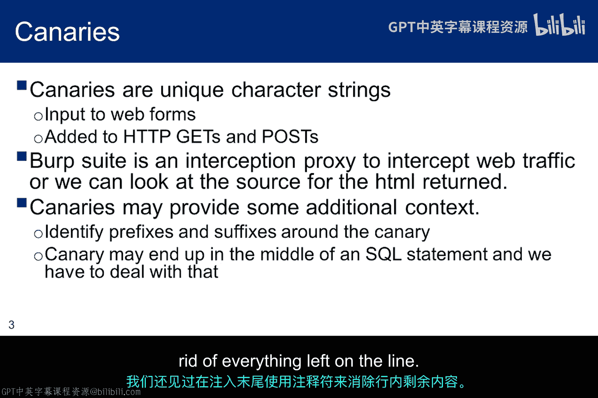
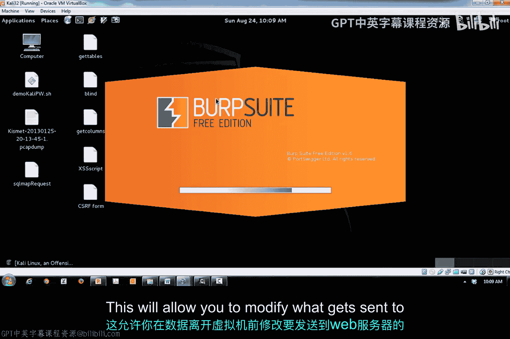
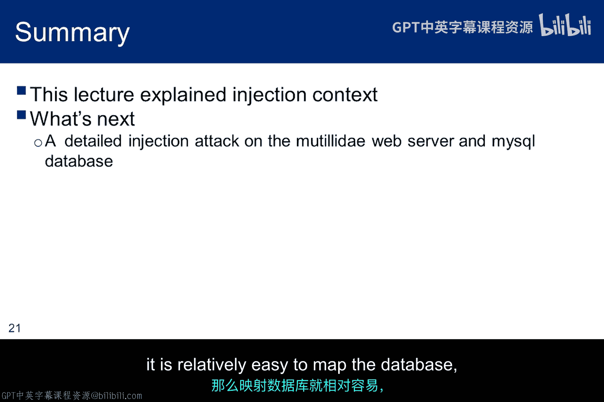

# 043：内容安全研究 🔍

在本节课中，我们将要学习**内容安全研究**的核心概念，特别是**SQL注入**攻击中至关重要的“上下文”概念。理解注入发生的上下文环境，是构造有效攻击载荷、绕过安全过滤并成功获取信息的关键。

## 理解注入上下文

上一节我们介绍了SQL注入的基本原理，本节中我们来看看**上下文**。上下文指的是Web应用程序在解析用户输入时，SQL注入载荷最终“着陆”的位置。

了解最终的上下文环境，能让我们修改注入载荷，使得最终的SQL语句在语法上正确，同时仍能泄露程序员本不打算公开的信息。我们开始时并不知道上下文，但我们已经知道单引号可以闭合一个比较语句，并允许执行额外的SQL子句。

如果这未能获取信息，SQL语句中还会经常出现其他字符。以下是SQL语句中常见的特殊字符列表：

*   `'` - 单引号
*   `"` - 双引号
*   `)` - 右括号
*   `;` - 分号
*   `#` - 井号
*   `--` - 双减号（SQL注释）

## 使用“金丝雀”探测上下文

“金丝雀”指的是一个独特的字符串，当HTML被传回浏览器时，我们可以追踪这个字符串来寻找它。我们会使用像Burp Suite这样的代理工具来捕获响应，或者使用Firebug查看源代码。这两种工具都将在实验中进行探索。

当然，金丝雀可能根本不会被返回。如果是这种情况，我们可以尝试其他字符。最好的情况是生成一个错误消息，直接向我们提供上下文信息。

没有上下文信息，在渗透测试Web应用时，可能需要大量信息来确定下一步。当我们注入特定上下文的字符串时，我们希望获得关于**应用程序异常**、**应用程序路径**、**平台路径**或**SQL命令**的披露信息，所有这些都将有助于优化注入攻击。

当然，如果我们被注入到另一个上下文（如JavaScript），上下文将完全不同。我们将在实验室中学习跨站脚本和跨站请求伪造时看到这一点。

## 上下文与安全编码

如果一个Web程序员试图通过过滤用户响应中的单引号来阻止简单的SQL注入，他可能犯了一个错误，因为这仍然可能容易受到其他类型的注入攻击。

因此，就像黑客或渗透测试人员一样，程序员也需要了解页面上所有可能的上下文，以便编写安全的代码。通过使用独特的字符串，我们可以在复杂的HTTP或HTML（包括输入和输出）中进行搜索，找到“金丝雀”。

## Burp Suite工具介绍

此时，我想简要介绍一下Burp Suite，这是一个位于浏览器和Web服务器之间的拦截代理。在Kali Linux中，你可以通过“应用程序” -> “Kali Linux” -> “Top 10 Security Tools” -> “Burp Suite”启动它。

这个工具允许你在请求离开虚拟机之前修改发送给Web服务器的内容，也可以在Web服务器返回的HTML被浏览器渲染之前查看它。

Burp Suite有几个标签页和子标签页。第一个要讨论的是**Proxy**子标签页。在这里，我们可以看到被Burp Suite拦截的消息。现在拦截是开启的，我们可以关闭它，再重新打开。如果我们现在浏览到Metasploitable 2，我们会看到那个GET请求被Burp Suite拦截了，我们可以将其转发到Web服务器。这是我们将从Web服务器得到的响应。

接下来是**Target**标签页。Target标签页会记录你访问过的所有页面（以黑色显示）。你未访问过但代表网页上锚点标签的页面以灰色显示。如果我们想实际检查并访问这些站点，这为我们提供了一种划定渗透测试范围的方法。我们可以右键点击一个站点，选择“Spider this host”来开始爬取。

关于Target标签页的另一点是，对于每个访问过的站点，你可以查看请求和响应。这个面板为你提供了访问站点的详细记录。

最后，**Repeater**标签页为我们提供了一种动态编辑POST和GET请求的方式。这样我们就不必反复回到浏览器输入文本，可以直接在这里进行编辑。事实上，你甚至可以创建一个脚本来自动化这个过程，从而实现一些渗透测试想法的自动化。

## 高级功能与注入点

接下来，我将讨论一些额外的截图，以演示Burp Suite中未在演示中涵盖的其他功能。

首先，在Target标签页的站点地图中，你可以看到一个URL列表。Burp Suite会记录所有发送到URL的GET请求、爬取的请求以及任何额外的手动请求，并捕获响应。即使拦截开关关闭，这些请求和响应在Target标签页上仍然可用。

过滤功能可以从Target标签页的站点地图标签页访问。只需右键点击过滤框。在我们的实验中，这不会起太大作用。但如果你正在爬取一个结构复杂、嵌套很多锚点标签的网站，这些设置有助于减少你需要查看的杂乱信息，例如，排除渗透测试范围之外的URL。

Repeater标签页已在演示中介绍，但我没有涵盖一个重要功能：你可以在Proxy页面拦截一个GET请求，然后右键点击拦截到的原始HTTP数据，选择“Send to Repeater”，将其发送到Repeater。

现在回到幻灯片，我将讨论Proxy原始数据标签页中的**注入点**。你可以看到参数被用红色高亮显示。你也可以选择“Params”标签页，Burp Suite会为你识别它们。它会提供变量类型、变量名、当前值，所有这些都可以在转发到Web服务器之前进行修改。这些就是注入点，你可以在这里插入字符，试图产生程序员未曾预料的结果。金丝雀通常会在GET请求中出现在这里。

顺便说一下，你可以在拦截页面上右键点击，在GET和POST之间切换。如果你这样做，你会看到GET和POST在结构上的差异。如果你试图通过URL而不是表单本身注入参数，理解这一点很重要。如果一个请求以POST方式发送，你将无法通过URL传递参数。因此，你需要一个代理来进行更改。我们将在讨论反射型跨站脚本时再次讨论这个问题，在那里你可能想使用电子邮件将脚本作为URL的一部分注入。当网页生成POST请求时，这将不起作用。

## 编码与注入构造

当你在Burp Suite捕获的请求中键入注入载荷时，你还可以要求Burp Suite在你键入时对新字符进行编码。其原理是，Web服务器会寻找两类基本字符：用于HTTP请求的字符和用于载荷的字符。当注入被添加到载荷中时，它可能包含被Web服务器解析为HTTP的字符。结果，字符串被破坏，注入失败，或者你从Web服务器得到一个错误的请求错误。

编码的目的是确保注入载荷中的字符不会被解析为HTTP。基本上，编码消除了HTTP和SQL之间的任何重叠。因此，Web服务器中的PHP解析器获得整个字符串，载荷对其进行解码，并将其完整地发送到数据库。在Proxy页面，右键点击捕获请求周围的空白区域，选择“URL-encode as you type”。当你修改Burp Suite中的请求时，字符将在你键入时被正确编码。

## 直接与间接注入

表单数据被插入到SQL模板中的方式有多种，程序员如何编写这个模板将决定如何构造注入。幻灯片上显示的术语——**直接注入**和**间接注入**——捕捉了这个概念。

一个关键点是，SQL不要求数值周围有引号，但如果应用程序没有对输入数据实施限制，这个参数就有被利用的潜力。

在第一种情况下，如果模板中没有引号，任何非数字的字符串字面量都将成为SQL语句的一部分，并且不会被数据库视为字面量，从而导致直接注入。这并不意味着非数字的值会被放入EMP_ID，而是引号的缺失允许查询本身被更改。

在第二种情况下，如果模板中有引号，只要我们能够突破模板的束缚，注入仍然有效。通过理解上下文并以语法正确的方式匹配模板中的两个单引号，我们可以实现这一点。

## 关于上下文的最后思考

我们可以通过精心构造前缀和后缀来匹配预期的引号，从而突破模板；或者我们可以尝试只处理第一个输入参数的前缀，并使用注释语句来绕过语句的其余部分。匹配的方式更优雅，但如果我们无法获得提供良好上下文描述的错误消息，尝试注释可能是唯一的选择。

SQL注入或任何类型的注入，都依赖于理解插入的字符到达Web服务器时将“着陆”在何处。它们着陆的位置将决定Web服务器在将其转发给后端应用程序（对于SQL，当然是数据库）之前如何解析它们。异常字符生成的错误消息有时会揭示有关上下文的信息。

一般来说，当你没有任何上下文信息时，你必须利用你对SQL的了解以及表单页面上的参数标识符来尝试猜测上下文可能在哪里。例如，当登录页面要求输入姓名时，很可能它会被单引号括起来，但我们不知道PHP程序将如何解析它。如果代码编写得当，所有的注入尝试都不应允许你突破上下文。如果你能轻易突破，那么映射数据库就相对容易，我们将在下一节看到这一点。

---

本节课中我们一起学习了**内容安全研究**的核心，重点是理解并利用**SQL注入的上下文**。我们探讨了如何使用“金丝雀”字符串探测上下文，介绍了Burp Suite这一强大工具来拦截、修改请求并分析响应，从而识别注入点。我们还区分了直接注入和间接注入，并强调了通过编码和精心构造前缀/后缀来适应不同上下文的重要性。掌握这些概念是进行有效且符合道德的渗透测试的关键步骤。