# 044：数据库映射技术 🗺️

在本节课中，我们将学习如何利用SQL注入漏洞来映射和探查后端数据库的结构与内容。我们将以Mutiliday这个易受攻击的Web应用为例，演示从发现漏洞到提取数据库表名、列名乃至用户凭证的完整过程。

上一节我们介绍了SQL注入的基本原理，本节中我们来看看如何利用这些原理进行系统性的数据库信息收集。

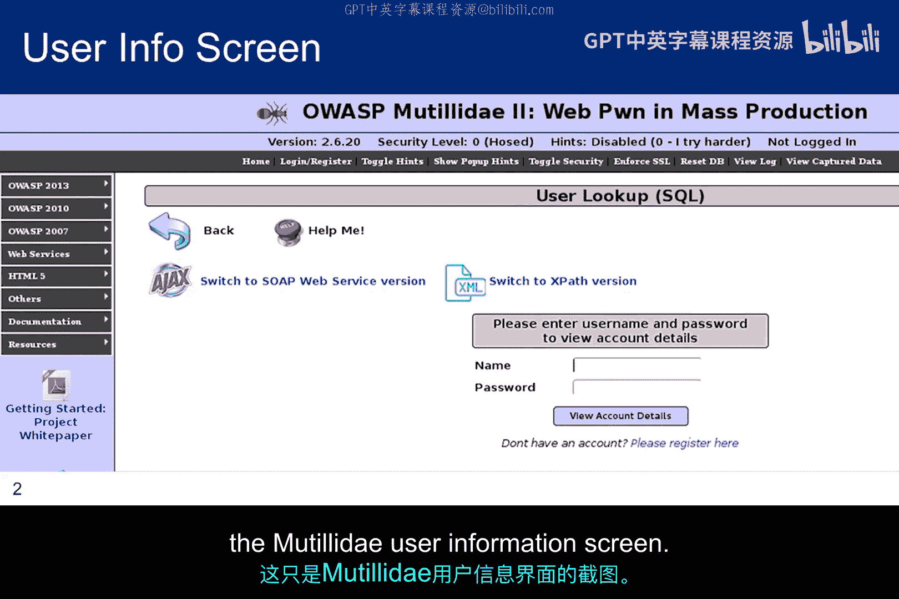

## 发现注入点与错误信息利用

Google Hacking等技术可以帮助我们识别背后有数据库的Web服务器。下一步是访问目标网站并寻找注入向量。

在Mutiliday案例中，我们发现了一个向账户持有者返回用户信息的表单。然而，我们并非账户持有者。我们该怎么办？又能发现什么？

这是一个Mutiliday用户信息界面的截图。

如前所述，我们可以从尝试一个“金丝雀”值（如“Mike”）开始。但即使Mike没有账户，我们也不会得到有用信息。查询语法是正确的，因此错误信息仅提示账户未被识别，并未泄露任何内容。

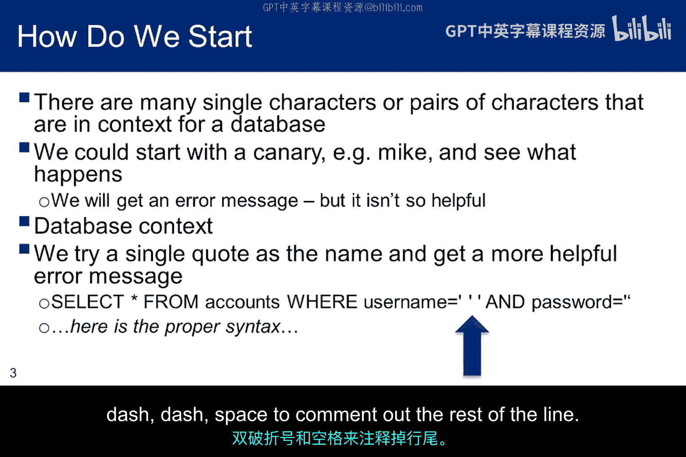

然而，我们讨论过在SQL查询上下文中可能引发错误的字符，例如不匹配的括号等。如果在Mutiliday中尝试输入一个单引号，数据库会返回一个错误信息，该信息揭示了用户输入的正确语法。

数据库本意是帮助我们登录，但它泄露了过多信息。在实际场景中，程序员绝不应允许这种情况发生。现在，我们对如何继续操作有了一些思路。

## 构造SQL注入语句

根据之前的讨论，现在我们知道了可以构造一个注入语句：以一个单引号开始，后面跟上注入内容，然后是空格、双减号、空格，以注释掉该行的其余部分。

`' [注入内容] -- `

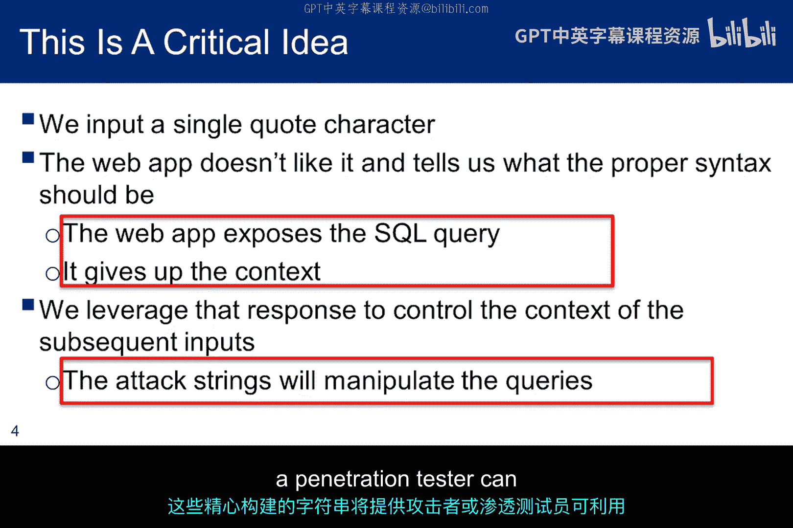

如果不真正理解上下文，也能轻松完成实验作业，但这是错误的。你需要能够回答这两个问题：第一，应用程序暴露SQL查询有何价值？第二，我们如何利用该信息来操纵查询字符串以产生观察到的结果？

Web应用本不应暴露查询，但当它暴露时，我们就获得了大量关于查询字符串应为何样的信息。一旦知道这一点，我们就可以构造程序员未曾预料需要解析的字符串，而这些精心构建的字符串将提供关于后端数据库的重要信息，攻击者或渗透测试员可以利用这些信息获取更多细节。

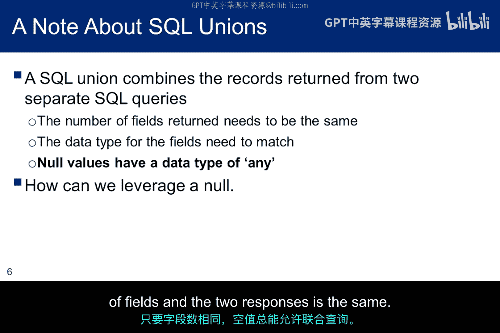

**提醒**：如果你忘记在注入后加上“空格、双减号、空格”，你的注入将会失败，你会感到非常沮丧。

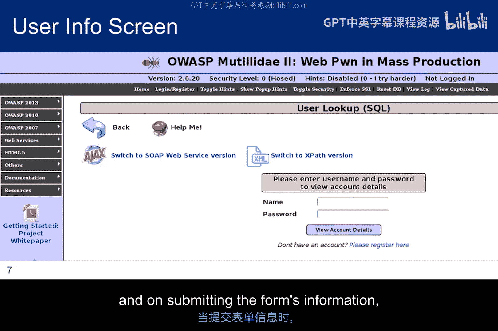

## 利用UNION查询确定列数

SQL UNION操作符用于合并两个或多个SELECT语句的结果集。然而，UNION操作失败，除非两个SQL响应的字段数量相同，并且列的数据类型匹配。如果满足这两个条件，UNION将返回第一个查询的所有记录加上第二个查询的所有记录。

一个重要的概念是关于NULL字面量。由于NULL值具有“任何”数据类型，如果两个响应中的字段数量相同，NULL将始终允许UNION操作成功。

这是本次讨论中将使用的Mutiliday用户信息界面。程序员的意图是用户输入用户名和密码，提交表单信息后，获取用户账户的详细信息。

**注意**：Microsoft PowerPoint倾向于将双连字符转换为一个长破折号。因此，当你在幻灯片上看到这种情况时，请记住注释是双连字符。

从之前收到的错误信息中，我们知道可以注入UNION语句。如何利用它来获取后端数据库的信息？

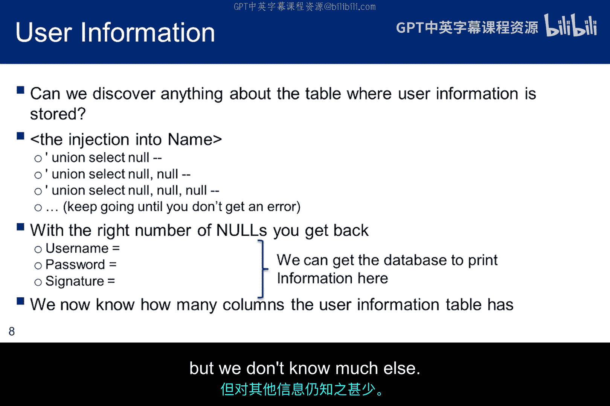

由于NULL可以与任何数据类型进行UNION操作，我们可以从一个NULL开始进行UNION注入。我们得到了一个语法错误，因为字段数量与包含用户信息的表中的字段数量不匹配（我们尚不知道，但很可能这是用户表）。实际上，当你尝试1、2、3、4个NULL时，都会得到语法错误。但当你为UNION输入5个NULL时，你会得到返回信息而不是错误。

这再次奏效，因为NULL数据类型可以与任何类型进行UNION。但如果两个查询结果中的列数不同，你会得到错误。因此，当我们没有收到错误时，NULL的数量就与包含用户信息的表中的列数匹配。现在，我们知道了用户信息表中的列数，但其他信息知之甚少。我们该如何继续？

## 识别可返回数据的列

考虑到整数1可以转换为大多数数据类型，它很可能与UNION中的数据类型匹配。

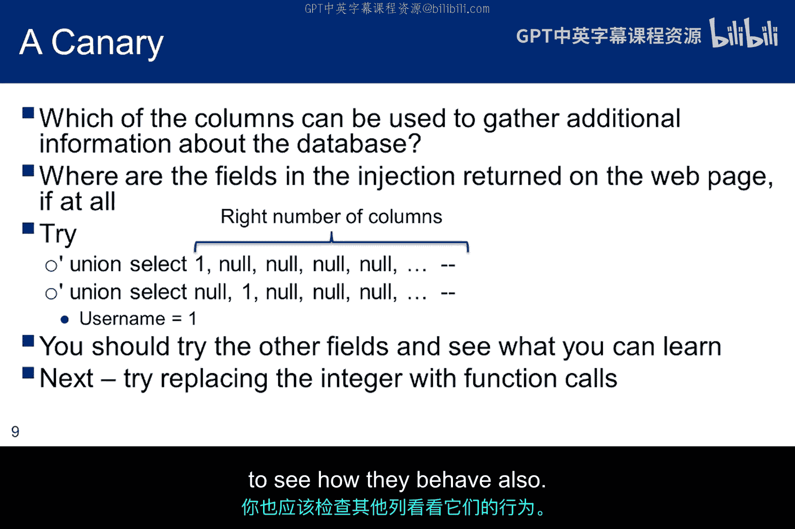

因此，我们可以尝试在注入中用1代替NULL，看看Web应用是否会在选中的记录中返回它。如果我们尝试在第一个列中插入1，没有任何返回。我们并不真正知道这意味着什么或如何解释它。

然而，如果我们尝试在第二列中插入1，我们看到它被作为用户名返回。现在我们知道，如果能在UNION注入中注入一些SQL函数调用请求，我们或许能够获取额外信息。在实验中操作时，你也应该检查其他列，看看它们的行为如何。

## 利用UNION查询获取数据库信息

我们知道UNION查询有效，并且知道第二列将作为用户名返回。那么，我们如何获取关于数据库的额外信息？

我们可以尝试`version()`函数调用，并返回PHP版本号。Mutiliday已经在正常显示中提供了该信息，但Web服务器通常不会也不应该这样做。在某些情况下，可能需要在注入中添加“version returned as username”部分，但对Mutiliday则不需要。

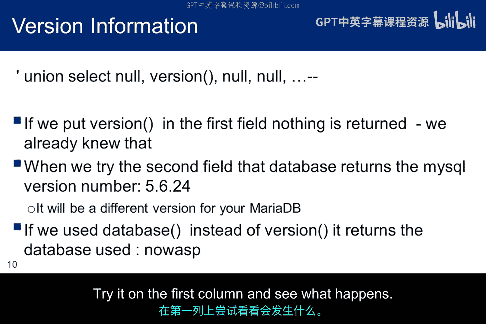

类似地，注入`database()`函数调用将返回数据库版本。请注意，在这种情况下，用户名的数据类型是字母数字型，因此与UNION关联的数据类型约束得到满足，信息得以返回。

这种注入可能并非在所有列中都有效。例如，如果数据类型是整数型，它很可能会失败。你可以在第一列尝试一下，看看会发生什么。

## 获取数据库中的表名

至此，我们知道了包含用户信息的表有多少列，但我们不知道表名。有没有办法修改注入来获取表名？答案是肯定的，并且继续使用UNION注入。

在MySQL命令行界面中，输入`SELECT table_name FROM information_schema.tables`会得到相同的结果。你可以看到命令行输入与我们在易受攻击列中用`table_name`替换NULL的注入之间的相似性。

这种注入的问题是，它会给出MySQL中所有已建立数据库的所有表名。因此，下一步是将表列表限制在目标数据库中。我们已经确定数据库是`os10`，因此我们可以使用WHERE语句在`database()`或`os10`上进行约束。

该查询将把响应限制在我们正在攻击的数据库中的表，而不是MySQL中创建的所有其他数据库。我们开始看到，掌握一些SQL查询专业知识会使SQL注入变得容易得多。这是一个重要的观点：如果你想对数据库Web应用进行渗透测试，或者想保护数据库免受黑客攻击，你必须理解结构化查询语言。

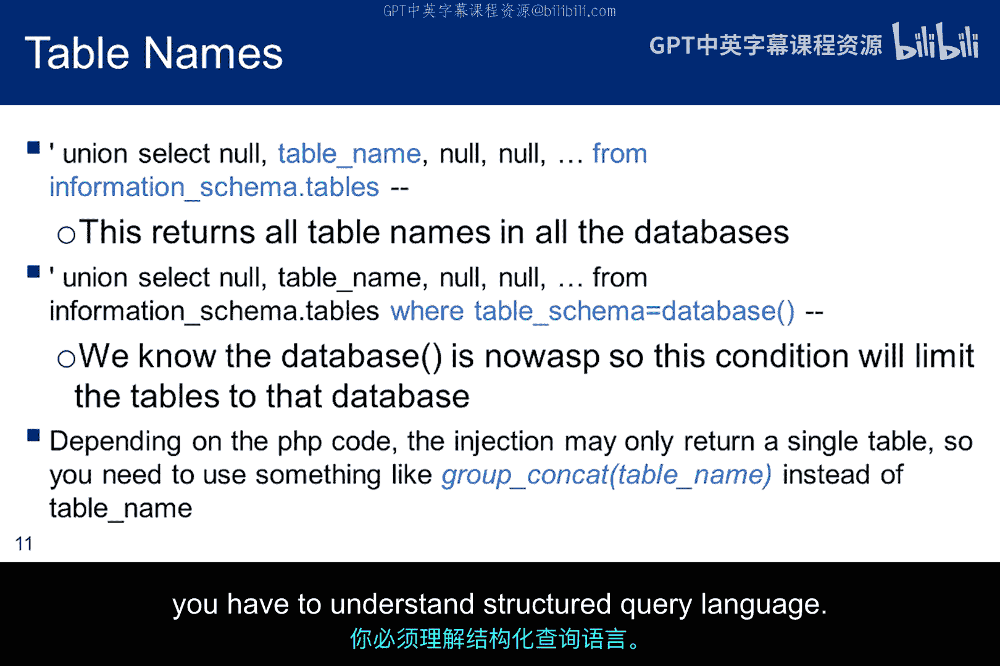

## 分析获取的表名

以下是最后一次注入返回的`os10`数据库中的表。仅凭名称，我们就可以猜测用户名和密码可能存储在哪里。

如果你使用的是最新版本的Mutiliday（其数据库是`nowasp`而非`os10`），你将得到这些表以及其他7个表。无论哪种情况，你都可以在启动MySQL并使用`os10`或`nowasp`数据库后，通过MySQL命令行界面输入`SHOW TABLES;`来确认表名。

现在，我们对`accounts`表感兴趣，因为我们相当确定它有五列，并且可能包含用户名和密码。然而，此时我们仍然不知道列名，也无法确认表的任何内容。当你在实验中思考这些关于`accounts`表的想法时，你将被要求对`accounts`表和`credit_cards`表应用相同的技术。

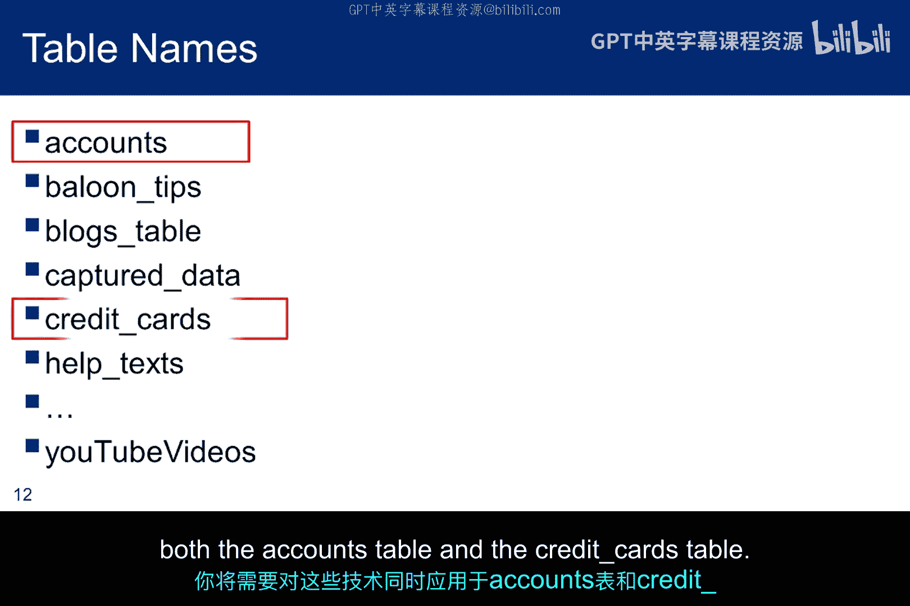

另一种策略可能是尝试猜测表名，我们可以做出像这里展示的合理推测，但我们可能永远猜不到用户表的名字是`accounts`。与其猜测，SQL注入帮助我们更有条理。

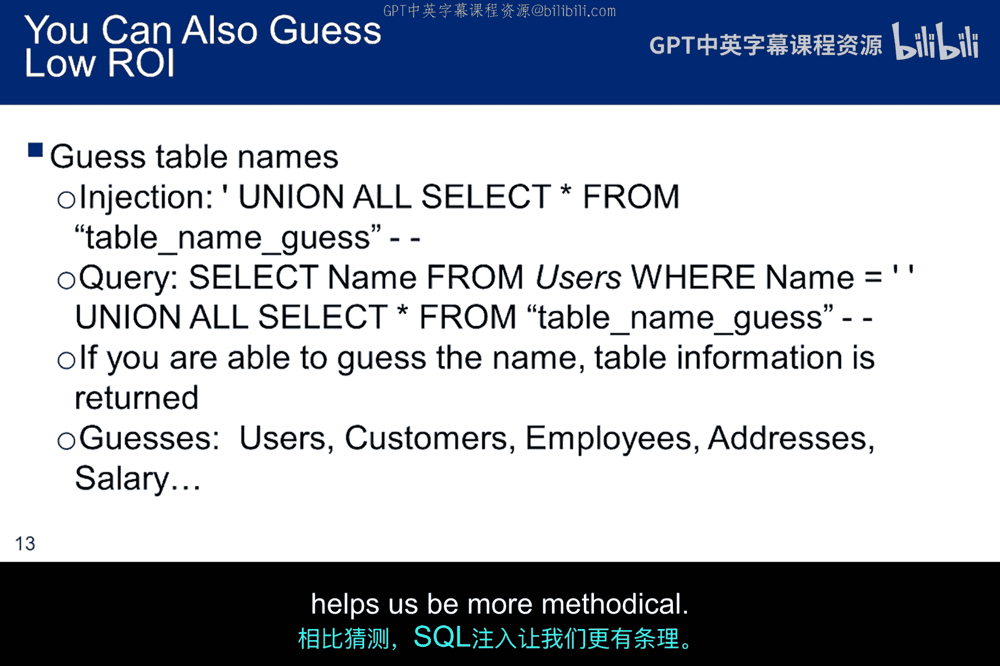

## 获取表的列名

我们知道了表名、列数和数据库名，但如何获取列名？我们可以使用相同的注入技术，但专注于列而不是表。再次，你明白为什么掌握一些SQL和表结构知识是有帮助的。

与表类似，列名注入将返回所有列名。然而，列名将按照它们在模式中出现的顺序返回。由于之前的注入显示`accounts`是模式中的第一个表，并且我们知道它只有五列，数据库将返回我们感兴趣的列名。

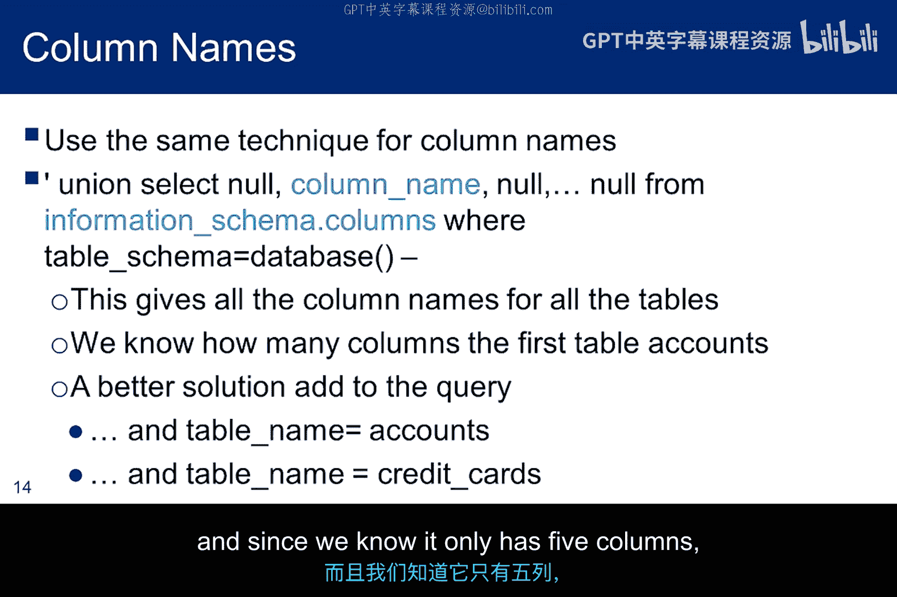

## 提取最终数据：用户名和密码

现在，我们看到`accounts`表包含`username`和`password`列。密码列通常包含密码哈希值，但Mutiliday省略了这种复杂性，以便我们更专注于Web服务器和数据库。我们只需要担心像John the Ripper这样的工具来处理哈希。

最后，使用不同SQL表达式的相同UNION注入将返回用户名和密码。我之前提到过`GROUP_CONCAT`作为一种同时获取多条信息的技术。在这种情况下，我们将首先用列分隔符连接用户名和密码，以使响应更易于阅读。

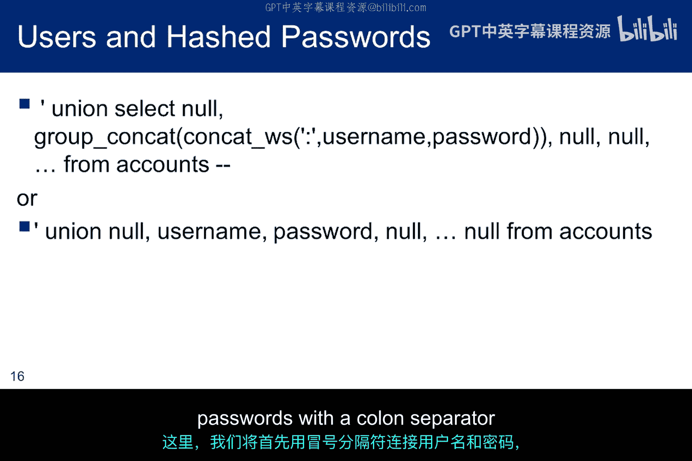

我们得到了用户和密码。这与我们在命令行界面输入`SELECT username, password FROM accounts;`得到的响应相同。再次强调，密码没有经过哈希处理。如果它们被哈希了，下一步将是尝试密码破解器或对哈希进行字典攻击。

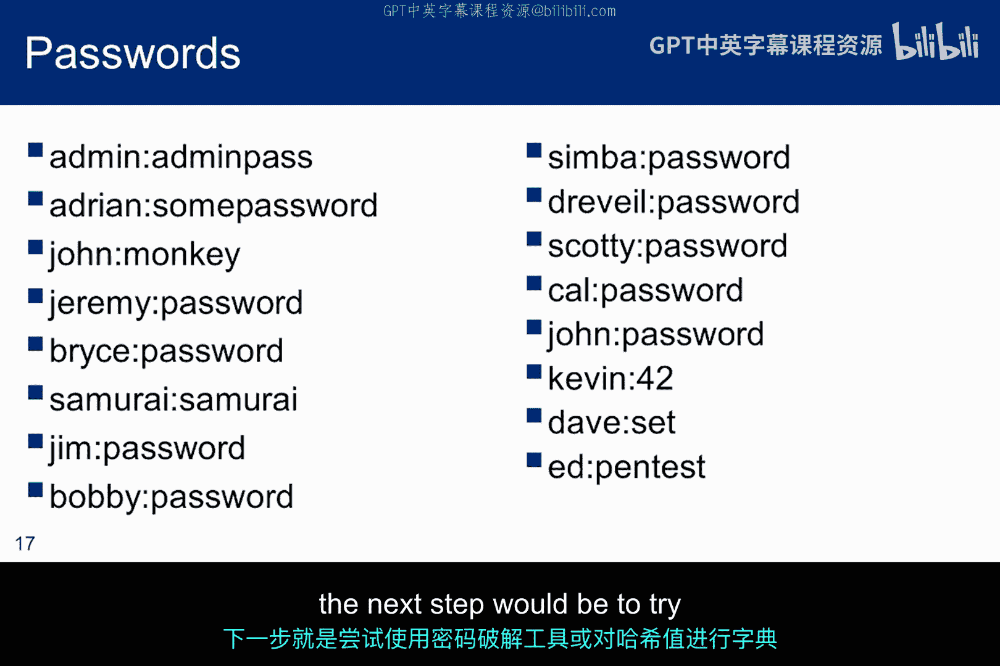

## 总结与下节预告

总结一下，鉴于Mutiliday易受注入攻击，我们讨论了如何恢复数据库名称、数据库中所有表的名称、所有表的所有列名。一旦我们识别出用户表，就能获取所有用户名和密码。相同的技术可以用于其他表，例如恢复信用卡号码或姓名、地址和社会安全号码等个人身份信息。

在下一个子模块中，我们将讨论盲SQL注入。这适用于Web服务器易受攻击但返回信息量非常有限的情况。有必要逐位收集信息片段。从某种意义上说，这是一种更暴力的方法，因为我们尝试字母表中的所有字母，逐个字符地恢复表名、列名或用户名。

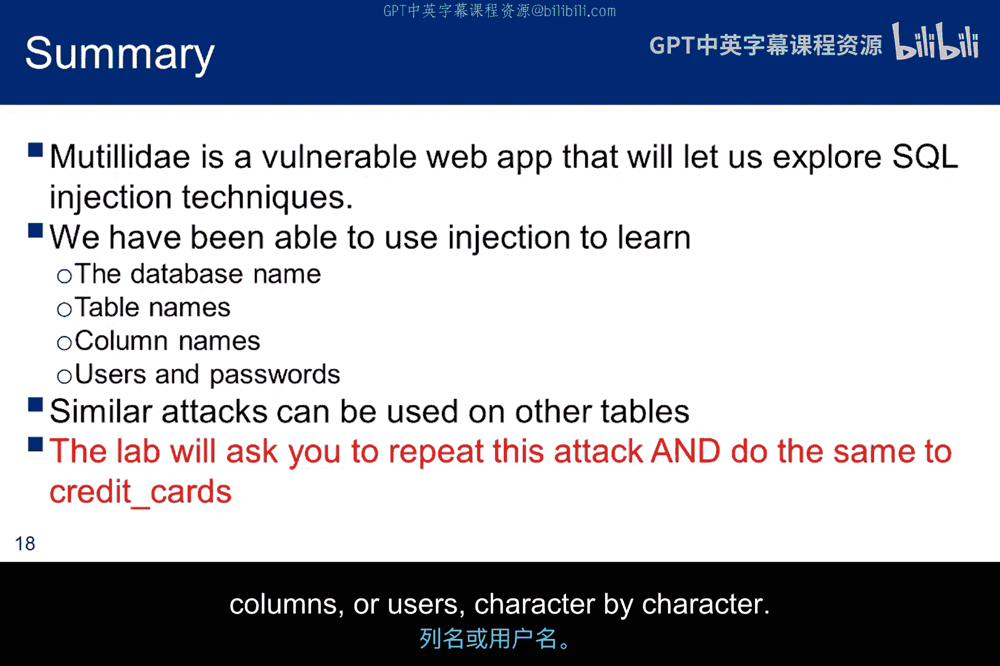

本节课中我们一起学习了如何利用SQL注入漏洞进行系统的数据库映射，从确定列数、识别有效列，到获取数据库、表、列的详细信息，最终提取敏感数据。掌握这些技术对于理解数据库安全漏洞的本质至关重要。