# 045：盲注SQL攻击 🕵️

在本节课中，我们将要学习一种特殊的SQL注入技术——盲注SQL攻击。当目标数据库服务器不像Mutillidae那样直接返回大量信息时，盲注为我们提供了一种可行的攻击思路。

## 概述

盲注SQL攻击之所以被称为“盲注”，是因为攻击者无法从数据库的响应中直接看到有价值的信息或具体的查询结果。即使数据库存在注入漏洞，我们之前讨论的传统注入方法也可能失效。本节将介绍盲注的工作原理、实施方式以及相关的自动化工具。

## 什么是盲注SQL攻击？

上一节我们介绍了基于错误信息的SQL注入。本节中我们来看看，当服务器不直接返回数据时，攻击者该如何操作。

盲注SQL攻击的工作方式不同，它基于服务器对特定请求的响应来推断信息。攻击者精心构造请求，使得每次响应只泄露一点信息。这个过程有时被描述为：通过询问一系列“是/非”问题，来获取一个更复杂、更长的答案。

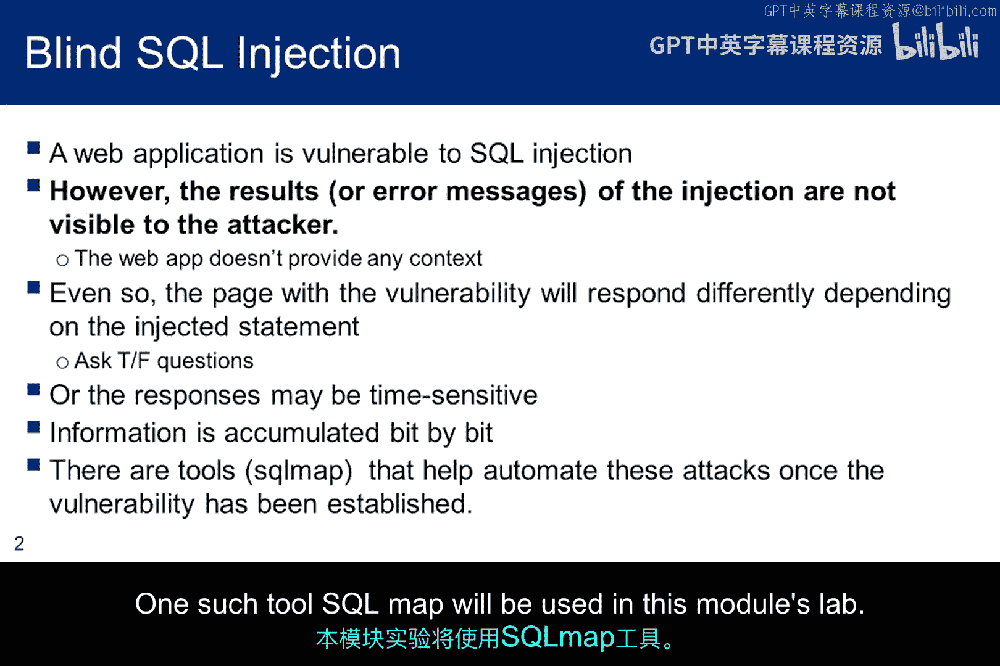

服务器可能通过几种方式回答这些“是/非”问题：
*   它可能返回一个错误信息，也可能不返回。
*   另一种方法是引入一些会减慢或加快服务器响应的注入语句，以此来收集信息位。

虽然接下来会有一些例子，但这是一个非常耗时的过程。收集到的信息可能是一个字符一个字符地获取。由于信息是逐位累积的，注入请求必须为收集到的每一位信息进行修改。例如，为了推断一个用户名中某个字符的相关性，可能需要提交26个请求（对应26个字母）。为了避免这种繁琐的工作，已经开发出一些工具来自动化推理和修改问题。在本模块的实验中，我们将使用工具SQLmap。

## 盲注攻击示例

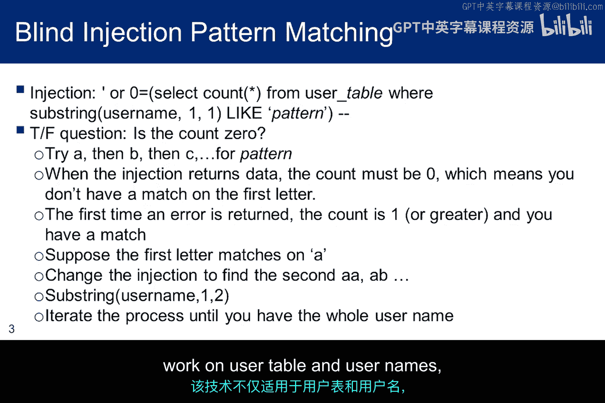

以下是盲注SQL攻击可能的工作方式示例。

这个注入语句遍历用户表，检查每个用户名的第一个字符是否匹配字母“A”。它统计匹配的数量。如果有一个或多个匹配（即数量大于0），则返回一个错误，因为 `0 != 1`。如果没有找到任何以“A”开头的名字，那么 `0 = 0`，不会生成错误。

```sql
SELECT COUNT(*) FROM users WHERE name LIKE 'A%';
IF (COUNT(*) > 0) THEN RAISE ERROR;
```

一旦你找到了用户名的第一个字符，你就继续处理第二个字符，使用稍微修改的注入语句来捕获第二个字符，依此类推。最终，你将获得数据库中一个用户的完整名称。随着这个过程的继续，有可能获取所有用户的名称。

当然，这种技术不仅适用于用户表和用户名。它对所有表都有效。

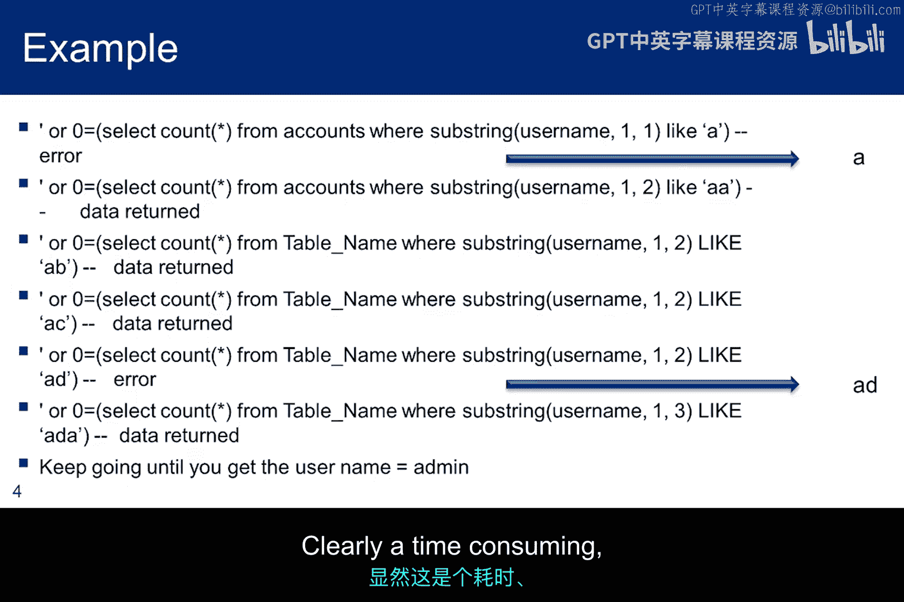

## 盲注攻击的实践过程

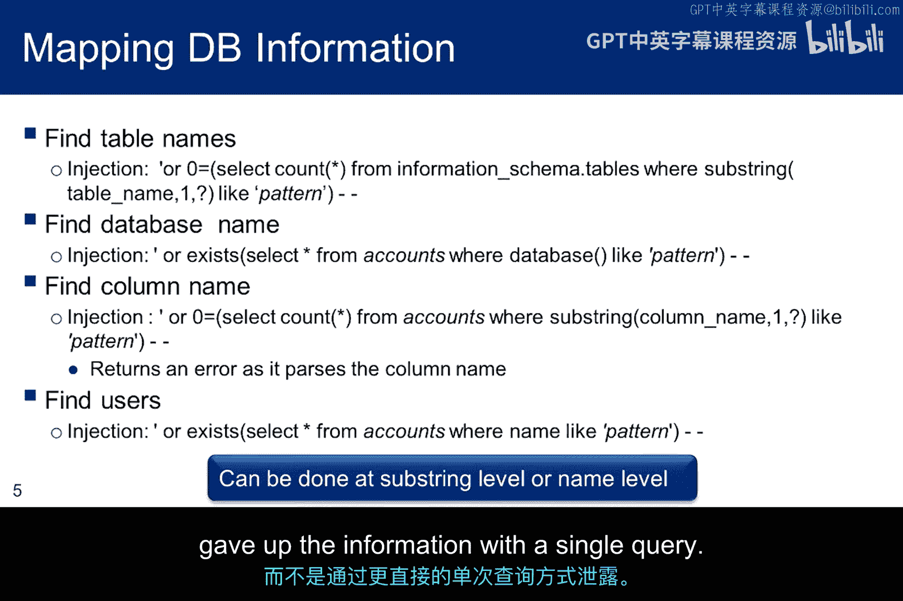

如果你开始对Mutillidae的账户表进行盲注SQL攻击，你可以看到为了提取出“admin”这个名字所需要经历的一系列注入。在这个例子中，你会在第一次注入时识别出“A”，在第五次注入时识别出“D”，并且需要13次以上的注入来捕获“M”（因为M是字母表中的第13个字母），等等。显然，这是一个耗时、繁琐但有效的过程。

在前面的例子中，我们知道了用户表的名称，但我们是如何获取它的呢？这张幻灯片展示了一些可以用来捕获信息的盲注语句，这些信息在之前Mutillidae数据映射课程中讨论过。

这里显示的第一个注入，可以获取表名。在OWASP 10的案例中，你可以很容易地挑出用户表。对于更复杂的数据库，我们可能需要进行额外的工作。例如，我们可能必须找出数据库中每个表的列名，直到找到一个看起来可能包含用户列表的列。

幻灯片上的另外三个注入分别可以获取数据库的名称、用户表中的列名以及用户表中的用户。然而，在每种情况下，信息都是逐位捕获的，而不是通过更直接的方法（通过单个查询就给出所有信息）。

## 基于时间的盲注攻击

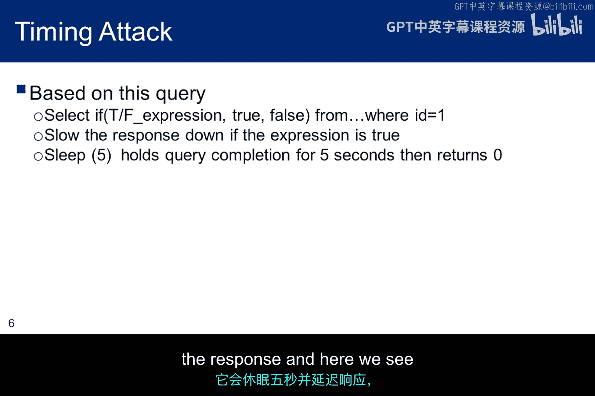

在这种伪代码中，真/假表达式提出了真/假问题，数据库提供了一个盲注SQL答案，但真/假检查使用了`IF`语句，这允许在答案为真和答案为假时应用不同的约束。例如，我们可以在答案为真时减慢查询响应速度，在答案为假时不进行任何操作。这为盲注引擎提供了另一种确定问题答案的方法。如果数据库对模式匹配问题的响应方式不允许基于视觉逐位推断，这种方法就会很有用。

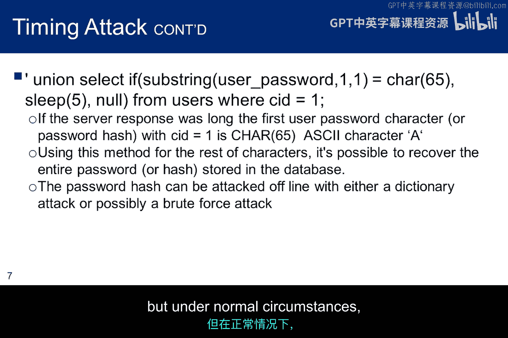

`sleep`函数是一个SQL函数，它会让进程休眠5秒，从而延迟响应。这里我们看到了更多细节，展示了时间攻击可能如何工作。

```sql
IF (SUBSTRING(user_password, 1, 1) = 'A') THEN SLEEP(5);
```

如果用户密码字符串的第一个字符是大写字母A，查询将休眠5秒。如果不是A，响应会立即返回。因此，时间可以以与之前利用错误信息来慢慢获取密码哈希相同的方式被利用。再次说明，在Mutillidae的案例中，密码是明文存储的，但在正常情况下，你将不得不破解密码。

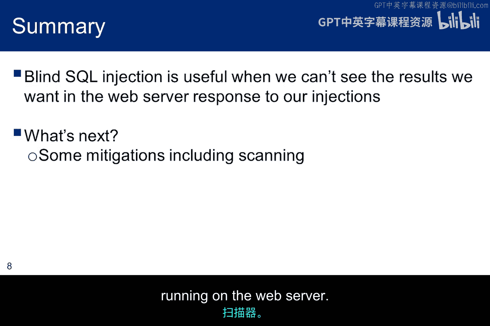

## 总结与延伸

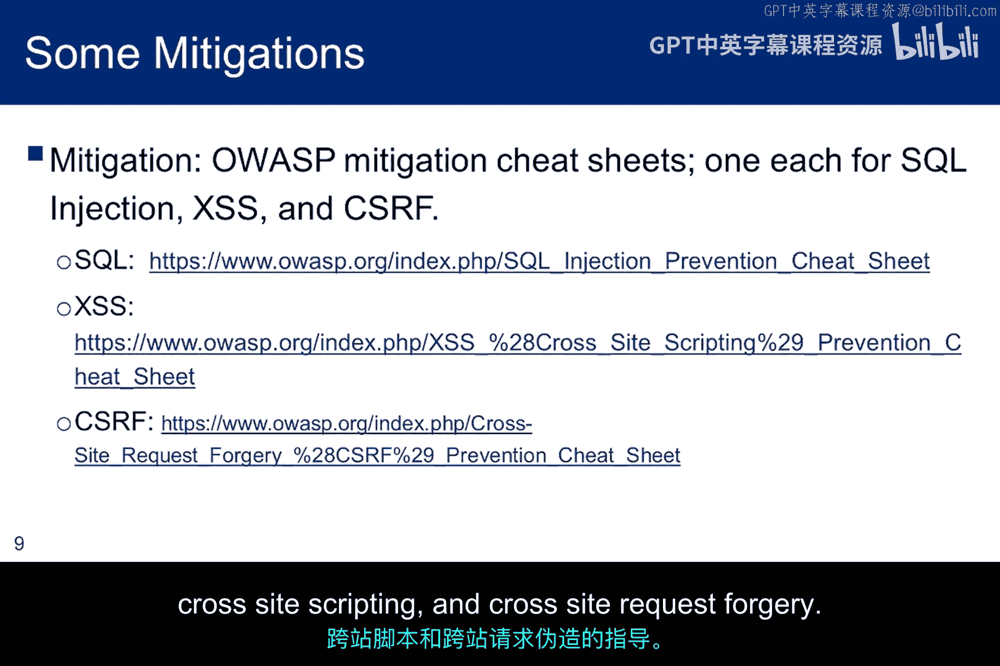

本节课中我们一起学习了盲注SQL注入。它提供了一种在注入无法一次性获取所有信息时，逐字符披露信息的方法。本讲座没有详细讨论SQLmap，但它是一个盲注SQL注入工具，你将在针对Mutillidae的实验中学习使用它。

本部分的最后讨论将向你介绍一些针对我们讨论过的三种Web漏洞的OWASP缓解指南。之后将简要讨论用于查找Web服务器上运行的应用程序中漏洞的Web应用扫描器。

## 漏洞缓解与扫描工具

花时间回顾这三个OWASP速查表是值得的，因为它们提供了如何防御SQL注入、跨站脚本和跨站请求伪造的指导。

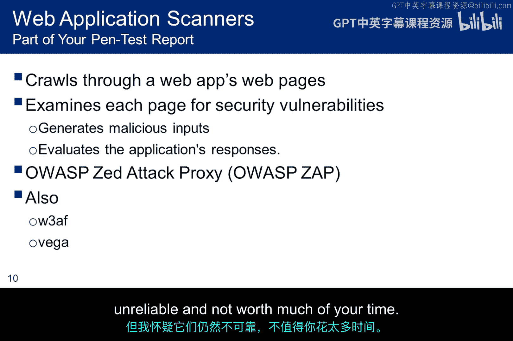

本模块的实验要求你对Mutillidae应用程序运行Web应用扫描器。你不必将这些结果作为作业提交，但需要在你的渗透测试报告中包含这些扫描结果。别忘了做这件事。

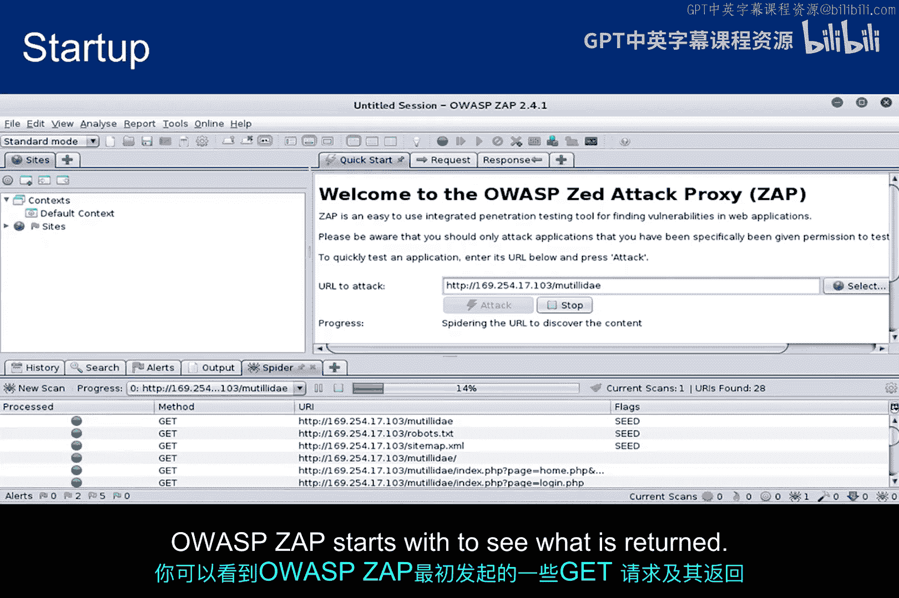

有许多Web应用扫描器试图识别漏洞。你可能有一个喜欢的工具，欢迎使用它，但我推荐OWASP ZAP，因为它查找的是OWASP Top 10漏洞，而Mutillidae正是被设计成包含这组漏洞的。也就是说，Kali中还有其他可用的工具，包括W3AF和Vega。我两个都试过，效果都不太好。事实上，当我两次尝试使用Vega时，扫描到一半它就停止了扫描。这结果是浪费时间。尝试这些工具看看它们的行为方式是值得的，但我怀疑它们仍然不可靠，不值得你花太多时间。

这是OWASP ZAP的启动界面。你基本上只需要给它一个URL（本例中是Mutillidae的路径）并开始扫描。在下方面板中，你可以看到OWASP ZAP开始时发送的一些GET请求以及返回的内容。

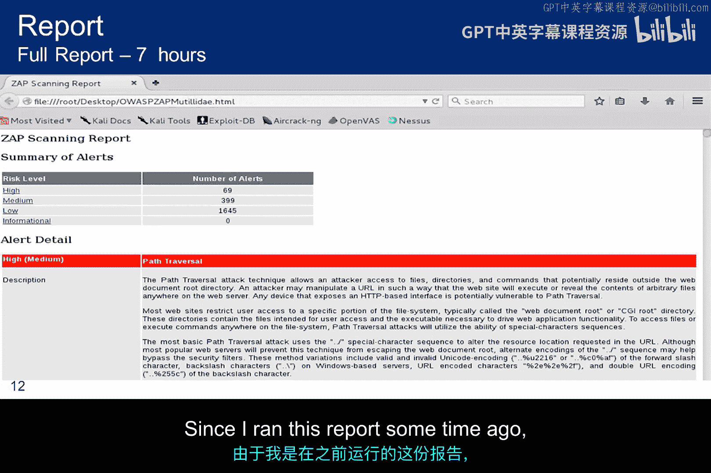

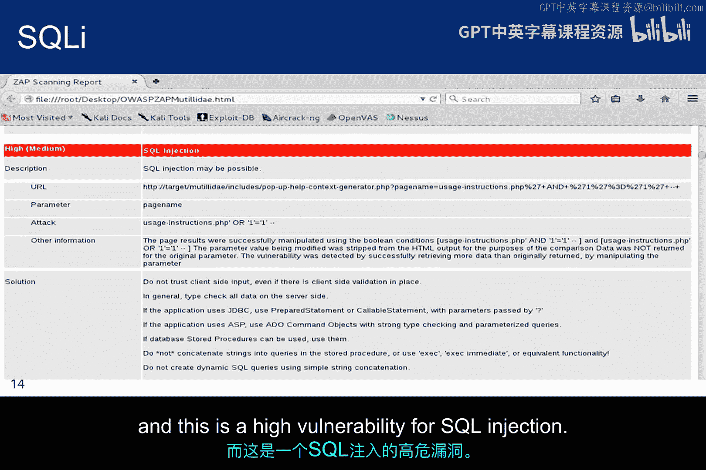

请注意，在我的环境中，完整的报告运行了7个小时。这是一个示例输出。你可以看到有超过2000个警报，其中69个被认为是高风险。由于我运行这份报告有一段时间了，你的结果很可能不同。这是一个被识别出的跨站脚本高危漏洞。

这是一个SQL注入的高危漏洞。

有趣的是，当我运行它时，没有发现CSRF漏洞。首先，这告诉我们扫描器并不完美。我想人们可能会怀疑这一点，但在编写我们的渗透测试报告时，我们可能会忘记这一点，并过于看重扫描结果。第二点是，渗透测试人员需要多种工具，以确保渗透测试结果的全面性。

## 课程总结

本节课中我们一起学习了Web利用模块。我们以较高的层次涵盖了SQL注入、跨站脚本和跨站请求伪造，然后深入探讨了SQL注入。虽然讲座没有深入探讨XSS或CSRF，但实验会要求你去做。我们还花了一些时间讨论注入上下文。我们专注于SQL注入，但上下文的概念以及你的注入将落在何处，是涵盖任何类型注入攻击的关键思想。

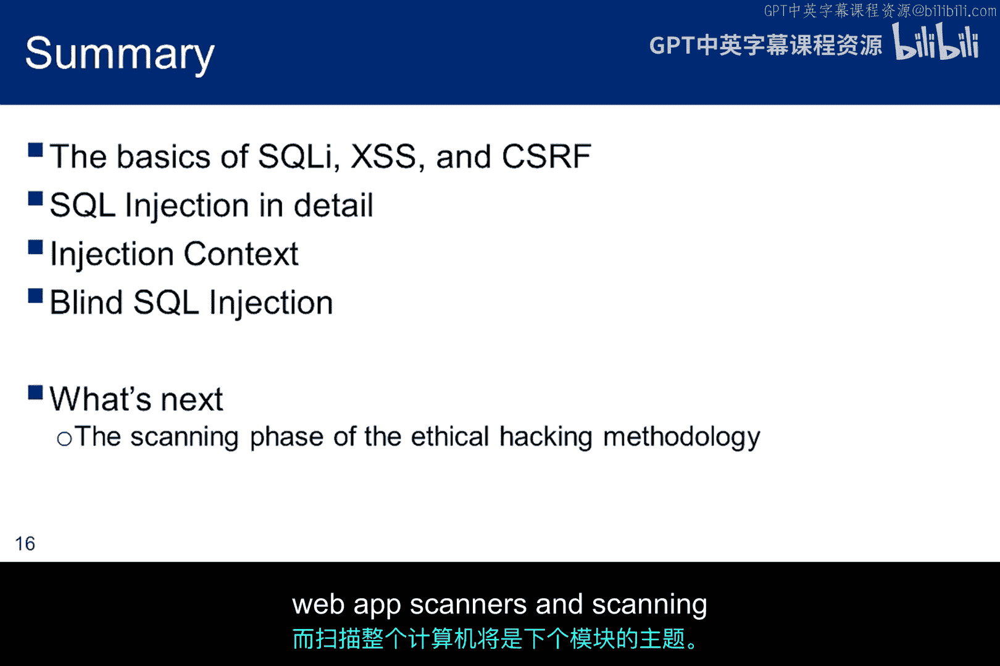

最后，我们讨论了盲注SQL注入，这是一种在系统未提供足够反馈、使得使用更标准的技术不可行时所使用的暴力技术。我们以对Web应用扫描器的非常简要的讨论作为结束，而扫描整个计算机将是下一个模块的主题。