# 046：无线网络渗透 🛰️

在本节课中，我们将学习无线网络（Wi-Fi）安全与渗透测试的基础知识。课程将重点介绍针对WEP和WPA2等加密协议的攻击原理，并概述多种常见的Wi-Fi威胁场景。通过学习这些内容，你将理解无线网络中的关键弱点以及攻击者可能利用的途径。

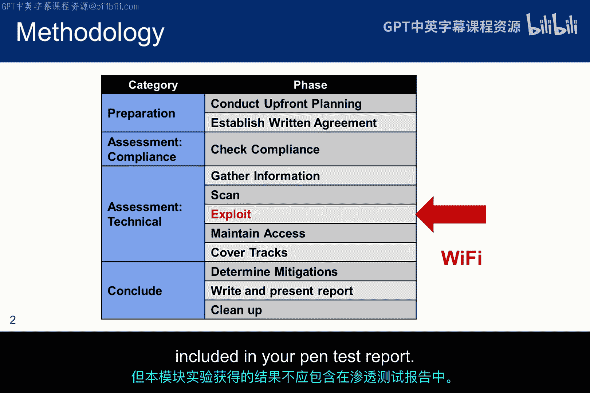

## 无线网络攻击概述 📡

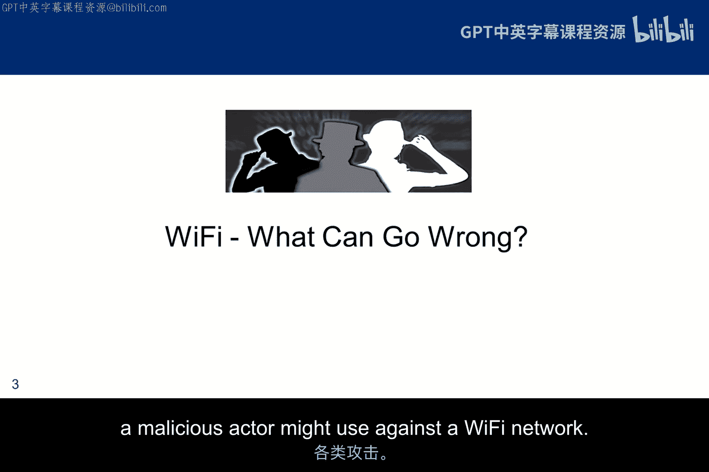

上一节我们介绍了课程的整体目标，本节中我们来看看针对无线网络的各种攻击类型。以下幻灯片总结了恶意攻击者可能对Wi-Fi网络使用的几种主要攻击方式。

## 不安全的接入点攻击 🔓

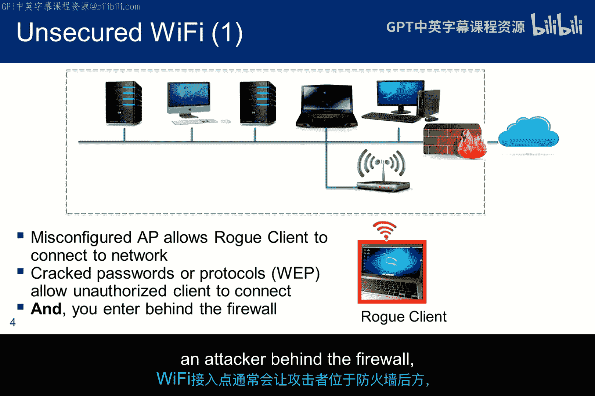

一个位于安全区域内部的不安全接入点，可能允许恶意客户端连接。这种情况可能由接入点配置错误导致，也可能是因为使用了WEP加密，或者虽然使用了强WPA加密但密码短语过于简单。这些正是我们渗透测试需要重点关注的地方。根据内部网络的配置方式，Wi-Fi接入点通常会将攻击者置于防火墙之后，因此对这些设备进行妥善管理至关重要。

## 拒绝服务攻击 ⛔

主要有两种拒绝服务攻击类型，它们都难以防御。在某些情况下，无线入侵检测系统（WIDS）或无线入侵防御系统（WIPS）可以帮助识别异常传输或DDoS攻击，但追踪攻击者很可能需要使用频谱分析仪并进行物理空间管控。然而，这可能是最佳策略，因为你无法真正阻止干扰攻击。

以下是两种主要的DoS攻击方式：

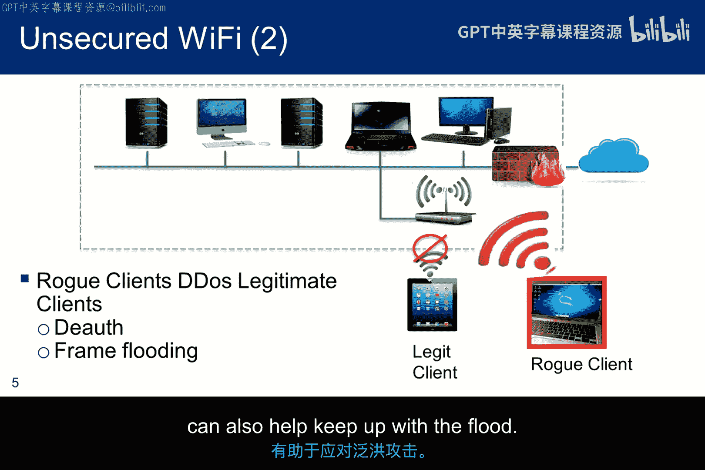

*   **解除认证攻击**：通过发送解除认证帧，使合法客户端被迫重新连接。持续进行解除认证攻击会导致拒绝服务。Wi-Fi研究人员正在研究针对此类攻击的检测算法，但目前没有有效的缓解措施。
*   **帧泛洪攻击**：用探测请求帧或关联请求帧淹没接入点。这将阻止其他客户端连接，甚至可能导致接入点崩溃。MAC地址过滤可能有助于应对帧泛洪攻击，但随着白名单的增长，这不是一个可扩展的解决方案，在大型企业中帮助不大。更快的接入点处理器和更大的内存来管理帧处理时间，也有助于应对泛洪攻击。

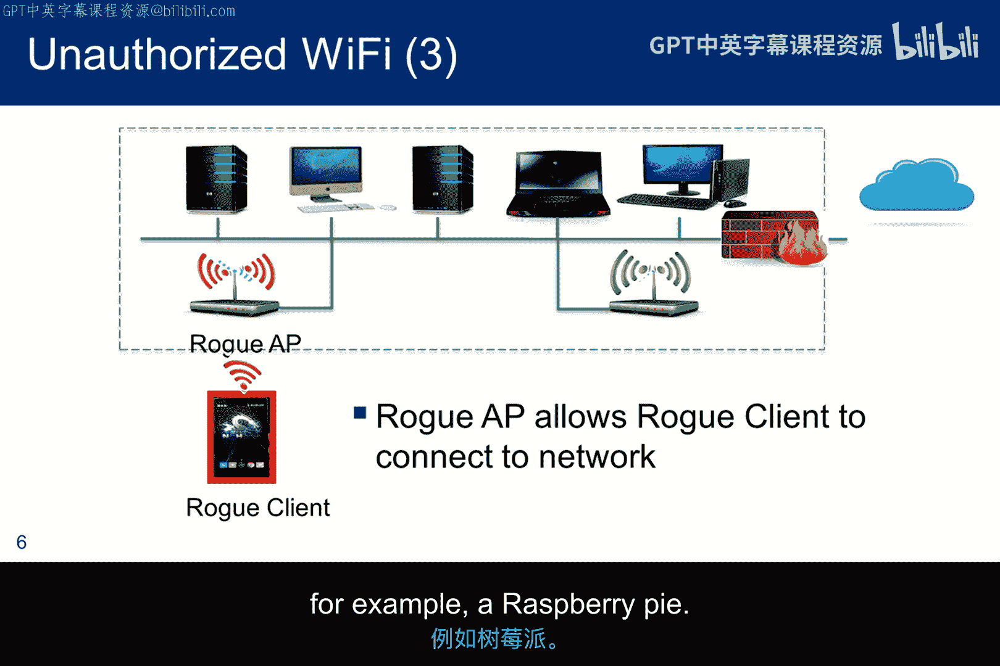

## 恶意接入点攻击 🕵️

一个好的无线入侵检测系统应该能轻易检测到连接到网络中的恶意接入点。但是，如果没有安装此类系统，且恶意攻击者能够物理接触到网络，那么插入并隐藏一个小型接入点（例如树莓派）并不需要太长时间。

## 邪恶双胞胎与桥接攻击 👥

许多学生将“邪恶双胞胎”项目作为课程项目。这类攻击并不太复杂。像`Airbase-ng`这样的接入点软件可以很容易地加载到树莓派上。攻击者创建一个看起来合法的无线网络，只需给恶意接入点设置与场所内Wi-Fi网络相同的**SSID**和**BSSID**即可。

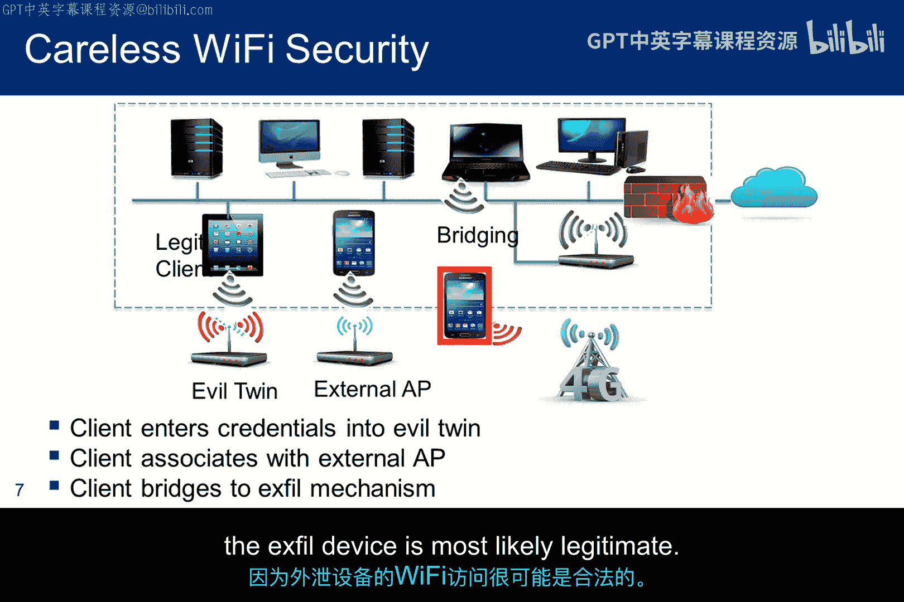

以下是两种相关的攻击场景：

*   **邪恶双胞胎**：恶意接入点可以配置为将流量中继到合法的接入点，同时监控受害者的凭据；或者在获取用户名和密码后，直接声称系统暂时不可用。一个关键问题是，邪恶双胞胎应该保持在线多久？如果设计不周，用户可能很快就会发现异常，从而导致密码被更改。
*   **Wi-Fi到LTE的桥接攻击**：图中描绘的另一种攻击是将Wi-Fi桥接到LTE数据外泄设备（如手机）。但这更像是一种内部攻击，因为来自外泄设备的Wi-Fi访问很可能是合法的。

## 学习资源与标准 📚

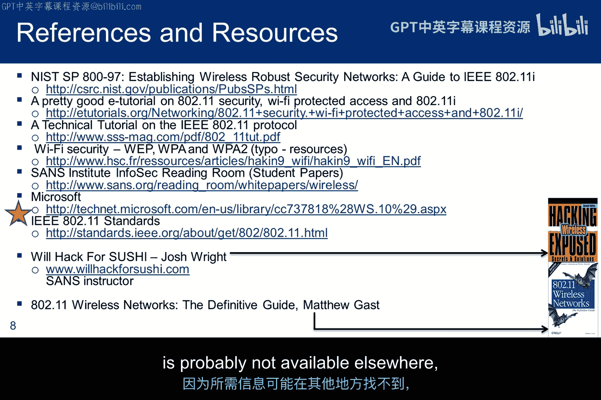

这是一份关于Wi-Fi标准和攻击的资源列表。我在准备本次讲座时参考了其中大部分内容。虽然列表很长，但我想重点强调**IEEE 802.11标准**。如果你想理解协议本身或思考如何攻击协议，标准文档是最好的起点。

这些文档通常篇幅很长、卷帙浩繁，因此阅读它们可能不会直接带来灵感，但这正是方法论黑客通常开始的地方。花时间熟悉它们的结构以及如何从中提取信息是值得的。因此，有一个作业题目会要求你查阅标准文档，因为所要求的信息可能在其他地方找不到，除非你的谷歌搜索运气特别好。

## 无线网络拓扑结构 🌐

无线网络有两种基本拓扑结构：**基础架构模式**和**自组织模式**。

在基础架构模式下，访问通过无线接入点进行协调，该接入点配有DHCP服务器，为网络中所有请求访问的设备提供IP地址。具有单个接入点的**基本服务集**是基础架构模式配置的一个例子。典型的家庭网络就是这样设置的。

**扩展服务集**描述了具有多个接入点的配置，这些接入点具有相同的SSID，并在各个BSS之间桥接流量。这通常出现在拥有大型园区网络的组织中。从一个接入点到另一个接入点的桥接通常通过有线连接完成，尽管也有无线桥接的例子。在OSI协议栈的链路控制层，ESS表现为一个单一的BSS。

在自组织模式下，架构被描述为**独立基本服务集**。这是一种临时建立的点对点配置。如今很少见到，因为它扩展性不好，而且Wi-Fi已经无处不在。但在过去，这种配置提供了一种创建自发无线局域网的方法，例如用于酒店异地会议。这基本上是一组无线节点在没有DHCP的情况下进行点对点通信。从组中选出一个节点作为缺失接入点的代理，通常是启动自组织网络的那个工作站。

在Windows XP时代，“free public wifi”看起来像一个接入点的名称，但它通常是一个自组织网络。换句话说，当用户选择它时，他/她连接的不是路由器或热点，而是直接连接到附近其他人的电脑，尽管它实际上并不提供互联网访问。由于Windows XP的一个漏洞，这个网络甚至在全国范围内（包括飞机上）传播。其工作原理如下：

当运行旧版本XP的计算机无法找到任何其收藏的无线网络时，它会自动创建一个与其上次连接的网络同名的自组织网络，在本例中就是“free public wifi”。该新自组织网络范围内的其他计算机会看到它，诱使用户连接。还有其他类似的僵尸网络。如果你年纪够大，可能见过一些，比如“linksys”、“hpsetup”、“tmobile”或“default”。无意中创建或连接到自组织网络本身并不有害，尽管它像病毒一样传播。然而，它确实为黑客提供了一个接入点来查看用户的文件。

从Windows 8.1开始，微软减少了对自组织Wi-Fi网络的支持。因此，Windows 8.1不会在可用无线接入点列表中检测或显示自组织网络。Windows 10的行为略有不同，它会检测并显示可用的自组织网络，但在尝试连接时，会失败并提示“无法连接到网络”错误。

## 扩展服务集示例 🔗

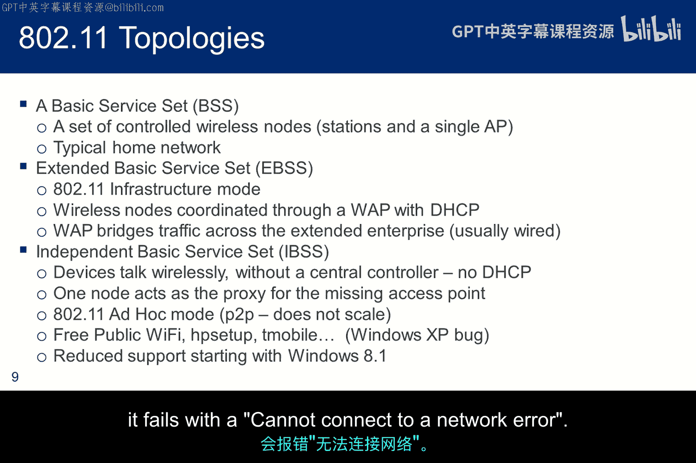

这是一个典型的连接ESS中两个接入点的有线分发系统。如果你在家里的第二个接入点上尝试这样做，通常会关闭DHCP并将其置于桥接模式。当我的Verizon Fios路由器连接表太小，无法支持所有需要连接的设备时，我实际上这样做过一段时间。

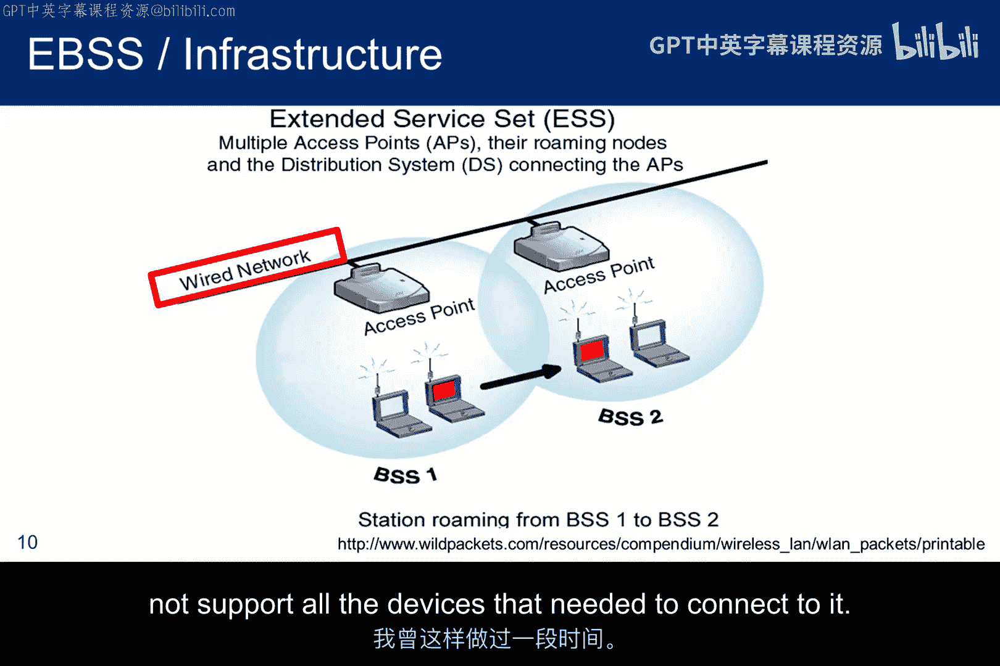

## 独立基本服务集示例 🤝

这是一个典型的IBSS。一群在没有Wi-Fi的环境下的人，希望在他们笔记本电脑之间共享信息。他们商定会议将使用的SSID，并将其配置到笔记本电脑中，指定为IBSS操作。

当第一台笔记本电脑启用时，它开始寻找包含目标SSID的信标。它会忽略来自其他接入点的信标，只寻找来自IBSS模式下其他设备的信标。如果它没有看到任何信标，它会意识到自己是第一个到达的，并开始自己发送信标。

第二台打开的笔记本电脑接收到来自第一台笔记本电脑的正确SSID信标，并同步其计时，以便它们可以共享消息和文件。

当任何设备想要向另一台设备发送帧时，它只需以目标设备的MAC地址作为目的地进行传输。由于没有关联过程，设备可以随意加入或离开，无需任何“hello”或“goodbye”。这使得自组织网络非常不安全，因为任何人都可以嗅探到SSID并加入网络，除非参与者在会议开始时商定密码并对传输进行加密。但即使有密码，情况也很复杂，因为没有协调者，因此每台移动设备都必须独立阻止不受欢迎的新加入者，而且加密配置也很困难。

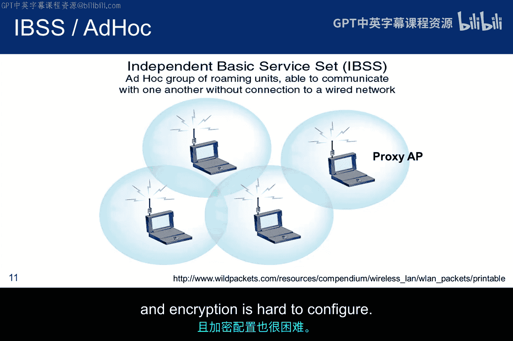

## SSID与BSSID的作用 🏷️

发往无线局域网内设备的报文需要到达正确的目的地。即使存在重叠的无线局域网，**SSID**也能将报文保持在正确的WLAN内。然而，每个无线局域网内可能有多个接入点，因此必须有一种方法来识别这些接入点及其关联的客户端。这个标识符称为**基本服务集标识符**，它其实就是接入点的MAC地址，包含在所有无线报文中。当你想在桥接的BSS中的客户端之间进行通信时，BSSID就发挥作用了，这些客户端必须具有相同的SSID，但连接的是不同的接入点。

## 总结 📝

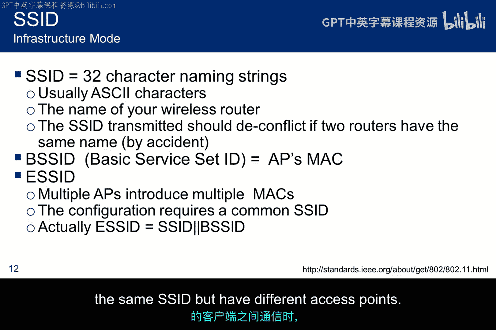

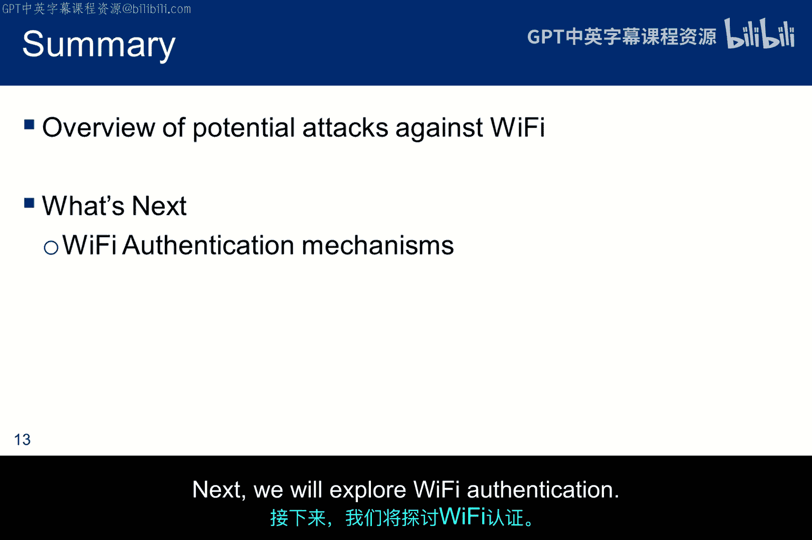

在本节课中，我们一起学习了无线网络的各种威胁和典型配置。我们探讨了不安全的接入点、拒绝服务攻击、恶意接入点、邪恶双胞胎等攻击场景，并了解了基础架构模式和自组织模式两种网络拓扑。接下来，我们将深入探讨Wi-Fi的认证机制。