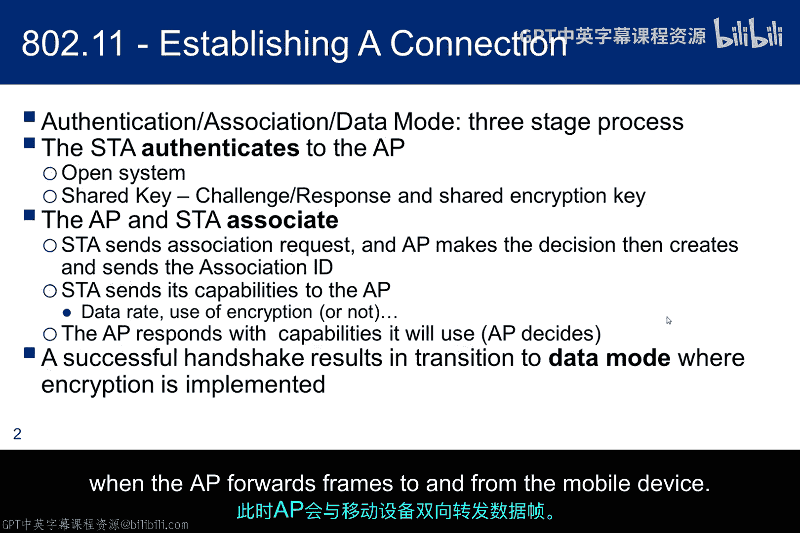
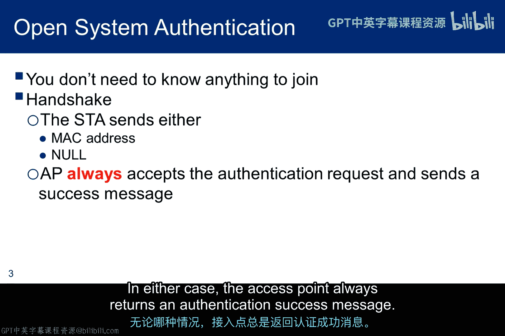
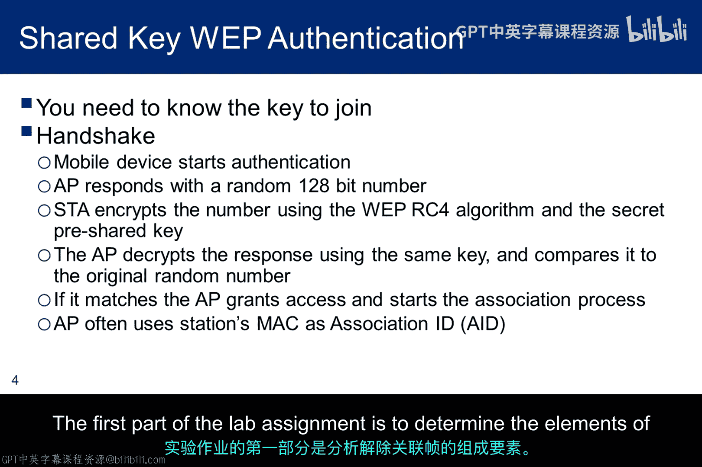
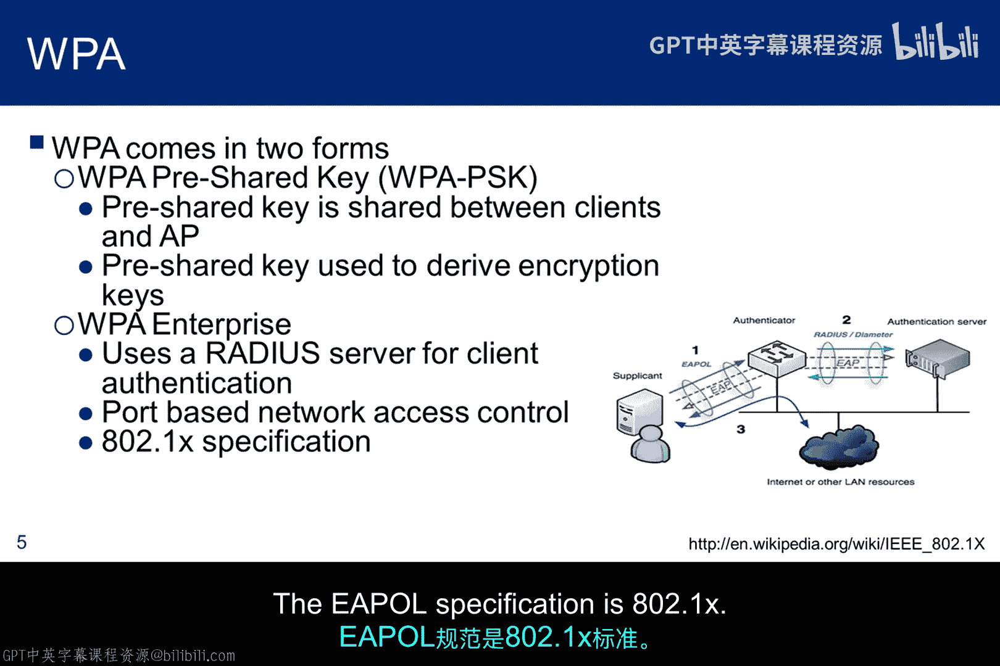
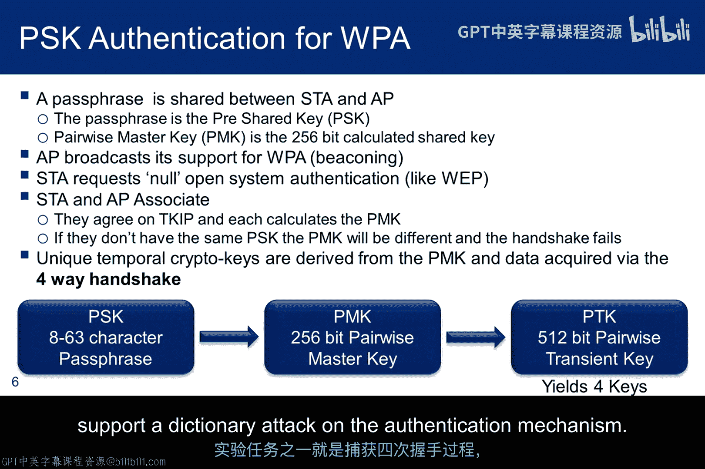
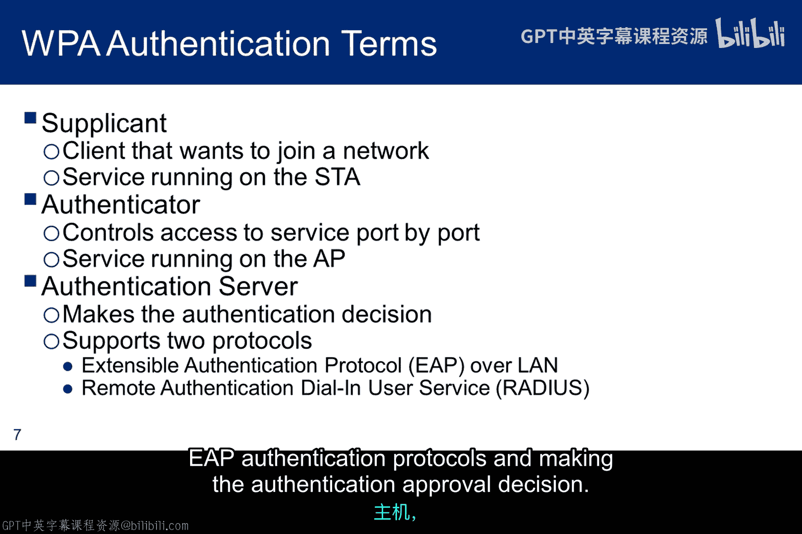
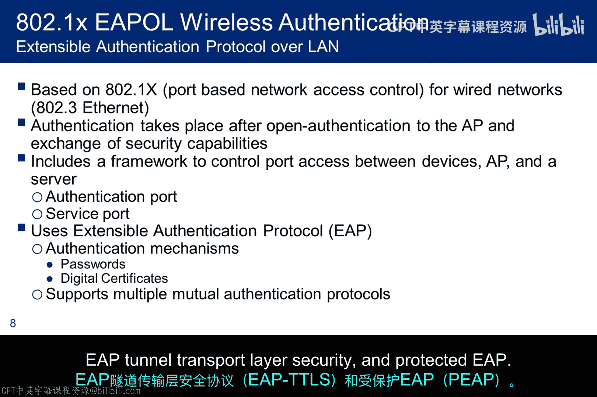
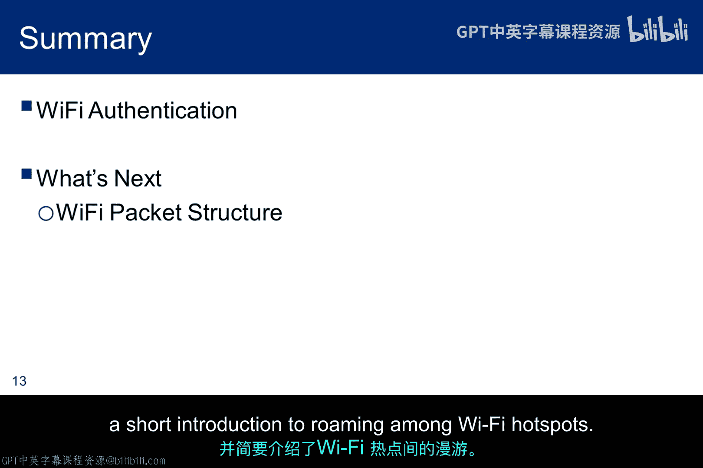

# 047：Wi-Fi连接建立与认证机制 🔐

在本节课中，我们将要学习Wi-Fi网络连接的完整过程，特别是认证、关联和数据交换这三个核心步骤。我们将详细探讨从早期不安全的WEP协议到更安全的WPA/WPA2协议的演变，并了解企业级网络使用的802.1X认证框架。理解这些机制是分析无线网络安全性的基础。

---

## 标准连接的三步流程

Wi-Fi接入是一个三步流程：**认证**、**关联**和**数据交换**。随着社区发现WEP认证中的弱点，这一过程为提升安全性而显著演进，握手协议也变得更为复杂。本小节将讨论这些协议的细节。

标准802.11连接遵循三步流程：
1.  **认证**：工作站向接入点证明身份。
2.  **关联**：认证成功后，工作站与接入点建立正式连接。
3.  **数据交换**：关联成功后，开始正常的数据传输。

---

## 认证的两种方式

上一节我们介绍了连接流程，本节中我们来看看认证的具体方式。认证是连接的第一步，主要有两种方法：开放式系统认证和共享密钥认证。

以下是两种认证方式的详细说明：

*   **开放式系统认证**：这意味着没有安全性。工作站可以发送其MAC地址，或者根据实现方式仅发送空值。然而，这两种方法没有本质区别，因为MAC地址很容易被伪造。无论哪种情况，接入点总是返回认证成功消息。
    

*   **共享密钥认证**：这需要一个密钥，且接入点和工作站必须拥有相同的密钥。当工作站请求访问时，接入点发送一个128位的随机数。工作站使用密钥加密这个随机数并返回给接入点。接入点解密响应，并将结果与原始128位数字进行比较。如果两者匹配，则工作站通过认证，关联过程开始。
    

由于接收到的帧中包含工作站的MAC地址，接入点使用该MAC地址作为关联标识符。这是一个重要的点，因为MAC地址允许工作站保持与接入点的关联。因此，如果你想启动嗅探器来捕获握手期间交换的数据包，你需要强制工作站与接入点**解除关联**。实验作业的第一部分就是确定解除关联帧的构成要素。

---

## WPA认证机制

了解了基础的WEP认证后，我们转向更安全的WPA认证。WPA认证支持两种方法：一种是使用预共享密钥，另一种基于可扩展认证协议。

以下是WPA认证的两种方法：

*   **预共享密钥**：这种方法比WEP中使用128位随机数的交换要复杂得多。它涉及多个密钥，区分它们很重要。
    1.  **密码短语**：长度在8到63个字符之间，常被称为预共享密钥。它在工作站和接入点之间共享。
    2.  **成对主密钥**：这是一个256位的密钥，使用密码短语、SSID通过密钥派生函数计算得出。公式可表示为：`PMK = KDF(PSK, SSID)`。
    3.  **成对临时密钥**：这是一个512位的密钥，由PMK和其他几个变量（包括一个种子）计算得出，所有输入都用于伪随机数生成器。

    认证过程始于工作站向接入点请求开放式认证。在关联阶段，双方同意使用时态密钥完整性协议方法来计算PMK和PTK。计算PTK的关键在于**四次握手**期间的数据交换。实验作业之一就是捕获四次握手，以支持对认证机制的字典攻击。
    

*   **企业级认证**：这种方法使用一些新术语，并基于可扩展认证协议，通常与一个控制认证的RADIUS服务器结合使用。
    

    请注意，在示意图中，红色的EAP交换发生在工作站和接入点之间，以及接入点和认证服务器之间。但是，使用了不同的封装协议：工作站使用**EAPOL**，服务器使用**RADIUS**。EAPOL规范是802.1X。

---

## 企业级WPA与802.1X框架

上一节提到了企业级WPA认证，本节我们将深入其核心框架——802.1X。在企业WPA认证交换中，参与者的名称与“工作站”和“接入点”不同。

以下是企业认证中的关键角色：

*   **申请者**：希望连接到无线局域网客户端设备。“申请者”也常用来指代运行在客户端上、向认证器提供凭证的软件。
*   **认证器**：网络设备，如以太网交换机或无线接入点。
*   **认证服务器**：通常是运行软件的主机，支持RADIUS和EAP认证协议，并做出认证批准决定。
    

802.1X是无线EAPOL认证的标准。它基于其以太网对应物——规定以太网物理介质和工作特性的802.3标准。在这个模型中，接入点没有加载预共享密钥，而是由认证服务器为接入点管理密钥。不过，申请者和认证服务器确实需要交换一个预共享密钥以支持密钥生成。

认证器将每个虚拟端口划分为两个逻辑端口：一个用于服务，另一个用于认证。这被称为端口访问实体。认证PAE始终开放以允许认证帧通过，而服务PAE仅在RADIUS服务器成功认证后才开放。申请者和认证器使用第2层EAPOL进行通信。一旦认证过程完成，申请者和认证器共享一个秘密主密钥，该密钥由RADIUS服务器与认证器共享。EAPOL支持多种相互认证协议，例如EAP传输层安全、EAP隧道传输层安全和受保护的EAP。

---

## EAP与RADIUS的封装与部署

EAP RFC没有规定消息应如何传递。例如，它没有规定使用IP在互联网上传输。事实上，EAP根本不是一个LAN协议，因为EAP最初设计用于通过调制解调器进行拨号认证。因此，为了在我们的网络中传递EAP消息，我们需要一种封装方法。

以下是EAP消息传递和RADIUS部署的关键点：

*   **封装协议**：IEEE 802.1X定义了一个称为**EAP over LAN**的协议，用于在申请者和认证器之间传递EAP消息。而**RADIUS**则用于认证器和认证服务器之间。顺便说一下，RADIUS是拨号认证的遗留协议，不是Wi-Fi认证协议，所以你必须确保你的服务器支持EAP。
*   **RADIUS服务器部署**：RADIUS服务器的部署没有标准定义。一些认证服务器专用于特定的认证方法。其他服务器可能具有特殊功能，例如冗余或分布式操作。冗余服务器具有备用单元，在主服务器故障时无缝接管；分布式服务器有许多在不同位置运行的服务器，同时保持公共认证数据库在所有节点之间更新和一致。
*   **RADIUS的定义**：但RADIUS确实定义了两件事。首先，它定义了认证服务器之间应共有的功能。其次，它定义了一个允许其他设备访问这些功能的协议。
    

---

## 802.1X握手步骤

了解了组件后，我们来看看802.1X认证的具体握手步骤。802.1X握手分为三个主要步骤。

以下是详细的握手过程：

1.  **初始化**：检测到新的申请者时，认证器上的端口被启用并设置为**未授权状态**。在此状态下，只允许802.1X流量，其他流量（如互联网流量）被阻止。
2.  **启动**：在此阶段，认证器会定期向本地网段上的一个特殊地址发送EAP请求身份帧。申请者监听此地址，并在收到EAP请求身份帧后，用包含申请者标识符（如用户ID）的EAP响应身份帧进行回复。认证器反过来将此身份响应封装在RADIUS访问请求数据包中，并转发给认证服务器。顺便说一下，在略有不同的方法中，申请者也可以通过向认证器发送EAPOL开始帧来启动认证，认证器随后会回复一个EAP请求身份帧。
3.  **EAP协商与认证**：
    *   **协商**：认证服务器发送一个封装在RADIUS访问质询数据包中的回复给认证器，其中包含一个EAP请求，指定它希望申请者执行的EAP认证类型。认证器将EAP请求封装在EAP帧中并发送给申请者。此时，申请者可以开始请求的EAP方法，或者发送一个NACK并回复一个它愿意执行的EAP方法。
    *   **认证**：假设认证服务器和申请者就EAP方法达成一致，EAP请求和响应在申请者和认证服务器之间发送，由认证器进行转换，直到认证服务器响应一个封装在RADIUS访问接受数据包中的EAP成功消息，或者一个封装在RADIUS访问拒绝数据包中的EAP失败消息。如果认证成功，认证器将端口设置为**授权状态**，允许正常流量。如果不成功，端口保持未授权状态。当申请者注销时，它向认证器发送一个EAPOL注销消息。认证器然后将端口再次设置为未授权状态，阻止所有非EAP流量。

下图试图捕捉带有基础设施中认证服务器的企业流程：

首先，AP发送信标。如果工作站需要服务，它向AP请求开放式认证。认证后，工作站和AP关联并同意使用802.1X认证，工作站通过接入点联系认证服务器。工作站和认证服务器完成认证握手，然后它们交换消息或密码短语，用于生成公共的成对主密钥。但在这一点上，接入点没有PMK。因此，认证服务器将PMK作为加密有效载荷（有时称为密钥包装）传递给AP。现在，工作站和AP生成公共的成对临时密钥并进入加密模式。

---

## Passpoint与无缝漫游

最后，我们来看看提升用户体验的Passpoint技术。Passpoint为移动设备在漫游时提供自动化的Wi-Fi网络发现和连接能力。

以下是Passpoint的关键特性：

*   **自动连接**：漫游设备可以自动连接到任何参与ISP的电缆Wi-Fi热点。为此，AP必须支持基于IEEE 802.11u的网络信息，然后客户端设备通过使用接入网络查询协议消息收集必要信息。
*   **信息发现**：支持802.11u的电话客户端根据在预关联阶段从支持802.11u的无线局域网控制器收集的信息来发现和选择目标AP，控制器提供各种信息，如热点所有者详细信息、漫游合作伙伴领域列表、3GPP蜂窝信息和域名。
*   **认证与配置**：领域列表还提供领域名称及其关联的EAP认证类型映射的列表。了解这些信息对于电话客户端设备至关重要，以便进行正确的EAP凭证交换。一旦识别出热点，认证基于具有后端认证服务器的WPA2企业模型。电话客户端必须要么拥有预配置的网络信息（如家庭组织标识符、领域名称和域名）在预配置文件中，要么它可以使用从SIM卡衍生的IMSI数据获取家庭网络信息。
*   **安全性提升**：Passpoint的另一个好处是增强了针对恶意接入点的安全性，因为握手的一部分包括确定服务提供商接入点合法性的信息。

---

## 总结

本节课中我们一起学习了Wi-Fi连接的核心机制。我们详细剖析了从认证、关联到数据交换的标准三步流程，对比了WEP的开放式与共享密钥认证，并深入探讨了更安全的WPA/WPA2认证，包括其预共享密钥和基于802.1X/EAP-RADIUS的企业级认证方式。最后，我们了解了Passpoint技术如何实现安全无缝的Wi-Fi热点漫游。理解这些认证与连接建立原理，是进行无线网络安全评估和道德黑客测试的重要基础。接下来，我将介绍Wi-Fi数据包的结构。