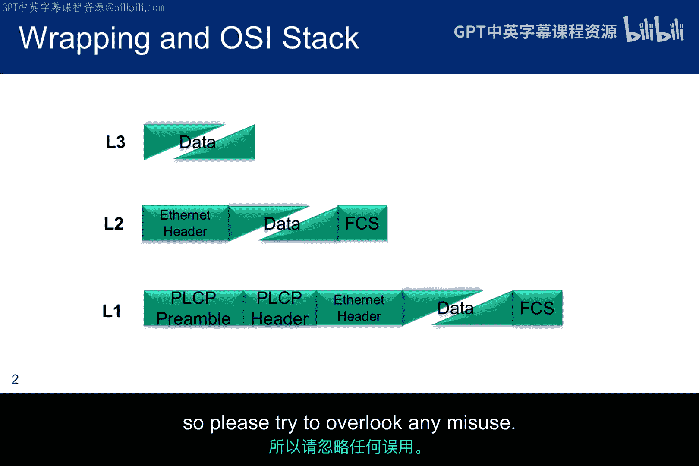
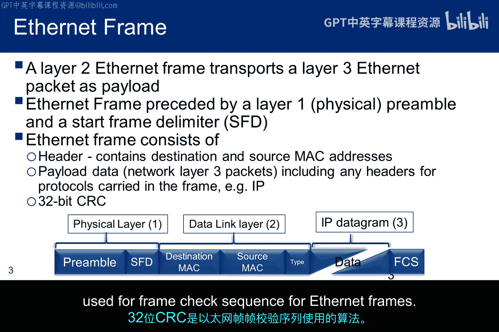
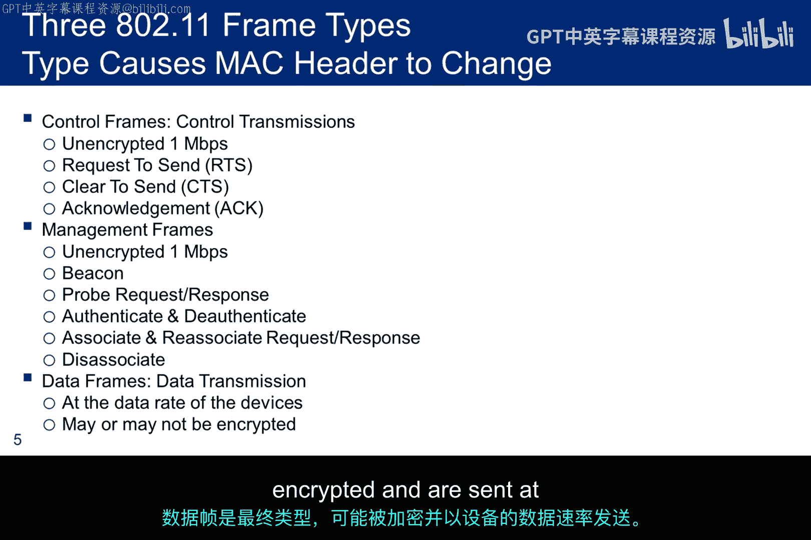
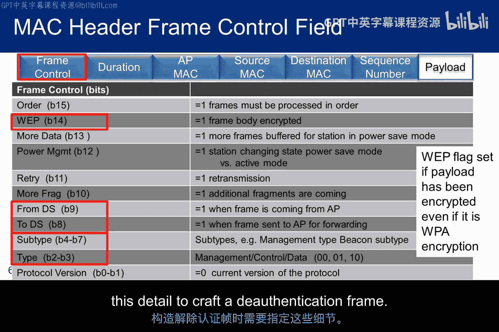
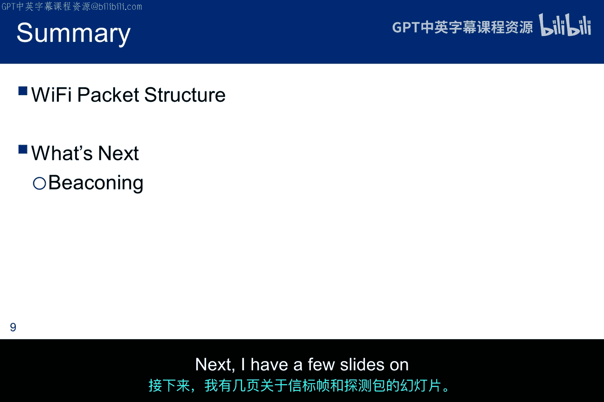

# 048：数据包结构与协议分析 📡

在本节课中，我们将要学习Wi-Fi数据包的结构，特别是如何理解并构造一个“解除认证”数据包。这对于后续捕获WPA四次握手过程至关重要。我们将从以太网数据包的基础结构讲起，逐步深入到更复杂的无线网络（802.11）帧结构，并解释不同类型帧的用途和格式差异。

## 以太网数据包结构基础

上一节我们介绍了课程目标，本节中我们来看看数据包的基础结构。Wi-Fi数据包的结构由IEEE规范定义。

下图简单描绘了以太网数据包的格式。它展示了OSI模型第三层的数据，是如何先被以太网头部封装，然后再被物理层头部封装以进行传输的。

从技术上讲，**帧**存在于第二层（数据链路层），而**数据包**存在于第三层（网络层）。这就是为什么帧校验序列（Frame Check Sequence）添加在第二层，其名称中就包含了“帧”字。请注意，在术语使用上可能并不总是非常严谨。

## 以太网数据包详解

了解了基本概念后，我们来看一个更详细的以太网数据包视图。它增加了细节，显示以太网帧头部包含**目的MAC地址**和**源MAC地址**。

无线协议的引入带来了第三方——无线接入点（Access Point）的概念。这需要对以太网数据包的一些概念进行扩展。对于以太网头部，由于至少有45种协议，需要标识出载荷所使用的协议（例如，一个IP数据报）。一个32位的CRC算法被用于以太网帧的帧校验序列。

## 无线网络（802.11）帧结构

无线标准在第二层引入了**MAC头部**的概念，以取代以太网头部。请注意，MAC头部更为复杂，包含了三个MAC地址：源地址、目的地址和接入点地址。

MAC头部的格式取决于该信息是**控制帧**、**管理帧**还是**数据帧**，稍后将进行讨论。MAC头部包含源和目的MAC地址，以确保帧能被传递到正确的设备。目的地址可以是**单播**（必须传递给单个设备），也可以是**组播**（可能传递给范围内的多个或所有设备）。MAC头部还包含其他字段，我们稍后会讨论帧控制字段。

以下是802.11的三种帧类型，我们必须区分它们，因为MAC头部中MAC地址的顺序会根据帧类型而变化。

*   **控制帧**：未加密，用于发送“请求发送”（RTS）和“清除发送”（CTS）消息。RTS表明“我想要发送”，并包含源地址、目的地址和传输时长。如果介质空闲，则返回CTS，重复传输时长以确保所有设备都了解介质将被占用的时间。
*   **管理帧**：同样未加密，用于此处列出的所有帧类型。本实验课程中我们感兴趣的是**认证帧**，它是一种管理帧。因此，如果你想在IEEE标准中查找它，应该从管理帧类别中寻找。
*   **数据帧**：最后一种类型，可能被加密，并以相关设备的数据速率发送。

## 帧控制字段详解

帧控制字段长16位，我们需要理解其中的几个设置。

*   如果载荷被加密，则第14位被置位。这通常被解析为WEP位，但它也标志着WPA加密。
*   第8位和第9位（`To DS` 和 `From DS`）决定了MAC头部中MAC地址的顺序。
*   第2位到第7位标志着帧类型（控制、管理、数据）及其子类型。例如，管理帧的一个子类型可能表示一个信标帧。

如果你查看IEEE规范，你会看到控制帧有6种子类型，管理帧有7种子类型，数据帧有10种子类型。你需要指定这些细节来构造一个解除认证帧。

## 地址顺序与帧类型关系

此图展示了`To DS`和`From DS`这两个比特位如何与帧类型关联。

首先，注意左侧这两个比特位的可能设置。右侧，你可以看到MAC地址顺序如何变化。对于最后一种情况，你还会看到第四个MAC地址的加入。

*   `To DS=0, From DS=0`：用于所有管理帧、所有控制帧，以及在自组织网络中从一个站点发送到另一个站点的任何数据帧。
*   `To DS=1, From DS=0`：在基础设施网络中，移动设备将帧发送给接入点，然后由接入点转发到正确的目的地。这种情况下，移动设备创建并发送消息，接入点接收它们但不是最终目的地，因此需要3个地址。
*   `To DS=0, From DS=1`：同样指定基础设施网络帧，用于由接入点转发的数据包。
*   `To DS=1, From DS=1`：指定无线分布式系统，用于在两个接入点之间发送帧，因此必须包含第二个接入点的MAC地址。

在图中，接收方和发送方MAC字段是针对接入点的，而源和目的MAC字段是针对站点的。基本上，**源MAC**是创建原始消息的设备，**目的MAC**是最终接收消息的设备。序列控制字段用于管理属于同一帧的不同分片。

## 帧类型与子类型参考

下图展示了由Sands制作的帧类型/子类型参考指南。此信息对应于帧控制字段中的帧类型和子帧类型。

设置帧类型相当简单，因为它只占2位，唯一选项是`00`、`01`和`10`。子帧类型使用4位。底部的图表显示了帧控制字段，以及指定信标帧的比特位：子类型`1000`和类型`00`。

## 总结

本节课中我们一起学习了Wi-Fi帧结构。这应该提供了足够的信息来为实验构造一个解除认证数据包。如果你想的话，可以使用Scapy等工具来构造和发送它。关于解除认证帧还有一些独特的细节，你需要参考IEEE标准才能正确设置。接下来，我将有几张关于信标和探测包的幻灯片。