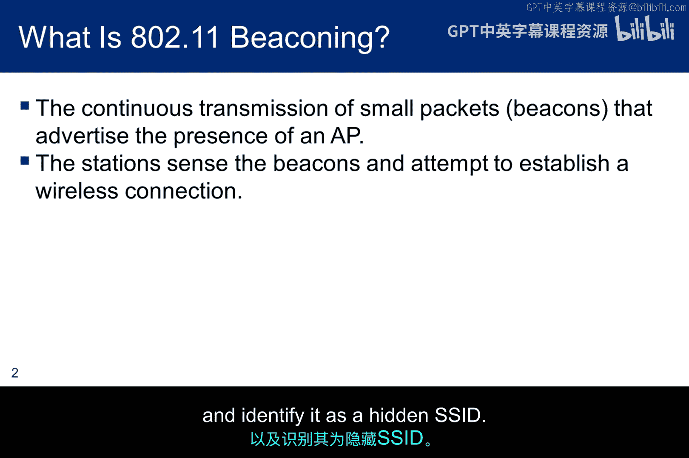
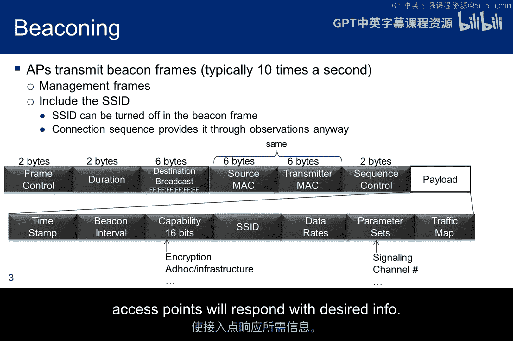
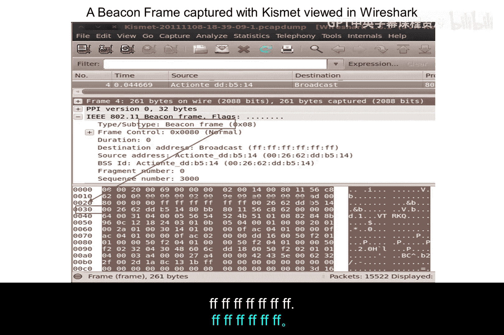
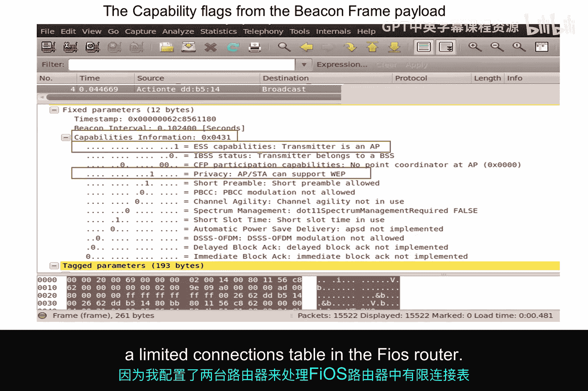
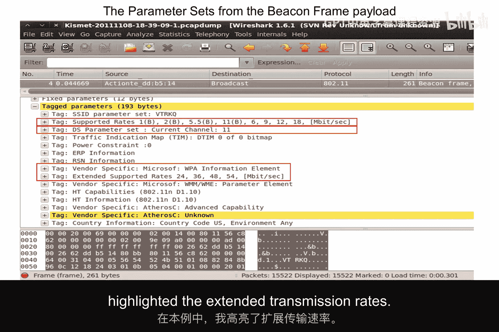
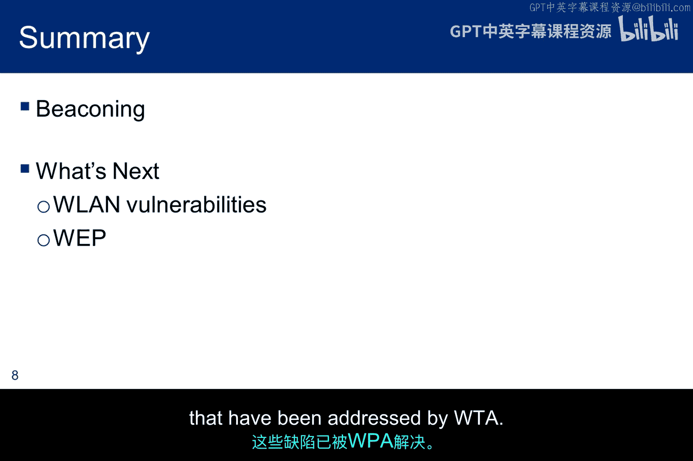

# 049：信标帧与探测帧 📡

在本节中，我们将探讨无线网络中的两种关键管理帧：**信标帧**和**探测帧**。它们是无线接入点与客户端设备建立连接的基础。我们将了解它们的工作原理、结构以及在实际网络分析中的意义。

---

## 信标帧：接入点的“广告”

信标帧是无线接入点定期发送的管理帧，用于宣告自身的存在和网络参数。我们可以将其理解为接入点持续发出的“广告”。

以下是信标帧中包含的主要信息字段：

*   **时间戳**：用于同步所有关联到该接入点的站点时钟。
*   **信标间隔**：表示两次信标发送之间的时间间隔。站点在进入省电模式前需要知道此间隔，以便在正确时间唤醒并接收信标，从而了解接入点缓冲区中是否有等待自己的数据帧。
*   **能力信息**：定义了希望加入该无线局域网的站点必须满足的要求。例如，它可能要求所有站点必须使用WEP加密才能加入网络。
*   **服务集标识符**：标识一个特定的无线局域网。站点在与某个无线局域网关联前，必须拥有与接入点相同的SSID。默认情况下，接入点会在信标帧中包含SSID，以便站点能嗅探并自动配置无线网卡。
*   **支持速率**：描述该无线局域网支持的数据传输速率。例如，信标可能指示仅支持1、2和5.5 Mbps的速率。
*   **参数集**：提供有关特定信号方法的信息，例如跳频扩频或直接序列扩频，以及接入点正在使用的信道号。
*   **流量指示图**：接入点周期性地在信标中发送TIM，以标识哪些使用省电模式的站点在接入点缓冲区中有等待接收的数据帧。TIM通过关联过程中接入点分配的关联ID来识别站点。

上图展示了一个使用Kismet捕获并在Wireshark中显示的信标帧。请注意几个关键字段：
*   信标帧的十六进制表示为 `80` 或二进制 `0000 1000 0000`。
*   目标地址是广播地址 `FF:FF:FF:FF:FF:FF`，意味着它发送给所有人。
*   源地址和BSSID（接入点的MAC地址）相同，因为正是接入点在发送此帧。

---

## 探测请求与响应：站点的“主动询问”

上一节我们介绍了接入点如何主动宣告自己。本节中，我们来看看站点如何主动寻找网络。

当站点使用主动扫描来确定范围内有哪些接入点可供关联时，它会广播一个**探测请求帧**。一些嗅探软件工具也会发送探测请求，以便接入点用所需信息进行响应。

接入点收到针对其SSID的探测请求后，会向探测站点发送一个**802.11探测响应帧**。探测响应帧与信标帧非常相似，只是它不携带TIM信息，并且仅在收到探测请求后才发送。

上图展示了一个探测请求帧。注意其目标地址同样是广播地址 `FF:FF:FF:FF:FF:FF`，而源地址是发起探测的站点MAC地址。

---

## 深入分析信标帧内容

让我们更深入地查看之前捕获的信标帧中的一些关键字段。

此截图聚焦于信标帧的“能力信息”字段。可以看到加密已开启。请注意，虽然我的接入点配置为使用WPA2，但802.11规范（以及因此Wireshark解析此字段的方式）并不区分WEP和WPA。能力字段的最高位确认发送者是一个接入点。

此截图则聚焦于信标帧的“参数”部分。信标包含了关于支持的传输速率和正在使用的信道号的信息。同时，请注意存在一些厂商特定的参数。图中高亮显示了“扩展支持的速率”。

---

## “隐藏”网络与安全误区

有时，家庭用户会关闭信标广播或隐藏SSID，认为这样可以提高安全性。但这并不能真正提升安全，除非你完全不使用你的Wi-Fi网络。

监控工具可以通过简单地检查数据包，轻松确定一个不发送信标的接入点的存在。它们能获取到MAC地址、信道、传输速率，判断流量是否加密，并将其识别为一个“隐藏的SSID”。

当SSID未包含在信标帧中，或者信标功能被关闭时，站点需要被配置为探测特定的SSID才能建立连接。除了TIM字段，信标帧和探测响应帧的内容是相同的。

---

## 总结与下节预告

本节课中，我们一起学习了无线网络中的信标帧和探测帧。信标帧是接入点定期发送的广播，用于宣告网络存在和参数；而探测请求/响应是站点主动发现和查询网络信息的机制。我们还分析了这些帧的实际捕获示例，并讨论了关闭信标广播对安全性的有限影响。

接下来，我们将探讨一些无线局域网的漏洞，并深入剖析WEP协议，找出其已被WPA解决的关键缺陷。

