# 050：WLAN安全漏洞详解 🔓

在本节课中，我们将深入探讨无线局域网（WLAN）中存在的多种安全漏洞。我们将从高层面概述几种攻击方式，并重点分析WEP协议的核心弱点，为后续的实际攻击操作打下理论基础。

## 无线拒绝服务攻击

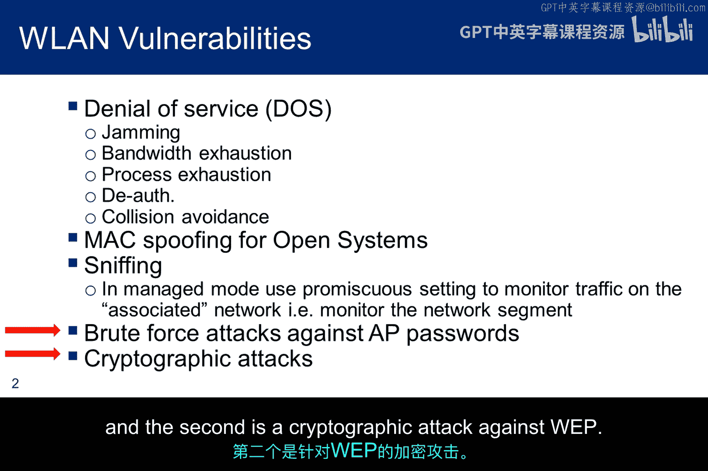

上一节我们介绍了无线网络的一些漏洞，本节中我们来看看如何利用其中一些漏洞发起攻击。首先，我们将介绍几种导致拒绝服务（DoS）的攻击方式。

以下是几种常见的无线DoS攻击方法：

*   **带宽耗尽攻击**：这种攻击本质上与任何消耗目标设备资源的TCP攻击类似，例如SYN洪水攻击。
*   **进程耗尽攻击**：攻击者通过发送超出接入点（AP）处理能力的重复认证请求，耗尽AP的进程资源。本模块开头讨论的“帧泛洪”攻击也属于此类，它通过发送大量探测或关联请求帧使AP过载。
*   **针对站点的DoS攻击**：攻击者可以伪造AP的MAC地址向目标站点发送数据包。接收方无法区分这些帧是否合法，只能进行处理，从而消耗其资源。
*   **管理帧欺骗攻击**：伪造管理帧的能力不仅允许进行MAC层的帧泛洪攻击，还能发起**取消认证**和**取消关联洪水攻击**，持续将站点从AP断开连接。

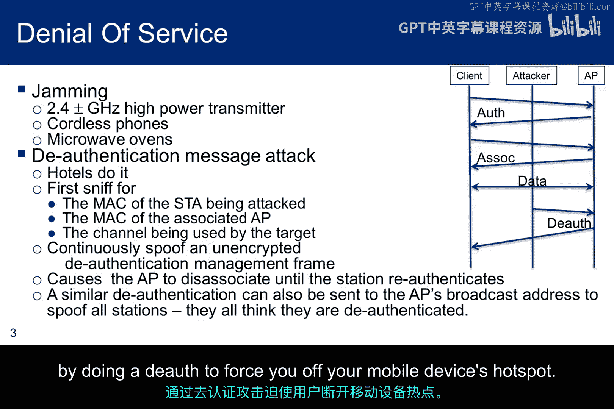

本模块后续将重点讨论底部用红色箭头标记的两项攻击：针对WPA的字典攻击和针对WEP的密码学攻击。

## 干扰与取消认证攻击

除了协议层面的攻击，物理干扰也是一种有效手段。

对于工作在2.4GHz频段的接入点，干扰可以成为一种有效的攻击技术。无绳电话和微波炉都会造成干扰，甚至可以被用作攻击工具。一些老式微波炉的屏蔽层有孔隙，会泄漏2.4GHz信号，导致Wi-Fi设备断开连接。随着支持5GHz的双频路由器的普及，这种情况有所缓解，但2.4GHz频段仍然可能受到攻击，且一些双频路由器可能未正确配置使用第二个频段。

发起取消认证攻击需要目标的MAC地址和信道信息，而像Kismet这样的工具可以自动收集这些信息。一旦嗅探到这些信息，我们就可以伪造取消认证数据包并发动攻击，强制目标断开连接。如果持续进行，这就演变为拒绝服务攻击。过去，一些酒店曾尝试通过这种手段迫使客人使用其收费网络，而不是个人移动热点。

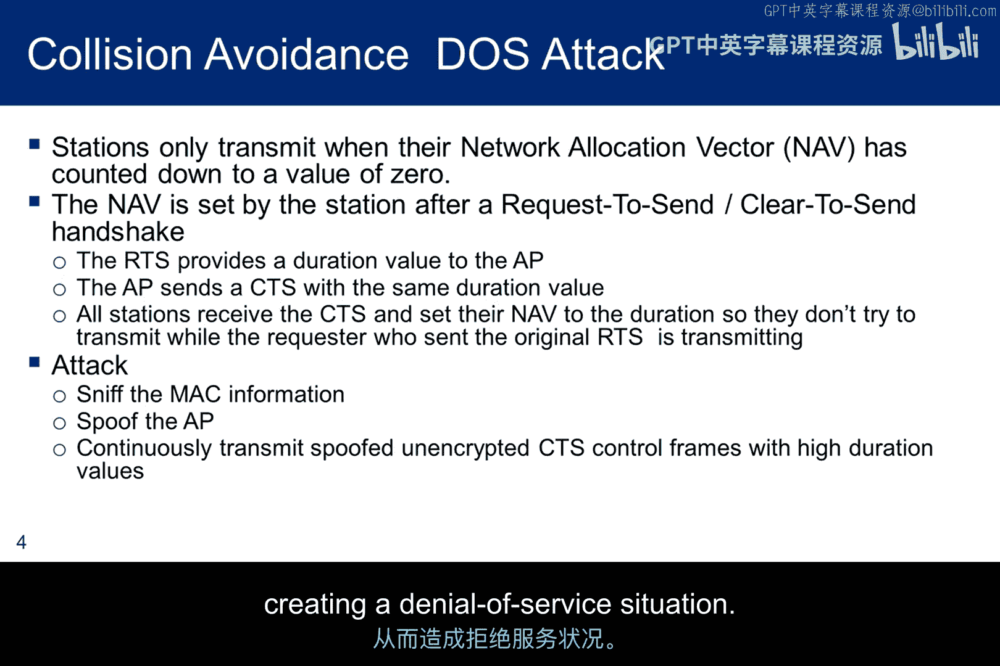

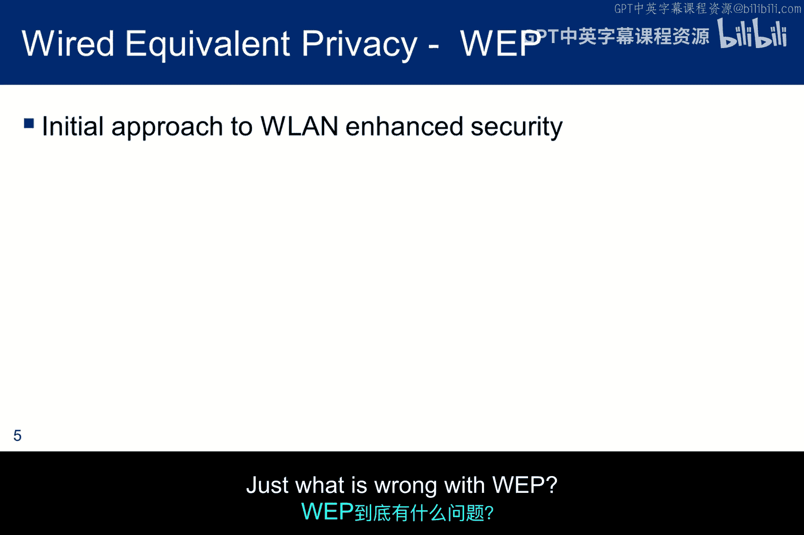

## 碰撞避免拒绝服务攻击

碰撞避免拒绝服务（CA DoS）攻击利用了802.11协议中的碰撞避免机制，其工作原理如下：

在正常操作中，当节点A要向节点B发送数据时：
1.  节点A首先向节点B发送一个**请求发送**（RTS）数据包，其中包含节点B的地址和完成数据传输所需的时间。
2.  节点B收到RTS后，回复一个**允许发送**（CTS）数据包，其中也包含持续时间信息。
3.  节点A的RTS也会被节点C收到。如果节点C在A的传输范围内，但发现自己不是目标接收者，它会通过设置一个名为**网络分配向量**（NAV）的计时器来阻止自己访问信道。
4.  同样，在节点B传输范围内的节点D收到B发出的CTS后，也会设置自己的NAV计时器。
5.  这样，A和B附近的节点都会设置NAV以避免碰撞。NAV是一个从RTS或CTS包中的持续时间字段初始化的递减计数器。
6.  节点A开始向节点B传输数据。传输完成后，节点B回复确认（ACK）包。此时，节点C和D的NAV计时器归零，解除阻塞。

利用此机制的攻击会持续发送包含高持续时间值的伪造CTS控制帧。每个看到这些CTS帧的节点都会阻塞自己。由于攻击是持续的，这些节点永远无法解除阻塞，从而造成拒绝服务。

## WEP协议的问题与攻击准备

现在，我们来探讨WEP协议到底存在什么问题。

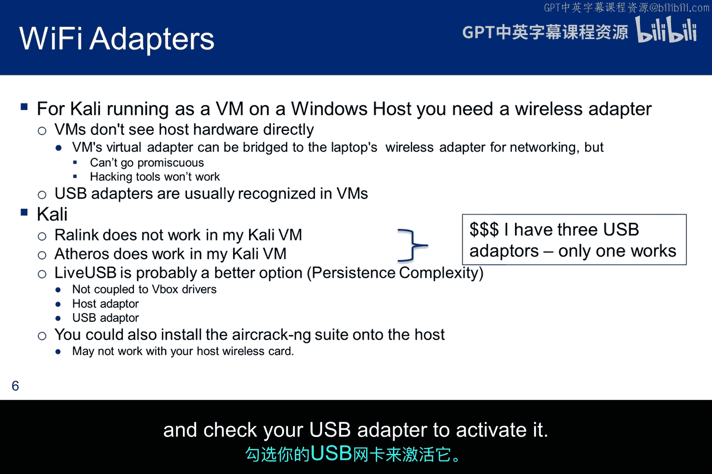

如果你想探索无线漏洞并计划进行Wi-Fi实验，你需要一个无线适配器。你的主机很可能自带一个，但虚拟机（VM）无法直接与主机适配器交互以将其置于监控模式。解决方案之一是使用USB无线适配器，它应该能被你的Kali虚拟机识别。

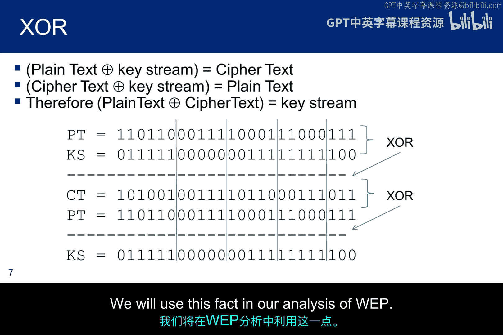

但并非所有适配器都能与Kismet或Aircrack-ng等Wi-Fi工具兼容。互联网上有大量讨论，但大多针对宿主机直接运行Kali的情况，而非虚拟机环境。因此，阅读时需要仔细甄别。

目前，一个可能可行的方案是使用带有Atheros芯片的TP-Link TL-WN722N适配器。但请注意，兼容性可能随虚拟机软件更新而改变。如果购买后无法使用，建议改用从Live USB启动Kali的路径，这可以绕过虚拟机驱动问题。你需要在Live USB上创建一个持久化分区。最后一个选项是直接在宿主机上安装Aircrack-ng等工具，但这会失去Kali环境的便利性。

在VirtualBox中连接USB适配器的方法是：插入适配器时取消宿主机安装驱动，然后从VirtualBox菜单选择“设备”->“USB设备”，勾选你的USB适配器以激活它。

## WEP加密原理与弱点

在深入分析WEP算法前，需要回顾一下异或（XOR）运算的工作原理。

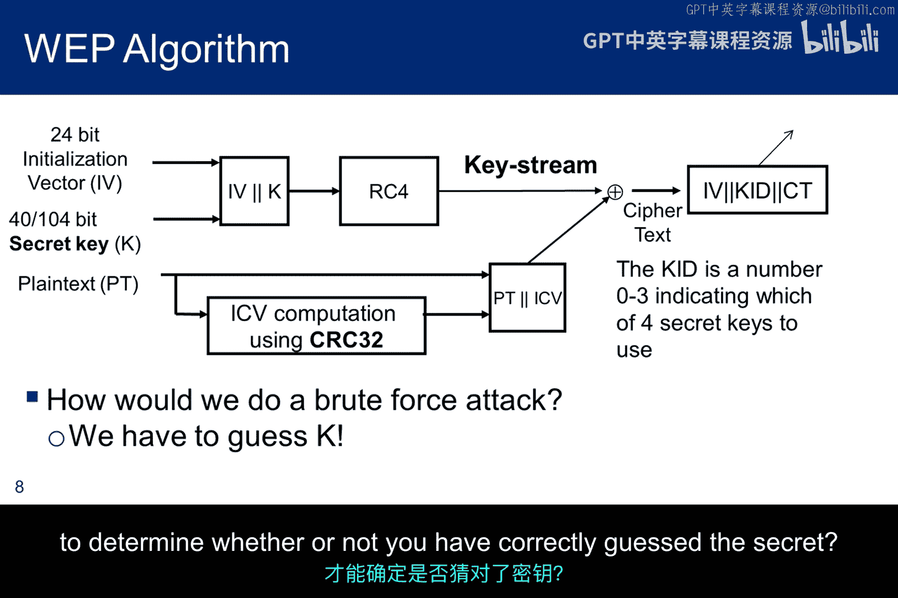

如果 `A XOR B = C`，那么 `C XOR A = B`，且 `C XOR B = A`。这意味着，如果你用密钥流对明文进行异或得到密文，那么用相同的密钥流对密文再次异或就能恢复明文。同时，由于异或的特性，**将明文与密文进行异或也能得到密钥流**。我们将在分析WEP时利用这一事实。

WEP使用RC4算法，其工作流程如下：
1.  将一个24位的**初始化向量**（IV）与一个**密钥**连接起来，输入RC4算法以生成**密钥流**。早期WEP使用40位密钥，后增至104位。密钥流是一种伪随机数生成器产生的、长度与待加密明文匹配的字节流。
2.  同时，对明文计算一个32位的CRC校验值，称为**完整性校验向量**（ICV）。
3.  将明文与其ICV连接。
4.  用生成的密钥流对“明文+ICV”进行**异或**运算，产生密文。
5.  最终传输的数据是：`IV + 密钥ID + 密文`。密钥ID（0-3）告诉接收方使用四个WEP密钥中的哪一个来重建密钥流进行解密。

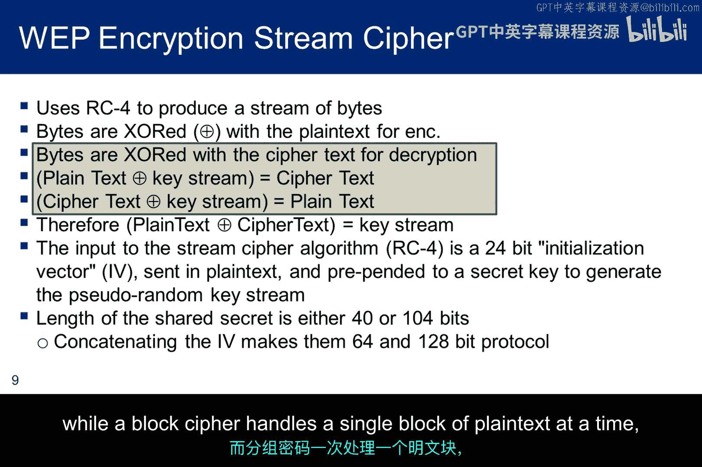

理解这个算法对实验至关重要。思考如何对WEP进行暴力破解攻击：如果你猜测了一个密钥K，你需要嗅探什么数据？需要进行哪些计算和比较，才能确定你是否猜对了秘密密钥？

## WEP的安全缺陷总结

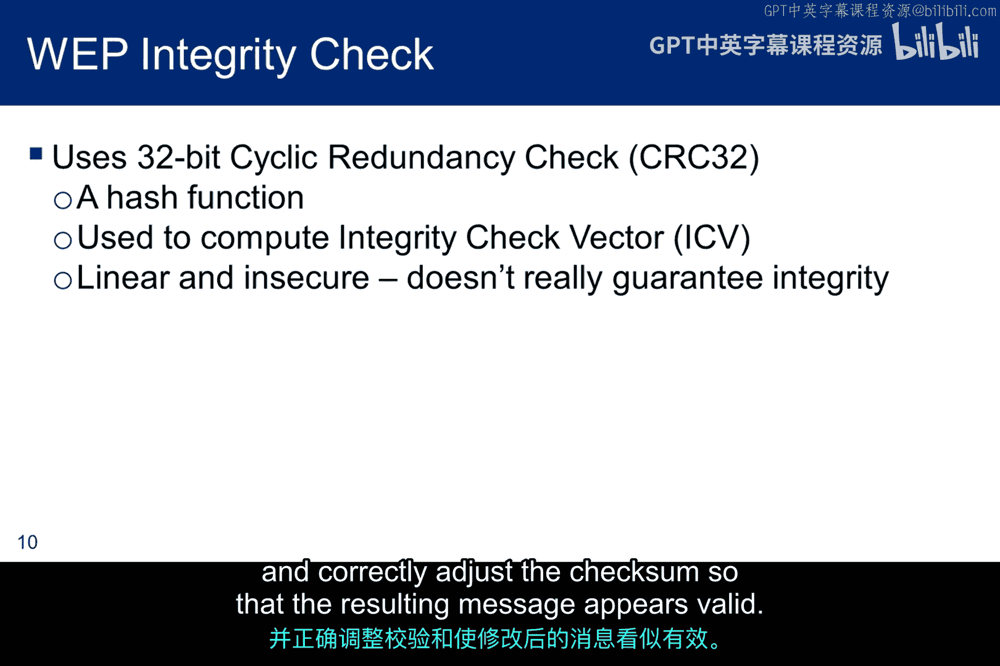

本幻灯片总结了WEP协议易受攻击的问题，所有这些问题都在其替代者WPA2中得到了解决。

以下是WEP的主要安全缺陷：

*   **IV长度过短**：IV只有24位，即使在繁忙的网络中会变化，也很快就会重复使用。当IV重复时，密钥流也随之重复，这种碰撞使得密码分析成为可能，从而可以恢复出密钥。
*   **IV重用导致重放攻击**：IV重用意味着消息可以被重放，这本质上与重用相同，并促进了密码分析。在后续攻击中，重放数据包是一个重要组成部分。此外，标准并未强制要求IV必须递增。
*   **IV明文传输**：IV以明文形式传输，可以被轻易嗅探。这不仅将有效密钥长度从128位减少到104位，更重要的是，知道了密钥的前24位（即IV），极大地帮助了破解RC4算法，从而泄露密钥。

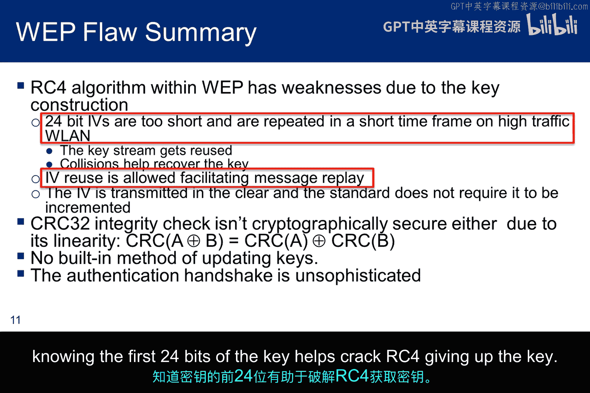

## WEP破解的关键步骤与ARP协议

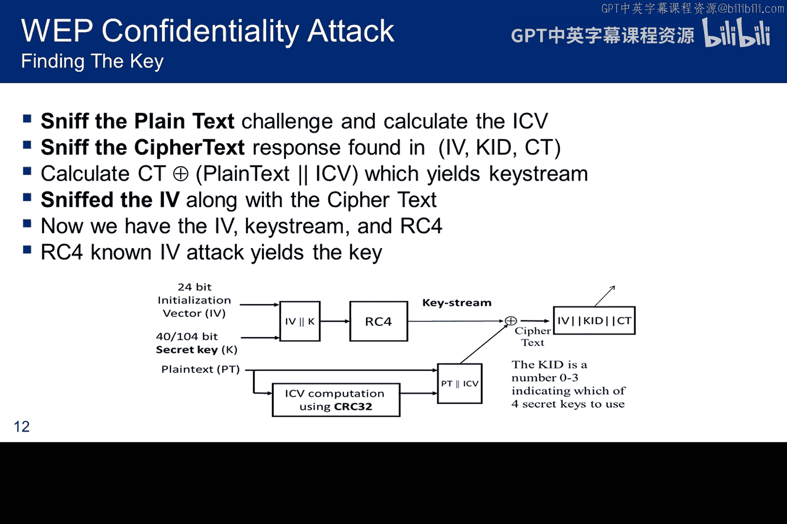

以下是WEP破解的关键步骤。攻击始于认证过程，当接入点向站点发送一个128位的随机数（挑战值）用于加密时，攻击者可以嗅探到这个明文挑战值以及站点返回的对应密文响应。因此，将密文与明文进行**异或**运算，就能得到密钥流。由于我们还能嗅探到明文传输的IV，我们就拥有了足够的信息对RC4发起密码分析攻击。

基本上，当密钥开头的少数字节已知时，该算法就变得脆弱。而在WEP中，我们已知前24位（即IV）。

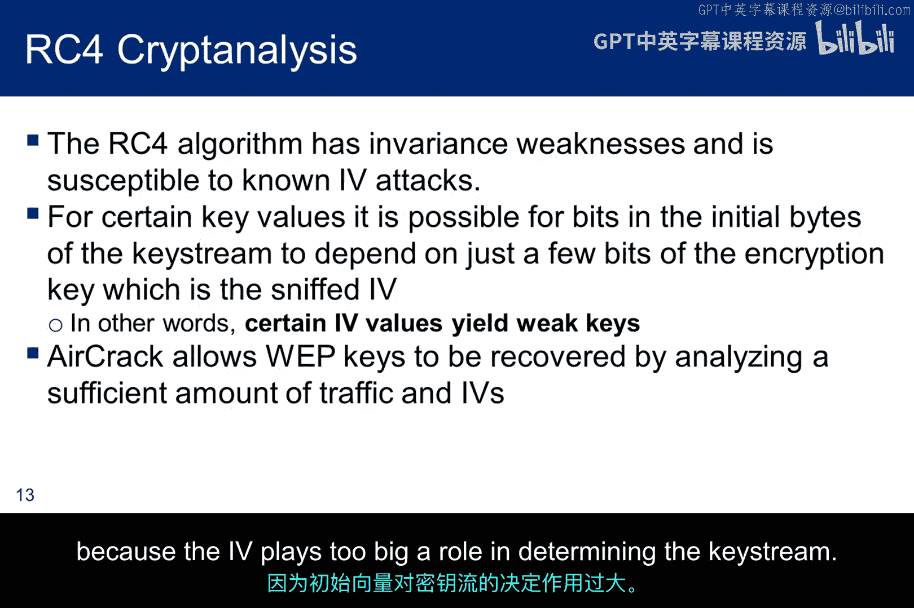

RC4的一个基本弱点是，在某些情况下，与密钥连接的IV可以决定密钥流的初始字节。由于我们知道IV，如果我们能收集到一些IV使得初始少数比特决定了密钥流的例子，密码分析就能给出密钥。因此，虽然密钥流本身可能很强，但使用某些特定IV的密钥会变得脆弱，因为IV在决定密钥流时扮演了过大的角色。

最后，需要回顾一下**地址解析协议**（ARP）的作用，因为它将在我们的攻击方法中扮演重要角色。ARP将IP地址链接到物理传输所需的MAC地址。为了减少广播数量，ARP会维护一个IP地址到MAC地址映射的缓存以供将来使用。ARP缓存可以包含动态和静态条目。动态条目有最多10分钟的生命周期。你可以使用 `arp -a` 命令查看ARP缓存。

## 总结

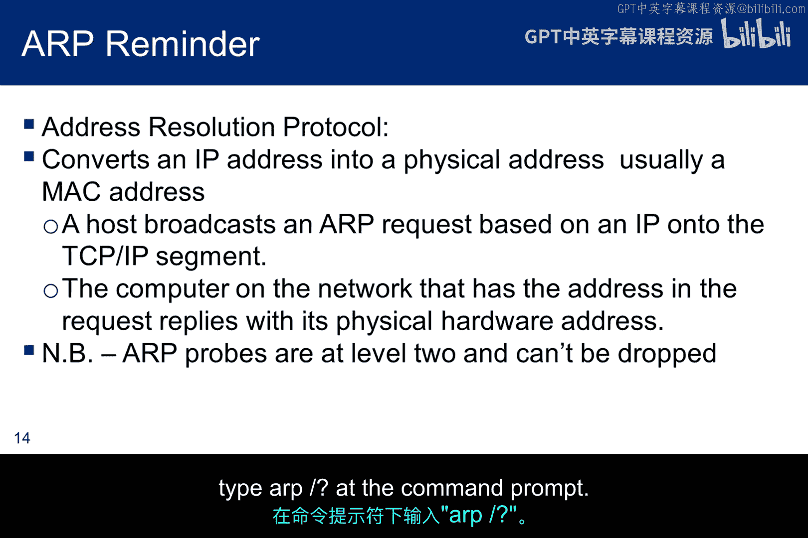

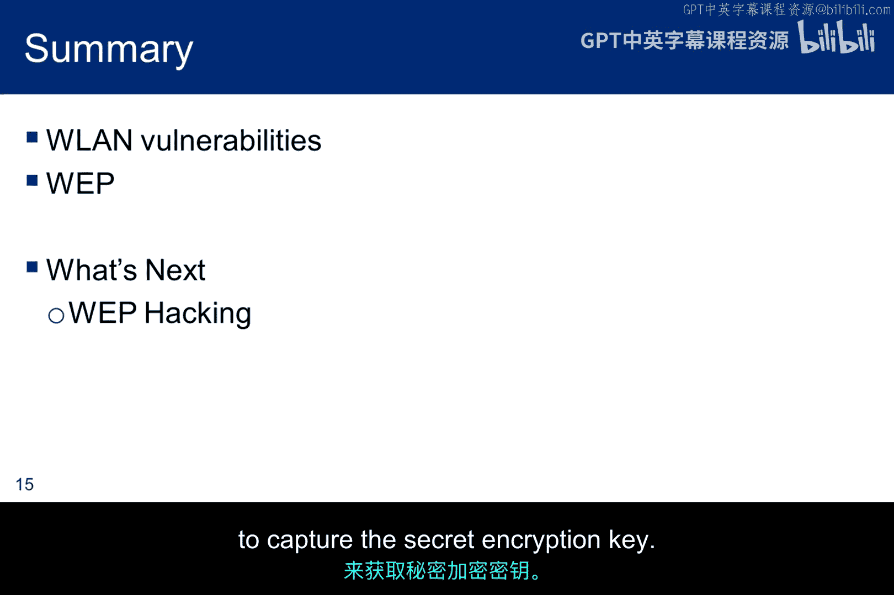

本节课我们讨论了几种重要的WLAN漏洞，并深入剖析了WEP协议，了解了其弱点所在。下节课，我们将学习如何利用这些弱点来捕获秘密加密密钥。