# 051：WEP加密破解 🔓

在本节课中，我们将学习如何破解WEP加密的Wi-Fi网络。WEP是一种过时且不安全的无线加密协议，其漏洞允许攻击者在收集足够数据后恢复出网络密钥。我们将使用Aircrack-ng工具套件，并遵循一套特定的方法论来完成此过程。请注意，仅对您拥有或获得明确授权的设备进行此类测试是合法的。

## 概述

WEP加密的破解依赖于收集足够多的初始化向量。通过重放关联客户端的ARP请求，可以迫使接入点生成包含新IV的响应包。当收集到足够多的IV后，就可以利用RC4流加密的弱点进行密码分析，从而破解出密钥。

## 工具准备 🛠️

上一节我们介绍了WEP的基本原理，本节中我们来看看用于破解的具体工具。Aircrack-ng是一个用于审计无线网络安全的工具套件。本讲座将讨论其中几个核心工具，但不会涵盖全部。例如，我们不需要接入点欺骗工具，但如果您想实施“邪恶双子”攻击以收集凭证，该功能可能有用。

需要注意的是，某些无线网卡不支持监控模式。因此，即使您直接在主机或虚拟机中运行这些工具，如果网卡受限，工具也可能无法工作。

以下是破解WEP接入点将用到的工具：
*   **airmon-ng**：用于将无线网卡置于监控模式。
*   **airodump-ng**：用于捕获数据包，发现WEP网络及其关联的客户端。
*   **aireplay-ng**：用于捕获并重放数据包（如ARP请求），以促使接入点生成新的IV。
*   **aircrack-ng**：用于对收集到的IV进行密码分析，最终破解出WEP密钥。

互联网上有成千上万关于如何使用这些工具的讨论，许多作者使用的方法可能与我不同。因此，如果您阅读更多关于这些工具的资料，即使在Aircrack-ng官网上，也可能会发现不同的方法偏好。

## 步骤详解 📝

### 1. 启用监控模式

首先，您需要运行 `ifconfig` 命令来获取您的Wi-Fi适配器名称。在我的例子中，它是 `wlan0`。

以下截图显示了使用 `airmon-ng` 将适配器置于监控模式的过程。您可以看到，运行时识别出两个可能产生冲突的进程。在启动监控之前，先运行带有 `--check-kill` 参数的 `airmon-ng` 命令，旨在停止这些冲突进程。

然后，当您将适配器置于监控模式时，错误消息应该会消失。成功运行 `airmon-ng` 后，将创建一个与 `wlan0` 关联的新接口，名为 `mon0`。

另一个我无法完全解释的现象是，有时您需要运行两次 `airmon-ng`。希望这是一个在我遇到之后已被修复的bug。当您运行两次时，最终会得到两个新接口：`mon0` 和 `mon1`。`mon1` 可以工作，但 `mon0` 不行。如果您在启用监控模式时遇到问题，可以尝试这种方法。

另外，您可以看到这些截图是在Kali Linux出现之前的BackTrack系统上制作的。它显示采用Ralink芯片的适配器可以工作。我不知道是VirtualBox升级还是BackTrack升级导致了问题，但现在该芯片已无法工作。

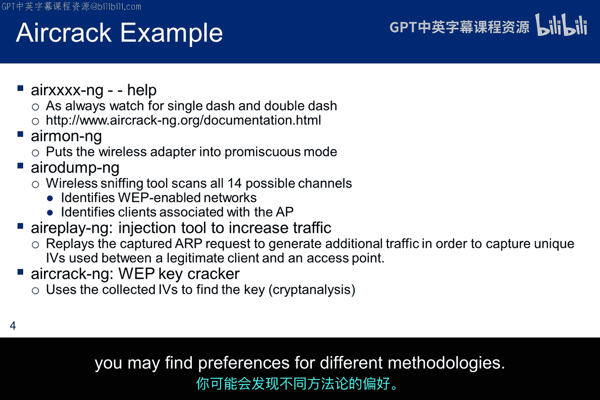

此截图显示了名为 `mon0` 的新接口，它与 `wlan0` 关联，并已启动运行在混杂模式下。实际上，在运行 `airodump-ng` 之前，您不会看到“混杂”状态，因为 `airmon-ng` 只是将其置于监控模式。

顺便提一下，不同的工具会创建不同名称的监控接口。例如，Kismet将接口命名为 `wlan0mon`，而不是 `mon0`。即使是同一个工具，在升级后也可能更改名称。因此，请利用 `ifconfig` 命令确保您知道接口的名称以及它是否处于混杂模式。

### 2. 探测网络与客户端

此截图显示 `airodump-ng` 正在 `mon0` 接口上捕获数据包，并将附近Wi-Fi网络的详细信息输出到屏幕。您也可以将相同信息以各种格式写入文件以供离线分析，例如，用于Wireshark的Pcap文件、用于电子表格分析的CSV文件，或者如果您更喜欢Kismet工具，则可以保存为Kismet文件。

请注意，当时有三个启用了WEP的接入点，两个使用信道11，一个使用信道1。您还可以在底部看到，所有WEP接入点都没有关联的客户端站。因此，在那一刻，没有可攻击的目标。

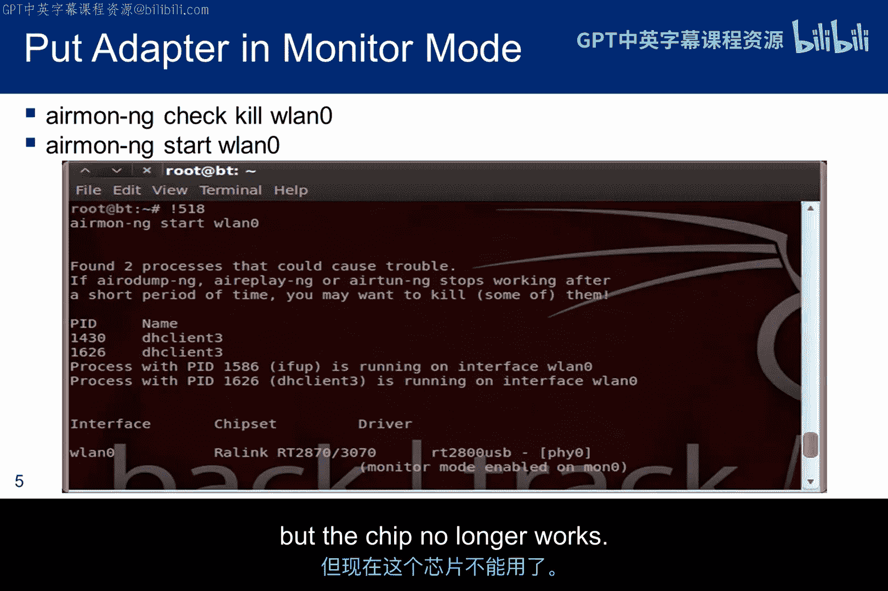

显然，如果 `airodump-ng` 在一个信道上收集数据包，它就无法同时在其余13个信道上收集。这意味着可能会错过重要的数据包。为了减少这种冲突并优化数据包收集，我们可以指定用于收集的信道。

之前的截图显示启用了WEP的接入点使用信道1和11。因此，在此屏幕上，我将数据包收集限制在这两个信道。

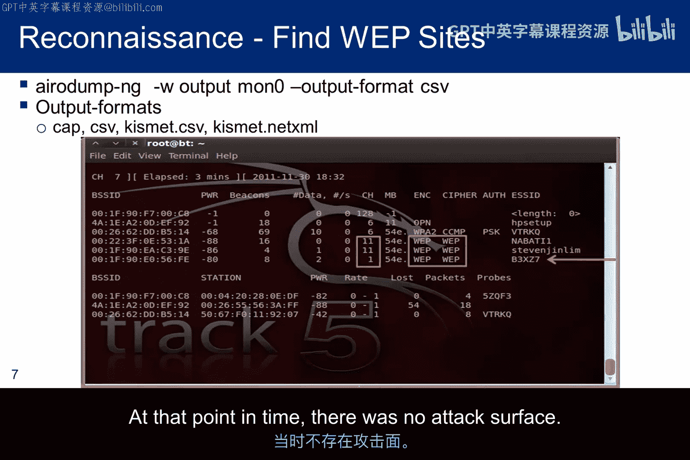

### 3. 选择攻击目标

这显示了电子表格中的 `airodump-ng` 输出。从底部开始，请注意只有一个客户端站被识别为与某个接入点关联。但由于某些原因，工具未识别出该接入点的SSID。此外，该客户端站不活跃，因为只嗅探到一个数据包。

查看顶部，有三个接入点。找到似乎有关联客户端的相同MAC地址，我们看到它生成的IV数量不如第三个接入点多。而收集IV是我们的目标。由于第三个接入点的IV计数更高，并且第一个接入点不属于我，我决定以第三个接入点为目标，并收集该接入点的信息。

这些数据中还存在另一个明显的异常。第三个接入点启用了WEP，这意味着它使用共享密钥认证，但它却被标识为使用开放认证。我认为我们得出的结论是，这类工具很好，但并不完美。因此，作为道德黑客，我们需要在操作过程中进行批判性思考。

所以，我们的目标将是BSSID为 `00:1f:90:e0:56:fe` 的接入点。

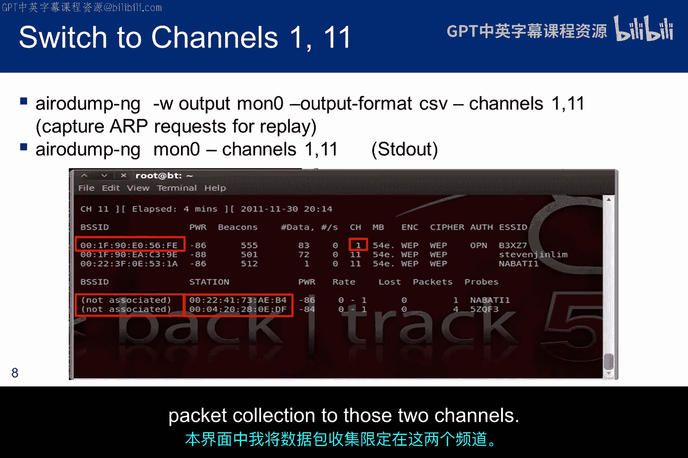

### 4. 捕获关联客户端

选定目标后，我们现在进一步将嗅探限制在该MAC地址（接入点）和信道1上。

收集一段时间数据后，我们可以识别出与目标关联的一个活跃客户端站的MAC地址。

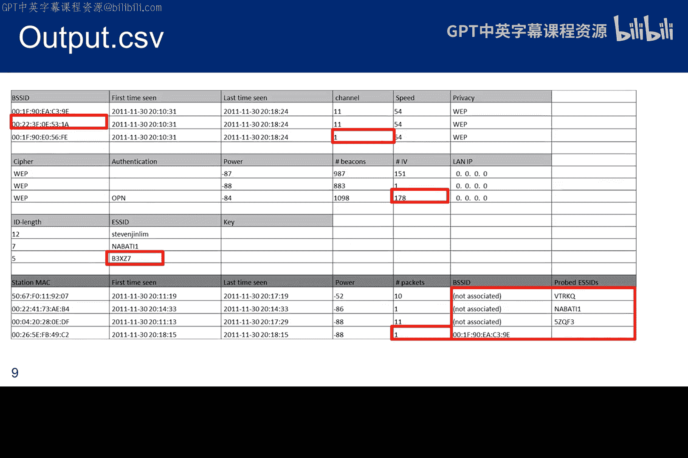

### 5. 重放数据包以生成IV

现在我们有了接入点和客户端站的MAC地址，可以开始收集两者之间的ARP请求并重放它们。一旦 `aireplay-ng` 看到一个ARP请求，它就会立即重放。立即重放比仅仅监听和保存ARP请求更快。

但我们希望增加可用于重放的数据包数量。因此，该工具在重放的同时也会保存ARP请求，并将收集到的所有内容放入一个Pcap文件中。由于所有ARP请求都被捕获到一个重放文件中，我们可以重放整个文件，从而加速IV生成过程。

`aireplay-ng` 的语法可以直接重放嗅探到的内容。但在下一张幻灯片中，我们将开始使用重放文件来增加ARP请求的数量。

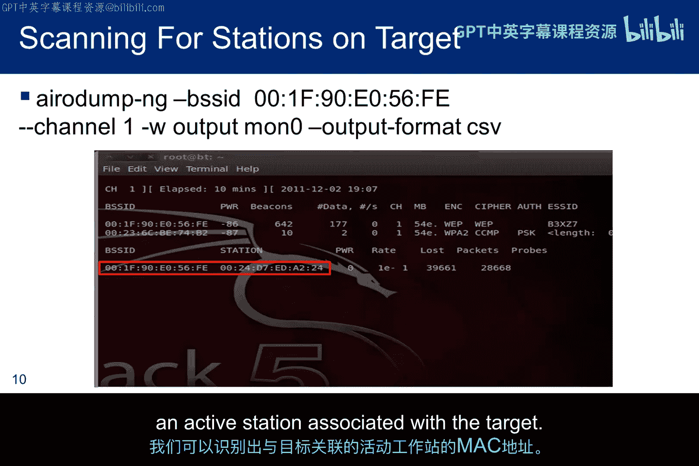

### 6. 利用重放文件加速

这是 `aireplay-ng` 收集ARP请求并重放它们的截图，同时它生成一个由日期和时间唯一标识的重放文件。

重要的一点是，Pcap文件包含两种类型的条目。首先，它包含捕获并重放的ARP请求。但它也包含来自接入点的ARP响应。显然，ARP响应无法被重放，但新的IV对于破解是必需的。

有一个问题：为什么我们在捕获文件中获得不止一个ARP请求？客户端站应该发送几个初始ARP请求，获得响应后，直到ARP缓存被删除前不会再发送另一个。答案是，我们正在重放那个单一的请求。`aireplay-ng` 在收到ARP请求时会重放它，但它会重放多次。这避免了等待ARP缓存超时，同时也是创建更大重放文件的催化剂。

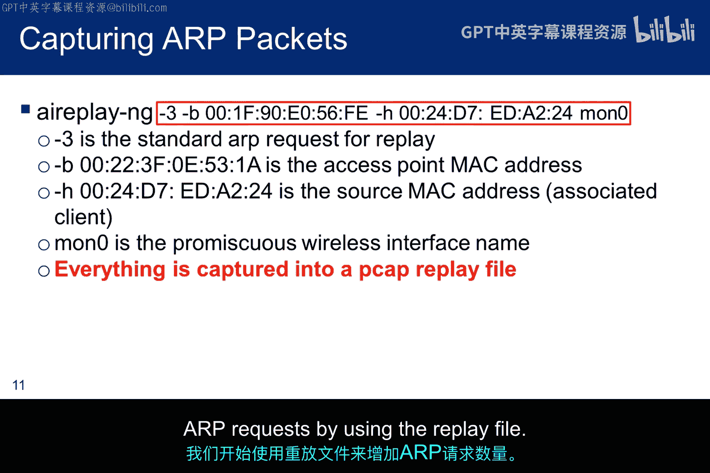

### 7. 启动破解过程

这显示了使用重放文件启动 `aireplay-ng` 的语法。但在开始重放之前，我们希望启动针对目标接入点的 `airodump-ng`，以便获得一个干净的破解文件，其中填充了来自接入点的、包含新IV的响应。

我将破解文件命名为 `crack`。但如果我们需要在收集到足够IV之前停止会话，我们可以按顺序编号破解文件，破解程序将按相同顺序处理它们。因此，我们可以使用 `crack1`、`crack2` 等，为每个收集会话使用不同的名称。

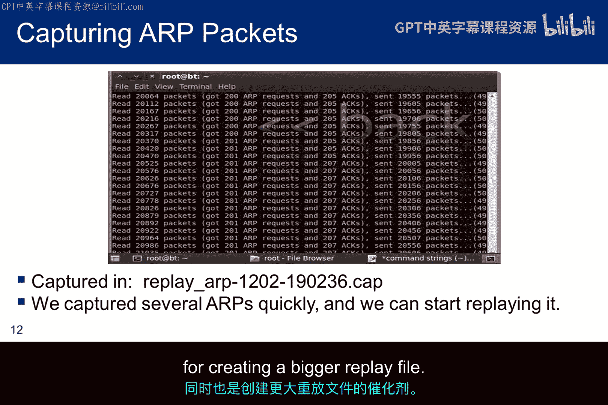

这是 `aireplay-ng` 使用重放文件的截图。它与不使用重放文件时的 `aireplay-ng` 输出几乎相同。

这是 `aircrack-ng` 找到密钥的截图。关于 `aircrack-ng` 有几点说明：如前所述，它可以处理跨多个会话收集的AP响应，但它也可以与 `aireplay-ng` 和 `airodump-ng` 同时运行，即使AP响应收集尚未完成。

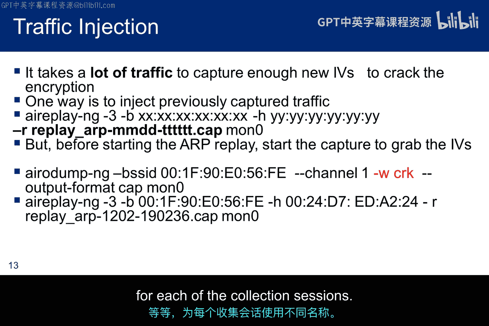

### 8. 验证与连接

此截图显示在密钥被识别后，成功连接到目标网络。

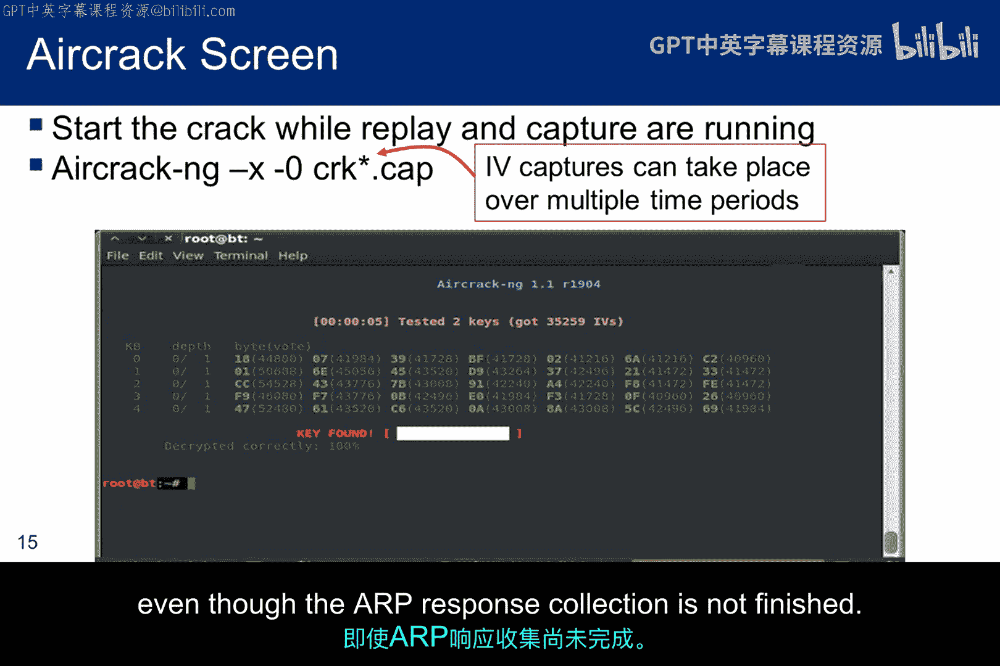

## 总结

本节课中我们一起学习了使用Aircrack-ng工具套件破解WEP加密Wi-Fi网络的全过程。这张幻灯片总结了我所使用的WEP密钥破解步骤。正如我之前所说，互联网上讨论了许多其他方法。我认为Aircrack-ng官网也使用了一种略有不同的方法。

核心步骤总结如下：
1.  使用 `airmon-ng` 将无线网卡置于监控模式。
2.  使用 `airodump-ng` 发现目标WEP网络及其关联的客户端。
3.  使用 `aireplay-ng` 捕获并重放客户端与接入点之间的ARP请求，迫使接入点生成大量包含新IV的响应。
4.  使用 `airodump-ng` 专门捕获这些响应数据包。
5.  当收集到足够IV（通常数万到数十万个）后，使用 `aircrack-ng` 进行密码分析，破解出WEP密钥。

接下来，我们将讨论WPA及其为应对WEP漏洞而实施的改进措施，同时保持向WPA2兼容的过渡路径。

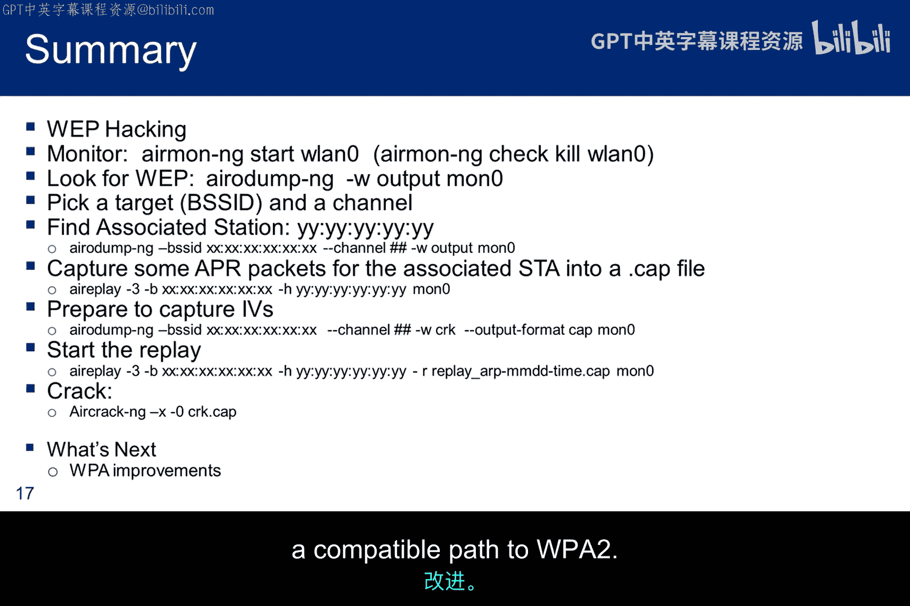

