# 052：摒弃WEP，WPA安全性探讨 🔐

在本节课中，我们将深入探讨WPA（Wi-Fi Protected Access）协议如何解决其前身WEP（Wired Equivalent Privacy）的安全缺陷。我们将详细解析WPA的核心机制，包括其密钥层次结构、临时密钥完整性协议（TKIP）以及四次握手过程，以理解它如何为无线网络提供更强的保护。

---

我们知道，WEP对于我们的接入点来说是一个糟糕的选择。我们也知道，WPA的设计旨在解决WEP中的弱点。但这具体意味着什么？这些改变是否真正达到了目标？

你或许可以将WPA视为WPA2的一个子集。它扩展了WEP的一些理念，使其更安全，同时允许重用WEP的固件。并且，它与当前的WPA2标准向前兼容。尽管采用了这种渐进式的方法，但我的旧路由器还是变成了废品，因为制造商没有足够的前瞻性来让固件可以升级。WPA2现在已成为802.11规范的一部分。

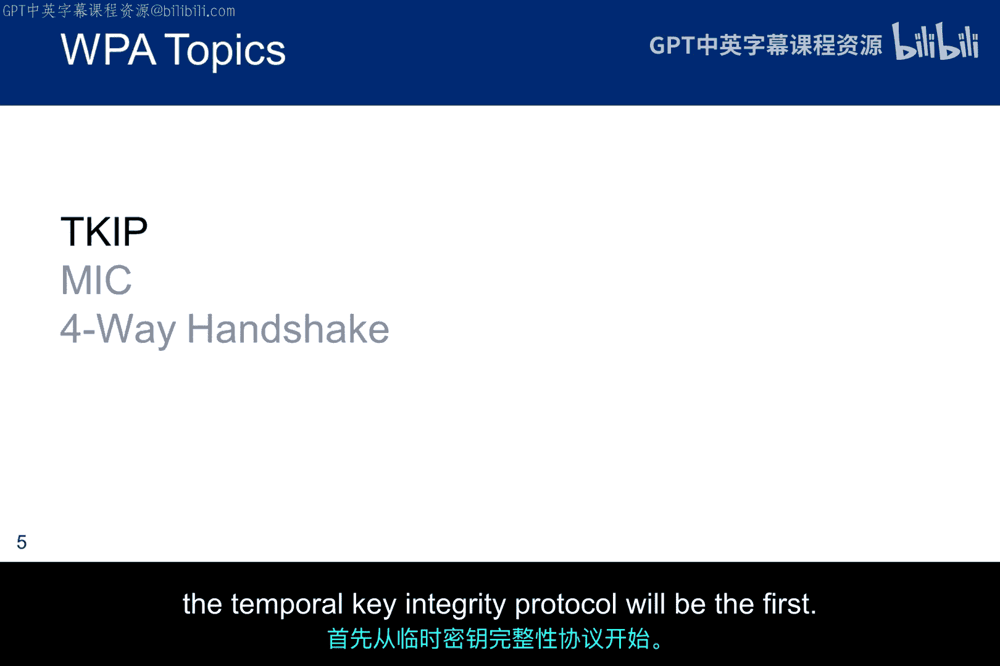

如前所述，WPA同时支持预共享密钥认证和使用RADIUS认证服务器的企业级解决方案。在本模块的剩余部分，我们将专注于预共享密钥方案，因为尽管有安全增强，一个弱密码短语仍可能使WPA变得脆弱。虽然它不易受到密码分析攻击，但字典攻击对弱密码是有效的。

在通往WPA2的道路上，WPA是一个过渡性解决方案，因此我们将从这里开始。WPA的目标是提供一个解决WEP问题的方案，同时保留WEP设计的许多理念，并为未来发展铺平道路。因此，RC4算法暂时保留，但其周围的一切都得到了加强。

在WEP中，24位的初始化向量（IV）改变了密钥流，但前置一个会重复的IV被证明是有问题的。换句话说，IV的实现决定了密钥流变化的频率。理论上，如果IV是恒定的，密钥流可能永远不会改变。虽然我没听说过有实现采用这种方式，但我们并不真正知道供应商多久改变一次IV。无论如何，临时密钥完整性协议（TKIP）通过为每个加密的帧动态改变密钥，解决了IV的问题。

完整性算法也从CRC-32加强为一种更安全的算法，称为Michael。最后，认证方式从简单地加密并返回一个128位数字的密文，改变为需要交换大量信息并产生一个大大改进的认证机制的四次握手。

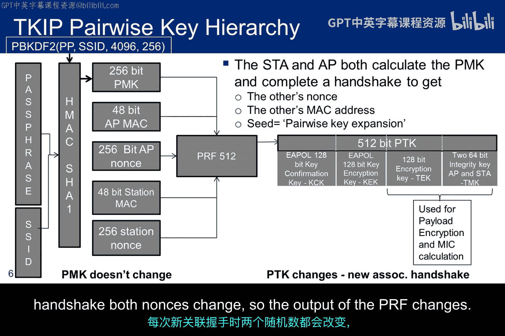

我们将逐步了解这些变化，以实现对预共享密钥的更安全使用。但请记住，在使用RADIUS服务器的802.1X环境中，服务器管理主密钥，没有预共享密钥（PSK）。

这些就是我们需要理解的变化，而临时密钥完整性协议将是第一个。

## 临时密钥完整性协议（TKIP）与密钥层次结构

上一节我们提到了WPA旨在解决WEP的弱点，本节中我们来看看其核心机制——临时密钥完整性协议（TKIP）及其密钥派生过程。

TKIP的成对密钥层次结构从左侧开始，包括共享的密码短语和Wi-Fi网络的SSID。密钥哈希消息认证码（HMAC-SHA1）使用密码短语作为密钥。

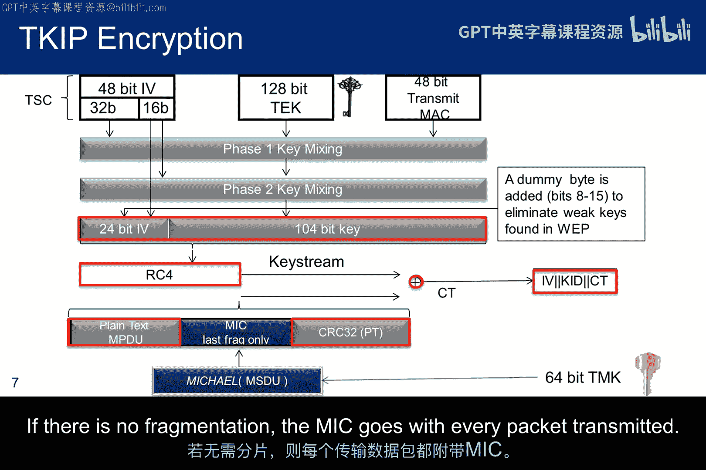

基于密码的密钥派生函数（PBKDF2）实际上通过并行的HMAC-SHA1计算来生成成对主密钥（PMK），这些计算结果被连接并截断以产生一个256位的PMK。请注意，PMK在操作期间基本上是固定不变的，除非密码短语或SSID改变，否则永远不会改变。

一旦我们有了256位的主密钥，它会被输入到一个伪随机函数（PRF）中，该函数使用伪随机数生成器（PRNG）将密钥扩展到512位。额外的输入包括接入点（AP）的MAC地址和随机数（Nonce），以及站点（Station）的MAC地址和随机数。

一个重要的概念是，给定相同的种子，PRNG总是产生相同的随机输出流。因此，两个独立的设备可以通过从相同的种子值开始来生成相同的密钥集。在这种情况下，站点和接入点使用的种子是“成对密钥扩展”。因此，会有一个四次握手，允许站点从AP获取MAC和Nonce，反之亦然。

PRF的输出是一个512位的字符串，随后被分割成五个不同的临时密钥。前两个128位的密钥仅在握手期间即时使用，以提供完整性保护和保密性。第三个128位的密钥实际上用于加密数据流量。最后一个128位的字符串被分割成两个64位的完整性密钥，用于双向数据传输期间。

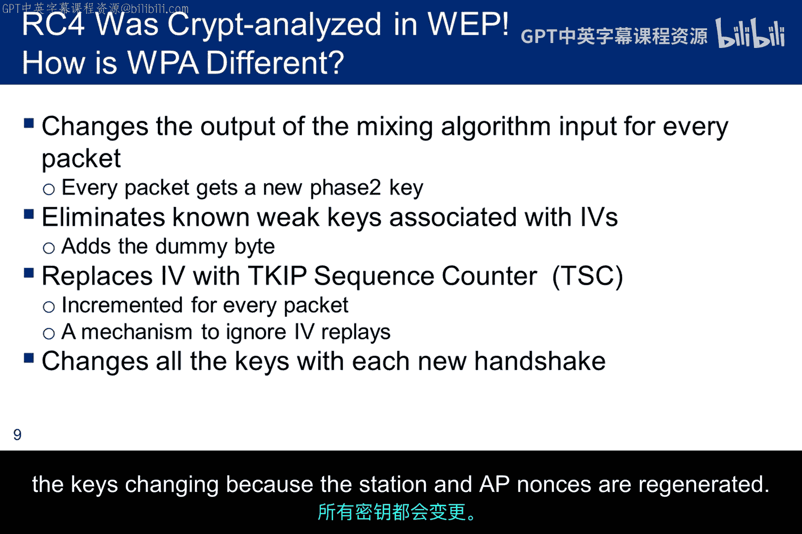

最后，虽然主密钥不变，但临时字符串会改变。每次有新的关联握手时，双方的Nonce都会改变，因此PRF的输出也会改变。

## TKIP如何生成受保护的有效载荷

在了解了密钥层次结构后，我们来看看TKIP如何使用这些临时密钥来生成受保护的数据包。

以下是TKIP加密过程的步骤概述：

1.  **初始化向量（IV）与TSC**：首先，48位的IV也被称为TKIP序列计数器（TSC），其中“序列”一词意味着它会随着每个新数据包递增。这强制IV必须改变，这在WEP中不是强制的。48位的长度意味着IV在很长一段时间内不会被重用。实际上，2^48这个数字非常大，我们可以认为它不会重复。如果TSC空间耗尽，符合标准的实现可以选择用新的临时密钥替换旧的，或者终止通信。由于重用任何TSC值都会危及已发送的流量，最好的实现可能就是终止通信。需要注意的是，TSC被分成两部分：一个32位的部分和一个16位的部分。

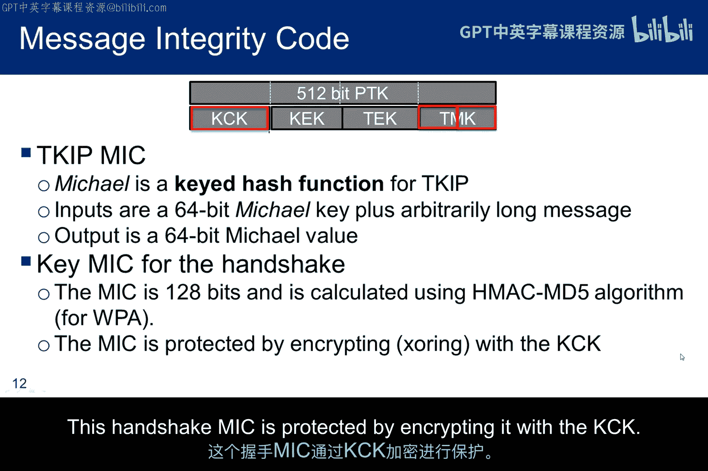

2.  **密钥混合**：128位的临时加密密钥（TEK）经过两个阶段的混合。第一阶段的输入是TEK、发送方的MAC地址以及IV的32位部分。IV的16位部分进入第二阶段混合。这确保了第一阶段每65，000个数据包改变一次密钥混合，而第二阶段每个数据包改变一次。结果是，104位的输出密钥与原始的TEK几乎没有相似之处，任何试图使用RC4密码分析技术的尝试都不会成功。

3.  **IV前置与RC4加密**：前置的IV仍然是24位，但由16位的TSC段组成，中间插入了一个虚拟字节。这样做是为了对抗在WEP密码分析中利用的弱密钥问题。此时，128位的结果被传递给RC4，算法处理方式与WEP中完全相同，除了整个48位的IV被传输，而不仅仅是前置的24位IV。

4.  **完整性校验（Michael算法）**：在图的底部，你可以看到新的密钥完整性算法Michael被应用于MAC服务数据单元（MSDU）。Michael的输出（MIC）被注入到明文和WEP算法使用的CRC之间。如果需要分段来发送有效载荷，MIC只与最后一个分段一起发送。如果没有分段，MIC则与每个传输的数据包一起发送。

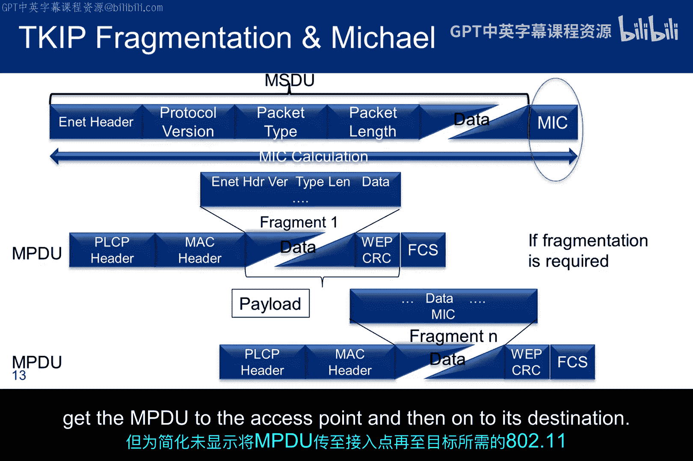

## WPA密钥变化总结

现在，让我们简要回顾一下WPA中哪些密钥会变化，以及何时变化。

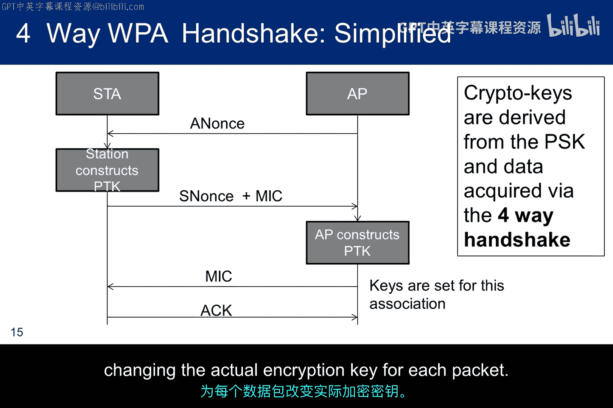

以下是WPA密钥的生命周期：

*   **成对主密钥（PMK）**：只有当密码短语或SSID改变时才会改变。它会改变，但变化不频繁。
*   **成对临时密钥（PTK）**：每次有新的四次握手时就会改变。因此，这种变化相对频繁，但肯定不是每个新数据包都变。
*   **TKIP序列计数器（TSC）**：这就是关键所在。它随着每个数据包递增，导致每个数据包都有一个新的128位密钥输入到RC4中。

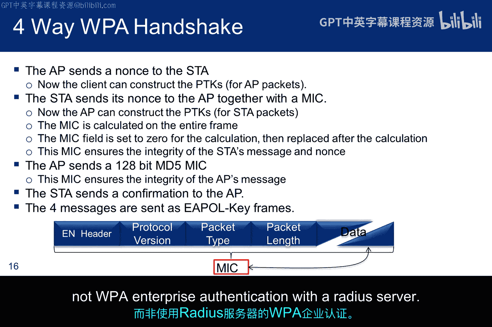

因此，这就是与WEP的不同之处：

1.  混合算法的输出会随着每个数据包改变RC4使用的128位密钥，因为TSC在递增。如果TSC空间耗尽，符合标准的设计选择是：用新的临时密钥替换旧的，或者终止通信。由于重用任何TSC值都会危及已发送的流量，替换密钥可能不是最佳选择。然而，TSC足够大，TSC空间耗尽应该不是问题，直接终止通信可能是更好的选择。
2.  在TSC的16位段中添加了一个虚拟字节，以克服与某些IV相关的弱密钥问题，这些IV曾有助于密码分析。
3.  TSC不仅会递增，还增加了一种机制来阻止IV的重放攻击，这是允许捕获和重放加密认证请求的弱点。这是通过以下方式实现的：IV值总是从0开始，每发送一个数据包就递增1；任何TSC序列计数器不大于最后一条消息的消息都会被丢弃。
4.  每次站点重新认证和重新关联时，都会有一个新的握手，导致所有密钥都改变，因为站点和AP的Nonce被重新生成。

## 四次握手详解

WPA的另一个重大改进是四次握手机制。接下来，我们将详细讨论握手的每个阶段，因为捕获握手并比较WPA和WPA2的差异是实验的一部分（如果你选择做的话）。

下图显示了握手中交换的关键数据部分。Nonce对于PTK的计算至关重要。握手包含一个“即时”的方面，因为一旦Nonce到达，必须在握手继续之前计算KCK和/或KEK来保护握手的内容。说密钥生成输入是“设定的”，意味着密钥被加载到算法中，除非有新的关联和新的Nonce，否则不会改变。当然，这仅仅意味着PTK是固定的，而TSC会自行递增，为每个数据包改变实际的加密密钥。

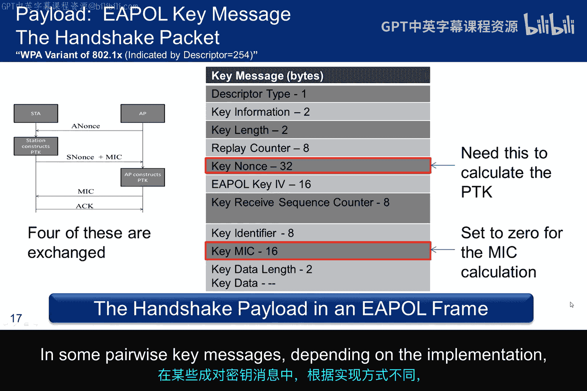

以下是四次握手的步骤，每个要点总结了几个重要的概念：

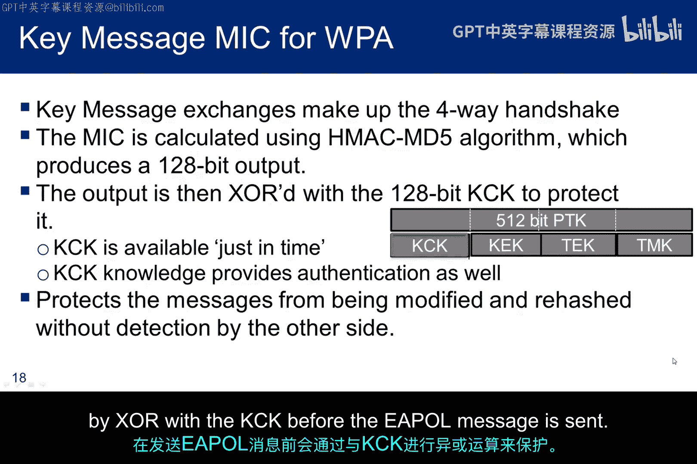

1.  **第一步（AP -> Station）**：AP向站点发送其Nonce（ANonce）。站点收到后，可以计算PTK。
2.  **第二步（Station -> AP）**：站点向AP发送其Nonce（SNonce）以及一个消息完整性校验码（MIC），该MIC使用刚计算出的PTK中的KCK部分生成。这向AP证明站点知道共享的密码短语。
3.  **第三步（AP -> Station）**：AP验证MIC。如果正确，AP知道双方共享秘密。AP发送一个消息，指示安装密钥，并附带一个使用PTK计算的MIC。同时，AP可能发送加密的组临时密钥（GTK）。
4.  **第四步（Station -> AP）**：站点发送一个确认消息，同意安装密钥并开始加密通信。

重要概念总结：
*   Nonce即时到达以支持PTK计算，使握手得以继续。
*   MIC的计算跨越整个消息，其中包括MIC字段本身，因此在计算前必须将该字段设置为0。
*   握手中使用的MIC算法是HMAC-MD5，而不是用于数据完整性的Michael算法。如果没有KCK的保护，完整性错误可能导致生成不同的密钥。
*   握手结束时有一个确认，最终切换到WPA加密进行数据通信。
*   握手使用EAPOL-Key帧。因此，捕获握手涉及收集被Wireshark识别为EAPOL协议的四个数据包。
*   提醒：我们正在分析的是WPA预共享密钥认证握手，而不是使用RADIUS服务器的WPA企业认证。

## EAPOL消息结构与字段解析

为了更深入地理解握手，我们需要了解EAPOL（基于局域网的扩展认证协议）消息的结构。

EAPOL消息包含多个字段，每个交换中的值都不同。两个红色框只是突出显示了确保握手可以继续的重要数据元素：在Nonce到达之前无法计算PTK；在计算MIC之前，MIC字段必须设置为0，计算后，再插入该字段进行传输。

以下是EAPOL消息中字段的简要讨论：
*   **描述符类型**：对于WPA握手，其值为254，这与WPA2不同。
*   **密钥信息字段**：包含几个子字段，提供关于密钥类型及其使用方式的信息。它还包含各种控制位以协助握手过程。
*   **密钥长度**：以字节为单位提供。在成对密钥方案中，这代表PTK右半部分的长度，尽管实际的PTK并不在密钥帧中发送。它是目标密钥长度。
*   **重放计数器**：随每条消息递增，以检测重放旧消息的企图。例外情况是当此消息是对请求的响应时，此时会插入被请求消息的重放值。
*   **密钥Nonce字段**：这些是随每次关联改变的值，用于派生成对临时密钥。
*   **EAPOL密钥IV**：用于组密钥传输。我们不会讨论组密钥，但如果你熟悉这个概念，GTK是使用EAPOL密钥加密密钥（KEK）结合此IV值加密的。加密的GTK被放置在密钥数据区域，即消息的最后一个字段。
*   **密钥序列计数器**：指示密钥安装后，在接收到的第一帧中预期的序列号值。此序列号可防止重放攻击。
*   **密钥标识符**：在WPA中未使用，未来可能用于支持预先设置多个密钥。
*   **密钥MIC字段**：是一个完整性校验值，计算范围覆盖整个EAPOL密钥帧，从EAPOL协议版本字段到密钥材料的末尾。
*   **密钥数据长度**：定义后续密钥数据的字节数。
*   **密钥数据**：代表需要秘密发送的材料。例如，在组密钥的情况下，这是GTK的加密值。在某些成对密钥消息中，根据实现，这可能携带一个信息元素。

## 总结

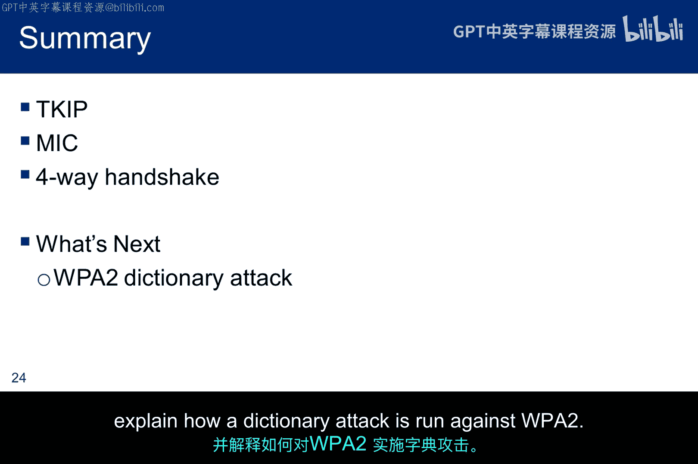

本节课中，我们一起学习了WPA协议如何作为WEP的安全替代方案。我们详细探讨了其核心改进：通过TKIP协议动态改变加密密钥、引入更强大的Michael完整性算法以及安全的四次握手过程。这些机制共同作用，有效抵御了针对WEP的多种攻击，如IV重放攻击和弱密钥攻击。理解WPA的工作原理是评估无线网络安全性的基础，也为后续学习更现代的WPA2协议做好了准备。记住，虽然WPA比WEP安全得多，但使用强密码短语仍然是防止字典攻击的关键。