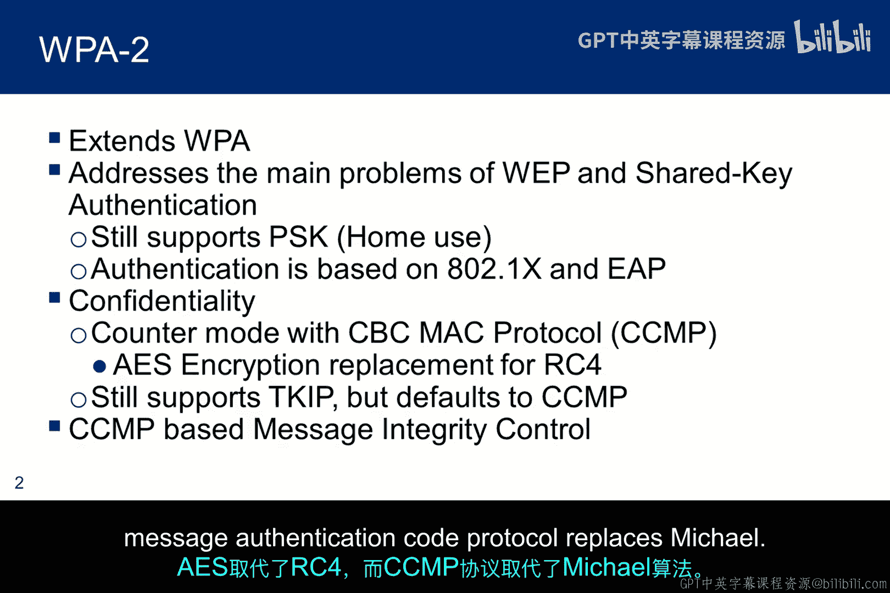
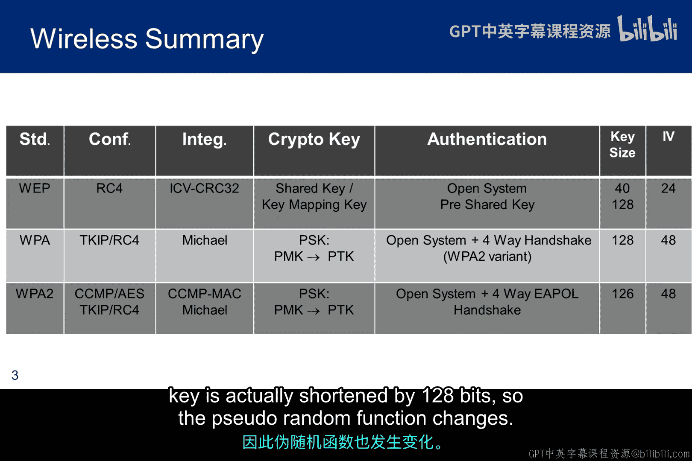
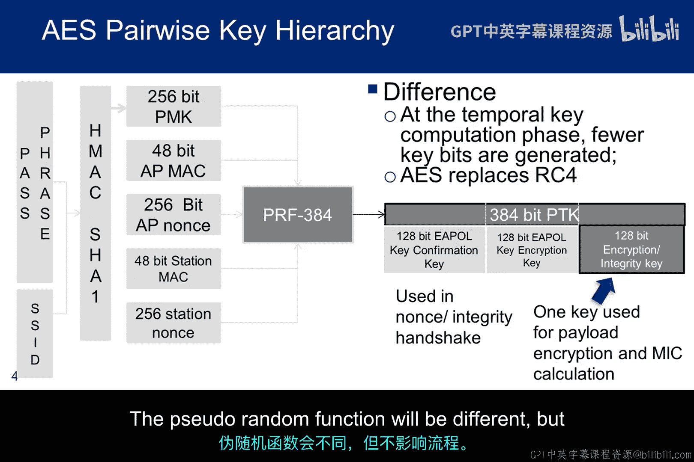
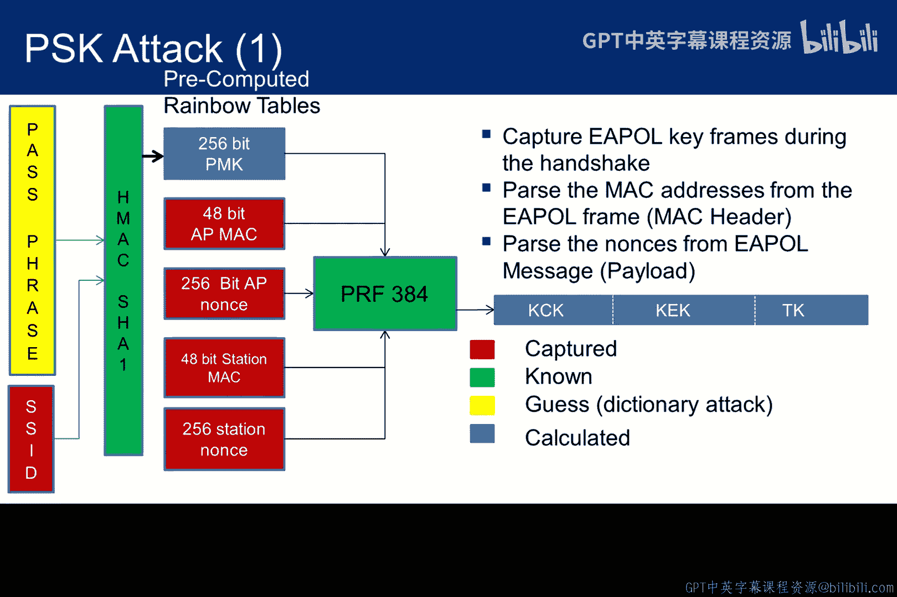
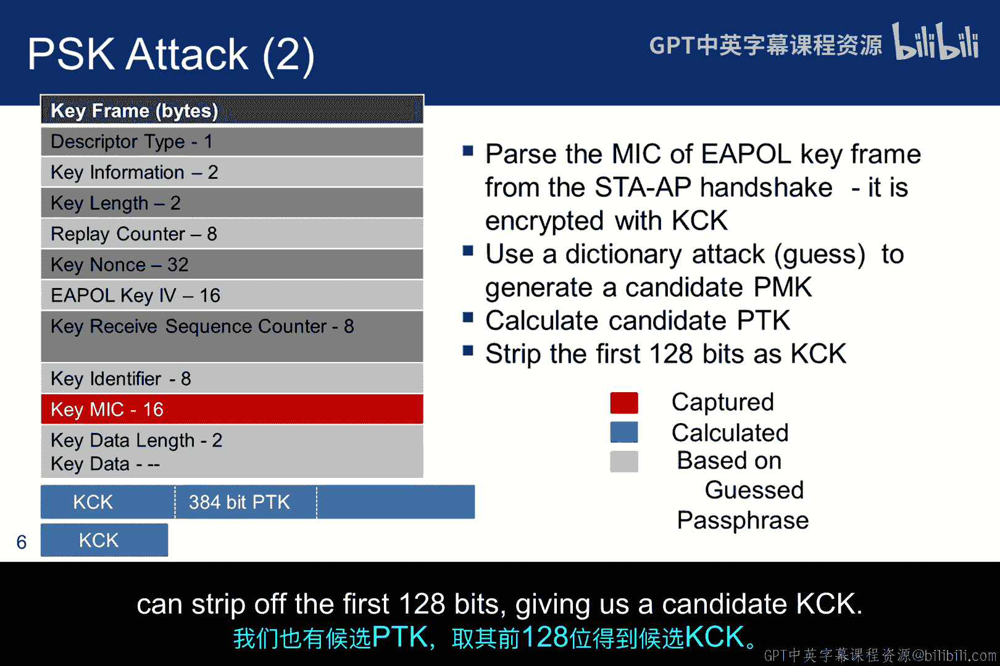
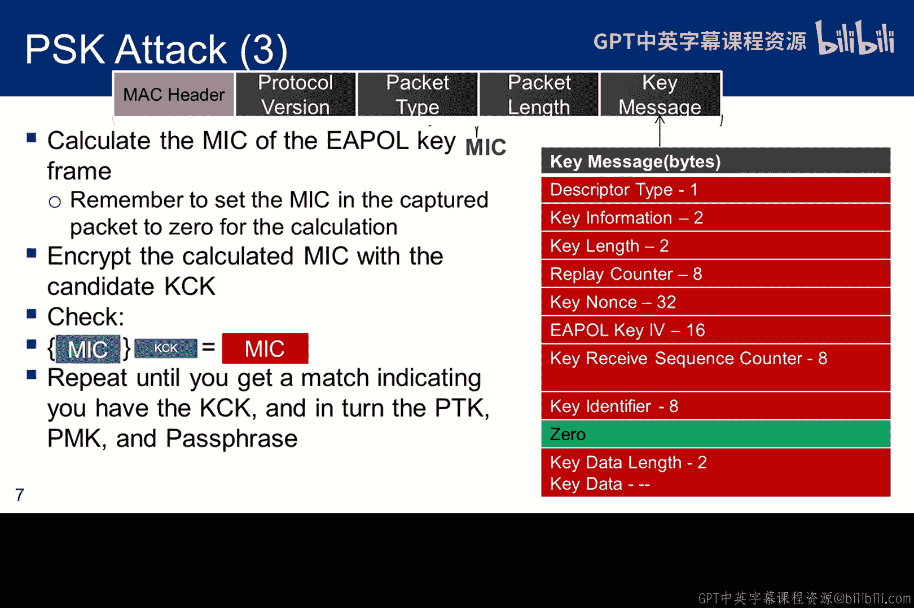
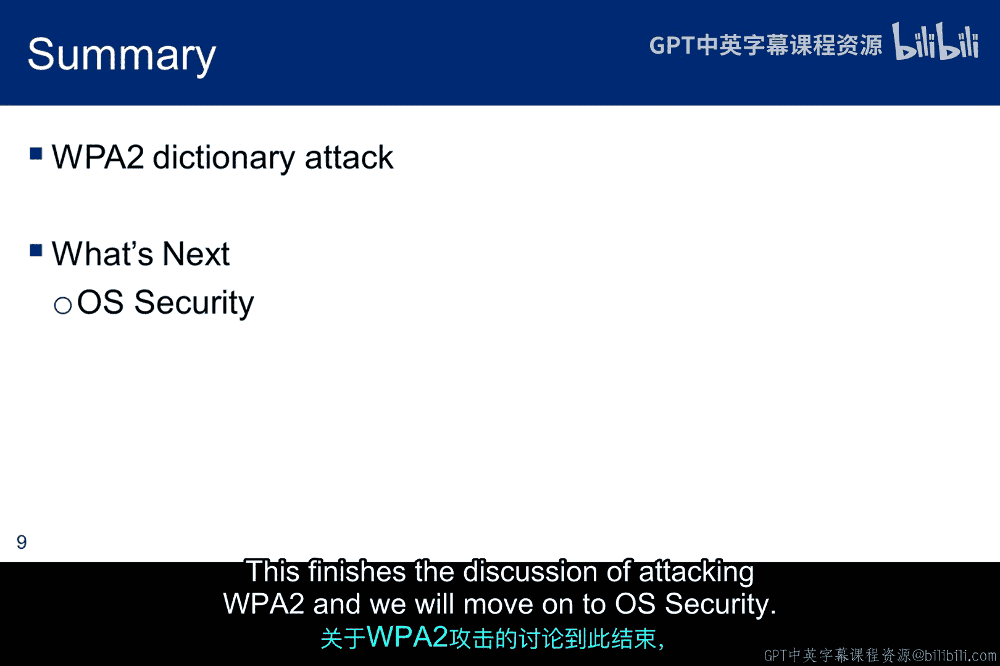

# 053：WPA-2字典攻击 🔓

在本节课中，我们将学习WPA与WPA2之间的主要区别，并详细探讨针对这两种协议的字典攻击工作原理。课程的核心是理解攻击者如何利用捕获的四次握手数据，通过猜测密码短语来尝试破解无线网络密钥。

## WPA与WPA2概述

上一节我们介绍了无线安全的基本概念，本节中我们来看看WPA和WPA2的具体差异。WPA2是WPA的扩展和增强版本。

WPA的设计初衷是作为从WEP到更安全协议的过渡方案。因此，WPA能与大多数可升级的旧硬件兼容。同时，WPA也使得向WPA2的过渡变得平滑，尽管后者可能需要新的硬件支持。

WPA2采用了与WPA相同的认证机制，但升级了加密套件：
*   **AES** 取代了 **RC4**。
*   **CCMP**（计数器模式及密码块链消息认证码协议）取代了 **Michael** 协议。

## 协议演进与密钥生成

以下表格总结了从WEP到WPA再到WPA2的802.11标准演进，旨在解决WEP的固有弱点。

| 特性 | WEP | WPA | WPA2 |
| :--- | :--- | :--- | :--- |
| **认证** | 开放系统/共享密钥 | 802.1X/EAP, PSK | 802.1X/EAP, PSK |
| **加密** | RC4 | RC4 + TKIP | AES-CCMP |
| **完整性** | CRC-32 | Michael | CCMP |

四次握手的过程略有不同，但这种差异不影响我们的讨论。主要区别在于所使用的加密套件算法，并且临时密钥的长度实际上缩短了。

密钥生成过程基本相似，都基于 **PMK = PBKDF2(Passphrase, SSID, ssidLength, 4096, 256)** 生成配对主密钥。区别在于，由于使用单一密钥进行负载加密和完整性计算，WPA2的PTK（成对临时密钥）比WPA的短128位。伪随机函数也有所不同，但这不影响攻击流程。

## 字典攻击流程详解

了解了密钥生成的基础后，我们来看看攻击者如何实施字典攻击。下图中的颜色标识有助于理解：
*   **红色**：从嗅探到的数据包中获取的信息。
*   **绿色**：已知信息（如算法、随机函数）。
*   **黄色**：需要被验证的猜测密码短语。
*   **蓝色**：某些计算过程的输出结果。

攻击的第一步是**捕获一个完整的四次握手过程**。这提供了图表中所有红色的信息。

以下是攻击的核心步骤：

1.  **猜测与计算**：从字典中选取一个条目作为密码短语进行猜测，然后运行算法生成一个候选的PTK（对WPA来说是384位）。此时我们不知道这个PTK是否正确。

2.  **验证密钥**：我们需要一种方法来验证它。在捕获握手时，我们捕获了过程中受KCK（密钥确认密钥）保护的所有MIC（消息完整性代码）。攻击算法通常使用握手过程的第三帧并提取其中的MIC。我们也有一个候选PTK，可以取其前128位作为候选的KCK。

3.  **校验过程**：校验过程如下：取捕获的密钥帧，将其MIC字段置零，然后计算MIC值。接着，用候选的KCK加密这个计算结果。最后，将我们刚计算并加密的MIC与从握手包中捕获的MIC进行比较。
    *   如果两者**不匹配**，说明我们的候选KCK是错误的。
    *   如果两者**匹配**，则说明候选KCK就是真实的KCK。由此我们可以推断，最初猜测的密码短语是正确的。

攻击者只需对字典中的每个条目循环使用上述方法。破解的成功率取决于字典的质量和密码短语的强度。

## 关于密码字典的提醒

在结束WPA2攻击的讨论前，有必要提一下常用的密码字典资源。RockYou字典在Kali Linux中可以找到。该字典源于2009年RockYou经典视频游戏密码文件的数据泄露事件，包含了3200万个密码，是一个非常好且可免费定制、增强并保存以备后用的字典。

实际上，你也可以通过命令 **`cat /usr/share/wordlists/rockyou.txt.gz | gunzip | grep ‘你的密码’`** 来检查自己的密码是否在这个字典中，从而评估其面对简单字典攻击的风险。

## 总结

本节课中，我们一起学习了WPA与WPA2的关键区别，并深入剖析了针对它们的字典攻击原理。攻击的核心在于捕获四次握手数据，并利用已知算法和猜测的密码短语来推导并验证密钥。这再次强调了为无线网络设置**强密码短语**的重要性。接下来，我们将进入操作系统安全的学习。