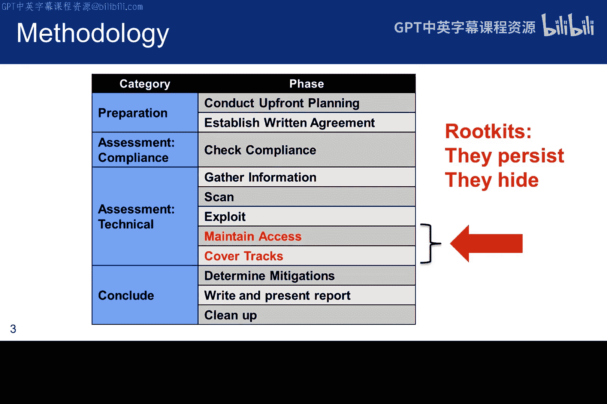
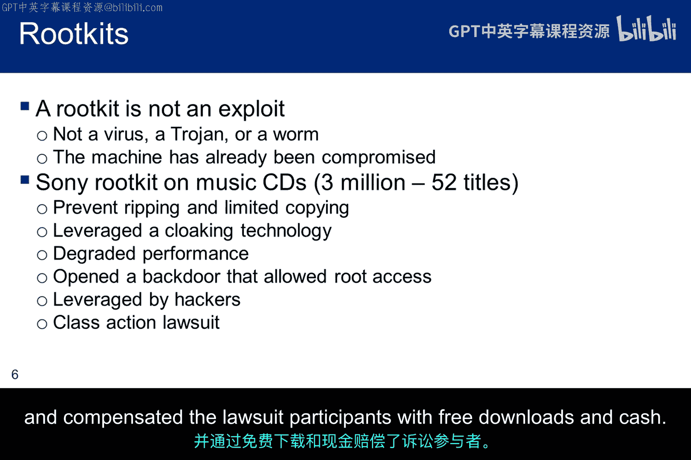
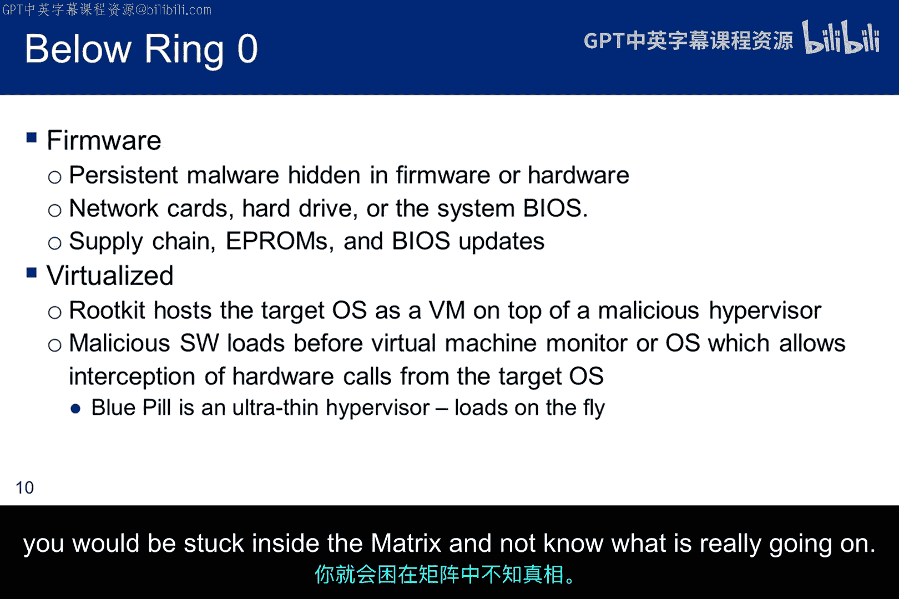
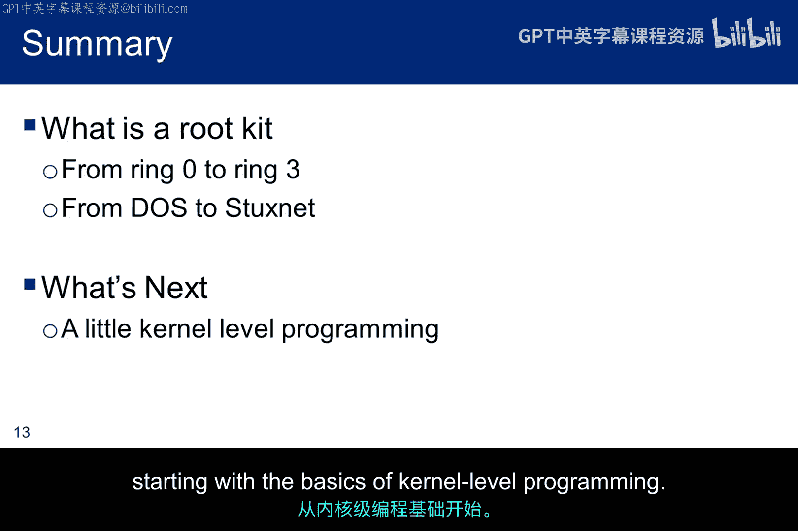

# 054：Rootkit技术解析 🔍

在本节课中，我们将学习Rootkit技术。Rootkit是一种用于隐藏恶意软件存在的技术，它在系统被入侵后发挥作用。虽然Rootkit本身不用于获取未授权访问，但它能帮助攻击者维持访问权限并掩盖踪迹。本节课将介绍Rootkit的历史、工作原理和不同类型，为后续实践打下基础。

---

## Rootkit概述与历史背景 📜

上一节我们介绍了Rootkit的基本概念，本节中我们来看看Rootkit的历史背景。

Rootkit并非现代网络攻击的产物，其历史可以追溯到很久以前。最初的Rootkit是系统程序的修改版本，例如`ps`、`netstat`和`passwd`，这些修改版本让攻击者能够获得系统管理员不知情的根权限访问。

如今，Rootkit更常见的形式是钩子（hooks），它们拦截并修改向用户显示的响应，以隐藏恶意行为。Rootkit通常用于在漏洞利用后隐藏攻击者的存在。

肯·汤普森（Ken Thompson）和丹尼斯·里奇（Dennis Ritchie）因其在Unix系统上的工作于1983年获得图灵奖。汤普森曾通过修改C编译器实施了一次著名的攻击：他让编译器在检测到编译Unix登录命令时，生成能同时接受用户正确密码和攻击者已知额外密码的代码。这本质上是一个预编译的Rootkit。更有趣的是，编译器还会在检测到编译新版本编译器时，将同样的漏洞插入新编译器中。这些攻击无法通过源代码审查被发现。他1983年的图灵奖演讲《Reflections on Trusting Trust》是一篇值得一读的文献。

如今，Rootkit是一种用于隐藏系统上其他恶意软件存在的恶意软件。它们的基本原理是拦截向用户提供信息的系统函数调用，并修改显示给用户的结果。例如，目录列表或进程列表的输出会被挂钩并修改，以移除与恶意软件相关的信息。因此，恶意软件文件不会显示在目录列表中，相关进程也不会显示在进程列表中。

但Rootkit本身并非漏洞利用程序。攻击者无法使用Rootkit来获取其尚未入侵的系统的未授权访问。它们不自我复制、不感染其他文件、也不利用未修补软件的漏洞。相反，它们用于隐藏已被入侵计算机上的信息。

---

## 著名的Rootkit案例 🚨

上一节我们了解了Rootkit的基本工作原理，本节中我们来看看一些历史上著名的Rootkit案例。

以下是几个具有代表性的Rootkit实例：

*   **索尼Rootkit事件**：索尼曾在CD上安装数字版权管理（DRM）软件以防止复制。该软件在用户不知情的情况下安装Rootkit，使用隐藏技术来隐藏文件、注册表键和其他系统对象，并导致系统性能下降。一旦黑客了解其机制，便利用该Rootkit作为后门获取根权限。此事最终导致索尼召回受影响CD并进行赔偿。
*   **Brain病毒（1986年）**：这是PC上的第一个Rootkit，当时被称为病毒。它会减慢软盘驱动器速度并占用内存。它驻留在引导扇区，并将原始引导扇区移至标记为损坏的另一个扇区。当用户尝试读取恶意引导扇区时，会被重定向到新位置并显示原始引导扇区内容。
*   **Hacker Defender（约2003年）**：这是一个可供下载的Rootkit，采用了一种“食谱”式的方法来创建Rootkit。它附带安装程序、命令控制服务器和配置文件。用户只需在配置文件中指定需要隐藏的内容（如文件、进程、服务、注册表信息等）。它在野外活跃了约十年，之后威胁才得以缓解。

---

## Rootkit的主要类型 🧩

上一节我们回顾了Rootkit的历史案例，本节中我们来看看Rootkit的主要分类。

Rootkit主要分为以下四种基本类型：

*   **固件Rootkit**：驻留在固件中，因此具有持久性，即使更换新硬盘或重装操作系统也能存活。攻击途径通常通过供应链，但也可通过EPROM或BIOS更新等方式感染。
*   **虚拟化Rootkit**：攻击作为虚拟机在管理程序上运行的主机操作系统。基本上，来自虚拟机的硬件调用会被恶意的管理程序拦截和修改。虚拟Rootkit不必在操作系统之前加载。事实上，它们可以在将操作系统提升为虚拟机之前加载到操作系统中。著名的“蓝药丸”（Blue Pill）管理程序就是一个例子。
*   **内核级Rootkit**：拥有无限制的安全访问权限，但编写难度更大。其复杂性导致漏洞常见，而内核级代码中的任何漏洞都可能严重影响系统稳定性，从而导致Rootkit被发现。引导工具包（Bootkit）是内核级Rootkit的一个子类别，它会破坏具有全盘加密机器的引导加载程序，以拦截加密密钥和密码，并持续进入保护模式。
*   **应用级Rootkit**：在用户空间运行，因此最容易编写。主要方法是将DLL注入其他进程，以拦截和修改API行为。

内核级Rootkit也可以实现为DLL，但和Linux一样，需要根权限才能修改内核行为。攻击者首先需要让一个包装程序执行。该程序会提取DLL文件并将其作为模块映射到内存中，然后调用其中一个函数来安装Rootkit。由于这需要根权限，攻击者要么需要提权，要么需要利用漏洞才能将可执行文件注入另一个进程。在震网（Stuxnet）病毒案例中，安装程序实际上被注入到目标计算机上运行的反病毒软件中，以帮助规避检测。顺便提一下，震网病毒还有一个用于隐藏可编程逻辑控制器中活动的用户级Rootkit。

---

## 总结与展望 🎯

本节课中我们一起学习了Rootkit技术。我们了解了Rootkit是一种用于隐藏已入侵系统上恶意活动存在的技术，它本身不用于初始入侵。我们回顾了Rootkit从早期修改系统程序到现代使用钩子技术的历史，并探讨了固件、虚拟化、内核级和应用级等不同类型的Rootkit及其特点。

以上是对Rootkit历史的简要介绍。现在，我们将开始着手开发一个简单的内核级Rootkit，从内核级编程的基础知识开始。