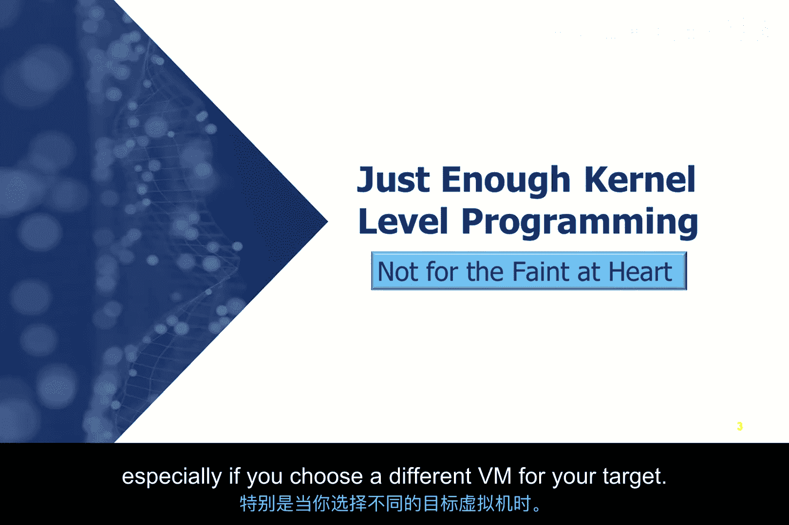
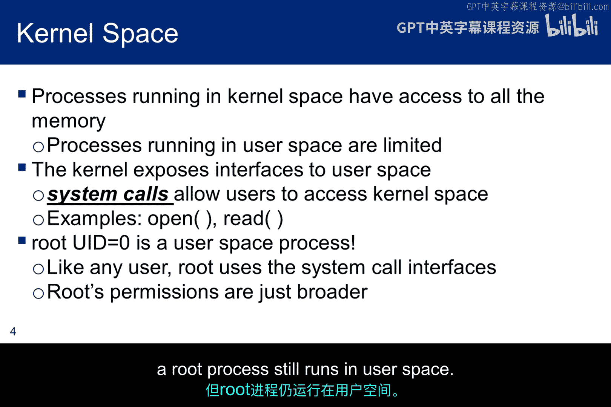
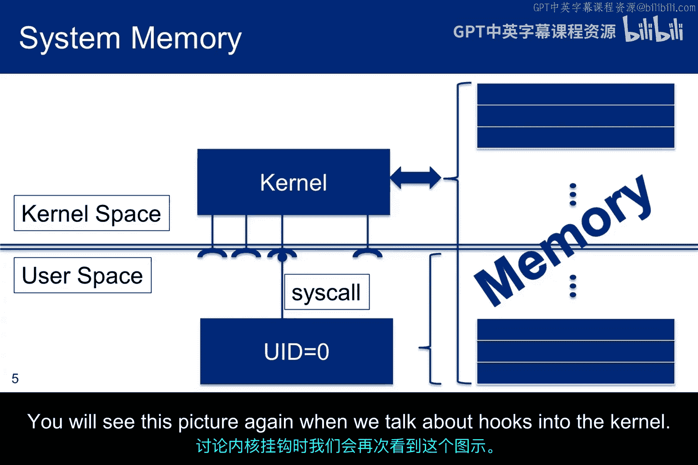
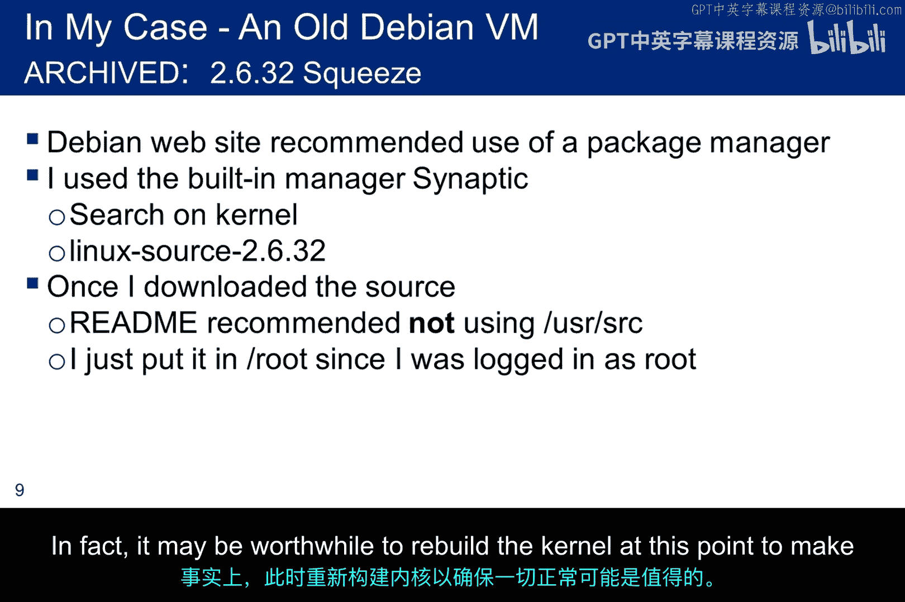
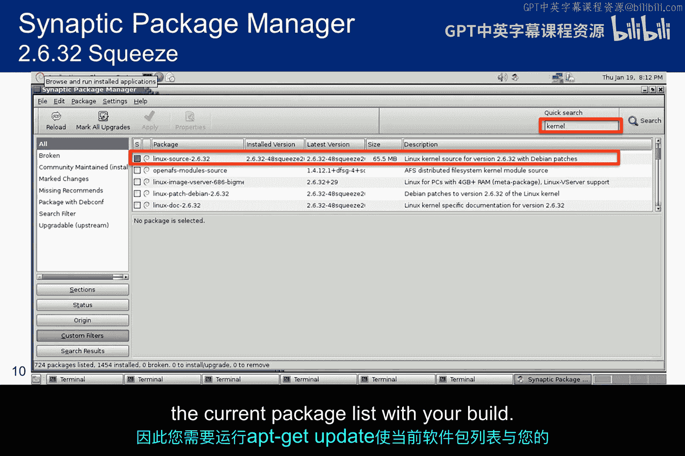
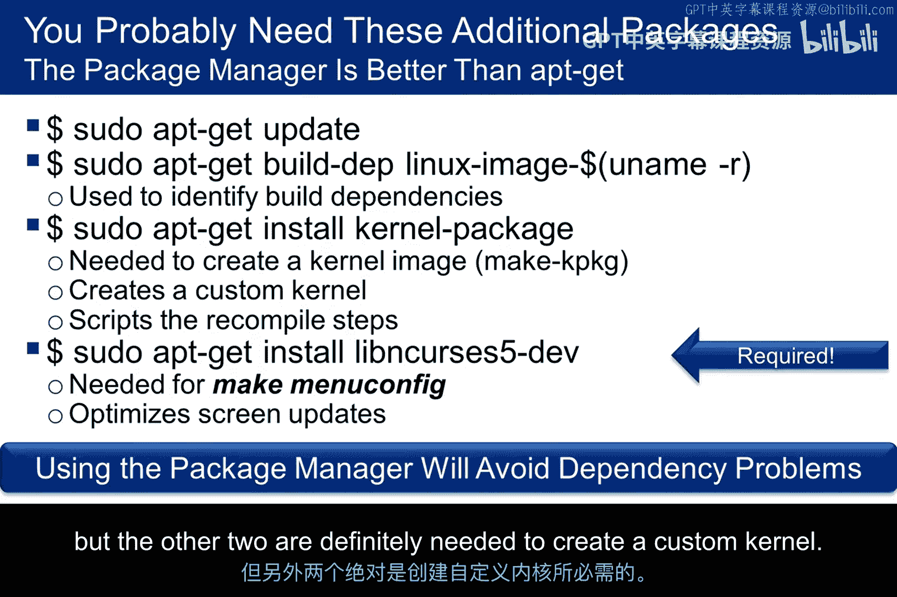
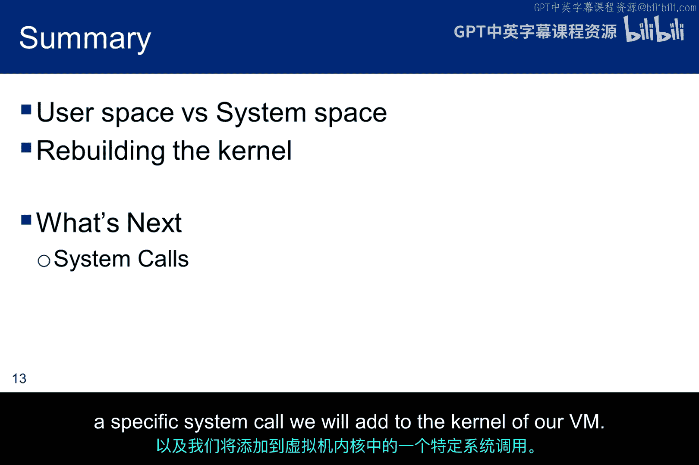

# 055：内核空间与用户空间

在本节课中，我们将要学习操作系统中的核心概念：内核空间与用户空间。理解这两者的区别是开发内核级工具（如Rootkit）的基础。我们将探讨系统调用的工作原理，并了解为何需要重新编译内核来添加自定义功能。

上一节我们介绍了课程背景，本节中我们来看看内核空间与用户空间的基本概念。

## 内核空间与用户空间概述

开发内核级Rootkit需要具备内核级别的编程能力。即使你是一名C语言程序员，也可能缺乏这方面的经验。本模块内容仅触及表面，但足以让Rootkit运行并理解其基本思想。

我的大部分知识来源于一篇关于从系统调用到钩子制作Rootkit基础的文章。我不确定Donnus是否为原作者，这篇文章似乎被许多人转载并声称是原创。无论如何，结合文章和本讲座，你应该能完成实验。

互联网上有很多关于系统调用的教程，但我发现它们帮助不大。因此，我不得不一步步调试Rootkit开发的各个环节。如果你选择不同的虚拟机作为目标，可能也需要这样做。

以下是本模块将涵盖的主题列表：
*   重建内核
*   探索可加载内核模块
*   理解Root权限与系统权限
*   钩住系统调用并隐藏进程

当我们开始探索系统调用时，需要重建内核。建议你创建一个可以随时重置的虚拟机，以防过程不顺利。

我们还将探索可加载内核模块，它们类似于Windows上的DLL。随着课程深入，我们将实际钩住系统调用。你会看到，Root访问权限对于创建内核级Rootkit至关重要，因为LKM需要以内核级权限运行。

最终目标是开发一个LKM来钩住一个系统调用，并隐藏一个正在运行的进程。

## 内核空间与用户空间的区别

第一步是理解内核空间和用户空间的区别，因为钩子操作发生**在内核空间**。

当我们对“系统级”的含义有了较好的直觉后，我想通过图表来精确展示各个操作发生的位置。

第一个重要概念是：运行在内核空间的进程可以**无限制地访问内存**，而运行在用户空间的进程则不能。这符合预期，目的是防止用户级进程相互干扰。

但用户进程有时需要访问系统调用。为此，内核向用户空间暴露了接口，用于实现诸如在文件系统中打开文件等功能。

你可能没有理解的一点是：**Root拥有的进程实际上也运行在用户空间**，并使用相同的系统调用API。

Root权限与系统权限截然不同。Root比标准用户拥有更多权限，但Root进程仍然运行在用户空间。

这张图表显示内核可以访问所有内存，而用户（即使是UID 0的Root用户）则不能。内核向用户空间暴露了系统调用接口，系统调用通过该接口请求内核提供服务。在我们讨论内核钩子时，会再次看到这张图。

## 准备重建内核

首先，我们将创建自己的简单系统调用，以理解其工作原理的细节。在本模块结束时，我们将钩住一个由开发人员内置到内核中的实际系统调用。

这种先创建自定义系统调用的方法意味着我们必须**重建内核**。建议你从一个不重要的虚拟机开始，以防其损坏。

可以为你现有的某个虚拟机创建快照，但我保守的做法是使用一个单独的虚拟机，原因如下：
1.  你可能没有为已安装的虚拟机下载内核源代码。
2.  即使现在下载，源代码与你已安装的补丁如何对齐也完全不清楚。

在继续之前，你肯定需要运行 `apt-get upgrade` 以确保拥有最新的软件包列表。如果你安装了一个新的虚拟机，可能不想为本次实验打内核补丁，因为以各种非标准方式打过补丁的内核源代码可能会导致问题。就我们的目的而言，我们并不关心这些补丁。

其次，一个较旧版本的Linux可能比最新的Ubuntu版本更容易理解和操作。我使用了一个旧的Debian虚拟机。你不必使用Debian，但需要弄清楚系统调用的管理方式，这可能因系统而异。即使是同一操作系统的不同版本，其系统调用表的组织方式也可能不同。

假设此时你已经安装了虚拟机并更新了软件包列表。下一个任务是下载源代码以便重新编译内核。

你可以下载整个构建的源代码，或者只下载内核源代码。以下是两种方法的语法。如果你只想下载内核源代码，请确保从内核存档中请求的版本与你正在运行的Linux版本完全一致。

虽然你下载的版本很可能与这里显示的语法不同，但访问内核存档并尝试查找如Wget语句中所示的内核源代码，可能是一个很好的学习工具。

如前所述，源代码通常需要放在 `/usr/src` 目录下，但你应该确认你决定使用的Linux版本确实如此。

以下是之前下载的内核源代码解压到该位置的语法。tar命令运行后，子目录由内核版本标识。

我使用了一个旧的Debian虚拟机，因为它已经安装在我的虚拟黑客环境中，并且我考虑删除它有一段时间了，因为Squeeze现已弃用并归档。这意味着这个构建已经打过很多补丁。我没有遇到源代码不匹配的问题，所以我之前的警告可能并不关键，至少对于内核源代码来说是这样。

当我访问Debian网站时，看到了推荐使用Synaptic软件包管理器而非Wget来下载源代码的建议。因此，我启动了软件包管理器，搜索“kernel”，并找到了我需要的Linux源代码。添加软件包后，Readme建议不要使用 `/usr/src`，所以我把它放到了 `/root` 目录下。对于你选择的虚拟机，可能会遇到类似的不同情况。请有条不紊地工作，以确保你的内核重新编译不会出错。事实上，此时重新构建内核以确保一切正常是值得的。

这张截图显示了我使用软件包管理器搜索内核源代码的过程。描述中实际上说它包含了所有的Debian补丁。因此，你肯定需要运行 `apt-get update` 以使当前软件包列表与你的构建对齐。

这张截图显示了tarball文件以及在Root主目录中解压后的源代码。

## 安装必要的编译工具

以下是重建内核所需的一些额外软件包。对于所有这些软件包，使用软件包管理器可能比apt-get更好，因为软件包管理器在解决依赖关系方面做得非常好。

以下是所需的软件包列表：
*   `build-dep`
*   `kernel-package`
*   `libncurses5-dev`

如果你使用软件包管理器，可能不需要 `build-dep`，但其他两个绝对是创建自定义内核所必需的。

## 本节总结

本节课中我们一起学习了内核空间与用户空间的核心区别，明确了Root权限仍属于用户空间的本质。我们还讨论了为重新编译内核而下载源代码和必要软件包的步骤。下一节，我将讨论系统调用以及我们将添加到虚拟机内核中的一个特定系统调用。